# LedgerProof — Hackathon Master Plan

**Problem statement:** Urban Furniture — Accounting System (Odoo Hackathon, 24 hours)

**Team:** 1 developer + Claude as pair programmer  |  **Repo:** `ledgerproof` (private)

> **The one sentence that explains this whole project:**
> Every number in this application is derived from one immutable table — `journal_item`. Nothing is ever summed from invoices. That single architectural choice is what 70-80% of competing teams will get wrong, and it is what a judge can verify in twenty seconds.

---

## Table of Contents

1. [The Decision and What We Are Building](#the-decision-and-what-we-are-building)
2. [Accounting Explained From Zero](#accounting-explained-from-zero)
3. [Complete Requirements — Everything We Must Build](#complete-requirements--everything-we-must-build)
4. [The Data Model](#the-data-model)
5. [The Core Engine — Posting and Reports](#the-core-engine--posting-and-reports)
6. [What Makes Us Win — Beyond the Spec](#what-makes-us-win--beyond-the-spec)
7. [Where AI Genuinely Makes This Better](#where-ai-genuinely-makes-this-better)
8. [Tech Stack, Architecture and Optimizations](#tech-stack-architecture-and-optimizations)
9. [The 24-Hour Build Plan](#the-24-hour-build-plan)
10. [The Demo Script and Judge Q&A](#the-demo-script-and-judge-qa)

> Each section is also a separate file in [`docs/`](docs/).

### Suggested reading order

**First hour:** 1 → 2 → 10.  **Before the event:** 9, 6.  **During the build (reference):** 3, 4, 5, 8.  **When time allows:** 7.

---


<a id="the-decision-and-what-we-are-building"></a>

# The Decision and What We Are Building

> Read this section first. Everything else in this document assumes the decisions made here.
> Reading time: about 14 minutes. Nothing here needs any accounting knowledge — every term is
> glossed the moment it appears.

---

> ### 📖 YOUR FIRST HOUR — the reading path
>
> This document is ten sections and it is far more than an hour of reading if you read it all.
> Do not read it all. Read **this** path first, in this order, and open the rest as reference
> while you build:
>
> | Order | What to read | Minutes | Why |
> |---|---|---:|---|
> | 1 | **This section**, all of it | 14 | The architecture decision and the one sentence that wins the demo |
> | 2 | *Accounting Explained From Zero* — §§2.1 to 2.8 (skip the glossary for now) | 25 | The eight ideas that make the code write itself |
> | 3 | *The Core Engine* — §5.1, §5.3, §5.4, §5.13 | 15 | The one hard component, and its pseudocode |
> | 4 | *The Demo Script and Judge Q&A* — §10.9, the one-page cheat sheet | 5 | What you will actually say out loud |
>
> That is 59 minutes and you will be able to start building.
>
> **Open later, while building, never front-to-back:** *Complete Requirements* (§3) is a
> checklist you tick, not prose you read. *The Data Model* (§4) is the schema you copy at
> hour 2. *Tech Stack, Architecture and Optimizations* (§8) is the scaffold you copy at hour 3.
> *The 24-Hour Build Plan* (§9) is the clock — pin it to a second monitor. *What Makes Us Win*
> (§6) and *Where AI Genuinely Makes This Better* (§7) matter from hour 14 onwards.

---

### 1. What we are building, in one paragraph

We are building the **accounting brain of a furniture business**. Urban Furniture buys tables
and chairs from suppliers, sells them to customers, and pays and gets paid by cash or bank.
Our app lets one person record all of that — who the customers and vendors are, what the
products are, a purchase order, a supplier's bill, a sales order, a customer's invoice, and
every payment — and then, without anyone typing a single number into a spreadsheet, the app
produces the three documents an owner actually cares about: **how much money the business has
and owes** (the Balance Sheet), **whether it made a profit this year** (the Profit & Loss
report), and **whether it is staying inside its planned spending** (the Budget report). The
trick — and the entire reason this is a hard problem rather than a form-filling exercise — is
that those three reports are *not* allowed to be built by adding up invoices. They must be
built out of the **ledger**: a single, permanent, tamper-resistant list of two-sided money
movements that every document writes into. Get that one thing right and this app is a real
accounting system. Get it wrong and it is a very pretty invoice list.

#### 1.1 The same idea, with real rupees

Forget accounting words for thirty seconds. Here is the whole concept.

Every time money or value moves, **two things change, by the same amount, in opposite
directions.**

You sell a table to Mr. Rahul for ₹6,000 on credit.

| What changed | Direction | Amount |
|---|---|---|
| "Money customers owe us" went **up** | Debit | ₹6,000 |
| "Sales income we earned" went **up** | Credit | ₹6,000 |

That pair of lines is called a **journal entry**. Each line is a **journal item**. "Debit" and
"credit" are just the names of the left and right side — think of them as the **left column**
and the **right column** of a two-column notebook. (They are *not* plus and minus, and they are
*not* good and bad. Section 2 explains why in one page.) The rule that both sides must total
the same is called **double-entry**, and it is 530 years old.

Now Rahul pays ₹6,000 into your bank account:

| What changed | Direction | Amount |
|---|---|---|
| "Bank" went **up** | Debit | ₹6,000 |
| "Money customers owe us" went **down** | Credit | ₹6,000 |

Two entries, four lines, and now the ledger already knows *everything*:

- Bank balance = add up every line touching Bank → ₹6,000.
- Customers owe us = ₹6,000 − ₹6,000 = ₹0.
- Income this year = ₹6,000.

Nobody read the invoice table to get those three numbers. **That is the whole architecture.**
The reports are just different ways of adding up the same four lines.

The buckets — "Bank", "Money customers owe us", "Sales income" — are called **accounts**, and
the master list of them is the **Chart of Accounts**. The organizers' mockup pins down exactly
**eight** of them that must ship pre-loaded:

> Bank A/c · Cash A/c · Debtors A/c (money customers owe us) · Creditors A/c (money we owe
> suppliers) · Sales Income A/c · Purchase Expense A/c · Other Expense A/c · Capital A/c (the
> owner's own money in the business).

We ship **twelve**: those eight, plus four of our own — **Input GST A/c** and **Output GST
A/c** (because the PDF's Sales Order row lists a `Tax` field, and tax money is not income),
and **Retained Earnings** and **Current Year Earnings** as non-postable label rows on the
Balance Sheet. Every one of the four extra accounts is tagged `[ADDITION]` in *Complete
Requirements* §3.9 with its justification. **Never present the extra four as if the organizers
asked for them** — present them as the four things the drawn Balance Sheet cannot tie without.

If any of the above was new to you, *Accounting Explained From Zero* walks through all five
transaction types line by line. You do not need more than the two tables above to understand
the rest of *this* section.

---

### 2. Why this problem statement, and not the other two

Three problem statements were on the table. We ran three rounds of analysis. This one won, and
it was not close. Here is the reasoning in plain terms, because you will be asked "why did you
pick accounting?" at least twice during the event.

| | **Urban Furniture Accounting** (chosen) | **DealFlow360** (Sales) | **PeoplePay360** (HR/Payroll) |
|---|---|---|---|
| Screens to build | **~30–38** (mostly simple list + form) | ~18 | ~33 |
| Genuinely hard **engines** (see below for what an engine is) | **1** — the posting engine, plus the reports derived off it | **~9** — e.g. "which warehouse ships these 8 chairs?", "does this discount need finance approval?", "how do we split a bill that is part subscription and part usage?" | **~14** — including a salary-rule interpreter, which is a small programming language with its own dependency graph |
| Second app to build | No | **Yes** — a separately-authenticated customer portal, mandated in writing | No |
| Est. minimum viable hours (prior analysis) | **22** | 55 | 34 |
| Est. hours to actually win | 33 | 80 | 55 |
| Completion risk (1–10, higher = worse) | **5** | 8 | 8 |
| How many teams pick it (1–10) | **4 — lowest** | 5 | 8 — highest |
| Is "correct" objectively checkable? | **Yes — the books balance or they don't** | No — subjective | Partly |

#### 2.1 The screens-vs-engines argument, in simple words

A **screen** is a page: a list of contacts, a form to add a product, a table of journal
entries. Screens are *repetitive*. Once you have built one list-and-form pair properly, the
twentieth one is the same shape with different column names. The organizers' own mockup says
this out loud:

> "All Master will have list view as default and clicking on **New** button it will open blank
> form view to enter new record. Clicking on already saved record — it will open form view with
> saved details."

That single sentence is a gift. It is the organizers telling us: **build one reusable
list/form scaffold and stamp it out.** One good generic component plus a config object per
model, and Contact, Product, Analytic Account, Chart of Accounts, Journal and Journal Entry all
come out of the same machine. This is exactly the kind of work an AI pair programmer multiplies
almost perfectly — the shape is known, the risk per screen is near zero, and a mistake on
screen 14 does not corrupt screen 3.

An **engine** is a piece of logic that makes a *decision* rather than storing a value. Each
engine has its own edge cases, its own wrong answers, and — the killer — each one has to be
**integrated** with the others and then **debugged as a system**. Integration debugging is the
one activity where AI does not multiply a solo developer. You cannot parallelise "why is the
approval chain firing twice when the portal counter-offer re-enters the flow". You just sit
there and read logs. That is human wall-clock time, and we have 19 build hours of it.

So the comparison is really:

- **DealFlow360**: ~18 screens (cheap) + **9 engines** (expensive) + a whole second
  authenticated app (expensive). The screens don't save us; the engines sink us.
- **PeoplePay360**: 33 screens **and** a salary-rule interpreter that is effectively a small
  compiler with cycle detection, plus a leave-balance ledger, plus five-role row-level
  security. Highest saturation too — everyone understands salary, so everyone picks it.
- **Accounting**: ~30–38 screens (cheap, and the mockup mandates the scaffold that makes them
  cheaper) + **exactly one hard engine**.

> **Say this to a judge:** "We picked the statement with the most screens and the fewest engines
> on purpose. Screens are cheap for us — the mockup itself asks for a reusable list/form
> scaffold, so we built one component and stamped out twenty views. Engines are where a small
> team dies, and this statement has exactly one: the posting engine. So we spent our first hours
> getting that single thing genuinely right instead of half-building nine things."

#### 2.2 The three secondary reasons

1. **Lowest saturation.** Fewest teams pick accounting, because double-entry sounds
   intimidating to anyone who hasn't done commerce. Fewer competitors in your track means your
   submission is compared against fewer strong ones.
2. **"Correct" is arithmetic here, not taste.** On a sales or HR statement, a judge decides
   subjectively whether your approval flow "feels" right. In accounting, either total debits
   equal total credits and Assets = Liabilities + Capital, or they don't. That is brutal for
   teams that fake it and *enormously* rewarding for a team that doesn't — because we can
   **guarantee** we clear a bar that is arithmetic.
3. **Five hundred years of features to steal from.** Accounting is a mature domain.
   Reconciliation (matching a payment to the invoice it settles), reversal entries, period lock
   dates, aging buckets, tamper-evident ledgers — every one of these is a real feature an Odoo
   engineer will instantly recognise, and no student team will think of them. Differentiation
   headroom is enormous. Those are covered in *What Makes Us Win*.

#### 2.3 The one precondition we are accepting

This pick has a non-negotiable cost: **before writing a single form, we spend the first ~60
minutes deriving on paper the exact debit and credit lines for all five transaction types**
(invoice, bill, customer payment, vendor payment, manual entry) and locking the schema so that
`journal_item` is the only source of truth for reports. Teams that start with forms discover at
hour 20 that their reports cannot be built, and no amount of UI polish saves that. This is
planned time, not lost time. *The 24-Hour Build Plan* Phase 1 is exactly this hour.

---

### 3. The core insight that wins this hackathon

Stated bluntly, with no hedging:

> **70–80% of the teams that pick this statement will compute their reports directly from the
> invoice and bill tables. Their journal-entry table will exist, get written to, and be read by
> nothing. It will be decoration.**
> **We derive every single report from journal entries. Nothing else. Ever.**

#### 3.1 What "the fake" actually looks like in code

The fake is not laziness — it is the *obvious* thing to do, which is why so many teams do it.
It looks like this:

```sql
-- THE FAKE. This is what 70-80% of submissions will contain.
-- Profit & Loss:
SELECT SUM(total) FROM customer_invoice WHERE state = 'CONFIRMED';  -- "income"
SELECT SUM(total) FROM vendor_bill      WHERE state = 'CONFIRMED';  -- "expense"
-- Balance Sheet:
SELECT SUM(amount) FROM payment WHERE method = 'BANK';              -- "bank balance"
```

It works. It demos fine. The numbers on screen look completely plausible. The `journal_entry`
table is populated on confirm, shown in a nice list view because the mockup demands one, and
then never queried again.

#### 3.2 What we do instead

Two notes before you read the SQL, so nothing in it is a surprise:

- Money is stored as **integer paise** in `BIGINT` columns named `debit_paise` and
  `credit_paise` — ₹6,000.00 is stored as `600000`. Floating-point money drifts; integers do
  not. Full reasoning in *The Data Model* §4.4.
- The state column is called `state` and its values are UPPERCASE (`DRAFT`, `POSTED`). Table
  names are snake_case. These conventions are fixed once in *The Data Model* and used
  identically everywhere in this document.

```sql
-- OURS. Every report is an aggregation over one table.

-- Balance Sheet as of date T  (cumulative, from the beginning of time):
SELECT a.type, SUM(ji.debit_paise - ji.credit_paise) AS balance_paise
FROM   journal_item  ji
JOIN   account       a  ON a.id  = ji.account_id
JOIN   journal_entry je ON je.id = ji.entry_id
WHERE  je.state = 'POSTED' AND je.date <= :T
GROUP  BY a.type;

-- Profit & Loss for a period [start, end]  (same table, different window,
-- income/expense accounts only):
SELECT a.type, SUM(ji.credit_paise - ji.debit_paise) AS amount_paise
FROM   journal_item  ji
JOIN   account       a  ON a.id  = ji.account_id
JOIN   journal_entry je ON je.id = ji.entry_id
WHERE  je.state = 'POSTED'
  AND  je.date BETWEEN :start AND :end
  AND  a.type IN ('INCOME','EXPENSE','OTHER_EXPENSE')
GROUP  BY a.type;
```

Two different ways of adding up **the same table**. The Balance Sheet is a *cumulative* sum
with no start date (it is a photograph of the business right now). The P&L is a *window* sum
over one year (it is a video of what happened during that year). This distinction — one table,
two aggregation semantics — is the architecture. It is worth memorising, because saying it out
loud in one sentence is the single highest-value sentence in your demo.

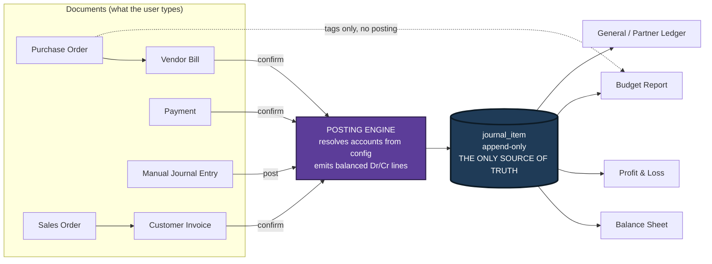

Notice two things about the diagram.

1. There is **no arrow from `customer_invoice` or `vendor_bill` straight to a report.** There is
   no such arrow in our codebase either — see the enforcement note in §3.5.
2. Even the **Manual Journal Entry goes through the posting engine.** It does not sneak
   sideways into the ledger. That is what makes the database-level balance rule apply to it as
   well, and it is why a judge cannot slip an unbalanced entry past us from any direction.

#### 3.3 The exact test a judge will run — and it takes 20 seconds

The judges are Odoo engineers. Odoo *is* an accounting system. They have shipped the `account`
module. They know exactly where the bodies are buried, and they will find them with these four
moves. Learn all four, because you should **run them yourself, unprompted, before they ask.**

| # | What the judge does | Fake system does | Our system does |
|---|---|---|---|
| **1** | **"Post a manual journal entry: Debit Cash ₹50,000, Credit Capital ₹50,000. Now show me the Balance Sheet."** | **Nothing changes.** The manual entry never touched the invoice table, and the report reads the invoice table. This is the kill shot and it takes ten seconds. | Cash jumps by ₹50,000, Capital jumps by ₹50,000, the sheet still balances — total assets go from ₹9,92,000 to ₹10,42,000, and so does the other side. |
| **2** | **"Add up your Balance Sheet in front of me. Do Assets equal Liabilities plus Capital?"** | Off by exactly the year's profit, because they never computed Current Year Earnings and pushed it into the equity side. ~90% of teams ship a sheet that doesn't tie. | Ties to the paisa, and we show the equation printed on screen with real figures. |
| **3** | **"Pay half of this ₹6,000 invoice."** | A `paid` boolean flips, or nothing happens. "Partial" is a status they can only set by hand. | Amount Due becomes ₹3,000, the status badge computes to **Partial**, Debtors on the Balance Sheet drops by exactly ₹3,000. |
| **4** | **"Change the Sales journal's default income account, then post a new invoice."** | Identical entry as before — proving the posting logic is a hardcoded `if/else`, not driven by the config table they built a screen for. | The new invoice credits the new account. The config screen is real. |

*(The ₹50,000 / ₹9,92,000 / ₹10,42,000 figures are the seeded demo state. They are fixed in
*The Demo Script and Judge Q&A* §10.1, which is the one place demo numbers are allowed to be
defined. If your seed script prints something different at T−2 hours, the demo section's
numbers change, not the seed.)*

**Why test 1 is the one that matters.** A manual journal entry is money movement that has no
invoice and no bill behind it — the owner putting money in, a bank charge, a rent payment, a
depreciation entry. Every real accounting system supports it, and the mockup explicitly
requires it (the "Journal Entry / Transaction Form" screen with the Post button and a blocking
warning when debits ≠ credits). If your reports read invoice tables, a manual entry is
invisible to them. **There is no way to patch around this at hour 22.** It is an architecture
decision made in hour 1 or never.

#### 3.4 The four smaller fakes we also refuse

1. **`paid: boolean` on the invoice.** Instead, Amount Due is *derived*:
   `total − SUM(allocated payments)`, and the Paid / Partial / Not Paid badge is computed from
   it, exactly as the mockup's legend box specifies (`Paid` if due = 0, `Not Paid` if
   due = total, otherwise `Partial`).
2. **Seed data typed in by hand until the numbers happen to tie.** Our seed data is generated by
   *running the app's own posting engine* over ~40 documents. If the engine is wrong, the seed
   data is visibly wrong. We cannot lie to ourselves.
3. **"Cancel" = `DELETE FROM journal_entry`.** In accounting you never delete anything.
   Cancelling a posted document creates a **reversal entry** — a mirror image with the debits
   and credits swapped — and both stay in the ledger forever.
4. **Reports that ignore the account *type*.** The mockup is explicit: account type is the
   routing key ("Each account is assigned an Account Type, which would further be used for how
   the account to be treated and where it appears in reports"). Bank → Balance Sheet Assets.
   Income → P&L. Hardcoding account *names* into report code fails the moment a judge adds a
   ninth account.

#### 3.5 How we make the rule impossible to break, even at 4 a.m.

An architectural rule that lives only in your head gets broken at hour 19 when you are tired.
So we enforce it mechanically. Three defences, none of which relies on you remembering
anything:

- **Directory boundary.** All report code lives in `lib/reports/`. A test (`npm test`) greps
  that directory for the strings `customer_invoice`, `vendor_bill`, `sales_order`,
  `purchase_order` and fails the build if any of them appears. If a report file mentions a
  document table, the check fails. *(Details in Tech Stack, Architecture and Optimizations
  §8.4.)*
- **Database-level balance rule.** A **deferred constraint trigger** — a database rule that
  Postgres checks at the *end* of a transaction rather than after each individual row, so a
  half-written entry is allowed mid-transaction but a lopsided one can never be committed —
  named `journal_entry_must_balance`, rejects any *posted* entry where
  `SUM(debit) != SUM(credit)`. Not an application check that a bug can route around: a database
  check that a `psql` session cannot route around either. **Draft entries are exempt** — you
  must be able to save a half-typed entry — and that is exactly what the mockup's "blocking
  warning" on the **Post** button means.
- **Append-only journal items.** No UPDATE, no DELETE on rows belonging to a posted entry, held
  by a trigger. Corrections happen through reversal entries.

The payoff: you can hand the laptop to a judge and let them try to break it. That is a very
different demo from one where you steer.

---

### 4. The one hard engine, named

Everything above rests on a single component. Name it out loud, and use its name consistently
in the code and in the demo:

**The posting engine.** One function, `postDocument()`, in one file,
`lib/services/posting.ts`. Input: any document (invoice, bill, payment, manual entry). Output:
a set of balanced journal items. It resolves *which* accounts to use by **reading configuration
rows** — the journal's default account, the account set on the document line, the contact's
receivable/payable account — never by an `if (documentType === 'invoice')` chain.

That is why test 4 in the table above passes: change the config row, the output changes. The
full design, the resolution order, the rounding strategy and the pseudocode live in *The Core
Engine*. Do not build anything else until that engine posts a correct invoice, a correct bill
and a correct payment.

Everything else in this build — all 30-plus screens, the sequences, the smart buttons, the
kanban views, the badges — is *plumbing around one correct engine.* That framing keeps the 19
hours honest.

---

### 5. What good looks like at hour 24

This is the acceptance checklist and the priority order. **Cut work from the bottom of the
list, never from the top.** The tier names below (T0 / T1 / T2 / T3) are used again as prefixes
on the flat checklist in *Complete Requirements* §3.14, so the two documents agree item by
item.

Three words appear below that you may not have met yet, glossed here rather than three sections
later:

- **equity** — the owner's side of the Balance Sheet: the money the owner put in (Capital) plus
  the profit the business has kept.
- **smart button** — a small button in a form's top-right corner that jumps to a related record
  (the `PO` button on a bill; the `Budget` button on an invoice).
- **kanban view** — the same records shown as cards instead of table rows. The mockup demands
  both a list and a kanban for Contact, Product, Analyticals and the Budget Report.

**Tier 0 — the spine. Without these there is no submission.**

- [ ] `journal_item` is the only table any report reads. Verified by the grep test in §3.5.
- [ ] Confirming a Vendor Bill auto-creates a balanced journal entry: Dr Purchase Expense /
      Cr Creditors, dated from the **bill's** date (not today), on the **Purchase** journal —
      all three exactly as the mockup annotates.
- [ ] Confirming a Customer Invoice auto-creates a balanced entry: Dr Debtors / Cr Sales
      Income, on the **Sales** journal.
- [ ] A manual journal entry can be posted, is **blocked** when debits ≠ credits, and
      immediately moves the Balance Sheet.
- [ ] Balance Sheet balances: Total Assets = Total Liabilities + Capital, including Current
      Year Earnings pushed into the equity side.
- [ ] P&L computes exactly per the mockup's formula box: Income from Sales = total of account
      type `INCOME`; Purchase Expense = total of type `EXPENSE`; Other Expense = total of type
      `OTHER_EXPENSE`; Net Income = Income − Expenses.
- [ ] Payments: partial payment works, Amount Due is derived, the Paid / Partial / Not Paid
      badge is computed and mutually exclusive.
- [ ] Chart of Accounts ships pre-seeded with the eight named accounts (plus our four
      `[ADDITION]` accounts); Journals pre-seeded with the four named journals (Sales,
      Purchase, Bank, Cash) each wired to its default account.

**Tier 1 — the spec surface a judge will tick off screen by screen.**

- [ ] Login / Sign Up / **Create User (admin)** with the exact credential rules from the mockup
      (login id unique, 6–12 chars; password > 8 chars with a lowercase, an uppercase and a
      special character) and the exact error string **"Invalid Login Id or Password"**.
- [ ] Master data: Contact, Product, Analytic Account each with **list view (default) + kanban
      view + form view** and a working two-way view switcher; image upload showing in both list
      and kanban.
- [ ] PO → Vendor Bill and SO → Customer Invoice conversions carrying vendor/customer, product,
      price and quantity forward.
- [ ] Auto sequences in the exact drawn formats: `PO0001` and `SO0001` with **no year
      segment**, `Bill/2026/0001` and `INV/2026/0001` **with** one — and each separate from the
      user-typed Reference field.
- [ ] Conditional smart buttons: the PO/SO button appears only when the document was created
      from a source order, hidden when created fresh.
- [ ] Budget: Draft → Confirm → Revised → Cancelled state machine; Revise **creates a new
      record**, moves the old one to Revised, links both ways, and appends the word " Revised"
      to the name; Achieved Amount / Achieved % / Amount To Achieve visible only when
      Confirmed.
- [ ] Budget Report in list **and** kanban views, with the per-row pie chart (Achieved vs
      Balance).
- [ ] Non-blocking over-budget warning on confirming a PO **and** on confirming a Bill — warn,
      then let the user proceed. Two hook points, same message, exact wording.
- [ ] PDF download on the P&L and Balance Sheet Print buttons.
- [ ] Dashboard with live state counters (Sales All / Confirmed / Draft, Purchase All /
      Confirmed / Draft, Budget Achieved / Budget / Committed).
- [ ] All 16 mega-menu destinations resolve, including the **Receipt** and **Payment** menu
      entries (one `payments` table, two filtered lists).

**Tier 2 — the differentiators that turn "complete" into "winner".** (Detailed in *What Makes
Us Win*; listed here so hour-24 expectations are honest.)

- [ ] A **Books Integrity** page: re-verifies every entry balances, prints Trial Balance 0.00,
      prints the accounting equation with live figures.
- [ ] **Bank statement CSV import with scored auto-reconciliation** — the loudest 45 seconds of
      the demo.
- [ ] **Drill-down with no dead ends:** Balance Sheet number → ledger → document → its journal
      entry → the payment.
- [ ] **As-of date slider** on the Balance Sheet that re-derives the whole report at any past
      date.

**Tier 3 — cut without guilt if the clock demands it.** Portal role for the Contact actor;
email send from the payment gear menu; Forgot Password page; reversal-on-cancel and the period
lock date (both are on the build plan's bench); stock/COGS reporting.

> **Non-negotiable process gate:** features freeze at **T+18 of 24 — that is T−6 hours** — see
> *The 24-Hour Build Plan*, GATE 3. The last six hours are hardening, seed data, deployment and
> **three timed rehearsals**. The demo is the scoring surface, not the repo. Two extra hours of
> features is the difference between one rehearsal and three, and the rehearsals are worth more.

---

### 6. The 60-second elevator pitch

Use these words when a judge walks up mid-event. Do not improvise the first two sentences —
they do all the work. Have the Books Integrity page and the Balance Sheet already open in two
tabs.

> "This is a double-entry accounting system for a furniture business — purchase orders, vendor
> bills, sales orders, customer invoices, payments, budgets, and the three reports: Balance
> Sheet, Profit & Loss, and Budget.
>
> Here's the part that matters. Most systems you'll see today compute their Profit & Loss by
> adding up the invoice table. Ours can't — it's architecturally incapable of it. Every document
> we confirm goes through one posting engine that writes balanced debit and credit lines into a
> single append-only table, `journal_item`. Every report is a pure aggregation over that one
> table. The Balance Sheet is a cumulative sum up to a date; the P&L is a window sum over a
> period. Same table, two semantics.
>
> Let me prove it rather than claim it. *(Post a manual journal entry: Dr Cash ₹50,000 /
> Cr Capital ₹50,000.)* No invoice, no bill — just a journal entry. *(Switch tab.)* Balance
> Sheet moved — assets went from nine lakh ninety-two thousand to ten lakh forty-two thousand —
> and it still balances: Assets equal Liabilities plus Capital, to the paisa. A system that sums
> invoices shows nothing there.
>
> And it's config-driven, not hardcoded — change the Sales journal's default account and the
> next invoice posts to the new one. Want to try and break it?"

**Timing:** roughly 55 seconds spoken at a calm pace. The pause while you post the manual entry
is the strongest three seconds you own — do not fill it with talking.

**Three follow-up questions you will get, and the one-line answers:**

| They ask | You say |
|---|---|
| "Does it handle partial payments?" | "Yes — Amount Due is derived from allocated payments, never a boolean. Pay half and the badge computes to Partial and Debtors drops by exactly that half." |
| "What happens if I cancel a posted invoice?" | "There's no Edit button on a posted document. Cancel generates a reversal entry — mirrored debits and credits — and both stay in the ledger. In accounting you never delete anything." |
| "Where does the Budget's Achieved amount come from?" | "Journal items tagged with that analytic account, filtered to the budget period and to profit-and-loss accounts. Income achievement from sales invoices, expense achievement from vendor bills — the direction the mockup specifies. Computing it from the ledger rather than from invoice totals also means GST is excluded automatically, which is the correct answer." |

The full five-minute script, the thirty-one anticipated questions and the one-page cheat sheet
are in *The Demo Script and Judge Q&A*.

---

### 7. What this section deliberately leaves to others

So you know where to look next, and so we do not repeat ourselves. These are the exact section
titles:

| Section | What it owns that this section does not |
|---|---|
| **Accounting Explained From Zero** | Debit/credit for all five transaction types worked in rupees, tax explained from zero, the accounting equation proof, the glossary. |
| **Complete Requirements — Everything We Must Build** | Every screen, every field, all 62 hidden requirements found in the drawing, the contradictions and our rulings, the flat checklist. |
| **The Data Model** | Every table, column and constraint — including `payment_allocation`, the join table that makes partial payments possible and that teams cannot retrofit later. It is the **owner of the naming and type conventions** used across this whole document. |
| **The Core Engine — Posting and Reports** | The config resolution order, pseudocode, rounding strategy, the report algorithms and the balance constraint. |
| **What Makes Us Win — Beyond the Spec** | The Books Integrity page, bank reconciliation, the as-of slider, drill-down, and what to build only if you are ahead. |
| **Where AI Genuinely Makes This Better** | The two AI features that earn their place, and the sentence to say when they are cut. |
| **Tech Stack, Architecture and Optimizations** | The stack choice, the folder layout, and the list/form scaffold that turns 30 screens into config files. |
| **The 24-Hour Build Plan** | The clock. Phases, gates, the seed-data plan, and the exact cut order when we fall behind. **It is authoritative on time — where any other section quotes hours, this one wins.** |
| **The Demo Script and Judge Q&A** | The five-minute script, the numbers you say out loud, and the answers. **It is authoritative on demo figures.** |

---


<a id="accounting-explained-from-zero"></a>

# Accounting Explained From Zero

> **Read this section once, slowly, before you write a single line of code.**
>
> You are about to build an accounting system. You do not need to become an accountant. But you
> *do* need to understand about eight ideas properly, because those eight ideas are the entire
> architecture. If you understand them, the code writes itself and the reports come out correct
> by construction. If you don't, you will end up writing `SELECT SUM(total) FROM invoices` —
> which is exactly the mistake that 70–80% of the other teams will make, and exactly the mistake
> an Odoo judge can spot in twenty seconds.
>
> Everything in this section is explained from zero. Every term is defined the first time it
> appears. Every number is a real rupee number you can check with a calculator.
>
> **If you only have 25 minutes:** read §2.1 → §2.8 and stop. §2.9 (analytics and budgets) can
> wait until you build the budget screens; §2.12 is a glossary to look things up in, not to
> read.
>
> **Where you see a box like this:**
>
> > 🎤 **SAY THIS TO A JUDGE** — a sentence or two you can say out loud, word for word, if a
> > judge walks up and asks a domain question. These are written to be said, not read.

---

### 2.1 What a business actually needs to track, and why

Meet the running example we use for the whole document.

**Urban Furniture** is a furniture shop. It buys tables, chairs and sofas from suppliers, and
sells them to customers. It has a bank account, a cash drawer at the counter, and one owner who
put money in to start the shop.

Here is a normal week at Urban Furniture:

| Day | What happened | Money moved? |
|---|---|---|
| Mon | Owner puts ₹5,00,000 of his own money into the shop's bank account | Yes, in |
| Tue | Orders 20 wooden chairs from Azure Furniture at ₹1,200 each | **No** — just a promise |
| Wed | Chairs arrive with a bill for ₹24,000, payable in 30 days | **No** — but the shop now *owes* ₹24,000 |
| Thu | Pays Azure ₹20,000 by bank transfer | Yes, out |
| Fri | Walk-in customer buys a dining table for ₹6,000, pays cash | Yes, in |
| Fri | Nimesh Pathak buys 5 office chairs for ₹40,000, will pay next month | **No** — but Nimesh now *owes* ₹40,000 |
| Sat | Pays shop rent ₹3,000 in cash | Yes, out |

Now ask the owner four questions:

1. **How much money do I have right now?** (Bank + cash drawer.)
2. **How much do people owe me?** (Nimesh owes ₹40,000.)
3. **How much do I owe other people?** (Azure is still owed ₹4,000.)
4. **Did I make money this month, or lose it?**

Notice something important. Question 4 is **not** "how much cash came in minus how much went
out". The shop sold ₹46,000 of furniture on Friday but only ₹6,000 of it arrived as cash. A
bank balance tells you nothing about whether the business is profitable.

That gap — between *cash moving* and *value being earned or owed* — is the entire reason
accounting exists. Accounting is a bookkeeping method that tracks **promises** and **money** in
the same system, so that all four questions have exact answers at any moment.

The method that does this is called **double-entry bookkeeping**. It was formalised in Venice
and written down by a monk named Luca Pacioli in 1494. It has not needed a major change in 530
years. That should tell you it is worth understanding rather than working around.

> 🎤 **SAY THIS TO A JUDGE**
> "The whole point of the system is that cash movement and value movement are different things.
> Nimesh took ₹40,000 of chairs on Friday and paid nothing. Our bank balance didn't move, but
> our Debtors went up ₹40,000 and our Sales Income went up ₹40,000 — and the books still
> balanced. That's why we post journal entries instead of just tracking payments."

---

### 2.2 Double-entry bookkeeping: why everything is written twice

#### The core idea, in one sentence

**Every transaction is written down twice: once for where the value came FROM, and once for
where the value went TO.**

That's it. That is double entry. The rest is vocabulary.

Think of it like a physics law. Money and value don't appear from nowhere and don't vanish. If
₹6,000 shows up in the cash drawer, it came from *somewhere* — in this case, from selling a
table. So you record two facts, not one:

```
Cash drawer went UP by  ₹6,000     ← where it went TO
Sales earned went UP by ₹6,000     ← where it came FROM
```

Two numbers, always equal. Written on one record, side by side.

#### What "debit" and "credit" ACTUALLY mean

Forget everything you half-remember from school. Here is the truth, which nobody tells you
plainly:

> **"Debit" means the LEFT column. "Credit" means the RIGHT column. That is all they mean.**

They are not "good" and "bad". They are not "plus" and "minus". They are not "money in" and
"money out". They are just the names of the two columns on the page, chosen in Italy in the
1400s. *Debit* comes from Latin *debere* ("he owes"); *credit* from *credere* ("he trusts").
Those original meanings are now irrelevant. They are column labels.

Every accounting record looks like this:

| Account | **Debit** (left) | **Credit** (right) |
|---|---:|---:|
| Cash A/c | 6,000 | |
| Sales Income A/c | | 6,000 |
| **Total** | **6,000** | **6,000** |

The two totals must match. Always. No exceptions, ever, in any correct accounting system on
earth.

#### The practical rule that actually helps you

Here is the working rule you will use a hundred times while building this app:

> **CREDIT = where the value came FROM (the source).**
> **DEBIT = where the value went TO (the destination).**

Try it on the cash sale. The value *came from* making a sale, so `Sales Income` is credited.
The value *went to* the cash drawer, so `Cash` is debited. Correct.

Try it on paying the vendor ₹20,000. The value *came from* the bank, so `Bank` is credited. The
value *went to* wiping out part of what you owe Azure, so `Creditors` is debited. Correct.

This "from → to" rule gets you the right answer for every one of the transactions Urban
Furniture will ever record. Memorise it.

#### The mechanical rule (the lookup table)

When you're coding, you want a table, not a metaphor. Here it is. Read it as "to make this kind
of account go **up**, put the amount in this column":

| Account family | To INCREASE it | To DECREASE it | Its normal side |
|---|---|---|---|
| **Asset** (Cash, Bank, Debtors) | Debit | Credit | Debit |
| **Expense** (Purchase Expense, Rent) | Debit | Credit | Debit |
| **Liability** (Creditors) | Credit | Debit | Credit |
| **Capital** (Owner's money) | Credit | Debit | Credit |
| **Income** (Sales Income) | Credit | Debit | Credit |

Two families increase on the **debit** side: **Assets and Expenses**. Three families increase
on the **credit** side: **Liabilities, Capital and Income**. That split is the single most
useful fact in this document, and it will reappear in §2.6 as the reason the Balance Sheet
balances.

A memory hook that works: **"A-E-D"** — **A**ssets and **E**xpenses are **D**ebit-natured.
Everything else is credit-natured.

#### Why they MUST be equal

Because they describe the same event from two sides. If ₹6,000 of value went somewhere, ₹6,000
of value came from somewhere. Writing down a different number on each side would be like saying
a train left Mumbai with 200 passengers and arrived in Pune with 150 — you'd know instantly that
you'd lost track of something.

So the system enforces it as a hard law:

```
For every POSTED journal entry:   SUM(debit of all lines)  ==  SUM(credit of all lines)
```

The organizers' mockup states this in red ink, twice, in two different places:

- On the manual journal entry screen: *"Blocking warning if the debit and credit amount don't
  match"* — you literally cannot press Post.
- On the invoice and bill confirm notes: *"The Journal Entry should always be balanced / That is
  the debit and credit totals need to match"*.

This is not a suggestion. In our build it is a **database-level constraint**, not just a
JavaScript check. Note the word **POSTED** in the rule above: a **draft** entry — one you are
still typing — is allowed to be lopsided, because otherwise you could not save a half-finished
entry at all. The rule binds at the moment you press **Post**, which is exactly what the
mockup's "blocking warning on Post" means. (*The Core Engine* §5.2.3 and *The Data Model* §4.8
show the trigger; here you just need to know why it's non-negotiable.)

---

### 2.3 Four worked examples with real rupees

These four are the entire transaction vocabulary of Urban Furniture. Every screen in the app
produces one of these shapes. *(Tax is left out until §2.4.1, deliberately — the mockup's own
line grids have no tax column and its sample line is a clean `3 × 2000 = 6000`.)*

#### Example 1 — Cash sale (₹6,000)

*A walk-in customer buys a dining table for ₹6,000 and pays cash on the spot.*

Where did the value come **from**? The shop earned it by selling. → `Sales Income A/c`, credit.
Where did it go **to**? The cash drawer. → `Cash A/c`, debit.

| Account | Partner | Debit | Credit |
|---|---|---:|---:|
| Cash A/c | — | 6,000 | |
| Sales Income A/c | — | | 6,000 |
| | | **6,000** | **6,000** |

Cash (asset) up ₹6,000. Income up ₹6,000. Balanced.

#### Example 2 — Credit sale (₹40,000)

*Nimesh Pathak buys 5 office chairs at ₹8,000 each = ₹40,000. He'll pay next month. This is a
**Customer Invoice**.*

Value came **from** the sale. → `Sales Income A/c`, credit ₹40,000.
Value went **to**... where? Not cash — no cash moved. It went into a *promise*: Nimesh owes us
₹40,000. That promise is an **asset** of the shop. The account that holds "money customers owe
us" is called **Debtors** (also called *Accounts Receivable*). → `Debtors A/c`, debit ₹40,000.

| Account | Partner | Debit | Credit |
|---|---|---:|---:|
| Debtors A/c | Nimesh Pathak | 40,000 | |
| Sales Income A/c | — | | 40,000 |
| | | **40,000** | **40,000** |

**This is the transaction that proves your system is real.** A fake system that computes revenue
from cash received would show ₹0 income here. A real system shows ₹40,000 of income and ₹40,000
of debtors, and the bank balance untouched.

Note the `Partner` column. The debtors line carries the contact name; the income line doesn't
need one. The mockup's journal entry wireframe shows exactly this — a Partner column on the line
grid, filled on one line and blank on the other.

#### Example 3 — Purchase on credit (₹24,000)

*20 wooden chairs arrive from Azure Furniture with a bill for ₹24,000, payable in 30 days. This
is a **Vendor Bill**.*

Value came **from** the vendor, who has effectively lent us the goods. We now owe them. "Money
we owe suppliers" is a **liability** account called **Creditors** (also called *Accounts
Payable*). → `Creditors A/c`, credit ₹24,000.
Value went **to** the cost of goods we bought. → `Purchase Expense A/c`, debit ₹24,000.

| Account | Partner | Debit | Credit |
|---|---|---:|---:|
| Purchase Expense A/c | Azure Furniture | 24,000 | |
| Creditors A/c | Azure Furniture | | 24,000 |
| | | **24,000** | **24,000** |

This is exactly the entry the mockup draws in its "Demo Journal Entry" panel: the account column
shows `Purchase A/c` on one row and `Creditor A/c` on the other, and the note says *"In case of
bill journal would always be Purchase"*.

#### Example 4 — Payment received (₹25,000)

*Nimesh pays ₹25,000 of his ₹40,000 into our bank account. A **partial payment**.*

Careful here — this is where beginners go wrong. **This is NOT income.** The income was already
recorded on the day of the sale (Example 2). Recording it again would double-count our revenue.
What is happening is only that one asset is turning into another: a *promise* is turning into
*money*.

Value came **from** the promise. Nimesh owes us ₹25,000 less now. Debtors is an asset that must
go **down**, and assets go down on the credit side. → `Debtors A/c`, credit ₹25,000.
Value went **to** the bank. → `Bank A/c`, debit ₹25,000.

| Account | Partner | Debit | Credit |
|---|---|---:|---:|
| Bank A/c | Nimesh Pathak | 25,000 | |
| Debtors A/c | Nimesh Pathak | | 25,000 |
| | | **25,000** | **25,000** |

After this, Nimesh still owes ₹15,000. That leftover figure has a name: the **residual** (also
called *amount due* or *outstanding*). It is **never a stored number and never a boolean flag**
— it is computed every time as `invoice total − sum of payments allocated to that invoice`. The
mockup calls it `Amount Due` and gives the formula `Total - Amount Paid`, and uses it to drive
the three status badges:

| Badge | Condition (mockup, verbatim) |
|---|---|
| **Not Paid** | amount due = invoice total |
| **Partial** | amount due < invoice total (and above zero) |
| **Paid** | amount due = 0 |

> ⚠️ **Build note (an engineering point, not a spec point):** never store a `paid` boolean on
> the invoice. Compute the residual from the payments actually recorded. A boolean cannot
> represent Nimesh's ₹15,000, and "pay half of this invoice" is one of the specific probes a
> judge uses to find a fake.

#### Two more you will need (they use the same machinery)

**Owner puts in capital ₹5,00,000.** Came from the owner → `Capital A/c` credit. Went to the
bank → `Bank A/c` debit.

**Paying the vendor ₹20,000 from the bank.** Came from the bank → `Bank A/c` credit. Went to
reducing what we owe → `Creditors A/c` debit.

---

### 2.4 The five account types (and the twelve accounts we actually ship)

An **account** is just a labelled bucket. Every rupee of every transaction has to land in some
bucket. The full list of buckets is the **Chart of Accounts** — literally "the list of
accounts", abbreviated **CoA**.

The PDF names five families. Here they are with the shop's real accounts:

| Family | Plain-English meaning | Urban Furniture's accounts | Increases on | Appears on |
|---|---|---|---|---|
| **Asset** | Things the shop **owns** or is **owed** | Bank A/c, Cash A/c, Debtors A/c | Debit | Balance Sheet |
| **Liability** | Things the shop **owes** to outsiders | Creditors A/c | Credit | Balance Sheet |
| **Capital** | What the **owner** has put in / is owed by the business | Capital A/c | Credit | Balance Sheet |
| **Income** | Value **earned** by trading | Sales Income A/c | Credit | Profit & Loss |
| **Expense** | Value **consumed** to trade | Purchase Expense A/c, Other Expense A/c | Debit | Profit & Loss |

Notice the last column. **The account's type decides which report it appears on.** This is the
routing rule of the whole reporting engine, and the mockup states it explicitly: *"Each account
is assigned an Account Type, which would further be used for how the account to be treated and
where it appears in reports."*

#### The eight leaf types the mockup demands

The mockup's "New Account" form draws a **grouped dropdown** with non-selectable headings:

```
Balancesheet          ← heading only, NOT selectable
    Asset
    Liability
    Bank
    Capital
    Cash
Profit and Loss       ← heading only, NOT selectable
    Income
    Expenses
    Other Expenses
```

So `Bank` and `Cash` are their own types, sitting *inside* the Balance Sheet group. That is not
a contradiction of the five families — it's a refinement. Bank and Cash are both assets; they
get their own type so the Balance Sheet can print them as separate named rows, which is exactly
what the mockup's Balance Sheet does (`Bank`, `Cash`, `Debtors` as three distinct asset rows).

> **Two resolutions you need to make now, because the mockup is slightly inconsistent with
> itself.**
>
> **(a) Which type does each seeded account get?** The Chart of Accounts *list* screen shows
> `Bank A/c — Assets` and `Cash A/c — Assets`, but the Balance Sheet mapping note says
> `Bank - Account type Asset - Bank` and `Cash - Account type Asset - cash`. Read together, the
> intent is clear: **Bank A/c gets type `BANK`, Cash A/c gets type `CASH`, Debtors A/c gets type
> `ASSET`, and all three roll up into the Assets column.** Build it that way — it satisfies both
> annotations, and it means your Balance Sheet rows are driven by type rather than by matching
> account names as strings. *(Labelled clearly as an interpretation, not an invention: it is the
> only reading under which both mockup notes are simultaneously true.)*
>
> **(b) How does the code find "the receivable account"?** The type `ASSET` covers Debtors,
> Input GST and any future asset. When the posting engine needs *the* customer-receivable
> account, matching on the name `"Debtors A/c"` would be exactly the string-matching we forbid.
> So each account also carries a small **role tag**, `subtype`
> (`NONE | RECEIVABLE | PAYABLE | TAX_INPUT | TAX_COLLECTED | …`). `type` decides which report
> row the account lands in; `subtype` lets the engine ask for a role. Full definition in *The
> Data Model* §4.6; the posting engine's resolution order is in *The Core Engine* §5.3.

#### The twelve seed accounts (must ship pre-configured)

The mockup carries an orange note next to the Chart of Accounts: *"All this accounts are to be
pre configured"*. These eight rows, in this order, are mandated seed data:

| # | Account Name | Type (mockup label) | Type we store | Subtype | Family | Report |
|---|---|---|---|---|---|---|
| 1 | Bank A/c | Assets | `BANK` | `NONE` | Asset | Balance Sheet |
| 2 | Purchase Expense A/c | Expense | `EXPENSE` | `NONE` | Expense | P&L |
| 3 | Debtors A/c | Assets | `ASSET` | `RECEIVABLE` | Asset | Balance Sheet |
| 4 | Creditors A/c | Liabilities | `LIABILITY` | `PAYABLE` | Liability | Balance Sheet |
| 5 | Sales Income A/c | Income | `INCOME` | `NONE` | Income | P&L |
| 6 | Cash A/c | Assets | `CASH` | `NONE` | Asset | Balance Sheet |
| 7 | Other Expense A/c | Expense | `OTHER_EXPENSE` | `NONE` | Expense | P&L |
| 8 | Capital A/c | Capital | `CAPITAL` | `NONE` | Capital | Balance Sheet |

Note the stored enum values are **singular** — `EXPENSE`, `OTHER_EXPENSE` — even though the
mockup's dropdown *displays* "Expenses" and "Other Expenses". The display label lives in a
lookup map; the enum value is what the code compares. Getting this wrong in one place makes the
P&L's "Other Expense" row silently print ₹0.00.

`Other Expense A/c` exists because the mockup's P&L prints `Purchase Expense` and `Other
Expense` as two separate lines. Rent, electricity and salaries go to Other Expense; the cost of
furniture bought for resale goes to Purchase Expense.

**Four more accounts we add, tagged `[ADDITION]`:**

| # | Account Name | Type | Subtype | Why it earns its place |
|---|---|---|---|---|
| 9 | Input GST A/c | `ASSET` | `TAX_INPUT` | Tax we paid on purchases and can reclaim. Without it, a taxed bill cannot balance. |
| 10 | Output GST A/c | `LIABILITY` | `TAX_COLLECTED` | Tax we collected on sales and owe the government. Without it, a taxed invoice cannot balance. |
| 11 | Retained Earnings | `CAPITAL` | `NONE` | A non-postable label row: profit from previous, closed years. |
| 12 | Current Year Earnings | `CAPITAL` | `NONE` | A non-postable label row: this year's profit, computed at report time. Without a row to print it on, the Balance Sheet cannot tie. |

Accounts 9 and 10 exist because the PDF's Transaction Flow table lists **Tax** on the Sales
Order line ("Select Customer, Product, Quantity, Unit Price, **Tax**"). Accounts 11 and 12 are
never posted to — they exist so the report has a labelled row. See §2.4.1 and §2.6.

> 🎤 **SAY THIS TO A JUDGE**
> "Nothing in our reports is hardcoded to an account name. Every account carries an account type,
> and the type is what routes it — Bank, Cash and Asset types roll into the Balance Sheet assets
> column; Income, Expense and Other Expense roll into the P&L. If you add a ninth account right
> now and post to it, it appears in the right report without us touching any code."

---

### 2.4.1 Tax, and why it is not income

The mockup's line grids have no tax column at all: its sample line is `3 × 2000 = 6000` and its
totals are pure `qty × price`. But the **PDF** lists a `Tax` field on the Sales Order. So we
build tax, defaulted to **0%**, which means the screen still reproduces the mockup exactly while
the PDF's requirement is real and demonstrable. *(The full ruling is in Complete Requirements
§12.5.)*

Once tax exists, you need one idea, and it is the idea most student teams get wrong.

> **GST you charge a customer is not your money. You are collecting it on the government's
> behalf and you will hand it over. So it is a LIABILITY, not INCOME.**

Here is the same ₹40,000 sale from Example 2, now with 18% GST — and these are the exact numbers
you will demo, because the customer-invoice beat in the demo script is this entry.

*Nimesh buys 5 office chairs at ₹8,000 each. Net ₹40,000. GST at 18% = ₹7,200. He is invoiced
₹47,200 in total.*

| Account | Type | Debit | Credit | Why |
|---|---|---:|---:|---|
| Debtors A/c | `ASSET` | 47,200 | | Nimesh owes us the **whole** ₹47,200, tax included |
| Sales Income A/c | `INCOME` | | 40,000 | What we actually earned |
| Output GST A/c | `LIABILITY` | | 7,200 | What we owe the government |
| | | **47,200** | **47,200** | Balanced |

Check the arithmetic yourself: 40,000 × 0.18 = 7,200. 40,000 + 7,200 = 47,200. And
40,000 + 7,200 = 47,200 on the credit side. ✅

**If you booked the whole ₹47,200 as Sales Income**, your Profit & Loss would overstate this
year's profit by ₹7,200 and your Balance Sheet would understate your liabilities by ₹7,200. It
would still *balance* — which is exactly why this is a dangerous mistake. Balancing is necessary
but not sufficient.

The purchase side is the mirror image. Tax you paid on a purchase is money the government owes
back to you, so it is an **asset**:

*20 chairs from Azure at ₹1,200 = ₹24,000 net, plus 18% GST ₹4,320, billed ₹28,320.*

| Account | Type | Debit | Credit |
|---|---|---:|---:|
| Purchase Expense A/c | `EXPENSE` | 24,000 | |
| Input GST A/c | `ASSET` | 4,320 | |
| Creditors A/c | `LIABILITY` | | 28,320 |
| | | **28,320** | **28,320** |

Check: 24,000 × 0.18 = 4,320. 24,000 + 4,320 = 28,320. ✅

**Three consequences you must carry forward:**

1. **The Balance Sheet grows two rows.** The mockup draws five rows (Bank, Cash, Debtors |
   Capital, Creditors). Ours prints Input GST under Assets and Output GST under Liabilities as
   well. That is a **deliberate, labelled deviation** — tax has to appear somewhere or the sheet
   cannot tie. Say so out loud rather than hoping the judge doesn't notice.
2. **The budget's "Achieved" figure must exclude tax.** If you compute achievement by summing
   invoice *totals*, the ₹47,200 invoice contributes ₹47,200 to the project. The right answer is
   ₹40,000 — what the project actually earned. We get this for free by computing achievement
   from **journal items on profit-and-loss accounts**, because the GST line sits on a balance
   sheet account and is simply not selected. See *Complete Requirements* §3.5 and *The Core
   Engine* §5.8.
3. **Round tax per line, never on the total.** Compute each line's tax, round each to the
   paisa, sum them — then derive the Debtors (or Creditors) line by *subtraction* so the entry
   cannot come out lopsided. Full rule in *The Core Engine* §5.4.5.

> 🎤 **SAY THIS TO A JUDGE**
> "GST collected isn't revenue — it's a liability. On a ₹47,200 invoice we credit Sales Income
> ₹40,000 and Output GST ₹7,200, and debit the customer for the full ₹47,200. That's also why
> our budget achievement figure is ₹40,000 and not ₹47,200: we compute achievement from journal
> items on profit-and-loss accounts, so the tax line is excluded automatically rather than by a
> special case."

---

### 2.5 Journal vs Journal Entry vs Journal Item — the three words everyone mixes up

These three words sound the same and mean completely different things. Get this straight once
and half of the confusion in the project disappears.

Use the **book / page / line** metaphor:

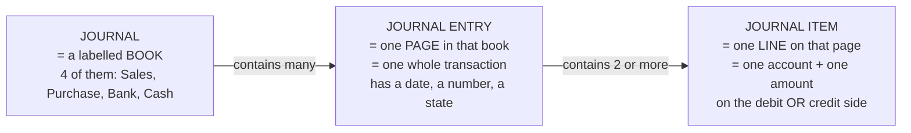

| Term | What it is | Real example | The DB table |
|---|---|---|---|
| **Journal** | A category of book you file transactions into. Master data. Only 4 exist, seeded once. | "Purchase" journal | `journal` — 4 rows, forever |
| **Journal Entry** | One complete transaction. The *header*. Has a date, a document number, a journal, a partner, a state (`DRAFT`/`POSTED`). | "Bill/2026/0001 dated 1-Sep, in the Purchase journal, ₹30,000, Posted" | `journal_entry` — one row per transaction |
| **Journal Item** | One line inside that entry. Has one account, one partner (optional), and an amount in *either* the debit column *or* the credit column. | "Purchase Expense A/c — debit ₹24,000" | `journal_item` — 2+ rows per entry |

The four seeded journals, straight from the mockup's Journals list:

| Journal Name | Type | Default Account |
|---|---|---|
| Sales | Sales | Sales Income A/c |
| Purchase | Purchase | Purchase Expense A/c |
| Bank | Bank | Bank A/c |
| Cash | Cash | Cash A/c |

**Why journals exist at all.** Two reasons. (1) Filing: when the owner wants to see "all my
purchases", he opens the Purchase journal instead of scrolling every transaction ever made.
(2) **Defaults**: the journal carries a default account, so the posting engine can ask the
journal "which account do you normally use?" instead of having the answer hardcoded in an `if`
statement. That second reason is the important one architecturally — it is exactly what makes
your posting engine configuration-driven rather than fake, and it is what makes judge test 4
(§1 §3.3) pass.

The mockup enforces which journal each document uses:
- Vendor Bill confirmed → entry goes in the **Purchase** journal (*"In case of bill journal
  would always be Purchase"*).
- Customer Invoice confirmed → entry goes in the **Sales** journal.
- Payments → **Bank** or **Cash** journal depending on `Payment Via`.

#### The one trap in this vocabulary

> **"Sales Journal" ≠ "Sales Income Account".**
> The Sales *journal* is the book you file customer invoices in. The Sales Income *account* is
> the bucket that accumulates how much you've earned. They are two different tables. A single
> invoice is *filed in* the Sales journal and *credits* the Sales Income account. Say that
> sentence to yourself until it's obvious.

#### Draft vs Posted

A journal entry has a state. The mockup's Journal Entries list shows a blue **Draft** badge and
a green **Posted** badge, and the form has `Post`, `Cancel` and `Reset to Draft` buttons.

- **Draft** — being written. Not real yet. Does not appear in any report. **May be
  unbalanced** — you have to be able to save a half-typed entry.
- **Posted** — committed to the books. Appears in every report. Must balance, enforced by the
  database. In real accounting, a posted entry is **immutable**: you never edit or delete it,
  you post a *reversal* (a mirror-image entry that cancels it out) so history stays intact.

**Only posted entries feed the reports.** Every report query in this app carries
`WHERE je.state = 'POSTED'`. Write that filter once in a shared helper so you can never forget
it.

`Reset to Draft` is a drawn button and therefore a MUST — but it is guarded, not free. It is
allowed only for an ADMIN, only when the entry is after any period lock date, and only when the
source document has no confirmed payments allocated against it; and the transition is written to
an audit log. The three guards are specified in *The Data Model* §4.3(c).

> 🎤 **SAY THIS TO A JUDGE**
> "Draft entries are invisible to the ledger. Only posted items are aggregated, and a posted
> entry can't be edited — cancelling a posted invoice generates a reversal entry, so both the
> original and the reversal stay in the books. In accounting you never delete anything."

---

### 2.6 The accounting equation — the single most important idea in this build

#### The equation

```
ASSETS  =  LIABILITIES  +  CAPITAL
```

In English: **everything the business has, was funded either by someone outside (a liability) or
by the owner (capital).** There is no third source of money. A shop cannot own a ₹5,00,000 bank
balance that came from nowhere.

#### Why it holds — the proof, which takes five lines

This is worth doing properly, because once you've seen it you will never again wonder why your
Balance Sheet must tie. **We run it twice: once with symbols, then immediately again with the
real numbers from §2.7, so you can check it with a calculator instead of trusting the algebra.**

**Step 1.** Every posted journal entry balances:

```
sum(debits in that entry) = sum(credits in that entry)
```

**Step 2.** Add up every entry ever posted. Sums of equal things are equal:

```
TOTAL of all debits in the whole ledger = TOTAL of all credits in the whole ledger
```

**Step 3.** Split those totals by account family (A = Assets, L = Liabilities, C = Capital,
I = Income, E = Expenses):

```
Dr_A + Dr_L + Dr_C + Dr_I + Dr_E  =  Cr_A + Cr_L + Cr_C + Cr_I + Cr_E
```

**Step 4.** Move the debit-natured families to the left and the credit-natured families to the
right:

```
(Dr_A − Cr_A) + (Dr_E − Cr_E)  =  (Cr_L − Dr_L) + (Cr_C − Dr_C) + (Cr_I − Dr_I)
```

Each bracket is exactly that family's **balance** as we defined it in §2.2:

```
ASSETS + EXPENSES  =  LIABILITIES + CAPITAL + INCOME
```

**Step 5.** Move Expenses across:

```
ASSETS  =  LIABILITIES  +  CAPITAL  +  (INCOME − EXPENSES)
                                        └──────┬──────┘
                                          this is PROFIT
```

#### The same five steps, in rupees

Using the eight accounts of §2.7. Take out a calculator; every line below is checkable.

**Step 3** — every debit and every credit in the whole ledger, split by family:

| Family | Total debits (Dr) | Total credits (Cr) |
|---|---:|---:|
| **A**ssets (Bank, Cash, Debtors) | 5,25,000 + 6,000 + 40,000 = **5,71,000** | 20,000 + 3,000 + 25,000 = **48,000** |
| **L**iabilities (Creditors) | **20,000** | **24,000** |
| **C**apital | **0** | **5,00,000** |
| **I**ncome (Sales) | **0** | **46,000** |
| **E**xpenses (Purchase, Other) | 24,000 + 3,000 = **27,000** | **0** |
| **TOTAL** | **6,18,000** | **6,18,000** ✅ |

Step 2 holds: 6,18,000 = 6,18,000. Nothing was lost.

**Step 4** — move the debit-natured families left, the credit-natured right:

```
LEFT   (5,71,000 − 48,000) + (27,000 − 0)                       = 5,23,000 + 27,000 = 5,50,000
RIGHT  (24,000 − 20,000) + (5,00,000 − 0) + (46,000 − 0)        = 4,000 + 5,00,000 + 46,000
                                                                 = 5,50,000
```

**5,50,000 = 5,50,000.** ✅  (This is also the Trial Balance figure in §2.7 Step 2 — it is the
same number arrived at a different way, which is a useful sanity check on your own work.)

**Step 5** — move Expenses to the right:

```
ASSETS 5,23,000  =  LIABILITIES 4,000  +  CAPITAL 5,00,000  +  (INCOME 46,000 − EXPENSES 27,000)
                 =  4,000 + 5,00,000 + 19,000
                 =  5,23,000  ✅
```

So the real, complete equation is:

```
ASSETS  =  LIABILITIES  +  CAPITAL  +  PROFIT
```

**This is the most valuable line in this entire document.** Read it again. The Balance Sheet
only balances if you put **profit onto the equity side**. If you print Assets on the left and
only Creditors + Capital on the right, the two columns will differ by *exactly* the profit
figure — here ₹19,000 — every single time.

#### Balance-sheet arithmetic per account type

Because assets/expenses are debit-natured and the rest are credit-natured, each account's
balance is computed with one of two formulas. This tiny table is the whole reporting engine's
sign logic:

| Account type | Balance formula |
|---|---|
| `ASSET`, `BANK`, `CASH` | `SUM(debit) − SUM(credit)` |
| `EXPENSE`, `OTHER_EXPENSE` | `SUM(debit) − SUM(credit)` |
| `LIABILITY`, `CAPITAL` | `SUM(credit) − SUM(debit)` |
| `INCOME` | `SUM(credit) − SUM(debit)` |

Store it as a per-type constant (`sign: +1` or `−1`), never as a chain of `if`s scattered
through the report code. *The Data Model* §4.6 calls this map `ACCOUNT_TYPE_META`.

#### Current Year Earnings and Retained Earnings, explained simply

Here's the practical problem. Profit lives in the P&L accounts (Income and Expenses). But the
Balance Sheet only prints Assets, Liabilities and Capital. So where does profit *show up* on the
Balance Sheet?

Answer: you compute it and inject it as a line inside the equity (Capital) side. That line has a
standard name:

- **Current Year Earnings (CYE)** — the profit *so far this financial year*.
  `CYE = total Income − total Expenses, for dates inside the current financial year only`. It is
  not an account you can post to. It is **computed at report time, every time**, from the same
  journal items. It appears on the Balance Sheet under Capital.

- **Retained Earnings** — the profit from **all previous, finished years**, added together.
  Profit that the owner earned but left inside the business. Once a year is closed, its CYE
  stops being "current" and rolls into Retained Earnings.

In India the financial year runs **1 April to 31 March**, and that is what we build:
`fiscalYearStartMonth = 4`. The mockup's report screens have a year selector showing `2026`; in
our system that label means **FY 2026-27, i.e. 01-Apr-2026 → 31-Mar-2027**. The label on screen
stays "2026" — only the window behind it is April-to-March. Say that out loud if a judge asks;
it is the correct Indian answer and it costs nothing.

So on 15 September 2026:
- CYE covers 01-Apr-2026 → 15-Sep-2026.
- Retained Earnings covers everything from the shop's first day up to 31-Mar-2026.

For a hackathon build whose seed data starts on 01-Apr-2026, **Retained Earnings will be ₹0**
and CYE carries everything. Build both anyway — computing Retained Earnings is three extra lines
(same query, different date window) and mentioning the term out loud is a strong signal to a
judge.

```
CYE            = Income(FY start → as-of date)  −  Expenses(FY start → as-of date)
RETAINED EARN. = Income(inception → FY start−1) −  Expenses(inception → FY start−1)

Balance Sheet equity side = Capital A/c balance + Retained Earnings + CYE
```

> 🎤 **SAY THIS TO A JUDGE** *(this is the line that wins the domain question)*
> "Current Year Earnings isn't an account we post to — it's derived at report time as Income
> minus Expenses for the fiscal year, and injected into the equity side of the Balance Sheet.
> That's the only reason Assets equals Liabilities plus Capital. Prior years roll into Retained
> Earnings. Most implementations skip this and their Balance Sheet is off by exactly the profit
> figure."

---

### 2.7 A complete worked set of books for Urban Furniture

> ⚠️ **This is a teaching example, deliberately tiny — seven transactions, no tax, so you can
> check every number on a phone calculator.** The real seed data you will demo — 41 journal
> entries, 352 journal items, Assets ₹9,92,000 — is defined once, in *The Demo Script and Judge
> Q&A* §10.1, and generated by the script in *The 24-Hour Build Plan* §5. Do not memorise the
> numbers below for the demo; memorise the *method*.

Now let's do the whole week, end to end, and watch every report fall out of it. **Every number
below is checkable with a calculator. Do check them — that's the point.**

#### The seven transactions

| # | Date | Transaction | Debit | Credit |
|---|---|---|---|---|
| JE1 | 01-Apr-26 | Owner invests ₹5,00,000 into the bank | Bank 5,00,000 | Capital 5,00,000 |
| JE2 | 05-Apr-26 | Vendor bill: 20 chairs @ ₹1,200 from Azure | Purchase Expense 24,000 | Creditors 24,000 |
| JE3 | 08-Apr-26 | Pay Azure ₹20,000 by bank | Creditors 20,000 | Bank 20,000 |
| JE4 | 10-Apr-26 | Cash sale, 1 dining table | Cash 6,000 | Sales Income 6,000 |
| JE5 | 12-Apr-26 | Credit invoice to Nimesh, 5 chairs @ ₹8,000 | Debtors 40,000 | Sales Income 40,000 |
| JE6 | 20-Apr-26 | Nimesh pays ₹25,000 into bank (partial) | Bank 25,000 | Debtors 25,000 |
| JE7 | 25-Apr-26 | Shop rent paid in cash | Other Expense 3,000 | Cash 3,000 |

That's 7 entries and 14 journal items. Every entry balances on its own.

#### Step 1 — roll up each account (this is the **General Ledger**)

| Account | Type | Total Debit | Total Credit | Balance | Direction |
|---|---|---:|---:|---:|---|
| Bank A/c | `BANK` | 5,25,000 | 20,000 | **5,05,000** | Dr |
| Cash A/c | `CASH` | 6,000 | 3,000 | **3,000** | Dr |
| Debtors A/c | `ASSET` | 40,000 | 25,000 | **15,000** | Dr |
| Creditors A/c | `LIABILITY` | 20,000 | 24,000 | **4,000** | Cr |
| Capital A/c | `CAPITAL` | 0 | 5,00,000 | **5,00,000** | Cr |
| Sales Income A/c | `INCOME` | 0 | 46,000 | **46,000** | Cr |
| Purchase Expense A/c | `EXPENSE` | 24,000 | 0 | **24,000** | Dr |
| Other Expense A/c | `OTHER_EXPENSE` | 3,000 | 0 | **3,000** | Dr |

#### Step 2 — the Trial Balance (the health check)

A **Trial Balance** is simply: add up all the debit balances, add up all the credit balances,
and confirm they're equal. It proves nothing got lost.

```
Debit  side: 5,05,000 + 3,000 + 15,000 + 24,000 + 3,000 = 5,50,000
Credit side: 4,000 + 5,00,000 + 46,000                   = 5,50,000
Difference: 0.00   ✅
```

> This "difference = 0.00" number is the single most persuasive thing you can put on screen. It
> is one query. Put it on a **Books Integrity** page and show it in the first 30 seconds of the
> demo — see *What Makes Us Win*, D1.

#### Step 3 — the Profit & Loss (P&L)

Take **only** the Income and Expense accounts, **only** for dates inside the chosen period
(here: 01-Apr-2026 to 31-Mar-2027).

Laid out exactly the way the mockup draws it:

| Line | Computation (mockup, verbatim) | Amount |
|---|---|---:|
| **Income** | Total of Income | ₹46,000 |
| &nbsp;&nbsp;Income from Sales | Total of account type Income | ₹46,000 |
| **Expenses** | Total of All expenses | ₹27,000 |
| &nbsp;&nbsp;Purchase Expense | Total of account type Expense | ₹24,000 |
| &nbsp;&nbsp;Other Expense | Total of account type Other Expense | ₹3,000 |
| **Net Income** | Difference of Income − Expenses | **₹19,000** |

*(Sanity check against the organizers' own sample figures: their mock shows Income 10,000,
Purchase Expense 6,000, Other Expense 1,000, Expenses 7,000, Net Income 3,000. 10,000 − 7,000 =
3,000, and 6,000 + 1,000 = 7,000. Same arithmetic, different numbers. Our layout matches theirs
line for line.)*

#### Step 4 — the Balance Sheet

Take **only** the Balance-Sheet-type accounts, cumulatively from the beginning of time up to the
as-of date. Then inject Current Year Earnings.

The mockup's layout has two columns, `Assets` on the left and `Liabilities` on the right, with
**Capital sitting in the right-hand column** (which is standard — the right column is really
"Liabilities + Equity").

| **Assets** | | **Liabilities** | |
|---|---:|---|---:|
| Bank | 5,05,000 | Capital | 5,00,000 |
| Cash | 3,000 | &nbsp;&nbsp;*Current Year Earnings* | *19,000* |
| Debtors | 15,000 | Creditors | 4,000 |
| **Total Asset** | **5,23,000** | **Total (Liabilities)** | **5,23,000** |

**It ties. 5,23,000 = 5,23,000.**

Now delete the Current Year Earnings row and look again: the right column becomes ₹5,04,000 and
the sheet is off by ₹19,000 — which is *exactly* the Net Income from the P&L. That is the
failure mode almost every other team will ship.

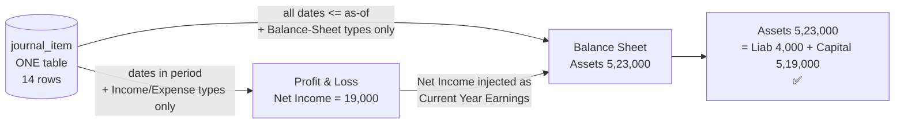

> 🎤 **SAY THIS TO A JUDGE** *(point at the screen while you say it)*
> "Net Income on the P&L is ₹19,000. Now look at the Balance Sheet — the same ₹19,000 appears
> inside Capital as Current Year Earnings. That's not two calculations that happen to agree;
> it's the same query over the same journal items with a different date window. That's why the
> sheet balances."

---

### 2.8 Balance Sheet vs Profit & Loss — a photo versus a video

This is the second-most-important idea after the equation, and it's the one that decides how you
write your queries.

| | **Balance Sheet** | **Profit & Loss** |
|---|---|---|
| **What it is** | A **photo** taken at one instant | A **video** covering a stretch of time |
| **Question it answers** | "What do I own and owe *right now*?" | "Did I make money *between these two dates*?" |
| **Time window** | From the business's first day → up to date **T**. No start date. | From date **A** → date **B**. Both ends matter. |
| **Accounts included** | Asset, Bank, Cash, Liability, Capital | Income, Expense, Other Expense |
| **Resets?** | Never. It accumulates forever. | Yes — starts from zero every financial year. |
| **SQL shape** | `WHERE date <= T` | `WHERE date BETWEEN A AND B` |

An analogy that sticks: **your bank balance is a Balance Sheet number** (it's whatever it is,
right now, as a result of everything that ever happened). **Your salary is a P&L number** (it's
meaningless without saying "per month").

#### The two different aggregations — write this in your code

Money is stored as **integer paise** in `BIGINT` columns (`debit_paise`, `credit_paise`), so
₹6,000.00 is the integer `600000`. Divide by 100 only at the very edge, when you format the
string for the screen. Reasoning: *The Data Model* §4.4.

```sql
-- PROFIT & LOSS  (a video: bounded on both ends)
SELECT a.type, SUM(ji.credit_paise - ji.debit_paise) AS amount_paise
FROM   journal_item  ji
JOIN   journal_entry je ON je.id = ji.entry_id
JOIN   account       a  ON a.id  = ji.account_id
WHERE  je.state = 'POSTED'
  AND  je.date BETWEEN :period_start AND :period_end     -- ← BOTH ends
  AND  a.type IN ('INCOME','EXPENSE','OTHER_EXPENSE')
GROUP  BY a.type;

-- BALANCE SHEET  (a photo: open at the start, closed at T)
SELECT a.type, a.name, SUM(ji.debit_paise - ji.credit_paise) AS balance_paise
FROM   journal_item  ji
JOIN   journal_entry je ON je.id = ji.entry_id
JOIN   account       a  ON a.id  = ji.account_id
WHERE  je.state = 'POSTED'
  AND  je.date <= :as_of_date                            -- ← NO start date
  AND  a.type IN ('ASSET','BANK','CASH','LIABILITY','CAPITAL')
GROUP  BY a.type, a.name;
-- then append Current Year Earnings, computed with the P&L query
-- over (fiscal_year_start .. as_of_date), to the Capital side.
```

Two queries. One table. Different date semantics, different account filter, different sign
handling. That is the whole reporting engine, and it is why a system built this way gets a
hundred features for free — as-of-date time travel, comparative periods, drill-down — while a
system that sums invoice tables gets none of them.

> ⚠️ **The trap, stated plainly.** If you compute the P&L as `SELECT SUM(total) FROM invoices`
> and the Balance Sheet as `SUM(payments)`, everything looks fine in a rehearsed demo. Then a
> judge posts a manual journal entry — *Dr Cash ₹50,000 / Cr Capital ₹50,000*, perfectly
> balanced, no invoice behind it — and your Balance Sheet doesn't move, because a manual entry
> isn't an invoice. That is a 5-second, unrecoverable failure. Derive from `journal_item` or
> don't bother.

---

### 2.9 Analytic Accounts and Budgets, simply

#### What an analytic account is

Your Chart of Accounts answers **"what kind of money is this?"** — sales, purchase, rent, bank.

An **analytic account** answers a completely different question: **"what is this money FOR?"** —
which project, which department, which showroom, which campaign. The mockup calls the field
**"Budget Analytics"** on document lines and the master **"Analyticals"**; they are the same
thing.

They are two independent ways of slicing the same rupee. Think of the account as the *category*
and the analytic account as a *coloured sticker* you also stick on the line.

Example. Urban Furniture spends ₹24,000 on chairs.
- **Account**: `Purchase Expense A/c` — tells you it's a cost.
- **Analytic account**: `Project 1` — tells you it was for the Project 1 office fit-out.

Later, the owner asks "how much did Project 1 cost me?" — a question the Chart of Accounts alone
can never answer, because Purchase Expense mixes every project together. The analytic tag
answers it instantly.

The mockup requires an analytic tag column (`Budget Analytics`) on **every** line of the
Purchase Order, Vendor Bill, Sales Order and Customer Invoice. Analytic accounts have exactly
two types: **Income** or **Expense**. And the mapping direction is fixed by the spec:

- Analytics on **Invoice** lines → type **Income**
- Analytics on **Purchase Order / Vendor Bill** lines → type **Expense**

An analytic account carries **one** type, not one per document. The mockup's example table draws
"Project 1 / Income / Sales Invoice" and "Project 1 / Expense / Vendor Bills" as two rows purely
to illustrate both directions; in our model each analytic account has a single type, so in our
seed data "Project 1" is an Expense analytic and a separate income analytic carries the sales
side. *(This is a modelling ruling, recorded in Complete Requirements §12 and The Data Model
§4.7.)*

Crucially, analytic accounts **do not affect the double entry at all**. They are metadata riding
along on the line. Debits and credits are untouched. That's why they're safe to add — and why
they must be plumbed all the way through to the journal item, not just left on the document
line. *(Carrying the analytic onto the journal item is an engineering choice beyond the literal
spec; it earns its place because it makes the budget report derive from the ledger like every
other report, instead of from the document tables — and it is what makes the tax exclusion in
§2.4.1 automatic.)*

#### What a budget is

A **budget** is a plan: "between these two dates, I intend to spend (or earn) this much on this
analytic account."

The mockup's Budget form is a header plus a line grid:

| Field | Plain meaning |
|---|---|
| Budget Name | e.g. "January 2026" |
| Budget Period | Start Date → End Date |
| Responsible | which contact owns this budget |
| **Analytic** | which project this line plans for |
| **Type** | Income or Expense |
| **Committed Amount** | the amount you **planned** |
| **Achieved Amount** | the amount actually **spent/earned** so far |
| **Achieved %** | `(Achieved / Committed) × 100` |
| **Amount To Achieve** | `Committed − Achieved` |

With the mockup's own sample: Furniture / Expense / Committed 2,00,000 / Achieved 10,000 /
**5%** / **1,90,000**. Check it: 10,000 ÷ 2,00,000 × 100 = 5. 2,00,000 − 10,000 = 1,90,000.
Correct.

> ⚠️ **A vocabulary warning that will save you an embarrassing moment.**
> In the organizers' mockup, **"Committed Amount" means the planned/budgeted figure.** In
> standard accounting (and in Odoo), "committed" means something else entirely — money locked in
> by a confirmed Purchase Order that hasn't been billed yet. **Follow the mockup's meaning in
> your field labels** (the judge is checking conformance to their spec), but if you also build a
> true commitment column, label it something unambiguous like "PO Committed" and explain the
> distinction out loud. Using their word their way, and knowing the other meaning exists, is a
> strong signal.

The other budget rules from the mockup, in one list:

- **Achieved Amount / Achieved % / Amount To Achieve are only visible once the budget is
  Confirmed.** The phrase "Only Visible for Confirmed Budget" is written three separate times.
- The mockup describes Achieved as *searching* the analytic across **Sales Invoices** (for
  Income-type lines) and **Vendor Bills** (for Expense-type lines), restricted to the budget
  period. We compute the **same figure from posted journal items** tagged with that analytic —
  which gives the identical answer on untaxed documents, correctly excludes GST on taxed ones,
  and keeps the rule "every report reads the ledger" intact. Both the formula and the
  justification are in *Complete Requirements* §3.5.
- Clicking Achieved Amount drills down to the list of those invoices/bills.
- Budget state machine: **Draft → Confirm → Revised → Cancelled**. "Cancel" means **archive**,
  not delete.
- **Revise** creates a *new* budget record, moves the old one to `Revised`, and links them both
  ways. The new one is named the old name plus the word **" Revised"** (e.g. `Project A
  Revised`).
- Confirming a PO or a Bill that pushes an analytic over its budget shows a **non-blocking**
  warning: *"Exceeds Approved Budget — The entered amount is higher than the remaining budget
  amount for this budget line. Consider adjusting the value or revise the budget."* You warn,
  then you let them through. That's the spec.

> 🎤 **SAY THIS TO A JUDGE**
> "Analytic accounts are a second dimension over the same ledger. The Chart of Accounts tells you
> *what kind* of money it is; the analytic tells you *what it was for*. The tag rides all the way
> through to the journal item, so the budget's achieved figure is aggregated from posted journal
> items filtered by analytic and period — the same source as every other report, and it excludes
> GST for free."

---

### 2.10 How the app's screens map onto all of this

One diagram to connect the accounting theory above to the screens you're about to build.
Documents are the *user's* language; journal entries are the *system's* language; reports read
only the system's language.

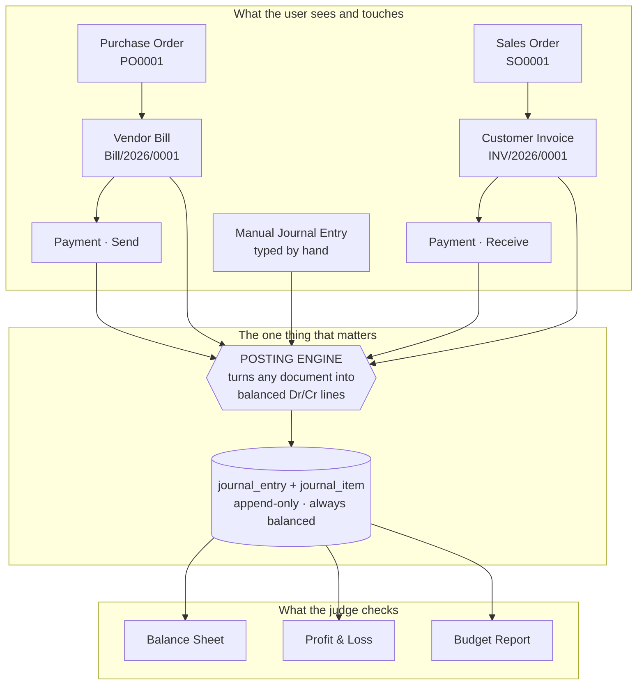

Read the two things this diagram is claiming:

1. **A Purchase Order and a Sales Order post NOTHING.** They are promises, not transactions. No
   money or value has moved. Only the Bill, the Invoice and the Payment hit the ledger. This
   trips up beginners constantly — and getting it right is itself a signal of understanding.
2. **The Manual Journal Entry bypasses the documents entirely — but it still goes through the
   posting engine**, with the lines the user typed rather than lines derived from a document.
   That is what makes the balance rule apply to it too, and it means *nothing at all* in the
   codebase writes a ledger row except one file (`lib/services/posting.ts`; see *Tech Stack,
   Architecture and Optimizations* §8.4). The manual-entry path is the arrow that kills fake
   systems: if your reports read the ledger, a manual entry shows up in them; if your reports
   read the invoice tables, it doesn't.

What each document posts, in one table (untaxed, for clarity — add the GST line from §2.4.1 when
tax is non-zero):

| Document | Journal | Debit | Credit |
|---|---|---|---|
| Vendor Bill confirmed (₹24,000) | Purchase | Purchase Expense 24,000 | Creditors 24,000 |
| Customer Invoice confirmed (₹40,000) | Sales | Debtors 40,000 | Sales Income 40,000 |
| Payment · Receive, by bank (₹25,000) | Bank | Bank 25,000 | Debtors 25,000 |
| Payment · Send, by bank (₹20,000) | Bank | Creditors 20,000 | Bank 20,000 |
| Payment · Receive, by cash (₹6,000) | Cash | Cash 6,000 | Debtors 6,000 |
| Owner capital injection (₹5,00,000) | Bank | Bank 5,00,000 | Capital 5,00,000 |

Six shapes. That's the entire accounting surface of this application. Everything else is CRUD
screens.

---

### 2.11 The five domain questions a judge will ask, and the exact answers

Rehearse these. They take fifteen seconds each. *(The full thirty-one-question bank is in The
Demo Script and Judge Q&A §10.6.)*

| Judge asks | Say exactly this |
|---|---|
| **"Where do your reports get their numbers?"** | "From one table — `journal_item`. Nothing is summed off invoices or payments. The Balance Sheet is a cumulative aggregation with `date <= T`; the P&L is a bounded aggregation over the period. Same table, two date semantics." |
| **"Does your Balance Sheet actually balance?"** | "Yes, and it balances for a reason, not by luck. Every posted entry has a database constraint forcing debit = credit, so the trial balance is 0.00 by construction. Then we inject Current Year Earnings — Income minus Expenses for the fiscal year — into the equity side. Without that it would be off by exactly the profit." |
| **"What if I post a manual journal entry right now?"** | "Please do. Dr Cash 50,000 / Cr Capital 50,000. Watch the Balance Sheet in the other window." *(Then do it. Assets go 9,92,000 → 10,42,000.)* |
| **"Why is a Sales Order not a journal entry?"** | "Because nothing has moved yet. A Sales Order is a promise; no value has been earned and no cash has changed hands. The ledger only records the Invoice, the Bill and the Payment. Posting an order would overstate revenue." |
| **"Pay half of that invoice."** | "Sure — the residual is derived from the payments allocated to the invoice, not stored as a flag. Pay ₹25,000 of ₹40,000 and the badge flips to Partial with ₹15,000 due, and Debtors on the Balance Sheet drops by exactly ₹25,000." |

---

### 2.12 Glossary — every term used anywhere in this project

Accounting terms first, then the UI/framework vocabulary. One line each, plain English. Use this
as a lookup table; do not read it front to back.

#### Accounting terms

| Term | Plain-English meaning |
|---|---|
| **Account** | A labelled bucket that transactions get sorted into (Cash, Bank, Sales Income…). |
| **Chart of Accounts (CoA)** | The master list of every account. We ship 12: the mockup's 8 plus Input GST, Output GST, Retained Earnings and Current Year Earnings. |
| **Account Type** | The label on an account that decides how it behaves and which report it lands on. Eight leaf values, stored uppercase and singular: `ASSET`, `LIABILITY`, `BANK`, `CAPITAL`, `CASH`, `INCOME`, `EXPENSE`, `OTHER_EXPENSE`. |
| **Account Subtype** | A secondary role tag (`RECEIVABLE`, `PAYABLE`, `TAX_INPUT`, `TAX_COLLECTED`, `NONE`) so the posting engine can ask for "the receivable account" instead of matching a name string. |
| **Asset** | Something the shop owns or is owed. Bank, Cash, Debtors, Input GST. Goes **up** on the debit side. |
| **Liability** | Something the shop owes to an outsider. Creditors, Output GST. Goes **up** on the credit side. |
| **Capital (Equity)** | The owner's stake — money he put in plus profit he left in. Goes **up** on the credit side. |
| **Income (Revenue)** | Value earned by selling. Goes **up** on the credit side. |
| **Expense** | Value consumed to run the business. Goes **up** on the debit side. |
| **Other Expense** | A separate expense type for non-purchase costs (rent, electricity) so the P&L can print them on their own line. |
| **Debit** | The left-hand amount column. Nothing more. Assets and Expenses increase here. |
| **Credit** | The right-hand amount column. Liabilities, Capital and Income increase here. |
| **Double-entry** | The rule that every transaction is recorded twice — source and destination — with equal amounts. |
| **Journal** | A book that groups similar transactions. Four exist: Sales, Purchase, Bank, Cash. |
| **Journal Entry** | One complete transaction — the header. Has a date, number, journal, and `DRAFT`/`POSTED` state. |
| **Journal Item (line)** | One line inside an entry: one account, an optional partner, and an amount in either the debit or credit column. |
| **Posting** | Committing a draft entry to the books. Only posted entries are visible to reports. |
| **Draft** | An entry that is written but not committed. Invisible to reports. May be unbalanced. |
| **Posted** | An entry committed to the books. Must balance. Never edited or deleted afterwards. |
| **Reset to Draft** | Pulling a posted entry back to Draft. A button the mockup requires; guarded by three rules (see The Data Model §4.3c). |
| **Reversal entry** | A mirror-image entry (debits and credits swapped) that cancels an earlier one without deleting it. |
| **Immutability** | The principle that posted records are never changed — you correct them with a new entry. |
| **General Ledger** | All journal items, grouped by account. The full history of every bucket. |
| **Partner Ledger** | The same thing sliced by contact instead of by account — "everything Nimesh ever did". |
| **Trial Balance** | Total of all debit balances vs total of all credit balances. Must be equal. Difference must be 0.00. |
| **Balance Sheet** | A photo at one moment: Assets on one side, Liabilities + Capital on the other. Must tie. |
| **Profit & Loss (P&L)** | A video over a period: Income minus Expenses. Also called the Income Statement. |
| **Net Income** | The bottom line of the P&L. Income − Expenses. Positive = profit, negative = loss. |
| **Current Year Earnings (CYE)** | Profit so far in the current financial year, computed at report time and shown inside Capital on the Balance Sheet. Not a postable account. |
| **Retained Earnings** | The accumulated profit of all previous, closed financial years, kept in the business. |
| **Fiscal / Financial Year** | The 12-month reporting cycle. In India, and in this build: 1 April → 31 March. The report screens' "2026" label means FY 2026-27. |
| **As-of date** | The single date a Balance Sheet is drawn at. Everything on or before it counts. |
| **Period** | The date range a P&L covers. Both ends matter. |
| **Opening balance** | A journal entry posted on day one to load balances the business already had before the system existed. |
| **Debtors (Accounts Receivable)** | The asset account holding money customers owe you. |
| **Creditors (Accounts Payable)** | The liability account holding money you owe vendors. |
| **Partner / Contact** | A person or company you trade with. Can be Customer, Vendor, or Both. |
| **Customer** | A partner who buys from you. |
| **Vendor / Supplier** | A partner you buy from. |
| **Sales Order (SO)** | A customer's confirmed intention to buy. Posts nothing to the ledger. |
| **Purchase Order (PO)** | Your confirmed intention to buy from a vendor. Posts nothing to the ledger. |
| **Customer Invoice** | The bill you send a customer. Posts Dr Debtors / Cr Sales Income (+ Cr Output GST if taxed). |
| **Vendor Bill** | The bill a vendor sends you. Posts Dr Purchase Expense (+ Dr Input GST if taxed) / Cr Creditors. |
| **Payment** | Money actually moving. Has a direction: Send (you pay) or Receive (you get paid). |
| **Register Payment** | The action of recording a payment against a specific invoice or bill. |
| **Payment Via** | Which channel the money moved through — Bank or Cash. Decides which journal is used. |
| **Amount Due / Residual** | How much of an invoice is still unpaid. `Total − Amount Paid`. Always derived, never stored as a flag. |
| **Partial payment** | Paying less than the full amount, leaving a residual. |
| **Paid / Partial / Not Paid** | The three computed status badges. Evaluate in order: due = 0 → Paid; due = total → Not Paid; otherwise Partial. |
| **Allocation** | The row that says how much of one payment goes against which invoice. Our `payment_allocation` table. |
| **Reconciliation** | Matching a payment (or a bank statement line) to the specific invoice(s) it settles. |
| **Aging** | Grouping unpaid invoices by how overdue they are (Current / 1–30 / 31–60 / 61–90 / 90+ days). |
| **Analytic Account** | A tag on a line saying *what the money was for* — a project, department or cost centre. Type is Income or Expense. Does not affect debits and credits. The mockup calls the field "Budget Analytics". |
| **Analytic distribution** | Carrying that tag from the document line through to the journal item. |
| **Budget** | A plan: how much you intend to spend or earn on an analytic account, between two dates. |
| **Committed Amount** | *In this mockup:* the planned/budgeted figure. *(In standard accounting the word means confirmed-but-unbilled POs — different meaning, don't mix them up.)* |
| **Achieved Amount** | How much has actually been spent or earned against that analytic in the period. |
| **Achieved %** | `(Achieved ÷ Committed) × 100`. Only shown once the budget is Confirmed. |
| **Amount To Achieve** | `Committed − Achieved`. Only shown once the budget is Confirmed. |
| **Budget Revision** | Pressing Revise creates a new budget record, moves the old one to `Revised`, and links them both ways. |
| **Sequence** | An auto-generated document number that counts up: `PO0001`, `SO0001` (no year), `Bill/2026/0001`, `INV/2026/0001` (with year). |
| **Invoice Reference** | A separate free-text field the user types (e.g. `ABC-26-001`). Not the sequence number. |
| **Due Date** | When an invoice or bill must be paid by. Separate from the invoice date. |
| **Lock date** | A cut-off date before which no new entries may be posted, so a closed period stays closed. *(Not in the spec — an addition on the build plan's bench; a real accounting control and a strong signal to an Odoo judge.)* |
| **COGS (Cost of Goods Sold)** | The purchase cost of the specific items you actually sold. Needed for true gross margin. *(Beyond the spec's minimum; benched.)* |
| **Stock ledger** | Quantity on hand derived from movements (+ on receipt, − on delivery) rather than stored as a mutable counter. *(Benched.)* |
| **GST / Tax** | Government tax added to a sale or purchase. The PDF mentions Tax on the Sales Order; the mockup shows none. We build it, defaulted to 0%. |
| **Input tax / Output tax** | Tax you paid on purchases (an asset — reclaimable) / tax you collected on sales (a liability — payable to the government). Tracked in separate accounts. |
| **Paise** | One hundredth of a rupee. All money in this system is stored as an integer number of paise, so ₹6,000.00 is the integer `600000`. |

#### UI and framework vocabulary (used in the mockup, not accounting terms)

| Term | Plain-English meaning |
|---|---|
| **Master data** | Reference records you create once and reuse: Contacts, Products, Accounts, Journals, Analytics. |
| **Transaction data** | The documents that reference master data: orders, invoices, bills, payments. |
| **Many2one (m2o)** | A dropdown that points at one record in another table. A foreign key with a picker. |
| **Create on the fly** | Being able to type a new value into a dropdown and have it saved as a new record immediately (required for Product Category). |
| **List view** | The default table of records for a model. |
| **Kanban view** | The same records shown as cards instead of table rows. Required for Contact, Product, Analyticals and the Budget Report. |
| **Form view** | The single-record create/edit screen. New opens it blank; clicking a row opens it filled. |
| **View switcher** | The list/kanban toggle icons in the toolbar. Must work in **both** directions. |
| **Smart button** | A button in the form's top-right that jumps to related records (the `PO` button on a Bill, the `Budget` button). |
| **Conditional visibility** | A field or button that only appears in certain states (the PO smart button only when the bill came from a PO; Achieved fields only when the budget is Confirmed). |
| **Statusbar / State machine** | The stage ribbon at the top of a form. Budget: Draft → Confirm → Revised → Cancelled (4). Payment: Draft → Confirm → Cancelled (3). |
| **Archive** | Hiding a record without deleting it (`active = false`). The mockup's Budget "Cancel" and the Chart of Accounts "Archived" button both mean this. |
| **Blocking warning** | An error that stops the action. Required when debit ≠ credit on **Post**. |
| **Non-blocking warning** | A message that warns but lets the user continue. Required when a PO or Bill exceeds its budget — on **both** buttons. |
| **Portal user** | A limited login for a customer/vendor who can only see their own invoices and pay them. |
| **Deferred constraint** | A database rule checked at the **end** of the transaction rather than after each individual row — which is what lets a multi-line journal entry be written one line at a time and still be checked as a whole. |

---

### 2.13 The eight sentences that are the whole section

If you remember nothing else, remember these:

1. Accounting exists because **cash moving and value moving are different things**.
2. **Debit is the left column, credit is the right column.** Credit = where value came from;
   debit = where it went to.
3. **Assets and Expenses increase on the debit side; Liabilities, Capital and Income increase on
   the credit side.**
4. Every posted entry balances, therefore the whole ledger balances, therefore
   **Assets = Liabilities + Capital + Profit**.
5. **Profit must be injected into the equity side as Current Year Earnings**, or your Balance
   Sheet is off by exactly the profit.
6. A **Journal** is a book, a **Journal Entry** is a page, a **Journal Item** is a line.
7. The **Balance Sheet is a photo** (`date <= T`, no start). The **P&L is a video**
   (`date BETWEEN A AND B`). Same table, different date semantics.
8. **Every report reads `journal_item` and nothing else.** Orders post nothing; bills, invoices,
   payments and manual entries all post through the same engine. **GST collected is a liability,
   not income.**

---

*Where this section stops:* the exact database schema is in *The Data Model*; the
posting-engine implementation and the final report SQL are in *The Core Engine*; the complete
screen and field inventory is in *Complete Requirements*; the API routes and the list/form
scaffold are in *Tech Stack, Architecture and Optimizations*; the hour-by-hour build order is in
*The 24-Hour Build Plan*. This section only had one job — to make sure that when you read those
sections, every word in them means something to you.

---


<a id="complete-requirements--everything-we-must-build"></a>

# Complete Requirements — Everything We Must Build

This section is the **build bible**. It merges two sources into one list:

1. The official **PDF problem statement** (`p3_accounting.txt`) — short, vague, 180 lines.
2. The organizers' **Excalidraw mockup** (`mock_acc.txt` + the 27 image tiles) — long, precise, and *far* more binding. The mockup pins down field data types, exact formulas, sequence formats, default values, conditional-visibility conditions and exact warning text.

Where the two disagree, **the mockup wins**, because the mockup is what a judge will hold next to your screen. Every place they disagree is called out explicitly in §12 with our ruling.

> **Rule for this whole section:** nothing here is invented. Every line traces back to the PDF or the drawing. The handful of things we add on top of the sources are tagged **`[ADDITION]`** with a one-line reason why they earn their place.

---

### 3.0 How to read this section

#### 3.0.1 The priority marks

| Mark | Meaning |
|---|---|
| **MUST** | It is drawn in the mockup or stated in the PDF. If it is missing, a judge comparing screen-to-mockup sees a hole. Build it. |
| **SHOULD** | Stated in a source but *not drawn as a screen*, or drawn but cheap to approximate. Build it if the clock allows. |
| **NICE** | Implied, not stated. Pure upside. |
| **`[ADDITION]`** | Not in any source. We are adding it and saying why. |

#### 3.0.2 The honest truth about priorities

**The mockup contains ZERO optional markers.** There is no "bonus", no "nice to have", no "phase 2", no hours, no priority column anywhere across all 27 tiles. Three independent passes over the board confirmed this. The organizers drew everything at production fidelity — field-level data types, exact arithmetic, exact button labels — which means:

> A judge treats **100% of the drawing as baseline scope**. Anything you skip reads as *incomplete*, not as *descoped*.

So almost everything below is MUST. The very short list of things that are genuinely safe to drop under time pressure is in **§13 — The Safe-Cut List**, and it is short on purpose.

#### 3.0.3 Words you must understand before the checklist makes sense

You said you know nothing about accounting. Here is the minimum vocabulary. Every one of these words appears in the mockup, so you need them.

| Word | Plain English | Concrete example |
|---|---|---|
| **Ledger account** (a.k.a. "account", "A/c") | A labelled bucket that money is sorted into. | "Bank A/c", "Sales Income A/c", "Creditors A/c". |
| **Chart of Accounts (CoA)** | The master list of all those buckets. | The 8 accounts the mockup demands (§3.3.4). |
| **Account Type** | The category of a bucket. Decides which report it shows up in. | `Bank`, `Cash`, `Asset`, `Liability`, `Capital`, `Income`, `Expenses`, `Other Expenses`. |
| **Debit / Credit** | Two sides of every money movement. Debit is written left, credit right. Debit increases assets and expenses; credit increases income, liabilities and capital. Every movement is recorded on **both** sides, in equal amounts. | Customer pays ₹6,000 cash → Debit Cash ₹6,000, Credit Debtors ₹6,000. |
| **Double entry** | The rule that total debits must equal total credits, always. | ₹10,000 debit + ₹10,000 credit = balanced. ₹10,000 debit + ₹9,000 credit = illegal, must be rejected. |
| **Journal Entry** | One complete balanced record of a transaction — a header (date, journal) plus 2+ lines. | "Bill/2026/0001, 1 Sep, Purchase journal: Dr Purchase Expense 30,000 / Cr Creditors 30,000". |
| **Journal Item / Journal Line** | One line inside a journal entry: one account, one partner, one debit **or** one credit. | "Purchase A/c · Rahul · Debit ₹30,000". |
| **Journal** | A folder that groups journal entries by kind of activity. | Sales, Purchase, Bank, Cash — the four the mockup seeds. |
| **Post** | To make a journal entry final and real. Before posting it is a Draft and it does not affect reports. | The `Post` button on the Journal Entry form. |
| **Partner** | The other person in the transaction — a customer or vendor. Comes from the Contact master. | "Mr. Rahul". |
| **Debtors** | People who owe **us** money (our customers). An asset. | We invoiced Rahul ₹6,000 and he hasn't paid → Debtors ₹6,000. |
| **Creditors** | People **we** owe money to (our vendors). A liability. | Azure Furniture billed us ₹30,000 → Creditors ₹30,000. |
| **Capital** | The owner's own money put into the business. | Owner deposits ₹5,00,000 → Capital ₹5,00,000. |
| **Balance Sheet** | A snapshot: what we own (Assets) vs what we owe + owner's stake (Liabilities + Capital). The two sides must be equal. | Assets ₹8,42,310 = Liabilities ₹1,97,310 + Capital ₹6,45,000. |
| **Profit & Loss (P&L)** | Income earned minus expenses incurred, over a period. | Income ₹10,000 − Expenses ₹7,000 = Net Income ₹3,000. |
| **Analytic Account** | A **project tag** for money. It does not affect the books; it just lets you ask "how much did Project 1 cost?" | "Project 1", "Furniture". |
| **Budget** | A planned spend/earn amount for a period, attached to an analytic account. | "January 2026: Furniture, Expense, ₹2,00,000 committed". |
| **Committed Amount** | The number you planned. | ₹2,00,000. |
| **Achieved Amount** | The number actually reached so far. | ₹10,000 spent → 5% achieved, ₹1,90,000 left. |
| **Amount Due / Residual** | Bill total minus what has been paid. | ₹6,000 bill, ₹4,000 paid → due ₹2,000 → status **Partial**. |
| **Many-to-one (m2o)** | A dropdown that points at one record of another table. The mockup writes this on almost every field. | "Customer Name (From Contact Master - Many to one)". |
| **Smart button** | A small button on a form's top-right that jumps to a related record. | The `PO` and `Budget` buttons on a Vendor Bill. |
| **Archive** | Hide a record without deleting it (`active = false`). The mockup uses this for Budget "Cancel" and for Chart of Accounts. | A cancelled budget disappears from lists but still exists. |

**Say this to a judge if they ask what you built:**
> "It's a double-entry accounting system. Everything — every invoice, every bill, every payment — becomes balanced journal items in one table, and all three reports are pure aggregations over that one table. Nothing is summed off the invoice table."

---

### 3.1 The complete model inventory

The mockup's expanded navigation menu (tile `acc_r1c1`/`r1c2`) is the **authoritative model list**. It has four columns and 16 destinations. That menu is a contract: every one of those 16 items must open something real.

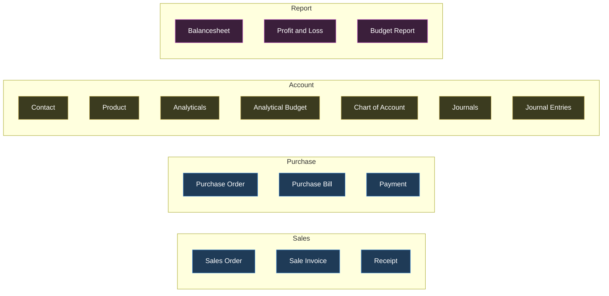

#### 3.1.1 Database tables you will actually create

| # | Table | Source | Why it exists |
|---|---|---|---|
| 1 | `users` | Mockup Create User / Login / Sign Up | 3 roles, credential rules |
| 2 | `contacts` | PDF §3.1 + mockup Contact form | Customers and vendors, one shared table |
| 3 | `products` | PDF §3.2 + mockup Product form | Goods/Service/Combo |
| 4 | `product_categories` | Mockup: "Category Can be created and saved on the fly (Many2one Field)" | m2o with quick-create |
| 5 | `accounts` (Chart of Accounts) | PDF §3.3 + mockup CoA list/form | The connective spine |
| 6 | `journals` | PDF §3.4 + mockup Journals list/form | 4 seeded: Sales, Purchase, Bank, Cash |
| 7 | `journal_entries` | PDF §3.5 + mockup Journal Entry form | Header: date, journal, partner, state |
| 8 | `journal_items` | Mockup Journal Entry line grid | **The single source of truth for every report** |
| 9 | `analytic_accounts` ("Analyticals") | PDF §5 + mockup Analyticals form | Project tags, Income/Expense |
| 10 | `budgets` | PDF §5 + mockup Budget form | Name, period, responsible, state, revision links |
| 11 | `budget_lines` | Mockup Budget line table | Analytic, type, committed, achieved |
| 12 | `purchase_orders` + `purchase_order_lines` | Mockup PO screen | PO0001 sequence |
| 13 | `vendor_bills` + `vendor_bill_lines` | Mockup Vendor Bill screen | Bill/2026/0001 |
| 14 | `sales_orders` + `sales_order_lines` | Mockup Sales Order screen | SO0001 |
| 15 | `customer_invoices` + `customer_invoice_lines` | Mockup Customer Invoice screen | INV/2026/0001 |
| 16 | `payments` | Mockup Bill Payment / Invoice Payment | One table, Send/Receive direction |
| 17 | `payment_allocations` **`[ADDITION]`** | — | Needed for "Partial" status to survive one payment against a document. Without it "Partial" is a lie. ~20 lines of code, unlocks a MUST-level computed field. |
| 18 | `sequences` **`[ADDITION]`** | — | "auto generate ... +1 of Last" needs a counter row per prefix per year, otherwise two concurrent saves collide. |
| 19 | `taxes` | PDF §4 ("Sales Order: ... Unit Price, **Tax**") | Not drawn in the mockup. See §12.5. |

---

### 3.2 Global rules — apply to EVERY screen

These come from board-level notes and repeat on every card. Getting these right once, in a reusable component, is the single biggest time saver in the whole build.

| ID | Rule | Verbatim source | Priority |
|---|---|---|---|
| G-01 | **List view is the DEFAULT view for every master.** | "All Master will have list view as default" | MUST |
| G-02 | **`New` opens a BLANK form view.** | "clicking on New button it will open blank form view to enter new record" | MUST |
| G-03 | **Clicking a saved row opens the SAME form, populated.** | "Clicking on already saved record - it will open form view with saved details" | MUST |
| G-04 | **Standard master toolbar: `New` · `Confirm` · `Back`.** | Repeated on Contact form, Product form, Analyticals form | MUST |
| G-05 | **Every screen has an explicit `Back` button.** The organizers do not expect browser-back. | `Back` drawn on 15+ cards | MUST |
| G-06 | **List + Kanban view switcher, working in BOTH directions**, for Contact, Product, Analyticals. Two icons top-right. | "Allow user to shift to Kanban View" / "Allow User to shift to List View" / "Create Kanban and List View in the same manner for Product, Analyticals" | MUST |
| G-07 | **A search box in every list toolbar.** | Search input drawn on Contact, Product, Budget Report lists | MUST |
| G-08 | Money is displayed as **Rs.** with 2 decimals. | "Rs. 100.00", "Rs. 50.00", "Rs. 10,000" | MUST |
| G-09 | Indian digit grouping in samples (`2,00,000`, `1,00,000`). | Budget: 2,00,000 · Role note | SHOULD |
| G-10 | Select checkbox column on master list views. | Drawn on Contact list, Product list | SHOULD |
| G-11 | **The Chart of Accounts is the connective spine** — journal lines, bill lines and invoice lines all point at it. | "The Transaction would be connected through Chart of Accounts" | MUST |

> **Engineering call (and it is the reason this problem statement was chosen):** G-01 → G-07 mean you build **one** `<ListView>` component and **one** `<FormView>` component, driven by a per-model config object (columns, fields, types, m2o targets). Then all ~19 master/transaction screens are config, not code. Budget one hour for the scaffold; it pays back six.
>
> **Say this to a judge:** "The organizers wrote one note that governs every master — list is default, New opens a blank form, a row opens the same form filled in. So we built exactly one list component and one form component, and every model is a 30-line config. That note is in their drawing; we treated it as an architectural instruction."

---

### 3.3 Screen-by-screen inventory

#### GROUP A — Authentication & Shell (6 screens)

---

##### A1. Create User (admin-side) — MUST
*Purpose:* an Admin creates a system user and assigns a role. Tile `acc_r0c1`.

| Field | Type | Rule |
|---|---|---|
| App Logo | image placeholder | Drawn at the top of the card |
| Name | text | — |
| Login id | text | **Unique**, **6–12 characters** |
| E-mail id | text | **Must not be a duplicate in the database** |
| Role | radio | Drawn: `User` / `Administrator`. Annotation defines a **third** role: `Accountant`. See §12.1 |
| Password | masked text | Must contain **a lowercase, an uppercase and a special character**, and be **more than 8 characters** |
| Re-Enter Password | masked text | Must match |

*Buttons:* `Create` · `Cancel`

*Rules:*
- R-A1-01 **MUST** — Login Id unique AND length between 6 and 12 inclusive.
- R-A1-02 **MUST** — Email uniqueness check against `users`.
- R-A1-03 **MUST** — Password regex: at least one `[a-z]`, one `[A-Z]`, one special character, `length > 8` (so 9+).
- R-A1-04 **MUST** — Re-enter password must match.
- R-A1-05 **MUST** — Role assignment. Three roles exist in the annotation (§3.3 A-roles table); render three radios. See §12.1.

**Role rights, verbatim from the annotation:**

| Role | Rights (verbatim) |
|---|---|
| Admin | "Have all access rights" |
| User (portal) | "can only see his invoices/bills in paid/unpaid status and can directly pay his dues from portal" |
| Accountant | "Create Master data, record Transactions and View reports. Can manage customers/vendors, access accounting dashboard, create journal entries. Can create and manage invoices, bills, and payments" |

---

##### A2. Login Page — MUST
*Purpose:* sign in.

| Field | Type |
|---|---|
| App Logo | image |
| Login Id | text |
| Password | masked |

*Buttons / links:* `SIGN IN` · `Forgot Password` · `Sign Up` (footer rendered as one line: `Forgot Password | Sign Up`)

*Rules:*
- R-A2-01 **MUST** — On mismatch show the **exact string**: `Invalid Login Id or Password`. Not "Wrong credentials". Not "Login failed". That exact string is in the annotation and a judge can diff it.
- R-A2-02 **MUST** — `Sign Up` link lands on the Sign Up page.
- R-A2-03 **SHOULD** — `Forgot Password` link lands on a Forgot Password page (see A4).

---

##### A3. Sign Up Page — MUST
*Purpose:* self-service registration. **Creates a portal/"invoicing" user only — never an admin or accountant.**

| Field | Type | Rule |
|---|---|---|
| App Logo | image | — |
| Enter Login Id | text | Unique, 6–12 chars |
| Enter Email Id | text | Not a duplicate |
| Enter Password | masked | lowercase + uppercase + special char, length > 8 |
| Re-Enter Password | masked | Must match |

*Buttons:* The primary button is literally drawn as **`SIGN OUT`** — that is the organizers' typo. Label it `SIGN UP`. Footer: `Forgot Password | Sign Up`.

*Rules:*
- R-A3-01 **MUST** — "Create a 'user' database into the system on signup" — i.e. the created record's role is hard-coded to portal user. **A signup can never mint an admin.** This is a security requirement hidden in a drawing note.
- R-A3-02 **MUST** — Same three credential rules as A1, enforced on this path too (the annotation restates all three, which is the organizers telling you they check both paths).

---

##### A4. Forgot Password Page — SHOULD
*Purpose:* referenced from both Login and Sign Up footers — **but never drawn anywhere on the board.**

*Justification for SHOULD:* it is the only screen in the entire spec with no wireframe, so a judge has nothing to compare against. A single "enter email → reset link/temporary password" page satisfies it. It is on the safe-cut list (§13) — but the *link* must exist and must not 404.

---

##### A5. App Dashboard — MUST
*Purpose:* landing page after login. Tile `acc_r1c1`. **This is not decorative — every number on it is a live computed count.**

*Top menu bar:* `Sales` | `Purchase` | `Account` | `Report` — clicking opens the expanded mega-menu (annotation: "Open on click").

| Card | Counter tiles | Primary button |
|---|---|---|
| **Sales** | `All 12` · `Confirmed 10` · `Draft 2` | `New` (blue) |
| **Purchase** | `All 12` · `Confirmed 10` · `Draft 2` | `New` (blue) |
| **Budget Reports** | `Achieved 3` · `Budget 2` · `Committed 4` | `Report` (blue) |

*Rules:*
- R-A5-01 **MUST** — Sales counters = counts of Sales Orders grouped by state (All / Confirmed / Draft).
- R-A5-02 **MUST** — Purchase counters = counts of Purchase Orders grouped by state.
- R-A5-03 **MUST** — Budget card aggregates analytic budgets: Achieved / Budget / Committed.
- R-A5-04 **MUST** — `New` on Sales card → blank Sales Order form. `New` on Purchase card → blank Purchase Order form. `Report` → Budget Report.
- R-A5-05 **SHOULD** — Counters should be clickable filters into the corresponding list. *(Not stated; obvious and free.)* **`[ADDITION]`**

---

##### A6. Main Navigation Mega-Menu — MUST
*Purpose:* the full app menu, opened from the dashboard menu bar.

Four columns, 16 items — exactly as listed in §3.1. Every item navigates to that model's **default list view** (G-01).

*Rule:*
- R-A6-01 **MUST** — All 16 destinations resolve. A dead menu item is the cheapest possible way to lose a point.
- R-A6-02 **MUST** — `Receipt` (under Sales) and `Payment` (under Purchase) both exist. Implementation note: **one `payments` table, two filtered menu entries** (`direction = 'receive'` → Receipt, `direction = 'send'` → Payment). The mockup itself draws one payment form with a Send/Receive radio, so this is what they intend, not a shortcut.

---

#### GROUP B — Master Data (13 screens)

Board section banner: **"Master Data"** (olive band, `acc_r1c1`).

---

##### B1. Contact List View — MUST
*Purpose:* default list of customers/vendors.

| Column | Notes |
|---|---|
| Select | checkbox |
| Image | **real avatar thumbnail**, not a placeholder |
| Name | e.g. "Open Wood" |
| Email | e.g. "Openwood21@example.com" |
| Phone | e.g. "+91 9090090909" |

*Buttons:* `New` · Search · `Back` · list/kanban view-switcher icons.

- R-B1-01 **MUST** — the uploaded image renders **in the list**, not only on the form.

---

##### B2. Contact Kanban View — MUST
Card shows: thumbnail image, Name, Email, Phone. Same toolbar. Switcher must return to list.

---

##### B3. Contact Form View — MUST
*Purpose:* create/edit a contact.

| Field | Type | Rule |
|---|---|---|
| Contact Name | wide text | — |
| Email | text | Placeholder literally reads **"Unique Email"** → uniqueness constraint |
| Phone | text | — |
| Street | text | Address block |
| Street 2 | text | second street line |
| City | text | (PDF also names City) |
| State | text | (PDF also names State) |
| Country | text | mockup only |
| Pincode | text | (PDF also names Pincode) |
| Upload Image | image box, right side | Profile Image (PDF §3.1) |
| Type | **PDF only:** Customer / Vendor / Both | Not drawn on the form. See §12.4 — build it, it is needed to filter the Vendor m2o on a PO and the Customer m2o on an SO. |

*Buttons:* `New` · `Confirm` · `Back`

---

##### B4. Product List View — MUST

| Column | Sample |
|---|---|
| Select | checkbox |
| Product | Air Conditioner |
| Category | Electronics |
| Type | Goods |
| Sales Price | 25,000 |
| Cost | 15,000 |

*Buttons:* `New` · Search · `Back` · view switcher.

---

##### B5. Product Kanban View — MUST
Card shows: image box, Product name, `Sales Price 25000`, `Cost 15000`.

---

##### B6. Product Form View — MUST

| Field | Type | Rule |
|---|---|---|
| Product Name | text | — |
| Product Type | dropdown | **Exactly three values: Goods / Service / Combo** |
| Category | m2o | **"Category Can be created and saved on the fly (Many2one Field)"** — the dropdown must let you type a new category name and create it inline |
| Sales Price | monetary | Sample `Rs. 100.00` |
| Cost | monetary | Sample `Rs. 50.00` (PDF calls it "Cost (Purchase Price)") |
| Upload Image | image box | — |

*Buttons:* `New` · `Confirm` · `Back`

- R-B6-01 **MUST** — the three-value Type dropdown exists.
- R-B6-02 **MUST** — Category quick-create from the dropdown (this is a distinctly *Odoo* widget behaviour; a judge from Odoo will try it).
- R-B6-03 **NICE** — actual "Combo" bundle semantics (a product made of other products). The source names the value but never defines the behaviour. Ship the selection value; skip the bundle logic.

---

##### B7. Chart of Accounts — List View — MUST
*Purpose:* the pre-seeded ledger account master.

| Account Name | Type |
|---|---|
| Bank A/c | Assets |
| Purchase Expense A/c | Expense |
| Debtors A/c | Assets |
| Creditors A/c | Liabilities |
| Sales Income A/c | Income |
| Cash A/c | Assets |
| Other Expense A/c | Expense |
| Capital A/c | Capital |

*Buttons (this screen has an EXTRA toolbar):* `New` · `Confirm` · **`Archived`** · **`Home`** · `Back`

*Rules:*
- R-B7-01 **MUST** — All 8 accounts ship **pre-configured as seed data**: "All this accounts are to be pre configured".
- R-B7-02 **MUST** — `Archived` button = archive/unarchive filter. Archiving of accounts appears **only here** in the whole board.
- R-B7-03 **MUST** — `Home` button (back to dashboard) appears **only here**.

---

##### B8. Chart of Accounts — New Account Form — MUST
Reached via `New` ("When clicking on new").

| Field | Type |
|---|---|
| Account Name | text |
| Type | **grouped dropdown** |

**The grouped dropdown, exactly as drawn:**

```
Balancesheet          ← heading, NOT selectable
    Asset
    Liability
    Bank
    Capital
    Cash
Profit and Loss       ← heading, NOT selectable
    Income
    Expenses
    Other Expenses
```

*Rules:*
- R-B8-01 **MUST** — headings are display-only. "Just for heading selection can be done from the orange part only."
- R-B8-02 **MUST** — 8 selectable leaf types.
- R-B8-03 **MUST** — **Account Type is the routing key for all reporting.** Verbatim: "Each account is assigned an Account Type, which would further be used for how the account to be treated and where it appears in reports." Reports must be driven off `account.type`, **never** off hard-coded account names.

> **Say this to a judge:** "Account type drives the reports. If you create a brand new account called 'Petty Cash' and set its type to Cash, it appears on the Balance Sheet under Cash immediately — we never hard-coded a single account name."

---

##### B9. Journals — List View — MUST

| Journal Name | Type | Default Account |
|---|---|---|
| Sales | Sales | Sales Income A/c |
| Purchase | Purchase | Purchase Expense A/c |
| Bank | Bank | Bank A/c |
| Cash | Cash | Cash A/c |

*Buttons:* `New` (pink primary) · `Back`

- R-B9-01 **MUST** — these 4 journals ship as seed data.

---

##### B10. Journal — New Form — MUST

| Field | Type | Rule |
|---|---|---|
| Journal Name | text, placeholder "Name" | — |
| Journal Type | selection, placeholder "Selection" | Fixed 4 values: **Sales, Purchase, Bank, Cash** |
| Default Account | m2o, placeholder "Selection" | **"From Chart of Accounts Many to one"** |

> PDF says "Default **Accounts**" (plural); the mockup draws one. Ship one field. See §12.6.

---

##### B11. Analyticals — Form View — MUST
*Purpose:* the project-tag master, plus a reverse list of every budget that uses it.

| Field | Type | Rule |
|---|---|---|
| Analytic Account | text | The name used everywhere else (e.g. "Project 1", "Furniture") |
| Type | dropdown | **Exactly two values: Income / Expense** |

**Embedded reverse-lookup table** — annotation: *"All the Budget List where the Analytic Account is used"*

| Budget | Start Date | End Date | Comitted *(sic)* | Achieved |
|---|---|---|---|---|
| January 2026 | 01/01/2026 | 31/01/2026 | 200000 | 10000 |

*Buttons:* `New` · `Confirm` · `Back`

- R-B11-01 **MUST** — the embedded table is a **reverse relation** — query `budget_lines WHERE analytic_id = this`, and roll up committed/achieved. Most teams will forget the analytic form has a table on it at all.

---

##### B12 / B13. Analyticals List View + Kanban View — MUST
Required by the red callout: *"Create Kanban and List View in the same manner for Product, Analyticals."* Columns follow the master pattern: Name, Type. (Kanban is the cheapest item on the safe-cut list — see §13.)

---

#### GROUP C — Budget (5 screens + 1 spec table)

---

##### C1. Budget — Form View (Original) — MUST
*Purpose:* the main budget record. Tiles `acc_r4c0` + `acc_r4c1`.

| Field | Type | Rule |
|---|---|---|
| Budget Name | Alpha Numeric | Sample: "January 2026". **Revision naming rule below.** |
| Budget Period | Start Date **To** End Date | Two date fields |
| **Revised With** | link, placeholder "Revised Budget" | Points at the revision that superseded this budget. Only meaningful once revised. |
| Responsible | m2o | "Select from Contacts Created (open list of contacts created on click)" |

**Line table:**

| Analytic | Type | Committed Amount | Achieved Amount | Achieved % | Amount To Achieve |
|---|---|---|---|---|---|
| Furniture | Expense | 200000 | 10000 | 5% | 190000 |

| Column | Rule |
|---|---|
| Analytic | "The Analytic Account name set in the Analytical account" — m2o to Analyticals |
| Type | Income / Expenses |
| Committed Amount | Monetary, user-entered |
| Achieved Amount | **Computed. Only visible for a Confirmed budget.** Also a **clickable drill-down button.** |
| Achieved % | **Computed. Only visible for a Confirmed budget.** `(Achieved / Committed) × 100` |
| Amount To Achieve | **Computed. Only visible for a Confirmed budget.** `Committed − Achieved` |

*Buttons:* `New` · `Confirm` (primary) · `Revise` · `Cancel`
*Statusbar:* `Draft > Confirm > Revised > Cancelled` (4 stages; Confirm shown active)

*Rules:*
- R-C1-01 **MUST** — Achieved Amount / Achieved % / Amount To Achieve are **hidden** unless `state = 'Confirm'`. Three separate conditional-visibility rules, stated three times in the drawing.
- R-C1-02 **MUST** — `Achieved %` = `(Achieved Amount / Committed Amount) * 100`. Guard divide-by-zero.
- R-C1-03 **MUST** — `Amount To Achieve` = `Committed Amount − Achieved Amount`.
- R-C1-04 **MUST** — **Achieved Amount computation, verbatim from the drawing:**
  - Type **Income** → "Search Analytical in **Sales Invoice** with name Project 1, consider budget period and compute total and set in achieved amount"
  - Type **Expense** → "Search Analytical in **Vendor Bills** with name Project 1, consider budget period and compute total and set in achieved amount"
  - i.e. income achievement comes **only** from Customer Invoices; expense achievement **only** from Vendor Bills. Directional and fixed.
- R-C1-05 **MUST** — clicking Achieved Amount opens "list view of all Invoices/Bills having same analytical for the budget period".
- R-C1-06 **MUST** — `Revise` button is **only visible at the Confirmed stage**.
- R-C1-07 **MUST** — `Cancel` **archives** the record ("Here User can archive the existing budget"). It is not a delete.

---

##### C2. Budget — Form View (Revised) — MUST
Same component as C1, with one field swapped:

| Field | Rule |
|---|---|
| **Revision Of** | placeholder "Original Budget", annotated **"(Original Budget Clickable link)"** — must be a working hyperlink to the original |

**The revision workflow, verbatim:**
> "On Clicking Revise - New Budget will appear and Old one will move to Revised state. Link will be visible on Main Budget and on click it will lead to new revised Budget and the revised will have link to original."

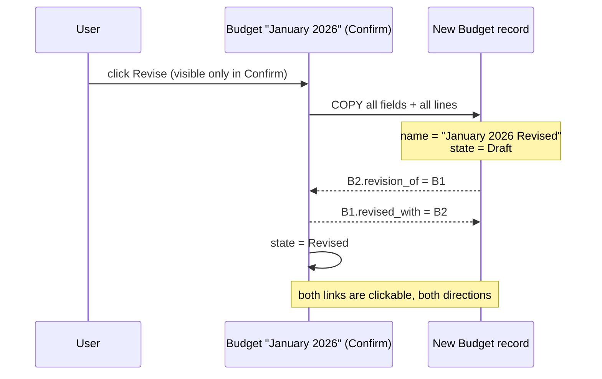

*Rules:*
- R-C2-01 **MUST** — `Revise` **creates a new record** (a copy). It is not an in-place edit.
- R-C2-02 **MUST** — the original moves to state `Revised`.
- R-C2-03 **MUST** — **two-way link**: original.`Revised With` → revision; revision.`Revision Of` → original.
- R-C2-04 **MUST** — the `Revision Of` link is a **clickable hyperlink** that navigates.
- R-C2-05 **MUST** — **naming rule, mandated verbatim**: *"In case of Revision Keep the original Budget name as it is and add the word "Revised" in last (For e.g. Project A Revised)"*. So `"January 2026"` → `"January 2026 Revised"`. Note the space, note the capital R, note it is appended at the **end**.
- R-C2-06 **MUST** — the new budget starts in `Draft` (per the Menu & Stage Mapping: New → Draft), and can itself be Confirmed and Revised again.

> **Worked example to show a judge:** "Budget *January 2026*, Furniture, Expense, committed ₹2,00,000. We spent ₹10,000, so Achieved 5%, ₹1,90,000 to go. Now the owner raises the ceiling to ₹3,50,000 — that's the exact example in their drawing. We press Revise: a **new** record *January 2026 Revised* appears in Draft with the same lines, the old one flips to Revised, and both carry clickable links to each other. We never overwrote the original — the audit trail of what was originally approved survives."

---

##### C3. Menu & Stage Mapping — the authoritative Budget state machine — MUST

This is a spec table drawn on the board, not a screen. It is the definitive statement of what each button does.

| Menu | Stage | Output (verbatim) |
|---|---|---|
| New | Draft | "Here user can create a new fresh Budget" |
| Confirm | Confirm | "User confirm the newly created Budget" |
| Revise | Revised | "Only Visible at confirmed Stage" + "Here User can revise the new confirmed budget e.g. Budgeted Expense was 2,00,000 now you need to change the limit to 3,50,000" |
| Cancelled | Cancelled | "Here User can archive the existing budget" |

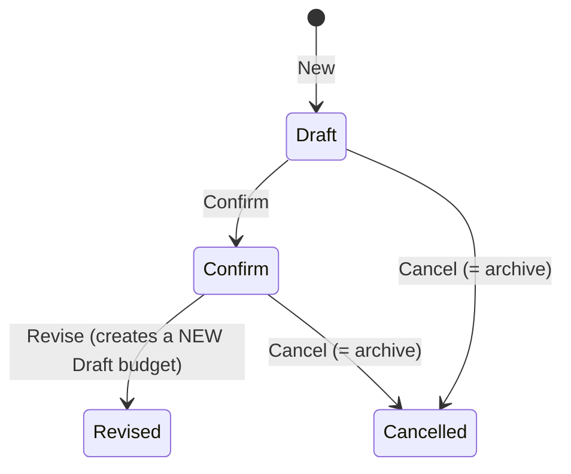

---

##### C4. Budget Report — List View — MUST
*Purpose:* list of budgets with an **inline pie chart per row**.

| Column | Sample |
|---|---|
| Budget | January 2026 |
| Start Date | 01/01/2026 |
| End Date | 31/01/2026 |
| Status | Confirm |
| **Pie Chart** | a pie thumbnail **inside the table cell** |

*Buttons:* `New` · Search · `Back` · list/kanban view-switcher icons.
*Row click:* "Open Form View on Click".

*Rules:*
- R-C4-01 **MUST** — the pie chart renders **inside a list column, per row**. Two segments, labelled in the drawing: **`Achieved`** (cyan) and **`Balance`** (red/pink). This is a graphical widget embedded in a table — unusual, explicitly required, and the single most visually distinctive thing in the whole mockup. Do not substitute a progress bar.
- R-C4-02 **MUST** — Status column shows the workflow stage.

---

##### C5. Budget Report — Kanban View — MUST
Card content: Budget Name, `Start Date  01/01/2026`, `End Date  31/01/2026`. Same toolbar and switcher. Card click → "Open Form View on Click".

- R-C5-01 **MUST** — **Budget Report ships in THREE views** with a working switcher: **List, Kanban, and Form**. Both list rows and kanban cards open the form.

---

##### C6. Achieved-Amount Drill-down List — MUST
Opened by clicking the Achieved Amount button on a budget line. Shows "all Invoices/Bills having same analytical for the budget period". Reuse the generic list component with a filter — near-zero cost, but it is an explicitly drawn behaviour.

---

#### GROUP D — Transactions (14 screens)

Board section banner: **"Data Input Forms"** (brown band, `acc_r5c1`/`r5c2`).

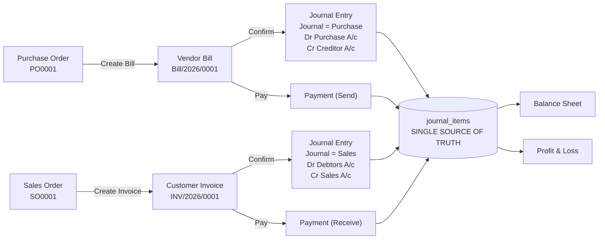

---

##### D1. Purchase Order — Form — MUST
*Purpose:* vendor purchase order with per-line project tagging.

| Field | Type | Rule |
|---|---|---|
| PO No. | text, read-only | Sample `PO0001`. **"(Create Sequence auto generate PO number +1 of Last order)"** |
| Vendor Name | m2o | "(From Contact Master - Many to one)". Sample "Mr Rahul" |
| PO Date | date | — |

**Line grid:**

| Sr. No. | Product | Budget Analytics | Qty | Unit Price | Total |
|---|---|---|---|---|---|
| *(type row)* | From Product Master - Many to one | From Analytics Master - Many to One | Numeric | Monetary | Monetary |
| 2. | Table | Project 1 | 3 | 2000 | **6000** `(3Qty * 2000)` |
| | **Total** | | | | **6000** |

*Buttons:* `New` · `Confirm` (primary) · `Create Bill` · `Cancel` · `Back`

*Rules:*
- R-D1-01 **MUST** — `Total = Unit Price × Quantity` per line. Annotated twice on the board: "Unit Price * Quantity" and "(3Qty * 2000)".
- R-D1-02 **MUST** — footer Total row = sum of line totals.
- R-D1-03 **MUST** — **Budget Analytics m2o on every line.** This is what feeds the Expense side of budget achievement.
- R-D1-04 **MUST** — **Non-blocking budget warning on Confirm.** Exact text:
  > ⚠ **Exceeds Approved Budget**
  > "The entered amount is higher than the remaining budget amount for this budget line. Consider adjusting the value or revise the budget."

  It is a **warning, not a block** — the user must still be able to proceed. Header on the note: "Non Blocking Warning on Confirmation of PO".
- R-D1-05 **MUST** — `Create Bill` produces a Vendor Bill carrying forward **Vendor name, Product, Price, Quantity** ("Bill Created from PO fetch Vendor name, Product, Price, Quantity").
- R-D1-06 — **Note:** the PO line grid has **no Chart of Accounts column**. Only the Bill and the Invoice do. Do not add one. (Verified on tile `acc_r5c0`/`acc_r6c0`.)

---

##### D2. Purchase Order — List — MUST (derived from A6 menu)
Columns: PO No., Vendor, PO Date, Total, Status. Not drawn, but the menu item `Purchase Order` must land on a list (G-01).

---

##### D3. Vendor Bill — Form — MUST
*Purpose:* the supplier bill. **This is the most rule-dense screen on the board.**

| Field | Type | Rule |
|---|---|---|
| Vendor Bill No. | read-only | Sample `Bill/2026/0001`. "(auto generate Bill Number +1 of Last Bill)" |
| Vendor Name | m2o | "(From Contact master - Many to one)" |
| **Status** | **computed badge** | `Paid` / `Partial` / `Not Paid` — "only one at a time, computation given below" |
| Bill Reference | text | Sample `ABC-26-001`, "Alpha numeric (Text)" — **user-typed, distinct from the auto number** |
| Bill Date | date | — |
| Due Date | date | — |

**Line grid:**

| Sr. No. | Product | **Chart of Account** | Budget Analytics | Qty | Unit Price | Total |
|---|---|---|---|---|---|---|
| *(type row)* | Product Master - m2o | **Purchase** | Analytics master - m2o | Numeric | Monetary | Monetary |
| 2. | Table | *(defaulted)* | Project 1 | 3 | 2000 | 6000 |
| | **Total** | | | | | **6000** |

**Payment summary block (bottom-right):**

| Label | Value | Rule |
|---|---|---|
| Paid Via Cash | 6000 | sum of cash payments allocated |
| Paid Via Bank | *(blank in sample)* | sum of bank payments allocated |
| **Amount Due** | **0** | **`(Total - Amount Paid)`** |

*Buttons:* `New` · `Confirm` (primary) · `Pay` (primary) · **`PO`** (smart button) · **`Budget`** (smart button) · `Cancel` · `Back`

*Rules:*
- R-D3-01 **MUST** — **"Purchase account to be set by default"** on the Chart of Accounts column. Green arrow points straight at that column.
- R-D3-02 **MUST** — **Status badge computation** (mockup legend box, verbatim):

  | Badge | Condition |
  |---|---|
  | `Paid` (green outline) | **If amount due = 0** |
  | `Partial` (orange outline) | **If amount due < Bill Total** |
  | `Not Paid` (pink/red outline) | **If amount due = Bill Total** |

  Read the middle rule carefully: as written, `Partial` is `due < total`, which also covers `due = 0`. The badges are declared mutually exclusive ("only one at a time"), so evaluate **in order**: `due = 0 → Paid`, else `due = total → Not Paid`, else `Partial`. Never a manual field.
- R-D3-03 **MUST** — `Amount Due = Total − (Paid Via Cash + Paid Via Bank)`.
- R-D3-04 **MUST** — **On Confirm, auto-create a Journal Entry**, verbatim:
  > "As soon as the vendor bill is confirmed a journal entry would be created that would become visible in the Journal Entries section / For Vendor bill always purchase chart of account would be set by default / **The Journal Entry should always be balanced** / That is the debit and credit totals need to match"

  Lines drawn: **Purchase A/c** and **Creditor A/c**. So: `Dr Purchase Expense A/c 6,000 / Cr Creditors A/c 6,000`.
- R-D3-05 **MUST** — the generated entry's **Journal is forced to `Purchase`**: "In case of bill journal would always be Purchase".
- R-D3-06 **MUST** — the generated entry's **Accounting Date is fetched from the bill's date**, not today: "(Bill date fetch from bill)".
- R-D3-07 **MUST** — **`PO` smart button conditional visibility**, verbatim: *"On click open the PO from which Bill Created (**Only show this if bill created from PO hide if Bill Created Fresh without PO**)"*.
- R-D3-08 **MUST** — **`Budget` smart button**: *"On Click Open the Budget Analytic Report that is used the Bill"* — navigate to the Budget Analytic Report filtered to the analytic account(s) used on this bill.
- R-D3-09 **MUST** — **Non-blocking budget warning on Confirm of Bill**, same exact text as the PO warning. **Two separate hook points** — the drawing shows the identical note twice, once under the PO and once under the Bill. Wire both.
- R-D3-10 **MUST** — `Pay` opens the Payment form (D5).

---

##### D4. Vendor Bill — List — MUST (derived)
Columns: Bill No., Vendor, Bill Date, Due Date, Total, Amount Due, Status badge.

---

##### D5. Bill Payment / Invoice Payment — Form — MUST
*Purpose:* register a payment. **One model serves both directions.** Reached via the `Pay` button on a Bill or an Invoice.

| Field | Type | Rule |
|---|---|---|
| Payment Type | **radio: Send / Receive** | `Send` selected on the Bill Payment; `Receive` selected on the Invoice Payment |
| Partner | m2o | **"Autofill Partner Name from Invoice/Bill"** |
| Amount | monetary | **"Autofill Amount Due from Invoice/Bill"** — sample 6000 |
| Date | date | **"(Default Today's Date)"** |
| Payment Via | selection | **"Default set to Bank can be selected to Cash"** |
| Note | text | "Alpha Numeric (Text)" |

*Buttons:* `Confirm` (primary) · `Cancel` · **gear/settings icon ⚙**
*Statusbar:* `Draft > Confirm > Cancelled` (**three** stages — note this differs from Budget's four)

*Rules:*
- R-D5-01 **MUST** — all four autofills/defaults above.
- R-D5-02 **MUST** — the gear icon opens an action menu: *"Provide option 1. **Print** 2. **Send** (Allow user to send from Mail)"*.
- R-D5-03 **MUST** — on Confirm, the source document's `Paid Via Cash` / `Paid Via Bank` and `Amount Due` update, and the Status badge recomputes.
- R-D5-04 **SHOULD** — Print produces a PDF receipt/voucher. (Print is drawn; the PDF requirement is only *explicit* on the two reports, so the payment print is a smaller obligation.)
- R-D5-05 **NICE** — actual outgoing email. Mark as SHOULD only if an SMTP key is at hand; otherwise a "Send" dialog that composes and shows the message satisfies the drawing at 5% of the cost.
- R-D5-06 **MUST** **`[ADDITION]`** — the payment must itself post a journal entry (`Dr Bank/Cash / Cr Debtors` for a receipt; `Dr Creditors / Cr Bank/Cash` for a payment). *Reason:* the mockup only draws entries for Bill and Invoice confirmation, but without a payment entry the Balance Sheet's Bank and Cash rows are permanently zero and Debtors never clears — the Balance Sheet the organizers drew cannot be produced. This is not an optional flourish; it is required for the drawn report to work.

---

##### D6. Payment / Receipt — Lists — MUST (derived from A6)
Two menu entries, one table, filtered by direction.

---

##### D7. Sales Order — Form — MUST

| Field | Type | Rule |
|---|---|---|
| SO No. | read-only | Sample `SO0001` (sequence) |
| Customer Name | m2o | "(From Contact Master - Many to one)" — sample "Mr. Rahul" |
| SO Date | date | — |

**Line grid:** `Sr. No. | Product | Budget Analytics | Qty | Unit Price | Total` — same types and same `Unit Price × Qty` rule; footer Total = 6000.

*Buttons:* `New` · `Confirm` (primary) · `Create Invoice` · `Cancel` · `Back`

*Rules:*
- R-D7-01 **MUST** — `Create Invoice` copies **Customer Name, Product, Price, Quantity** onto the new Customer Invoice ("Invoice Created from SO fetch Customer Name, Product, Price, Quantity").
- R-D7-02 — **Note:** the transcription lists Chart of Accounts on the SO grid in parentheses, but the drawn PO grid (its structural twin) has no such column, and only posting documents need an account. **Ruling: no CoA column on the Sales Order.** See §12.7.
- R-D7-03 — **Note:** the drawing shows **no budget warning on SO confirmation** — only on PO and Bill. Do not add one; matching the spec exactly is worth more than symmetry.

---

##### D8. Sales Order — List — MUST (derived)

---

##### D9. Customer Invoice — Form — MUST
The mirror of the Vendor Bill, with Sales instead of Purchase.

| Field | Type | Rule |
|---|---|---|
| Customer Invoice No. | read-only | Sample `INV/2026/0001`, "(auto generate Invoice Number +1 of Last Bill)" |
| Invoice Reference | text | Sample `ABC-26-001`, "Alpha numeric (Text)" — user-typed |
| Customer Name | m2o | "(from Contact master - Many to one)" |
| Invoice Date | date | — |
| Due Date | date | **separate from Invoice Date** |
| Status | computed badge | `Paid` / `Partial` / `Not Paid`, "only one at a time, computation given below" |

**Line grid:** `Sr. No. | Product | Chart of Accounts | Budget Analytics | Qty | Unit Price | Total` with type row `Product Master - m2o | Sales | Analytics master - m2o | Numeric | Monetary | Monetary`.

**Payment summary:** `Paid Via Cash 6000` · `Paid Via Bank` · `Amount Due 0 (Total - Amount Paid)`.

*Buttons:* `New` · `Confirm` (primary) · `Pay` (primary/pink) · **`SO`** (smart button) · **`Budget`** (smart button) · `Cancel` · `Back`

*Rules:*
- R-D9-01 **MUST** — **"Sales account to be set by default"** on the Chart of Accounts column.
- R-D9-02 **MUST** — On Confirm, auto-create a balanced journal entry, verbatim:
  > "As soon as the Customer Invoice is confirmed a journal entry would be created that would become visible in the Journal Entries section / For Customer Invoice always Sales chart of account would be set by default / The Journal Entry should always be balanced / That is the debit and credit totals need to match"

  → `Dr Debtors A/c 6,000 / Cr Sales Income A/c 6,000`.
- R-D9-03 **MUST** — the entry's Journal is forced to **`Sales`** (by symmetry with the explicit Purchase rule).
- R-D9-04 **MUST** — `SO` smart button follows the same conditional-visibility rule as the Bill's `PO` button: shown only when the invoice was created from a Sales Order.
- R-D9-05 **MUST** — `Budget` smart button → Budget Analytic Report for the analytic used.
- R-D9-06 **MUST** — Status badge and Amount Due follow the identical formulas as D3.

---

##### D10. Customer Invoice — List — MUST (derived)

---

##### D11. Journal Entries — List View — MUST
*Purpose:* the ledger of all entries, whether auto-generated or manual.

| Column | Sample row 1 | Sample row 2 |
|---|---|---|
| Date | Sep 1 | Sep 2 |
| Number | Bill/2026/0001 | Inv/2026/001 |
| Partner | Mr. Rahul | Mr Raj |
| Journal | Purchases | Sales |
| Total | Rs. 30,000 | Rs. 10,500 |
| Status | **Posted** (green) | **Draft** (blue) |

*Buttons:* `New` (pink primary) · `Back`

*Rules:*
- R-D11-01 **MUST** — colour-coded status badges: Posted = green, Draft = blue.
- R-D11-02 **MUST** — auto-generated entries from Bills and Invoices appear here. "would become visible in the Journal Entries section" is stated twice.
- R-D11-03 — Note the organizers' own sample numbering is inconsistent (`Bill/2026/0001` 4-digit vs `Inv/2026/001` 3-digit). **Pick 4-digit everywhere and be consistent** — internal consistency beats copying their typo.

---

##### D12. Journal Entry — Form View — MUST
*Purpose:* the core general-ledger posting screen. Reached by `New` on D11 ("When Clicking on new"), or by opening an auto-generated entry.

| Field | Type | Rule |
|---|---|---|
| Accounting Date | date | On generated entries: **fetched from the source document's date** |
| Journal | m2o | "Selection (From journals Many to one)". Forced to Purchase for bills, Sales for invoices |

**Line grid:**

| Account | Partner | Debit | Credit |
|---|---|---|---|
| Asset A/c | Rahul | Rs. 10,000 | |
| Bank A/c | | | Rs. 10,000 |

*Field Explanation callout, verbatim:*
- "Account - Selection From Chart of Accounts (Many to one)"
- "Partner - Selection from contact master"
- "The Transaction would be connected through Chart of Accounts"

*Buttons:* `Post` (primary) · `Cancel` · `Back` — and on a generated/posted entry: **`Reset to Draft`** · `Back`.

*Rules:*
- R-D12-01 **MUST** — **BLOCKING validation**, in red on the board: *"Blocking warning if the debit and credit amount don't match."* You **cannot post** an unbalanced entry. This is the hardest rule in the spec and the one a judge will test first.
- R-D12-02 **MUST** — `Reset to Draft` action exists on entries.
- R-D12-03 **MUST** **`[ADDITION]`** — enforce the balance rule at the **database** level too (a CHECK constraint or a transaction-level assertion named e.g. `journal_entry_must_balance`), not only in the UI. *Reason:* the drawing says the entry "should **always** be balanced". "Always" means it must hold even when the entry is created by the posting engine, by seed data or by an API call — a UI-only check does not satisfy "always", and being able to show the constraint name is 10 seconds of unbeatable credibility.

> **Say this to a judge:** "The organizers wrote 'blocking warning if debit and credit don't match'. We took 'blocking' literally — this is a database constraint, not a form validation. Watch." *(Then post an unbalanced entry from a terminal and show the rejection.)*

---

#### GROUP E — Reports (3 screens)

---

##### E1. Profit and Loss Report — MUST
*Purpose:* Income minus Expenses for a chosen year.

| Control | Value |
|---|---|
| Year selector | `2026` |

**Rows, with the sample figures drawn on the board:**

| Row | Balance | Computation (verbatim from the "Field Computation" callout) |
|---|---|---|
| **Income** *(section)* | Rs. 10000 | "Income - Total of Income" |
| Income from Sales | Rs. 10000 | "Income from Sales - Total of account type **Income**" |
| **Expenses** *(section)* | Rs. 7000 | "Expenses - Total of All expenses" |
| Purchase Expense | Rs. 6000 | "Purchase Expense - Total of Account type **Expense**" |
| Other Expense | Rs. 1000 | "Other Expense - Total of account type **Other Expense**" |
| **Net Income** *(highlighted)* | Rs. 3000 | "Net Income - **Difference of Income - Expenses**" |

*Buttons:* `Print` (primary) — **"Pdf download on click"** · `Back`

*Rules:*
- R-E1-01 **MUST** — the year filter restricts journal items to that year.
- R-E1-02 **MUST** — `Print` **downloads a PDF**. Explicitly annotated. PDF generation is a required deliverable, not optional.
- R-E1-03 **MUST** — every figure derives from `journal_items` joined to `accounts` **by account type**, not from invoice/bill tables. Arithmetic check on the sample: `10000 − 7000 = 3000` ✅ and `6000 + 1000 = 7000` ✅.
- R-E1-04 — **Ambiguity:** "Income" and "Income from Sales" are both "total of account type Income" and both show 10000. Ruling: `Income` is the **section header total** and `Income from Sales` is the one account-type row inside it. That reproduces the drawn numbers exactly. Same shape on the expense side: `Expenses` = section total = `Purchase Expense` + `Other Expense`.
- R-E1-05 — **Account-type taxonomy implication:** the P&L needs three distinct P&L types — `Income`, `Expenses`, `Other Expenses` — which is exactly what the grouped CoA dropdown (B8) provides. The two lists are consistent; build them as one enum.

---

##### E2. Balance Sheet — MUST
*Purpose:* Assets vs Liabilities snapshot for a chosen year.

| Control | Value |
|---|---|
| Year selector | `2026` |

**Two-column layout, exactly as drawn:**

| Assets | Liabilities |
|---|---|
| Bank | Capital |
| Cash | Creditors |
| Debtors | |
| **Total Asset** | **Total (Liabilities)** |

**Account-type mapping, verbatim from the arrow note:**

| Row | Fed by |
|---|---|
| Bank | "Account type **Asset - Bank**" |
| Cash | "Account type **Asset - cash**" |
| Debtors | "Account type **Asset - Debtors**" |
| Creditors | "Account type **Liability - creditor**" |
| Capital | "Account Type **Capital**" |

*Buttons:* `Print` (primary) · `Back`

*Rules:*
- R-E2-01 **MUST** — the five rows come from account **type**, per the mapping above.
- R-E2-02 **MUST** — footer rows `Total Asset` and `Total (Liabilities)` (confirmed on tile `acc_r8c1`).
- R-E2-03 **MUST** — `Print` → PDF, same as the P&L.
- R-E2-04 **MUST** **`[ADDITION]`** — **fold the current-period Net Income into the Liabilities/Capital side** (a "Current Year Earnings" row). *Reason:* the mockup demands `Total Asset` and `Total (Liabilities)` side by side. Without this row those two totals **will not be equal**, because every rupee of profit sits in Assets but has no matching entry on the other side. This is the single check an accounting judge performs in five seconds. Label the row plainly and be ready to explain it.

> **Say this to a judge:** "The organizers asked for Total Asset and Total Liabilities. For those to actually match you have to push the period's net income onto the equity side — that's Current Year Earnings. Our P&L says Net Income ₹3,000, and that same ₹3,000 shows up here inside Capital. That's why the two totals tie."

---

##### E3. Budget Report — MUST
Already fully specified as **C4 (list, with per-row pie chart)**, **C5 (kanban)** and **C1 (form)**. It appears under the `Report` menu column as well as the Budget area — one model, two entry points.

---

#### GROUP F — Portal (Contact role) — SHOULD

Not drawn as a screen anywhere. Defined only in the PDF's Primary Actors list and the mockup's Role annotation.

| ID | Requirement | Source | Priority |
|---|---|---|---|
| F-01 | A portal user sees **only their own** invoices/bills | "can only see his invoices/bills in paid/unpaid status" | SHOULD |
| F-02 | Invoices/bills shown with paid/unpaid status | same | SHOULD |
| F-03 | Portal user can **pay their dues directly from the portal** | "can directly pay his dues from portal" | SHOULD |
| F-04 | "Contact users can be created when creating Contact Master data" | PDF §2 | SHOULD |

*Justification for SHOULD:* it is the only functional area with **no wireframe at all**, so there is nothing for a judge to diff against, and it is a second UI surface with its own auth path. It is the correct thing to cut last (see §13). Two read-only pages satisfy F-01/F-02 in under an hour.

---

### 3.4 HIDDEN REQUIREMENTS — only in the drawing, NOT in the PDF

**This is the most important subsection in this document.** The PDF is 180 lines and mentions none of the following. Every one of these is drawn or annotated on the Excalidraw board, and every one of them is a place where a team who only read the PDF loses a point. There are 52 of them.

#### Category 1 — Auth & roles (7)

| # | Hidden requirement | Where |
|---|---|---|
| H-01 | **Three roles, not two**: Admin, User (portal), **Accountant** — with distinct written permission sets. The Create User form only draws two radios; the Accountant role exists only in the annotation text. | Role note, `acc_r0c1` |
| H-02 | Self-signup **may only create a portal user**. A signup can never mint an admin or accountant. | "only invoicing user will be create" |
| H-03 | Login Id must be **unique AND 6–12 characters**. | Credential note, stated twice |
| H-04 | Email must not be a **duplicate in database**. | same |
| H-05 | Password must contain **a lowercase, an uppercase and a special character**, and be **more than 8 characters**. | same |
| H-06 | The failed-login error string is fixed: **`Invalid Login Id or Password`**. | Login note |
| H-07 | A **Forgot Password page** is required — referenced from both footers, drawn nowhere. | Login + Sign Up notes |

#### Category 2 — The universal view scaffold (7)

| # | Hidden requirement | Where |
|---|---|---|
| H-08 | **List view is the default for every master.** | Master Data banner note |
| H-09 | **`New` opens a blank form; clicking a saved row opens the same form populated.** One contract, every model. | same |
| H-10 | Every master needs **list + kanban with a two-way switcher** — explicitly for Contact, Product **and Analyticals**. | "Create Kanban and List View in the same manner for Product, Analyticals" |
| H-11 | **Every screen has a `Back` button** — the organizers expect navigation chrome, not browser-back. | 15+ cards |
| H-12 | Standard master toolbar is exactly **`New` · `Confirm` · `Back`**. | Contact/Product/Analytic forms |
| H-13 | Chart of Accounts alone gets **two extra toolbar buttons**: `Archived` and `Home`. | `acc_r2c0` |
| H-14 | Uploaded images must render in **both the list (thumbnail column) and the kanban card**, not just on the form. | Contact list + kanban |

#### Category 3 — Master data behaviour (8)

| # | Hidden requirement | Where |
|---|---|---|
| H-15 | Contact **email must be unique** — the placeholder literally reads "Unique Email". | Contact form |
| H-16 | Product Type is a fixed 3-value selection: **Goods / Service / Combo**. | Blue note |
| H-17 | Product **Category is a many2one with create-on-the-fly** ("Category Can be created and saved on the fly (Many2one Field)") — an Odoo-style quick-create widget, not a text box. | Orange note |
| H-18 | Chart of Accounts ships **pre-configured with exactly 8 seed accounts**. | "All this accounts are to be pre configured" |
| H-19 | Account Type is a **grouped dropdown with non-selectable headings**: Balancesheet {Asset, Liability, Bank, Capital, Cash} and Profit and Loss {Income, Expenses, Other Expenses}. | `acc_r3c0` |
| H-20 | **Account Type is the report routing key** — "used for how the account to be treated and where it appears in reports". Reports must key off type, never off account name. | same |
| H-21 | Journals ship **seeded with 4 records** (Sales, Purchase, Bank, Cash), each with a fixed-selection Type and a Default Account m2o to the CoA. | Journals list |
| H-22 | The Analytic Account form carries an **embedded reverse-lookup table of every Budget using it**, with Committed and Achieved rolled up. | `acc_r4c0` |

#### Category 4 — The Budget revision workflow (9) — *the richest hidden area on the board*

| # | Hidden requirement | Where |
|---|---|---|
| H-23 | **Revise is a record-COPY workflow, not an edit.** Pressing Revise creates a **new Budget record** and moves the old one to state `Revised`. | Menu & Stage Mapping |
| H-24 | **Two-way linking**: the original gets `Revised With` → the revision; the revision gets `Revision Of` → the original. | Both budget cards |
| H-25 | The `Revision Of` link must be a **clickable hyperlink** that navigates: "(Original Budget Clickable link)". | `acc_r4c1` |
| H-26 | **Mandated naming rule**: keep the original name verbatim and **append the word "Revised" at the end** — "Project A Revised". A text-only reader would never infer this. | Field Explaination box |
| H-27 | The `Revise` button is **conditionally visible — Confirmed stage only**. | "Only Visible at confirmed Stage" |
| H-28 | Budget `Cancel` means **ARCHIVE**, not delete. | "Here User can archive the existing budget" |
| H-29 | **Achieved Amount, Achieved % and Amount To Achieve are hidden unless the budget is Confirmed** — the phrase "Only Visible for Confirmed Budget" is written three separate times. | Field Explaination box |
| H-30 | Exact formulas: `Achieved % = (Achieved Amount / Committed Amount) * 100` and `Amount To Achieve = Committed Amount − Achieved Amount`. | same |
| H-31 | Budget has a **4-stage** state machine `Draft > Confirm > Revised > Cancelled`, unlike Payment's 3-stage one. | Statusbar ribbon |

#### Category 5 — Budget achievement & analytics (6)

| # | Hidden requirement | Where |
|---|---|---|
| H-32 | Achieved Amount is computed by **searching the analytic account by name** across Sales Invoices / Vendor Bills, **filtered to the budget period**, summing totals. | Field Explaination |
| H-33 | **Directional type mapping, fixed**: "Analyticals on All Invoice lines to be mapped with type = **Income**"; "Analyticals on All Purchase Order/Vendor Bill Lines to be mapped with Type = **Expenses**". Income achievement comes only from invoices, expense achievement only from bills. | same |
| H-34 | Achieved Amount is a **clickable drill-down** opening "list view of all Invoices/Bills having same analytical for the budget period". | same |
| H-35 | Analytic `Type` is a **two-value** selection: Income / Expense only. | Analyticals form |
| H-36 | The Budget Report list must render a **PIE CHART inside a table column, per row**, with two labelled segments `Achieved` and `Balance`. A graphical widget embedded in a list. | `acc_r4c2` |
| H-37 | The Budget Report must ship in **three views** — List, Kanban and Form — with a working switcher, and **both** the list row and the kanban card open the form. | `acc_r4c2`/`r4c3` |

#### Category 6 — Documents, sequences and conversion (7)

| # | Hidden requirement | Where |
|---|---|---|
| H-38 | **Auto-sequences with exact formats**: `PO0001` (no year), `Bill/2026/0001`, `INV/2026/0001`, `SO0001` — each "auto generate ... +1 of Last". | PO / Bill / Invoice / SO headers |
| H-39 | The auto number is **distinct from a user-typed free-text reference** (`Bill Reference` / `Invoice Reference`, e.g. `ABC-26-001`, "Alpha numeric (Text)"). Two separate fields. | Bill + Invoice |
| H-40 | **`Create Bill` from a PO carries forward Vendor Name, Product, Price, Quantity.** | Dashed arrow label |
| H-41 | **`Create Invoice` from an SO carries forward Customer Name, Product, Price, Quantity.** | Dashed arrow label |
| H-42 | Invoice/Bill have **both an Invoice/Bill Date and a separate Due Date**. | Both forms |
| H-43 | `Total = Unit Price × Quantity` is an annotated computed field — written twice ("Unit Price * Quantity", "(3Qty * 2000)"). | PO + Invoice grids |
| H-44 | **Chart of Accounts defaults per document type**: "Purchase account to be set by default" on Vendor Bill lines; "Sales account to be set by default" on Customer Invoice lines. | Two green arrows |

#### Category 7 — Posting, payment and conditional UI (10)

| # | Hidden requirement | Where |
|---|---|---|
| H-45 | Confirming a Bill or an Invoice **auto-creates a Journal Entry visible in the Journal Entries section**, and it must **always balance**. Stated in two identical red-boxed notes. | `acc_r6c1`, `acc_r7c1` |
| H-46 | The generated entry's **Journal is forced by document type**: "In case of bill journal would always be Purchase" (and Sales for invoices). | Journal Entry note |
| H-47 | The generated entry's **Accounting Date is fetched from the source document**, not today: "(Bill date fetch from bill)". | Journal Entry field |
| H-48 | Journal entries support a **`Reset to Draft`** action. | Demo Journal Entry buttons |
| H-49 | **BLOCKING** validation on Post when debit ≠ credit — in red, and distinct from the non-blocking budget warnings. | `acc_r3c2` |
| H-50 | **Non-blocking** over-budget warning on **BOTH** PO confirm and Bill confirm, with identical exact wording. Two hook points, one message. | `acc_r6c0`, `acc_r6c1` |
| H-51 | Payment status is a **computed, mutually-exclusive badge** — Paid / Partial / Not Paid — derived from amount due, **never** set by hand. | Legend box |
| H-52 | Payment is **split across two channels** on the document footer: `Paid Via Cash` and `Paid Via Bank`, with `Amount Due = Total − Amount Paid`. | Bill + Invoice footers |
| H-53 | **Conditional smart buttons**: the `PO`/`SO` button is **hidden** when the document was created fresh and **shown** when created from a source order. An explicit visibility rule, spelled out in a sentence. | Bill + Invoice |
| H-54 | A `Budget` smart button on the Bill/Invoice **opens the Budget Analytic Report** for the analytic used on that document — cross-navigation from transaction back to budget. | Two arrow notes |

#### Category 8 — Payments and reports (6)

| # | Hidden requirement | Where |
|---|---|---|
| H-55 | Payment is **directional**: a Send / Receive radio, so one model serves both vendor payments and customer receipts. | Payment form |
| H-56 | Payment **autofills Partner and Amount Due from the source document**, defaults Date to today, and defaults **Payment Via to Bank** (switchable to Cash). Four separate defaults. | Payment annotations |
| H-57 | Payment has its own **3-stage** state machine `Draft > Confirm > Cancelled`. | Payment statusbar |
| H-58 | A **gear menu on the payment offering Print and Send**, including sending by email from the app. | "Provide option 1. Print 2. Send (Allow user to send from Mail)" |
| H-59 | Both reports need a **year filter** and a **`Print` button that downloads a PDF** — "Pdf download on click". PDF generation is required, not optional. | Both reports |
| H-60 | The Balance Sheet must show **`Total Asset` and `Total (Liabilities)`** footer rows — i.e. it has to actually add up. | `acc_r8c1` |

#### Category 9 — Dashboard (2)

| # | Hidden requirement | Where |
|---|---|---|
| H-61 | The dashboard is **not decorative**: live state-based counters (Sales All/Confirmed/Draft, Purchase All/Confirmed/Draft) plus budget aggregation (Achieved / Budget / Committed). | `acc_r1c1` |
| H-62 | The mega-menu defines **16 navigable destinations** — a complete model surface that must all resolve. | `acc_r1c1`/`r1c2` |

> **Say this to a judge who walks up mid-event:**
> "The PDF is one page. The mockup has about fifty requirements the PDF never mentions — the budget revision copy workflow with the two-way link and the mandated 'Revised' suffix, the smart button that hides itself when a bill wasn't made from a PO, the pie chart inside a list row, the non-blocking budget warning on two different buttons with identical wording, the blocking one on Post. We built from the drawing, not from the PDF."

---

### 3.5 Cross-cutting computed fields — every formula in one place

| Field | Formula | Source (verbatim) |
|---|---|---|
| Line Total | `unit_price × quantity` | "Unit Price * Quantity" / "(3Qty * 2000)" |
| Document Total | `Σ line totals` | Footer "Total 6000" |
| Amount Paid | `Paid Via Cash + Paid Via Bank` | Footer block |
| Amount Due | `Total − Amount Paid` | "(Total - Amount Paid)" |
| Status badge | `due = 0` → **Paid**; else `due = total` → **Not Paid**; else **Partial** | Legend box |
| Achieved Amount (Income line) | `Σ` invoice line totals where `analytic = line.analytic` AND `date` within budget period | Field Explaination |
| Achieved Amount (Expense line) | `Σ` bill line totals where `analytic = line.analytic` AND `date` within budget period | Field Explaination |
| Achieved % | `(achieved / committed) × 100` | Field Explaination |
| Amount To Achieve | `committed − achieved` | Field Explaination |
| Over-budget test | `document_total > (committed − achieved)` for the tagged budget line → show warning, allow proceed | Warning note |
| Journal Entry total | `Σ debit` (= `Σ credit`) | Journal Entries list "Total" column |
| P&L: Income | `Σ` credits − debits on accounts of type `Income`, within year | Field Computation |
| P&L: Purchase Expense | `Σ` debits − credits on accounts of type `Expenses`, within year | Field Computation |
| P&L: Other Expense | `Σ` debits − credits on accounts of type `Other Expenses`, within year | Field Computation |
| P&L: Expenses | `Purchase Expense + Other Expense` | "Total of All expenses" |
| P&L: Net Income | `Income − Expenses` | "Difference of Income - Expenses" |
| BS: Bank | `Σ` debits − credits on accounts of type `Bank` | Mapping note |
| BS: Cash | `Σ` debits − credits on accounts of type `Cash` | Mapping note |
| BS: Debtors | `Σ` debits − credits on accounts of type `Asset` | Mapping note |
| BS: Creditors | `Σ` credits − debits on accounts of type `Liability` | Mapping note |
| BS: Capital | `Σ` credits − debits on accounts of type `Capital` | Mapping note |
| BS: Current Year Earnings **`[ADDITION]`** | `= P&L Net Income` | Needed for the drawn totals to tie |

---

### 3.6 Sequences and numbering

| Document | Format | Source | Notes |
|---|---|---|---|
| Purchase Order | `PO0001` | "(Create Sequence auto generate PO number +1 of Last order)" | **No year segment** — do not add one |
| Sales Order | `SO0001` | Drawn as `SO0001` | No year segment |
| Vendor Bill | `Bill/2026/0001` | "(auto generate Bill Number +1 of Last Bill)" | Year segment, 4-digit counter |
| Customer Invoice | `INV/2026/0001` | "(auto generate Invoice Number +1 of Last Bill)" | Year segment, 4-digit counter. Note the organizers' own typo "of Last Bill" |
| Journal Entry (generated) | inherits the source document number | List shows `Bill/2026/0001`, `Inv/2026/001` | Reuse the document number as the entry number |
| Payment | *not specified* | — | **`[ADDITION]`** `PAY/2026/0001` for consistency |

**Implementation rule (MUST):** "+1 of Last" implies a counter, not a database auto-increment ID. Keep a `sequences` table keyed by `(prefix, year)` and increment it inside the same transaction that inserts the document, so two simultaneous saves cannot produce the same number. Reset the counter when the year changes.

---

### 3.7 State machines — three different ones, do not merge them

| Model | Stages | Source |
|---|---|---|
| **Budget** | `Draft` → `Confirm` → `Revised` → `Cancelled` (4) | Statusbar ribbon + Menu & Stage Mapping |
| **Payment** | `Draft` → `Confirm` → `Cancelled` (3) | Payment statusbar |
| **Journal Entry** | `Draft` ⇄ `Posted` (via `Post` / `Reset to Draft`), plus `Cancel` | Journal Entry buttons + list badges |
| **PO / SO** | `Draft` → `Confirmed` → `Cancelled` | Dashboard counters name All / Confirmed / Draft; forms have `Confirm` and `Cancel` |
| **Bill / Invoice** | `Draft` → `Confirmed`, with a **separate** computed payment status badge | Forms have `Confirm`; badges are computed, not states |

> **The trap:** the payment status badge (Paid/Partial/Not Paid) is **not** a workflow state. It is a computed field sitting alongside the workflow state. Teams that model it as a state cannot represent "Confirmed and Partial" and end up with a manual dropdown — which the drawing forbids ("computation given below").

---

### 3.8 Conditional-visibility matrix

Every conditional-visibility rule on the board, in one place. These are cheap to implement and expensive to miss, because a judge tests them by simply *creating a record the other way*.

| Element | Shown when | Hidden when | Source |
|---|---|---|---|
| `Revise` button (Budget) | `state = Confirm` | any other state | "Only Visible at confirmed Stage" |
| `Achieved Amount` column | budget is Confirmed | Draft / Revised / Cancelled | "Only Visible for Confirmed Budget" |
| `Achieved %` column | budget is Confirmed | otherwise | same, stated separately |
| `Amount To Achieve` column | budget is Confirmed | otherwise | same, stated separately |
| `PO` smart button (Vendor Bill) | bill was created from a PO | bill created fresh | "Only show this if bill created from PO hide if Bill Created Fresh without PO" |
| `SO` smart button (Customer Invoice) | invoice was created from an SO | invoice created fresh | Same rule, mirrored |
| `Revised With` field (Budget) | a revision exists | before any revision | Implied by the field's purpose |
| `Revision Of` field (Budget) | this record is a revision | on an original | Drawn only on the "Budget (Revised)" card |
| Status badge (Bill/Invoice) | exactly **one** of three | the other two always hidden | "only one at a time" |

---

### 3.9 Seed data required before the demo

| Data | Count | Source |
|---|---|---|
| Chart of Accounts | **8 accounts, exactly as listed in B7** | "All this accounts are to be pre configured" |
| Journals | **4** (Sales, Purchase, Bank, Cash) with their default accounts | Journals list |
| Contacts | at least a vendor and a customer | PDF examples: "Azure Furniture", "Nimesh Pathak", "Rahul Sharma", mockup: "Open Wood", "Joey Wills", "Mr. Rahul" |
| Products | Office Chair, Wooden Table, Sofa, Dining Table (PDF) / Air Conditioner, Refrigerator (mockup) | Both |
| Product Categories | e.g. Electronics, Furniture | Product list sample |
| Analytic accounts | "Project 1", "Furniture" | Budget + line samples |
| Budgets | "January 2026", 01/01/2026 – 31/01/2026, Furniture/Expense/2,00,000 | Budget form sample |
| Users | one Admin, one Accountant, one portal user | Role note |
| Opening capital entry **`[ADDITION]`** | `Dr Bank / Cr Capital` | Without it the Balance Sheet has an empty Capital row and cannot balance — the drawn Balance Sheet has a Capital row, so something must populate it |

---

### 3.10 What the PDF demands that the mockup never draws

Do not lose these just because they are not in a wireframe. A judge reading the PDF will look for them.

| # | Requirement | PDF location | Priority | Note |
|---|---|---|---|---|
| P-01 | Contact **Type: Customer / Vendor / Both** | §3.1 Contact Master | MUST | Needed anyway to filter the Vendor m2o on a PO |
| P-02 | Contact **Profile Image** | §3.1 | MUST | Matches the mockup's Upload Image |
| P-03 | Product **Category** | §3.2 | MUST | Mockup adds quick-create on top |
| P-04 | **Tax** on Sales Order | §4 Transaction Flow table: "Select Customer, Product, Quantity, Unit Price, **Tax**" | SHOULD | Not drawn anywhere in the mockup; the drawn line grid has no tax column and its totals are pure `qty × price`. See §12.5 |
| P-05 | **Stock reports** | §1 Overview: "financial **and stock** reports" | SHOULD | One sentence in the overview, never elaborated, never drawn. See §12.8 |
| P-06 | **Archive** master data (Admin "Creates/ Modify/ Archived Master Data") | §2 Primary Actors | SHOULD | The mockup only draws `Archived` on the Chart of Accounts |
| P-07 | "System validates data, **computes taxes**, updates ledgers" | §2 | SHOULD | Ties to P-04 |
| P-08 | Journal "Default **Accounts**" (plural) | §3.4 | SHOULD | The mockup draws one. Ship one |
| P-09 | Budget "**Responsible Person**" | §5 | MUST | Drawn as `Responsible` on the Budget form |
| P-10 | Payment "Register against **bill/invoice** — select bank or cash" | §4 | MUST | Matches the drawn Payment Via |

---

### 3.11 Priority summary — how much is genuinely MUST

| Priority | Count (approx.) | Comment |
|---|---|---|
| MUST | ~92% of everything above | Because the mockup has zero optional markers |
| SHOULD | Forgot Password page, portal (4 items), Tax, stock reports, email-send, payment print, master archiving beyond CoA, Analyticals kanban | 12 items |
| NICE | Combo bundle semantics, clickable dashboard counters | 2 items |
| `[ADDITION]` | payment_allocations, sequences table, payment journal entries, DB-level balance constraint, Current Year Earnings row, opening capital seed, payment sequence, clickable counters | 8 items, each justified in place |

---

### 3.12 Contradictions and ambiguities — and our ruling on each

The sources genuinely disagree in eight places. Decide these now, once, in writing — do not discover them at hour 18.

| # | The conflict | Our ruling | Why |
|---|---|---|---|
| **12.1** | Role note defines **three** roles (Admin, User, Accountant); the Create User form draws **two** radios (User / Administrator). | Store three roles; render **three** radios. | The annotation is more specific than the wireframe, and it gives Accountant a full written rights list. A judge who reads the note and finds no Accountant sees a gap; a judge who reads only the radios sees a bonus. Asymmetric risk. |
| **12.2** | CoA seed list types are `Assets / Expense / Liabilities / Income / Capital`; the CoA type dropdown offers `Asset, Liability, Bank, Capital, Cash, Income, Expenses, Other Expenses`; the Balance Sheet mapping says `Asset - Bank`, `Asset - cash`, `Asset - Debtors`. | Use the **8 leaf types** as the enum. Seed: Bank A/c → `Bank`; Cash A/c → `Cash`; Debtors A/c → `Asset`; Creditors A/c → `Liability`; Sales Income A/c → `Income`; Purchase Expense A/c → `Expenses`; Other Expense A/c → `Other Expenses`; Capital A/c → `Capital`. | This is the only assignment under which the drawn Balance Sheet rows and the drawn P&L rows both produce distinct, non-overlapping figures. The seed list's "Assets" is a loose human label for the balance-sheet group. |
| **12.3** | `Partial` is defined as "amount due < Bill Total", which literally also covers `due = 0`. | Evaluate **in the order** Paid → Not Paid → Partial. | The badges are declared mutually exclusive ("only one at a time"). Ordered evaluation is the only reading that satisfies both statements. |
| **12.4** | PDF gives Contact a `Type` field; the mockup's Contact form does not draw it. | **Build it.** | It costs one dropdown and it is required to filter Vendor vs Customer dropdowns sensibly. Both sources are satisfied. |
| **12.5** | PDF lists `Tax` on the Sales Order; the mockup's grids and totals have no tax anywhere. | Build a minimal Tax master (name, %, type sales/purchase) and an **optional per-line tax % that defaults to 0**, with `Total = qty × price` when tax is 0. | With tax at 0 the screen reproduces the mockup pixel-for-pixel (`3 × 2000 = 6000`), and the PDF's requirement still exists and is demonstrable. Neither source is violated. |
| **12.6** | PDF says Journal has "Default **Accounts**" (plural); mockup draws one field. | One `default_account_id`. | The mockup wins, and the seed table shows exactly one account per journal. |
| **12.7** | The mockup transcription lists a Chart of Accounts column on the Sales Order grid in parentheses; the drawn PO grid (its structural twin) has none, and the tile image of the SO area shows Product / Analytics / Qty / Price / Total. | **No CoA column on PO or SO.** CoA appears only on Vendor Bill and Customer Invoice. | Orders do not post to the ledger; only bills and invoices do. This also matches where the "account to be set by default" arrows point. |
| **12.8** | PDF Overview says "financial **and stock** reports"; nothing else in either source mentions stock. | Treat as **SHOULD**, decided in the differentiators section, not here. | It is one clause in an overview paragraph with no fields, no screen and no formula. It is real, but it is not scoped. |
| **12.9** | Sign Up page's primary button is drawn as **`SIGN OUT`**. | Label it `SIGN UP`. | Obvious organizer typo; shipping "SIGN OUT" on a registration page looks like a bug, not fidelity. |
| **12.10** | "Password must be **unique**" (i.e. no two users share a password). | Implement the **strength** rules; do **not** implement cross-user password uniqueness. | Checking whether a password is already used by another user requires comparing plaintext or hashes across accounts — it leaks information and is a security anti-pattern. If a judge asks, say exactly that. This is the one place we deliberately do not follow the spec, and we can defend it in one sentence. |

> **Say this to a judge about 12.10:** "Their note says the password must be unique across users. We didn't build that, deliberately — verifying it means being able to compare one user's password against another's, which means either storing them reversibly or leaking whether a password is in use. We implemented every other credential rule exactly: unique login id, 6 to 12 characters, no duplicate email, and lowercase plus uppercase plus special character with length over eight."

---

### 3.13 The Safe-Cut List — what to drop, in this order, if the clock beats you

Everything else is MUST. If you fall behind, drop these **in this order** and no others. Each line says what a judge loses.

| Order | Cut | What a judge notices | Time saved |
|---|---|---|---|
| 1 | Email "Send" from the payment gear menu (keep `Print`) | Nothing — no wireframe shows an email screen | ~45 min |
| 2 | Forgot Password **page** (keep the link, land on a stub) | Nothing — the page is drawn nowhere | ~30 min |
| 3 | Analyticals **kanban** view (keep list + form) | One callout mentions it; the Analytic kanban card content is never drawn | ~25 min |
| 4 | Combo product **bundle behaviour** (keep the dropdown value) | Nothing — behaviour is never defined | ~1 h |
| 5 | Tax (keep the field at 0 / hide the column) | The PDF names it once; the mockup shows no tax anywhere | ~1 h |
| 6 | Stock reports | The PDF names it once in the overview | ~2 h |
| 7 | **Portal payment** (keep read-only "my invoices/bills") | Half of one annotation line; no wireframe | ~1.5 h |
| 8 | Portal entirely | One annotation line; no wireframe | ~1 h more |

**NEVER cut, no matter what:**
- The blocking debit≠credit rule on Post
- Journal entries auto-generated on Bill/Invoice confirm, with the forced Journal and the source date
- The computed Paid/Partial/Not Paid badge
- The two non-blocking budget warnings, with the exact wording
- The budget Revise copy workflow with two-way links and the " Revised" name suffix
- The three "Only Visible for Confirmed Budget" fields
- The two conditional smart buttons
- The pie chart inside the Budget Report list row
- Three Budget Report views with a working switcher
- P&L and Balance Sheet computed from journal items, by account type, with working PDF Print
- The 8 seeded accounts and 4 seeded journals

These are the items a judge can verify in under 30 seconds each, and they are the ones that separate a real accounting system from invoice CRUD.

---

### 3.14 THE FLAT CHECKLIST

Tick these off as you build. Grouped, but flat — no nesting, no interpretation needed.

#### Auth & shell
- [ ] Login page with App Logo, Login Id, Password, `SIGN IN`
- [ ] Footer links `Forgot Password | Sign Up` on Login and Sign Up
- [ ] Exact error string `Invalid Login Id or Password`
- [ ] Sign Up page: Login Id, Email, Password, Re-Enter Password
- [ ] Sign Up creates a **portal user only**
- [ ] Create User (admin): Name, Login id, E-mail id, Role radios, Password, Re-Enter Password
- [ ] Three roles stored: Admin, Accountant, User(portal)
- [ ] Login Id unique AND 6–12 characters (both paths)
- [ ] Email not duplicate (both paths)
- [ ] Password: lowercase + uppercase + special char + length > 8 (both paths)
- [ ] Re-enter password match check
- [ ] Forgot Password page or stub reachable from both footers
- [ ] Dashboard: Sales card with All / Confirmed / Draft live counts + `New`
- [ ] Dashboard: Purchase card with All / Confirmed / Draft live counts + `New`
- [ ] Dashboard: Budget Reports card with Achieved / Budget / Committed + `Report`
- [ ] Dashboard top bar: Sales | Purchase | Account | Report
- [ ] Mega-menu opens on click with all 16 destinations
- [ ] All 16 menu destinations resolve to a real screen

#### Global scaffold
- [ ] Reusable list component (columns from config)
- [ ] Reusable form component (fields from config)
- [ ] List is the default view for every master
- [ ] `New` opens a blank form
- [ ] Clicking a row opens the same form, populated
- [ ] `New` · `Confirm` · `Back` toolbar on master forms
- [ ] `Back` button on every screen
- [ ] Search box on every list
- [ ] List/Kanban switcher works **both** directions
- [ ] Money formatted `Rs. 0.00`

#### Master data
- [ ] Contact list: Select, Image thumbnail, Name, Email, Phone
- [ ] Contact kanban: image, Name, Email, Phone
- [ ] Contact form: Name, Email (unique), Phone, Street, Street 2, City, State, Country, Pincode, Upload Image
- [ ] Contact Type: Customer / Vendor / Both
- [ ] Contact image renders in list AND kanban
- [ ] Product list: Select, Product, Category, Type, Sales Price, Cost
- [ ] Product kanban: image, name, Sales Price, Cost
- [ ] Product form: Name, Type (Goods/Service/Combo), Category, Sales Price, Cost, Upload Image
- [ ] Product Category m2o with **create-on-the-fly**
- [ ] Chart of Accounts list with `New` · `Confirm` · `Archived` · `Home` · `Back`
- [ ] 8 seed accounts loaded exactly as specified
- [ ] CoA new-account form: Account Name + grouped Type dropdown
- [ ] Grouped dropdown headings `Balancesheet` / `Profit and Loss` are non-selectable
- [ ] 8 selectable leaf account types
- [ ] Journals list with 4 seeded rows and default accounts
- [ ] Journal form: Name, Type (Sales/Purchase/Bank/Cash), Default Account m2o
- [ ] Analyticals form: Analytic Account, Type (Income/Expense)
- [ ] Analyticals form embedded table: Budget | Start | End | Committed | Achieved
- [ ] Analyticals list view
- [ ] Analyticals kanban view

#### Budget
- [ ] Budget form: Name, Period start+end, Revised With, Responsible (m2o Contacts)
- [ ] Budget line table: Analytic | Type | Committed | Achieved | Achieved % | Amount To Achieve
- [ ] Statusbar `Draft > Confirm > Revised > Cancelled`
- [ ] `Revise` button visible **only** at Confirm
- [ ] Revise creates a NEW budget record (copy of lines)
- [ ] Original moves to `Revised`
- [ ] `Revised With` link on original → revision
- [ ] `Revision Of` link on revision → original, **clickable**
- [ ] Revision name = original name + `" Revised"`
- [ ] `Cancel` archives (does not delete)
- [ ] Achieved Amount hidden unless Confirmed
- [ ] Achieved % hidden unless Confirmed
- [ ] Amount To Achieve hidden unless Confirmed
- [ ] Achieved % = (Achieved / Committed) × 100
- [ ] Amount To Achieve = Committed − Achieved
- [ ] Achieved (Income) computed from Customer Invoices, matching analytic, within period
- [ ] Achieved (Expense) computed from Vendor Bills, matching analytic, within period
- [ ] Achieved Amount is clickable → drill-down list of matching invoices/bills in period
- [ ] Budget Report list: Budget | Start | End | Status | **Pie chart per row**
- [ ] Pie chart has two segments labelled `Achieved` and `Balance`
- [ ] Budget Report kanban: name, start date, end date
- [ ] Row click and card click both open the form
- [ ] View switcher across List / Kanban / Form

#### Purchase side
- [ ] PO form: PO No. (`PO0001` auto), Vendor m2o, PO Date
- [ ] PO line grid: Sr.No | Product | Budget Analytics | Qty | Unit Price | Total
- [ ] PO line Total = Unit Price × Qty
- [ ] PO footer Total = sum of lines
- [ ] PO buttons: `New` `Confirm` `Create Bill` `Cancel` `Back`
- [ ] **Non-blocking** over-budget warning on PO Confirm, exact wording, user can proceed
- [ ] `Create Bill` carries Vendor, Product, Price, Quantity to the bill
- [ ] PO list view
- [ ] Vendor Bill form: Bill No. (`Bill/2026/0001` auto), Vendor m2o, Status badge, Bill Reference (free text), Bill Date, Due Date
- [ ] Bill line grid includes **Chart of Account** column
- [ ] Purchase account set by default on bill lines
- [ ] Bill footer: Paid Via Cash, Paid Via Bank, Amount Due = Total − Amount Paid
- [ ] Bill Status badge computed: Paid / Partial / Not Paid, one at a time
- [ ] Bill buttons: `New` `Confirm` `Pay` `PO` `Budget` `Cancel` `Back`
- [ ] `PO` smart button **hidden** when the bill was created fresh
- [ ] `Budget` smart button opens the Budget Analytic Report for the bill's analytic
- [ ] **Non-blocking** over-budget warning on Bill Confirm, same exact wording
- [ ] Bill Confirm auto-creates a balanced journal entry (Dr Purchase A/c, Cr Creditor A/c)
- [ ] Generated entry's Journal forced to `Purchase`
- [ ] Generated entry's Accounting Date = bill date
- [ ] Vendor Bill list view

#### Sales side
- [ ] SO form: SO No. (`SO0001` auto), Customer m2o, SO Date
- [ ] SO line grid: Sr.No | Product | Budget Analytics | Qty | Unit Price | Total
- [ ] SO buttons: `New` `Confirm` `Create Invoice` `Cancel` `Back`
- [ ] `Create Invoice` carries Customer, Product, Price, Quantity
- [ ] SO list view
- [ ] Invoice form: Invoice No. (`INV/2026/0001` auto), Invoice Reference (free text), Customer m2o, Invoice Date, Due Date, Status badge
- [ ] Invoice line grid includes **Chart of Accounts** column
- [ ] Sales account set by default on invoice lines
- [ ] Invoice footer: Paid Via Cash, Paid Via Bank, Amount Due
- [ ] Invoice buttons: `New` `Confirm` `Pay` `SO` `Budget` `Cancel` `Back`
- [ ] `SO` smart button hidden when the invoice was created fresh
- [ ] Invoice Confirm auto-creates a balanced entry (Dr Debtors, Cr Sales Income)
- [ ] Generated entry's Journal forced to `Sales`
- [ ] Invoice list view

#### Payments
- [ ] Payment form: Payment Type radio Send / Receive
- [ ] Partner autofilled from source document
- [ ] Amount autofilled = Amount Due of source document
- [ ] Date defaults to today
- [ ] Payment Via defaults to **Bank**, switchable to Cash
- [ ] Note field (free text)
- [ ] Statusbar `Draft > Confirm > Cancelled`
- [ ] `Confirm` · `Cancel` · gear icon
- [ ] Gear menu offers `Print` and `Send`
- [ ] Confirming a payment updates the source document's Paid Via / Amount Due / Status badge
- [ ] Payment posts its own journal entry (Bank/Cash ⇄ Debtors/Creditors) `[ADDITION]`
- [ ] Payment list and Receipt list (one table, two filters)

#### Journal entries
- [ ] Journal Entries list: Date | Number | Partner | Journal | Total | Status
- [ ] Status badges colour-coded: Posted green, Draft blue
- [ ] Journal Entry form: Accounting Date, Journal m2o
- [ ] Line grid: Account (m2o CoA) | Partner (m2o Contact) | Debit | Credit
- [ ] `Post` · `Cancel` · `Back` buttons
- [ ] `Reset to Draft` on posted/generated entries
- [ ] **BLOCKING** rejection when total debit ≠ total credit
- [ ] Database-level balance constraint `[ADDITION]`
- [ ] Auto-generated entries appear in this list

#### Reports
- [ ] P&L: year selector (2026)
- [ ] P&L rows: Income → Income from Sales; Expenses → Purchase Expense, Other Expense; Net Income
- [ ] P&L Net Income = Income − Expenses
- [ ] P&L figures derived from journal items by account type
- [ ] P&L `Print` downloads a PDF
- [ ] P&L `Back`
- [ ] Balance Sheet: year selector (2026)
- [ ] Balance Sheet Assets column: Bank, Cash, Debtors
- [ ] Balance Sheet Liabilities column: Capital, Creditors
- [ ] Balance Sheet footer: `Total Asset` and `Total (Liabilities)`
- [ ] Balance Sheet rows mapped by account **type**, not by name
- [ ] Current Year Earnings folded into the equity side so the two totals tie `[ADDITION]`
- [ ] Balance Sheet `Print` downloads a PDF
- [ ] Balance Sheet `Back`

#### Seed data
- [ ] 8 Chart of Accounts records
- [ ] 4 Journals with default accounts
- [ ] Contacts (vendors + customers)
- [ ] Products + categories
- [ ] Analytic accounts (Project 1, Furniture)
- [ ] Budget "January 2026" with a Furniture/Expense line at 2,00,000
- [ ] Users: admin, accountant, portal
- [ ] Opening capital journal entry `[ADDITION]`

#### Portal (SHOULD)
- [ ] Portal user sees only their own invoices/bills
- [ ] Paid/unpaid status shown on the portal
- [ ] Portal user can pay dues from the portal
- [ ] Portal user creatable from the Contact master

---

*Related sections: the architecture and the posting engine are covered in the Architecture section; the demo script and differentiators are covered in the Demo and Differentiators sections; the hour-by-hour build order is in the Build Plan section. This section is the "what", not the "how" or the "when".*

---


<a id="the-data-model"></a>

# The Data Model

This section is the blueprint of the database. Everything else in the app — every screen, every report, every button — is a thin layer over these tables. If the schema is right, the rest of the build is typing. If the schema is wrong, no amount of front-end polish saves the project, and a judge will find the crack in about twenty seconds.

Read this section slowly. It is the one part of the document where being 30 minutes slower at hour 2 saves you 6 hours at hour 16.

**File this lives in:** `prisma/schema.prisma`
**Database:** PostgreSQL 15+ (Neon, Supabase, or Railway — anything that gives you a `DATABASE_URL`)
**ORM:** Prisma
**Migrations:** `prisma/migrations/` — and three of them will be hand-written SQL, which is exactly the point.

---

### 4.1 Fifteen words you must know before the tables make sense

You said you know nothing about accounting. Fine. Here is the entire vocabulary you need to read this section. Nothing else in this section uses a term that is not defined here or defined the moment it first appears.

| Word | What it actually means | Concrete example |
|---|---|---|
| **Account** | A labelled bucket that money is counted into. Nothing more. | "Bank A/c" is the bucket for money in the bank. "Sales Income A/c" is the bucket for money earned by selling. |
| **Chart of Accounts (CoA)** | The full list of every bucket the business has. | Our app ships with 8 mandated buckets pre-created. |
| **Debit** | A number written in the **left** column. | Money arriving into an asset bucket is a debit. |
| **Credit** | A number written in the **right** column. | Money earned as income is a credit. |
| **Double entry** | The 500-year-old rule: every event is written **twice** — once as a debit, once as a credit — and the two must be equal. | Customer pays ₹20,000 in cash: Bank goes up ₹20,000 (debit), the customer owes you ₹20,000 less (credit). |
| **Journal Entry** | One complete event in the books. Has a date, a reference, and 2 or more lines. | "INV/2026/0001 posted on 02-Sep-2026." |
| **Journal Item** | One single line inside a journal entry: one account, one debit amount, one credit amount. | "Debtors A/c — Debit ₹47,200." |
| **Journal** | A folder that groups similar entries. The spec mandates 4: Sales, Purchase, Bank, Cash. | Every customer invoice's entry goes in the Sales journal. |
| **Debtors / Receivable** | The bucket holding "money customers owe us but have not paid yet". | You invoiced Nimesh ₹47,200 and he has not paid → Debtors = ₹47,200. |
| **Creditors / Payable** | The bucket holding "money we owe suppliers but have not paid yet". | Azure Furniture billed you ₹28,320 → Creditors = ₹28,320. |
| **Capital / Equity** | The owner's own money in the business, plus every rupee of profit the business has ever kept. | Owner put in ₹6,45,000 to start. |
| **Balance Sheet** | A photograph of what the business owns and owes **on one date**. Assets must equal Liabilities + Capital. | "As of 05-Sep-2026: Assets ₹8,42,310 = Liabilities ₹1,97,310 + Capital ₹6,45,000." |
| **Profit & Loss (P&L)** | A video of income minus expenses **between two dates**. | "01-Apr-2026 to 05-Sep-2026: Income ₹10,000 − Expenses ₹7,000 = Net ₹3,000." |
| **Residual** | How much of an invoice is still unpaid, right now. | Invoice ₹47,200, paid ₹20,000 → residual ₹27,200. |
| **Reversal** | Cancelling a posted entry by writing a **mirror-image** entry (debits and credits swapped), leaving both in the books forever. | You never erase a line in accounting. You write the opposite line. |

Two more that will make you sound like you have done this for ten years, and which a judge will notice instantly:

- **Analytic account** — a project or department tag stapled onto a transaction line, so you can ask "how much did Project 1 cost?" without disturbing the real accounts. The mockup calls this column **"Budget Analytics"**.
- **Trial balance** — add up every debit in the whole database, add up every credit. If double entry is honoured, the two numbers are identical and their difference is exactly `0.00`. This is the single number that proves your books are real.

---

### 4.2 The shape of the whole thing, in one picture

Read this diagram in three bands.

- **Top band — masters.** Things you configure once and reuse forever: contacts, products, accounts, journals, taxes, analytic accounts.
- **Middle band — documents.** The paperwork of the business: purchase orders, bills, sales orders, invoices, payments.
- **Bottom band — the ledger.** `JournalEntry` and `JournalItem`. Every document flows down into here. **Every report is read only from here.** Nothing ever reads back up.

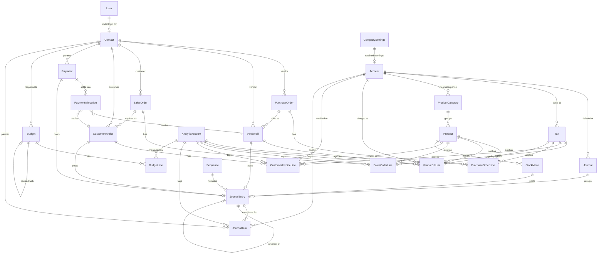

Notice the direction of every arrow at the bottom. `VendorBill → JournalEntry`. `CustomerInvoice → JournalEntry`. `Payment → JournalEntry`. `StockMove → JournalEntry`. **Four different document types, one destination.** There is no arrow going the other way from a report into a document. That single property is what makes this a real accounting system, and it is the subject of decision (b) below.

**Say this to a judge who is looking at the diagram:**
> "Documents are inputs. The ledger is the output. Reports only ever read the ledger. There is no code path anywhere in this app that computes a financial figure by summing invoice rows."

---

### 4.3 The three decisions that decide whether this project works

Everything else in this section is craft. These three are load-bearing. Two of them cannot be retrofitted after hour 12 — if you get them wrong, the fix is a rewrite of the payment module and the entire reporting layer.

#### (a) `PaymentAllocation` must be its own table. A `paid` boolean is a trap you cannot escape.

**The naive design that 70% of teams will ship:**

```prisma
model CustomerInvoice {
  amountTotal Decimal
  paid        Boolean  @default(false)   // ← the trap
}
```

Here is why it fails, in a scenario that takes a judge eight seconds to create.

Nimesh Pathak owes you ₹47,200 on `INV/2026/0001`. On 10-Sep he sends ₹20,000 by UPI. On 18-Sep he sends another ₹15,000. On 25-Sep he sends ₹12,200.

With `paid: Boolean`, what value do you write after the first ₹20,000? `true` is a lie — he owes ₹27,200. `false` is also a lie — ₹20,000 arrived and is sitting in your bank. There is no third value. The mockup's own status legend has three states, not two:

> **Paid** — if amount due = 0 · **Partial** — if amount due < Bill Total · **Not Paid** — if amount due = Bill Total

A boolean cannot produce three states. The organizers put "Partial" on the mockup deliberately.

It gets worse. Real payments are **many-to-many**. One ₹50,000 NEFT from a customer often settles three invoices at once (₹18,000 + ₹22,000 + ₹10,000). And one invoice often gets settled by four small payments. A boolean on the invoice, or even an `invoiceId` column on the payment, cannot represent either shape.

**The correct design — one row per (payment, document, amount) triple:**

```prisma
model PaymentAllocation {
  paymentId         String
  customerInvoiceId String?
  vendorBillId      String?
  amount            Decimal @db.Decimal(14, 2)
}
```

Now `residual` is not a stored fact, it is arithmetic:

```
residual(invoice) = invoice.amountTotal − SUM(allocation.amount WHERE allocation.customerInvoiceId = invoice.id
                                              AND allocation.payment.state = 'CONFIRMED')
```

And the three badges fall out of that one number with no extra state:

| residual | badge |
|---|---|
| `= 0` | **Paid** |
| `> 0 AND < amountTotal` | **Partial** |
| `= amountTotal` | **Not Paid** |

The mockup's footer fields also become free. "Paid Via Cash" and "Paid Via Bank" are the same sum, grouped by `payment.method`:

```sql
SELECT p.method, SUM(a.amount)
FROM payment_allocation a JOIN payment p ON p.id = a.payment_id
WHERE a.customer_invoice_id = $1 AND p.state = 'CONFIRMED'
GROUP BY p.method;
```

**Why you cannot retrofit this at hour 14.** By then you have: a payment form that writes `invoice.paid = true`, a status badge component reading that boolean, a receivables report filtering `WHERE paid = false`, a dashboard counter, seed data with the boolean baked in, and a journal-posting routine that clears the whole invoice. Introducing allocations means rewriting all seven of those *plus* re-deriving every existing row *plus* re-posting your seed ledger. That is a 4-hour surgery in a 19-hour build, done tired, on the thing most likely to break the demo. Build the join table in the first hour. It costs you twenty extra minutes now.

**Bonus you get for free:** overpayment. If a customer sends ₹50,000 against a ₹47,200 invoice, `SUM(allocations) = 47,200` and `payment.amount − allocated = 2,800` sits as an unallocated credit you can offer on the next invoice. In the boolean design this money simply vanishes.

**Say this to a judge:**
> "Payment and invoice are many-to-many, so the link carries its own amount. Residual is always derived from allocations — there is no `paid` column anywhere in the schema. That is also why partial payments and overpayment credits work without special-casing."

---

#### (b) `JournalItem` is the single source of truth. Reports never touch a document table.

This is the fake that the strategic analysis says 70–80% of accounting submissions will ship, and it is invisible in a scripted demo:

```sql
-- THE FAKE. Never write this query.
SELECT SUM(amount_total) FROM customer_invoice WHERE ...  -- "Income"
SELECT SUM(amount_total) FROM vendor_bill      WHERE ...  -- "Expense"
```

In that design the `journal_entry` table exists, gets written to, and is **read by nothing**. It is a decorative log. The system looks perfect until the judge does one of these:

1. **Posts a manual journal entry.** `Dr Cash ₹5,00,000 / Cr Capital ₹5,00,000` — the owner putting money in. This is not an invoice, so the fake Balance Sheet does not move by one rupee. The mockup *explicitly* includes a manual Journal Entry form with a **Post** button, which means the organizers expect this to work.
2. **Adds up the Balance Sheet.** Assets vs Liabilities + Capital. A document-summed balance sheet almost never ties.
3. **Pays half an invoice** and checks whether Debtors dropped by exactly half.

**The correct design.** Exactly one table is allowed to be the source of a financial number:

```
journal_item (state='POSTED')
```

Everything else is an aggregation over it, distinguished only by the `WHERE` clause and the account types included:

| Report | Aggregation semantics |
|---|---|
| **Balance Sheet** as of date T | `SUM(debit − credit)` over **all time up to T** (`date <= T`), for account types `ASSET, BANK, CASH, LIABILITY, CAPITAL` |
| **P&L** for period [A, B] | `SUM(credit − debit)` **between two dates**, for account types `INCOME, EXPENSE, OTHER_EXPENSE` |
| **Trial Balance** | `SUM(debit)`, `SUM(credit)` over everything — difference must be `0.00` |
| **General / Partner Ledger** | Same table, filtered by `account_id` or `partner_id`, ordered by date, with a running balance |
| **Budget actuals** | Same table, filtered by `analytic_account_id` and the budget period |
| **Stock valuation** | Same table, `account.subtype = 'INVENTORY'` |

Six reports, one table. That is why the schema puts so much care into `JournalItem`: it is doing all the work.

**The consequence you must design for.** Because reports never join back to documents, `JournalItem` has to carry, on the row itself, every column a report ever filters by. That means deliberately copying four values from the parent entry onto every item:

```prisma
model JournalItem {
  date              DateTime        // copied from JournalEntry.date
  state             EntryState      // copied from JournalEntry.state
  journalId         String          // copied from JournalEntry.journalId
  partnerId         String?         // copied from JournalEntry.partnerId, overridable per line
}
```

This is deliberate denormalization, and here is the trade in plain numbers. Copying costs you **one extra `UPDATE` statement at posting time** (`UPDATE journal_item SET state='POSTED' WHERE entry_id = $1`), which happens maybe 50 times during your demo. It saves you **a join on every single report read**, which happens every time anyone drags the as-of-date slider — hundreds of times per minute. Optimise the read.

It also makes the killer index possible (see §4.9): a covering index on `(state, date, account_id) INCLUDE (debit, credit)` lets Postgres answer the entire Balance Sheet from the index alone without touching the table heap.

**The freebie this unlocks — the as-of-date slider.** Because the Balance Sheet is literally `f(T) = aggregate(journal_item WHERE date <= T)`, changing `T` re-derives the whole report. Drag a slider from September back to April and Debtors climbs, Bank drops, Capital holds steady. This is the most visually striking thing this problem statement offers, and it is *impossible* to build on document-summed reports — because there is nowhere for opening balances or manual entries to live. You get it almost for free, but only because the schema is right.

**Say this to a judge:**
> "Every rupee in every report comes out of one table — `journal_item` — filtered by `state = 'POSTED'`. The Balance Sheet is a cumulative sum with `date <= T`; the P&L is a windowed sum between two dates. Same table, two aggregation semantics. Post a manual journal entry right now and watch the Balance Sheet move."

---

#### (c) Posted entries are append-only. Cancelling writes a reversal, never a `DELETE`.

Every developer's instinct is a Delete button. In accounting, a delete button is a fraud tool. Once an entry is posted it is part of the audit trail; erasing it silently rewrites history, and the P&L you printed last week no longer reproduces.

The rule, enforced at the database level, not just in application code:

- A `JournalEntry` in state `POSTED` cannot have its items updated or deleted. A `BEFORE UPDATE OR DELETE` trigger named `journal_item_is_append_only` raises an exception (SQL below in §4.8).
- To cancel a posted invoice, the system inserts a **new** entry whose debits and credits are swapped, linked back via `reversalOfId`. Both rows stay in the ledger forever. The net effect on every report is zero, and the audit trail shows what happened and when.

Original entry for `INV/2026/0001`:

| Account | Debit | Credit |
|---|---:|---:|
| Debtors A/c | 47,200.00 | |
| Sales Income A/c | | 40,000.00 |
| Output GST A/c | | 7,200.00 |

Reversal entry, `name = "RINV/2026/0001"`, `reversalOfId = <original>`:

| Account | Debit | Credit |
|---|---:|---:|
| Debtors A/c | | 47,200.00 |
| Sales Income A/c | 40,000.00 | |
| Output GST A/c | 7,200.00 | |

Sum of both entries across every account: zero. Reports self-correct. Nothing was erased.

**The one place the mockup pushes back — and how to honour it honestly.** The mockup's Journal Entry screen has a **"Reset to Draft"** button. That is a real requirement and you must build it. It is not a contradiction of immutability; it is the same thing Odoo ships. Implement it as an explicit, guarded, logged state transition rather than a silent edit:

`resetToDraft(entryId)` is refused if **any** of these hold:
1. The entry's date is on or before `CompanySettings.lockDate` — "Period locked by Admin on 31-Mar-2026."
2. The source document has any `PaymentAllocation` rows — you cannot un-post an invoice someone has already paid against.
3. The caller is not `ADMIN`.

If it passes, the service writes an `AuditLog` row and flips `state` to `DRAFT`, which is what un-freezes the trigger. So the DB trigger blocks *silent* mutation absolutely; the only way to change a posted entry is a recorded, permission-gated, lock-date-checked transition. That is the honest answer and it is stronger than pretending the button does not exist.

**Ordering detail that will bite you if you miss it.** Because the trigger reads the *parent entry's* state, the posting service must update children before the parent:

```ts
await tx.journalItem.updateMany({ where: { entryId }, data: { state: 'POSTED' } });  // entry still DRAFT — allowed
await tx.journalEntry.update({ where: { id: entryId }, data: { state: 'POSTED', postedAt: new Date() } });
```

Reverse that order and your own trigger locks you out of your own posting routine. Write it down now.

**Say this to a judge:**
> "There is no Edit button on a posted entry and no Delete anywhere in the ledger. Cancelling generates a reversal — mirrored debits and credits — so both rows stay in the books. The database enforces it with a trigger, not just the API. Try `UPDATE journal_item SET debit = 99999` in psql and it will refuse."

---

### 4.4 Money, dates, and IDs — the three type decisions

Before any table, settle these three or you will fix them 40 times.

**Money is `Decimal(14,2)`. Never `Float`.**
`Float` is binary floating point. `0.1 + 0.2` is `0.30000000000000004`. In an accounting system that means a journal entry whose debits are `47200.00` and credits are `47199.999999999996`, which violates your own balance constraint at 3 a.m. for no visible reason. PostgreSQL `NUMERIC(14,2)` is exact decimal arithmetic. `14,2` gives you up to ₹9,99,99,99,99,999.99 — more than enough for a furniture business, and it fits comfortably in Postgres's numeric representation.

```prisma
amountTotal Decimal @db.Decimal(14, 2)
```

Prisma returns these as `Decimal.js` objects. Rule for the whole codebase: **do arithmetic in `Decimal`, call `.toNumber()` only at the last moment before rendering.** Quantities are `Decimal(12,3)` — three decimal places so 0.5 kg or 2.25 hours works. Tax rates are `Decimal(5,2)` — `18.00`.

**Dates are `DateTime` but semantically date-only.**
An accounting date has no time zone. `2026-09-02` in Mumbai and `2026-09-02` in the database must be the same day, or your P&L for September silently includes an invoice from 31-Aug. Store every accounting date at UTC midnight (`new Date('2026-09-02T00:00:00.000Z')`) and never use `new Date()` directly for a `date` field. Use `createdAt`/`postedAt` (true timestamps) for audit, and `date` (UTC-midnight) for accounting. These are different fields with different meanings and you will need both.

**IDs are `cuid()` strings.**
Not auto-increment integers. Two reasons that matter here. First, an auto-increment invoice ID leaks how many invoices exist and tempts you into using it as the document number — which is the mistake the analysis calls out ("teams use auto-increment IDs and lose the point"). The **document number** is a separate, human-meaningful, gapless, per-year sequence (`INV/2026/0001`) allocated from the `Sequence` table at post time. Second, cuids can be generated client-side, which makes optimistic UI and seed scripts simpler.

---

### 4.5 The masters

#### Why these tables exist

Master data is the stuff you type in once and then pick from a dropdown forever. The whole point of a master is that the *transaction* stores a foreign key, not a copy of the text. If you store the customer's name as a string on the invoice and the customer later corrects the spelling, you now have two spellings in your reports. Six masters, six dropdowns, zero duplication.

#### User, Contact, Product, ProductCategory

```prisma
// ─────────────────────────────────────────────────────────────
//  prisma/schema.prisma  —  block 1 of 6 : identity & partners
// ─────────────────────────────────────────────────────────────
datasource db {
  provider = "postgresql"
  url      = env("DATABASE_URL")
}

generator client {
  provider = "prisma-client-js"
}

/// Three roles. The mockup draws two radio buttons (User / Administrator)
/// but its own role annotation describes THREE: Admin, Accountant, User(portal).
/// We ship all three; the Create-User form gets a third radio.
enum UserRole {
  ADMIN        // everything
  ACCOUNTANT   // masters, transactions, reports — no user management, no lock date
  PORTAL       // sees ONLY its own invoices/bills, and can pay them
}

model User {
  id           String    @id @default(cuid())
  name         String
  /// Mockup rule, stated twice (Create User + Sign Up):
  /// unique AND between 6 and 12 characters. Enforced by CHECK in §4.8.
  loginId      String    @unique @db.VarChar(12)
  email        String    @unique
  /// bcrypt, cost 10. Password policy (>8 chars, 1 lower, 1 upper, 1 special)
  /// is validated in zod before hashing — see the Auth section.
  passwordHash String
  role         UserRole  @default(PORTAL)

  /// THE row-level-security link. A PORTAL user is tied to exactly one Contact,
  /// and every portal query is scoped `WHERE customerId = user.contactId`.
  /// Self-signup always creates role=PORTAL — a signup can never mint an admin.
  contactId    String?
  contact      Contact?  @relation(fields: [contactId], references: [id], onDelete: SetNull)

  active       Boolean   @default(true)
  lastLoginAt  DateTime?
  createdAt    DateTime  @default(now())
  updatedAt    DateTime  @updatedAt

  postedEntries JournalEntry[]     @relation("PostedBy")
  allocations   PaymentAllocation[]

  @@index([role, active])
  @@map("user")
}

enum ContactType {
  CUSTOMER
  VENDOR
  BOTH
}

model Contact {
  id       String      @id @default(cuid())
  name     String
  type     ContactType @default(CUSTOMER)
  /// Mockup placeholder literally reads "Unique Email".
  email    String?     @unique
  mobile   String?     @db.VarChar(15)

  street1  String?
  street2  String?
  city     String?
  state    String?
  country  String?     @default("India")
  pincode  String?     @db.VarChar(6)

  /// Uploaded to Vercel Blob / UploadThing; we store the URL, never the bytes.
  /// Must render in the list thumbnail column AND the kanban card (mockup).
  imageUrl String?

  /// ── ADDITION (beyond the spec, and it earns its place) ──
  /// Per-partner override of the receivable/payable account. The posting engine
  /// resolves: contact override → journal default → company default.
  /// This is what makes the engine CONFIG-DRIVEN rather than hardcoded, which is
  /// the exact thing an Odoo judge probes for. Costs 2 columns, buys the demo.
  receivableAccountId String?
  receivableAccount   Account? @relation("ContactReceivable", fields: [receivableAccountId], references: [id])
  payableAccountId    String?
  payableAccount      Account? @relation("ContactPayable",    fields: [payableAccountId],    references: [id])

  /// "Cancel" on a master means ARCHIVE, not DELETE (mockup, Budget stage table).
  /// Every master carries this flag and every list view filters `active = true`
  /// unless the Archived toggle is on.
  active    Boolean  @default(true)
  createdAt DateTime @default(now())
  updatedAt DateTime @updatedAt

  users            User[]
  purchaseOrders   PurchaseOrder[]
  vendorBills      VendorBill[]
  salesOrders      SalesOrder[]
  customerInvoices CustomerInvoice[]
  payments         Payment[]
  journalItems     JournalItem[]
  journalEntries   JournalEntry[]
  budgets          Budget[]         @relation("BudgetResponsible")

  @@index([type, active])
  @@index([name])
  @@map("contact")
}

enum ProductType {
  GOODS
  SERVICE
  COMBO
}

model ProductCategory {
  id   String @id @default(cuid())
  name String @unique

  /// ── ADDITION ── Category-level account mapping.
  /// The posting engine asks the product's category which Income account to
  /// credit and which Expense account to debit. Change "Furniture" category's
  /// income account and the NEXT invoice posts differently — live, on stage.
  incomeAccountId  String?
  incomeAccount    Account? @relation("CategoryIncome",  fields: [incomeAccountId],  references: [id])
  expenseAccountId String?
  expenseAccount   Account? @relation("CategoryExpense", fields: [expenseAccountId], references: [id])

  active   Boolean   @default(true)
  products Product[]

  @@map("product_category")
}

model Product {
  id         String      @id @default(cuid())
  name       String
  type       ProductType @default(GOODS)
  /// Mockup: "Rs. 100.00" / "Rs. 50.00" — two decimals, rupees.
  salesPrice Decimal     @default(0) @db.Decimal(14, 2)
  cost       Decimal     @default(0) @db.Decimal(14, 2)

  /// Mockup: "Category Can be created and saved on the fly (Many2one Field)".
  /// The combobox must support quick-create — see the UI Scaffold section.
  categoryId String?
  category   ProductCategory? @relation(fields: [categoryId], references: [id])

  imageUrl   String?

  /// ── ADDITION ── per-product account + default tax override.
  /// Same three-step resolution chain as Contact. Optional in the UI.
  incomeAccountId  String?
  incomeAccount    Account? @relation("ProductIncome",  fields: [incomeAccountId],  references: [id])
  expenseAccountId String?
  expenseAccount   Account? @relation("ProductExpense", fields: [expenseAccountId], references: [id])
  salesTaxId       String?
  salesTax         Tax?     @relation("ProductSalesTax",    fields: [salesTaxId],    references: [id])
  purchaseTaxId    String?
  purchaseTax      Tax?     @relation("ProductPurchaseTax", fields: [purchaseTaxId], references: [id])

  /// ── ADDITION (covers the PDF Overview's "and STOCK reports" clause) ──
  /// Only GOODS are tracked. Quantity on hand is NEVER stored here; it is
  /// SUM(stock_move.signed_qty). See §4.7.
  trackInventory Boolean @default(true)
  /// Moving-average cost, recomputed on each receipt. This one IS a cache and
  /// it is honest about it — the movement ledger remains the source of truth.
  avgCost        Decimal @default(0) @db.Decimal(14, 4)

  active    Boolean  @default(true)
  createdAt DateTime @default(now())
  updatedAt DateTime @updatedAt

  purchaseOrderLines   PurchaseOrderLine[]
  vendorBillLines      VendorBillLine[]
  salesOrderLines      SalesOrderLine[]
  customerInvoiceLines CustomerInvoiceLine[]
  stockMoves           StockMove[]
  journalItems         JournalItem[]

  @@index([categoryId, active])
  @@index([name])
  @@map("product")
}
```

**A note on why `Product` has no `quantityOnHand` column.** Because a mutable counter is a lie waiting to happen. If two orders ship at the same moment, or a cancellation forgets to decrement, the counter drifts and there is no way to find out when. `SUM(stock_move)` cannot drift — it is the same append-only discipline as the ledger, applied to units instead of rupees. Same argument as decision (c), same reason.

---

### 4.6 The ledger spine — Account, Journal, JournalEntry, JournalItem, Tax, Sequence

This is the heart. Read this subsection twice.

#### The account type taxonomy, and why both reports depend on it

The mockup's Chart of Accounts "New Account" form specifies a **grouped dropdown** with non-selectable headings:

```
Balancesheet          (heading — not selectable)
    Asset
    Liability
    Bank
    Capital
    Cash
Profit and Loss       (heading — not selectable)
    Income
    Expenses
    Other Expenses
```

And the mockup's blue annotation next to it says exactly why this field exists:

> "Each account is assigned an Account Type, which would further be used for **how the account is to be treated and where it appears in reports**."

That sentence is the whole design. The account type is a **routing key**. Reports are generated by grouping on `account.type` — never by matching account *names*. If a judge renames "Sales Income A/c" to "Revenue A/c", the P&L must not care.

Now cross-reference the two report annotations from the mockup.

**Balance Sheet mapping (verbatim from the drawing):**
> Bank → Account type **Asset - Bank** · Cash → Account type **Asset - cash** · Debtors → Account type **Asset - Debtors** · Creditors → Account type **Liability - creditor** · Capital → **Account Type Capital**

**P&L mapping (verbatim):**
> Income from Sales → total of account type **Income** · Purchase Expense → total of account type **Expense** · Other Expense → total of account type **Other Expense** · Net Income → Income − Expenses

Compare the two lists. The Balance Sheet note asks for `Asset-Debtors` and `Liability-Creditor` — but "Debtors" and "Creditor" are **not** in the dropdown. This is the one genuine ambiguity in the mockup, and here is the clean resolution:

**Two fields: `type` (the eight leaf values from the dropdown, verbatim) plus `subtype` (a role tag that pins the special accounts).**

```
type     = ASSET | LIABILITY | BANK | CAPITAL | CASH | INCOME | EXPENSE | OTHER_EXPENSE
subtype  = NONE | RECEIVABLE | PAYABLE | TAX_COLLECTED | TAX_PAID
           | INVENTORY | COGS | RETAINED_EARNINGS | CURRENT_YEAR_EARNINGS | ROUNDING
```

Every report row in the mockup now maps to a precise, machine-checkable filter:

| Report row (from the mockup) | Filter |
|---|---|
| Balance Sheet → **Bank** | `type = 'BANK'` |
| Balance Sheet → **Cash** | `type = 'CASH'` |
| Balance Sheet → **Debtors** | `type = 'ASSET' AND subtype = 'RECEIVABLE'` |
| Balance Sheet → **Creditors** | `type = 'LIABILITY' AND subtype = 'PAYABLE'` |
| Balance Sheet → **Capital** | `type = 'CAPITAL'` |
| P&L → **Income from Sales** | `type = 'INCOME'` |
| P&L → **Purchase Expense** | `type = 'EXPENSE'` |
| P&L → **Other Expense** | `type = 'OTHER_EXPENSE'` |

Two more properties are *derived* from `type` and belong in one shared TypeScript table, not scattered through the code:

```ts
// lib/accounting/account-type.ts — the single place this knowledge lives
export const ACCOUNT_TYPE_META = {
  ASSET:         { section: 'BALANCE_SHEET', side: 'ASSET',     normal: 'DEBIT'  },
  BANK:          { section: 'BALANCE_SHEET', side: 'ASSET',     normal: 'DEBIT'  },
  CASH:          { section: 'BALANCE_SHEET', side: 'ASSET',     normal: 'DEBIT'  },
  LIABILITY:     { section: 'BALANCE_SHEET', side: 'LIABILITY', normal: 'CREDIT' },
  CAPITAL:       { section: 'BALANCE_SHEET', side: 'LIABILITY', normal: 'CREDIT' },
  INCOME:        { section: 'PROFIT_LOSS',   side: 'INCOME',    normal: 'CREDIT' },
  EXPENSE:       { section: 'PROFIT_LOSS',   side: 'EXPENSE',   normal: 'DEBIT'  },
  OTHER_EXPENSE: { section: 'PROFIT_LOSS',   side: 'EXPENSE',   normal: 'DEBIT'  },
} as const;
```

**What "normal balance" means, in one sentence:** some buckets grow when you debit them (Bank, Cash, Debtors, Expenses) and some grow when you credit them (Creditors, Capital, Income). `normal` tells the report which direction to display as a positive number, so a ₹40,000 sale shows as **+₹40,000 income**, not −₹40,000.

**Why both reports depend on this one field.** `section` splits the eight types into two disjoint groups. Balance Sheet takes the five `BALANCE_SHEET` types cumulatively from the beginning of time to date T. P&L takes the three `PROFIT_LOSS` types between two dates. There is no third rule and no account can appear in both reports. That is the entire report engine's routing logic, and it is nine lines of data.

**And the one thing that makes the Balance Sheet actually balance.** Assets = Liabilities + Capital only holds if this year's profit is added to the Capital side. That figure is called **Current Year Earnings**: `SUM(credit − debit)` over all `PROFIT_LOSS` accounts for the current fiscal year. It is a *virtual* row — it exists in `CompanySettings.currentYearEarningsAccountId` as a placeholder account so the report can label it, but no journal item is ever posted to it during the year. The detailed derivation belongs to the **Reporting Engine** section; the schema's only job is to make sure the account type taxonomy can express it, which it does.

#### The mandated seed data, with one correction

The mockup says in orange next to the Chart of Accounts list: **"All this accounts are to be pre configured."** Here is the seed, with the 8 mandated rows plus 7 additions that the posting engine needs.

| Code | Account Name | type | subtype | Source |
|---|---|---|---|---|
| 1100 | Bank A/c | `BANK` | `NONE` | mandated |
| 1200 | Cash A/c | `CASH` | `NONE` | mandated |
| 1300 | Debtors A/c | `ASSET` | `RECEIVABLE` | mandated |
| 1400 | Input GST A/c | `ASSET` | `TAX_PAID` | ADDITION — tax must land somewhere |
| 1500 | Inventory A/c | `ASSET` | `INVENTORY` | ADDITION — stock reports |
| 2100 | Creditors A/c | `LIABILITY` | `PAYABLE` | mandated |
| 2200 | Output GST A/c | `LIABILITY` | `TAX_COLLECTED` | ADDITION — tax must land somewhere |
| 3100 | Capital A/c | `CAPITAL` | `NONE` | mandated |
| 3200 | Retained Earnings A/c | `CAPITAL` | `RETAINED_EARNINGS` | ADDITION — prior-year profit |
| 3300 | Current Year Earnings | `CAPITAL` | `CURRENT_YEAR_EARNINGS` | ADDITION — virtual, makes BS tie |
| 4100 | Sales Income A/c | `INCOME` | `NONE` | mandated |
| 5100 | Purchase Expense A/c | `EXPENSE` | `NONE` | mandated |
| 5200 | Cost of Goods Sold A/c | `EXPENSE` | `COGS` | ADDITION — stock reports |
| 6100 | Other Expense A/c | `OTHER_EXPENSE` | `NONE` | mandated (**see note**) |
| 6900 | Rounding Difference A/c | `OTHER_EXPENSE` | `ROUNDING` | ADDITION — tax rounding |

> **The one-word correction, and say it out loud to a judge.** The mockup's Chart of Accounts *list* shows "Other Expense A/c — Expense". But the mockup's own P&L computation note says "Other Expense — Total of **account type Other Expense**", and the account-type dropdown has a distinct "Other Expenses" leaf. Typing that account as `EXPENSE` would make the P&L's "Other Expense" row permanently ₹0.00 and double-count it into Purchase Expense. We seed it as `OTHER_EXPENSE`. This is not us deviating from the spec — it is us resolving a contradiction *inside* the spec in the only direction that makes the specified P&L formula produce correct numbers.
>
> **Say this:** "The list view and the report formula disagree on one account's type. We followed the report formula, because the P&L explicitly names 'account type Other Expense' as a separate line. If we'd followed the list view, that row would always print zero."

The four mandated journals, likewise pre-seeded (mockup, Journals list view):

| Journal Name | type | Default Account | Prefix |
|---|---|---|---|
| Sales | `SALES` | Sales Income A/c (4100) | `INV` |
| Purchase | `PURCHASE` | Purchase Expense A/c (5100) | `BILL` |
| Bank | `BANK` | Bank A/c (1100) | `BNK` |
| Cash | `CASH` | Cash A/c (1200) | `CSH` |

#### The ledger schema

```prisma
// ─────────────────────────────────────────────────────────────
//  block 2 of 6 : the ledger spine — this is the whole project
// ─────────────────────────────────────────────────────────────

/// Eight values, verbatim from the mockup's grouped dropdown.
/// The two headings (Balancesheet / Profit and Loss) are display-only in the
/// combobox and are derived here from ACCOUNT_TYPE_META.section.
enum AccountType {
  ASSET
  LIABILITY
  BANK
  CAPITAL
  CASH
  INCOME
  EXPENSE
  OTHER_EXPENSE
}

/// Role tag. Lets the posting engine ask for "the receivable account"
/// instead of searching for an account literally named "Debtors A/c".
enum AccountSubtype {
  NONE
  RECEIVABLE
  PAYABLE
  TAX_COLLECTED
  TAX_PAID
  INVENTORY
  COGS
  RETAINED_EARNINGS
  CURRENT_YEAR_EARNINGS
  ROUNDING
}

model Account {
  id      String         @id @default(cuid())
  /// Numeric code, e.g. "1300". Sorting the CoA by code produces the
  /// conventional Asset → Liability → Capital → Income → Expense order for free.
  code    String         @unique @db.VarChar(10)
  name    String
  type    AccountType
  subtype AccountSubtype @default(NONE)

  /// Only reconcilable accounts (Debtors, Creditors) can carry an open balance
  /// that a payment settles. Bank/Cash/Income are not reconcilable.
  reconcilable Boolean @default(false)

  /// Mockup: the Chart of Accounts list has an extra "Archived" button.
  active    Boolean  @default(true)
  createdAt DateTime @default(now())
  updatedAt DateTime @updatedAt

  journalItems           JournalItem[]
  journalsDefault        Journal[]         @relation("JournalDefault")
  journalsDebit          Journal[]         @relation("JournalDebit")
  journalsCredit         Journal[]         @relation("JournalCredit")
  taxesCollected         Tax[]             @relation("TaxCollected")
  taxesPaid              Tax[]             @relation("TaxPaid")
  contactsReceivable     Contact[]         @relation("ContactReceivable")
  contactsPayable        Contact[]         @relation("ContactPayable")
  categoriesIncome       ProductCategory[] @relation("CategoryIncome")
  categoriesExpense      ProductCategory[] @relation("CategoryExpense")
  productsIncome         Product[]         @relation("ProductIncome")
  productsExpense        Product[]         @relation("ProductExpense")
  vendorBillLines        VendorBillLine[]
  customerInvoiceLines   CustomerInvoiceLine[]

  /// Unique subtype where it must be unique: exactly one CURRENT_YEAR_EARNINGS,
  /// one RETAINED_EARNINGS, one ROUNDING. Enforced by a partial unique index (§4.8).
  @@index([type, active])
  @@index([subtype])
  @@map("account")
}

enum JournalType {
  SALES
  PURCHASE
  BANK
  CASH
}

model Journal {
  id   String      @id @default(cuid())
  code String      @unique @db.VarChar(8)   // "SAL", "PUR", "BNK", "CSH"
  name String
  type JournalType

  /// Mockup's single "Default Account" column.
  defaultAccountId String?
  defaultAccount   Account? @relation("JournalDefault", fields: [defaultAccountId], references: [id])

  /// ── ADDITION, and it is the difference between a real engine and if/else ──
  /// The counterpart accounts the posting engine reaches for.
  /// Sales journal: defaultDebit = Debtors (what the customer owes us).
  /// Purchase journal: defaultCredit = Creditors (what we owe the vendor).
  /// A judge who edits the Sales journal's default debit account and posts a new
  /// invoice will see the entry change. That is the proof of a table-driven engine.
  defaultDebitAccountId  String?
  defaultDebitAccount    Account? @relation("JournalDebit",  fields: [defaultDebitAccountId],  references: [id])
  defaultCreditAccountId String?
  defaultCreditAccount   Account? @relation("JournalCredit", fields: [defaultCreditAccountId], references: [id])

  /// Sequence prefix for entries in this journal: "INV", "BILL", "PAY".
  sequencePrefix String   @db.VarChar(8)
  active         Boolean  @default(true)

  entries      JournalEntry[]
  journalItems JournalItem[]
  payments     Payment[]

  @@map("journal")
}

enum EntryState {
  DRAFT
  POSTED
  CANCELLED
}

/// What kind of paperwork produced this entry. Kept as a plain enum + id rather
/// than four nullable FKs because the entry NEVER needs to join back — this pair
/// exists only for the "open source document" navigation link in the UI.
enum EntrySource {
  MANUAL
  VENDOR_BILL
  CUSTOMER_INVOICE
  PAYMENT
  STOCK_MOVE
  REVERSAL
  OPENING_BALANCE
}

model JournalEntry {
  id        String @id @default(cuid())
  /// "INV/2026/0001". Allocated from the Sequence table at POST time, not at
  /// draft creation — that is what makes the numbering gapless.
  name      String
  journalId String
  journal   Journal @relation(fields: [journalId], references: [id])

  /// The ACCOUNTING date. Mockup: "(Bill date fetch from bill)" — it is copied
  /// from the source document, never `new Date()`. Stored at UTC midnight.
  date      DateTime  @db.Date
  /// Free text, e.g. the bill reference "ABC-26-001".
  ref       String?
  partnerId String?
  partner   Contact?  @relation(fields: [partnerId], references: [id])

  state       EntryState  @default(DRAFT)
  sourceType  EntrySource @default(MANUAL)
  /// The id of the VendorBill / CustomerInvoice / Payment / StockMove row.
  sourceId    String?

  /// Reversal linkage. Self-relation: a cancelling entry points at what it undid.
  reversalOfId String?       @unique
  reversalOf   JournalEntry? @relation("Reversal", fields: [reversalOfId], references: [id])
  reversedBy   JournalEntry? @relation("Reversal")

  /// Denormalised totals, kept in sync by the deferred trigger in §4.8.
  /// They exist so the Journal Entries LIST view can show a Total column without
  /// aggregating children per row (the mockup's list has a Total column).
  totalDebit  Decimal @default(0) @db.Decimal(14, 2)
  totalCredit Decimal @default(0) @db.Decimal(14, 2)

  /// ── ADDITION: tamper-evident hash chain ──
  /// hash = sha256(prevHash || canonicalJson(header + all items)).
  /// Set once at POST time, never again. A "Verify Ledger" page walks the chain.
  /// ~90 minutes of work; it is the single strongest trust signal in the demo.
  chainIndex Int?     @unique
  prevHash   String?  @db.VarChar(64)
  hash       String?  @db.VarChar(64)

  postedAt   DateTime?
  postedById String?
  postedBy   User?     @relation("PostedBy", fields: [postedById], references: [id])
  createdAt  DateTime  @default(now())

  items JournalItem[]

  /// Document numbers are unique WITHIN a journal — INV/2026/0001 in Sales and
  /// BILL/2026/0001 in Purchase can coexist, but never two of the same.
  @@unique([journalId, name])
  @@index([state, date])
  @@index([sourceType, sourceId])
  @@map("journal_entry")
}

model JournalItem {
  id      String @id @default(cuid())
  entryId String
  entry   JournalEntry @relation(fields: [entryId], references: [id], onDelete: Cascade)
  lineNo  Int

  accountId String
  account   Account @relation(fields: [accountId], references: [id])

  label String?

  /// EXACTLY ONE of these is non-zero. Enforced by CHECK in §4.8.
  /// Never negative. A "negative debit" is a credit and must be written as one.
  debit  Decimal @default(0) @db.Decimal(14, 2)
  credit Decimal @default(0) @db.Decimal(14, 2)

  /// ── The four denormalised columns that make this table self-sufficient ──
  /// Copied from the parent entry at insert/post time. Reports NEVER join.
  date      DateTime   @db.Date
  state     EntryState @default(DRAFT)
  journalId String
  journal   Journal    @relation(fields: [journalId], references: [id])

  partnerId String?
  partner   Contact? @relation(fields: [partnerId], references: [id])

  /// The "Budget Analytics" column from every document line, carried all the way
  /// down into the ledger. THIS is the join most teams forget to plumb, and
  /// without it budget actuals have to be faked off invoice tables.
  analyticAccountId String?
  analyticAccount   AnalyticAccount? @relation(fields: [analyticAccountId], references: [id])

  productId String?
  product   Product? @relation(fields: [productId], references: [id])
  taxId     String?
  tax       Tax?     @relation(fields: [taxId], references: [id])

  createdAt DateTime @default(now())

  /// See §4.9 for why each of these exists and which report uses it.
  @@index([state, date, accountId])
  @@index([accountId, date])
  @@index([partnerId, date])
  @@index([analyticAccountId, date])
  @@index([entryId, lineNo])
  @@map("journal_item")
}

enum TaxScope {
  SALE
  PURCHASE
  BOTH
}

enum TaxComputation {
  EXCLUSIVE   // ₹40,000 + 18% = ₹47,200 charged
  INCLUSIVE   // ₹47,200 charged, of which ₹7,200 is tax
}

/// The PDF's Sales Order row explicitly lists "Tax" as a field. A hardcoded 18%
/// in the total calculation is one of the five named fakes. This is 5 columns.
model Tax {
  id          String         @id @default(cuid())
  name        String         @unique      // "GST 18%"
  rate        Decimal        @db.Decimal(5, 2)   // 18.00
  scope       TaxScope       @default(BOTH)
  computation TaxComputation @default(EXCLUSIVE)

  /// Output tax on a sale → a LIABILITY (you collected it for the government).
  collectedAccountId String?
  collectedAccount   Account? @relation("TaxCollected", fields: [collectedAccountId], references: [id])
  /// Input tax on a purchase → an ASSET (the government owes it back to you).
  paidAccountId      String?
  paidAccount        Account? @relation("TaxPaid",      fields: [paidAccountId],      references: [id])

  active Boolean @default(true)

  purchaseOrderLines   PurchaseOrderLine[]
  vendorBillLines      VendorBillLine[]
  salesOrderLines      SalesOrderLine[]
  customerInvoiceLines CustomerInvoiceLine[]
  journalItems         JournalItem[]
  productsSales        Product[] @relation("ProductSalesTax")
  productsPurchase     Product[] @relation("ProductPurchaseTax")

  @@map("tax")
}

/// Gapless, per-year, concurrency-safe document numbering.
/// The mockup demands "(auto generate Invoice Number +1 of Last Bill)" and shows
/// INV/2026/0001, Bill/2026/0001, PO0001. Auto-increment IDs do not satisfy this:
/// they are global, they leak, and they gap on every rolled-back transaction.
model Sequence {
  id         String @id @default(cuid())
  code       String @db.VarChar(32)   // "customer_invoice", "vendor_bill", "purchase_order", "sales_order", "payment"
  prefix     String @db.VarChar(16)   // "INV/", "BILL/", "PO", "SO", "PAY/"
  fiscalYear Int                      // 2026
  padding    Int    @default(4)       // 0001
  nextNumber Int    @default(1)

  @@unique([code, fiscalYear])
  @@map("sequence")
}
```

#### The worked example, so the abstraction becomes concrete

Nimesh Pathak buys 5 Office Chairs at ₹8,000 each with GST 18%.

- Line subtotal: `5 × 8,000 = ₹40,000`
- Tax: `40,000 × 18% = ₹7,200`
- Invoice total: **₹47,200**

Posting the invoice writes **one** `JournalEntry` and **three** `JournalItem` rows:

| lineNo | account | subtype | debit | credit | date | partner | analytic |
|---|---|---|---:|---:|---|---|---|
| 1 | 1300 Debtors A/c | RECEIVABLE | 47,200.00 | 0.00 | 2026-09-02 | Nimesh | — |
| 2 | 4100 Sales Income A/c | NONE | 0.00 | 40,000.00 | 2026-09-02 | Nimesh | Project 1 |
| 3 | 2200 Output GST A/c | TAX_COLLECTED | 0.00 | 7,200.00 | 2026-09-02 | Nimesh | — |

`totalDebit = 47,200.00`, `totalCredit = 47,200.00`. Balanced. The deferred trigger lets it commit.

Nimesh pays ₹20,000 by bank on 10-Sep. Posting the payment writes a second entry:

| lineNo | account | debit | credit |
|---|---|---:|---:|
| 1 | 1100 Bank A/c | 20,000.00 | 0.00 |
| 2 | 1300 Debtors A/c | 0.00 | 20,000.00 |

Plus one `PaymentAllocation` row: `(payment → INV/2026/0001, ₹20,000.00)`.

Now run the reports off `journal_item` alone:

- **Balance Sheet, Debtors** = `47,200 − 20,000 = ₹27,200` ✓ (matches the invoice residual, but derived independently — that agreement is itself a proof)
- **Balance Sheet, Bank** = `+₹20,000`
- **P&L, Income from Sales** = `₹40,000` (the tax is not income; it never touches an `INCOME` account)
- **Invoice badge** = residual ₹27,200, which is `> 0` and `< 47,200` → **Partial**
- **Budget actual for Project 1** = `₹40,000` on the Income side

Every one of those five numbers came out of the same table with a different `WHERE` clause. That is the whole architecture.

---

### 4.7 The documents

#### Why four document pairs and not one clever generic table

The obvious refactor is a single `Document` table with a `docType` enum and a single `DocumentLine`. Halve the tables, halve the code. **Reject it, for three specific reasons:**

1. **The fields genuinely differ.** A Purchase Order has no due date and no payment status. A Customer Invoice has `invoiceReference`, `dueDate`, `amountResidual`, and a link to its Sales Order. A unified table becomes 30 columns of which 12 are always null for any given row, and every query grows a `docType` filter you will forget exactly once, on the report that matters.
2. **Prisma cannot narrow a discriminated union.** `document.dueDate` would be `Date | null` everywhere, so every invoice screen gets a non-null assertion. You lose the main thing TypeScript is doing for you at hour 15 when you are tired.
3. **`PaymentAllocation` gets cleaner, not messier.** Two nullable FKs with a CHECK that exactly one is set is unambiguous and index-friendly. A polymorphic `(docType, docId)` pair cannot have a foreign key at all — you throw away referential integrity, which is precisely the thing you are trying to prove to the judge.

**The sharing happens in code, not in the schema.** All four documents implement the same TypeScript interface and go through the same three services:

```ts
// lib/documents/contract.ts
interface PostableDocument {
  id: string; name: string; date: Date;
  partnerId: string;
  lines: { accountId: string; analyticAccountId?: string;
           quantity: Decimal; unitPrice: Decimal; taxId?: string }[];
}
// One posting engine, one line-grid React component, one PDF renderer,
// one list/form scaffold — four tables. Share behaviour, not storage.
```

That is the right axis to deduplicate on, and it is worth saying to a judge if they ask why the schema is not "DRY".

#### Purchase Order → Vendor Bill

```prisma
// ─────────────────────────────────────────────────────────────
//  block 3 of 6 : purchase side
// ─────────────────────────────────────────────────────────────

enum OrderState {
  DRAFT
  CONFIRMED
  PARTIALLY_BILLED   // some quantity converted, PO stays open
  BILLED
  CANCELLED
}

model PurchaseOrder {
  id       String @id @default(cuid())
  /// "PO0001" — mockup: "(Create Sequence auto generate PO number +1 of Last order)"
  name     String @unique
  vendorId String
  vendor   Contact @relation(fields: [vendorId], references: [id])

  orderDate DateTime   @db.Date
  state     OrderState @default(DRAFT)

  /// Caches, recomputed from lines inside the same transaction that edits them.
  /// Present so the LIST view does not aggregate children on every row.
  untaxedAmount Decimal @default(0) @db.Decimal(14, 2)
  taxAmount     Decimal @default(0) @db.Decimal(14, 2)
  amountTotal   Decimal @default(0) @db.Decimal(14, 2)

  notes     String?
  createdAt DateTime @default(now())
  updatedAt DateTime @updatedAt

  lines PurchaseOrderLine[]
  bills VendorBill[]

  @@index([state, orderDate])
  @@index([vendorId])
  @@map("purchase_order")
}

model PurchaseOrderLine {
  id      String @id @default(cuid())
  orderId String
  order   PurchaseOrder @relation(fields: [orderId], references: [id], onDelete: Cascade)
  /// The mockup's "Sr. No." column.
  lineNo  Int

  productId String
  product   Product @relation(fields: [productId], references: [id])
  description String?

  /// The mockup's "Budget Analytics" column. Feeds the EXPENSE side of budgets.
  analyticAccountId String?
  analyticAccount   AnalyticAccount? @relation(fields: [analyticAccountId], references: [id])

  quantity  Decimal @db.Decimal(12, 3)
  unitPrice Decimal @db.Decimal(14, 2)
  taxId     String?
  tax       Tax?    @relation(fields: [taxId], references: [id])

  /// Mockup annotation: "Unit Price * Quantity" and "(3Qty * 2000)".
  /// This is a POSTGRES GENERATED COLUMN — the app physically cannot write a
  /// wrong total. Added by a hand-edited migration; see §4.8.
  lineSubtotal Decimal @default(0) @db.Decimal(14, 2)

  /// Enables PARTIAL PO→Bill conversion: bill 12 of 20 units, PO stays open
  /// showing 8 still billable. CHECK (qty_billed <= quantity) in §4.8.
  qtyBilled Decimal @default(0) @db.Decimal(12, 3)

  billLines VendorBillLine[]

  @@unique([orderId, lineNo])
  @@index([analyticAccountId])
  @@map("purchase_order_line")
}

enum DocState {
  DRAFT
  POSTED
  CANCELLED
}

/// Computed badge — NEVER written by hand. Derived from amountResidual.
enum PaymentState {
  NOT_PAID
  PARTIAL
  PAID
}

model VendorBill {
  id   String @id @default(cuid())
  /// "BILL/2026/0001" — mockup: "(auto generate Bill Number +1 of Last Bill)"
  name String @unique

  /// NULL when the bill was created fresh. This one nullable FK is what drives
  /// the mockup's conditional smart button: "Only show this if bill created
  /// from PO, hide if Bill Created Fresh without PO."
  purchaseOrderId String?
  purchaseOrder   PurchaseOrder? @relation(fields: [purchaseOrderId], references: [id])

  vendorId String
  vendor   Contact @relation(fields: [vendorId], references: [id])

  /// The vendor's own reference, typed by the user. Mockup: "ABC-26-001",
  /// "Alpha numeric (Text)". Distinct from `name`, which we generate.
  billReference String?
  billDate      DateTime @db.Date
  dueDate       DateTime @db.Date

  state DocState @default(DRAFT)

  untaxedAmount Decimal @default(0) @db.Decimal(14, 2)
  taxAmount     Decimal @default(0) @db.Decimal(14, 2)
  amountTotal   Decimal @default(0) @db.Decimal(14, 2)

  /// THE derived number. Recomputed inside every transaction that touches an
  /// allocation: amountTotal − SUM(confirmed allocations).
  /// CHECK (0 <= amountResidual <= amountTotal) in §4.8.
  amountResidual Decimal @default(0) @db.Decimal(14, 2)

  /// A POSTGRES GENERATED COLUMN derived from the two above. It is physically
  /// impossible to set it wrong, which is a nice thing to show a judge.
  /// Prisma does not manage generated columns, so it is added by hand-edited SQL
  /// and read through a raw query / Prisma view; the UI also computes the same
  /// three-way badge in TS from amountResidual for zero-latency rendering.
  paymentState PaymentState @default(NOT_PAID)

  journalEntryId String? @unique

  createdAt DateTime @default(now())
  updatedAt DateTime @updatedAt

  lines       VendorBillLine[]
  allocations PaymentAllocation[]

  @@index([state, billDate])
  @@index([vendorId, dueDate])
  @@map("vendor_bill")
}

model VendorBillLine {
  id     String @id @default(cuid())
  billId String
  bill   VendorBill @relation(fields: [billId], references: [id], onDelete: Cascade)
  lineNo Int

  productId String
  product   Product @relation(fields: [productId], references: [id])
  description String?

  /// Mockup: "Purchase account to be set by default". NOT NULL — resolved at
  /// line creation by: product.expenseAccount → category.expenseAccount →
  /// journal.defaultAccount. The user can override it in the grid.
  accountId String
  account   Account @relation(fields: [accountId], references: [id])

  analyticAccountId String?
  analyticAccount   AnalyticAccount? @relation(fields: [analyticAccountId], references: [id])

  quantity     Decimal @db.Decimal(12, 3)
  unitPrice    Decimal @db.Decimal(14, 2)
  taxId        String?
  tax          Tax?    @relation(fields: [taxId], references: [id])
  lineSubtotal Decimal @default(0) @db.Decimal(14, 2)   // GENERATED

  /// Traceability for partial billing.
  purchaseOrderLineId String?
  purchaseOrderLine   PurchaseOrderLine? @relation(fields: [purchaseOrderLineId], references: [id])

  @@unique([billId, lineNo])
  @@index([analyticAccountId])
  @@map("vendor_bill_line")
}
```

The **Sales Order / Customer Invoice** pair is the exact mirror image. Only the differences are shown:

```prisma
// ─────────────────────────────────────────────────────────────
//  block 4 of 6 : sales side (mirror of block 3)
// ─────────────────────────────────────────────────────────────

model SalesOrder {
  id          String     @id @default(cuid())
  name        String     @unique          // "SO0001"
  customerId  String
  customer    Contact    @relation(fields: [customerId], references: [id])
  orderDate   DateTime   @db.Date
  state       OrderState @default(DRAFT)
  untaxedAmount Decimal  @default(0) @db.Decimal(14, 2)
  taxAmount     Decimal  @default(0) @db.Decimal(14, 2)
  amountTotal   Decimal  @default(0) @db.Decimal(14, 2)
  createdAt   DateTime   @default(now())
  updatedAt   DateTime   @updatedAt
  lines       SalesOrderLine[]
  invoices    CustomerInvoice[]

  @@index([state, orderDate])
  @@map("sales_order")
}

model SalesOrderLine {
  id                String @id @default(cuid())
  orderId           String
  order             SalesOrder @relation(fields: [orderId], references: [id], onDelete: Cascade)
  lineNo            Int
  productId         String
  product           Product @relation(fields: [productId], references: [id])
  description       String?
  analyticAccountId String?
  analyticAccount   AnalyticAccount? @relation(fields: [analyticAccountId], references: [id])
  quantity          Decimal @db.Decimal(12, 3)
  unitPrice         Decimal @db.Decimal(14, 2)
  taxId             String?
  tax               Tax?    @relation(fields: [taxId], references: [id])
  lineSubtotal      Decimal @default(0) @db.Decimal(14, 2)   // GENERATED
  qtyInvoiced       Decimal @default(0) @db.Decimal(12, 3)
  invoiceLines      CustomerInvoiceLine[]

  @@unique([orderId, lineNo])
  @@index([analyticAccountId])
  @@map("sales_order_line")
}

model CustomerInvoice {
  id   String @id @default(cuid())
  /// "INV/2026/0001" — mockup: "(auto generate Invoice Number +1 of Last Bill)"
  name String @unique

  /// NULL when created fresh → hides the "SO" smart button (mockup rule).
  salesOrderId String?
  salesOrder   SalesOrder? @relation(fields: [salesOrderId], references: [id])

  customerId String
  customer   Contact @relation(fields: [customerId], references: [id])

  /// Mockup: "ABC-26-001", "Alpha numeric (Text)". User-typed, not generated.
  invoiceReference String?
  invoiceDate      DateTime @db.Date
  /// Mockup shows Invoice Date AND Due Date as separate fields.
  /// Due date drives the receivables aging report.
  dueDate          DateTime @db.Date

  state DocState @default(DRAFT)

  untaxedAmount  Decimal @default(0) @db.Decimal(14, 2)
  taxAmount      Decimal @default(0) @db.Decimal(14, 2)
  amountTotal    Decimal @default(0) @db.Decimal(14, 2)
  amountResidual Decimal @default(0) @db.Decimal(14, 2)
  paymentState   PaymentState @default(NOT_PAID)   // GENERATED column

  journalEntryId String? @unique

  createdAt DateTime @default(now())
  updatedAt DateTime @updatedAt

  lines       CustomerInvoiceLine[]
  allocations PaymentAllocation[]

  @@index([state, invoiceDate])
  /// The aging report: unpaid invoices bucketed by how overdue they are.
  @@index([customerId, dueDate])
  @@map("customer_invoice")
}

model CustomerInvoiceLine {
  id                String @id @default(cuid())
  invoiceId         String
  invoice           CustomerInvoice @relation(fields: [invoiceId], references: [id], onDelete: Cascade)
  lineNo            Int
  productId         String
  product           Product @relation(fields: [productId], references: [id])
  description       String?
  /// Mockup: "Sales account to be set by default".
  accountId         String
  account           Account @relation(fields: [accountId], references: [id])
  analyticAccountId String?
  analyticAccount   AnalyticAccount? @relation(fields: [analyticAccountId], references: [id])
  quantity          Decimal @db.Decimal(12, 3)
  unitPrice         Decimal @db.Decimal(14, 2)
  taxId             String?
  tax               Tax?    @relation(fields: [taxId], references: [id])
  lineSubtotal      Decimal @default(0) @db.Decimal(14, 2)   // GENERATED
  salesOrderLineId  String?
  salesOrderLine    SalesOrderLine? @relation(fields: [salesOrderLineId], references: [id])

  @@unique([invoiceId, lineNo])
  @@index([analyticAccountId])
  @@map("customer_invoice_line")
}
```

#### Payment and PaymentAllocation — the money-to-paperwork bridge

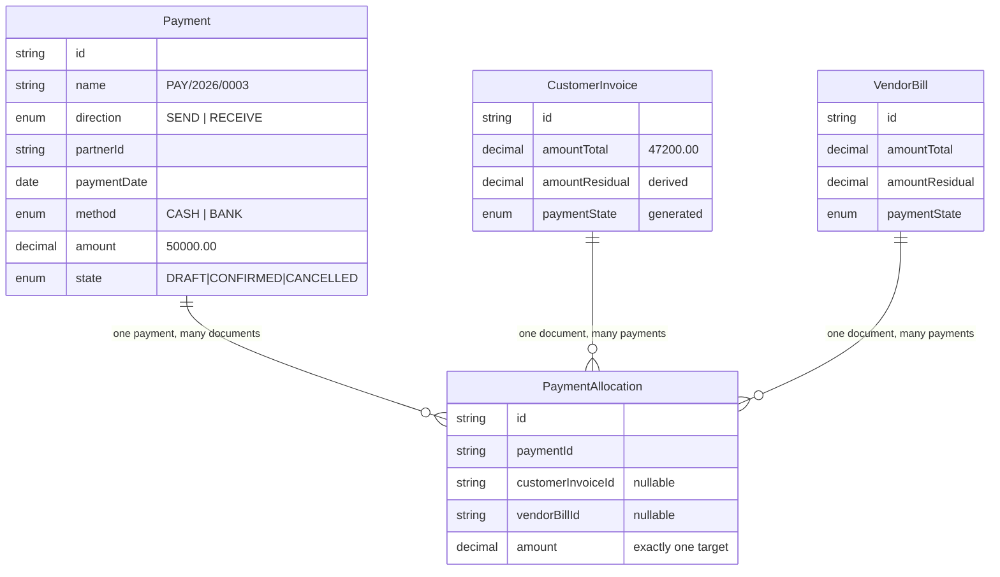

```prisma
// ─────────────────────────────────────────────────────────────
//  block 5 of 6 : payments — the table that makes partials possible
// ─────────────────────────────────────────────────────────────

/// Mockup: Payment Type radio "Send / Receive". One model serves both
/// customer receipts and vendor payments.
enum PaymentDirection {
  SEND      // we pay a vendor
  RECEIVE   // a customer pays us
}

/// Mockup: "Default set to Bank can be selected to Cash".
enum PaymentMethod {
  BANK
  CASH
}

/// Mockup statusbar has exactly three stages: Draft > Confirm > Cancelled.
/// (Note the Budget has FOUR. Different state machines, built separately.)
enum PaymentStatus {
  DRAFT
  CONFIRMED
  CANCELLED
}

model Payment {
  id        String           @id @default(cuid())
  name      String           @unique      // "PAY/2026/0003"
  direction PaymentDirection
  partnerId String
  partner   Contact          @relation(fields: [partnerId], references: [id])

  /// Mockup: "(Default Today's Date)"
  paymentDate DateTime      @db.Date
  method      PaymentMethod @default(BANK)
  /// Resolved from method: BANK → Bank journal, CASH → Cash journal.
  journalId   String
  journal     Journal       @relation(fields: [journalId], references: [id])

  /// Mockup: "Autofill Amount Due from Invoice/Bill" — a DEFAULT, not a lock.
  /// The user can pay less (partial) or more (overpayment → unallocated credit).
  amount Decimal @db.Decimal(14, 2)

  /// Cache of SUM(allocations.amount). `amount − allocatedAmount` is the
  /// customer's unused credit, offerable against the next invoice.
  /// CHECK (allocatedAmount <= amount) in §4.8 — you cannot over-allocate.
  allocatedAmount Decimal @default(0) @db.Decimal(14, 2)

  note  String?
  state PaymentStatus @default(DRAFT)

  journalEntryId String?  @unique
  createdAt      DateTime @default(now())
  updatedAt      DateTime @updatedAt

  allocations PaymentAllocation[]

  @@index([state, paymentDate])
  @@index([partnerId, state])
  @@map("payment")
}

/// ONE ROW = "this much of that payment settled that document".
/// This is the table decision (a) is about. It is 6 columns and it is the
/// difference between an accounting system and an invoice CRUD app.
model PaymentAllocation {
  id        String  @id @default(cuid())
  paymentId String
  payment   Payment @relation(fields: [paymentId], references: [id], onDelete: Cascade)

  /// Exactly ONE of these two is non-null. CHECK in §4.8.
  customerInvoiceId String?
  customerInvoice   CustomerInvoice? @relation(fields: [customerInvoiceId], references: [id], onDelete: Cascade)
  vendorBillId      String?
  vendorBill        VendorBill?      @relation(fields: [vendorBillId],      references: [id], onDelete: Cascade)

  /// Always > 0. Never larger than the document's residual at allocation time.
  amount Decimal @db.Decimal(14, 2)

  allocatedAt DateTime @default(now())
  createdById String?
  createdBy   User?    @relation(fields: [createdById], references: [id])

  /// A payment can settle a given document at most once — top up by editing
  /// the amount, not by inserting a second row. Keeps the arithmetic obvious.
  @@unique([paymentId, customerInvoiceId])
  @@unique([paymentId, vendorBillId])
  @@index([customerInvoiceId])
  @@index([vendorBillId])
  @@map("payment_allocation")
}
```

#### Analytic accounts, Budget, StockMove, CompanySettings

```prisma
// ─────────────────────────────────────────────────────────────
//  block 6 of 6 : analytics, budgets, stock, company
// ─────────────────────────────────────────────────────────────

/// Mockup: "Drop down selection / Income / Expense" — exactly two values.
enum AnalyticType {
  INCOME
  EXPENSE
}

model AnalyticAccount {
  id   String       @id @default(cuid())
  name String       @unique          // "Project 1", "Furniture"
  code String?      @db.VarChar(16)
  type AnalyticType

  active    Boolean  @default(true)
  createdAt DateTime @default(now())

  budgetLines          BudgetLine[]
  journalItems         JournalItem[]
  purchaseOrderLines   PurchaseOrderLine[]
  vendorBillLines      VendorBillLine[]
  salesOrderLines      SalesOrderLine[]
  customerInvoiceLines CustomerInvoiceLine[]

  @@index([type, active])
  @@map("analytic_account")
}

/// Mockup's Menu & Stage Mapping table: FOUR stages, not three.
enum BudgetState {
  DRAFT
  CONFIRMED
  REVISED
  CANCELLED
}

model Budget {
  id   String @id @default(cuid())
  /// Mockup rule: on revision, keep the original name and append " Revised"
  /// (e.g. "Project A Revised"). A string rule you would never infer from text.
  name String

  startDate DateTime @db.Date
  endDate   DateTime @db.Date

  /// Mockup: "Select from Contacts Created (open list of contacts on click)".
  responsibleId String?
  responsible   Contact? @relation("BudgetResponsible", fields: [responsibleId], references: [id])

  state BudgetState @default(DRAFT)

  /// Bi-directional revision link, both required by the mockup.
  /// Original shows "Revised With"; the revision shows "Revision Of" as a
  /// clickable hyperlink back to the original.
  revisionOfId String? @unique
  revisionOf   Budget? @relation("BudgetRevision", fields: [revisionOfId], references: [id])
  revisedBy    Budget? @relation("BudgetRevision")

  /// Mockup: "Cancelled — Here User can ARCHIVE the existing budget".
  /// Cancel means active=false, never DELETE.
  active    Boolean  @default(true)
  createdAt DateTime @default(now())
  updatedAt DateTime @updatedAt

  lines BudgetLine[]

  @@index([state, startDate, endDate])
  @@map("budget")
}

model BudgetLine {
  id       String @id @default(cuid())
  budgetId String
  budget   Budget @relation(fields: [budgetId], references: [id], onDelete: Cascade)

  analyticAccountId String
  analyticAccount   AnalyticAccount @relation(fields: [analyticAccountId], references: [id])
  /// Mirrors analyticAccount.type. Mockup mapping is directional and fixed:
  /// analytics on Invoice lines → INCOME; on PO / Bill lines → EXPENSE.
  type AnalyticType

  /// The only stored money on this table. Mockup sample: 200000.
  committedAmount Decimal @db.Decimal(14, 2)

  /// achievedAmount / achievedPercent / amountToAchieve are NOT COLUMNS.
  /// They are computed from journal_item at read time. See the note below.
  @@unique([budgetId, analyticAccountId])
  @@index([analyticAccountId])
  @@map("budget_line")
}

/// ── ADDITION: covers the PDF Overview's "financial AND STOCK reports" clause ──
/// A movement ledger, not a mutable counter. Same discipline as journal_item.
/// Quantity on hand = SUM(direction=IN ? +qty : −qty).
enum StockDirection {
  IN    // PO receipt
  OUT   // SO delivery
}

model StockMove {
  id        String @id @default(cuid())
  productId String
  product   Product @relation(fields: [productId], references: [id])

  date      DateTime       @db.Date
  direction StockDirection
  quantity  Decimal        @db.Decimal(12, 3)   // always positive; sign comes from direction
  /// Moving-average unit cost at the moment of the move. Lets the OUT move post
  /// Dr COGS / Cr Inventory so the P&L shows a real gross margin instead of
  /// naive sales-minus-purchases.
  unitCost  Decimal        @db.Decimal(14, 4)

  sourceType EntrySource
  sourceId   String?
  journalEntryId String? @unique

  createdAt DateTime @default(now())

  @@index([productId, date])
  @@index([date])
  @@map("stock_move")
}

/// Singleton row, id = 1. Holds fiscal configuration the reports need.
model CompanySettings {
  id       Int    @id @default(1)
  name     String @default("Urban Furniture")
  currency String @default("INR") @db.VarChar(3)
  /// India's fiscal year runs April → March.
  fiscalYearStartMonth Int @default(4)

  /// ── ADDITION: period lock ──
  /// No entry may be posted with date <= lockDate. Attempting it returns
  /// "Period locked by Admin on 31-Mar-2026." A genuine accounting control that
  /// an Odoo judge will recognise instantly and no student team will build.
  lockDate DateTime? @db.Date

  /// Pointers used by the Balance Sheet's equity section.
  retainedEarningsAccountId    String?
  currentYearEarningsAccountId String?
  roundingAccountId            String?

  updatedAt DateTime @updatedAt

  @@map("company_settings")
}

/// ── ADDITION: powers the bank-statement auto-reconciliation differentiator ──
/// Paste or upload a CSV of bank lines; a scoring matcher ranks open invoices
/// against each line. Not in the spec; it is the strongest demo beat available.
model BankStatementLine {
  id          String   @id @default(cuid())
  statementId String?
  date        DateTime @db.Date
  narration   String                        // "NEFT/N PATHAK/INV-2026-0007"
  amount      Decimal  @db.Decimal(14, 2)   // + = credit into our bank
  matchedPaymentId String?
  confidence  Decimal? @db.Decimal(5, 2)    // 0–100, from the match scorer
  state       String   @default("UNMATCHED")
  createdAt   DateTime @default(now())

  @@index([state, date])
  @@map("bank_statement_line")
}
```

#### The budget line's three missing columns are the point

The mockup's Budget form shows six columns: **Analytic | Type | Committed Amount | Achieved Amount | Achieved % | Amount To Achieve**. Only the first three are columns in our schema. The other three are computed at read time:

```
achievedAmount  = SUM over journal_item WHERE analytic_account_id = line.analyticAccountId
                    AND state = 'POSTED'
                    AND date BETWEEN budget.startDate AND budget.endDate
                    AND account.type IN (line.type = 'INCOME' ? ('INCOME')
                                                              : ('EXPENSE','OTHER_EXPENSE'))
                  ... taking (credit − debit) for INCOME, (debit − credit) for EXPENSE

achievedPercent = (achievedAmount / committedAmount) * 100      -- mockup formula, verbatim
amountToAchieve = committedAmount − achievedAmount              -- mockup formula, verbatim
```

**Note carefully what we did NOT do.** The mockup's own field-explanation box describes the calculation as: *"Search Analytical in Sales Invoice with name Project 1, consider budget period and compute total."* That is a description of **the fake** — summing the invoice table. We compute the identical number from `journal_item` instead. Same answer for invoice-driven spend; but ours also catches a manual journal entry tagged to Project 1, and it stays correct after a reversal. This is a place where following the spec literally would have made the feature wrong, and where following its *intent* makes it right.

**Say this to a judge:**
> "Budget actuals come from journal items tagged with the analytic account, not from invoice rows. The mockup describes searching invoices — we compute the same figure from the ledger, so a manual entry or a reversal is reflected too."

Also note: `committedAmount` is the mockup's word for the *planned* budget. If you build the commitment-accounting differentiator (confirmed POs not yet billed), keep the mockup's label on the planned column and add a separate derived "Committed (PO)" column — do not rename the spec's field.

---

### 4.8 The constraints that prove correctness to a judge

Application code can be argued with. A database constraint cannot. This is the subsection that converts "trust me" into "watch this."

Prisma's schema language cannot express CHECK constraints, triggers, or generated columns. Generate an empty migration and write the SQL by hand:

```bash
npx prisma migrate dev --create-only --name ledger_integrity
# then edit prisma/migrations/<ts>_ledger_integrity/migration.sql
npx prisma migrate dev
```

#### 1. A journal item is one-sided, non-negative, and non-empty

```sql
ALTER TABLE journal_item
  ADD CONSTRAINT journal_item_one_sided CHECK (
        debit  >= 0
    AND credit >= 0
    AND (debit = 0 OR credit = 0)      -- never both sides on one line
    AND (debit + credit) > 0           -- never a zero line
  );
```

Why it matters: without it, a lazy developer "fixes" an unbalanced entry by writing a negative debit. A negative debit is a credit wearing a disguise, and it makes every report's sign handling wrong in a way that is almost impossible to find. This constraint makes the shortcut impossible.

#### 2. The header totals must be equal — and must equal the sum of the items

Two layers, because they catch different mistakes.

```sql
-- Layer A: a plain row-level CHECK on the header. Cheap, always on.
ALTER TABLE journal_entry
  ADD CONSTRAINT journal_entry_must_balance CHECK (total_debit = total_credit);
```

```sql
-- Layer B: a DEFERRED constraint trigger. Fires at COMMIT, so you can insert
-- line 1 (debit) and line 2 (credit) as separate statements inside one
-- transaction without the intermediate state tripping it.
CREATE OR REPLACE FUNCTION assert_entry_balanced() RETURNS trigger AS $$
DECLARE
  v_entry  TEXT := COALESCE(NEW.entry_id, OLD.entry_id);
  v_debit  NUMERIC(14,2);
  v_credit NUMERIC(14,2);
  v_hd     NUMERIC(14,2);
  v_hc     NUMERIC(14,2);
BEGIN
  SELECT total_debit, total_credit INTO v_hd, v_hc
    FROM journal_entry WHERE id = v_entry;
  IF NOT FOUND THEN RETURN NULL; END IF;   -- entry cascade-deleted; nothing to check

  SELECT COALESCE(SUM(debit), 0), COALESCE(SUM(credit), 0)
    INTO v_debit, v_credit
    FROM journal_item WHERE entry_id = v_entry;

  IF v_debit <> v_credit THEN
    RAISE EXCEPTION
      'journal_entry_must_balance: entry % is unbalanced — debit %, credit %, difference %',
      v_entry, v_debit, v_credit, (v_debit - v_credit)
      USING ERRCODE = '23514';
  END IF;

  IF v_debit <> v_hd OR v_credit <> v_hc THEN
    RAISE EXCEPTION
      'journal_entry_totals_mismatch: header %/% does not match items %/%',
      v_hd, v_hc, v_debit, v_credit
      USING ERRCODE = '23514';
  END IF;

  RETURN NULL;
END;
$$ LANGUAGE plpgsql;

CREATE CONSTRAINT TRIGGER journal_entry_must_balance
  AFTER INSERT OR UPDATE OR DELETE ON journal_item
  DEFERRABLE INITIALLY DEFERRED
  FOR EACH ROW EXECUTE FUNCTION assert_entry_balanced();
```

**Why `DEFERRABLE INITIALLY DEFERRED` and not a plain trigger.** A journal entry is built line by line. After inserting only the debit line the entry is temporarily unbalanced — that is normal and correct. A non-deferred trigger would reject your own posting routine on its first statement. Deferring to `COMMIT` means the *transaction* must balance, which is exactly the accounting rule. Getting this right is a small thing that separates people who have used Postgres from people who have read about it.

**The demo moment this buys you.** From a terminal, POST an unbalanced entry at your own REST API:

```bash
curl -X POST http://localhost:3000/api/journal-entries \
  -H 'content-type: application/json' \
  -d '{"journalId":"...","date":"2026-09-02",
       "items":[{"accountId":"1100","debit":5000},
                {"accountId":"3100","credit":4000}]}'
# → 422 {"error":"journal_entry_must_balance: entry ... is unbalanced —
#          debit 5000.00, credit 4000.00, difference 1000.00"}
```

Naming the constraint in the error message is what makes it land. The judge sees a Postgres constraint name, not a JavaScript `if`.

#### 3. Posted entries are append-only

```sql
CREATE OR REPLACE FUNCTION forbid_posted_mutation() RETURNS trigger AS $$
DECLARE v_state TEXT;
BEGIN
  SELECT state INTO v_state FROM journal_entry WHERE id = OLD.entry_id;
  IF v_state = 'POSTED' THEN
    RAISE EXCEPTION
      'journal_item_is_append_only: item % belongs to POSTED entry % — cancel with a reversal entry instead',
      OLD.id, OLD.entry_id
      USING ERRCODE = '23514';
  END IF;
  RETURN CASE TG_OP WHEN 'DELETE' THEN OLD ELSE NEW END;
END;
$$ LANGUAGE plpgsql;

CREATE TRIGGER journal_item_is_append_only
  BEFORE UPDATE OR DELETE ON journal_item
  FOR EACH ROW EXECUTE FUNCTION forbid_posted_mutation();
```

> **Reminder from §4.3(c):** the posting service must set `journal_item.state = 'POSTED'` **before** `journal_entry.state = 'POSTED'`, or this trigger locks you out of your own code. Same rule for reset-to-draft, in reverse: flip the entry to `DRAFT` first, then the items.

**The demo moment:** open psql on stage and run `UPDATE journal_item SET debit = 99999 WHERE id = '<posted item>';`. It refuses, by name. Then re-run Verify Ledger to show the hash chain is still green.

#### 4. Payment allocations are well-formed and cannot exceed either side

```sql
-- Exactly one target document, never zero and never both.
ALTER TABLE payment_allocation
  ADD CONSTRAINT allocation_exactly_one_target CHECK (
    (customer_invoice_id IS NOT NULL)::int + (vendor_bill_id IS NOT NULL)::int = 1
  );

ALTER TABLE payment_allocation
  ADD CONSTRAINT allocation_amount_positive CHECK (amount > 0);

-- You cannot allocate more of a payment than the payment is worth.
ALTER TABLE payment
  ADD CONSTRAINT payment_not_over_allocated CHECK (
    allocated_amount >= 0 AND allocated_amount <= amount
  );

-- Residual can never go negative (over-payment of a document) or exceed the total.
ALTER TABLE customer_invoice
  ADD CONSTRAINT invoice_residual_in_range CHECK (
    amount_residual >= 0 AND amount_residual <= amount_total
  );
ALTER TABLE vendor_bill
  ADD CONSTRAINT bill_residual_in_range CHECK (
    amount_residual >= 0 AND amount_residual <= amount_total
  );
```

These four CHECKs mean a bug in the allocation service becomes a loud 500 in development rather than a quietly wrong Debtors figure in the demo.

#### 5. The payment badge is a generated column — literally unsettable by hand

```sql
ALTER TABLE customer_invoice DROP COLUMN payment_state;
ALTER TABLE customer_invoice
  ADD COLUMN payment_state TEXT
  GENERATED ALWAYS AS (
    CASE
      WHEN amount_residual = 0            THEN 'PAID'
      WHEN amount_residual = amount_total THEN 'NOT_PAID'
      ELSE                                     'PARTIAL'
    END
  ) STORED;

-- identical statement for vendor_bill
```

This is the mockup's status legend, word for word, compiled into the database. Prisma does not manage generated columns, so the app reads it through `prisma.$queryRaw` (or a Prisma view, if you enable the `views` preview feature) and *also* computes the same three-way branch in TypeScript for instant UI rendering. Keeping both is not duplication — the DB column is the proof, the TS function is the render path, and a test asserts they agree.

**Say this to a judge:**
> "There is no way to write a wrong payment status. It is a generated column over the residual, and the residual is a sum over the allocation table."

#### 6. Line totals are generated too

```sql
ALTER TABLE customer_invoice_line DROP COLUMN line_subtotal;
ALTER TABLE customer_invoice_line
  ADD COLUMN line_subtotal NUMERIC(14,2)
  GENERATED ALWAYS AS (ROUND(quantity * unit_price, 2)) STORED;
-- repeat for sales_order_line, purchase_order_line, vendor_bill_line
```

The mockup annotates this twice — "Unit Price * Quantity" and "(3Qty * 2000)". Now it is arithmetically impossible for the grid to display a total the database disagrees with.

#### 7. Partial conversion cannot over-bill

```sql
ALTER TABLE purchase_order_line
  ADD CONSTRAINT po_line_not_over_billed CHECK (qty_billed >= 0 AND qty_billed <= quantity);
ALTER TABLE sales_order_line
  ADD CONSTRAINT so_line_not_over_invoiced CHECK (qty_invoiced >= 0 AND qty_invoiced <= quantity);
```

Bill 12 of 20 chairs, come back and bill 8 more — the constraint stops you at 20. A team with a one-shot "Convert" button cannot do this at all.

#### 8. Uniqueness and singleton roles

```sql
-- Document numbers are unique within a journal.
ALTER TABLE journal_entry ADD CONSTRAINT journal_entry_name_unique UNIQUE (journal_id, name);

-- One sequence counter per (document kind, fiscal year).
ALTER TABLE sequence ADD CONSTRAINT sequence_code_year_unique UNIQUE (code, fiscal_year);

-- Exactly one account may hold each singleton role. Partial unique indexes.
CREATE UNIQUE INDEX account_one_current_year_earnings
  ON account (subtype) WHERE subtype = 'CURRENT_YEAR_EARNINGS';
CREATE UNIQUE INDEX account_one_retained_earnings
  ON account (subtype) WHERE subtype = 'RETAINED_EARNINGS';
CREATE UNIQUE INDEX account_one_rounding
  ON account (subtype) WHERE subtype = 'ROUNDING';

-- The mockup's login rule: unique AND 6–12 characters.
ALTER TABLE "user"
  ADD CONSTRAINT user_login_length CHECK (char_length(login_id) BETWEEN 6 AND 12);

-- A budget cannot revise itself, and cannot end before it starts.
ALTER TABLE budget ADD CONSTRAINT budget_not_self_revision CHECK (revision_of_id IS DISTINCT FROM id);
ALTER TABLE budget ADD CONSTRAINT budget_period_ordered   CHECK (end_date >= start_date);

-- Due date is never before the invoice date.
ALTER TABLE customer_invoice ADD CONSTRAINT invoice_due_after_date CHECK (due_date >= invoice_date);
ALTER TABLE vendor_bill      ADD CONSTRAINT bill_due_after_date    CHECK (due_date >= bill_date);
```

#### 9. Gapless, concurrency-safe sequence allocation

Not a constraint — a query. It matters just as much.

```sql
-- Inside the SAME transaction that posts the document.
-- The UPDATE takes a row lock, so two simultaneous posts serialise here and
-- can never receive the same number. RETURNING gives you the value atomically.
UPDATE sequence
   SET next_number = next_number + 1
 WHERE code = 'customer_invoice' AND fiscal_year = 2026
RETURNING prefix, next_number - 1 AS allocated, padding;
```

```ts
// lib/accounting/sequence.ts
export async function nextDocumentNumber(
  tx: Prisma.TransactionClient, code: string, fiscalYear: number,
): Promise<string> {
  const [row] = await tx.$queryRaw<{prefix: string; allocated: number; padding: number}[]>`
    UPDATE sequence SET next_number = next_number + 1
     WHERE code = ${code} AND fiscal_year = ${fiscalYear}
    RETURNING prefix, next_number - 1 AS allocated, padding`;
  if (!row) throw new Error(`No sequence configured for ${code}/${fiscalYear}`);
  return `${row.prefix}${fiscalYear}/${String(row.allocated).padStart(row.padding, '0')}`;
  // → "INV/2026/0001"
}
```

**Why allocate at POST time, not at draft creation.** If you number a draft and the user abandons it, you have a permanent hole: INV/2026/0001, 0003, 0004. Auditors call that a gap and it is the first thing they ask about. Numbering at post means every allocated number is on a real, posted document.

#### 10. Foreign keys are on, everywhere, deliberately

Prisma creates FKs for every relation. Do not turn them off. Specific `onDelete` policy per relation type:

| Relation | Policy | Reason |
|---|---|---|
| `JournalItem → JournalEntry` | `Cascade` | Deleting a *draft* entry removes its lines. Posted entries cannot be deleted at all (trigger #3). |
| `JournalItem → Account` | `Restrict` (Prisma default) | You may never delete an account that has ledger history. Archive it (`active = false`) instead. |
| `PaymentAllocation → Payment` | `Cascade` | Cancelling a draft payment removes its allocations, and the service recomputes every affected residual in the same transaction. |
| `*Line → parent document` | `Cascade` | Lines have no life of their own. |
| `User → Contact` | `SetNull` | Deleting a contact must not delete the person's login. |

**Say this to a judge:**
> "Referential integrity is on for every relation, and accounts are archived rather than deleted — there is no `onDelete: Cascade` anywhere that could silently remove ledger history."

---

### 4.9 Indexes — which report each one serves

Indexes are not decoration here. `journal_item` is the only table any report reads, so every report is a differently-shaped scan of the same table. Five indexes cover all of them.

```sql
-- ① BALANCE SHEET and P&L. The most-run query in the app.
--    "state, then date, then account" matches the filter order exactly, and the
--    INCLUDE makes it a COVERING index: Postgres answers the whole aggregation
--    from the index without ever reading the table heap.
CREATE INDEX ji_report_idx
  ON journal_item (state, date, account_id)
  INCLUDE (debit, credit)
  WHERE state = 'POSTED';

-- ② GENERAL LEDGER drill-down: click "Debtors ₹4,72,500" → every line in that
--    account, in date order, with a running balance.
CREATE INDEX ji_account_ledger_idx
  ON journal_item (account_id, date)
  INCLUDE (debit, credit, partner_id, entry_id);

-- ③ PARTNER LEDGER: "show me everything for Nimesh Pathak".
--    Partial index — most journal items (income, tax, bank) have no partner,
--    so indexing only the non-null rows keeps it ~40% smaller.
CREATE INDEX ji_partner_idx
  ON journal_item (partner_id, date)
  INCLUDE (debit, credit, account_id)
  WHERE partner_id IS NOT NULL;

-- ④ BUDGET ACTUALS: sum everything tagged "Project 1" between two dates.
--    Also partial — analytic tags are sparse.
CREATE INDEX ji_analytic_idx
  ON journal_item (analytic_account_id, date)
  INCLUDE (debit, credit, account_id)
  WHERE analytic_account_id IS NOT NULL;

-- ⑤ ENTRY DETAIL: opening one journal entry's line grid, in Sr. No. order.
CREATE INDEX ji_entry_idx ON journal_item (entry_id, line_no);
```

**Why those three columns specifically — `date`, `account_id`, `partner_id`.**

- **`date`** is in every single financial query, because both reports are date-scoped. The Balance Sheet's `date <= T` is a *range* scan, so `date` must sit where a range can be used — immediately after the equality-filtered `state`. Put `account_id` before `date` and the range scan degrades into reading the whole index.
- **`account_id`** is the grouping key for every report. Both aggregation semantics end in `GROUP BY account_id` (or `GROUP BY account.type` after a small join to the ~15-row `account` table, which Postgres hashes in memory).
- **`partner_id`** exists for the Partner Ledger and the receivables aging report — "who owes us what, and for how long" — which is the drill-down path from the Balance Sheet's Debtors line and the highest-ROI navigation in the app.

**Are these worth it at demo scale?** Honestly: with 350 seeded journal items, Postgres would sequential-scan in under a millisecond and you would never notice. Build them anyway, for two reasons. First, seed generously — 2 fiscal quarters, ~40 documents, ~350 items — and then let a judge hammer the as-of-date slider; index-only scans keep that interaction feeling instant instead of merely fast, and the slider is your best visual beat. Second, `EXPLAIN ANALYZE` output is itself a demo artifact:

```sql
EXPLAIN (ANALYZE, BUFFERS)
SELECT a.type, SUM(ji.debit - ji.credit)
FROM journal_item ji JOIN account a ON a.id = ji.account_id
WHERE ji.state = 'POSTED' AND ji.date <= DATE '2026-09-05'
GROUP BY a.type;
-- →  Index Only Scan using ji_report_idx  (heap fetches: 0)
```

`heap fetches: 0` on a stage screen is a small, precise flex that costs you one line of SQL.

Two more indexes outside `journal_item`, both for list screens the mockup demands:

```sql
-- The receivables aging report: unpaid invoices bucketed by days overdue.
CREATE INDEX invoice_open_idx ON customer_invoice (due_date)
  WHERE state = 'POSTED' AND amount_residual > 0;

-- The dashboard's live state counters (Sales All/Confirmed/Draft).
CREATE INDEX so_state_idx ON sales_order (state);
CREATE INDEX po_state_idx ON purchase_order (state);
```

---

### 4.10 What a judge will ask about the schema, and exactly what to say

Rehearse these. Each answer is short on purpose — say it, then show it.

**Q: "Where do your reports get their numbers from?"**
> "One table: `journal_item`, filtered to `state = 'POSTED'`. The Balance Sheet is a cumulative sum with `date <= T`. The P&L is a windowed sum between two dates. Different `WHERE` clauses, same table. Nothing anywhere sums an invoice."
Then post a manual journal entry — `Dr Cash ₹50,000 / Cr Capital ₹50,000` — and let the Balance Sheet move in the second window. That single action is worth more than ten minutes of explanation.

**Q: "Show me a partial payment."**
> "Payments and documents are many-to-many through `payment_allocation`, which carries the amount. Residual is `total minus the sum of confirmed allocations`. There is no `paid` boolean in the schema."
Pay ₹20,000 against the ₹47,200 invoice. Badge flips to **Partial**, residual reads ₹27,200, and Debtors on the Balance Sheet drops by exactly ₹20,000 — because the payment posted its own journal entry, not because anything was recalculated.

**Q: "How do I delete a wrong invoice?"**
> "You don't. There is no Edit button on a posted document and no Delete in the ledger. Cancel generates a reversal entry — mirrored debits and credits — and both rows stay in the books. The database blocks the alternative: a `BEFORE UPDATE` trigger called `journal_item_is_append_only` on posted rows."
Then run the `UPDATE` in psql on stage and let it refuse.

**Q: "Is the posting hardcoded?"**
> "No — accounts are resolved from configuration, in a fixed order: the product's account, then its category's, then the journal's default. Change the Sales journal's default receivable account right now and post a new invoice."
Then do it. Change `Journal(SALES).defaultDebitAccountId` from Debtors to another asset account, post an invoice, and open the Explain panel showing the new rule trace.

**Q: "Why is Debtors a subtype and not a type? Your dropdown doesn't have it."**
> "Because the mockup's dropdown lists eight leaf types, and its Balance Sheet mapping asks for 'Asset – Debtors' and 'Liability – Creditor', which aren't in that list. We kept the eight types exactly as specified and added a `subtype` role tag so the report can pin Debtors and Creditors precisely. That also lets the posting engine ask for 'the receivable account' instead of matching on a name — so renaming an account never breaks a report."

**Q: "Why four document tables instead of one generic one?"**
> "Because the fields genuinely differ — a PO has no due date or payment status — and because a polymorphic document table can't have a foreign key from `payment_allocation`, which is exactly the integrity we're trying to prove. We share behaviour instead of storage: one posting engine, one line-grid component, one list/form scaffold, four tables."

**Q: "Does your Balance Sheet actually balance?"**
> "Yes, and it balances for the right reason. Assets equal Liabilities plus Capital only once this year's profit is injected into the equity side as Current Year Earnings — the same figure the P&L prints as Net Income. Watch: this number here, and this number here, are the same number."
Point at both. This is the five-second check the analysis says ~90% of submissions fail.

**Q: "What's stopping an unbalanced entry?"**
> "A deferred constraint trigger named `journal_entry_must_balance`, plus a row-level CHECK that a line can't have both a debit and a credit, plus a CHECK that the header totals are equal. It's deferred so we can insert lines one at a time inside a transaction — the transaction has to balance, which is the actual accounting rule."
Then curl the unbalanced entry and show the 422 with the constraint name in it.

**Q: "How are your document numbers generated?"**
> "A `sequence` table keyed by document kind and fiscal year, allocated with a single `UPDATE ... RETURNING` inside the posting transaction — so it takes a row lock and two concurrent posts can never collide. And we allocate at post time, not draft time, so there are no gaps from abandoned drafts."

---

### 4.11 Build order — what to create in which hour

The schema is not built all at once. This is the order that keeps you unblocked, and it is the order the migrations should land in.

- [ ] **Hour 0:15 — `schema.prisma` blocks 1, 2 and 6.** Masters, ledger spine, analytics. `prisma migrate dev`. Nothing else can be built until `Account`, `Journal`, `JournalEntry`, `JournalItem` exist.
- [ ] **Hour 0:45 — the `ledger_integrity` migration.** Constraints 1, 2 and 3 from §4.8 (one-sided items, deferred balance trigger, append-only trigger). Write these *before* the posting engine, so the engine is developed against a database that refuses to accept a mistake. This is the highest-leverage 30 minutes in the entire build.
- [ ] **Hour 1:00 — `prisma/seed.ts`.** The 15 accounts, 4 journals, 1 tax (GST 18%), `CompanySettings`, sequences for FY2026. Verify with a raw trial-balance query returning `0.00`.
- [ ] **Hour 1:30 — blocks 3, 4, 5.** Documents and payments. `PaymentAllocation` goes in **now**, in the same migration as the documents — never later.
- [ ] **Hour 2:00 — the `generated_columns` migration.** Line subtotals and payment-state columns (§4.8 items 5 and 6). Cheap, and they remove a whole class of "the grid says 6,000 but the total says 5,900" bugs.
- [ ] **Hour 2:15 — the `report_indexes` migration.** All five `journal_item` indexes plus the two list indexes.
- [ ] **Hour 10 — `chainIndex` / `prevHash` / `hash` backfill** if you are building the tamper-evident ledger. It is additive and can safely be deferred.
- [ ] **Hour 14 — `BankStatementLine` and `StockMove`** if the differentiators are on track. Both are additive tables with no changes to anything above them, which is precisely why they were designed to sit at the end.

**The rule that makes this ordering safe:** every table added after hour 2 is *additive*. Nothing in the later list requires altering `journal_item`, `payment_allocation`, or any document table. That is not luck — it is the reason the denormalised columns and the allocation table were specified in the first hour instead of discovered in the fourteenth.

---

### 4.12 Cross-references

- The **posting rules** — which account gets debited for which document type, and how the resolution chain (product → category → journal → company) actually executes — belong to *The Posting Engine* section. This section only guarantees that the schema can express any of them.
- The **exact report SQL**, current-year-earnings derivation, sign handling per account type, and the as-of-date semantics belong to *The Reporting Engine* section. This section only guarantees that `journal_item` carries every column those queries need without a join.
- The **list/form scaffold**, kanban toggles, smart-button visibility rules and the inline debit/credit grid belong to *The UI Scaffold* section. Note only that the conditional smart buttons ("show the PO button only if the bill came from a PO") are driven purely by `purchaseOrderId IS NULL` / `salesOrderId IS NULL` — the schema already encodes that rule; the UI just reads it.
- The **seed data volume and shape** (2 fiscal quarters, ~40 documents, ~350 journal items, opening balances posted) belongs to *Seed Data & Demo Prep*. The schema note that matters there: seed by calling the real posting engine, never by inserting journal items directly. Hand-inserted items that happen to tie are the fourth named fake, and a judge who posts one manual entry will expose it.

---


<a id="the-core-engine--posting-and-reports"></a>

# The Core Engine — Posting and Reports

> **Read this section twice.** Everything else in this project is screens. This is the machine. If this part is right, thirty-eight CRUD screens become a product. If this part is wrong, thirty-eight beautiful screens are a school project, and an Odoo judge will know inside twenty seconds.
>
> There is exactly **one** hard engine in this whole problem statement, and it is described here. Budget your time accordingly: build this first, build it on paper before you build it in code, and do not start a single form until the four worked examples in §5.4 tie out to the paisa.

---

### 5.1 Zero-knowledge primer — every accounting word you need, defined once

You do not need an accounting degree. You need six words. Read this once, slowly. Every later part of this section reuses these exact words.

#### 5.1.1 Account

An **account** is a labelled bucket that money is tracked in. "Bank A/c" is a bucket. "Sales Income A/c" is a bucket. "Creditors A/c" is a bucket (money we owe suppliers). The full list of buckets is the **Chart of Accounts** — the mockup mandates exactly eight of them, pre-configured as seed data:

| Account Name | Type (mockup's word) |
|---|---|
| Bank A/c | Assets |
| Cash A/c | Assets |
| Debtors A/c | Assets |
| Creditors A/c | Liabilities |
| Sales Income A/c | Income |
| Purchase Expense A/c | Expense |
| Other Expense A/c | Expense |
| Capital A/c | Capital |

Two of those names are jargon:

- **Debtors** = customers who owe *us* money. If you invoice Nimesh Rs 14,200 and he hasn't paid, Rs 14,200 sits in Debtors. It is an *asset* — a promise of future cash. (Odoo calls this "Accounts Receivable". Use either word; say "receivable" in front of a judge.)
- **Creditors** = suppliers *we* owe money to. If Azure Furniture bills us Rs 16,992 and we haven't paid, Rs 16,992 sits in Creditors. It is a *liability* — a future outflow. (Odoo: "Accounts Payable".)

#### 5.1.2 Account type — the single most important field in the app

Every account carries a **type**, and the type decides two things: which report the account appears on, and which direction is "positive" for it. The mockup pins the exact list, as a *grouped* dropdown where the headings are not selectable:

```
Balancesheet          <- heading, not selectable
    Asset
    Liability
    Bank
    Capital
    Cash
Profit and Loss       <- heading, not selectable
    Income
    Expenses
    Other Expenses
```

The mockup's own annotation says it out loud: *"Each account is assigned an Account Type, which would further be used for how the account to be treated and where it appears in reports."* That sentence is the whole architecture. **Reports are driven by account type, never by account name.** If you ever write `if (account.name === 'Sales Income A/c')`, you have failed.

So store the group too:

| account_type | group | "Normal" side | Sign used for display | Report |
|---|---|---|---|---|
| `ASSET` | `BALANCE_SHEET` | Debit | debit − credit | Balance Sheet, Assets column |
| `BANK` | `BALANCE_SHEET` | Debit | debit − credit | Balance Sheet, Assets column |
| `CASH` | `BALANCE_SHEET` | Debit | debit − credit | Balance Sheet, Assets column |
| `LIABILITY` | `BALANCE_SHEET` | Credit | credit − debit | Balance Sheet, Liabilities column |
| `CAPITAL` | `BALANCE_SHEET` | Credit | credit − debit | Balance Sheet, Liabilities column |
| `INCOME` | `PROFIT_AND_LOSS` | Credit | credit − debit | P&L, Income section |
| `EXPENSES` | `PROFIT_AND_LOSS` | Debit | debit − credit | P&L, Expenses section |
| `OTHER_EXPENSES` | `PROFIT_AND_LOSS` | Debit | debit − credit | P&L, Expenses section |

The `group` column is *derivable* from the type, so you can store it as a constant map in code instead of a DB column. Storing it is one extra column and makes every report query a one-line `WHERE`. Store it.

The mockup's Balance Sheet annotation confirms the mapping row-for-row: *"Bank - Account type Asset - Bank / Cash - Account type Asset - cash / Debtors - Account type Asset - Debtors / Creditors - Account type Liability - creditor / Capital - Account Type Capital."*

#### 5.1.3 Debit and credit — forget everything you have heard

Debit and credit are **not** "in" and "out". They are just the **left column** and the **right column** of a two-column ledger. That is genuinely all they are.

The one rule that matters: **for every transaction, the left column total must equal the right column total.** That is "double entry". The mockup states this as a hard requirement three separate times, and once in red as a *blocking* validation: *"Blocking warning if the debit and credit amount don't match."*

Whether debit means "increase" or "decrease" depends on the account type:

| | Debit does | Credit does |
|---|---|---|
| Asset / Bank / Cash / Expense accounts | **increases** it | decreases it |
| Liability / Capital / Income accounts | decreases it | **increases** it |

Sanity check with something physical. Customer pays us Rs 10,000 into the bank:
- Bank (asset) goes **up** by 10,000 → **Debit Bank 10,000**
- Debtors (asset — they owe us less now) goes **down** by 10,000 → **Credit Debtors 10,000**
- Left 10,000 = Right 10,000. ✅

That is the entire mechanic. Everything in §5.4 is that, repeated.

#### 5.1.4 Journal, Journal Entry, Journal Item

- A **Journal** is a folder that groups similar transactions. The mockup mandates exactly four, seeded, each wired to a **Default Account**:

  | Journal Name | Type | Default Account |
  |---|---|---|
  | Sales | Sales | Sales Income A/c |
  | Purchase | Purchase | Purchase Expense A/c |
  | Bank | Bank | Bank A/c |
  | Cash | Cash | Cash A/c |

  That "Default Account" column looks like a throwaway. **It is the pivot of the entire posting engine.** Hold that thought until §5.3.

- A **Journal Entry** is one transaction: a date, a journal, a reference, and a set of lines. It is the *header*.
- A **Journal Item** is one line inside an entry: an account, an optional partner, a debit amount and a credit amount. Exactly one of debit/credit is non-zero.

An entry for our invoice looks like:

| Account | Partner | Debit | Credit |
|---|---|---:|---:|
| Debtors A/c | Nimesh Pathak | 14,200.00 | |
| Sales Income A/c | | | 12,400.00 |
| Output GST Payable A/c | | | 1,800.00 |
| **Total** | | **14,200.00** | **14,200.00** |

#### 5.1.5 The accounting equation

> **Assets = Liabilities + Capital + Profit**

In English: everything the business owns (Assets) was paid for either by money it borrowed/owes (Liabilities), money the owner put in (Capital), or money the business earned (Profit). There is no fourth source.

An Odoo judge will add up your Balance Sheet columns. If the two sides do not match to the paisa, you are done. §5.5 proves mathematically why our design cannot fail this check.

#### 5.1.6 The one sentence to memorise

> **`journal_item` is the only source of truth. Every report is an aggregation over `journal_item`. No report ever reads the `invoice`, `bill` or `payment` tables.**

Say that sentence to a judge in the first fifteen seconds. It is the difference between the top three and the middle of the pack.

---

### 5.2 The tables the engine stands on

Assumed stack: **PostgreSQL + Prisma + Next.js API routes**. (Rationale lives in the Architecture section; the only thing that matters here is Postgres, because we need real database constraints — see §5.2.3.)

#### 5.2.1 Money is stored as integer paise. Not floats. Not decimals-in-JS.

```sql
debit_paise  BIGINT NOT NULL DEFAULT 0,
credit_paise BIGINT NOT NULL DEFAULT 0,
```

Why this matters more than it looks:

- `0.1 + 0.2 !== 0.3` in JavaScript. If your journal lines are floats, your "balanced" check will randomly fail by Rs 0.0000000004 and you will lose forty minutes at 3 a.m. hunting it.
- With integers, `SUM(debit_paise) = SUM(credit_paise)` is **exact**. The balance check becomes provable, not hopeful.
- Rs 14,200.00 is stored as `1420000`. Display is `paise / 100` formatted with `Intl.NumberFormat('en-IN', {style:'currency', currency:'INR'})`, which gives you Indian lakh grouping (`₹14,200.00`, `₹5,00,000.00`) for free.

**Prisma gotcha, write this down:** Prisma maps `BigInt` to JavaScript `BigInt`, and `JSON.stringify` throws on `BigInt`. Add one line to your app bootstrap:

```ts
// src/lib/bigint-json.ts  — import this once in app entry
(BigInt.prototype as any).toJSON = function () { return this.toString(); };
```

Then convert to display numbers at the API boundary only. Rs 90 lakh crore fits inside a JS `Number` as paise, so you may also just use `Int8`→`number` via a raw query; pick one convention in hour one and never mix.

#### 5.2.2 Core DDL

```sql
-- ---------- configuration (the stuff a judge is allowed to change) ----------
CREATE TYPE account_type AS ENUM
  ('ASSET','LIABILITY','BANK','CAPITAL','CASH','INCOME','EXPENSES','OTHER_EXPENSES');
CREATE TYPE account_group AS ENUM ('BALANCE_SHEET','PROFIT_AND_LOSS');

CREATE TABLE account (
  id            SERIAL PRIMARY KEY,
  code          TEXT UNIQUE,                 -- optional, nice for search
  name          TEXT NOT NULL,               -- 'Sales Income A/c'
  type          account_type NOT NULL,
  "group"       account_group NOT NULL,
  active        BOOLEAN NOT NULL DEFAULT true -- mockup's 'Archived' button
);

CREATE TYPE journal_type AS ENUM ('SALES','PURCHASE','BANK','CASH');

CREATE TABLE journal (
  id                 SERIAL PRIMARY KEY,
  name               TEXT NOT NULL,
  type               journal_type NOT NULL,
  default_account_id INT NOT NULL REFERENCES account(id)   -- THE PIVOT (§5.3)
);

CREATE TABLE tax (
  id                    SERIAL PRIMARY KEY,
  name                  TEXT NOT NULL,          -- 'GST 18%'
  rate_bp               INT NOT NULL,           -- basis points: 1800 = 18.00%
  scope                 TEXT NOT NULL,          -- 'SALE' | 'PURCHASE' | 'BOTH'
  price_included        BOOLEAN NOT NULL DEFAULT false,
  collected_account_id  INT REFERENCES account(id), -- sales  -> Output GST Payable
  paid_account_id       INT REFERENCES account(id)  -- purchase -> Input GST Receivable
);

-- ---------- the ledger (append-only, the only source of truth) ----------
CREATE TYPE entry_state AS ENUM ('DRAFT','POSTED','CANCELLED');

CREATE TABLE journal_entry (
  id            SERIAL PRIMARY KEY,
  number        TEXT UNIQUE,                  -- allocated at POST time, not draft
  date          DATE NOT NULL,                -- ACCOUNTING date, from the document
  journal_id    INT NOT NULL REFERENCES journal(id),
  reference     TEXT,
  state         entry_state NOT NULL DEFAULT 'DRAFT',
  source_type   TEXT,        -- 'CUSTOMER_INVOICE'|'VENDOR_BILL'|'PAYMENT'|'MANUAL'
  source_id     INT,         -- id in that table -> powers drill-down + back-links
  reversal_of   INT REFERENCES journal_entry(id),
  posted_at     TIMESTAMPTZ,
  created_by    INT REFERENCES app_user(id)
);

CREATE TABLE journal_item (
  id            BIGSERIAL PRIMARY KEY,
  entry_id      INT NOT NULL REFERENCES journal_entry(id) ON DELETE RESTRICT,
  account_id    INT NOT NULL REFERENCES account(id),
  partner_id    INT REFERENCES contact(id),
  analytic_id   INT REFERENCES analytic_account(id),   -- budget tag, §5.7
  label         TEXT,
  debit_paise   BIGINT NOT NULL DEFAULT 0,
  credit_paise  BIGINT NOT NULL DEFAULT 0,
  CONSTRAINT ji_non_negative CHECK (debit_paise >= 0 AND credit_paise >= 0),
  CONSTRAINT ji_one_side_only CHECK (NOT (debit_paise > 0 AND credit_paise > 0))
);

CREATE INDEX ji_entry     ON journal_item(entry_id);
CREATE INDEX ji_account   ON journal_item(account_id);
CREATE INDEX ji_analytic  ON journal_item(analytic_id);
CREATE INDEX je_date_st   ON journal_entry(date, state);   -- every report leans on this

-- ---------- payments ----------
CREATE TABLE payment (
  id          SERIAL PRIMARY KEY,
  number      TEXT UNIQUE,
  direction   TEXT NOT NULL,      -- 'RECEIVE' (from customer) | 'SEND' (to vendor)
  partner_id  INT NOT NULL REFERENCES contact(id),
  journal_id  INT NOT NULL REFERENCES journal(id),  -- the Bank or Cash journal
  date        DATE NOT NULL,
  amount_paise BIGINT NOT NULL CHECK (amount_paise > 0),
  note        TEXT,
  state       TEXT NOT NULL DEFAULT 'DRAFT',        -- Draft > Confirm > Cancelled
  entry_id    INT REFERENCES journal_entry(id)
);

-- the table most teams forget, and then cannot retrofit
CREATE TABLE payment_allocation (
  id            SERIAL PRIMARY KEY,
  payment_id    INT NOT NULL REFERENCES payment(id) ON DELETE CASCADE,
  document_type TEXT NOT NULL,    -- 'CUSTOMER_INVOICE' | 'VENDOR_BILL'
  document_id   INT NOT NULL,
  amount_paise  BIGINT NOT NULL CHECK (amount_paise > 0),
  UNIQUE (payment_id, document_type, document_id)
);
```

**`payment_allocation` is the single most important schema decision in the app after `journal_item`.** Without it, "Partial" is impossible and a `paid BOOLEAN` column is the only thing you can build — which is fake #2 on the judge's checklist. With it, partial payments, multi-invoice payments and residuals all fall out for free (§5.8).

#### 5.2.3 Two database constraints that do your arguing for you

**(a) An entry must balance.** Enforced by the database, not by application code, so that even a raw `INSERT` from a psql shell cannot create an unbalanced entry.

```sql
CREATE OR REPLACE FUNCTION assert_entry_balanced() RETURNS trigger AS $$
DECLARE d BIGINT; c BIGINT; st entry_state;
BEGIN
  SELECT state INTO st FROM journal_entry WHERE id = NEW.entry_id;
  IF st <> 'POSTED' THEN RETURN NEW; END IF;      -- drafts may be lopsided
  SELECT COALESCE(SUM(debit_paise),0), COALESCE(SUM(credit_paise),0)
    INTO d, c FROM journal_item WHERE entry_id = NEW.entry_id;
  IF d <> c THEN
    RAISE EXCEPTION 'journal_entry_must_balance: entry % debit=% credit=%',
      NEW.entry_id, d, c;
  END IF;
  RETURN NEW;
END $$ LANGUAGE plpgsql;

CREATE CONSTRAINT TRIGGER ji_balance_guard
  AFTER INSERT OR UPDATE OR DELETE ON journal_item
  DEFERRABLE INITIALLY DEFERRED          -- checked at COMMIT, so multi-line inserts work
  FOR EACH ROW EXECUTE FUNCTION assert_entry_balanced();
```

`DEFERRABLE INITIALLY DEFERRED` is the trick: the check runs once at `COMMIT`, after all four lines of the invoice are inserted, not after the first one. Without it you cannot insert a multi-line entry at all.

**(b) A posted entry is immutable.**

```sql
CREATE OR REPLACE FUNCTION block_posted_mutation() RETURNS trigger AS $$
BEGIN
  IF (TG_OP = 'DELETE') THEN
    IF (SELECT state FROM journal_entry WHERE id = OLD.entry_id) = 'POSTED' THEN
      RAISE EXCEPTION 'posted_ledger_is_immutable: cannot delete item %', OLD.id;
    END IF;
    RETURN OLD;
  END IF;
  IF (SELECT state FROM journal_entry WHERE id = OLD.entry_id) = 'POSTED' THEN
    RAISE EXCEPTION 'posted_ledger_is_immutable: cannot modify item %', OLD.id;
  END IF;
  RETURN NEW;
END $$ LANGUAGE plpgsql;

CREATE TRIGGER ji_immutable BEFORE UPDATE OR DELETE ON journal_item
  FOR EACH ROW EXECUTE FUNCTION block_posted_mutation();
```

> **What to say if a judge asks:** *"The balance rule is a deferred database constraint named `journal_entry_must_balance`. I can't write an unbalanced entry even from psql — want me to try?"* Then actually try it in a terminal. That thirty seconds buys you trust for the rest of the demo.

---

### 5.3 The Posting Engine — one service, zero if-else about accounts

#### 5.3.1 What it is, in plain English

A user fills in a Vendor Bill: three tables at Rs 2,000 each. They press **Confirm**. Something has to turn that human document into ledger lines: *which* account gets debited, *which* gets credited, for how much.

The lazy way — the way most teams will do it — is a function full of branches:

```ts
// ❌ THE FAKE. Do not write this.
if (doc.type === 'bill') {
  lines.push({ account: 'Purchase Expense A/c', debit: doc.total });
  lines.push({ account: 'Creditors A/c',        credit: doc.total });
}
```

That produces a correct-looking journal entry. It is still fake, and here is the exact reason: **the account names are in the code.** Change the configuration and nothing changes. The Chart of Accounts and the Journals screen become decorations.

The real way: **the posting engine never knows any account name. It asks the configuration.** The engine's whole job is:

1. Ask configuration which account each amount belongs to (a lookup chain, §5.3.2).
2. Emit one journal item per document line.
3. Derive the final balancing line by *subtraction*, never by an independent calculation.
4. Hand the result to the database, whose constraint verifies it balances.

Step 3 is the quiet genius. More on it in §5.3.4.

#### 5.3.2 The resolution chain — the table to pin above your monitor

Every amount that needs an account goes through one of these four chains. First non-null wins.

| # | Amount being posted | 1st: look here | 2nd | 3rd | 4th (final fallback) | Error if all null |
|---|---|---|---|---|---|---|
| **R1** | Sales line net amount | `invoice_line.account_id` (user override on the mockup's "Chart of Accounts" column) | `product.income_account_id` | `product_category.income_account_id` | **`journal.default_account_id`** of the Sales journal | `NO_REVENUE_ACCOUNT` |
| **R2** | Purchase line net amount | `bill_line.account_id` | `product.expense_account_id` | `product_category.expense_account_id` | **`journal.default_account_id`** of the Purchase journal | `NO_EXPENSE_ACCOUNT` |
| **R3** | Tax amount | `tax.collected_account_id` (sale) / `tax.paid_account_id` (purchase) | — | — | company setting `default_tax_account_id` | `NO_TAX_ACCOUNT` |
| **R4** | Counterparty (the "who owes whom" line) | `contact.receivable_account_id` (customer) / `contact.payable_account_id` (vendor) | — | — | company setting `default_receivable_account_id` = Debtors A/c / `default_payable_account_id` = Creditors A/c | `NO_CONTROL_ACCOUNT` |
| **R5** | Money moved by a payment | `journal.default_account_id` of the Bank or Cash journal picked in "Payment Via" | — | — | — | `NO_MONEY_ACCOUNT` |

**Where each of these comes from in the mockup, so you can defend every row:**

- R1/R2 rung 4 is *literally the mockup*. The Journals list ships `Sales → Sales Income A/c` and `Purchase → Purchase Expense A/c`, and two separate annotations say *"Sales account to be set by default"* and *"Purchase account to be set by default"* pointing at the Chart of Accounts column of the line grid. We are not inventing a mechanism — we are implementing the one they drew, and then reading it *from the row* instead of from a string literal.
- R1/R2 rung 1 is the mockup too: both the Vendor Bill and Customer Invoice line grids have a **Chart of Accounts** column, which means the user may override per line.
- R3 comes from the PDF: the Sales Order row of the Transaction Flow table lists **Tax** as a field.
- R4 rungs 1 and 2 are **additions** (see §5.3.6) — the mockup's Contact master has no account fields. They cost one nullable column each and they are what makes the chain provably a chain rather than a constant.

**Two accounts you must add to the seed Chart of Accounts** (labelled as an addition, and unavoidable): the PDF names Tax on the Sales Order but the eight seeded accounts contain no tax bucket. Add:

| Account | Type | Why |
|---|---|---|
| Output GST Payable A/c | `LIABILITY` | GST collected from a customer is money you are holding *for the government*. It is a debt until you file. |
| Input GST Receivable A/c | `ASSET` | GST paid to a supplier is money the government owes you back. It is an asset. |

Keep the eight mandated accounts **exactly as named** and add these two below them. When a judge asks why there are ten instead of eight, you say the sentence in §5.3.6.

#### 5.3.3 The flow, as a picture

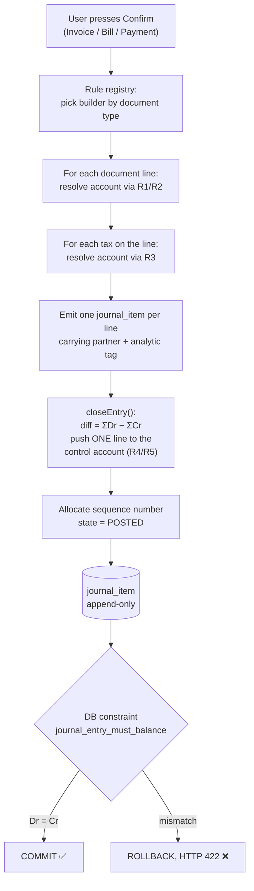

#### 5.3.4 The pseudocode

```ts
// ============================================================
// src/server/accounting/posting-engine.ts
// The ONLY place in the codebase that writes to journal_item.
// ============================================================

type Line = {
  accountId: number;
  partnerId?: number;
  analyticId?: number;
  label: string;
  debit: bigint;   // paise
  credit: bigint;  // paise
};

type Trace = { rung: string; source: string; accountId: number; amount: bigint }[];

// ---- the rule registry: document type -> builder. No switch statements deeper. ----
const BUILDERS = {
  CUSTOMER_INVOICE: buildInvoiceLines,
  VENDOR_BILL:      buildBillLines,
  PAYMENT:          buildPaymentLines,
  MANUAL:           (doc) => ({ lines: doc.lines, control: null, trace: [] }),
} as const;

export async function post(tx, docType: keyof typeof BUILDERS, doc) {
  const journal = await resolveJournal(tx, docType, doc);   // §5.3.5
  const { lines, control, trace } = await BUILDERS[docType](tx, doc, journal);

  closeEntry(lines, control);                 // <- the balancing line, derived
  assertBalanced(lines);                      // belt; the DB trigger is braces

  const number = await allocateSequence(tx, journal, doc.date);  // at POST time
  const entry  = await tx.journalEntry.create({ data: {
      number, date: doc.date,                 // ACCOUNTING date from the document
      journalId: journal.id, reference: doc.reference,
      state: 'POSTED', posted_at: new Date(),
      sourceType: docType, sourceId: doc.id,
  }});
  await tx.journalItem.createMany({ data: lines.map(l => ({ ...l, entryId: entry.id })) });
  await tx.postingTrace.create({ data: { entryId: entry.id, json: trace } }); // §5.3.7
  return entry;
}

// ---- THE BALANCING LINE IS DERIVED, NEVER COMPUTED INDEPENDENTLY -------------
function closeEntry(lines: Line[], control: { accountId: number; partnerId?: number } | null) {
  const dr = lines.reduce((s, l) => s + l.debit,  0n);
  const cr = lines.reduce((s, l) => s + l.credit, 0n);
  const diff = dr - cr;
  if (diff === 0n) return;                        // manual entries arrive balanced
  if (!control) throw new PostingError('NO_CONTROL_ACCOUNT');
  lines.push(diff > 0n
    ? { ...control, label: 'Payable',    debit: 0n,     credit: diff, }
    : { ...control, label: 'Receivable', debit: -diff,  credit: 0n,  });
}

// ---- resolution chain R1 -----------------------------------------------------
async function resolveRevenueAccount(tx, line, journal, trace): Promise<number> {
  const hit = (rung: string, source: string, id: number | null | undefined) => {
    if (!id) return null;
    trace.push({ rung, source, accountId: id, amount: line.subtotal });
    return id;
  };
  const product = line.productId ? await tx.product.findUnique({
      where: { id: line.productId }, include: { category: true } }) : null;

  return hit('R1.1', 'invoice_line.account_id',            line.accountId)
      ?? hit('R1.2', 'product.income_account_id',          product?.incomeAccountId)
      ?? hit('R1.3', 'product_category.income_account_id', product?.category?.incomeAccountId)
      ?? hit('R1.4', 'journal.default_account_id',         journal.defaultAccountId)
      ?? (() => { throw new PostingError('NO_REVENUE_ACCOUNT', { line: line.id }); })();
}

// ---- builder: Customer Invoice ----------------------------------------------
async function buildInvoiceLines(tx, inv, journal) {
  const lines: Line[] = [];
  const trace: Trace  = [];
  const taxBuckets = new Map<number, bigint>();     // taxAccountId -> paise

  for (const l of inv.lines) {
    const subtotal = BigInt(l.qty) * BigInt(l.unitPricePaise);   // mockup: Unit Price * Qty
    const acct = await resolveRevenueAccount(tx, { ...l, subtotal }, journal, trace);

    lines.push({ accountId: acct, analyticId: l.analyticId,      // <- budget tag, §5.7
                 label: l.productName, debit: 0n, credit: subtotal });

    for (const t of l.taxes) {
      const amount = roundPaise(subtotal * BigInt(t.rateBp) / 10000n);   // per line, then round
      const ta = await resolveTaxAccount(tx, t, 'SALE', trace);
      taxBuckets.set(ta, (taxBuckets.get(ta) ?? 0n) + amount);
    }
  }
  for (const [accountId, amount] of taxBuckets)
    lines.push({ accountId, label: 'Output tax', debit: 0n, credit: amount });

  const control = { accountId: await resolveReceivable(tx, inv.partnerId, trace),
                    partnerId: inv.partnerId };
  return { lines, control, trace };
}
```

`buildBillLines` is the same function with `credit`/`debit` swapped, `resolveExpenseAccount` (R2), `paid_account_id` (R3) and `resolvePayable` (R4). `buildPaymentLines` emits one money line (R5) and lets `closeEntry` derive the control line. **Three builders, roughly 120 lines of code total, and not one account name among them.**

#### 5.3.5 Which journal, and which date

Two rules straight off the mockup, both easy to get wrong:

- **Journal is forced by document type**, not chosen by the user: *"In case of bill journal would always be Purchase"*, and by symmetry Sales for a customer invoice. For a payment, the journal is the Bank or Cash journal selected in the **Payment Via** field (which the mockup says defaults to Bank).
- **The accounting date comes from the document, not from `new Date()`**: *"(Bill date fetch from bill)"*. Post a bill dated 5-Jan on 20-Jan and the ledger says 5-Jan. This is the difference between a Balance Sheet that is right and one that is subtly, silently wrong.

```ts
function resolveJournal(tx, docType, doc) {
  switch (docType) {
    case 'CUSTOMER_INVOICE': return tx.journal.findFirst({ where: { type: 'SALES' } });
    case 'VENDOR_BILL':      return tx.journal.findFirst({ where: { type: 'PURCHASE' } });
    case 'PAYMENT':          return tx.journal.findUnique({ where: { id: doc.journalId } });
    case 'MANUAL':           return tx.journal.findUnique({ where: { id: doc.journalId } });
  }
}
```

#### 5.3.6 Why config-driven matters, and the exact demo moment

Here is the thing to understand: **a hardcoded posting engine and a config-driven one produce identical output on the happy path.** A demo video cannot tell them apart. A judge can — with one edit.

An Odoo engineer's test is always some version of: *"change a setting and post again."* If the second document posts differently, your engine reads configuration. If it posts identically, your engine is a `switch` statement and every other claim you make is now suspect.

Build for that thirty seconds. Rehearse the following, word for word. It uses **only fields the mockup already mandates** — no invented screens, no admin panel:

> **THE DEMO MOMENT — "Change the rule, don't change the code"**
>
> 1. *"Here's a vendor bill I just posted — Rs 14,400 of tables. Its journal entry debits **Purchase Expense A/c**."* (Point at the entry.)
> 2. *"Here's the P&L. Purchase Expense: Rs 14,400. Other Expense: Rs 3,000. Net Income Rs 35,000."*
> 3. *"Now — Account → Journals → Purchase. This is the mockup's own Default Account field."* Change it from `Purchase Expense A/c` to `Other Expense A/c`. Save.
> 4. *"New bill, same vendor, same table, same Rs 14,400. Confirm."*
> 5. Open the new journal entry. **The debit is now on Other Expense A/c.**
> 6. Open the P&L. **Purchase Expense unchanged at 14,400, Other Expense jumped from 3,000 to 17,400, and Net Income moved by exactly the new bill — because the Expenses subtotal is a sum over account types, not a hardcoded row.**
> 7. The line to say: *"I didn't touch any code. The posting engine has no account names in it — it walks a resolution chain: line override, then product, then product category, then the journal's default. You just edited rung four."*
>
> Then set it back. Total elapsed: 40 seconds.

A second, stronger variant if you have time — set `product_category('Furniture').expense_account_id` and post a table and a sofa on the same bill: they land on **different** accounts from **one** document. That proves rung 3 exists, which no team fakes.

> **What to say if a judge asks about the posting engine:** *"One service, three builders, zero account names in code. Every account is resolved from a four-rung config chain and the trace is stored on the entry — I can show you which rung fired for every line."*

#### 5.3.7 "Explain this entry" — the panel that ends the argument

Store the `trace` array produced by the resolvers and render it beside every auto-generated journal entry:

```
Rule  sales_invoice_post   Journal SALES (forced by document type)
R1.4  journal.default_account_id  -> Sales Income A/c   Cr  10,000.00   [Wooden Table x2]
R1.4  journal.default_account_id  -> Sales Income A/c   Cr   2,400.00   [Delivery Charge]
R3.1  tax GST18.collected_account -> Output GST Payable Cr   1,800.00
R4.2  company.default_receivable  -> Debtors A/c        Dr  14,200.00   [derived = ΣCr]
      analytic distribution: Showroom-West on both revenue lines
      rounding difference: 0.00
```

This is roughly forty minutes of work (you already have the array; you just have to render it). It pre-emptively answers the only question a judge actually has about your posting engine, and no other team will have built it.

**Labelled additions in this sub-section, and why they earn their place:**

| Addition | Why it is justified |
|---|---|
| `Output GST Payable A/c`, `Input GST Receivable A/c` | The PDF lists **Tax** on the Sales Order. Tax has to land somewhere, and putting it in Sales Income would overstate revenue and break the Balance Sheet. Two rows of seed data. |
| `product.income_account_id`, `product_category.expense_account_id` etc. | Turns the resolution chain from two rungs into four, which is what makes "config-driven" *demonstrable*. Four nullable columns, zero required UI (leave them blank and rung 4 handles everything). |
| `contact.receivable_account_id` / `payable_account_id` | Same reason for R4. Nullable, falls back to Debtors/Creditors. |
| `posting_trace` table + Explain panel | Pure instrumentation of logic you already wrote. It is the cheapest credibility in the build. |

---

### 5.4 The four worked postings, to the paisa

These are the four you must be able to draw on a whiteboard from memory. Every number below ties out and is reused in §5.5, §5.6 and §5.7, so you can run one continuous demo.

#### 5.4.1 Customer Invoice with GST

**INV/2026/0009** — 10-Jan-2026, customer **Nimesh Pathak**, journal **Sales**.

| Sr | Product | Chart of Accounts | Budget Analytics | Qty | Unit Price | Total |
|---|---|---|---|---:|---:|---:|
| 1 | Wooden Table | *(blank → resolves)* | Showroom-West | 2 | 5,000.00 | 10,000.00 |
| 2 | Delivery Charge (service) | *(blank → resolves)* | Showroom-West | 1 | 2,400.00 | 2,400.00 |

Taxes: line 1 carries **GST 18%** → Rs 1,800.00. Line 2 is a service line carrying **GST 0% (exempt)** → Rs 0.00.
Subtotal **12,400.00** · Tax **1,800.00** · **Invoice total 14,200.00**

Journal entry produced — **one item per document line, never grouped**, so drill-down and budget tagging survive:

| Account | Type | Partner | Analytic | Debit | Credit | Rung |
|---|---|---|---|---:|---:|---|
| Debtors A/c | ASSET | Nimesh Pathak | | **14,200.00** | | R4 *(derived)* |
| Sales Income A/c | INCOME | | Showroom-West | | 10,000.00 | R1.4 |
| Sales Income A/c | INCOME | | Showroom-West | | 2,400.00 | R1.4 |
| Output GST Payable A/c | LIABILITY | | | | 1,800.00 | R3 |
| **Totals** | | | | **14,200.00** | **14,200.00** | ✅ |

Read it in English: *"The customer now owes us Rs 14,200 (asset up). We earned Rs 12,400 (income up). We are holding Rs 1,800 for the government (liability up)."*

**Do not put the tax in Sales Income.** If you do, your P&L overstates income by 1,800, your Balance Sheet is missing a liability of 1,800, and it still balances — which is the worst kind of bug, because it looks fine.

#### 5.4.2 Vendor Bill with GST

**BILL/2026/0001** — 05-Jan-2026, vendor **Azure Furniture**, journal **Purchase**.

12 Wooden Chairs @ Rs 1,200 = **14,400.00**, GST 18% = **2,592.00**, **bill total 16,992.00**. Line tagged analytic **Furniture-Procurement**.

| Account | Type | Partner | Analytic | Debit | Credit | Rung |
|---|---|---|---|---:|---:|---|
| Purchase Expense A/c | EXPENSES | | Furniture-Procurement | 14,400.00 | | R2.4 |
| Input GST Receivable A/c | ASSET | | | 2,592.00 | | R3 |
| Creditors A/c | LIABILITY | Azure Furniture | | | **16,992.00** | R4 *(derived)* |
| **Totals** | | | | **16,992.00** | **16,992.00** | ✅ |

English: *"We incurred Rs 14,400 of cost. The government owes us back Rs 2,592 of input tax. We owe Azure Rs 16,992."*

This is exactly the mockup's *"Purchase A/c ... Creditor A/c"* journal entry, with the tax line the PDF implies added in the middle. Same shape, richer.

#### 5.4.3 Customer Payment (Receive)

**RCPT/2026/0001** — 12-Jan-2026, Payment Type **Receive**, Partner **Nimesh Pathak**, Payment Via **Bank**, Amount **10,000.00** against INV/2026/0009.

| Account | Type | Partner | Debit | Credit | Rung |
|---|---|---|---:|---:|---|
| Bank A/c | BANK | | 10,000.00 | | R5 — `journal('Bank').default_account_id` |
| Debtors A/c | ASSET | Nimesh Pathak | | 10,000.00 | R4 *(derived)* |
| **Totals** | | | **10,000.00** | **10,000.00** | ✅ |

English: *"Cash in the bank went up 10,000. What the customer still owes went down 10,000."* Nothing touched Income — **the sale was earned when the invoice was posted, not when the money arrived.** That sentence is worth saying out loud to a judge; it is the accrual principle and it is exactly what fake systems get wrong when they treat payments as revenue.

Then `payment_allocation` gets one row: `(payment=RCPT/2026/0001, doc=INV/2026/0009, amount=10,000.00)`. Residual becomes 4,200.00, badge flips to **Partial**. See §5.8.

#### 5.4.4 Vendor Payment (Send)

**PAY/2026/0001** — 08-Jan-2026, Payment Type **Send**, Partner **Azure Furniture**, Payment Via **Bank**, Amount **10,000.00** against BILL/2026/0001.

| Account | Type | Partner | Debit | Credit | Rung |
|---|---|---|---:|---:|---|
| Creditors A/c | LIABILITY | Azure Furniture | 10,000.00 | | R4 *(derived)* |
| Bank A/c | BANK | | | 10,000.00 | R5 |
| **Totals** | | | **10,000.00** | **10,000.00** | ✅ |

English: *"We owe Azure 10,000 less. Our bank has 10,000 less."*

Notice all four entries came out of the **same three builders and the same `closeEntry()`**. The only thing that varied was which rung of which chain fired.

#### 5.4.5 Rounding — the bug that will cost you an hour if you don't pre-empt it

The classic failure: you compute tax on the whole document (`round(12400 × 18%)`) but display tax per line (`round(10000×18%) + round(2400×18%)`). Those two can differ by a paisa, and your entry is off by Rs 0.01 and refuses to post.

Three rules that make it impossible:

1. **Compute tax per line, round each line to whole paise, then sum.** Never round the total.
2. **Store integer paise.** No float ever enters the arithmetic.
3. **Derive the control line by subtraction** (`closeEntry`). Even if every other line has a rounding quirk, the receivable/payable line is defined as *whatever makes the entry balance*, so the entry cannot be lopsided. This single design decision removes the entire class of bug.

If you later add price-inclusive taxes (`tax.price_included = true`, where Rs 5,900 already contains 18%), the back-computation `net = round(gross × 10000 / (10000 + rate_bp))` can leave a 1-paise residue across many lines. Post it to a `Rounding Difference A/c` (`OTHER_EXPENSES`) as an explicit line. Do **not** silently absorb it.

> **What to say if a judge asks about rounding:** *"Money is BIGINT paise, tax is rounded per line, and the control line is derived as the difference — so a rounding error can't unbalance an entry, it can only shift a paisa onto the receivable, which is the accounting-correct place for it."*

---

### 5.5 The Balance Sheet algorithm

#### 5.5.1 What a Balance Sheet actually is

A **snapshot of the business at one instant**. Not a period. Not "January". A moment in time, usually the last day of a year.

Left column: everything we own (**Assets**). Right column: who has a claim on it — outsiders (**Liabilities**) and the owner (**Capital**). The two columns must be equal, because every rupee of stuff came from somewhere.

The mockup's version has a **Year selector (2026)**, three Asset rows (Bank, Cash, Debtors), two Liability rows (Capital, Creditors), a **Total Asset** footer and a **Total (Liabilities)** footer, and a **Print → PDF** button.

#### 5.5.2 The algorithm, in English

> Take every journal item that belongs to a **posted** entry whose **date is on or before T**, from the beginning of the company's existence. Group them by account. For each account, balance = Σdebit − Σcredit. Show debit-normal types in the Assets column and credit-normal types in the Liabilities column, sign-flipped so they read positive.

Three details carry all the weight:

1. **`date <= T` only. There is no start date.** A Balance Sheet is cumulative from inception. If you write `BETWEEN '2026-01-01' AND '2026-12-31'` on a Balance Sheet, you have built the wrong report — you have thrown away every prior year's bank balance. The Year selector means **T = 31-Dec-2026**, nothing more.
2. **Only posted entries.** Drafts are invisible to reports.
3. Every number you show is a `GROUP BY` over `journal_item`. Nothing reads `invoice`.

#### 5.5.3 The queries

```sql
-- (1) Every balance-sheet account, cumulative to T.
SELECT a.id, a.name, a.type,
       COALESCE(SUM(ji.debit_paise - ji.credit_paise), 0) AS signed_paise
FROM journal_item  ji
JOIN journal_entry je ON je.id = ji.entry_id
JOIN account       a  ON a.id  = ji.account_id
WHERE je.state = 'POSTED'
  AND je.date <= $1              -- T. NO lower bound. This is the whole point.
  AND a."group" = 'BALANCE_SHEET'
GROUP BY a.id, a.name, a.type
HAVING COALESCE(SUM(ji.debit_paise - ji.credit_paise), 0) <> 0;

-- (2) Current Year Earnings: this fiscal year's profit, up to T.
SELECT COALESCE(SUM(ji.credit_paise - ji.debit_paise), 0) AS cye_paise
FROM journal_item ji
JOIN journal_entry je ON je.id = ji.entry_id
JOIN account a ON a.id = ji.account_id
WHERE je.state='POSTED' AND a."group"='PROFIT_AND_LOSS'
  AND je.date >= $fy_start AND je.date <= $1;

-- (3) Retained Earnings: every prior year's profit, rolled into one number.
SELECT COALESCE(SUM(ji.credit_paise - ji.debit_paise), 0) AS retained_paise
FROM journal_item ji
JOIN journal_entry je ON je.id = ji.entry_id
JOIN account a ON a.id = ji.account_id
WHERE je.state='POSTED' AND a."group"='PROFIT_AND_LOSS'
  AND je.date < $fy_start;
```

`fy_start` comes from a company setting (`fiscal_year_start_month`, default 4 for the Indian April–March year; set it to 1 to match the mockup's calendar-year "2026" selector). Do not hardcode it.

#### 5.5.4 Current Year Earnings and Retained Earnings — what they are and why they must exist

Here is the thing that trips up 90% of teams.

Profit is not an account you post to. Nobody ever writes "Dr Profit". Profit is a **derived number**: Income minus Expenses. But profit belongs to the owner, so it must appear on the Capital side of the Balance Sheet — otherwise the two columns will not tie.

So the Balance Sheet **injects two synthetic rows** into the equity block:

- **Current Year Earnings (CYE)** = profit earned between the start of the current fiscal year and T. This is *exactly the same number* your P&L reports as Net Income for that period.
- **Retained Earnings** = the sum of every fiscal year's profit *before* the current one, collapsed into one figure. This is the "rollover".

They are not stored anywhere. They are computed at render time by queries (2) and (3) above. That is why there is no year-end "closing" process to build — a genuine time saver, and the correct design.

```ts
function buildBalanceSheet(T: Date) {
  const rows      = queryBalanceSheetAccounts(T);
  const cye       = queryCurrentYearEarnings(fyStart(T), T);
  const retained  = queryRetainedEarnings(fyStart(T));

  const assets = rows.filter(r => ['ASSET','BANK','CASH'].includes(r.type))
                     .map(r => ({ ...r, amount: r.signed }));          // Dr − Cr
  const liabs  = rows.filter(r => ['LIABILITY','CAPITAL'].includes(r.type))
                     .map(r => ({ ...r, amount: -r.signed }));         // Cr − Dr

  if (retained !== 0n) liabs.push({ name: 'Retained Earnings',      amount: retained, synthetic: true });
  if (cye      !== 0n) liabs.push({ name: 'Current Year Earnings',  amount: cye,      synthetic: true });

  return { assets, liabs,
           totalAssets: sum(assets), totalLiabs: sum(liabs),
           balanced: sum(assets) === sum(liabs) };   // must be true. always.
}
```

#### 5.5.5 Why it balances — the proof (learn this, it is a 20-second answer)

Every posted entry satisfies Σdebit = Σcredit, enforced by the database. Sum that over **all** entries up to T:

```
Σ_all_items (debit − credit) = 0
```

Split the accounts into their two groups:

```
Σ_BalanceSheet (debit − credit) + Σ_ProfitAndLoss (debit − credit) = 0
```

Now name the pieces. On the balance-sheet side, debit-normal accounts are Assets and credit-normal ones are Liabilities + Capital, so `Σ_BS(debit − credit) = Assets − (Liabilities + Capital)`. On the P&L side, `Σ_PL(debit − credit) = Expenses − Income = −NetIncome`. Substitute:

```
Assets − (Liabilities + Capital) − NetIncome = 0
Assets = Liabilities + Capital + NetIncome
```

And `NetIncome` from inception to T is precisely `RetainedEarnings + CurrentYearEarnings`. Therefore:

```
Total Assets = Liabilities + Capital + Retained Earnings + Current Year Earnings
```

> **What to say if a judge asks why your Balance Sheet balances:** *"It isn't checked, it's implied. Debit equals credit is a database constraint on every entry, so the sum over all entries is zero. Split that sum by account group and you get Assets = Liabilities + Capital + Net Income. Current Year Earnings is that Net Income injected into equity — which is the same number my P&L shows. It balances for the same reason 3 − 3 = 0."*

#### 5.5.6 Worked numbers you can seed and demo

Nine posted entries, one small company, calendar year 2026:

| # | Date | Description | Debit | Credit |
|---|---|---|---|---|
| E1 | 01-Jan-26 | Owner puts in capital | Bank 5,00,000 | Capital 5,00,000 |
| E2 | 02-Jan-26 | Cash withdrawn from bank | Cash 50,000 | Bank 50,000 |
| E3 | 05-Jan-26 | BILL/2026/0001 (§5.4.2) | Purchase Expense 14,400 · Input GST 2,592 | Creditors 16,992 |
| E4 | 08-Jan-26 | PAY/2026/0001 (§5.4.4) | Creditors 10,000 | Bank 10,000 |
| E5 | 10-Jan-26 | INV/2026/0009 (§5.4.1) | Debtors 14,200 | Sales Income 12,400 · Output GST 1,800 |
| E6 | 12-Jan-26 | RCPT/2026/0001 (§5.4.3) | Bank 10,000 | Debtors 10,000 |
| E7 | 15-Jan-26 | Showroom rent, paid cash | Other Expense 3,000 | Cash 3,000 |
| E8 | 20-Jan-26 | INV/2026/0010, 5 chairs @ 8,000 + 18% | Debtors 47,200 | Sales Income 40,000 · Output GST 7,200 |

**Balance Sheet as of 31-Dec-2026:**

| Assets | Amount (Rs) | | Liabilities & Capital | Amount (Rs) |
|---|---:|---|---|---:|
| Bank A/c | 4,50,000.00 | | Creditors A/c | 6,992.00 |
| Cash A/c | 47,000.00 | | Output GST Payable A/c | 9,000.00 |
| Debtors A/c | 51,400.00 | | Capital A/c | 5,00,000.00 |
| Input GST Receivable A/c | 2,592.00 | | *Current Year Earnings* | 35,000.00 |
| **Total Asset** | **5,50,992.00** | | **Total (Liabilities)** | **5,50,992.00** |

Check each one by hand once, on paper, before you trust the code:
- Bank: +5,00,000 − 50,000 − 10,000 + 10,000 = **4,50,000**
- Cash: +50,000 − 3,000 = **47,000**
- Debtors: +14,200 − 10,000 + 47,200 = **51,400**
- Creditors: 16,992 − 10,000 = **6,992**
- Output GST: 1,800 + 7,200 = **9,000**
- CYE: Income 52,400 − Expenses (14,400 + 3,000) = **35,000**

#### 5.5.7 The rollover, demonstrated

Add two 2027 entries: E9 (10-Feb-27) invoice Rs 20,000 + GST 3,600 = 23,600, and E10 (12-Feb-27) rent Rs 5,000 cash.

**Balance Sheet as of 15-Feb-2027** — note what happened to the 35,000:

| Assets | Rs | | Liabilities & Capital | Rs |
|---|---:|---|---|---:|
| Bank | 4,50,000.00 | | Creditors | 6,992.00 |
| Cash | 42,000.00 | | Output GST Payable | 12,600.00 |
| Debtors | 75,000.00 | | Capital | 5,00,000.00 |
| Input GST Receivable | 2,592.00 | | **Retained Earnings** | **35,000.00** |
| | | | *Current Year Earnings* | 15,000.00 |
| **Total Asset** | **5,69,592.00** | | **Total (Liabilities)** | **5,69,592.00** |

The 2026 profit of 35,000 rolled from Current Year Earnings into Retained Earnings **automatically**, purely because `fy_start` moved. No closing entry, no batch job, no button. That is the payoff of computing equity instead of storing it.

#### 5.5.8 A free consequence worth knowing about

**The as-of slider costs almost nothing.** Because the query is a pure function of `T`, replacing the mockup's Year dropdown with a date slider costs about twenty lines. Dragging it re-derives the whole statement live. It is the only cinematic thing this domain offers and it is *impossible* to fake with document-summed reports. (Covered as a differentiator elsewhere in this document; noted here so you know the engine already supports it.)

---

### 5.6 The Profit & Loss algorithm

#### 5.6.1 What it is

Where the Balance Sheet is a photograph at an instant, the **P&L is a video of a period**. "How much did we earn and spend between 1-Jan and 31-Dec?" It has a start date *and* an end date, and it only ever looks at accounts in the `PROFIT_AND_LOSS` group.

#### 5.6.2 The mockup's six lines, exactly

The mockup's **Field Computation** callout is prescriptive and must be matched line for line:

| Row | Mockup's stated computation | What it actually means | Our 2026 numbers |
|---|---|---|---:|
| **Income** | "Total of Income" | Section subtotal = sum of its child rows | 52,400.00 |
| **Income from Sales** | "Total of account type Income" | `SUM(credit − debit)` where `type = INCOME` | 52,400.00 |
| **Expenses** | "Total of All expenses" | Section subtotal = Purchase Expense + Other Expense | 17,400.00 |
| **Purchase Expense** | "Total of Account type Expense" | `SUM(debit − credit)` where `type = EXPENSES` | 14,400.00 |
| **Other Expense** | "Total of account type Other Expense" | `SUM(debit − credit)` where `type = OTHER_EXPENSES` | 3,000.00 |
| **Net Income** | "Difference of Income - Expenses" | Income − Expenses | **35,000.00** |

Two things worth noticing, because they tell you how to build it:

- **Two of the six rows are section subtotals, four are type sums.** So do not write six queries. Write **one** query grouped by `account.type`, then assemble a small section tree in code. The mockup's own sample proves the structure: 10,000 / 10,000 / 7,000 / 6,000 / 1,000 / 3,000 — Income equals its single child, and 6,000 + 1,000 = 7,000, and 10,000 − 7,000 = 3,000.
- **`Income` equals `Income from Sales` today only because there is exactly one income type.** Keep them as separate rows anyway. The moment you add a second income-type account, the parent row starts differing from the child, and your report just handles it. That is what "generic" buys you.

#### 5.6.3 The query and the assembly

```sql
SELECT a.type,
       COALESCE(SUM(ji.credit_paise - ji.debit_paise), 0) AS credit_minus_debit
FROM journal_item ji
JOIN journal_entry je ON je.id = ji.entry_id
JOIN account       a  ON a.id  = ji.account_id
WHERE je.state = 'POSTED'
  AND a."group" = 'PROFIT_AND_LOSS'
  AND je.date >= $start AND je.date <= $end     -- BOTH bounds. Unlike the Balance Sheet.
GROUP BY a.type;
```

```ts
const SECTIONS = {
  income:   ['INCOME'],
  expenses: ['EXPENSES', 'OTHER_EXPENSES'],
};

function buildPnl(start: Date, end: Date) {
  const byType = new Map(rows.map(r => [r.type, r.credit_minus_debit]));
  const g = (t) => byType.get(t) ?? 0n;

  const incomeFromSales = g('INCOME');                 // credit − debit  -> positive
  const purchaseExpense = -g('EXPENSES');              // flip: debit-normal -> positive
  const otherExpense    = -g('OTHER_EXPENSES');

  const income   = incomeFromSales;                    // section subtotal
  const expenses = purchaseExpense + otherExpense;     // section subtotal

  return {
    rows: [
      { label: 'Income',            amount: income,          section: true  },
      { label: 'Income from Sales', amount: incomeFromSales, section: false },
      { label: 'Expenses',          amount: expenses,        section: true  },
      { label: 'Purchase Expense',  amount: purchaseExpense, section: false },
      { label: 'Other Expense',     amount: otherExpense,    section: false },
      { label: 'Net Income',        amount: income - expenses, highlight: true },
    ],
  };
}
```

**The sign flip is the only subtle part.** Expense accounts are debit-normal, so `credit − debit` comes out negative (−14,400). Negate it once, at the section boundary, and every downstream number is positive and reads naturally. Do the flip in **one** place — a `SIGN: Record<account_type, 1|-1>` constant map — not scattered through the code.

#### 5.6.4 The tie-out that wins the moment

`Net Income` for `[fy_start, T]` is, by construction, **the identical query** to Current Year Earnings in §5.5.3(2). Same rows, same filter, same arithmetic.

> **The demo line, said while pointing at two windows:** *"P&L says Net Income Rs 35,000 for 2026. Balance Sheet says Current Year Earnings Rs 35,000. That is not two calculations that happen to agree — it is literally the same SQL. That is why the Balance Sheet balances."*

Judges remember this. It takes eight seconds.

> **What to say if a judge asks about the P&L:** *"One `GROUP BY account.type` over posted journal items inside the period, sign-flipped once by type, then assembled into the mockup's six rows — two of which are section subtotals. If you add a new expense account tomorrow it appears in the right section with no code change."*

---

### 5.7 Two aggregations, one table — the whole architectural point

This is the sentence to open your demo with, and the idea a judge is actually grading.

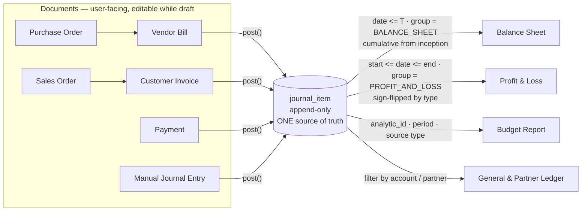

Look at what changes between the Balance Sheet and the P&L:

| | Balance Sheet | Profit & Loss |
|---|---|---|
| Table read | `journal_item` | `journal_item` |
| Date filter | `date <= T` — **no start** | `start <= date <= end` — **both** |
| Account filter | `group = BALANCE_SHEET` | `group = PROFIT_AND_LOSS` |
| Sign | Assets `Dr−Cr`, Liab/Capital `Cr−Dr` | Income `Cr−Dr`, Expenses `Dr−Cr` |
| Extra | injects CYE + Retained Earnings | none |

**Nothing else.** Same table, same join, four differences in the `WHERE` and the sign map. That is what "derived reports" means, and it is why the correct architecture is *less* code than the fake one — the fake needs one bespoke query per report per source table.

#### Why the fake breaks, in one demo

The 70–80% of teams who compute `SELECT SUM(total) FROM invoices` for Income look identical to you on the happy path. Here is what breaks them, and it is what a judge will do:

| Judge's action | Correct system | Document-summed system |
|---|---|---|
| Post a manual JE: Dr Cash 50,000 / Cr Capital 50,000 | Balance Sheet moves: Cash +50,000, Capital +50,000 | **Nothing happens.** There is no invoice row. |
| Post an opening balance | Appears | Invisible |
| Pay half an invoice | Debtors falls by half, Bank rises | Usually all-or-nothing |
| Cancel a posted invoice | Reversal entry appears, both visible | Row deleted, history rewritten |
| Change Sales journal default account | Next invoice posts elsewhere | Identical output |

The manual journal entry is the killer, and the mockup *mandates* the manual Journal Entry screen with its own **Post** button and a blocking balance check. The organisers built the trap into the spec. A team that writes report queries against `invoices` has a fully-drawn screen in their app that does nothing to their reports.

> **What to say, unprompted, in the first fifteen seconds:** *"Every number in this app comes from one table — `journal_item`. Nothing is summed from invoices. Post a manual entry yourself and watch the Balance Sheet move."* Then hand them the keyboard.

---

### 5.8 The Budget engine

#### 5.8.1 What an analytic account is, in plain English

The Chart of Accounts answers *"what kind of money was this?"* (income, rent, purchase). An **Analytic Account** answers a completely different question: *"which project or department was this for?"*

They are two independent tags on the same rupee. Rs 14,400 spent on chairs is `Purchase Expense` (what) **and** `Furniture-Procurement` (which project). The mockup calls the tag **Budget Analytics** and puts it as a many2one column on every PO, Bill, SO and Invoice line, sourced from an Analytics Master where `Type` is a two-value selection: **Income** or **Expense**.

A **Budget** is then: a name, a period (start–end), a responsible person, and a set of lines — one per analytic account — each with a **Committed Amount** (the plan) and three computed columns.

⚠️ **Vocabulary warning that will save you an argument.** The mockup uses "**Committed Amount**" to mean *the planned/budgeted figure*. In standard accounting, "committed" means something else entirely (money locked in by confirmed-but-unbilled purchase orders). **Use the mockup's meaning everywhere in the UI.** If you add the accounting concept as an extra (§5.8.6), call that column **"Encumbered (open POs)"** — never "Committed". Colliding with the organisers' own vocabulary is a self-inflicted wound.

#### 5.8.2 The three mandated formulas

Straight from the mockup's Field Explanation box, non-negotiable:

```
Achieved %       = (Achieved Amount / Committed Amount) * 100
Amount To Achieve =  Committed Amount - Achieved Amount
```

And all three of `Achieved Amount`, `Achieved %`, `Amount To Achieve` are **only visible when the budget is in the Confirmed stage** — the mockup says "Only Visible for Confirmed Budget" three separate times.

Guard the division: `Committed = 0` ⇒ show `—`, not `NaN%` or `Infinity`. That is the kind of thing a judge stumbles into by accident.

Worked, using our ledger:

| Analytic | Type | Committed | Achieved | Achieved % | Amount To Achieve |
|---|---|---:|---:|---:|---:|
| Furniture-Procurement | Expense | 2,00,000.00 | 14,400.00 | 7.20% | 1,85,600.00 |
| Showroom-West | Income | 1,00,000.00 | 52,400.00 | 52.40% | 47,600.00 |

(`14,400 / 2,00,000 × 100 = 7.2`; `2,00,000 − 14,400 = 1,85,600`. `52,400 / 1,00,000 × 100 = 52.4`; `1,00,000 − 52,400 = 47,600`.)

#### 5.8.3 The matching rule — directional, and the mockup is explicit

This is the part teams get wrong. The rule is **directional**:

> *"Analyticals on All Invoice lines to be mapped with type = Income"*
> *"Analyticals on All Purchase Order/Vendor Bill Lines to be mapped with Type = Expenses"*

And the lookup table the mockup draws:

| Analytic Name | Type | Lookup | Achieved Amount |
|---|---|---|---|
| Project 1 | Income | **Sales Invoice** | 21,000 |
| Project 1 | Expense | **Vendor Bills** | 21,000 |

So: **an Income-type budget line's achievement comes from Sales Invoices only. An Expense-type budget line's achievement comes from Vendor Bills only.** Never mixed. If someone tags an analytic of type Income onto a vendor bill line, it contributes nothing — that is correct behaviour, not a bug.

#### 5.8.4 How to compute Achieved — and why you should read `journal_item`, not the document lines

The mockup phrases the computation as a document search: *"Search Analytical in Sales Invoice with name Project 1, consider budget period and compute total and set in achieved amount."*

You can implement that literally. **Do not.** Read `journal_item` instead, filtered to the same documents. Here is why it is both spec-compliant and better:

1. Every other report in the app reads `journal_item`. One aggregation source, one mental model, one set of indexes.
2. **Tax is excluded automatically.** The posting engine puts the analytic tag only on the revenue/expense line, never on the tax line. So Achieved on INV/2026/0009 comes out as 10,000 + 2,400 = 12,400, *not* 14,200. That is the accounting-correct answer — a budget tracks net spend; GST is a pass-through to the government, not consumption of your budget. If you sum document lines, you must remember to exclude tax by hand. If you sum journal items, it is impossible to get wrong.
3. Draft documents are excluded for free, because drafts have no journal items.
4. Cancelled documents self-correct for free, because their reversal entry (§5.9) carries the same analytic tag with the opposite sign.

Point 4 alone is worth the decision. A document-line sum keeps counting a cancelled invoice unless you remember an extra `state != 'CANCELLED'` filter in every query.

```sql
-- Achieved for ONE budget line.
-- $analytic, $start, $end, and $sources come from the budget line's Type.
SELECT COALESCE(SUM(
         CASE WHEN a.type = 'INCOME' THEN ji.credit_paise - ji.debit_paise
                                     ELSE ji.debit_paise  - ji.credit_paise END
       ), 0) AS achieved_paise
FROM journal_item  ji
JOIN journal_entry je ON je.id = ji.entry_id
JOIN account       a  ON a.id  = ji.account_id
WHERE je.state = 'POSTED'
  AND ji.analytic_id = $analytic
  AND je.date BETWEEN $start AND $end
  AND je.source_type = ANY($sources)     -- Income -> {CUSTOMER_INVOICE}
                                         -- Expense -> {VENDOR_BILL}
  AND a."group" = 'PROFIT_AND_LOSS';
```

```ts
const SOURCES = {
  INCOME:  ['CUSTOMER_INVOICE'],   // mockup: "Lookup: Sales Invoice"
  EXPENSE: ['VENDOR_BILL'],        // mockup: "Lookup: Vendor Bills"
};
```

The `source_type` filter is what keeps you literally compliant with the mockup's rule while still reading the ledger. Offer an "include manual entries" checkbox as a clearly-labelled extra if you want; leave it **off** by default so the number matches the spec exactly.

#### 5.8.5 The drill-down

The mockup makes Achieved Amount a **button**: *"Clicking on the Achieved Amount Button open list view of all Invoices/Bills having same analytical for the budget period."*

Because `journal_entry` carries `source_type` + `source_id`, the drill-down is the same query with the aggregate removed:

```sql
SELECT DISTINCT je.source_type, je.source_id, je.date, je.number,
       SUM(ABS(ji.debit_paise - ji.credit_paise)) AS contribution_paise
FROM journal_item ji JOIN journal_entry je ON je.id = ji.entry_id
WHERE je.state='POSTED' AND ji.analytic_id = $analytic
  AND je.date BETWEEN $start AND $end
  AND je.source_type = ANY($sources)
GROUP BY je.source_type, je.source_id, je.date, je.number
ORDER BY je.date;
```

Then resolve `source_id` to the invoice/bill row for the list view, and every row is clickable through to the document → its journal entry → the payments against it. **No dead ends.** The mockup also demands a **Budget smart button** on the Bill/Invoice pointing the other way — *"On Click Open the Budget Analytic Report that is used the Bill"* — which is the same relationship traversed in reverse. Build one join, get both directions.

#### 5.8.6 The non-blocking over-budget warning

The mockup requires this on **two** hook points — confirming a **PO** and confirming a **Bill** — with identical wording, and it is explicitly **non-blocking**:

> ⚠ **Exceeds Approved Budget** — *"The entered amount is higher than the remaining budget amount for this budget line. Consider adjusting the value or revise the budget."*

```ts
async function checkBudget(doc): Promise<Warning[]> {
  const warnings = [];
  for (const [analyticId, lineTotal] of groupLinesByAnalytic(doc)) {
    const bl = await findConfirmedBudgetLine(analyticId, doc.date);   // period contains doc.date
    if (!bl) continue;                                   // untagged or unbudgeted -> silent
    const remaining = bl.committed - bl.achieved - bl.encumbered;     // encumbered = extra
    if (lineTotal > remaining) {
      warnings.push({
        code: 'BUDGET_EXCEEDED',
        title: 'Exceeds Approved Budget',
        body : 'The entered amount is higher than the remaining budget amount for '
             + 'this budget line. Consider adjusting the value or revise the budget.',
        detail: { budget: bl.budgetName, analytic: bl.analyticName,
                  remaining, attempting: lineTotal },
      });
    }
  }
  return warnings;                 // returned, DISPLAYED, and then the user proceeds
}
```

The API must return `200` with a `warnings[]` array and still complete the confirm. Returning `422` here is a spec violation — the mockup says non-blocking in writing, twice. Contrast with the manual Journal Entry balance check, which the mockup marks in red as **blocking**. Two warnings, two different behaviours; getting both right is a small detail a careful judge will specifically probe.

*(`encumbered` — the value of confirmed POs not yet converted to bills — is a labelled **addition**. It costs one extra query, it is the real accounting concept the word "commitment" refers to, and it makes the warning fire at the right time: when you *order*, not when you're finally *billed*. Name the column "Encumbered (open POs)" per §5.8.1.)*

> **What to say if a judge asks about the budget:** *"Achievement is derived from analytic-tagged journal items, filtered to the budget period and to the source document type — Sales Invoices for Income lines, Vendor Bills for Expense lines, exactly as the mockup specifies. Because the tag sits on the revenue line and not the tax line, GST is excluded automatically. And the achieved figure is clickable straight through to the documents behind it."*

---

### 5.9 Partial payments and residual

#### 5.9.1 The rule the mockup mandates

The status badge is **computed, never stored**:

| Badge | Mockup's condition | Implement as |
|---|---|---|
| **Paid** (green) | "If amount due = 0" | `due === 0` |
| **Partial** (orange) | "If amount due < Bill Total" | `0 < due && due < total` |
| **Not Paid** (red) | "If amount due = Bill Total" | `due === total` |

Read the mockup's literal wording carefully: "Partial — if amount due < Bill Total" is *also* true when due is 0. But the mockup annotates the badges "**only one at a time**". So evaluate as an ordered ladder (`Paid` → `Not Paid` → `Partial`) or use the exclusive middle condition above. This is a two-minute detail that a judge who reads carefully will notice you noticed.

And: **Amount Due = Total − Amount Paid**, with the footer split into **Paid Via Cash** and **Paid Via Bank**.

#### 5.9.2 Residual is derived, never stored

```sql
-- one query, works for invoices and bills, drives the badge AND the footer split
SELECT
  d.total_paise,
  COALESCE(SUM(pa.amount_paise), 0)                                    AS paid_paise,
  COALESCE(SUM(pa.amount_paise) FILTER (WHERE j.type='CASH'), 0)       AS paid_cash_paise,
  COALESCE(SUM(pa.amount_paise) FILTER (WHERE j.type='BANK'), 0)       AS paid_bank_paise,
  d.total_paise - COALESCE(SUM(pa.amount_paise), 0)                    AS residual_paise
FROM customer_invoice d
LEFT JOIN payment_allocation pa
       ON pa.document_type = 'CUSTOMER_INVOICE' AND pa.document_id = d.id
LEFT JOIN payment p ON p.id = pa.payment_id AND p.state = 'CONFIRMED'
LEFT JOIN journal j ON j.id = p.journal_id
WHERE d.id = $1
GROUP BY d.id, d.total_paise;
```

Note `p.state = 'CONFIRMED'`. A payment in **Draft** contributes nothing (matching the mockup's `Draft > Confirm > Cancelled` statusbar), and cancelling a payment removes its contribution automatically — no field to remember to update.

**Never add a `paid BOOLEAN` or a `paid_amount` column to the invoice.** The moment you do, you have two sources of truth and they will diverge within an hour of demo prep. Postgres will do this join in under a millisecond on hackathon data volumes. If you genuinely need it faster later, make it a `VIEW` or a `GENERATED` column — but do not make it a field people can write to.

#### 5.9.3 Worked example — Rs 10,000 against a Rs 14,200 invoice

**State 0.** INV/2026/0009 posted, total Rs 14,200.00.

```
allocations: (none)
paid = 0.00 · due = 14,200.00 · due === total  ->  badge: NOT PAID
Paid Via Cash 0.00 | Paid Via Bank 0.00 | Amount Due 14,200.00
Balance Sheet: Debtors 14,200.00
```

**State 1.** Customer pays Rs 10,000 by **bank** on 12-Jan. Payment wizard opens with Partner autofilled (*"Autofill Partner Name from Invoice/Bill"*) and Amount autofilled to the due of 14,200 (*"Autofill Amount Due"*) — **the user edits it down to 10,000**. That edit is the whole feature; make sure the field is editable.

Two things happen, atomically, in one transaction:

```
(a) journal entry RCPT/2026/0001 posted:
        Dr Bank A/c    10,000.00
        Cr Debtors A/c 10,000.00   (partner: Nimesh Pathak)

(b) payment_allocation row:
        payment=RCPT/2026/0001, doc=INV/2026/0009, amount=10,000.00
```

Recompute:

```
paid = 10,000.00 · due = 14,200.00 − 10,000.00 = 4,200.00
0 < 4,200 < 14,200                       ->  badge: PARTIAL
Paid Via Cash 0.00 | Paid Via Bank 10,000.00 | Amount Due 4,200.00
Balance Sheet: Debtors 51,400 → 41,400 · Bank 4,40,000 → 4,50,000  (Total Assets unchanged)
P&L: unchanged. Nothing was earned; money merely moved.
```

That last line is the sophisticated observation. **Total Assets do not move on a payment** — one asset (Debtors) converts into another asset (Bank). Say it while pointing at the unchanged Total Asset footer and you have just demonstrated you understand accrual accounting.

**State 2.** Customer pays the remaining Rs 4,200 in **cash** on 20-Jan.

```
allocations: 10,000.00 (bank) + 4,200.00 (cash) = 14,200.00
due = 0.00                               ->  badge: PAID
Paid Via Cash 4,200.00 | Paid Via Bank 10,000.00 | Amount Due 0.00
Balance Sheet: Debtors 41,400 → 37,200 · Cash +4,200
```

The **Paid Via Cash / Paid Via Bank** split the mockup demands is now just `GROUP BY journal.type` over the allocations. It was free because we stored the payment's journal instead of a string.

#### 5.9.4 Guard rails

```ts
async function allocate(tx, paymentId, docType, docId, amountPaise) {
  const residual = await residualOf(tx, docType, docId);
  if (amountPaise <= 0n)        throw new AppError('ALLOCATION_MUST_BE_POSITIVE');
  if (amountPaise > residual)   throw new AppError('ALLOCATION_EXCEEDS_RESIDUAL',
                                  { residual, attempted: amountPaise });
  const unallocated = await unallocatedOf(tx, paymentId);
  if (amountPaise > unallocated) throw new AppError('PAYMENT_OVERSPENT');
  return tx.paymentAllocation.create({ data: { paymentId, documentType: docType,
                                               documentId: docId, amountPaise } });
}
```

**One payment can settle several documents.** Because `payment_allocation` is a many-to-many join, a single Rs 25,000 receipt can clear a Rs 14,200 invoice and Rs 10,800 of another. The journal entry is still just two lines (Dr Bank 25,000 / Cr Debtors 25,000); only the allocation rows differ. This falls out of the schema for free — it is not extra work, it is the *absence* of a wrong schema.

**Overpayment** (paying more than every open document): the leftover stays as an unallocated balance on the payment and shows as a customer credit available on the next invoice. Labelled **addition**; it is the most common real-world case and roughly forty minutes on top of the allocation table you already have.

> **What to say if a judge asks about partial payments:** *"There is no `paid` flag anywhere. Residual is `total − sum of confirmed allocations`, computed on read, and the badge is derived from it. Unconfirm the payment and the invoice goes back to Not Paid on its own."*

---

### 5.10 Reversal instead of edit

#### 5.10.1 The rule

**A posted journal entry can never be edited or deleted.** Not by the UI, not by the API, not by a psql shell (§5.2.3(b) blocks it at the database).

This is not a stylistic preference. Accounting ledgers are legal records; you correct a mistake by writing a *new, opposite* entry, so that both the error and the correction remain visible forever. Odoo enforces exactly this, and an Odoo engineer will look for a delete button specifically to see whether you have one.

Every team's instinct is `DELETE FROM journal_entry WHERE id = ?`. Yours must be:

| User action | What happens |
|---|---|
| Press **Reset to Draft** on a *draft* entry | Allowed. Drafts are free. (The mockup draws this button.) |
| Press **Reset to Draft** on a *posted* entry with no payments | Allowed **only** if you also delete its items — safer default: forbid it and offer Cancel. |
| Press **Cancel** on a posted invoice/bill | **A reversal entry is created.** Original stays. |
| Press **Cancel** on a posted document that has confirmed payments | **Blocked.** Un-allocate/cancel the payments first. |
| Try to `UPDATE journal_item` directly | Database exception `posted_ledger_is_immutable`. |

#### 5.10.2 What a reversal looks like

Cancel **INV/2026/0010** (5 chairs, Rs 47,200). The system posts a new entry that is the exact mirror:

**Original — INV/2026/0010, dated 20-Jan-2026**

| Account | Debit | Credit |
|---|---:|---:|
| Debtors A/c | 47,200.00 | |
| Sales Income A/c | | 40,000.00 |
| Output GST Payable A/c | | 7,200.00 |

**Reversal — REV/INV/2026/0010, dated 20-Jan-2026, `reversal_of = <original id>`**

| Account | Debit | Credit | Analytic |
|---|---:|---:|---|
| Sales Income A/c | 40,000.00 | | Showroom-West *(copied)* |
| Output GST Payable A/c | 7,200.00 | | |
| Debtors A/c | | 47,200.00 | |

```ts
async function reverse(tx, entryId, reversalDate?: Date) {
  const orig = await tx.journalEntry.findUnique({
      where: { id: entryId }, include: { items: true } });

  if (orig.state !== 'POSTED')  throw new AppError('ONLY_POSTED_CAN_BE_REVERSED');
  if (orig.reversalOf)          throw new AppError('CANNOT_REVERSE_A_REVERSAL');
  if (await hasReversal(tx, entryId)) throw new AppError('ALREADY_REVERSED');
  if (await hasConfirmedPayments(tx, orig)) throw new AppError('UNALLOCATE_PAYMENTS_FIRST');

  const rev = await tx.journalEntry.create({ data: {
      number    : await allocateSequence(tx, orig.journal, orig.date),
      date      : reversalDate ?? orig.date,      // see the note below
      journalId : orig.journalId,
      reference : `Reversal of ${orig.number}`,
      state     : 'POSTED',
      sourceType: orig.sourceType, sourceId: orig.sourceId,
      reversalOf: orig.id,
  }});

  await tx.journalItem.createMany({ data: orig.items.map(i => ({
      entryId   : rev.id,
      accountId : i.accountId,
      partnerId : i.partnerId,
      analyticId: i.analyticId,            // <- copy it, or the budget won't self-correct
      label     : `Reversal: ${i.label}`,
      debitPaise : i.creditPaise,          // <- the mirror. two swapped fields.
      creditPaise: i.debitPaise,
  }))});

  await tx[tableFor(orig.sourceType)].update({
      where: { id: orig.sourceId }, data: { state: 'CANCELLED' } });
  return rev;
}
```

**Two lines in there matter more than the rest:**

- `analyticId: i.analyticId` — copy the budget tag onto the reversal, or your Budget Report keeps counting cancelled documents forever. This is a two-word bug that is invisible until a judge cancels something and checks the budget.
- `date: reversalDate ?? orig.date` — default to the **original date** so the reports for that period become correct *as if the mistake never happened*. Offer today's date as an option; real systems need it when the earlier period is already closed. Say the words "lock date" while explaining this and watch an Odoo engineer's face change.

#### 5.10.3 Why the reports self-correct with zero extra code

Because every report is a `SUM` over `journal_item`, adding a mirrored entry makes the two cancel out arithmetically:

| Report line | Before cancel | After cancel | Why |
|---|---:|---:|---|
| P&L → Income from Sales | 52,400.00 | 12,400.00 | −40,000 from the reversal |
| P&L → Net Income | 35,000.00 | −5,000.00 | income fell, expenses unchanged |
| BS → Debtors | 51,400.00 | 4,200.00 | −47,200 |
| BS → Output GST Payable | 9,000.00 | 1,800.00 | −7,200 |
| BS → Current Year Earnings | 35,000.00 | −5,000.00 | equals Net Income, always |
| BS → **Total Asset** | 5,50,992.00 | 5,03,792.00 | |
| BS → **Total (Liabilities)** | 5,50,992.00 | 5,03,792.00 | **still ties** ✅ |

You wrote **no** report code to make that happen. That is the return on the architecture, and it is worth showing on screen side by side.

> **What to say if a judge asks why there is no Edit button:** *"In accounting you never delete anything and you shouldn't be able to change it either. Posted entries are immutable — there's a database trigger called `posted_ledger_is_immutable`. Cancelling posts a reversal, so the mistake and the correction both stay in the ledger and the reports self-correct because they're sums over the same table. Want to try updating a posted row from psql?"*

---

### 5.11 Invariants — the test list that guarantees you pass the arithmetic

Accounting is the rare hackathon domain where correctness is **objectively checkable**. Turn that into a weapon: write these as real tests (Vitest + a seeded test DB), run them in a terminal tab in front of a judge, and build the "Books Integrity" page that runs them live.

| # | Invariant | How to check |
|---|---|---|
| I1 | Every posted entry balances | `SELECT entry_id FROM journal_item ji JOIN journal_entry je ... WHERE je.state='POSTED' GROUP BY entry_id HAVING SUM(debit)<>SUM(credit)` → **0 rows** |
| I2 | Trial Balance is zero | `SUM(debit_paise) − SUM(credit_paise)` over all posted items → **0** |
| I3 | Accounting equation holds at any T | `TotalAssets(T) − TotalLiab(T) − Capital(T) − Retained(T) − CYE(T)` → **0**, tested at 10 random dates |
| I4 | P&L Net Income == BS Current Year Earnings | same period → identical paise |
| I5 | No posted item can be mutated | attempt `UPDATE` → expect exception `posted_ledger_is_immutable` |
| I6 | Unbalanced entry is rejected | `POST /api/journal-entries` with Dr 100 / Cr 90 → **422**, constraint `journal_entry_must_balance` |
| I7 | Residual never negative | `total_paise − SUM(allocations) >= 0` for every document |
| I8 | Allocation never exceeds payment | `SUM(allocations per payment) <= payment.amount_paise` |
| I9 | Reversal is an exact mirror | for every `reversal_of`, `Σdebit(rev) == Σcredit(orig)` and per-account amounts negate |
| I10 | Budget achieved == sum of tagged doc lines net of tax | cross-check the journal-item query against a document-line query |
| I11 | Sequence has no gaps per journal per year | `max(seq) == count(*)` per `(journal, year)` |
| I12 | Every posted document has exactly one entry | `source_type/source_id` unique among non-reversal posted entries |

I3 and I4 are the two a judge would run if they could. Run them yourself, on screen, before they ask.

> **The Books Integrity page** — one screen, roughly 90 minutes, and it is the single highest-leverage non-mandated thing in this section: a button that runs I1–I12 and prints `352 journal items · 41 entries · Trial Balance 0.00 · Assets 5,50,992.00 = Liabilities 15,992.00 + Capital 5,00,000.00 + CYE 35,000.00 · ALL CHECKS PASS`. Open your demo on it. Every number you show afterwards is trusted.

---

### 5.12 Build order for the engine, and the hour budget

If you build this in the wrong order you will discover at hour 18 that your reports cannot be written. Do it in this order, and do **not** start any form until step 4 passes.

| Step | What | Est. | Done when |
|---|---|---|---|
| 1 | Whiteboard the four entries in §5.4 by hand, on paper | 0:45 | You can draw all four from memory |
| 2 | Schema + the two DB triggers (§5.2) | 1:00 | Migration runs; an unbalanced insert throws |
| 3 | Seed: 10 accounts, 4 journals, 2 taxes, company defaults | 0:30 | `SELECT * FROM journal` matches the mockup exactly |
| 4 | Posting engine: 3 builders + `closeEntry` + resolution chain (§5.3) | 2:30 | Unit tests post all four §5.4 entries to the paisa |
| 5 | Balance Sheet + P&L queries (§5.5, §5.6) | 1:15 | I3 and I4 pass on seeded data |
| 6 | Payment + allocation + residual + badges (§5.9) | 1:15 | The Rs 10,000 / Rs 14,200 walkthrough works end to end |
| 7 | Budget achieved + drill-down + non-blocking warning (§5.8) | 1:15 | Numbers match §5.8.2 |
| 8 | Reversal + immutability (§5.10) | 0:45 | Cancel INV/2026/0010, both statements still tie |
| 9 | Explain-this-entry panel + Books Integrity page (§5.3.7, §5.11) | 1:15 | Judge-ready |
| | **Engine total** | **≈ 10:30** | Leaving ~8.5 h of the 19 for screens, seed data, polish and rehearsal |

Steps 1–5 are the irreducible spine — about 6 hours. If everything goes wrong, that 6 hours plus a handful of forms is still a submission whose books tie, which is more than most of the room will have.

---

### 5.13 The thirty-second version, for when a judge walks up mid-build

Memorise this. It is one breath, and it covers the entire section.

> *"There's one table — `journal_item`. Every document, when you confirm it, goes through a single posting service that resolves its accounts from configuration: the line override, then the product, then the product category, then the journal's default account. No account name appears anywhere in my code — change the Purchase journal's default account and the next bill posts somewhere else, I'll show you in thirty seconds.*
>
> *The balancing line is derived by subtraction, so an entry can't come out lopsided, and the balance rule is a deferred Postgres constraint, so I can't write a bad entry even from psql.*
>
> *Then the Balance Sheet and the P&L are two different aggregations over that same table — Balance Sheet is cumulative with `date <= T` and no start date, P&L is a period sum over the Profit-and-Loss account types, sign-flipped. Current Year Earnings on the Balance Sheet is the exact same query as Net Income on the P&L, which is why the two columns tie to the paisa.*
>
> *Nothing is ever edited or deleted — cancelling posts a mirrored reversal, and the reports self-correct because they're sums.*
>
> *Want to post a manual journal entry yourself and watch the Balance Sheet move?"*

Then hand over the keyboard.

---

*Cross-references: the Chart of Accounts / Journals / Contacts / Products masters and their list-form scaffold are covered in the Master Data section; the document state machines, smart buttons, sequences and the PO→Bill / SO→Invoice conversions in the Transaction Flow section; the PDF export, pie-chart budget views, kanban toggles and the dashboard counters in the UI section; the as-of slider, bank reconciliation, drill-down and hash-chained ledger in the Differentiators section; and the AI features in the AI section. This section deliberately owns only the ledger, the posting service, the three report derivations, payment allocation and reversal.*

---


<a id="what-makes-us-win--beyond-the-spec"></a>

# What Makes Us Win — Beyond the Spec

Everything in the mockup is the **floor**. Every serious team in the room builds Contacts, Products, Chart of Accounts, Journals, Purchase Orders, Vendor Bills, Sales Orders, Invoices, Payments, Budgets, a Balance Sheet and a P&L. Thirty-plus screens. If you build all of them perfectly, you are tied with ten other teams and the judge is bored.

This section is where the gap opens.

---

### 1. The Strategic Principle: Build Proof, Not Features

There are two completely different kinds of "extra thing you could add," and they score nothing alike.

**Kind A — the bolt-on.** A dark mode toggle. A chatbot in the corner. A pie chart that nobody asked for. An email notification. These are *unrelated to the hard part of the problem*. They are cheap to add, everyone thinks of them, and — this is the important bit — **they prove nothing about whether your accounting is real**. A team whose Balance Sheet is a lie can add a dark mode in eight minutes.

**Kind B — the proof.** A feature that *cannot exist unless the underlying architecture is correct*. It is not a claim about your build. It is a demonstration. If it runs on stage and produces the right number, the architecture behind it is proven, and there is nothing left to argue about.

> **The rule we apply to every idea in this section:**
> *"If a team with a fake backend tried to build this feature, would they fail?"*
> If the answer is no — if a faker could ship it too — it is a bolt-on. Cut it.

#### Why an Odoo judge rewards proof far more than features

Understand who is judging. An Odoo engineer has spent years looking at accounting software. They have seen ten thousand invoice forms. They are not going to be impressed by an invoice form. What they are doing, in the first sixty seconds, is answering one private question:

> *"Is this a real double-entry ledger, or is it invoice CRUD with a decorative journal table?"*

Here is the thing that makes this problem statement special. In sales or HR, "correct" is a matter of taste — is this the right approvals flow? is this the right leave policy? Judges argue. In **accounting, correctness is arithmetic**. Either your Trial Balance is 0.00 or it is not. Either Assets equal Liabilities plus Capital to the paisa, or they do not. There is no opinion in it.

That converts the judging from taste into a pass/fail test — which is *brutal* for the 70–80% of accounting teams who will fake it, and *enormously* rewarding for us. Our entire differentiator strategy is therefore:

1. **Make the arithmetic visible and self-auditing**, so the judge does not have to take our word for anything.
2. **Then spend every remaining hour on features that are only possible because the arithmetic is real.**

Every differentiator below is Kind B. Not one of them is a decoration.

#### A tiny glossary, so nothing below is jargon

Every one of these words appears in the section. Each is defined once, here, in plain English. Saying them *correctly* to a judge is itself worth points — see §9.

| Word | Plain English meaning |
|---|---|
| **Debit / Credit** | The two sides of every accounting record. Every transaction is written twice: some amount is debited to one account, the same amount is credited to another. Money never appears from nowhere. |
| **Journal item** | One single line of one side. "Debit Debtors ₹47,200" is one journal item. This is the atomic unit of accounting. |
| **Journal entry** | A group of journal items that belong together and must add up: total debits = total credits. |
| **Trial Balance** | Add up every debit in the whole system, add up every credit, subtract. If the answer is not exactly 0.00, your books are broken. |
| **Residual** | How much of an invoice is still unpaid. ₹10,000 invoice, ₹4,000 received → residual ₹6,000. Must be *calculated*, never stored in a column. |
| **Reconciliation** | Linking money that actually arrived in the bank to the invoice it was paying. |
| **Reversal entry** | The only legal way to "undo" a posted entry: write a new, opposite entry. The original stays in the books forever. |
| **Lock date** | A cut-off date. Nothing can be posted before it. Used after a period is closed and reported to the tax authority. |
| **Aging** | Grouping unpaid invoices by how overdue they are (Current / 1–30 days / 31–60 / 61–90 / 90+). |
| **Analytic account** | A project or cost-centre tag on a line, so you can ask "how much did Project 1 spend?" The mockup calls it **Budget Analytics**. |
| **Retained earnings / Current-year earnings** | Profit that has not been paid out. This is the number that makes the Balance Sheet actually balance. Most teams have never heard of it. |

---

### 2. The Ranked List

Hours are honest. They assume the posting engine, the `journal_item` table, and the report queries already exist — because those are **required scope, not differentiators** (see the architecture and hour-plan sections). Each number below is the *marginal* cost on top of the floor.

| # | Differentiator | Marginal hours | Judge impact | Faker could build it? | Verdict |
|---|---|---|---|---|---|
| **D1** | **Books Integrity page** — Trial Balance 0.00, live accounting equation, hash-chain verify, live self-attack | **2.5 h** | 10/10 | **No** | **TOP 3 — build** |
| **D2** | **Bank statement CSV import + fuzzy auto-reconciliation with confidence scores** | **3.0 h** | 10/10 | **No** | **TOP 3 — build** |
| **D3** | **As-of date slider on the Balance Sheet** (time machine) | **0.75 h** | 9/10 | **No** | **TOP 3 — build** |
| **D4** | **Four-level drill-down — every number clickable** | **1.5 h** (≈60% already required by the mockup) | 9/10 | Partly | **Not optional — see §5** |
| D5 | "Explain this entry" rule-trace panel | 1.0 h *(0.25 h if designed in from hour 1)* | 8/10 | No | Tier 2 — first to build |
| D6 | Period lock date + true reversal (no Delete, no Edit) | 1.25 h | 8/10 | No | Tier 2 |
| D7 | Overpayment → customer credit, + receivables aging buckets | 1.5 h | 7/10 | No | Tier 2 |
| D8 | Budget pacing: elapsed % vs consumed %, RAG light, projection | 1.0 h | 6/10 | Yes-ish | Tier 3 |
| D9 | Derived stock ledger + moving-average COGS (buried in the PDF Overview) | 2.5 h | 7/10 | No | Bench |
| D10 | Accountant keyboard mode (`=` auto-balances the last line) | 2.0 h | 6/10 | Yes | Bench |

**The envelope: 6.25 hours for the TOP 3, plus 1.5 hours for D4 = ~7.75 hours of the ~19.** That leaves ~11 hours for the required screens and flows, which is only achievable because the mockup itself mandates a reusable list/form scaffold (see the scope section). If the floor slips, cut from the bottom of this table upward — **never** from the top.

#### The dependency picture

Notice that D1, D3 and D4 are all downstream of exactly one decision. They are not four projects; they are four visible consequences of getting one thing right.

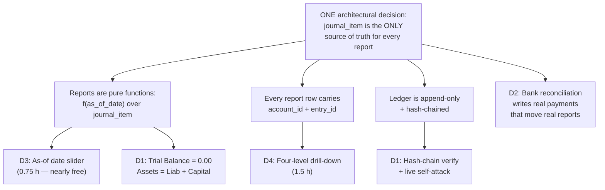

**Say this to a judge who asks how you built so much:** *"We didn't build four features. We made one decision — reports read only from journal items, never from invoices — and these came out of it. That's why a team that fakes the reports can't retrofit any of them."*

---

### 3. TOP 3 — We Build These, No Negotiation

#### D1 — The Books Integrity Page

> **Status: addition (beyond spec).** The mockup does not ask for this page. It earns its place because it is the single fastest way to prove every other number in the demo, and because the mockup *does* mandate "The Journal Entry should always be balanced" — this page is that requirement, made continuously verifiable.

##### What it is

One page, at `/integrity`, with a big **Run Full Audit** button. Pressing it runs four checks live against the database and prints the results with real numbers:

```
LEDGER AUDIT — run at 14:22:07, 2026-09-05

  1. ENTRY BALANCE          41 entries · 352 journal items
                            every entry: Σ debit = Σ credit        ✅ PASS
  2. TRIAL BALANCE          Σ all debits   ₹ 18,42,310.00
                            Σ all credits  ₹ 18,42,310.00
                            difference     ₹        0.00           ✅ PASS
  3. ACCOUNTING EQUATION    Assets              ₹ 8,42,310.00
                            Liabilities         ₹ 1,97,310.00
                            Capital             ₹ 4,26,600.00
                            + Current-Year Earnings ₹ 2,18,400.00
                            Liab + Capital      ₹ 8,42,310.00
                            difference          ₹        0.00      ✅ PASS
  4. HASH CHAIN             41 of 41 entries verified, genesis → #41
                            head 9f3c1a…7b02                       ✅ VALID
```

Three parts, all of which are real computation, none of which is a stored value:

1. **Per-entry balance check** — walk every posted journal entry, sum debits, sum credits, assert equal.
2. **Trial Balance and the accounting equation** — the whole-system totals, and the equation `Assets = Liabilities + Capital + (Income − Expenses)`.
3. **Hash-chain verification** — walk the append-only ledger and re-compute every hash.

##### Why an Odoo judge notices

Three reasons, in ascending order of force.

- **Line 3 is the pass/fail gate of this entire problem statement.** The mockup's Balance Sheet has a `Total Asset` and a `Total (Liabilities)` footer row. Roughly 90% of teams will ship a Balance Sheet where those two footers are different numbers, and will hope nobody adds it up. The judge *will* add it up. We add it up for them, on screen, before they ask.
- **Current-Year Earnings.** This is the give-away. The mockup's Balance Sheet draws only Bank, Cash, Debtors on the asset side and Capital, Creditors on the liability side. With just those rows, **it cannot balance** — because the profit you made this year is sitting in the Income and Expense accounts, which are on neither side. The only way to make the footers tie is to compute `Income − Expenses` for the fiscal year and inject it into the Capital side. A team that has never encountered this does not know why their sheet is off by exactly their profit. *(Addition, and a necessary one: the mockup's own "Total Asset = Total (Liabilities)" footer is unachievable without it.)*
- **The hash chain is elite-tier signalling.** Odoo ships exactly this — an inalterable, hash-chained ledger for fiscal compliance in France, Germany and elsewhere. A student team demonstrating that they know the concept exists tells an Odoo engineer, in five seconds, that we read past the surface of the problem.

##### How it is built — concretely

**Money is stored as integer paise (`BIGINT`), never as a float or a JS `number` doing decimal maths.** ₹47,200.00 is stored as `4720000`. This is non-negotiable and it is the reason the difference prints as exactly `0.00` and not `0.0000000001`. Floats will break the equality check and there is no recovering from it at hour 20.

Three checks, three SQL queries:

```sql
-- CHECK 1: every posted entry balances (should return zero rows)
SELECT je.id, je.number,
       SUM(ji.debit_paise)  AS dr,
       SUM(ji.credit_paise) AS cr
FROM journal_entry je
JOIN journal_item ji ON ji.entry_id = je.id
WHERE je.state = 'posted'
GROUP BY je.id, je.number
HAVING SUM(ji.debit_paise) <> SUM(ji.credit_paise);

-- CHECK 2 + 3: trial balance and the equation, in one pass
SELECT a.type,
       SUM(ji.debit_paise - ji.credit_paise) AS net_paise,
       SUM(ji.debit_paise)  AS dr_paise,
       SUM(ji.credit_paise) AS cr_paise
FROM journal_item ji
JOIN journal_entry je ON je.id  = ji.entry_id
JOIN account       a  ON a.id   = ji.account_id
WHERE je.state = 'posted'
GROUP BY a.type;
```

The equation is then assembled in `src/lib/integrity/audit.ts` from those account-type buckets. The mockup gives us the exact type taxonomy to bucket by — grouped dropdown `Balancesheet {Asset, Liability, Bank, Capital, Cash}` and `Profit and Loss {Income, Expenses, Other Expenses}`:

```ts
const assets      = net(['Asset', 'Bank', 'Cash']);              // debit-positive
const liabilities = -net(['Liability']);                          // credit-positive → flip
const capital     = -net(['Capital']);
const cye         = -net(['Income', 'Expenses', 'Other Expenses']); // current-year earnings
assert(assets === liabilities + capital + cye);   // exact integer equality, in paise
```

**The hash chain** — `src/lib/integrity/hash.ts`, about 40 lines:

```ts
export function entryHash(prevHash: string, e: PostedEntry): string {
  const canonical = JSON.stringify({
    seq:     e.chain_seq,
    number:  e.number,              // INV/2026/0008
    date:    e.date,                // '2026-09-02'
    journal: e.journal_code,        // 'SALES'
    lines: e.lines
      .map(l => [l.account_code, l.partner_id ?? null, l.debit_paise, l.credit_paise])
      .sort()                        // order-independent: sorting makes the hash stable
  });
  return sha256(prevHash + canonical);   // node:crypto, hex
}
```

`journal_entry` gains three columns: `chain_seq BIGINT` (gapless, allocated at POST time inside the same transaction), `prev_hash CHAR(64)`, `hash CHAR(64)`. Genesis entry uses `prev_hash = '0'.repeat(64)`.

**The database enforces the rules the app claims** — this is what makes the demo unfakeable. Two objects in the migration:

```sql
-- 1. An entry can never be committed unbalanced. DEFERRED so multi-line inserts work.
CREATE CONSTRAINT TRIGGER journal_entry_must_balance
  AFTER INSERT OR UPDATE ON journal_item
  DEFERRABLE INITIALLY DEFERRED
  FOR EACH ROW EXECUTE FUNCTION assert_entry_balances();

-- 2. A posted journal item is append-only. No UPDATE. No DELETE. Ever.
CREATE OR REPLACE FUNCTION forbid_posted_mutation() RETURNS trigger AS $$
BEGIN
  RAISE EXCEPTION 'journal_item_is_append_only: posted rows cannot be updated or deleted';
END $$ LANGUAGE plpgsql;

CREATE TRIGGER journal_item_append_only
  BEFORE UPDATE OR DELETE ON journal_item
  FOR EACH ROW WHEN (OLD.posted) EXECUTE FUNCTION forbid_posted_mutation();
```

**Files:** `src/lib/integrity/audit.ts`, `src/lib/integrity/hash.ts`, `src/app/integrity/page.tsx`, `src/app/api/integrity/audit/route.ts`, `src/app/api/integrity/verify-chain/route.ts`, `prisma/migrations/…_ledger_guards.sql`.

**A gotcha you must handle before the demo, or the self-attack fails on stage:** the `journal_item_append_only` trigger will block *your own* tampering command too. That is the correct behaviour, but it makes the demo look like a permissions error rather than a detection. The fix is to tamper as the database owner with triggers suppressed — and this actually makes the demo *stronger*, because you narrate it:

```sql
-- run in psql as the owner role, NOT as the app role
SET session_replication_role = replica;   -- suppress triggers
UPDATE journal_item SET debit_paise = 9999900 WHERE id = 217;
SET session_replication_role = origin;
```

##### Hours

| Task | Hours |
|---|---|
| Audit queries + equation assembly + `/api/integrity/audit` | 0.75 |
| Integrity page UI (mono font, PASS/FAIL chips, the printed numbers) | 0.5 |
| Hash chain: columns, compute-on-post, verify endpoint, break-report UI | 1.0 |
| DB triggers + rehearsing the self-attack and the restore | 0.25 |
| **Total** | **2.5** |

##### The 30-second demo moment

This is the **cold open**. Not the dashboard. Not a form. (Cross-reference the demo-script section for full ordering.)

> *"Before I show you anything, I want to show you that nothing here is fake."*
> **Click Run Full Audit.**
> *"352 journal items across 41 entries. Every entry balances. Trial Balance is zero point zero zero. Assets 8,42,310 equals Liabilities 1,97,310 plus Capital 4,26,600 plus current-year earnings 2,18,400. Every number in this demo comes out of one table — journal items. Nothing is summed off invoices."*
> **Switch to terminal, curl an unbalanced entry at the API.**
> ```
> $ curl -XPOST localhost:3000/api/journal-entries -d '{"lines":[
>     {"account":"1100","debit":500000},{"account":"3000","credit":400000}]}'
> 422 {"error":"journal_entry_must_balance","dr":500000,"cr":400000,"diff":100000}
> ```
> *"That rejection is a database constraint, not an if-statement in my API. The app literally cannot write an unbalanced entry."*
> **Then, at the end of the demo, the self-attack.** In psql, suppress triggers, corrupt row 217, re-run Verify Ledger:
> ```
> HASH CHAIN  ❌ BROKEN at chain_seq #217  (INV/2026/0006, 2026-08-14)
>             expected  9f3c1a4e…7b02
>             found     c81d0055…19af
>             41 entries checked, first divergence at #217, 24 entries after it invalidated
> ```
> *"In accounting you never delete anything — and you shouldn't be able to change it either. That's my own database, my own superuser, triggers switched off, and the books still caught me."*
> **Restore, re-verify, green.**

---

#### D2 — Bank Statement Import + Fuzzy Auto-Reconciliation

> **Status: addition (beyond spec).** The mockup gives us a manual Payment wizard with autofilled partner and amount, and computed Paid / Partial / Not Paid badges. This feature does not replace that wizard — it feeds it. It is the highest-value addition on the list.

##### What it is

Real businesses do not receive payments one at a time with a human clicking "Pay" on each invoice. They get a bank statement at the end of the day with 40 lines of cryptic narration, and someone has to work out which line paid which invoice. **That job is called reconciliation, and it is Odoo's flagship accounting feature.**

We upload a CSV that looks exactly like a real Indian bank export:

```csv
date,narration,ref,debit,credit
2026-09-02,"NEFT/N PATHAK/INV-2026-0008/HDFC0000123",N0245113,,47200.00
2026-09-02,"UPI CR 169927834 AZURE FURN",UPI169927,,12500.00
2026-09-03,"RTGS DR SHARMA TIMBER SUPPLY",R8890231,16992.00,
2026-09-03,"IMPS/P2A/NIMESH P/PART PAYMENT",I5510023,,10000.00
2026-09-04,"CHQ 445120 CLG",CTS445120,,8500.00
```

A scoring engine ranks every open invoice and bill against every statement line and emits a **confidence percentage with the reasons shown**:

| Statement line | Best match | Confidence | Why |
|---|---|---|---|
| NEFT/N PATHAK/INV-2026-0008 | INV/2026/0008 · ₹47,200 | **99%** | ref token exact · amount exact · partner 0.82 |
| UPI CR 169927834 AZURE FURN | INV/2026/0011 · ₹12,500 | **93%** | amount exact · partner "AZURE FURN"→"Azure Furniture" 0.71 |
| RTGS DR SHARMA TIMBER SUPPLY | BILL/2026/0004 · ₹16,992 | **91%** | amount exact · partner 0.68 · date −1d |
| IMPS/P2A/NIMESH P/PART PAYMENT | INV/2026/0009 · residual ₹6,992 | **61%** | partner 0.74 · amount partial · **needs review** |
| CHQ 445120 CLG | *(2 candidates)* | **44%** | amount only · **needs review** |

Auto-clears the high-confidence ones. Leaves the ambiguous ones with a ranked dropdown for one human click. Then **Reconcile All** posts real payments through the same posting engine the manual wizard uses — `Dr Bank / Cr Debtors` — invoice residuals drop, the Paid/Partial badges flip, Debtors on the Balance Sheet falls, and the aging report drains.

##### Why an Odoo judge notices

- It is the feature they work on. Reconciliation *is* the accounting module, from an Odoo engineer's point of view.
- It is a genuine ranking algorithm with a scoring function you can pull up the source for. It is not a CRUD screen.
- **Approximately zero hackathon teams will attempt it.** Most will not know the word.
- Critically: it cannot be faked. A fake system with a `paid: boolean` column cannot express "₹10,000 arrived against a ₹16,992 invoice, residual now ₹6,992." Partial reconciliation requires a proper `payment_allocation` join table — which the mockup's own Partial badge already demands, and which most teams will discover they need at hour 20 when it is too late to retrofit.

##### How it is built — concretely

**Schema** — one new table, one new join table:

```sql
CREATE TABLE bank_statement_line (
  id            SERIAL PRIMARY KEY,
  statement_id  INT NOT NULL REFERENCES bank_statement(id),
  txn_date      DATE NOT NULL,
  narration     TEXT NOT NULL,
  bank_ref      TEXT,
  amount_paise  BIGINT NOT NULL,          -- signed: + = money in, − = money out
  state         TEXT NOT NULL DEFAULT 'unmatched',  -- unmatched|suggested|reconciled
  payment_id    INT REFERENCES payment(id)
);

-- this table already exists as required scope; reconciliation writes into it
CREATE TABLE payment_allocation (
  payment_id    INT NOT NULL REFERENCES payment(id),
  document_id   INT NOT NULL,             -- invoice or bill
  document_type TEXT NOT NULL,
  amount_paise  BIGINT NOT NULL
);
```

**Residual is never stored.** It is derived:

```sql
CREATE VIEW invoice_residual AS
SELECT i.id,
       i.total_paise - COALESCE(SUM(pa.amount_paise), 0) AS residual_paise
FROM invoice i
LEFT JOIN payment_allocation pa
       ON pa.document_id = i.id AND pa.document_type = 'invoice'
GROUP BY i.id;
```

**The matcher** — `src/lib/reconcile/matcher.ts`. Four signals, weighted. This is the file you show the judge.

```ts
const W = { amount: 0.40, reference: 0.30, partner: 0.20, date: 0.10 };

function scoreAmount(line: bigint, residual: bigint): number {
  if (line === residual)                      return 1.00;   // exact to the paisa
  if (abs(line - residual) <= 100n)           return 0.90;   // within ₹1 (bank charges)
  if (abs(line - residual) <= residual / 100n) return 0.60;  // within 1%
  if (line < residual && line > 0n)           return 0.45;   // plausible part payment
  return 0;
}

// pull INV/2026/0008, INV-2026-0008, inv20260008 out of any narration
const DOC_RE = /\b(INV|BILL|PO|SO)[\/\-_ ]?(20\d{2})[\/\-_ ]?(\d{3,5})\b/i;
function scoreReference(narration: string, docNumber: string): number {
  const m = DOC_RE.exec(narration);
  if (!m) return 0;
  const norm = (s: string) => s.replace(/[^A-Z0-9]/gi, '').toUpperCase();
  if (norm(m[0]) === norm(docNumber))                 return 1.00;
  if (norm(docNumber).endsWith(m[3].padStart(4,'0'))) return 0.70;  // digits only
  return 0;
}

// Dice coefficient over character trigrams — ~25 lines, no dependency.
// "AZURE FURN" vs "Azure Furniture" → 0.71
function scorePartner(narration: string, partnerName: string): number {
  return diceTrigram(normalize(narration), normalize(partnerName));
}

function scoreDate(txnDate: Date, docDate: Date): number {
  const d = Math.abs(daysBetween(txnDate, docDate));
  return Math.max(0, 1 - Math.min(d, 30) / 30);
}
```

**The decision thresholds** — the part that makes it defensible rather than a toy:

```ts
const AUTO_THRESHOLD   = 0.90;   // auto-reconcile at or above this
const MARGIN_REQUIRED  = 0.15;   // ...only if the winner beats #2 by this much
const SUGGEST_FLOOR    = 0.55;   // below this, show as unmatched

if (top.score >= AUTO_THRESHOLD && (top.score - second.score) >= MARGIN_REQUIRED)
  → auto-reconcile
else if (top.score >= SUGGEST_FLOOR)
  → suggest, ranked, human picks
else
  → unmatched, offer "create as unallocated payment"
```

The `MARGIN_REQUIRED` rule matters. If two invoices are both ₹12,500 from the same customer, the score is high for both and the correct behaviour is **to refuse to guess**. Say that sentence out loud to a judge — it is the difference between a scoring function and a demo trick.

**Libraries:** `papaparse` for the CSV (handles quoted narrations containing commas). Trigram similarity hand-rolled — 25 lines, no dependency, and you can show it.

**Endpoints:** `POST /api/bank/import` (CSV → statement lines), `POST /api/bank/match` (returns ranked candidates + score breakdown, writes nothing), `POST /api/bank/reconcile` (creates `payment` rows through the *same* `postDocument()` service the manual wizard uses — one posting engine, no second code path).

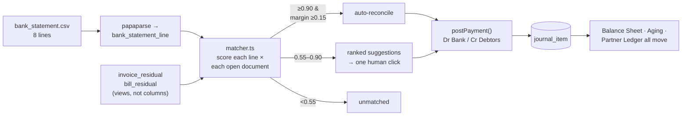

##### Hours

| Task | Hours |
|---|---|
| Schema + residual views + CSV parse + import screen | 0.75 |
| `matcher.ts` — four signals, trigram, thresholds | 1.0 |
| Reconciliation UI: rows, confidence bars, "why" chips, ranked dropdown | 0.75 |
| Reconcile All → posts through existing payment service; state transitions | 0.5 |
| **Total** | **3.0** |

##### The 45-second demo moment

Protect this. It is the loudest beat in the demo.

> *"Customers don't pay one invoice at a time. Here's this morning's bank statement."*
> **Drag in `bank_statement.csv`. The scoring runs on screen, row by row.**
> *"Six of eight matched automatically, between 91 and 99 percent confidence. Look at the reasons — this one matched on the reference token pulled out of the NEFT narration. This one had no reference at all, so it matched on exact amount plus a fuzzy name match: the bank wrote 'AZURE FURN', our customer is 'Azure Furniture', trigram similarity 0.71."*
> *"These two it refused to auto-clear. This one is a ten-thousand rupee IMPS against a sixteen-thousand rupee invoice — that's a partial payment, and I want a human to confirm it. And this cheque matches two different invoices for the same amount, so the top score doesn't beat the runner-up by enough. The system declines to guess. That threshold is in the code."*
> **Pick one manually. Hit Reconcile All.**
> *"Payments posted, invoices flipped to Paid and Partial, Debtors on the Balance Sheet just dropped by four lakh, and the 0–30 day aging bucket drained. Nothing was updated by hand — those are new journal items."*

---

#### D3 — The As-Of Date Slider on the Balance Sheet

> **Status: extension of spec.** The mockup requires a **Year selector (2026)** on both the Balance Sheet and the P&L. We keep that selector exactly as drawn, and add a date slider next to it. It is the same query with a finer-grained parameter.

##### What it is

A slider under the Balance Sheet running from the start of the fiscal year to today. Drag it backwards and **the entire Balance Sheet re-derives at that date and animates**: Debtors climbs as you go back before the payments landed, Bank falls, Capital holds flat, and the Total Asset / Total Liabilities footers stay tied to each other at every single position.

##### Why an Odoo judge notices

Because it is **structurally impossible** for a faked system.

A Balance Sheet is defined as: *the cumulative sum of every journal item from the beginning of time up to date T*. Not "this year's" — from inception. If your report is `SELECT SUM(total) FROM invoices WHERE year = 2026`, you have no way to answer "what did the books look like on 14 June?" — because a document's total is a single number with no time structure, an invoice half-paid in July still shows its full total in June, and a manual journal entry does not appear in the invoice table at all.

If your report is `SUM(debit − credit) FROM journal_item WHERE date <= T`, then **T is already a parameter and you get the time machine for free**. Which is exactly the point: this feature costs 45 minutes *if the architecture is right* and is unbuildable if it is not.

It is also the only genuinely cinematic thing this domain offers. Accounting has no kanban board, no map, no calendar. This is our one piece of motion, and it says something true.

##### How it is built — concretely

The report endpoint already takes the date. There is no separate "slider API".

```sql
-- GET /api/reports/balance-sheet?as_of=2026-06-14
SELECT a.id, a.name, a.type,
       SUM(ji.debit_paise - ji.credit_paise) AS balance_paise
FROM journal_item ji
JOIN journal_entry je ON je.id = ji.entry_id
JOIN account       a  ON a.id  = ji.account_id
WHERE je.state = 'posted'
  AND je.date <= $1::date          -- ← the whole feature
GROUP BY a.id, a.name, a.type;
```

Note there is **no start date**. A Balance Sheet is cumulative from inception. The P&L is the opposite — it takes a range and only Income/Expense-type accounts:

```sql
-- GET /api/reports/pnl?from=2026-04-01&to=2026-06-14
WHERE je.state = 'posted' AND je.date BETWEEN $1 AND $2
  AND a.type IN ('Income','Expenses','Other Expenses')
```

Two different aggregation semantics over the same table. Being able to *say that sentence* is worth as much as the feature.

**Making the drag smooth without lying about it.** Firing a query on every pixel of drag is 200 requests. The honest optimisation:

1. On page load, one query returns the **month-end grid** — the per-account running balance at each month end, using a window function:

```sql
SELECT account_id, month_end,
       SUM(delta) OVER (PARTITION BY account_id ORDER BY month_end) AS balance_paise
FROM (SELECT ji.account_id,
             (date_trunc('month', je.date) + INTERVAL '1 month - 1 day')::date AS month_end,
             SUM(ji.debit_paise - ji.credit_paise) AS delta
      FROM journal_item ji JOIN journal_entry je ON je.id = ji.entry_id
      WHERE je.state = 'posted' GROUP BY 1, 2) m;
```

2. While the user *drags*, the UI reads that grid — instant, 60fps, and still a genuine aggregation of journal items, just pre-computed for 12 dates.
3. When the user *releases*, we fire the real `?as_of=` query for the exact date and swap in the result.

Both paths produce the same number, and you should tell the judge exactly that — it is a better answer than pretending every frame is a round-trip.

**UI:** `<input type="range">` bound to a day index; numbers animated with a `requestAnimationFrame` count-up (roll digits from old value to new over ~250ms). No animation library needed. Reuse the same component on the P&L, where the slider moves the range end.

**Files:** `src/app/api/reports/balance-sheet/route.ts` (add `as_of` param), `src/app/api/reports/balance-sheet/grid/route.ts`, `src/components/AsOfSlider.tsx`, `src/components/RollingAmount.tsx`.

##### Hours

| Task | Hours |
|---|---|
| `as_of` param on the existing BS query (mostly already there) | 0.1 |
| Month-grid window query + endpoint | 0.25 |
| Slider component + rolling-number animation | 0.4 |
| **Total** | **0.75** |

##### The 20-second demo moment

Say almost nothing. Let it move.

> **Grab the slider. Drag from September back to April, slowly.**
> *"That's the same Balance Sheet at every date in the fiscal year. Debtors climbing as I go back before the payments landed. Bank dropping. Capital flat."*
> **Stop somewhere in June.**
> *"Nothing is cached and nothing is stored per-period. It's one aggregation over journal items where date is less than or equal to the fourteenth of June. And the footers still tie — assets still equal liabilities plus capital, at every position on that slider."*

---

### 4. Not Optional: D4 — Four-Level Drill-Down

I have separated this from the TOP 3 because it is not really a differentiator you *add*. It is a discipline you *apply while building the required reports*, and about 60% of it is mandated by the mockup already.

**What the mockup already requires:**
- Budget's **Achieved Amount** is a drill-down button: *"Clicking on the Achieved Amount Button open list view of all Invoices/Bills having same analytical for the budget period."*
- The **PO smart button** on a Vendor Bill, conditionally visible.
- The **Budget smart button** on a Bill/Invoice, opening the budget analytic report for that document's analytic.
- *"Open Form View on Click"* on both the Budget list and kanban.
- *"clicking on already saved record — it will open form view with saved details"* as a universal contract.

So the organisers have already told us: **cross-navigation is baseline**. We extend it to every number in the reports.

**The chain we build:**

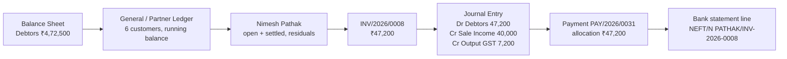

**Why it is cheap:** because the reports already query `journal_item`, every report row *already has* an `account_id` in hand. Making the row a link is `<Link href={'/ledger?account=' + id + '&as_of=' + asOf}>`. The Partner Ledger is one more grouped query over the same table. The marginal cost over the required scope is about 1.5 hours, and most of that is the running-balance column.

**Why a judge notices:** this is what accountants actually do all day — see a number they do not believe and click into it until they find the document. A judge who can chase a number down to the bank line and back stops evaluating a project and starts using a product. It also quietly answers "did you make these numbers up?" without you having to say a word: they made them up themselves, by following the trail.

**The 20-second demo moment:** *say nothing at all.* Click Debtors → ledger → partner → invoice → journal entry → payment → bank line, one click per second, then walk back up. Then: *"No dead ends anywhere. Every number in this application is a link to the journal items that produced it."*

**Hours: 1.5.**

---

### 5. Tier 2 — In Strict Priority Order If Hours Remain

#### D5 — "Explain This Entry" Rule-Trace Panel · 1.0 h (0.25 h if designed in early)

> **Status: addition.** Directly answers the mockup's own requirement that Purchase/Sales accounts be *"set by default"* — this panel shows *which* default, resolved from *which* configuration row.

**What it is.** A collapsible panel next to every auto-generated journal entry that explains, in plain English, why each line exists:

```
HOW THIS ENTRY WAS DERIVED — INV/2026/0008, posted 02-Sep-2026

  rule  sales_invoice_post
  ├─ Journal SALES → default_receivable = "Debtors A/c" (Asset)
  │     ⇒ Dr  Debtors A/c                             ₹ 47,200.00
  ├─ Line 1 · Office Chair × 5 @ ₹8,000
  │     Product → Category "Furniture" → income_account = "Sales Income A/c"
  │     ⇒ Cr  Sales Income A/c                        ₹ 40,000.00
  │     analytic: Project 1 (100%)
  ├─ Tax GST 18% (exclusive) → tax.collected_account = "Output GST A/c"
  │     ⇒ Cr  Output GST A/c                          ₹  7,200.00
  └─ rounding difference                              ₹      0.00
      Σ Dr 47,200.00   Σ Cr 47,200.00   balanced ✅
```

**Why a judge notices.** It pre-emptively kills the only real question they have left: *"did you hardcode this?"* You cannot produce this trace from an if-statement. Producing it proves the posting engine reads its accounts from configuration tables — which is exactly what makes changing the Sales Journal's default account work (§8, test 4). Nobody builds explainability into accounting.

**How it is built.** This is nearly free **if you design it in at hour one**. The posting engine is already resolving accounts; make it push a breadcrumb as it goes:

```ts
// src/lib/posting/engine.ts
trace.push({ step: 'journal_default', source: `Journal:${journal.code}.default_receivable`,
             resolved: account.name, side: 'debit', amount_paise: total });
```
Store as `journal_entry.posting_trace JSONB`. The panel is a renderer over that array. **Add the `trace.push` calls when you write the engine.** Bolting it on later means re-reading and re-instrumenting the engine — that is the difference between 15 minutes and an hour.

**Demo moment (20s):** *"Every posted entry carries the derivation that produced it. This account wasn't hardcoded — it was resolved from the Sales Journal's default receivable. This one came from the product's category. This one from the tax record. If you change any of those three configuration rows, the next invoice posts differently, and this trace will say so."*

---

#### D6 — Period Lock Date + True Reversal · 1.25 h

> **Status: addition, but it corrects a spec ambiguity.** The mockup gives Journal Entries a **"Reset to Draft"** button and Budgets a Cancel that *archives* rather than deletes — the organisers already lean toward non-destructive. We take it to the correct accounting behaviour.

**What it is.** Two genuine accounting controls:
1. **Lock date.** A company setting: `lock_date = 2026-03-31`. Any attempt to post an entry dated on or before it is blocked: *"Period locked on 31-Mar-2026 by Admin. Post to a later date or ask an administrator to move the lock."*
2. **True reversal.** A posted invoice has **no Edit button** — it does not exist in the DOM, and the API rejects the mutation regardless. Cancelling generates a **reversal entry**: same date-or-today, same accounts, debits and credits swapped, numbered `REV/INV/2026/0008`, linked both ways. Both entries stay in the ledger forever, and the reports self-correct because they sum both.

**Why a judge notices.** Every team's instinct is a Delete button. Deleting a posted entry silently rewrites financial history, which is the thing accounting exists to prevent. And "lock date" is one of those phrases — an Odoo engineer's ears physically prick up when a student team uses it correctly, because it means you read past the surface.

**How it is built.**
```ts
// src/lib/posting/guards.ts
if (entry.date <= company.lock_date && !user.canOverrideLock)
  throw new PostingError('period_locked',
    `Period locked on ${fmt(company.lock_date)} by ${company.lock_set_by}`);
```
Reversal is ~30 lines: read the source entry's items, emit a new entry with `debit_paise` and `credit_paise` swapped, set `reversal_of_id` / `reversed_by_id`, post it through the same engine so the hash chain extends normally.

**Demo moment (35s):** *"Try to edit this posted invoice — there's no Edit button, and the API refuses too. To undo it, I cancel it, and the system writes a reversal: same accounts, debits and credits mirrored. Both entries are in the ledger. The Balance Sheet corrected itself and nothing was erased. Now watch this — lock date, thirty-first of March. Post something dated the twentieth of March."* **Blocked.** *"In accounting, you never delete anything."*

---

#### D7 — Overpayment Credits + Receivables Aging · 1.5 h

> **Status: partial spec, partial addition.** The mockup *requires* the Partial badge and `Amount Due = Total − Amount Paid`. Overpayment credits and the aging report are additions.

**What it is.** Three things a naive schema cannot express:
1. **One payment across many invoices.** ₹10,000 received, allocated by hand across three invoices totalling ₹14,200 in an allocation grid. All three go to **Partial** with live residuals.
2. **Overpayment becomes a credit.** Customer sends ₹5,000 more than they owed → the excess posts to an **unallocated customer credit** (`Cr Debtors` with no allocation) and is offered as a payment source on their next invoice.
3. **Aging buckets.** Current / 1–30 / 31–60 / 61–90 / 90+, computed off `due_date` — a field the mockup explicitly requires on both Invoice and Bill and that most teams will add and never use.

```sql
SELECT p.name,
  SUM(CASE WHEN due_date >= CURRENT_DATE THEN residual_paise ELSE 0 END) AS current_,
  SUM(CASE WHEN CURRENT_DATE - due_date BETWEEN 1  AND 30 THEN residual_paise ELSE 0 END) AS d1_30,
  SUM(CASE WHEN CURRENT_DATE - due_date BETWEEN 31 AND 60 THEN residual_paise ELSE 0 END) AS d31_60,
  SUM(CASE WHEN CURRENT_DATE - due_date BETWEEN 61 AND 90 THEN residual_paise ELSE 0 END) AS d61_90,
  SUM(CASE WHEN CURRENT_DATE - due_date > 90 THEN residual_paise ELSE 0 END) AS d90p
FROM invoice_residual r JOIN invoice i ON i.id = r.id JOIN contact p ON p.id = i.partner_id
WHERE r.residual_paise > 0 GROUP BY p.name;
```

**Why a judge notices.** Every team ships pay-in-full-only. Partial payment is the single most common real-world case, and it is *invisible* in a naive schema — you cannot retrofit it onto a `paid: boolean`. The aging report also visibly reacts to D2's reconciliation, which chains the two beats together.

**Demo moment (25s):** *"₹10,000 has come in against three invoices worth ₹14,200. I allocate it across them — all three go Partial, with real residuals. Now the customer overpays by ₹5,000: the system doesn't just swallow it, it creates an unallocated credit against Nimesh Pathak and offers it on his next invoice. And here's the aging: everything over 90 days in red, and it just moved a bucket because we reconciled."*

---

#### D8 — Budget Pacing + a Real Commitment Column · 1.0 h

> **⚠️ Careful — naming collision with the spec.** The mockup uses **"Committed Amount"** to mean *the planned/budgeted amount* (₹200,000), and **"Achieved Amount"** for actuals. That is not the standard accounting meaning of "committed", but **it is the organisers' meaning, and we do not rename their column.** We keep `Analytic | Type | Committed Amount | Achieved Amount | Achieved % | Amount To Achieve` exactly as drawn, with their exact formulas — `Achieved % = (Achieved / Committed) × 100`, `Amount To Achieve = Committed − Achieved`. Everything below is an *additional* column and an *additional* panel.

**What we add:**
- A **Pipeline** column: the value of confirmed Purchase Orders on that analytic account that have *not yet been billed*. This is money you have promised to spend but has not hit the books. Reuses PO data we already have.
- **Pacing:** "68% of the period elapsed vs 81% of budget consumed" with a red/amber/green light and a straight-line year-end projection at the current burn rate.
- The mockup's **non-blocking** over-budget warning stays exactly non-blocking — *"Consider adjusting the value or revise the budget"* — because the organisers were explicit about that, twice (on PO confirm and on Bill confirm).

**Also, one honest architectural note worth saying out loud.** The mockup specifies Achieved Amount as *"Search Analytical in Sales Invoice / Vendor Bills … compute total."* We compute it from **journal items tagged with the analytic account**, which produces the same number for the specified cases but also correctly picks up manual journal entries tagged to that project. Tell the judge: *"the spec says search the invoices; we sum the journal items instead, so a manual adjustment to a project also shows up. Same number on your test case, more correct in general."* That is a "we understood you and went one better," not a deviation.

**Demo moment (20s):** *"Planned ₹2,00,000. Achieved ₹1,62,000 — that's posted journal items, not invoice headers. ₹24,000 more is in the pipeline as a confirmed PO we haven't been billed for yet. 68% of the period has elapsed and we've consumed 81%, so it's amber, and at this burn rate we finish ₹38,000 over. And confirming an over-budget PO warns but doesn't block — that's what the spec asked for."*

---

#### D9 / D10 — The Bench

**Derived stock ledger + moving-average COGS (2.5 h).** The PDF Overview says *"financial **and stock** reports"* — one clause nearly every team will skip entirely. Qty-on-hand as a movement ledger (PO receipt +20, delivery −5, never a mutable counter), moving-average cost, auto `Dr COGS / Cr Inventory` on delivery so gross margin is real. **Genuinely valuable, genuinely 2.5 hours.** Build only if you are ahead of schedule at T-8. If you skip it, still say the sentence: *"the overview mentions stock reports; we scoped that as the next thing on the roadmap and here's the movement-ledger design"* — knowing you skipped it deliberately beats not having read it.

**Accountant keyboard mode (2.0 h).** Tab through the debit/credit grid; `=` auto-fills the last line to make the entry balance; Ctrl+Enter posts; `/` jumps to fuzzy account search. Post a four-line manual entry in 12 seconds without touching the mouse. Reads as "this team watched a real accountant work." It is the one UX differentiator a judge *feels* rather than observes — but it is two hours and it is the only Kind-A-adjacent item on the list. **Bench it.** *(If you build any of it, build only the `=` key — that alone is 20 minutes and it is the impressive half.)*

---

### 6. Where AI Actually Earns Its Place

You have API keys and you want AI to make the product better, not to be a gimmick. Accounting gives you an unusually clean rule for this:

> **No number in this system is ever produced by a language model. AI is allowed to *rank*, to *extract*, and to *explain*. It is never allowed to *calculate*.**

That sentence is itself a differentiator — say it to the judge. Every other team's "AI feature" is a chatbot that hallucinates revenue figures. Ours is architecturally forbidden from doing that.

Three placements that pass the rule:

| Use | Where | Why it is safe | Hours |
|---|---|---|---|
| **Narration parsing fallback** in D2 | `matcher.ts`, only when regex + trigram both score < 0.55 | The model returns a *candidate partner ID and a suggested doc number* which then goes through the **same deterministic scorer**. The score, and therefore the decision, is still arithmetic. | 0.5 |
| **Plain-English trace prose** in D5 | Renders the `posting_trace` JSON into a sentence | The JSON is generated by the engine. The model only rewords it. If the API is down, the raw trace still renders. | 0.25 |
| **Seed-data generation** (offline, before the event) | A Python script that invents 40 realistic Indian furniture transactions and realistic bank narrations | Runs before the clock. Output is fed through the real API, so the model's output is validated by the balance constraint. | 0.5, pre-event |

**Explicitly rejected:** a chatbot answering "what was my revenue last quarter". It is the obvious idea, several teams will build it, and it is the exact thing an accounting judge distrusts. If you want the capability, build it as **natural language → a filter on the existing report query**, so the model chooses `from` and `to` and the database computes the number. Only if you are ahead at T-6.

---

### 7. How the Judge Will Try to Catch Us Faking — and What We Show Instead

Assume the judge is an Odoo engineer who has already seen four fake submissions today and has a routine. Here is the routine, and our answer to each item. **Rehearse all ten. Each should take under 20 seconds to answer.**

#### Test 1 — "Post a manual journal entry: Dr Cash ₹5,00,000 / Cr Capital ₹5,00,000. Now show me the Balance Sheet."

**Why they ask:** this is the killer. A faked system computes Cash from the payments table and Capital from nothing at all. A manual journal entry touches neither table, so **the Balance Sheet does not move**. Twenty seconds, verdict delivered.

**Our answer:** hand them the keyboard. The mockup already requires this exact screen — Accounting Date, Journal, and a grid of Account | Partner | Debit | Credit with a **blocking** warning if they do not match. Post it. Switch to the Balance Sheet: Cash +5,00,000, Capital +5,00,000, footers still tied. *"Every report reads journal items. It doesn't matter whether the entry came from an invoice, a bill, a payment or from you typing it in — it's the same table."*

#### Test 2 — "Add up your Balance Sheet. Do assets equal liabilities plus capital?"

**Why they ask:** ~90% of submissions fail this, usually off by exactly the year's profit.

**Our answer:** the Integrity page prints the sum for them, to the paisa, including the **Current-Year Earnings** line. Then the extra move that wins the point: *"And here's why it ties — this ₹2,18,400 is the Net Income at the bottom of the P&L, and the same figure appears inside Capital on the Balance Sheet. Income and expense accounts don't sit on either side of the sheet, so if you don't roll the year's profit into equity, you're out by exactly your profit. That's the number most teams are missing."*

#### Test 3 — "Pay half of this invoice."

**Why they ask:** it exposes a `paid: boolean` column instantly. A faked system either has no partial state, or has a text field someone types "Partial" into.

**Our answer:** register ₹20,000 against a ₹47,200 invoice. Badge flips to **Partial** (the mockup's own computed rule: *Partial — if amount due < total*). Residual shows ₹27,200 — and it is a **view**, not a column:
> *"Residual isn't stored anywhere. It's the invoice total minus the sum of its payment allocations, computed on read. That's why it can never drift out of sync, and it's why one payment can cover three invoices."*
Then the follow-up they will not expect: Debtors on the Balance Sheet dropped by exactly ₹20,000, and the aging bucket moved.

#### Test 4 — "Change the Sales Journal's default income account, then post a new invoice."

**Why they ask:** it separates a config-driven posting engine from a wall of if-statements. This is the deepest test on the list.

**Our answer:** open Journals (the mockup's own master, seeded with Sales / Purchase / Bank / Cash each with a Default Account), change Sales from `Sales Income A/c` to a new `Export Sales A/c`. Post a fresh invoice. It credits Export Sales. Open the **Explain panel** (D5): the trace literally names `Journal:SALES.default_income → Export Sales A/c`.

**Then the move that separates us from everyone:** open an *old* invoice.
> *"Notice the old invoice still credits Sales Income. Changing configuration doesn't rewrite history — journal items store the account that was resolved at the moment of posting, not a live lookup. If it did rewrite history, last quarter's P&L would change every time somebody edits a dropdown."*

That paragraph is worth more than any screen in the app.

#### Test 5 — "Delete this posted journal entry."

**Our answer:** there is no Delete button and no Edit button on a posted document. The API returns `403 posted_entries_are_immutable`. And the database returns `journal_item_is_append_only` even to the app's own role. Offer the reversal instead (D6).

#### Test 6 — "Send an unbalanced entry straight to the API and skip your UI validation."

**Our answer:** the curl from the D1 cold open. `422`, and the error names the **database constraint** `journal_entry_must_balance`, not a JavaScript check. *"The validation isn't in my form, and it isn't in my API. It's in the schema."*

#### Test 7 — "Where exactly does this ₹7,200 of tax come from?"

**Our answer:** the Explain panel (D5). Tax master → rate 18%, exclusive, `collected_account = Output GST A/c` → `Cr 7,200`. Then: *"and if I change that tax to inclusive, the same ₹47,200 invoice posts ₹40,000 / ₹7,200 differently — ₹7,200 becomes the tax inside the ₹47,200, so income drops to ₹40,000 minus the difference. The engine reads the flag."*

#### Test 8 — "Show me the Balance Sheet as of 30 June."

**Our answer:** the slider (D3). Then the honest technical footnote about the month-grid vs the exact re-query, because volunteering the implementation detail is what a senior engineer does and judges notice it.

#### Test 9 — "Your tax has a rounding problem. Three lines at ₹333.33 of tax each."

**Why they ask:** because `sum(round(line_tax)) ≠ round(sum(line_tax))` is real, it puts your journal entry off by ₹0.01, and ₹0.01 violates the balance constraint — which means a naive system either crashes or silently drops the constraint.

**Our answer:** integer paise everywhere, plus an explicit largest-remainder allocation so the line taxes always sum to the document tax. If a residual paisa still exists, the engine emits a **Rounding Difference** line to a dedicated account and the Explain panel shows it as `rounding difference ₹0.01`. *"We'd rather have a visible one-paisa line than an invisible imbalance."*

#### Test 10 — "Is your seed data hand-crafted so it happens to balance?"

**Why they ask:** the fourth-most-common fake is a SQL dump with totals that tie by luck.

**Our answer — and this is worth building for on purpose:**
> *"Our seed script doesn't insert a single row of accounting data. It calls the same REST endpoints you would — POST /api/purchase-orders, POST /api/vendor-bills, POST /api/payments — 40 documents in sequence. Every journal item in this database was produced by the posting engine and passed the balance constraint on the way in. If the engine were wrong, seeding would have crashed."*

Make this true. `scripts/seed.ts` drives the public API over HTTP. It costs nothing extra — you have to create the data somehow — and it converts your seed data from a liability into a proof.

#### The one-line summary to have ready

If a judge asks the open question *"why should I believe your numbers?"*, this is the answer:

> *"Because I never store one. Every figure in this application is an aggregation over a single append-only table of journal items, computed at the moment you look at it. There's no cached balance, no `paid` flag, no `total_revenue` column. If you can break the arithmetic, the Integrity page will tell you before I do."*

---

### 8. What We Deliberately Do Not Build

Saying "we chose not to" is stronger than not having thought about it. Have a reason ready for each.

| Not building | Why |
|---|---|
| Chatbot / AI assistant | Every team has one. It produces numbers no auditor can trace. Directly contradicts our central claim. |
| Dark mode, theme switcher, animated landing page | Kind A. Zero evidential value. A faker ships them too. |
| Extra charts beyond the mockup's required per-row pie | The mockup asks for one pie chart in the Budget list. A dashboard of bar charts is decoration and eats reconciliation hours. |
| Multi-currency + FX revaluation | Genuinely hard, genuinely correct, and a guaranteed rabbit hole. Name it as roadmap: *"multi-currency with FX revaluation at period end is next."* |
| GSTR-1 / GSTR-3B export, e-invoice IRN | Same. Name it as roadmap — naming it proves we know the Indian compliance landscape without spending an hour on it. |
| Fiscal-year close wizard | Roadmap. One sentence in the closing slide. |
| Full portal payment gateway | The mockup requires a portal user who *"can directly pay his dues from portal"* — we build the portal view and a payment that posts internally. No Razorpay integration. Cut without guilt if hours run short; it is the last thing standing between us and a broken demo. |

**Say the roadmap out loud in the closing ten seconds.** *"Next: GSTR-1 and 3B export, e-invoice IRN generation, multi-currency with year-end FX revaluation, and an automated fiscal close."* Four phrases, ten seconds, and it tells an Odoo engineer we know what the next six months of this product look like.

---

### 9. The Vocabulary Checklist

Fatigue is the real enemy — an Odoo judge has looked at debit/credit grids professionally for years. Three things break through, in order: **vocabulary**, **motion**, **subversion**. Motion is D3. Subversion is D1's self-attack. Vocabulary is free and you must not waste it.

Use each of these words at least once, correctly, during the demo. Tick them off in rehearsal:

- [ ] **residual** (not "amount pending")
- [ ] **reconciliation** / **unreconcile**
- [ ] **reversal entry** (not "cancel" or "delete")
- [ ] **lock date**
- [ ] **analytic distribution** (when pointing at the mockup's Budget Analytics column)
- [ ] **current-year earnings** and **retained earnings**
- [ ] **trial balance**
- [ ] **append-only** / **inalterable ledger**
- [ ] **exclusive vs inclusive tax**
- [ ] **aging bucket**
- [ ] **posting engine** (not "the thing that makes journal entries")

And one anti-checklist item: **do not open the demo with a tour of master data screens.** Contacts and Products forms are the four most boring minutes available at this hackathon, and every other team will spend them.

---

### 10. Cut Rules and the Freeze

The failure mode to fear is *not* running out of time on features. It is rabbit-holing on ledger edge cases while the demo goes unrehearsed. The demo is the scoring surface.

**Hard rules:**

1. **Freeze all features at T−6 hours.** No exceptions, no "it's only twenty minutes." Spend the last 3 hours rehearsing the 5 minutes.
2. **Build order within this section:** D5's `trace.push` calls go in *while writing the posting engine* (hour 3–5, not later) → D1 → D4 → D2 → D3 → D6 → D7 → D8.
3. **Cut order if you are behind**, strictly bottom-up: D10 → D9 → D8 → D7 → D6 → D5. 
4. **Never cut**, under any circumstance: **the Integrity cold open (D1), the bank reconciliation (D2), the as-of slider (D3), and the reversal (D6's second half).** If you are so far behind that these are threatened, cut *required screens* instead — the portal, the kanban views, the PDF print — because a judge forgives a missing kanban view and does not forgive a Balance Sheet that does not balance.
5. **The 15-minute rule during the build.** If any single differentiator has consumed 150% of its estimate above, stop and ship what works. D2 degrades gracefully: exact-amount + reference matching alone is still 80% of the impact and it is the first hour of the three.

**The scoring expectation, honestly stated:** complete-to-spec alone is roughly top 15%. Complete, plus the Integrity cold open, plus drill-down, plus bank reconciliation, plus the date slider, is top 3 of this track. And the tamper-detection self-attack is the thing one judge repeats to another judge afterwards — which is the only form of scoring you cannot earn by building faster.

---


<a id="where-ai-genuinely-makes-this-better"></a>

# Where AI Genuinely Makes This Better

> **Read this first.** Nothing in this section is in the problem statement PDF or the organizers' mockup. Every feature here is an **addition**. That is exactly why it has to be defended harder than anything else in the build. An AI feature that does not earn its place does not sit at zero — it sits at *negative*, because it eats hours you needed for the ledger and it tells an Odoo judge you did not know what the hard part was.

Before anything else, four accounting words you will need in this section, in plain English:

| Word | What it means here |
| --- | --- |
| **Ledger** | The one table where all money movement lives: `journal_item`. Every report in the app is a sum over this table. |
| **Journal entry** | One balanced record made of two or more ledger lines. Money always comes *from* somewhere and goes *to* somewhere, so the two sides must be equal. |
| **Debit / Credit** | The two sides of a journal entry. Total debits must equal total credits, to the paisa, or the entry is invalid. |
| **Draft vs Posted** | A **draft** document is a piece of paper — it touches nothing. A **posted** document has hit the ledger and can never be edited or deleted, only reversed. |
| **Reconciliation** | Matching a payment that arrived in your bank account to the invoice it was paying. |
| **Analytic account** | The mockup calls this "Budget Analytics". It is a project tag — "Project 1", "Showroom-West" — that you stick on a line so you can later ask "how much did Project 1 cost me?" |

---

### 1. The filter: three tests, and one rule that overrides all of them

An AI feature earns a place in this build **only if it passes all three tests**:

1. **The hard-without-AI test.** The problem must be genuinely hard to solve with ordinary code. Fuzzy human-written text, a photo of a piece of paper, an English sentence. If a `switch` statement or a `GROUP BY` solves it, a `switch` statement should solve it — it is faster, free, and correct every time.
2. **The verifiable-result test.** The user must be able to check the answer in a few seconds against something the system already knows for certain. "Is this the right invoice?" — checkable. "Is my business healthy?" — not checkable, therefore not shippable.
3. **The safe-degradation test.** When the model is wrong, slow, rate-limited, or the conference wifi dies at 2 p.m. on demo day, the app must still work. Losing the AI must cost the user *typing*, never *function*.

And one rule that sits above all three and is non-negotiable in this problem:

> ### **AI never writes to the ledger.**
> AI produces a **proposal**. A human **accepts** it. The deterministic posting engine — the same one that handles a hand-typed invoice — does the **posting**. There is no code path in which a model's output becomes a debit or a credit without a human keystroke in between.

This is not caution for its own sake. It is *correct accounting* — in a real book of accounts every entry must be attributable to a person who authorised it, which is why "posted by" is a field and "posted by GPT" is not a thing an auditor accepts. And it is also the single most useful sentence you can say to a judge, because it is the opposite of what they will have heard nine times already that day.

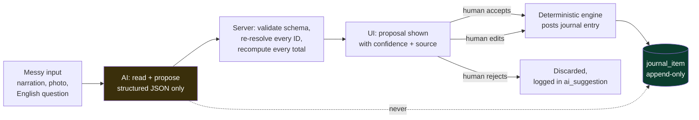

#### 1.1 Ideas that fail the filter — reject these out loud

Naming what you refused is a differentiator. Most teams cannot tell you why they *didn't* build something.

| Rejected idea | Which test it fails | Why it is actually dangerous here |
| --- | --- | --- |
| **A floating "Ask our accounting assistant" chat bubble** | 2 and 3 | Unverifiable free text over financial data. A judge who has already seen five of these will assume the rest of your app is equally superficial. It converts your strongest asset — a real double-entry engine — into "another team that bolted a chatbot on". |
| **Letting the model pick the debit and credit accounts for a journal entry** | 1, 2, and the overriding rule | This is the most tempting bad idea in this entire problem statement, and it is fatal. Choosing accounts is a *deterministic function of configuration* — Journal default account, product category, contact type. It is literally the one hard engine the whole submission is judged on. Hand it to a model and (a) you have deleted your own centrepiece, (b) the same invoice can post two different ways on two different days, and (c) the moment a judge sees a model choosing debits, **every number in your app becomes untrusted**. Nothing you show afterwards recovers. |
| **"Generate a summary of my financial performance"** with the model reading the raw tables | 2 | The model will invent a rupee figure. One invented figure on a Balance Sheet is a total loss of credibility. (The *safe* version of this idea is feature **AI-4** below, where the numbers are computed first and the model is only allowed to write the sentence around them.) |
| **Text-to-SQL over the ledger** | 2 and 3 | Two separate failures. First, injection and destructive statements. Second and worse: a model asked for "total income" will very plausibly write `SELECT SUM(total) FROM customer_invoice` — which is *precisely the fake* that 70–80% of teams will ship and that the judge is hunting for. You would have automated your own failure mode. The safe version is **AI-2** below. |
| **"AI fraud detection"** over the seed data | 1 and 2 | You will have roughly 40 documents. A z-score over n=8 is not statistics, it is decoration. Any judge who asks "what's the sample size?" ends the conversation. |
| **Cash-flow forecasting** | 2 | Two quarters of seed data, no ground truth, and no way to check the prediction inside a five-minute demo. |
| **Voice input for invoices** | 1 and 3 | A hackathon hall is loud, the mic permission dialog will fire on the projector, and nothing about it is an accounting problem. Pure gimmick. |
| **AI-written product descriptions / auto-categorising products** | 1 | Real, but not an *accounting* problem. Costs you an hour and earns nothing on this rubric. |

**What to say when a judge asks "why didn't you add a chatbot?"**

> "We had a rule: AI only where the input is genuinely messy and the output is checkable in two seconds. A chatbot over accounting data fails the second half — you can't verify a paragraph. So we used the model in four places where it reads something messy and *proposes* something a human can confirm with one click, and nowhere else. In particular the model never picks a debit or a credit. That's a table-driven rule engine, and it has to be, or the books aren't reproducible."

---

### 2. The five features that pass

Read them in priority order. **Section 2.6 gives the build order and the hard gate** — do not start any of these until the ledger spine is green.

---

#### AI-1 — Bank narration understanding (a *fallback ranker* inside the reconciliation engine)

**Build cost: ~70 minutes, on top of the deterministic matcher you are building anyway.**

##### The real problem

Urban Furniture's bank sends a statement. The customer paid, but the bank line does not say "INV/2026/0007 from Nimesh Pathak". It says things like this — these are the shapes real Indian bank narrations actually take:

```
NEFT/N PATHAK/INV-2026-0007
UPI/CR/16992/AZURE FURN/PAYMENT
IMPS-P2A-509212874-RAHUL SHARMA-BILL PAYMENT
NEFT CR-HDFC0000123-URBAN FURNITURE PVT LTD-NPATHAK-ABC 26 001
CHQ 004512 CLG
BY CASH DEP CDM 4471
RTGS UTIB0000456 AZUREFURNITUREPVTL 6000
```

Line 1 is easy — the reference is right there. Line 4 mangles the free-text `invoice_reference` (`ABC-26-001`, which the mockup mandates as a separate field from the auto-generated invoice number) into `ABC 26 001`. Line 3 hides the partner in the middle of an IMPS envelope. Line 5 and 6 have no partner and no reference at all — only an amount and a date. Regex handles the first; nothing but reading handles the fourth.

##### Deterministic first — and this ordering *is* the feature

The matcher is a scoring function over open (unpaid) invoices and bills. **Four of its five signals are pure functions with no model involved:**

| Stage | Signal | How | Weight |
| --- | --- | --- | --- |
| A | `ref_exact` | Regex for `INV/\d{4}/\d{4}`, `BILL/\d{4}/\d{4}`, `PO\d{4}`, plus a normalised match against `invoice_reference` (strip everything non-alphanumeric, uppercase, compare) | 50 |
| B | `amount_exact` | Narration amount == invoice **residual** (amount still unpaid) to the paisa | 30 |
| C | `amount_tolerance` | Within ±₹1 (bank rounding) or ±2% | 12 |
| D | `partner_similarity` | Trigram / Jaro-Winkler over narration tokens vs every contact name, plus a squashed-name pass (`AZUREFURNITUREPVTL` vs `Azure Furniture`) | 0–20 |
| E | `date_proximity` | `max(0, 10 - days_between(statement_date, invoice_date)/3)` | 0–10 |

Rows scoring ≥ 85 auto-clear. Rows scoring 45–85 are shown with ranked suggestions. Below 45 → unmatched.

**AI is stage F, and it only runs on the leftovers.** For rows that came out of A–E below the auto-clear threshold, one batched call reads the narrations and returns a *reading* — not a match:

```ts
// lib/ai/narration.ts
const NarrationReading = z.object({
  line_index: z.number(),
  partner_guess: z.string().nullable(),      // a NAME string, never an id
  reference_guess: z.string().nullable(),
  direction: z.enum(["credit", "debit", "unknown"]),
  instrument: z.enum(["NEFT", "RTGS", "IMPS", "UPI", "CHEQUE", "CASH", "OTHER"]),
  confidence: z.number().min(0).max(1),
});

const res = await client.messages.parse({
  model: "claude-opus-5",
  max_tokens: 2000,
  output_config: {
    effort: "low",                                    // extraction, not reasoning
    format: zodOutputFormat(z.object({ readings: z.array(NarrationReading) })),
  },
  system:
    "You read Indian bank statement narrations. You extract who the counterparty is " +
    "and any document reference. You NEVER decide which invoice a payment belongs to. " +
    "If a field is not present in the text, return null. Do not guess a partner that " +
    "is not in the supplied list.",
  messages: [{ role: "user", content: JSON.stringify({
      narrations: unmatched.map((r, i) => ({ line_index: i, text: r.narration })),
      known_partners: contacts.map(c => c.name),        // ~12 names
      reference_formats: ["INV/2026/0001", "BILL/2026/0001", "ABC-26-001"],
  })}],
});
```

Then — and this is the part to point at — **the reading is fed back into the same deterministic scorer as extra tokens.** `partner_guess` re-runs stage D. `reference_guess` re-runs stage A at a reduced weight (35 instead of 50, because it is inferred rather than literal). The model's output is *normalised into the existing algorithm*. It cannot bypass it, and it cannot override a match the deterministic stages were already certain about.

##### Why deterministic-first is the right design (say this to a judge)

- **Most rows never touch the model.** On a realistic 10-line statement, 6–7 clear on stages A–E alone: zero latency, zero cost, zero variance.
- **The model can never overturn certainty.** A row with an exact reference and an exact amount is already at 80 before stage F runs. Nothing the model says moves it.
- **Reproducibility.** Accounting demands that the same statement produce the same result twice. The deterministic core guarantees that for the majority of rows; the AI-assisted tail is logged with its input hash so you can always show what it saw.
- **It fails to a smaller feature, not a broken one.** Turn AI off and you lose the tail of hard rows. You do not lose reconciliation.

##### How the user verifies and corrects

Every statement row shows a **chip row** of the signals that produced its score — this is the whole UI trick:

```
₹47,200  NEFT/N PATHAK/INV-2026-0007      [ref exact] [amt ±0] [name 0.91]           → INV/2026/0007  99%  ✓auto
₹16,992  RTGS UTIB0000456 AZUREFURNIT...  [amt ±0] [name 0.74] [AI: Azure Furniture] → BILL/2026/0003 78%  [Accept] [Pick another]
₹ 6,000  CHQ 004512 CLG                   [amt ±0] [date 8d]                          → 3 candidates      41%  [Choose…]
```

The AI chip is rendered in a **different colour from the deterministic chips**, and there is a legend. One sentence to the judge, while pointing:

> "The blue chips are computed — regex, exact amount, string similarity. The grey chip is the only thing the model touched, and all it did was read a name out of the narration. It then went back through the same scorer as every other signal. Watch —" *(toggle AI off)* — "the six blue rows are identical. We lose two of the hard ones."

##### Offline fallback

`AI_MODE=off` → stage F is skipped entirely, thresholds unchanged, chip row shows deterministic signals only. `AI_MODE=replay` → served from the fixture cache (section 3.2). Both are one env var.

##### Cost and latency

| | |
| --- | --- |
| Tokens per 10-line statement | ~1,200 in / ~600 out (one batched call, not ten) |
| Cost | 1,200 × $5/1M + 600 × $25/1M = **$0.021 ≈ ₹1.85** |
| Latency, live | 3–6 s — run inside the existing "Analyze statement" spinner, and only over the unmatched rows so the auto-matched ones paint immediately |
| Latency, replay | < 100 ms |

---

#### AI-2 — Natural-language query over the ledger, via a whitelisted query builder

**Build cost: ~75 minutes.**

##### The real problem

An accountant's actual questions do not map onto the menu. "How much does Nimesh owe me right now?" requires opening Partner Ledger, filtering to one contact, and reading a running balance. "Show me expenses above ₹50,000 last quarter" requires a filtered journal-item search that the mockup does not draw a screen for. And a judge *will* walk up and type something into a search box to see what happens.

##### How it works — the whitelisted-query-builder pattern

**The model does not write SQL. The model does not see SQL. The model fills in one of seven typed forms.**

You define the seven report intents your app already knows how to render. The model's only job is to choose one and fill its parameters, using a strict tool schema:

```ts
// lib/ai/queryIntent.ts — the model's ENTIRE output surface
const Intent = z.discriminatedUnion("intent", [
  z.object({ intent: z.literal("partner_balance"),
             partner_name: z.string(), as_of: z.string().nullable() }),
  z.object({ intent: z.literal("account_ledger"),
             account_type: z.enum(["asset","liability","bank","capital","cash",
                                   "income","expense","other_expense"]),
             date_from: z.string().nullable(), date_to: z.string().nullable() }),
  z.object({ intent: z.literal("pnl_period"),
             date_from: z.string(), date_to: z.string() }),
  z.object({ intent: z.literal("balance_sheet_asof"),
             as_of: z.string() }),
  z.object({ intent: z.literal("budget_variance"),
             analytic_name: z.string().nullable(), budget_name: z.string().nullable() }),
  z.object({ intent: z.literal("document_search"),
             doc_type: z.enum(["invoice","bill","payment","journal_entry","po","so"]),
             partner_name: z.string().nullable(),
             min_amount: z.number().nullable(), max_amount: z.number().nullable(),
             date_from: z.string().nullable(), date_to: z.string().nullable(),
             state: z.enum(["draft","posted","paid","partial","not_paid"]).nullable() }),
  z.object({ intent: z.literal("aging"), side: z.enum(["receivable","payable"]) }),
]);
```

Server side, each intent maps to **one pre-written parameterized query that you wrote and tested**. `partner_name` never becomes an id inside the model — the server resolves it against the `contact` table with a fuzzy match; if two contacts match, the UI asks the user to pick rather than guessing. `limit` is not a model parameter at all; it is hardcoded to 200 server-side.

##### Why this pattern is the right one — and why it wins points

Three reasons, and all three are worth saying out loud:

1. **There is no injection surface, structurally.** Not "we sanitise the SQL" — there is no SQL to sanitise. The model's output can only ever be one of seven JSON shapes with typed, enumerated, range-checked fields. The worst a malicious prompt can do is choose the wrong report.
2. **The aggregation semantics stay correct.** This is the subtle one, and it is the reason a judge should care. A Balance Sheet is a *cumulative* sum from the beginning of time up to a date; a P&L is a sum *between* two dates over income and expense accounts only. Two completely different aggregations over the same table. A model writing SQL would very reasonably reach for `SELECT SUM(total) FROM customer_invoice` — reproducing the exact fake this whole submission is designed to avoid. With intents, `balance_sheet_asof` runs *your* cumulative query and `pnl_period` runs *your* between-dates query. The model cannot get the accounting wrong because the model does not do the accounting.
3. **The intents are read-only by construction.** There is no `create_*`, no `post_*`, no `delete_*` in the union. Not disabled — *absent*. There is no string a user can type that becomes a write.

##### How the user verifies and corrects

The answer is **not text**. The answer is the same report component the menu already opens — fully clickable, fully drill-downable. Above it, the resolved intent is printed as an editable chip row:

```
"how much does nimesh owe me"
  → intent: partner_balance · partner: Nimesh Pathak · as_of: 05-Sep-2026     [Open as report]
```

If the model resolved something wrong, the user sees exactly *what* was wrong and fixes the chip rather than rephrasing the sentence into a void.

##### Offline fallback — a three-tier ladder

1. **Model** (live or replay).
2. **Keyword router**, pure code, ~40 lines: the string contains `owe|balance|due` plus a token that fuzzy-matches a contact name → `partner_balance`. Contains `profit|p&l|income` → `pnl_period` over the current fiscal year. Contains `balance sheet` → `balance_sheet_asof` today. Contains `budget` → `budget_variance`.
3. **Plain full-text search** over document numbers, references and partner names.

The search box never returns "sorry, AI unavailable". It returns something useful at every tier.

##### Demo moment

Hand the laptop to the judge. Ask them to type a question. Then, whatever they type, point at the intent chip:

> "That's everything the model produced — one intent name and three typed parameters. It never saw the database and it never wrote a query. There is no write intent in the schema, so there's no sentence you can type that changes a rupee."

Then type `delete all journal entries` yourself and let it come back with *"I can only look things up — try asking for a balance, a report or a document."*

##### Cost and latency

~900 in / ~150 out at `effort: "low"` → `$0.008 ≈ ₹0.72` per question, 2–4 s live, < 100 ms replayed.

---

#### AI-3 — Vendor bill from a photo or PDF, into a **draft** bill

**Build cost: ~90 minutes. Requires the Vendor Bill form to be finished first.**

##### The real problem

This is the most genuinely useful feature in the list, and the easiest for a non-technical person in the room to understand. Azure Furniture emails a PDF bill, or the delivery person hands over paper. Somebody has to type the vendor, the bill reference `ABC-26-001`, the bill date, the due date, and six line items with quantities and unit prices. That is the actual daily cost of running a small furniture business, and it is roughly four minutes per bill.

##### How it works

Upload → the file goes in as a `document` (PDF) or `image` (photo) content block → `messages.parse` against a Zod schema shaped **exactly like your `vendor_bill` + `bill_line` tables**:

```ts
const ExtractedBill = z.object({
  vendor_name:     z.string().nullable(),
  bill_reference:  z.string().nullable(),   // the free-text ref, e.g. "ABC-26-001"
  bill_date:       z.string().nullable(),   // ISO
  due_date:        z.string().nullable(),
  currency:        z.string().nullable(),
  lines: z.array(z.object({
    description: z.string(),
    qty:         z.number().nullable(),
    unit_price:  z.number().nullable(),
    source_text: z.string(),                // the raw text it read this line from
  })),
  unreadable_fields: z.array(z.string()),   // names of fields it could not read
});
```

Three rules baked into the system prompt and enforced in code:

- **Return `null`, never a guess.** A bill photographed at an angle with a crease through the date must come back with `bill_date: null` and `"bill_date"` in `unreadable_fields`.
- **`source_text` on every line.** So the UI can show, on hover, the literal characters the model read that line from. This is what makes verification take two seconds instead of two minutes.
- **The model is never asked for a total.** Not `line_total`, not `bill_total`, not tax. See below.

##### Everything downstream of the model is deterministic

| Step | Who does it |
| --- | --- |
| Vendor name → `contact_id` | **Code.** Fuzzy match against `contact`. No match → the field renders as *"Create contact 'Azure Furniture'?"* with a button. The model never creates master data. |
| Line description → `product_id` | **Code.** Fuzzy match against `product`. No match → product left blank, line flagged amber. |
| Chart of Accounts on each line | **Code, from the mockup's own rule** — *"Purchase account to be set by default"*. The model has no say. |
| Budget Analytics tag | **Code** (history lookup, see AI-5), or blank. |
| `line_total` | **Code.** `qty × unit_price`, recomputed server-side. |
| Bill total, amount due, status badge | **Code.** Sum of lines; `Amount Due = Total − Amount Paid`; badge from the mockup's stated rule. |

> **The arithmetic policy, in one line: discard every number the model computed and keep only the numbers it *read*.** Quantity and unit price come from the document; every product, sum and total is recomputed by your code. That single policy eliminates the entire class of "the AI got the maths wrong", and it is a very good sentence to say to a judge.

##### DRAFT. Always. Without exception.

The extracted bill lands in `state = 'draft'` with a banner:

> ⚠ **Imported from `azure_bill_sep.pdf` by AI — 2 fields could not be read. Review every line before confirming.**

`Confirm` is the only path that creates a journal entry, and `Confirm` runs the **identical** server-side validation as a hand-typed bill: totals recomputed, journal entry assembled by the posting engine from configuration, and the entry rejected at the database constraint if debits ≠ credits. There is no "AI import" code path into `journal_item`. There is one posting path, and it does not know or care where the draft came from.

##### How the user verifies

Split screen. Uploaded document on the left with the page rendered; the draft bill form on the right. Each extracted field carries a small confidence dot and shows its `source_text` on hover. Fields the model returned as `null` are highlighted amber, and the cursor auto-focuses the first one. Accepting is not a button — it is simply confirming the bill, the same as any other bill.

##### Offline fallback

The upload button still works with `AI_MODE=off`: it creates a blank draft bill with the file attached to it, and you type. Same screen, same flow, more keystrokes. For the demo, one extraction is pre-cached as a fixture (section 3.2), so a dead wifi produces a byte-identical result in under 100 ms.

##### Demo moment

This is the crowd-pleaser, but keep it to 25 seconds and *do not* let it displace the reconciliation beat. Drop the PDF, watch the form fill, hover one line to reveal the source text, fix the one amber date field, hit Confirm, and open the resulting journal entry:

> "The model read a piece of paper. It didn't calculate anything and it didn't post anything. That journal entry was built by the same rule engine as every other bill in the system."

##### Cost and latency

A one-page PDF bill ≈ 1,600 in / ~700 out → `$0.026 ≈ ₹2.30`. Latency 5–9 s live (show a progress state over the form skeleton), < 100 ms replayed. A phone photo runs larger — budget ~2,500 input tokens for a full-resolution image, so **downscale to ~1,200px on the longest edge before upload**; it costs less, runs faster, and does not measurably hurt extraction of printed text.

---

#### AI-4 — Anomaly *explanation* over deterministically computed statistics

**Build cost: ~50 minutes. The cheapest wow in this section.**

##### The real problem

Your Budget Report already computes, per the mockup's own verbatim formulas, `Achieved Amount`, `Achieved % = (Achieved / Committed) × 100`, and `Amount To Achieve = Committed − Achieved`. Your dashboard already shows Achieved / Budget / Committed counters. All correct, all useless to a business owner who wants to know *what to do about it*. A number is not an insight.

##### The split — and it is the whole design

**A pure function computes the statistics. The model writes the sentence. That is all it does.**

```ts
// lib/insights/computeSignals.ts — NO AI ANYWHERE IN THIS FILE
type Signal =
  | { kind: "budget_pace"; analytic: string; pct_elapsed: number; pct_consumed: number;
      committed: number; achieved: number; projected_year_end: number; overrun: number }
  | { kind: "receivables_concentration"; total_debtors: number; top_partner: string;
      top_amount: number; share_pct: number }
  | { kind: "aging_shift"; bucket: "1-30"|"31-60"|"61-90"|"90+"; amount: number; delta_vs_prior: number }
  | { kind: "margin_move"; income: number; expense: number; margin_pct: number; prior_margin_pct: number }
  | { kind: "outlier_line"; product: string; unit_price: number; median_unit_price: number;
      multiple: number; sample_size: number; document: string }
  | { kind: "cash_cover"; liquid: number; payables_due_30d: number; cover_ratio: number };
```

Real examples the function will emit from realistic seed data:

- `budget_pace`: *Project 1 (Expense)* — 68% of the period elapsed, 81% of ₹2,00,000 consumed, straight-line projection ₹2,38,000, overrun ₹38,000.
- `receivables_concentration`: 61% of the ₹4,72,500 Debtors balance sits with one contact, Nimesh Pathak.
- `outlier_line`: Wooden Table billed at ₹6,800/unit against a trailing median of ₹2,000 — 3.4×, on BILL/2026/0009.
- `cash_cover`: Bank + Cash = ₹1,20,000 against ₹2,10,000 of payables due within 30 days — 0.57× cover.

**Honesty guard, and it matters:** `outlier_line` and `margin_move` are **not emitted when the sample is smaller than 5 prior lines / one prior quarter.** No statistic on n=3. If a judge asks about sample size, the correct answer is "we suppress it below five", not a shrug.

##### What the model does, and the guard that makes it safe

One small call: the `Signal[]` JSON goes in, 2–3 short sentences come out, each with a suggested action. The system prompt says: *use only numbers present in the input; do not compute anything; do not add context you were not given.*

Then — and this is the part that makes the feature *structurally* safe rather than merely well-prompted — a **12-line post-generation guard**:

```ts
// Every number the model wrote must already exist in the facts we handed it.
const allowed = new Set(collectNumbers(signals).map(fmt));   // "200000", "2,00,000", "81", "68", "38000", …
const sentences = text.split(/(?<=[.!?])\s+/);
const safe = sentences.filter(s =>
  [...s.matchAll(/[\d,]+(?:\.\d+)?/g)].every(m => allowed.has(normalise(m[0])))
);
// A sentence containing an invented figure is dropped and the raw fact is rendered instead.
```

A hallucinated rupee figure cannot reach the screen. Not "is unlikely to" — cannot. Say that to a judge and then show them the twelve lines.

##### How the user verifies and corrects

Each insight sentence is a **link into the report that produced it**. "Project 1 is pacing 13 points ahead of schedule" → clicks straight through to that budget line's Achieved Amount drill-down (which the mockup already requires: *"Clicking on the Achieved Amount Button open list view of all Invoices/Bills having same analytical for the budget period"*). The insight is never a dead end; it is a shortcut into a number you can add up yourself.

##### Offline fallback

With AI off, the same `Signal[]` renders through a template string:

```
{analytic} is {pct_consumed}% consumed with {pct_elapsed}% of the period elapsed
(₹{achieved} of ₹{committed}). At this rate you will finish at ₹{projected_year_end}.
```

Stiffer English. Identical information. **This feature never disappears** — which makes it the safest thing to put on the dashboard, the screen most likely to be on-projector when someone walks up.

##### Cost and latency

~700 in / ~250 out → `$0.010 ≈ ₹0.87` per refresh. Cache the generated text against a hash of the signal payload; regenerate only when a new document posts. In a five-minute demo it fires twice.

---

#### AI-5 — Suggesting the ledger account and analytic tag from history

**Build cost: ~45 minutes. Build only if you are ahead of schedule.**

##### The real problem

The mockup requires a **Chart of Accounts** and a **Budget Analytics** tag on *every* line of a PO, Bill, SO and Invoice. The account has a default rule ("Purchase account by default", "Sales account by default"), so it is handled. The **analytic tag has no default**, and it is the field that decides whether the Budget Report is right or garbage. Across 40 documents, this is where a real operator makes mistakes and where the whole budget feature quietly dies.

##### Deterministic first, again

Most of this needs no model at all — it needs a `GROUP BY`:

```sql
SELECT analytic_id, COUNT(*) AS n
FROM   bill_line
WHERE  product_id = $1 AND analytic_id IS NOT NULL
GROUP  BY analytic_id
ORDER  BY n DESC;
```

If the product has ≥ 3 prior lines and the top analytic holds ≥ 70% share → suggest it, with the share as the confidence, badge it `history 8/9`. Free, instant, reproducible, and it covers the large majority of lines once you have seeded two quarters of history.

##### AI only for cold start

A product with no history, or a free-text description line. Then one tiny call with a **strict tool schema whose `enum` values are pulled from the database at call time**:

```ts
tools: [{
  name: "suggest_line_coding",
  strict: true,
  input_schema: {
    type: "object",
    properties: {
      analytic_name: { type: "string", enum: analyticNames },  // ["Project 1", "Showroom-West", …]
      account_name:  { type: "string", enum: accountNames },   // the 8 seeded CoA accounts
      confidence:    { type: "number" },
      reason:        { type: "string" },
    },
    required: ["analytic_name","account_name","confidence","reason"],
    additionalProperties: false,
  },
}]
```

Because the enums are generated from live rows, **the model cannot return a name that does not exist**. There is no resolution step that can fail and no "unknown account" branch to write.

##### How the user verifies and corrects

A ghost value in the cell, greyed out, with a source badge and a hint:

```
Budget Analytics:  Project 1 ⌁  [history 8/9]   Tab to accept
Budget Analytics:  Showroom-West ⌁  [AI 0.72]   Tab to accept
```

Tab accepts. Typing overrides. Clicking away discards. **Nothing is ever written to a line without a keystroke.** This pairs directly with the keyboard-first line grid (see the UX section) — the whole point is that accepting a suggestion is cheaper than typing but not cheaper than *thinking*.

##### Offline fallback

History-only. Which is already the majority path — so with AI off, nothing visible breaks. This is the feature that degrades most gracefully of the five, and that is precisely why it is last in priority: it also *impresses* the least.

##### Cost and latency

~500 in / ~80 out → `$0.0045 ≈ ₹0.40`, and it only fires on cold-start lines — perhaps 3 times in an entire demo.

---

#### 2.6 Build order, time budget, and the hard gate

> ### 🚧 The gate
> **Do not write one line of AI code until all of the following are green:** the posting engine posts balanced entries from configuration; the Balance Sheet actually balances; the P&L and Budget Report derive from `journal_item`; partial payments compute residuals correctly. If those are not done by **T−8 hours, ship zero AI features.** A submission with a correct ledger and no AI beats a submission with a chatbot and a Balance Sheet that doesn't tie, by a distance that is not close.

| Order | Feature | Time | Why here |
| --- | --- | --- | --- |
| 1 | **AI-1** narration reading | 70 min | Rides on the reconciliation engine you are building anyway; marginal cost is small and it strengthens the single strongest differentiator in the build. |
| 2 | **AI-4** insight sentences | 50 min | Cheapest. Always-on. Degrades to templates, so it can sit on the dashboard permanently with zero demo risk. |
| 3 | **AI-2** natural-language query | 75 min | The one a judge will personally touch, and the one with the best "safe engineering" story. |
| 4 | **AI-3** bill extraction | 90 min | Highest real product value and the biggest reaction, but it is the most build time and it depends on a finished Vendor Bill form. |
| 5 | **AI-5** coding suggestions | 45 min | Quiet quality. Skip without guilt. |

**Total if you build all five: 5 h 30 m.** That is too much of a 19-hour budget. Realistic plan: **build 1 and 2 (2 hours)**. Add 3 if you are ahead at T−8. Treat 4 and 5 as stretch.

---

### 3. Cross-cutting engineering

#### 3.1 One door in and out

Every model call goes through `lib/ai/client.ts`. No React component, no route handler, no service imports `@anthropic-ai/sdk` directly. Five exported functions, and every one returns the same discriminated result:

```ts
type AiResult<T> = { ok: true; data: T; cached: boolean; ms: number }
                 | { ok: false; reason: "off" | "timeout" | "rate_limit" | "invalid" | "error" };
```

Every call carries:
- a **12-second `AbortController` timeout** (an AI feature that hangs is worse than one that is absent),
- **one retry** on 429 / 5xx, then give up,
- a hard `ok: false` → the caller takes its fallback path. There is no `throw` that reaches a user.

`AI_MODE` is an env var with three values: `live`, `replay`, `off`.

#### 3.2 The replay cache — your demo insurance

Every call hashes its input payload (`sha256` of the canonical JSON) and writes the response to `fixtures/ai/<hash>.json`.

- `AI_MODE=live` — call the API, write the fixture.
- `AI_MODE=replay` — a hit returns instantly; **a miss returns `ok:false`** and the deterministic fallback takes over.
- `AI_MODE=off` — never call, always fall back.

Rehearse the demo once on `live`. Commit the fixtures. **Demo on `replay`.** Result: zero network calls on stage, sub-100 ms responses, and byte-identical output every rehearsal and on the day.

And say it out loud when you demo — do not hide it, because hidden it looks like cheating and stated it looks like engineering maturity:

> "We're running the AI in replay mode — every one of these responses was generated live during rehearsal, hashed by input, and cached. Conference wifi is not something we're willing to bet a demo on. Here's live mode —" *(flip the toggle, run one statement line)* — "same result, four seconds slower."

#### 3.3 The `ai_suggestion` table — the audit trail *and* the proof

```sql
CREATE TABLE ai_suggestion (
  id           uuid PRIMARY KEY,
  kind         text NOT NULL,        -- 'narration' | 'query_intent' | 'bill_extract'
                                     -- | 'insight' | 'line_coding'
  input_hash   text NOT NULL,
  model        text NOT NULL,        -- 'claude-opus-5'
  output_json  jsonb NOT NULL,
  confidence   numeric,
  status       text NOT NULL,        -- 'proposed' | 'accepted' | 'edited' | 'rejected'
  target_table text,                 -- 'vendor_bill' | 'bill_line' | 'payment' | NULL
  target_id    uuid,
  accepted_by  uuid REFERENCES app_user(id),
  accepted_at  timestamptz,
  created_at   timestamptz NOT NULL DEFAULT now()
);
```

Two payoffs, both worth real points:

1. A judge can ask *"show me what the AI actually suggested versus what got posted"* — and you have the row, including `status='edited'` and a diff when a human changed something. Nobody else in the room will be able to answer that question.
2. It is the literal, structural proof of the overriding rule. **AI output and ledger writes are different objects in different tables.** `journal_item` has no column an AI path writes. Point at both schemas side by side.

#### 3.4 Make the separation physical, not just a convention

If you are on Postgres, this is a five-minute change with an unanswerable demo payoff. Create a second database role:

```sql
CREATE ROLE app_ai LOGIN PASSWORD '…';
GRANT SELECT ON ALL TABLES IN SCHEMA public TO app_ai;
GRANT INSERT ON ai_suggestion TO app_ai;
-- and nothing else, ever
```

`lib/ai/*` connects as `app_ai`. Route handlers that create draft bills or post journal entries connect as the normal application role, *after* schema validation and arithmetic recomputation. Then, on stage, open a terminal and try to insert a `journal_item` as `app_ai`:

```
ERROR:  permission denied for table journal_item
```

> "That's not a policy in our code review. The AI code path connects as a database role that has no write permission on the ledger. It physically cannot post an entry."

Fifteen seconds. It is the AI equivalent of the tamper-detection self-attack, and it lands for exactly the same reason: you attacked your own build and your own build won.

#### 3.5 Send the minimum

Do not put the ledger in a prompt. Ever.

| Feature | What actually goes in the prompt |
| --- | --- |
| AI-1 | The unmatched narration strings + the ~12 contact names + the reference format examples. Not the invoices. |
| AI-2 | The question + the list of intent names + the contact and analytic name lists. Not any data. |
| AI-3 | One document/image + the field schema. Not the vendor list (resolution is server-side). |
| AI-4 | The computed `Signal[]` JSON. Not the journal items behind it. |
| AI-5 | One line description + two name lists. |

Every prompt in this build is under ~2,000 tokens. **This means prompt caching will not help you** — the minimum cacheable prefix is several hundred to a few thousand tokens depending on model, and you are below it. Do not build a caching layer; it is a false optimization at this scale and an hour you do not have. The replay cache (3.2) is the caching that matters here.

#### 3.6 Cost, in real money

All figures at Claude Opus 5 pricing: **$5 per million input tokens, $25 per million output tokens.** Rupee figures at ≈ ₹88/$.

| Feature | Tokens in / out | $ per call | ₹ per call | Calls in one 5-min demo | Live latency |
| --- | --- | --- | --- | --- | --- |
| AI-1 narration (10-line statement, batched) | 1,200 / 600 | $0.021 | ₹1.85 | 1 | 3–6 s |
| AI-2 NL query | 900 / 150 | $0.008 | ₹0.72 | 3 | 2–4 s |
| AI-3 bill extraction (1-page PDF) | 1,600 / 700 | $0.026 | ₹2.30 | 1 | 5–9 s |
| AI-4 insights | 700 / 250 | $0.010 | ₹0.87 | 2 | 2–4 s |
| AI-5 line coding | 500 / 80 | $0.0045 | ₹0.40 | 3 | 1–2 s |
| **One full demo run** | — | **≈ $0.11** | **≈ ₹9.60** | 10 | — |

- **40 rehearsal runs: ≈ $4.40 (₹390).**
- **~300 development calls while building and debugging: ≈ $5.**
- **Total AI spend for the entire hackathon: under $12 / ~₹1,000.** Cost is not a constraint here; latency and reliability are, and the replay cache solves both.

#### 3.7 Which features are safe when the wifi dies

| Feature | `AI_MODE=replay` (fixtures committed) | `AI_MODE=off` (no fixtures) |
| --- | --- | --- |
| AI-1 narration | ✅ Identical output, < 100 ms | ⚠️ 6 of 8 rows still auto-match; the 2 hard ones need a manual pick |
| AI-2 NL query | ✅ Identical for rehearsed questions; a novel question falls to the keyword router | ⚠️ Keyword router + full-text search, still answers most demo questions |
| AI-3 bill extraction | ✅ The rehearsed PDF is identical | ❌ Blank draft with the file attached — do not demo this path |
| AI-4 insights | ✅ Identical | ✅ Templated sentences, same numbers, same links |
| AI-5 line coding | ✅ Identical | ✅ History suggestions still fire (the majority path) |

**Demo rule: run on `replay`, always.** The only feature you should not attempt with a completely cold cache is AI-3.

---

### 4. What a judge will try, and what happens

Assume an Odoo engineer will spend sixty seconds specifically trying to break the AI. Have these answers ready — and better, have them *demonstrable*.

| What the judge does | What actually happens | The one-line answer |
| --- | --- | --- |
| Types *"delete all journal entries"* into the search box | Intent router has no write intent; returns "I can only look things up." | "There's no write intent in the schema. Not disabled — absent." |
| Asks *"can the AI post an entry?"* | You open a terminal and get `permission denied for table journal_item` | "Different database role. It can't." |
| Uploads a blurry or crumpled bill | Half the fields come back `null`, highlighted amber, cursor on the first one; the bill sits in draft | "It returns null instead of guessing. Confirm is the only thing that posts, and Confirm re-runs every validation." |
| Changes an extracted number and then posts | Posted values are the human's; `ai_suggestion.status = 'edited'` with the diff stored | "Here's what it suggested, here's what got posted, here's who changed it." |
| Asks *"is the AI computing your Balance Sheet?"* | Toggle `AI_MODE=off` on stage; every report is unchanged | "Nothing on any report has ever been through a model." |
| Pulls the wifi / your hotspot dies | Replay mode; nothing on stage changes | "We rehearsed offline on purpose." |
| Asks *"what's the sample size on that outlier?"* | The insight only fires at n ≥ 5, and the fact JSON carries `sample_size` | "Five prior lines minimum. Below that we suppress it." |

---

### 5. The words to say — a 40-second AI segment

Do not give AI its own chapter in the demo. Fold it into the reconciliation beat and the dashboard, and spend under a minute on it total. If a judge asks directly, this is the script:

> "We used AI in four places, and we had one rule: it never writes a debit or a credit.
>
> Here — this bank statement." *(Analyze runs.)* "Six of these matched with no model involved at all: exact reference, exact amount, name similarity, date proximity. Pure functions. These two didn't." *(Points.)* "So the model read the narration and told us it thinks this one says Azure Furniture. That guess went back into the *same* scorer as every other signal, at a lower weight because it's inferred. It can't override a match we were already sure about, and it can't clear anything by itself.
>
> Watch." *(Flips `AI_MODE=off`.)* "Six rows identical. We lose the two hard ones and they go to manual. That's the whole downside.
>
> And the posting engine has never seen a model output. Nothing on the Balance Sheet, the P&L or the Budget Report has ever been through an LLM. Every proposal is logged in an `ai_suggestion` table with what a human accepted or changed — and the AI code path connects to Postgres as a role that has no write permission on `journal_item` at all. It's not a convention. It's a grant."

Then stop talking about AI and go back to the ledger. The AI is a supporting act. The reason you win this problem statement is that your books tie.

---

### 6. Summary card

| | AI-1 Narration | AI-2 NL query | AI-3 Bill extract | AI-4 Insights | AI-5 Line coding |
| --- | --- | --- | --- | --- | --- |
| **Build time** | 70 min | 75 min | 90 min | 50 min | 45 min |
| **Priority** | 1 | 3 | 4 | 2 | 5 |
| **Model** | `claude-opus-5` | `claude-opus-5` | `claude-opus-5` | `claude-opus-5` | `claude-opus-5` |
| **Output shape** | Zod structured output | Strict discriminated intent union | Zod structured output | Free text + number guard | Strict tool, DB-derived enums |
| **Deterministic layer under it** | 5-signal scorer | 7 pre-written parameterized queries | Fuzzy resolve + recomputed arithmetic | `computeSignals()` | `GROUP BY` history lookup |
| **Fallback** | Deterministic stages only | Keyword router → full-text | Blank draft + attachment | Templated sentences | History only |
| **Writes to ledger?** | Never | Never (read-only intents) | Never (draft only) | Never (read-only) | Never (keystroke required) |
| **₹ per call** | 1.85 | 0.72 | 2.30 | 0.87 | 0.40 |
| **Safe on `replay`?** | ✅ | ✅ | ✅ | ✅ | ✅ |
| **Safe fully offline?** | ⚠️ partial | ⚠️ partial | ❌ | ✅ | ✅ |

---


<a id="tech-stack-architecture-and-optimizations"></a>

# Tech Stack, Architecture and Optimizations

> **How to read this section.** It answers five questions in order: *what do we build it with*, *how are the files and layers arranged*, *what is the one trick that makes ~38 screens fit into 19 hours*, *how do we make it fast and correct*, and *how do we make sure it is alive in front of the judge*. Every recommendation here is defended, not asserted. Where a judge might challenge a choice, the exact words to answer them are written out.
>
> Cross-references: the **Data Model** section owns the table definitions in detail; the **Posting Engine** section owns the debit/credit rules per document type; the **Demo Script** section owns the five-minute run of show. This section owns the plumbing all three sit on.

---

### 8.1 One-minute vocabulary, so nothing below is a mystery

Four words are used constantly from here on. Learn them once and the rest reads easily.

| Word | What it actually means | Rupee example |
|---|---|---|
| **Debit / Credit** | The two sides of every accounting record. They are not "plus and minus". They are two columns, and for any single transaction the two columns must add up to the same number. | Customer buys a table for ₹6,000 on credit. **Debit** Debtors ₹6,000 (they owe us), **Credit** Sales Income ₹6,000 (we earned it). Total debit 6,000 = total credit 6,000. |
| **Journal Entry** | One transaction. A header: date, journal, reference number. | "INV/2026/0001, posted 05-Sep-2026, Sales journal." |
| **Journal Item** | One *line* inside a journal entry. Exactly one account, and an amount in either the debit column or the credit column. | Line 1: account = Debtors A/c, debit = 6000.00, credit = 0.00. |
| **Ledger** | The full list of every journal item ever written. In our system that is literally one database table, `journal_item`. | 352 rows after seeding. |

**The single architectural sentence of this whole project:**

> Every rupee shown in the Balance Sheet, the Profit & Loss report and the Budget Report is a `SUM()` over rows of the `journal_item` table. Nothing is ever summed from the invoice, bill or payment tables.

That sentence is why most competing teams will lose this problem statement. They will write `SELECT SUM(total) FROM invoice` to build their P&L, and their `journal_entry` table will be a decorative log that nothing reads. An Odoo judge detects that in twenty seconds: they post a manual journal entry (Dr Cash 50,000 / Cr Capital 50,000) and watch the Balance Sheet not move. Our architecture makes that failure structurally impossible. That is what everything below is engineering toward.

---

### 8.2 The recommended stack

| Layer | Choice | Package / version | Why this one |
|---|---|---|---|
| Language | **TypeScript** everywhere | `typescript@5` | One language for UI, API, engine, tests and seed. No context switching at hour 17 when you are tired. |
| Framework | **Next.js, App Router** | `next@15` | You already know it. Server Components let a list page query Postgres directly with zero client fetch code. API routes and UI ship as one deployable. |
| UI | **React + Tailwind CSS + shadcn/ui** | `tailwindcss@3`, shadcn CLI | shadcn gives you Table, Dialog, Select, Badge, Tabs, Toast as source files you own and can restyle. ~15 minutes of setup buys every component the mockup needs: the Paid/Partial/Not Paid badges, the grouped Account Type dropdown, the payment wizard dialog. |
| Database | **PostgreSQL 16** | Neon (cloud) + local Postgres | Non-negotiable. Full defence in §8.3. |
| ORM | **Prisma** | `prisma@5`, `@prisma/client` | Typed models generated from one schema file, so your editor autocompletes every field. `prisma migrate dev` writes real SQL migration files you can hand-edit, which we need because our balance rule is raw SQL. |
| Reports | **Raw SQL via `prisma.$queryRaw`** | built in | Reports are aggregations. Write them as SQL. Do not fight the ORM for the three queries that win the event. |
| Money | **`Decimal(14,2)`** in Postgres, `Prisma.Decimal` in TS | `decimal.js`, ships with Prisma | Never `Float`, never a plain JS `number` for money. §8.3 explains the ₹0.01 disaster. |
| Validation | **Zod** | `zod@3` | One schema per model, reused by the API route *and* the generic form. Free 422 responses with field-level errors. |
| Auth | **Cookie session + `bcryptjs`** | `bcryptjs`, `jose` | The mockup demands three roles (Admin / Accountant / portal User), a unique 6-12 character login id, and a password rule. Hand-rolled cookie sessions are ~60 lines fully under your control. NextAuth Credentials provider is an equally fine choice. Pick one in hour 1 and never revisit. |
| Charts | **Recharts** | `recharts@2` | The Budget Report list view mandates a pie chart *inside a table row* (Achieved vs Balance). A 40×40 `<PieChart>` drops straight into a `<td>`. |
| PDF | **`@react-pdf/renderer`** | `@react-pdf/renderer@3` | "Print → Pdf download on click" is a hard requirement on both P&L and Balance Sheet. This renders React components to a PDF buffer inside a Node route: no headless Chrome, no 300 MB Puppeteer download at hour 14. Fallback if it misbehaves: a `@media print` stylesheet plus `window.print()`, which produces a real PDF through the browser's own dialog. |
| Tests | **Vitest** | `vitest@2` | Starts in under a second. We need a suite that runs in ~12 seconds live on stage (§8.8). |
| AI | **Anthropic SDK, server-side only** | `@anthropic-ai/sdk` | Bank-narration parsing and the plain-English "Explain this entry" text. Key stays in env, never in the browser. Owned by the AI section. |
| Deploy | **Vercel + Neon**, with a complete local mirror | — | §8.9. |

#### What we deliberately are NOT using

| Rejected | Why it would cost us the hackathon |
|---|---|
| MongoDB / Mongoose | §8.3. The single most expensive wrong turn available on this problem statement. |
| A separate Express backend | Two deploys, CORS debugging, duplicated types. Next.js route handlers are the same thing without the tax. |
| GraphQL / tRPC | Genuinely nice; worth zero judge points here. Plain route handlers plus Server Components. |
| Redis | Our cache is a `Map` in Node memory with explicit invalidation (§8.7). One less service to fail at 3 a.m. |
| Redux / Zustand | Server Components fetch, Server Actions mutate, `router.refresh()` re-renders. The only real client state in this app is "which dialog is open" and "where is the date slider". |
| Docker Compose with four services | Ninety minutes gone, and you will demo from a laptop anyway. One local Postgres, one `next start`. |
| A microservice for the posting engine | It is one TypeScript file. Putting HTTP in front of it only adds ways for it to fail. |

---

### 8.3 Why Postgres is non-negotiable, and exactly what breaks in MongoDB

**First, the fair part.** Your MERN comfort is preserved. Next.js *is* the R and the N of MERN. With Prisma you write:

```ts
const contacts = await prisma.contact.findMany({ where: { type: 'CUSTOMER' } });
```

That is the same shape as `Contact.find({ type: 'CUSTOMER' })` in Mongoose. You do not learn a new language, you do not hand-write SQL for CRUD, and your editor autocompletes every field name because Prisma generates types from your schema. Real learning cost: about 30 minutes. The only place you write actual SQL is the three report queries — roughly 80 lines total, and those are exactly the lines that win the event.

Now the hard part. Double-entry accounting has four requirements a document database does not serve, and each maps to a moment where you would visibly fail in front of a judge.

#### Requirement 1 — All-or-nothing writes across several tables

When a Vendor Bill is confirmed, five things must happen: the bill's status becomes `posted`; the sequence number `BILL/2026/0007` is allocated; a `journal_entry` row is created; two or more `journal_item` rows are created; the sequence counter is incremented. **Either all five happen or none do.** If the process dies after the entry header but before the items, you now own a ledger containing a half-written transaction, and every report is wrong forever — silently.

Postgres:

```ts
await prisma.$transaction(async (tx) => {
  const number = await allocateSequence(tx, 'BILL', 2026);      // SELECT ... FOR UPDATE
  const entry  = await tx.journalEntry.create({ data: { ... } });
  await tx.journalItem.createMany({ data: lines });
  await tx.vendorBill.update({
    where: { id },
    data:  { status: 'POSTED', number, entryId: entry.id },
  });
});
```

One `BEGIN`, one `COMMIT`. If anything throws, Postgres rolls the whole thing back and the database looks exactly as it did a millisecond earlier.

MongoDB *does* have multi-document transactions — but only on a replica set or Atlas, they are slower, and every single call inside them must be passed the `session` object. Forget the `session` on one call and that write silently happens **outside** the transaction. That is the worst kind of bug, because everything looks fine. The failure mode is not "impossible", it is "you get it subtly wrong under time pressure and never find out".

#### Requirement 2 — The database itself must refuse an unbalanced entry

The mockup's own words: *"Blocking warning if the debit and credit amount don't match"* and *"The Journal Entry should always be balanced. That is the debit and credit totals need to match."*

In Postgres that is not application code you can forget to call. It is a rule living inside the database:

```sql
-- Row-level sanity: no negatives, and a line is either a debit or a credit, never both.
ALTER TABLE journal_item
  ADD CONSTRAINT journal_item_sign_check
  CHECK (debit >= 0 AND credit >= 0 AND NOT (debit > 0 AND credit > 0));
```

MongoDB has JSON Schema validation, which can check the shape of *one* document. It **cannot** express "the sum of `debit` across all sibling line documents must equal the sum of `credit`". So in Mongo that rule lives only in your JavaScript, meaning the only thing protecting the books is that you remembered to call the checker. A judge who POSTs an unbalanced entry straight at your API endpoint — and they will, it is the fastest possible test — gets back `201 Created`.

> **Say this to a judge, verbatim:** "The balance rule isn't in our application code, it's in the database. Even if our API had a bug, Postgres rejects the write. Here's the constraint name coming back in the error: `journal_entry_must_balance`."

#### Requirement 3 — Exact rupees, not floating point

Postgres `NUMERIC(14,2)` stores ₹6,342.55 as exactly ₹6,342.55. JavaScript numbers and MongoDB's default `Double` store it as a binary fraction. Try this in any JS console:

```js
0.1 + 0.2      // 0.30000000000000004
1180.30 * 3    // 3540.8999999999996
```

Now picture an invoice with three lines of ₹1,180.30. Your debit total is `3540.8999999999996`, your credit total is `3540.90`, `debit === credit` is **false**, and your own balance check rejects a perfectly valid invoice on stage while you have no idea why. With `NUMERIC(14,2)` in Postgres and `Prisma.Decimal` in TypeScript this entire class of bug cannot occur. Mongo's `Decimal128` exists as a fix, but you must remember it on every money field, and the Mongoose ergonomics around it are poor.

**Build rule:** money is `Decimal` in `schema.prisma`, `Prisma.Decimal` in TypeScript, and you use `.add()`, `.sub()`, `.mul()`, `.equals()` — never `+`, `*`, `===`. Convert to a display string only at the last moment, in the UI.

#### Requirement 4 — Ledger queries are joins and group-bys, the exact thing SQL was invented for

The Balance Sheet is one query. Read it slowly, it is the heart of the app:

```sql
SELECT a.id, a.name, a.type,
       SUM(ji.debit) - SUM(ji.credit) AS balance
FROM   journal_item  ji
JOIN   journal_entry je ON je.id = ji.entry_id
JOIN   account       a  ON a.id  = ji.account_id
WHERE  je.status = 'POSTED'
  AND  je.date  <= $1              -- the "as of" date
GROUP BY a.id, a.name, a.type
ORDER BY a.code;
```

Nine lines, and that is *the entire Balance Sheet*, from the beginning of time up to any date you pass in. Postgres answers it against 350 rows in under 2 ms and against 500,000 rows in under 40 ms with the indexes from §8.7.

In MongoDB the equivalent is a `$lookup` + `$match` + `$group` + `$project` pipeline of roughly 45 lines of nested JSON that you cannot easily read, cannot easily debug, and cannot paste into a console to sanity-check while a judge watches. And the moment you need the Partner Ledger with a **running balance** — `SUM(...) OVER (ORDER BY date)`, one line of SQL — Mongo has no clean answer at all.

#### The summary table

| What accounting needs | Postgres | MongoDB |
|---|---|---|
| Document + journal entry commit together or not at all | `prisma.$transaction`, the default path | Replica set + manual session threading; silently degrades if forgotten |
| Database refuses an unbalanced entry | `CHECK` + deferred constraint trigger | Not expressible; lives only in app code |
| Exact rupees and paise | `NUMERIC(14,2)` | `Double` by default → ₹0.01 balance failures |
| "Balance of every account as of 31-Jul-2026" | 9-line `GROUP BY` | ~45-line aggregation pipeline |
| Running balance on a partner ledger | Window function, 1 line | No clean equivalent |
| Journal item cannot point at a deleted account | Foreign key, enforced | Application hope |
| Judge asks "is this real relational accounting?" | Show the schema | Awkward silence |

**Verdict:** Postgres + Prisma. You stay in TypeScript from the button click to the database row.

---

### 8.4 The layered architecture and the one rule that protects everything

#### The picture

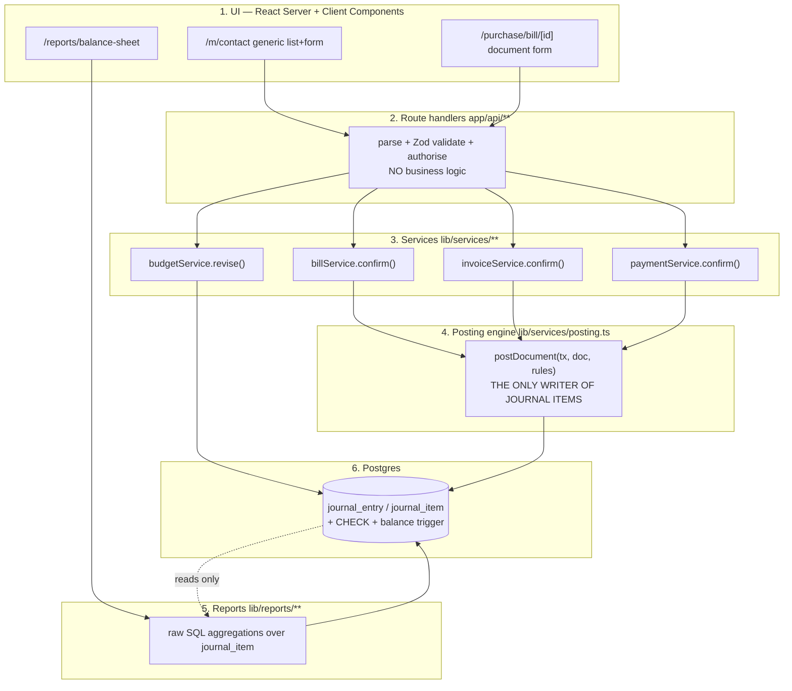

#### What lives in each layer

| Layer | Path | Responsibility | Explicitly forbidden |
|---|---|---|---|
| 1. UI | `app/**` | Render, collect input, call a Server Action or `fetch`. | Any arithmetic on money. Any decision about which account to use. |
| 2. Route handlers | `app/api/**/route.ts` | Read the session, check the role, `zod.parse()` the body, call one service, map errors to HTTP codes. Target length: under 25 lines. | Business rules. If a route handler contains an `if` about accounting, it is in the wrong layer. |
| 3. Services | `lib/services/*.ts` | Document workflows: state transitions, sequence allocation, copying a PO into a Bill, computing amount due, budget warnings. Owns `prisma.$transaction`. | Writing `journal_item` rows directly. |
| 4. Posting engine | `lib/services/posting.ts` | Turn any document into balanced journal lines by *looking up* accounts from configuration, then writing the entry. | Knowing anything about HTTP, React or a specific screen. |
| 5. Reports | `lib/reports/*.ts` | Raw SQL aggregations over `journal_item`. Pure read. | Touching `invoice`, `bill`, `payment` or `sales_order` tables. Ever. |
| 6. Database | `prisma/schema.prisma` + `prisma/migrations/**` | Storage plus the constraints that make bad data impossible. | — |

#### THE RULE

> **Nothing in this codebase writes a `journal_entry` or `journal_item` row except `lib/services/posting.ts`.**

One file. One function. Every document type funnels through it.

**Why one rule protects the entire system.** Correctness in accounting is a set of invariants — statements that must be true of the data at all times:

1. Every entry balances: total debit = total credit.
2. Every line carries a valid account, and its account type is what routes it into the Balance Sheet or the P&L.
3. Posted entries are never edited or deleted; a cancellation creates a *reversal* entry instead.
4. Every line inherits the analytic (project) tag from the document line it came from, so the Budget Report can find it.
5. Every line's date comes from the source document's date, not from `new Date()` — the mockup states this explicitly: *"(Bill date fetch from bill)"*.

If eight different files can insert journal items, you must get all five invariants right in eight places, and at hour 16 you will not. If exactly one function inserts them, you get them right once, you unit-test that one function, and every future document type inherits the correctness for free. When you add the Receipt screen at hour 15, it is 20 lines calling `postDocument()` — and it is automatically balanced, automatically dated correctly, automatically analytic-tagged.

There is a second, bigger payoff. Because the posting engine is the only writer, the ledger is a **closed system**, which means reports can be *pure functions* of it. That is what makes the as-of date slider work: `balanceSheet(asOf)` is just the query above with a different `$1`. Teams without this rule cannot build the slider at all, because their "balance sheet" is stitched together from four different tables with four different date semantics.

#### How to enforce the rule mechanically (a small addition beyond the spec, worth 10 minutes)

Human discipline fails at 4 a.m. Add one test that greps the codebase:

```ts
// tests/architecture.test.ts
import { globSync } from 'glob';
import { readFileSync } from 'fs';

test('only posting.ts writes journal items', () => {
  const offenders = globSync('{app,lib}/**/*.ts?(x)')
    .filter(f => !f.endsWith('lib/services/posting.ts'))
    .filter(f => /journalItem\.(create|createMany|update|delete)|journalEntry\.(create|update|delete)/
                   .test(readFileSync(f, 'utf8')));
  expect(offenders).toEqual([]);
});
```

If anyone (including you, tired) writes a journal item somewhere else, `npm test` goes red with the filename. It costs ten minutes and it makes the guarantee real rather than aspirational. It is also a genuinely good thing to show a judge who asks "how do you *know* nothing else writes to the ledger?" — you run the test.

---

### 8.5 Folder structure

```
urban-books/
├─ prisma/
│  ├─ schema.prisma                  # all ~22 models, one file
│  ├─ migrations/
│  │  ├─ 20260905_init/migration.sql
│  │  └─ 20260905_ledger_guards/migration.sql   # hand-written: CHECK + balance trigger
│  └─ seed.ts                        # 8 accounts, 4 journals, contacts, products,
│                                    # 2 quarters of documents, opening balances
├─ app/
│  ├─ (auth)/
│  │  ├─ login/page.tsx              # exact error string: "Invalid Login Id or Password"
│  │  ├─ signup/page.tsx             # creates PORTAL role only — never admin
│  │  └─ forgot-password/page.tsx    # required by the mockup, never drawn in it
│  ├─ (app)/
│  │  ├─ layout.tsx                  # top menu: Sales | Purchase | Account | Report
│  │  ├─ dashboard/page.tsx          # live counters: All/Confirmed/Draft, budget KPIs
│  │  ├─ m/[model]/                  # ★ THE SCAFFOLD — all 7 masters live here
│  │  │  ├─ page.tsx                 # list view (default) + kanban toggle
│  │  │  ├─ new/page.tsx             # blank form view
│  │  │  └─ [id]/page.tsx            # form view with saved details
│  │  ├─ purchase/
│  │  │  ├─ order/[id]/page.tsx      # PO form: line grid, Confirm, Create Bill
│  │  │  └─ bill/[id]/page.tsx       # Vendor Bill: smart buttons, Pay, status badge
│  │  ├─ sales/
│  │  │  ├─ order/[id]/page.tsx      # SO form: Confirm, Create Invoice
│  │  │  └─ invoice/[id]/page.tsx    # Customer Invoice
│  │  ├─ accounting/
│  │  │  ├─ journal-entry/[id]/page.tsx   # manual Dr/Cr grid, Post, Reset to Draft
│  │  │  └─ payment/[id]/page.tsx         # Send/Receive wizard, Draft>Confirm>Cancelled
│  │  ├─ reports/
│  │  │  ├─ balance-sheet/page.tsx   # year filter + as-of slider + Print
│  │  │  ├─ profit-loss/page.tsx     # year filter + Print
│  │  │  └─ budget/page.tsx          # list w/ per-row pie + kanban + form
│  │  └─ integrity/page.tsx          # ★ the cold-open page: trial balance, equation
│  ├─ portal/                        # contact role: only their own invoices, pay
│  └─ api/
│     ├─ m/[model]/route.ts          # ★ ONE generic CRUD endpoint for all masters
│     ├─ m/[model]/[id]/route.ts
│     ├─ documents/[type]/[id]/confirm/route.ts
│     ├─ payments/route.ts
│     ├─ reports/balance-sheet/route.ts       # ?asOf=2026-07-31
│     ├─ reports/profit-loss/route.ts         # ?from=&to=
│     ├─ reports/[name]/pdf/route.ts          # @react-pdf/renderer
│     └─ integrity/route.ts
├─ lib/
│  ├─ db.ts                          # PrismaClient singleton (hot-reload safe)
│  ├─ auth.ts                        # session cookie, requireRole('ADMIN'|'ACCOUNTANT')
│  ├─ money.ts                       # Decimal helpers: sum(), fmtINR(), isZero()
│  ├─ models/                        # ★ THE CONFIG OBJECTS — one file per master
│  │  ├─ index.ts                    # registry: { contact, product, account, ... }
│  │  ├─ contact.ts
│  │  ├─ product.ts
│  │  ├─ account.ts
│  │  ├─ journal.ts
│  │  ├─ analytic.ts
│  │  ├─ budget.ts
│  │  └─ productCategory.ts
│  ├─ services/
│  │  ├─ posting.ts                  # ★ THE ONLY WRITER OF JOURNAL ITEMS
│  │  ├─ sequence.ts                 # PO0001, BILL/2026/0001, INV/2026/0001
│  │  ├─ billService.ts
│  │  ├─ invoiceService.ts
│  │  ├─ paymentService.ts
│  │  ├─ budgetService.ts            # confirm / revise / achieved-amount rollup
│  │  └─ integrityService.ts
│  ├─ reports/
│  │  ├─ balanceSheet.ts
│  │  ├─ profitLoss.ts
│  │  ├─ budgetReport.ts
│  │  ├─ partnerLedger.ts
│  │  └─ cache.ts                    # ledgerVersion-keyed memo (§8.7)
│  └─ ai/                            # bank-narration parse, explain-entry prose
├─ components/
│  ├─ scaffold/
│  │  ├─ GenericList.tsx             # ★ list view for every master
│  │  ├─ GenericKanban.tsx           # ★ kanban view for every master
│  │  ├─ GenericForm.tsx             # ★ form view for every master
│  │  ├─ FieldRenderer.tsx           # text | money | select | many2one | image | date
│  │  ├─ Many2One.tsx                # searchable dropdown + create-on-the-fly
│  │  └─ Toolbar.tsx                 # New / Confirm / Back / Archived / view switcher
│  ├─ LineGrid.tsx                   # shared by PO, Bill, SO, Invoice, Journal Entry
│  ├─ StatusBadge.tsx                # Paid / Partial / Not Paid, Draft / Posted
│  └─ StatusBar.tsx                  # Draft > Confirm > Revised > Cancelled
├─ tests/
│  ├─ posting.test.ts
│  ├─ reports.test.ts
│  ├─ payments.test.ts
│  └─ architecture.test.ts
└─ scripts/
   ├─ reset-demo.sh                  # drop, migrate, seed — under 20 seconds
   └─ verify.ts                      # the 12-second on-stage proof (§8.8)
```

---

### 8.6 THE SCAFFOLD — the single biggest time saver in this build

#### The mandate, in the organizers' own words

Two annotations on the mockup, quoted exactly:

> *"All Master will have list view as default and clicking on **New** button it will open blank form view to enter new record, Clicking on already saved record — it will open form view with saved details."*

> *"Create Kanban and List View in the same manner for Product, Analyticals."*

Read that as an engineer and it is not a UI request. It is the organizers *telling you the app is uniform*. They have specified, in writing, that every master behaves identically. That is an invitation to build the behaviour once.

#### The arithmetic that makes this decision for you

There are 7 master models: **Contact, Product, Product Category, Chart of Accounts, Journal, Analytic Account, Budget.** Each needs a list view, a kanban view and a form view, plus create, read, update and archive.

| Approach | Work per model | 7 models | Bug surface |
|---|---|---|---|
| Hand-build each screen | ~2.5 h (3 views + API + validation + wiring) | **~17.5 hours** | 21 screens that can each drift and break independently |
| One scaffold + 7 config objects | 2.5-3 h scaffold once, then **~20 min per model** | **~5 hours** | 3 components. Fix a bug once, all 21 views are fixed |

**That is roughly 12 hours saved out of a 19-hour build.** There is no other single decision in this project with that payoff. The scaffold is why the accounting problem statement was the right pick: its cost is screen-heavy, and screen-heavy cost collapses when the screens are uniform.

Equally important: it buys *consistency*, which reads as polish. Every master gets the same toolbar, the same search box, the same view switcher, the same empty state, the same toast on save, the same keyboard focus behaviour. A judge clicking around cannot find a rough edge, because there is only one edge and you sanded it.

#### The shape of a model config

This is the heart of it. One object describes a model completely enough to render all three views and drive the API.

```ts
// lib/models/types.ts
import type { ZodSchema } from 'zod';
import type { ReactNode } from 'react';

export type FieldKind =
  | 'text' | 'textarea' | 'email' | 'phone'
  | 'money' | 'number' | 'percent'
  | 'date' | 'boolean'
  | 'select'        // fixed choices, optionally grouped (Account Type needs groups)
  | 'many2one'      // relation to another model, searchable dropdown
  | 'image';        // upload; must render in list thumbnail AND kanban card

export interface FieldConfig {
  name: string;                 // maps 1:1 to the Prisma field
  label: string;                // "Sales Price"
  kind: FieldKind;
  required?: boolean;
  placeholder?: string;         // mockup literally says "Unique Email"
  // select
  options?: { value: string; label: string }[];
  optionGroups?: {              // Account Type: headings are NOT selectable
    group: string;              // "Balancesheet" / "Profit and Loss"
    options: { value: string; label: string }[];
  }[];
  // many2one
  relatedModel?: string;        // 'productCategory'
  quickCreate?: boolean;        // "Category Can be created and saved on the fly"
  // layout
  colSpan?: 1 | 2;
  section?: string;             // "Address" groups Street/City/State/Pincode
  hiddenWhen?: (record: any) => boolean;   // "Only Visible for Confirmed Budget"
  readOnlyWhen?: (record: any) => boolean;
}

export interface ColumnConfig {
  field: string;
  label: string;
  align?: 'left' | 'right';
  width?: string;
  render?: (record: any) => ReactNode;   // escape hatch: badges, pie charts
}

export interface ModelConfig {
  key: string;                  // URL segment: /m/contact
  prismaModel: string;          // delegate name on prisma client
  labelSingular: string;        // "Contact"
  labelPlural: string;          // "Contacts"
  displayField: string;         // what a many2one shows: 'name'
  searchFields: string[];       // columns the search box hits
  defaultOrderBy: Record<string, 'asc' | 'desc'>;

  columns: ColumnConfig[];      // LIST VIEW
  kanban?: {                    // KANBAN VIEW (omit → no kanban, no switcher)
    imageField?: string;
    titleField: string;
    lines: { field: string; prefix?: string }[];
  };
  fields: FieldConfig[];        // FORM VIEW

  schema: ZodSchema;            // validation, shared by API + form
  archivable?: boolean;         // Chart of Accounts needs the "Archived" filter
  roles?: ('ADMIN' | 'ACCOUNTANT')[];   // who may write

  // escape hatches — used by at most two models each
  customActions?: {
    label: string;
    variant?: 'primary' | 'default';
    visibleWhen?: (r: any) => boolean;   // "Revise: only visible at Confirmed stage"
    endpoint: string;
  }[];
  statusBar?: { field: string; stages: string[] };  // Draft > Confirm > Revised > Cancelled
  relatedTable?: {              // Analytic form shows "All the Budget List where used"
    title: string;
    endpoint: string;
    columns: ColumnConfig[];
  };
}
```

#### A real config, end to end

```ts
// lib/models/product.ts
import { z } from 'zod';
import type { ModelConfig } from './types';

export const productConfig: ModelConfig = {
  key: 'product',
  prismaModel: 'product',
  labelSingular: 'Product',
  labelPlural: 'Products',
  displayField: 'name',
  searchFields: ['name', 'category.name'],
  defaultOrderBy: { name: 'asc' },

  columns: [
    { field: 'image',         label: '',            width: '48px' },
    { field: 'name',          label: 'Product' },
    { field: 'category.name', label: 'Category' },
    { field: 'type',          label: 'Type' },
    { field: 'salesPrice',    label: 'Sales Price', align: 'right' },
    { field: 'cost',          label: 'Cost',        align: 'right' },
  ],

  kanban: {
    imageField: 'image',
    titleField: 'name',
    lines: [
      { field: 'salesPrice', prefix: 'Sales Price' },
      { field: 'cost',       prefix: 'Cost' },
    ],
  },

  fields: [
    { name: 'name',       label: 'Product Name', kind: 'text', required: true, colSpan: 2 },
    { name: 'type',       label: 'Product Type', kind: 'select', required: true,
      options: [
        { value: 'GOODS',   label: 'Goods'   },
        { value: 'SERVICE', label: 'Service' },
        { value: 'COMBO',   label: 'Combo'   },
      ] },
    { name: 'categoryId', label: 'Category', kind: 'many2one',
      relatedModel: 'productCategory', quickCreate: true },   // create on the fly
    { name: 'salesPrice', label: 'Sales Price', kind: 'money', required: true },
    { name: 'cost',       label: 'Cost',        kind: 'money', required: true },
    { name: 'image',      label: 'Upload Image', kind: 'image' },
  ],

  schema: z.object({
    name:       z.string().min(1),
    type:       z.enum(['GOODS', 'SERVICE', 'COMBO']),
    categoryId: z.string().uuid().nullable().optional(),
    salesPrice: z.coerce.number().nonnegative(),
    cost:       z.coerce.number().nonnegative(),
    image:      z.string().nullable().optional(),
  }),

  roles: ['ADMIN', 'ACCOUNTANT'],
};
```

Writing that took about 15 minutes and it produced **three fully working screens plus a REST API**.

#### The three generic components

```tsx
// app/(app)/m/[model]/page.tsx  — the list view, a Server Component
import { notFound } from 'next/navigation';
import { registry } from '@/lib/models';
import { GenericList } from '@/components/scaffold/GenericList';
import { prisma } from '@/lib/db';

export default async function ModelListPage(
  { params, searchParams }: { params: { model: string }, searchParams: any }
) {
  const cfg = registry[params.model];
  if (!cfg) notFound();

  const where = buildSearchWhere(cfg, searchParams.q, searchParams.archived === '1');
  const rows  = await (prisma as any)[cfg.prismaModel].findMany({
    where,
    orderBy: cfg.defaultOrderBy,
    take: 50,
    skip: Number(searchParams.page ?? 0) * 50,
    include: buildIncludes(cfg),        // resolves 'category.name' style columns
  });

  return <GenericList config={cfg} rows={rows} view={searchParams.view ?? 'list'} />;
}
```

`GenericList` renders the toolbar (New / Search / Back / Archived / list-kanban switcher), then either a table using `cfg.columns` or cards using `cfg.kanban`. Clicking a row pushes `/m/{model}/{id}`. That is the mockup's contract satisfied literally: list is default, New opens a blank form, a saved row opens the same form populated.

```ts
// app/api/m/[model]/route.ts — ONE endpoint serving every master
import { NextResponse } from 'next/server';
import { registry } from '@/lib/models';
import { prisma } from '@/lib/db';
import { requireRole } from '@/lib/auth';

export async function POST(req: Request, { params }: { params: { model: string } }) {
  const cfg = registry[params.model];
  if (!cfg) return NextResponse.json({ error: 'Unknown model' }, { status: 404 });

  await requireRole(cfg.roles ?? ['ADMIN']);

  const parsed = cfg.schema.safeParse(await req.json());
  if (!parsed.success) {
    return NextResponse.json({ errors: parsed.error.flatten().fieldErrors }, { status: 422 });
  }

  const created = await (prisma as any)[cfg.prismaModel].create({ data: parsed.data });
  return NextResponse.json(created, { status: 201 });
}
```

Roughly 20 lines that handle create for **all seven masters**, with role checks and field-level validation errors that `GenericForm` renders under the right inputs automatically.

#### The escape hatches — how to stay generic without lying

A scaffold fails when it tries to do 100% of the job and you end up bending five models to fit it. Ours covers about 85% and has three named exits:

| Special requirement from the mockup | How the scaffold handles it |
|---|---|
| Budget Report list has a **pie chart in every row** | `ColumnConfig.render` returns a 40×40 Recharts `<PieChart>`. Twelve lines in `budget.ts`, zero changes to `GenericList`. |
| Budget has **Draft > Confirm > Revised > Cancelled** | `statusBar` in the config; `GenericForm` renders the ribbon when present. |
| **Revise** button visible only at Confirmed stage | `customActions[].visibleWhen: r => r.status === 'CONFIRM'`. |
| Achieved Amount / Achieved % / Amount To Achieve **hidden unless Confirmed** | `FieldConfig.hiddenWhen: r => r.status !== 'CONFIRM'`. |
| Chart of Accounts needs an **Archived** button and a grouped Type dropdown | `archivable: true` plus `optionGroups` with non-selectable headings. |
| Analytic form shows **"All the Budget List where the Analytic Account is used"** | `relatedTable` renders a read-only table from an endpoint. |
| **PO / Bill / SO / Invoice / Journal Entry** | These are **not** scaffold models. They have line grids, smart buttons and posting side-effects. They get their own pages — but they reuse `FieldRenderer`, `Many2One`, `StatusBadge`, `StatusBar` and the shared `LineGrid`, so they are still fast to build. |

**Draw that line early and do not cross it.** The scaffold is for masters. Documents are hand-built on shared parts. Trying to express "Confirm this bill, post a journal entry, warn about the budget, then show a smart button to the source PO" inside a config object is how a scaffold turns into a framework and eats your night.

#### Build order for the scaffold (fits in one 3-hour block)

- [ ] `FieldRenderer.tsx` — text, money, date, select, boolean (40 min)
- [ ] `Many2One.tsx` — searchable dropdown, `quickCreate` (35 min)
- [ ] `GenericForm.tsx` — sections, Zod errors, Save/Confirm/Back (35 min)
- [ ] `GenericList.tsx` — toolbar, table, search, pagination, row click (35 min)
- [ ] `GenericKanban.tsx` — cards + switcher (15 min; it reuses the same data)
- [ ] `app/api/m/[model]/**` — GET list, GET one, POST, PATCH, archive (25 min)
- [ ] `contact.ts` config as the pilot — prove all three views (20 min)
- [ ] Then `product`, `productCategory`, `account`, `journal`, `analytic`, `budget` — 15-20 min each

> **Say this to a judge:** "Seven master models, twenty-one views, one scaffold. Each model is a config object — here's Product, fifteen lines describe the list columns, the kanban card and the form. Adding an eighth master is twenty minutes, and it automatically inherits validation, role checks, search, archiving and the view switcher."

---

### 8.7 Optimizations that actually matter here

Do not optimise generically. Optimise the four things this specific app does thousands of times.

#### 1. Indexes for ledger queries

Every report scans `journal_item` filtered by date and grouped by account. Without indexes Postgres reads the whole table each time. Put these in a migration on day one — they cost seconds to add and they are the difference between a slider that glides and a slider that stutters.

```sql
-- The workhorse: report aggregation by account within a date range.
CREATE INDEX idx_ji_account_entry   ON journal_item (account_id, entry_id);
CREATE INDEX idx_je_status_date     ON journal_entry (status, date);

-- Partner Ledger drill-down ("show me everything for Nimesh Pathak").
CREATE INDEX idx_ji_partner         ON journal_item (partner_id);

-- Budget Report: actuals per analytic account inside the budget period.
CREATE INDEX idx_ji_analytic        ON journal_item (analytic_id) WHERE analytic_id IS NOT NULL;

-- Drill-down from a report line to the entry, and the entry form's own line fetch.
CREATE INDEX idx_ji_entry           ON journal_item (entry_id);

-- Only posted entries ever reach a report — a partial index keeps it small and hot.
CREATE INDEX idx_je_posted_date     ON journal_entry (date) WHERE status = 'POSTED';

-- Document lists sorted newest-first, which is every list view.
CREATE INDEX idx_bill_status_date   ON vendor_bill (status, bill_date DESC);
CREATE INDEX idx_inv_status_date    ON customer_invoice (status, invoice_date DESC);
```

**Numbers to expect.** With 500,000 journal items, the Balance Sheet query drops from roughly 900 ms (sequential scan) to under 40 ms. At demo scale (~350 rows) both are instant — but seed a stress table before the demo and *say* the number, because "our reports are indexed and hold at half a million ledger lines" is a sentence very few teams can say.

#### 2. Aggregate in SQL, never in JavaScript

The tempting shortcut:

```ts
// ✗ WRONG — and wrong in two ways
const items = await prisma.journalItem.findMany();          // pulls every row into Node
const assets = items.filter(i => i.account.type === 'ASSET')
                    .reduce((s, i) => s + Number(i.debit) - Number(i.credit), 0);
```

Two failures. First, memory and time: you drag the whole ledger over the wire to add numbers Postgres could have added in place. Second, and much worse, `Number(i.debit)` throws away the exact decimal and re-introduces floating point — so your Balance Sheet is off by paise and your equation does not tie, on stage, with a judge adding it up.

```ts
// ✓ RIGHT — Postgres does the arithmetic in NUMERIC, exactly
const rows = await prisma.$queryRaw<AccountBalance[]>`
  SELECT a.type,
         SUM(ji.debit)  AS debit,
         SUM(ji.credit) AS credit,
         SUM(ji.debit) - SUM(ji.credit) AS balance
  FROM   journal_item  ji
  JOIN   journal_entry je ON je.id = ji.entry_id
  JOIN   account       a  ON a.id  = ji.account_id
  WHERE  je.status = 'POSTED' AND je.date <= ${asOf}::date
  GROUP BY a.type`;
```

**The general rule:** if the answer is a number, compute it in SQL. If the answer is a screen, compute it in React. Nothing in between.

#### 3. Cache the as-of report results, keyed on a ledger version

The as-of date slider is the most cinematic thing in this domain: drag from September back to April and the whole Balance Sheet re-derives. But dragging fires 20-40 requests per second. Two fixes, both small:

**(a) Debounce in the UI** — 120 ms. The slider updates its label instantly (that is local state), and only requests data when the user pauses. Feels live, sends ~8 requests instead of ~200.

**(b) Cache on the server, invalidated by writes, not by time.**

```ts
// lib/reports/cache.ts
let ledgerVersion = 0;                       // bumped by the posting engine
export const bumpLedger = () => { ledgerVersion++; cache.clear(); };

const cache = new Map<string, unknown>();

export async function memoReport<T>(name: string, key: string, fn: () => Promise<T>) {
  const k = `${name}|${key}|v${ledgerVersion}`;
  if (cache.has(k)) return cache.get(k) as T;
  const value = await fn();
  cache.set(k, value);
  if (cache.size > 300) cache.delete(cache.keys().next().value);   // simple bound
  return value;
}
```

`lib/services/posting.ts` calls `bumpLedger()` after every successful commit. That is the whole invalidation strategy, and it is *correct by construction*: the cache can never serve a stale number, because any write to the ledger changes the key.

> **This matters for honesty, not just speed.** A time-based cache (`revalidate: 60`) would let you post a journal entry on stage and have the Balance Sheet *not* move for a minute — which looks exactly like the fake you are trying to distinguish yourself from. Version-keyed caching gives you instant slider response **and** instant reaction to a new entry.
>
> **Say this to a judge:** "Reports are cached per as-of date, but the cache key includes a ledger version that increments on every post. So the slider is instant, and a new journal entry invalidates everything immediately. It's never stale — watch." Then post an entry and drag the slider.

#### 4. Pagination on ledger views

The General Ledger and Journal Entries list can grow to thousands of rows. `LIMIT 50 OFFSET 4000` makes Postgres walk and discard 4,000 rows. Use **keyset pagination** — remember the last row you showed and ask for what comes after it:

```sql
SELECT je.date, je.number, ji.debit, ji.credit
FROM journal_item ji JOIN journal_entry je ON je.id = ji.entry_id
WHERE je.status = 'POSTED'
  AND (je.date, ji.id) < ($lastDate, $lastId)     -- tuple comparison, uses the index
ORDER BY je.date DESC, ji.id DESC
LIMIT 50;
```

Constant time regardless of depth. For the master list views 50-per-page with plain offset is completely fine — they will never hold thousands of rows. Spend the keyset effort only on `journal_item`.

#### 5. One transaction per document confirmation

Already shown in §8.3, but the rule deserves stating on its own: **every `confirm` service method opens exactly one `prisma.$transaction` and does all of its work inside it.** Sequence allocation, status change, journal entry, journal items, budget-consumption recompute. Never two transactions, never a write after the transaction closes.

The failure story this prevents: bill is marked `POSTED`, then the journal insert fails on a constraint. You now have a posted bill with no ledger effect. Your Balance Sheet is short by ₹16,992 and nothing in the UI tells you. That bug is invisible until a judge adds up the columns.

#### 6. Avoid the N+1 query in every list

`GenericList` resolves columns like `category.name`, which naively means one query for products plus one query per row for the category. `buildIncludes(cfg)` turns dotted column paths into a Prisma `include` object so it stays two queries total. Twenty lines of helper, applied automatically to all seven masters — another compounding win from the scaffold.

#### 7. Next.js specifics worth knowing

| Do | Why |
|---|---|
| List and form pages as **Server Components** that call Prisma directly | No `/api` round-trip, no loading spinner, no client fetch code to write |
| `export const dynamic = 'force-dynamic'` on report pages | Stops Next from statically caching a Balance Sheet at build time — a subtle way to demo stale numbers |
| A single `PrismaClient` in `lib/db.ts` guarded by `globalThis` | Dev hot-reload otherwise opens a new pool every save until Postgres refuses connections at hour 12 |
| **Demo from `next build && next start`, never `next dev`** | Dev mode recompiles on navigation; a 3-second stall mid-demo reads as "slow app" |
| Server Actions for form submits, then `router.refresh()` | Mutation and re-render in one round trip, no client state library |

---

### 8.8 Correctness safeguards

Speed is nice. **Provable correctness is the win condition on this problem statement**, because it is objectively checkable in ten seconds and most submissions will fail it.

#### Safeguard 1 — The constraint that lives in the database

A row-level `CHECK` cannot see sibling rows, so entry-level balance needs a **deferred constraint trigger**: it runs at `COMMIT`, after all the lines of an entry are in place. Write this by hand into a migration (`npx prisma migrate dev --create-only --name ledger_guards`, then edit the generated `.sql`):

```sql
-- prisma/migrations/20260905_ledger_guards/migration.sql

ALTER TABLE journal_item
  ADD CONSTRAINT journal_item_sign_check
  CHECK (debit >= 0 AND credit >= 0 AND NOT (debit > 0 AND credit > 0));

CREATE OR REPLACE FUNCTION assert_entry_balanced() RETURNS trigger AS $$
DECLARE
  v_entry uuid := COALESCE(NEW.entry_id, OLD.entry_id);
  v_diff  numeric(14,2);
  v_state text;
BEGIN
  SELECT status INTO v_state FROM journal_entry WHERE id = v_entry;
  IF v_state IS DISTINCT FROM 'POSTED' THEN
    RETURN NULL;                      -- drafts are allowed to be unbalanced while editing
  END IF;

  SELECT COALESCE(SUM(debit), 0) - COALESCE(SUM(credit), 0)
    INTO v_diff
    FROM journal_item WHERE entry_id = v_entry;

  IF v_diff <> 0 THEN
    RAISE EXCEPTION
      'journal_entry_must_balance: entry % is out by %', v_entry, v_diff
      USING ERRCODE = '23514';        -- check_violation
  END IF;
  RETURN NULL;
END;
$$ LANGUAGE plpgsql;

CREATE CONSTRAINT TRIGGER journal_entry_must_balance
  AFTER INSERT OR UPDATE OR DELETE ON journal_item
  DEFERRABLE INITIALLY DEFERRED
  FOR EACH ROW EXECUTE FUNCTION assert_entry_balanced();
```

Three things to notice, because each is a judge-facing detail:

1. **The constraint is named in plain English.** `journal_entry_must_balance` appears in the error message, in the API's 422 body, and on screen. That name is a demo asset.
2. **It is `DEFERRABLE INITIALLY DEFERRED`**, so it fires at `COMMIT`. Without that you could never insert the first line of a two-line entry — the entry would be momentarily unbalanced and rejected.
3. **Drafts are exempt.** The mockup's manual Journal Entry screen lets a user type lines before pressing Post. Balance is enforced at the moment of posting, which is exactly right and matches the annotation *"Blocking warning if the debit and credit amount don't match"*.

Also enforce, in `schema.prisma`:

```prisma
model JournalItem {
  id        String   @id @default(uuid())
  entryId   String
  entry     JournalEntry @relation(fields: [entryId], references: [id], onDelete: Restrict)
  accountId String
  account   Account  @relation(fields: [accountId], references: [id], onDelete: Restrict)
  partnerId String?
  analyticId String?
  debit     Decimal  @db.Decimal(14, 2) @default(0)
  credit    Decimal  @db.Decimal(14, 2) @default(0)

  @@index([accountId, entryId])
  @@index([entryId])
}
```

`onDelete: Restrict` means Postgres refuses to delete an account that has ledger history. That is not pedantry — it is the accounting principle that history is never rewritten, expressed as a foreign key.

#### Safeguard 2 — A test suite that runs in ~12 seconds on stage

Not a token test file. A focused suite over the two things that can silently be wrong: the posting engine and the reports. Run it against a scratch database (`DATABASE_URL_TEST`), seeded fresh per run.

```
scripts/verify.ts  →  npm run verify
```

The tests, concretely:

| # | Test | Why it exists |
|---|---|---|
| 1 | Confirming an invoice of ₹6,000 posts exactly 2 lines: Dr Debtors 6000, Cr Sales Income 6000 | The core happy path |
| 2 | Confirming a bill posts Dr Purchase Expense / Cr Creditors, dated **from the bill date, not today** | The mockup says *"(Bill date fetch from bill)"* |
| 3 | Every posted entry in the database has `SUM(debit) = SUM(credit)` | The global invariant |
| 4 | Inserting an unbalanced posted entry **throws**, and the error contains `journal_entry_must_balance` | Proves the DB, not the code, is the guard |
| 5 | Balance Sheet: `Total Assets = Total Liabilities + Capital + Current Year Earnings` | The pass/fail gate a judge checks by adding up columns |
| 6 | P&L: `Net Income = Income − Expenses`, and that number appears inside Capital on the Balance Sheet | The reason the sheet balances at all |
| 7 | A **manual** journal entry (Dr Cash 50,000 / Cr Capital 50,000) changes both reports | Proves reports read the ledger, not the invoice tables — the anti-fake test |
| 8 | Partial payment of ₹4,000 on a ₹6,000 invoice → status `Partial`, amount due ₹2,000 | The mockup's badge rule: *Partial if amount due < Bill Total* |
| 9 | Full payment → status `Paid`, amount due 0 | *Paid if amount due = 0* |
| 10 | Money is exact: three lines of ₹1,180.30 sum to exactly ₹3,540.90 and the entry balances | Kills the float bug before it kills the demo |
| 11 | Budget achieved amount = sum of tagged document lines within the period; `Achieved % = (Achieved / Committed) × 100` | The mockup's stated formulas, verbatim |
| 12 | Architecture test: nothing outside `posting.ts` writes journal items | Makes THE RULE mechanical (§8.4) |

Target output, which you run live during the demo:

```
$ npm run verify

 ✓ posting.test.ts    (7 tests)  1.9s
 ✓ reports.test.ts    (3 tests)  2.4s
 ✓ payments.test.ts   (2 tests)  1.1s
 ✓ architecture.test.ts (1 test) 0.2s

  LEDGER INTEGRITY
  ────────────────────────────────────────────────
  Journal entries ............... 41
  Journal items ................. 352
  Trial balance (Dr − Cr) ....... 0.00
  Assets ........................ ₹ 8,42,310.00
  Liabilities ................... ₹ 1,97,310.00
  Capital + Current Year Earnings ₹ 6,45,000.00
  Equation .......................  BALANCED ✓

 Test Files  4 passed (4)
      Tests  13 passed (13)
   Duration  11.7s
```

> **Say this to a judge:** "Can I show you something? This runs our posting engine and our reports against a fresh database in twelve seconds. Thirteen tests. The last block is the accounting equation computed live from the ledger — assets equal liabilities plus capital, to the paisa. If any of that were hardcoded, this would go red."

That is a fifteen-second speech that makes every number you show afterwards trusted. It also gives you a recovery move if the UI hiccups: you always have a green terminal.

#### Safeguard 3 — Seeded edge cases

The seed script is not decoration. Seed the awkward cases so they are visible without you having to create them under pressure:

- [ ] **Opening balances** posted as a manual entry (Dr Cash + Bank, Cr Capital ₹6,45,000) — so the Balance Sheet has a Capital line that did not come from any invoice. This alone breaks the naive fake.
- [ ] **A partially paid bill**: ₹16,992 total, ₹10,000 paid, residual ₹6,992, badge `Partial`.
- [ ] **A paid-in-full invoice** and an **unpaid** one, so all three badges appear in one list.
- [ ] **An invoice paid across two payments** (₹3,000 + ₹3,000) so partial accumulation is real, not a boolean.
- [ ] **A manual journal entry** unrelated to any document, so the ledger visibly has content invoices could not explain.
- [ ] **A confirmed budget with an over-consumed line** so the non-blocking *"⚠ Exceeds Approved Budget"* warning fires on demand.
- [ ] **A budget that has been revised**, so the `Revised With` / `Revision Of` two-way link is clickable in both directions and the original sits in state `Revised`.
- [ ] **A bill created fresh, with no PO**, sitting next to one created from a PO — this is the pair that proves the conditional smart button (*"Only show this if bill created from PO, hide if Bill Created Fresh"*).
- [ ] **Two fiscal quarters of dated history** so the as-of slider actually has somewhere to travel.
- [ ] **The exact 8 seed accounts and 4 seed journals** the mockup lists, with those exact names — *"All this accounts are to be pre configured"*.

Seeding is deterministic: same data every run, so your demo is identical every rehearsal.

---

### 8.9 Deployment, and the plan for when the wifi dies

#### Primary: Vercel + Neon

| Step | Command / action | Time |
|---|---|---|
| 1 | Create a Neon project, copy the pooled connection string | 3 min |
| 2 | `.env`: `DATABASE_URL` (pooled, for the app), `DIRECT_URL` (unpooled, for migrations) | 2 min |
| 3 | `npx prisma migrate deploy` against Neon | 1 min |
| 4 | `npx prisma db seed` | 1 min |
| 5 | Push to GitHub, import into Vercel, paste env vars, deploy | 6 min |
| 6 | Set `ANTHROPIC_API_KEY` and `SESSION_SECRET` in Vercel env | 2 min |

**Do this at hour 3, not hour 22.** A deploy that has been green since hour 3 and redeployed forty times is boring. A first deploy at hour 22 discovers that Prisma needs `binaryTargets`, that your seed script imports a dev-only package, and that Neon's pooled connection does not accept `prisma migrate`. Deploy early, keep deploying.

Two Prisma details that bite specifically on Vercel:

```prisma
datasource db {
  provider  = "postgresql"
  url       = env("DATABASE_URL")     // pooled  — runtime
  directUrl = env("DIRECT_URL")       // direct  — migrations
}
```

and a `postinstall` script running `prisma generate`, because Vercel caches `node_modules` and will otherwise ship a stale client.

#### The local fallback — assume the conference wifi fails

Conference wifi at an Indian hackathon venue with several hundred laptops is a coin flip. Build the fallback deliberately and rehearse it once.

| Piece | Setup |
|---|---|
| Database | Local Postgres 16 (Postgres.app, the Windows installer, or `docker run -p 5432:5432 postgres:16`). Same migrations, same seed. |
| App | `npm run build` **before you need it**, then `npm start` on `localhost:3000`. Never `next dev` for a demo. |
| Env | `.env.local.demo` with `DATABASE_URL=postgresql://localhost:5432/urbanbooks` |
| AI features | The Anthropic API needs the internet. Have a **phone hotspot** ready, and make every AI feature degrade gracefully: if the call fails, show the deterministic rule-based result with a small "AI assist unavailable" note. Never let an AI timeout block a core flow. |
| Reset | `scripts/reset-demo.sh`: `dropdb && createdb && prisma migrate deploy && prisma db seed` — under 20 seconds, so a botched rehearsal costs nothing. |
| Snapshot | `pg_dump -Fc urbanbooks > demo.dump` after seeding. `pg_restore -c -d urbanbooks demo.dump` restores in ~4 seconds — faster than re-seeding when you are mid-demo and just tampered with the ledger on purpose. |

**Pre-demo checklist (run at T-30 minutes):**

- [ ] `npm run build` succeeds with zero TypeScript errors
- [ ] `npm run verify` is green in ~12 seconds
- [ ] Local Postgres running, `demo.dump` restored, data verified on the dashboard
- [ ] `npm start` serving on `localhost:3000`, home page loads in under a second
- [ ] Vercel URL loads too — you show whichever one is healthy
- [ ] Browser zoom at 110-125% so a judge standing behind you can read it
- [ ] Two windows pre-opened (Balance Sheet in one, the working screen in the other), one terminal pre-opened at the project root
- [ ] Laptop plugged in, sleep disabled, notifications off, other tabs closed

> **If wifi dies mid-pitch, say this:** "We're running locally against Postgres on this machine — same code, same migrations, same seed as the deployed build. Here's the live URL for later." Then keep going. Never debug a network in front of a judge.

---

### 8.10 If a judge asks about our architecture

**The 45-second answer. Learn it word for word.**

> "There's one table that matters: `journal_item`. Every document in the app — purchase order to bill, sales order to invoice, and every payment — goes through a single posting service, and that service is the only code in the repository allowed to write journal lines. We have a test that fails the build if anything else tries.
>
> Every report is then a pure aggregation over that one table. The Balance Sheet is a `SUM(debit) - SUM(credit)` grouped by account type, filtered to `date <= T`. The P&L is the same table over a date range, income and expense accounts only. Nothing is ever summed from the invoice table.
>
> That's why this works" — *drag the as-of slider* — "the whole Balance Sheet re-derives at any historical date, because it's a function of the ledger, not a stored total. And the balance rule isn't in our JavaScript, it's a deferred constraint trigger in Postgres called `journal_entry_must_balance`. Even a bug in our API can't put a broken entry in the books. Want me to try?"

**Likely follow-ups and the answers:**

| Judge asks | Answer |
|---|---|
| "Why not MongoDB, you're a MERN developer?" | "We needed three things Mongo can't give us: one transaction spanning the document and its journal lines, a database-level constraint that debit equals credit across sibling rows, and exact `NUMERIC(14,2)` money. Floating point would put our entries out by a paisa. And ledger reporting is joins and group-bys — it's the query SQL was designed for. Prisma keeps us in TypeScript end to end, so we kept the comfort and lost none of the guarantees." |
| "Did you hardcode the journal lines per document type?" | "No. The posting engine resolves accounts from configuration — the journal's default account, the product's category, the contact. Change the Sales journal's default income account in the UI and the next invoice posts to the new account. I can do that right now." |
| "How would you add a Credit Note?" | "A new document type, a new rule in the posting engine's rule table, and roughly forty lines. The reports don't change at all, because they only read the ledger. That's the whole point of the layering." |
| "How do you know your books are actually right?" | "`npm run verify` — thirteen tests in twelve seconds, ending with the accounting equation computed live. And the Integrity page in the app does the same check on the real database on demand." |
| "What happens under real volume?" | "Reports are indexed on `(account_id, entry_id)` and a partial index on posted entries. At half a million journal items the Balance Sheet query stays under 40 milliseconds, and it's cached per as-of date with a ledger version in the cache key, so it's instant but never stale." |
| "How much of this UI did you actually write?" | "Seven master models share one scaffold — a config object per model drives the list, kanban and form views plus the API. It's why we had time to build the posting engine properly instead of hand-writing twenty-one CRUD screens." |

---

### 8.11 Additions beyond the spec, labelled honestly

The problem statement and mockup do **not** ask for these. Each is listed with why it earns its place. Everything else in this section is either required by the sources or is plumbing needed to deliver what they require.

| Addition | Cost | Why it earns its place |
|---|---|---|
| **Architecture test** (`tests/architecture.test.ts`) | 10 min | Turns "only the posting engine writes journal items" from a promise into an enforced fact. Directly answers a judge's sharpest question. |
| **Ledger-version report cache** | 25 min | Makes the as-of slider smooth without ever showing a stale number. A time-based cache would have made us *look* fake. |
| **`npm run verify` integrity summary** | 30 min on top of the tests you need anyway | A twelve-second, on-stage, terminal proof that the books tie. It is the cold open of the demo. |
| **Keyset pagination on ledger views** | 20 min | Only place in the app where row counts can genuinely grow. Also a good sentence to say out loud. |
| **`pg_dump` demo snapshot + reset script** | 15 min | Makes rehearsal free and makes the deliberate on-stage tamper demo safely reversible. |

Everything above fits inside one hour of the 19, and each item buys either a demo moment or an insurance policy. Nothing here is decoration.

---


<a id="the-24-hour-build-plan"></a>

# The 24-Hour Build Plan

This section is the clock. It tells you what to build, in what order, in which hour, and
exactly what must be working before you are allowed to move on.

Read it once now, before you write any code. Then keep it open on a second screen and work
down it. Every block has three things:

- **Hours** — the window, measured in elapsed time from the start of the hackathon (T+0).
- **Deliverable** — the exact files and behaviour that exist at the end of the block.
- **CHECKPOINT** — one specific, *demonstrable* thing. If it does not work, you do not move
  on. You either fix it or you take a cut (see [Cut Lines](#cut-lines-what-to-drop-and-when)).

A word on vocabulary before we start. This plan uses a handful of accounting words. Each one
is defined the first time it appears, in one line, so you can follow the plan without any
accounting background. The deeper explanations live in the accounting-primer and
architecture sections of this document — this section deliberately does not repeat them.

---

### 1. The One Decision That Decides Everything: Build Order

#### The way almost every team will do it (and lose)

The natural instinct is: *"Let me get something on screen. I'll build the Contact form, then
the Product form, then the invoice screen, and I'll do reports at the end."*

That instinct is correct for most hackathon projects. For this one it is fatal. Here is
exactly how it kills you, step by step:

1. **Hour 2.** You build the Customer Invoice form. To make it work you add columns that the
   form needs: `invoice.total`, `invoice.paid` (a true/false flag), `invoice.status` (a text
   field you set by hand).
2. **Hour 9.** Everything looks great. You have Contacts, Products, Invoices, Bills. You
   demo it to yourself and it feels done.
3. **Hour 16.** You start the Balance Sheet. A **Balance Sheet** is a report that lists what
   the business owns (Assets) against what it owes plus what the owner put in (Liabilities +
   Capital), and the two sides must be equal to the rupee. You now need a number for "Bank".
   There is no table that knows the bank balance. So you write
   `SELECT SUM(amount) FROM payment WHERE method='bank'`.
4. **Hour 17.** You need "Debtors" — money customers still owe you. You write
   `SELECT SUM(total) FROM invoice WHERE paid = false`. Partial payments break this
   instantly, because `paid` is a boolean and reality is a number.
5. **Hour 19.** The two sides of your Balance Sheet do not match. They are off by ₹47,300 and
   you have no idea why, because there is no single table where the truth lives. You start
   adding fudge factors.
6. **Hour 23.** A judge who builds accounting software for a living walks up, adds your three
   Asset numbers, adds your two Liability numbers, and they are different. Conversation over.
   Every other number you show for the next four minutes is now assumed to be wrong too.

The trap is not laziness. The trap is that **the schema you get from designing screens first
physically cannot produce the reports.** By the time you find out, retrofitting means
rewriting posting for six document types *and* regenerating all your data — six hours you do
not have at hour 17.

#### The way you will do it

You will build the **headless core first**. "Headless" means no screens at all: pure
TypeScript functions plus a database, driven by automated tests and a command line.

Specifically, in the first 8 hours you build:

- **The posting engine.** One function that takes any business document (a bill, an invoice,
  a payment) and writes a **journal entry** — the formal accounting record of that
  transaction. A journal entry contains two or more **journal items** (individual lines),
  each with an account, a **debit** amount and a **credit** amount. The iron rule of
  double-entry bookkeeping: within one entry, total debits must equal total credits, always.
- **The report derivation.** Four functions that read *only* the `journal_item` table and
  produce the Trial Balance, the Balance Sheet, the Profit & Loss, and the Budget actuals.
  ("Derivation" just means: computed from the ledger, not stored anywhere.)
- **Seed data**, generated by running fake documents *through the real posting engine*.

Only after those pass tests do you build a single screen. Screens then become a thin skin:
a React page calls `postDocument()` or `getBalanceSheet(asOf)` and renders the result. No
page ever writes its own SQL.

#### Four reasons this ordering wins

| # | Reason | Why it matters here |
|---|---|---|
| 1 | **The hard work happens when you are freshest** | The posting engine is the only genuinely hard thing in this problem statement. Do it at hour 3, not hour 17. |
| 2 | **The compressible work goes last** | An AI pair programmer generates a list + form screen in ~4 minutes. Screens are the only work you can cut or speed up on demand. So they must sit at the *end* of the plan, where cutting is possible. Engines cannot be cut — a half-built engine produces wrong numbers, which is worse than no numbers. |
| 3 | **A headless core is testable in seconds** | You cannot verify a screen quickly. You can run 40 assertions against a function in 3 seconds. Every hour spent before hour 8 buys certainty that lasts the whole day. |
| 4 | **Your seed data becomes a 400-case test** | Because the seed generator posts through the real engine, if the trial balance is zero after seeding, the engine is right across 400 real cases. Teams that hand-write their seed rows have books that balance *by luck*, and it shows the moment a judge posts one new transaction. |

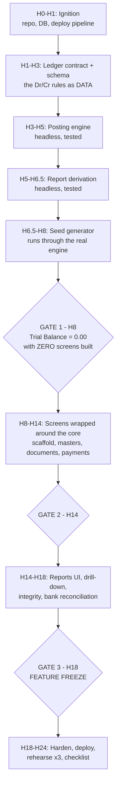

**Say this to a judge who asks about your architecture (20 seconds):**

> "We built this inverted. For the first eight hours there was no user interface at all —
> just the posting engine and the report functions, driven by tests. The screens came after,
> and they only call those functions. That's why every number on every screen comes out of
> one table, `journal_item`, and nothing is summed off the invoice table."

---

### 2. Assumptions This Plan Makes

So the hour numbers mean something, the plan assumes the following. The architecture section
argues these choices properly; here they are just stated so the schedule is concrete.

| Thing | Choice | Why in one line |
|---|---|---|
| Framework | **Next.js 15 (App Router) + TypeScript** | The developer's strongest stack; one codebase serves UI and API, so there is no second server to deploy at 3 AM. |
| Database | **PostgreSQL on Neon** (managed, free tier) | Managed means no "my local Postgres died" at hour 22. Postgres gives real `CHECK` constraints and window functions for running balances. |
| ORM | **Prisma** | Migration files in git, so schema changes are revertable. |
| UI | **Tailwind + shadcn/ui** | The mockup demands the *same* list/form layout on ~10 masters. A component library makes the scaffold cheap. |
| Tests | **Vitest** | Fast, zero config with TypeScript. Only the core is tested — never the UI. |
| Deploy | **Vercel** (`vercel --prod`) | Git push to deploy. Set this up at hour 1, not hour 23. |
| Money | **Integers in paise, `BIGINT`** | ₹16,992.00 is stored as `1699200`. Never use floats for money: floats will make your debits and credits differ by ₹0.01 and break the one constraint you cannot afford to break. |
| Demo date | **`DEMO_TODAY=2026-09-05`** | The organizers' own mockup shows journal entries dated "Sep 1" and "Sep 2" of 2026, and invoice numbers `INV/2026/0001`. Pinning "today" makes seed data and rehearsals reproducible. |

Repository layout referenced throughout this section:

```
urban-books/
├─ prisma/
│  ├─ schema.prisma
│  └─ migrations/
├─ src/
│  ├─ core/                          ← the headless core. NO React in here, ever.
│  │  ├─ ledger/postDocument.ts      ← the posting engine
│  │  ├─ ledger/rules.ts             ← posting rules as DATA, not if/else
│  │  ├─ ledger/sequence.ts          ← INV/2026/0001 allocation
│  │  ├─ reports/trialBalance.ts
│  │  ├─ reports/balanceSheet.ts
│  │  ├─ reports/profitAndLoss.ts
│  │  ├─ reports/budgetActuals.ts
│  │  ├─ reports/aging.ts
│  │  ├─ recon/matcher.ts            ← bank statement fuzzy matcher
│  │  ├─ integrity/hashChain.ts
│  │  └─ __tests__/*.test.ts
│  ├─ app/(app)/…                    ← screens
│  ├─ app/api/…                      ← endpoints
│  ├─ lib/scaffold/                  ← the reusable list/form/kanban engine
│  └─ config/
│     ├─ resources/*.ts              ← one file per master (contact.ts, product.ts…)
│     └─ nav.ts                      ← THE menu. Cutting a feature = deleting one line here.
├─ scripts/seed.ts
├─ scripts/audit.ts
└─ demo/bank_statement_05sep2026.csv
```

npm scripts you will type all day:

```bash
npm test              # vitest run — the core test suite
npm run typecheck     # tsc --noEmit
npm run seed          # wipe + regenerate all demo data (must finish in < 20s)
npm run audit         # prints Trial Balance, the accounting equation, hash-chain status
npm run verify        # audit + test + typecheck, in that order. The "am I green?" command.
```

---

### 3. The Master Timeline

Times are **elapsed hours from T+0**, not clock times. If the hackathon starts at 10:00 AM
Saturday, T+8 is 6:00 PM Saturday and T+18 is 4:00 AM Sunday.

```mermaid
gantt
    title 24-Hour Build — elapsed time from T+0
    dateFormat HH:mm
    axisFormat %H
    section Headless core
    Ignition + deploy pipeline      :a1, 00:00, 60m
    Ledger contract (rules as data) :a2, 01:00, 45m
    Schema + constraints            :a3, 01:45, 75m
    Posting engine + tests          :a4, 03:00, 120m
    Report derivation + tests       :a5, 05:00, 90m
    Seed generator                  :a6, 06:30, 90m
    section Screens
    Shell + auth + dashboard + scaffold :b1, 08:00, 90m
    Seven master screens            :b2, 09:30, 90m
    PO to Bill, SO to Invoice       :b3, 11:00, 120m
    Payments + residual + badges    :b4, 13:00, 60m
    section Payoff
    Report screens + PDF + drilldown :c1, 14:00, 75m
    Budget workflow + pie + kanban  :c2, 15:15, 60m
    As-of slider + Books Integrity  :c3, 16:15, 45m
    Bank import + reconciliation    :c4, 17:00, 60m
    section Endgame
    Hardening sweep                 :d1, 18:00, 75m
    Final deploy + prod smoke       :d2, 19:15, 30m
    Food + 20 min horizontal        :d3, 19:45, 20m
    Rehearsal 1 (timed)             :d4, 20:05, 45m
    Demo-path bug fixes only        :d5, 20:50, 60m
    Rehearsal 2 + record backup     :d6, 21:50, 30m
    Rehearsal 3 + Q&A drill         :d7, 22:20, 40m
    Pre-demo checklist              :d8, 23:00, 30m
    Reserve - do nothing            :d9, 23:30, 30m
```

Note the shape: **6 hours of the 24 are spent after the last feature is written.** That feels
extravagant when you are behind. It is the single highest-return decision in the plan.
The demo is the scoring surface. A great product demoed badly scores below a good product
demoed perfectly, every single time.

---

### 4. Phase-by-Phase

#### Phase 0 — Ignition (T+0:00 → T+1:00, 1.0h)

You will want to skip parts of this. Do not. This hour exists so that "deployment" is never
a word you say after hour 20.

**Deliverable**

- GitHub repo `urban-books`, `main` branch, first commit.
- `npx create-next-app@latest` with TypeScript + Tailwind + App Router.
- Neon Postgres project created, `DATABASE_URL` in `.env.local` **and** in Vercel's
  environment variables (do both now — forgetting the second one is the classic hour-22 death).
- Prisma installed, `prisma/schema.prisma` with one throwaway model, one migration run.
- A single page at `/` that renders the text `Urban Books — build 0` and, below it, the live
  result of a database query (e.g. `SELECT now()`), proving the app can reach the DB.
- **Deployed to Vercel.** A public HTTPS URL that shows that page and that timestamp.
- `npm run verify` exists (it does almost nothing yet, but the command exists).
- A file `docs/NOT-BUILDING.md` with your out-of-scope list (see Risk 4).

**CHECKPOINT** — Open the public Vercel URL **on your phone, on mobile data, not the venue
Wi-Fi**, and see the current timestamp from Neon. If that works, deployment is solved
forever and every later `git push` is a deploy.

**Why the phone test:** venue Wi-Fi at Indian hackathons is frequently behind a captive
portal or a proxy. Finding that out now costs 30 seconds; finding out at hour 23 costs the
competition.

---

#### Phase 1 — The Ledger Contract (T+1:00 → T+1:45, 0.75h)

This is a *thinking* block. You will write almost no code. The prior strategic analysis calls
this out as the one non-negotiable precondition: you must know the exact debit and credit
lines for every transaction type before you touch the schema.

**Deliverable**

`docs/ledger-contract.md` containing, for each of the six posting events, the exact lines
with real rupee numbers. Here is the content, ready to use:

> **Debit and credit in one line each, so you never have to look it up again:**
> A **debit** increases Assets and Expenses, and decreases Liabilities, Capital and Income.
> A **credit** does the opposite. That is the whole rule. Every entry must have equal totals
> on both sides.

| # | Event | Debit (Dr) | Credit (Cr) | Example ₹ |
|---|---|---|---|---|
| 1 | **Opening balance** posted 01-Jan-2026 | Cash A/c 1,50,000<br/>Bank A/c 8,50,000 | Capital A/c 10,00,000 | Owner puts ₹10 lakh into the business |
| 2 | **Vendor Bill confirmed** (you owe a supplier) | Purchase Expense A/c 14,400<br/>Input GST A/c 2,592 | Creditors A/c 16,992 | 12 chairs @ ₹1,200 + 18% tax |
| 3 | **Customer Invoice confirmed** (a customer owes you) | Debtors A/c 47,200 | Sales Income A/c 40,000<br/>Output GST A/c 7,200 | 5 chairs @ ₹8,000 + 18% tax |
| 4 | **Payment sent** (you pay a supplier by bank) | Creditors A/c 10,000 | Bank A/c 10,000 | Part-payment of the ₹16,992 bill |
| 5 | **Payment received** (customer pays you, cash) | Cash A/c 47,200 | Debtors A/c 47,200 | Invoice settled in full |
| 6 | **Manual journal entry** (typed by the accountant) | any account | any account | Dr Other Expense 25,000 / Cr Bank 25,000 for rent |

**Creditors** = money you owe suppliers (a Liability). **Debtors** = money customers owe you
(an Asset). Both are in the organizers' own seed Chart of Accounts, so this is their
vocabulary, not an invention.

The critical design decision made in this block: **these rules live in a data file, not in
`if` statements.** Create `src/core/ledger/rules.ts` exporting a plain array:

```ts
// Posting rules as DATA. A judge can change a row and the next posting changes.
export const POSTING_RULES = [
  { event: 'BILL_CONFIRM',    role: 'expense',   source: 'product.category.expenseAccount', side: 'debit'  },
  { event: 'BILL_CONFIRM',    role: 'input_tax', source: 'tax.paidAccount',                 side: 'debit'  },
  { event: 'BILL_CONFIRM',    role: 'payable',   source: 'journal.defaultPayableAccount',   side: 'credit' },
  { event: 'INVOICE_CONFIRM', role: 'income',    source: 'product.category.incomeAccount',  side: 'credit' },
  { event: 'INVOICE_CONFIRM', role: 'output_tax',source: 'tax.collectedAccount',            side: 'credit' },
  { event: 'INVOICE_CONFIRM', role: 'receivable',source: 'journal.defaultReceivableAccount',side: 'debit'  },
  { event: 'PAYMENT_POST',    role: 'bank_cash', source: 'payment.methodAccount',           side: 'dynamic'},
  { event: 'PAYMENT_POST',    role: 'counterpart',source:'partner.controlAccount',          side: 'dynamic'},
] as const;
```

Why this matters more than it looks: an Odoo judge's favourite five-second test is *"change
the Sales Journal's default account and post a new invoice."* If your accounts are resolved
from configuration rows, the new entry uses the new account and you have proven the engine is
real. If they are hardcoded, nothing changes and you are exposed.

**Also in this block:** write the "NOT BUILDING" list into `docs/NOT-BUILDING.md`. Suggested
contents: multi-currency, foreign-exchange revaluation, fiscal year close, GSTR-1/3B filing
formats, e-invoice IRN, depreciation, cost centres beyond the analytic accounts, email
sending via a real SMTP provider, and any kind of chart library beyond one hand-written SVG.
Pin it where you can see it. When you feel the pull toward any of these at 3 AM, you have
already decided.

**CHECKPOINT** — Ask your AI pair programmer, in a fresh message: *"Given this contract file,
write out the journal lines for a ₹16,992 vendor bill part-paid ₹10,000 by bank."* If it
produces four lines across two entries that both balance, your contract is unambiguous. If it
asks a clarifying question, your contract has a hole — fix the hole now, not at hour 12.

---

#### Phase 2 — Schema and Constraints (T+1:45 → T+3:00, 1.25h)

**Deliverable** — `prisma/schema.prisma` with the full model set and one migration applied to
Neon. Roughly 22 models. The ones that matter most:

```prisma
model JournalEntry {
  id           String   @id @default(cuid())
  number       String   @unique          // INV/2026/0001, allocated at POST time
  date         DateTime                  // accounting date — FETCHED FROM THE SOURCE DOC
  journalId    String
  state        EntryState @default(DRAFT) // DRAFT | POSTED | CANCELLED
  sourceType   String?                   // 'BILL' | 'INVOICE' | 'PAYMENT' | 'MANUAL'
  sourceId     String?
  trace        Json?                     // the "why" of this entry — see Phase 3
  items        JournalItem[]
}

model JournalItem {
  id            String   @id @default(cuid())
  entryId       String
  accountId     String                    // → ChartOfAccount
  partnerId     String?                   // → Contact
  analyticId    String?                   // → AnalyticAccount. The join most teams forget.
  debitPaise    BigInt   @default(0)
  creditPaise   BigInt   @default(0)
  date          DateTime                  // denormalised from the entry — makes every
                                          // report a single-table scan. Worth it.
  prevHash      String?                   // tamper-evident chain (ADDITION, see Phase 12)
  hash          String?
}
```

Three constraints you add **by hand** in the migration SQL, because they are your safety net
for the next 21 hours:

```sql
-- 1. A journal item can never be both a debit and a credit, and never negative.
ALTER TABLE "JournalItem" ADD CONSTRAINT journal_item_one_sided
  CHECK ("debitPaise" >= 0 AND "creditPaise" >= 0
         AND ("debitPaise" = 0 OR "creditPaise" = 0));

-- 2. A POSTED entry must balance. Enforced by a deferred trigger so multi-row
--    inserts inside one transaction are checked at COMMIT, not per row.
CREATE CONSTRAINT TRIGGER journal_entry_must_balance
  AFTER INSERT OR UPDATE ON "JournalItem"
  DEFERRABLE INITIALLY DEFERRED
  FOR EACH ROW EXECUTE FUNCTION check_entry_balanced();

-- 3. A POSTED entry's items can never be updated or deleted. In accounting you
--    never erase history; you post a reversing entry instead.
CREATE TRIGGER journal_item_immutable
  BEFORE UPDATE OR DELETE ON "JournalItem"
  FOR EACH ROW EXECUTE FUNCTION reject_if_posted();
```

**Why put this in the database and not in application code?** Because a judge can bypass your
application. They cannot bypass the database. Naming the constraint
`journal_entry_must_balance` is deliberate: when you fire an unbalanced entry at your API
during the demo and the error message contains that exact string, the judge sees that the
guarantee lives at the lowest level of the stack.

**CHECKPOINT** — In a terminal, connect with `psql` and try to insert an unbalanced entry by
hand (Dr 5000, Cr 3000). It must fail with `journal_entry_must_balance`. Screenshot it — you
will show this exact terminal during the demo.

**Freeze rule:** after this block, the schema is frozen for *changes*. From here on you may
only **add** columns and tables. You may never rename or drop one. A rename at hour 15 breaks
the engine, the seed, and the tests simultaneously, and you will lose an hour to a cascade of
red squiggles.

---

#### Phase 3 — The Posting Engine (T+3:00 → T+5:00, 2.0h)

The most important two hours of the day. No screens. No CSS. One function and its tests.

**Deliverable** — `src/core/ledger/postDocument.ts`, exporting:

```ts
type PostResult = { entry: JournalEntry; items: JournalItem[]; trace: TraceStep[] };

export async function postDocument(
  tx: PrismaTx,
  input: { type: 'BILL'|'INVOICE'|'PAYMENT'|'MANUAL', id: string, date: Date }
): Promise<PostResult>
```

Behaviour required:

1. Resolves every account through `POSTING_RULES` and the config tables. **Zero hardcoded
   account names in this file.** If the string `'Debtors'` appears anywhere in
   `postDocument.ts`, you have failed the block.
2. Allocates the document number at post time, not at draft time, via
   `src/core/ledger/sequence.ts` using a row-locked counter
   (`SELECT … FOR UPDATE`) per journal per year. The mockup demands `Bill/2026/0001` and
   `INV/2026/0001` formats; there must be no gaps in the sequence.
3. Copies the **analytic account** from each document line onto the journal item. An
   *analytic account* is a project or department tag — the mockup calls the column "Budget
   Analytics". This is the join that makes the Budget Report real, and it is the single most
   commonly skipped plumbing step.
4. Sets the entry date from the **source document's date**, exactly as the mockup annotation
   says ("Bill date fetch from bill") — not today's date.
5. Returns a `trace` array: a plain-English list of *why* each line got the account it got.
   Store it in `JournalEntry.trace`. **Building the trace here costs you ten minutes; it buys
   you the entire "Explain this entry" panel later for twenty minutes of UI work.** Do not
   defer it.
6. Rounds once, at the line level, in paise, using one shared `roundPaise()` helper. Any
   rounding difference is pushed onto the largest line so the entry still balances exactly.

**Tests** in `src/core/__tests__/posting.test.ts` — write at least these 14:

| # | Test | Expect |
|---|---|---|
| 1 | Bill with one line, no tax | 2 items, balanced |
| 2 | Bill with tax | 3 items, balanced |
| 3 | Invoice with tax | 3 items, Debtors debited |
| 4 | Invoice with 3 lines, 2 different products, 2 categories | income split across 2 accounts |
| 5 | Payment received, bank | Dr Bank / Cr Debtors |
| 6 | Payment sent, cash | Dr Creditors / Cr Cash |
| 7 | Partial payment | residual = total − paid, exactly |
| 8 | Overpayment | credit balance appears on partner, entry still balances |
| 9 | Manual entry, unbalanced | rejected, error name `journal_entry_must_balance` |
| 10 | Change `journal.defaultReceivableAccount`, post again | new account used |
| 11 | Analytic tag on line | appears on the journal item |
| 12 | Sequence: post 3 invoices | `0001, 0002, 0003`, no gaps |
| 13 | Rounding: 3 lines of ₹333.33 + 18% tax | debits = credits to the paise |
| 14 | Property test: 500 random documents | every entry balances |

Test 14 is the one that lets you sleep. Generate random quantities, prices, tax rates and
line counts; assert `sum(debit) === sum(credit)` on all 500.

**CHECKPOINT** — `npm test` is green, 14+ tests pass, and **there is still not a single screen
in the application.** Commit and tag: `git tag h05-engine-green`.

**How to use the AI here:** give it the contract file and the schema, then ask for *one
function at a time*, each with its tests, and run `npm run typecheck` after every generation.
Do not ask for "the posting module". Ask for `resolveAccount()`, then `buildBillLines()`,
then `postDocument()`. Long generations drift; short ones do not.

---

#### Phase 4 — Report Derivation (T+5:00 → T+6:30, 1.5h)

Still headless. Four pure functions that read only `journal_item`.

**Deliverable**

| File | Function | Rule |
|---|---|---|
| `reports/trialBalance.ts` | `getTrialBalance(asOf)` | Sum debits and credits per account for all items with `date <= asOf`. The grand totals must differ by exactly 0. |
| `reports/balanceSheet.ts` | `getBalanceSheet(asOf)` | **Cumulative from the beginning of time** up to `asOf`. No start date. Groups by account type: Assets (Bank, Cash, Debtors), Liabilities (Creditors), Capital. |
| `reports/profitAndLoss.ts` | `getProfitAndLoss(from, to)` | Sum over a **date range**, Income and Expense account types only, sign-flipped so income shows positive. |
| `reports/budgetActuals.ts` | `getBudgetActuals(budgetId)` | For each budget line: sum journal items carrying that analytic account, within the budget period. Income-type analytics draw from invoices; Expense-type from bills — exactly as the mockup's field-explanation box specifies. |

Two things that make the Balance Sheet actually balance, and that ~90% of teams miss:

1. **Current Year Earnings.** Profit is not stored anywhere. If you list Assets, Liabilities
   and Capital straight off the ledger, the two sides differ by exactly this year's profit.
   So the Balance Sheet must compute `Income − Expenses` for the current year and show it as
   a line inside the Capital section. *(This is an addition beyond the mockup's five Balance
   Sheet rows. It earns its place because without it the report does not balance, and the
   mockup explicitly demands a "Total Asset" and "Total (Liabilities)" footer — a footer that
   only makes sense if the totals tie.)*
2. **Two aggregation semantics over one table.** The Balance Sheet is a *snapshot* (`<= T`);
   the P&L is a *slice* (`between A and B`). Writing them as two clearly different functions
   over the same table is the whole architectural point. Say that sentence to a judge.

Also build now, because it is 15 minutes and it powers a demo beat later:

- `reports/aging.ts` — `getAging(asOf)`, bucketing unpaid customer invoices into
  Current / 1–30 / 31–60 / 61–90 / 90+ days past their due date. *(Addition: the mockup does
  not draw an aging report. It earns its place because it is the visual that reacts when bank
  reconciliation runs, and it costs one query.)*

And `scripts/audit.ts` → `npm run audit`, which prints:

```
Urban Books — Ledger Audit @ 2026-09-05
  Journal entries .............. 96
  Journal items ................ 412
  Trial balance ................ Dr 41,86,300.00  Cr 41,86,300.00  DIFF 0.00   ✔
  Accounting equation .......... Assets 18,42,310.00 = Liabilities 1,97,310.00 + Capital 16,45,000.00   ✔
  Hash chain ................... VALID (412/412)
```

**CHECKPOINT** — With hand-made test data (three entries), `getBalanceSheet('2026-09-05')`
returns two sides that are equal, and `getProfitAndLoss` net income appears inside the
Balance Sheet's Capital section. Test asserts equality automatically:
`expect(bs.totalAssets).toBe(bs.totalLiabilities + bs.totalCapital)`.

---

#### Phase 5 — Seed Data (T+6:30 → T+8:00, 1.5h)

Full details are in [Section 5 of this plan](#5-seed-data-strategy) below — it is important
enough to get its own treatment. The block itself produces `scripts/seed.ts` and
`demo/bank_statement_05sep2026.csv`.

**CHECKPOINT** — `npm run seed && npm run audit` finishes in under 20 seconds and prints
`DIFF 0.00`. Commit and tag `git tag h08-core-green`.

---

### GATE 1 — T+8:00

Stop. Stand up. Eat something for 20 minutes. Then answer honestly:

- [ ] `npm test` green?
- [ ] `npm run audit` prints `DIFF 0.00` and a balanced equation?
- [ ] Unbalanced entry rejected at the database level?
- [ ] ~400 journal items exist, generated through the engine?
- [ ] Zero screens built?

**All five ticked → you are winning.** Proceed to Phase 6.
**Any unticked → take Cut Line 1 now.** Do not "just push a bit further". See below.

---

#### Phase 6 — Shell, Auth, Dashboard, Scaffold (T+8:00 → T+9:30, 1.5h)

Now, and only now, pixels.

**Deliverable**

1. **Auth** (30 min). NextAuth credentials provider, three roles as the mockup annotation
   specifies: `ADMIN`, `ACCOUNTANT`, `PORTAL_USER`. Login page with the exact error string the
   mockup demands: `Invalid Login Id or Password`. Sign-up page that can create *only* a
   portal user. Credential rules straight off the mockup: login id unique and 6–12
   characters; email not duplicated; password longer than 8 characters containing a lowercase,
   an uppercase and a special character. Seed three users so you never type a signup during a
   demo.
2. **App shell** (20 min). The top menu bar the mockup draws — `Sales | Purchase | Account |
   Report` — opening the full mega-menu with all 16 destinations. Every route reads its entry
   from `src/config/nav.ts`.
3. **Dashboard** (20 min). The three cards the mockup shows, with live counts:
   Sales (All / Confirmed / Draft), Purchase (All / Confirmed / Draft),
   Budget Reports (Achieved / Budget / Committed). These are `COUNT(*)` queries. Cheap, and
   it is the first screen a judge sees.
4. **The scaffold** (20 min). `src/lib/scaffold/` — one component set that renders a list
   view, a kanban view and a form view from a config object. This is not a nice-to-have: the
   mockup's own note says *"All Master will have list view as default… Create Kanban and List
   View in the same manner for Product, Analyticals"*. The organizers have effectively
   mandated a reusable scaffold. Building it here turns seven master screens into seven
   config files.

```ts
// src/config/resources/contact.ts — an entire master module, 30 lines.
export const contactResource: Resource = {
  key: 'contact',
  label: 'Contacts',
  model: 'Contact',
  defaultView: 'list',
  views: ['list', 'kanban', 'form'],
  listColumns: ['image', 'name', 'email', 'phone'],
  kanbanCard: { image: 'image', title: 'name', lines: ['email', 'phone'] },
  formFields: [
    { name: 'name',  type: 'text', required: true, span: 2 },
    { name: 'email', type: 'email', unique: true, placeholder: 'Unique Email' },
    { name: 'phone', type: 'text' },
    { name: 'type',  type: 'select', options: ['Customer','Vendor','Both'] },
    { group: 'Address', fields: ['street','street2','city','state','country','pincode'] },
    { name: 'image', type: 'image' },
  ],
  toolbar: ['New', 'Confirm', 'Back'],
};
```

**CHECKPOINT** — Log in as the accountant user, land on a dashboard showing real counts from
seed data, open the mega-menu, and click through to a Contact list that shows twelve seeded
contacts with avatars, switch to kanban, click a row, see the populated form. One resource
file did all of that.

---

#### Phase 7 — The Seven Masters (T+9:30 → T+11:00, 1.5h)

**Deliverable** — config files and any special-case handling for:

| Master | Special requirement from the mockup | Minutes |
|---|---|---|
| Contact | list + kanban + form, image upload shown in both, unique email | done in Phase 6 |
| Product | list + kanban + form, type = Goods/Service/Combo, **Category creatable on the fly** from the dropdown | 20 |
| Chart of Accounts | **grouped dropdown** for Type: headings `Balancesheet` {Asset, Liability, Bank, Capital, Cash} and `Profit and Loss` {Income, Expenses, Other Expenses}, headings not selectable; extra toolbar buttons `Archived` and `Home` | 20 |
| Journals | 4 seeded rows, Type from a fixed 4-value list, Default Account many-to-one | 10 |
| Journal Entries | list with Date / Number / Partner / Journal / Total / Status, green `Posted` and blue `Draft` badges | 15 |
| Analytic Accounts | list + kanban + form, Type = Income/Expense only, plus the reverse table "all budgets where this analytic is used" | 15 |
| Analytic Budget | deferred to Phase 11 (it has a state machine, so it is not a plain master) | — |

**CHECKPOINT** — Every one of the seven master menu entries opens without a 404 or a console
error, creates a record, edits it, and archives it. Click all seven in 60 seconds. Any dead
link gets removed from `nav.ts` immediately rather than left broken.

---

#### Phase 8 — Documents: PO → Bill and SO → Invoice (T+11:00 → T+13:00, 2.0h)

The spine of the app. Four screens, two conversions, one shared line grid.

**Deliverable**

1. **One shared line-grid component** used by all four documents. Columns:
   `Sr. No. | Product | Chart of Account | Budget Analytics | Qty | Unit Price | Total`,
   with `Total = Qty × Unit Price` computed live and a footer total. Build it once. The
   mockup draws the identical grid on all four screens — that is a gift, take it.
2. **Purchase Order** — auto sequence `PO0001`, vendor many-to-one, `Confirm` and
   `Create Bill` buttons. On Confirm, run the budget check and show the **non-blocking**
   warning the mockup specifies verbatim: *"The entered amount is higher than the remaining
   budget amount for this budget line. Consider adjusting the value or revise the budget."*
   Non-blocking means the user clicks past it and the PO still confirms. Getting this wrong in
   either direction (blocking it, or omitting it) is a visible spec miss.
3. **Vendor Bill** — sequence `Bill/2026/0001`, Chart of Account column **defaults to the
   Purchase account**, `PO` smart button visible only when the bill came from a PO,
   `Budget` smart button opening the budget report for the analytics used. On Confirm, call
   `postDocument()` and the journal entry appears in the Journal Entries list.
4. **Sales Order** → **Customer Invoice**, mirror image: sequence `INV/2026/0001`,
   Sales account defaulted, separate free-text `Invoice Reference` field, Invoice Date and Due
   Date, `SO` smart button with the same conditional visibility.
5. **Manual Journal Entry form** — the editable debit/credit grid with a running total and a
   **blocking** error if the two sides differ. Note the deliberate asymmetry the organizers
   built into their own spec: the budget warning is non-blocking, the balance check is
   blocking. Point that out to a judge; it shows you read the annotations.

**CHECKPOINT** — Do this by hand, on screen, in 90 seconds: create PO → Confirm (warning
appears, you dismiss it, PO confirms) → Create Bill → Confirm → open Journal Entries → the new
entry is there, `Posted`, balanced → run `npm run audit` → still `DIFF 0.00`.

---

#### Phase 9 — Payments, Residual and Status Badges (T+13:00 → T+14:00, 1.0h)

**Deliverable** — the Payment wizard exactly as the mockup draws it:
Payment Type radio (Send / Receive), Date defaulting to today, Partner autofilled from the
document, Payment Via defaulting to Bank and switchable to Cash, Amount autofilled with the
amount due, a free-text Note, and the three-stage status bar Draft → Confirm → Cancelled.

The part that separates you from the field: **residual is derived, never stored.**

```ts
// The number that tells the truth. There is no `invoice.paid` boolean anywhere.
residualPaise = totalPaise - sum(allocation.amountPaise where allocation.invoiceId = this.id)

status = residual === 0        ? 'Paid'
       : residual < totalPaise ? 'Partial'
       :                         'Not Paid'
```

That mapping is copied straight from the mockup's own badge legend
(*Paid — if amount due = 0; Partial — if amount due < Bill Total; Not Paid — if amount due =
Bill Total*). A `PaymentAllocation` join table is what makes partial payment, multi-invoice
payment and overpayment all possible with one model. Teams that skip this table cannot
retrofit it later.

**CHECKPOINT** — On the seeded ₹16,992 bill, register a ₹10,000 bank payment. The badge flips
to `Partial`, Amount Due shows `₹6,992`, a new balanced journal entry appears
(Dr Creditors 10,000 / Cr Bank 10,000), and on the Balance Sheet the Bank figure drops by
exactly ₹10,000 while Creditors drops by exactly ₹10,000. Both sides still tie.

---

### GATE 2 — T+14:00

Eat. Twenty minutes lying flat if you can — this is usually the middle of the night, and the
next four hours are the ones that win or lose the trophy.

- [ ] PO → Bill → post → payment → residual all work end to end in the browser?
- [ ] Journal Entries list shows real entries with `Posted` badges?
- [ ] `npm run audit` still `DIFF 0.00` after all your manual clicking?
- [ ] All seven masters reachable and functional?

**All four ticked → proceed.** **Any unticked → Cut Line 2.**

---

#### Phase 10 — Report Screens, PDF, and Drill-Down (T+14:00 → T+15:15, 1.25h)

The functions already exist and are tested. This is presentation only, which is why it is
fast.

**Deliverable**

- **Balance Sheet** page: two-column Assets / Liabilities layout with the exact rows the
  mockup names (Bank, Cash, Debtors | Capital, Creditors), a year selector, `Total Asset` and
  `Total (Liabilities)` footers, and a `Print` button.
- **Profit & Loss** page: Income → Income from Sales; Expenses → Purchase Expense, Other
  Expense; Net Income highlighted. Year selector and `Print`.
- **Print → PDF.** Do *not* install a PDF library. Use `window.print()` with a
  `@media print` stylesheet that hides the nav and prints a clean statement with a header.
  Browsers save that as PDF natively. This is 15 minutes instead of 60, and the output looks
  better than anything you would generate in the time you have.
- **Drill-down — every number is a link.** This is the highest-value hour of UI in the whole
  build. Balance Sheet `Debtors ₹4,72,500` → Partner Ledger (list of customers with balances)
  → one customer's ledger (their invoices and payments with a running balance) →
  `INV/2026/0021` → its journal entry (the Dr/Cr lines) → the payment that settled it. Five
  levels, no dead ends. It is cheap because every level is one more query against
  `journal_item`, and it is the thing that makes a judge feel they are using a product rather
  than looking at a project.

**CHECKPOINT** — The Balance Sheet's two footer totals are equal, and you can click from a
Balance Sheet number down five levels and back without hitting a dead end or a 404.

---

#### Phase 11 — Budget Workflow and Budget Report (T+15:15 → T+16:15, 1.0h)

The mockup spends an enormous amount of space on budgets, which means judges will look here.

**Deliverable**

- **Budget form** with the four-stage status bar `Draft > Confirm > Revised > Cancelled` and
  the line grid: `Analytic | Type | Committed Amount | Achieved Amount | Achieved % | Amount
  To Achieve`. *Committed* here means the planned amount (the organizers use the word this
  way); *Achieved* is the actual spend or income computed from the ledger.
- The three computed columns are **hidden unless the budget is Confirmed** — the mockup says
  "Only Visible for Confirmed Budget" three separate times.
- Formulas exactly as specified: `Achieved % = (Achieved / Committed) × 100` and
  `Amount To Achieve = Committed − Achieved`.
- **Revise** button, visible only in the Confirmed stage. Pressing it creates a *new* budget
  record named `<original name> Revised`, moves the original to state `Revised`, and links
  them both ways: original gets `Revised With`, the copy gets a clickable `Revision Of` link.
- **Cancel = archive**, never delete.
- **Achieved Amount is a drill-down button** opening the list of invoices/bills carrying that
  analytic in the budget period.
- **Budget Report** in three views with a working switcher: list (with the per-row pie chart),
  kanban cards, and form.

The pie chart: do not install a chart library. A 30-line inline SVG with two arcs
(`Achieved` in cyan, `Balance` in pink) is enough, matches the mockup's own drawing, and
loads instantly in a list of twenty rows.

*Addition worth 15 seconds of demo:* alongside Committed and Achieved, show
`% of period elapsed` next to `% of budget consumed`, with a green/amber/red dot. If 68% of
August has passed but 81% of the budget is spent, that is amber. It reuses data you already
have and it is the language real budget-holders speak.

**CHECKPOINT** — Press Revise on the seeded confirmed budget. Two records exist, linked in
both directions, the original reads `Revised`, and the new one is named exactly
`August 2026 Revised`.

---

#### Phase 12 — As-Of Slider and Books Integrity (T+16:15 → T+17:00, 0.75h)

Two features, forty-five minutes, and together they are the reason a judge remembers you.

**1. The as-of date slider** (15 min). Put a date slider on the Balance Sheet. Dragging it
calls `getBalanceSheet(newDate)` and the whole report re-derives. Drag from 5 September back
to 30 April and watch Debtors climb, Bank drop, Capital hold steady. This costs fifteen
minutes *only because the reports are pure functions of date* — which is precisely the point.
It is impossible to fake with document-summed reports.

> **Say this while dragging:** "Nothing here is cached. Every position on this slider is a
> fresh re-aggregation of the journal items dated on or before that day."

**2. The Books Integrity page** (30 min) at `/integrity`. One button, `Run Audit`, that
prints:

```
412 journal items · 96 entries · Trial Balance 0.00
Assets 18,42,310.00 = Liabilities 1,97,310.00 + Capital 16,45,000.00
Hash chain VALID (412/412)
```

*Addition, clearly labelled:* the **hash chain**. Each posted journal item stores
`sha256(prevHash + canonicalJson(row))`. `Verify Ledger` walks the chain. This is not in the
problem statement; it earns its place because Odoo ships exactly this feature for fiscal
compliance ("inalterable ledger"), because it takes 30 minutes on top of a schema you already
have, and because it enables the single most memorable demo beat available in this domain:
you open `psql` on stage, run
`UPDATE "JournalItem" SET "debitPaise" = 9999900 WHERE id = '…'` on a posted row, re-run
verification, and your own system names the tampered entry and prints expected-vs-found
hashes.

Also on this page: an `Explain` panel that renders `JournalEntry.trace` for any entry, in
plain English — *"Rule INVOICE_CONFIRM → Journal SALES.defaultReceivableAccount = Debtors
(Asset) ⇒ Dr 47,200 | Product Office Chair → Category Furniture.incomeAccount = Sales Income
⇒ Cr 40,000 | Tax GST18 (exclusive) → tax.collectedAccount = Output GST ⇒ Cr 7,200 |
analytic: Showroom-West"*. You already built the trace in Phase 3; this is just rendering it.

**CHECKPOINT** — `Run Audit` prints all three green lines against real seeded data, and the
slider visibly changes the Balance Sheet.

---

#### Phase 13 — Bank Statement Import and Reconciliation (T+17:00 → T+18:00, 1.0h)

The best differentiator in this problem statement, and roughly zero teams will attempt it.

**Reconciliation**, in plain English: your bank sends you a list of money in and money out.
Your books have a list of invoices and bills. Reconciliation is matching the two lists so you
know which invoice each deposit paid.

**Deliverable** — `src/core/recon/matcher.ts`, a pure scoring function (so it is testable,
so you can show the code), plus an upload screen.

```ts
score(line: BankLine, candidate: OpenDocument): number
  // + 45  exact amount match (to the paise)
  // + 25  amount within 1% or ₹100, whichever is smaller  (bank charges, rounding)
  // + 35  a document number token extracted from the narration by regex
  //       /\b(INV|BILL)[\/-]?\d{4}[\/-]?\d{3,5}\b/i
  // + 20  partner name trigram similarity > 0.6 against the narration
  // + 10  statement date within 5 days of the document date
  // −  30 wrong direction (credit line against a vendor bill)
```

Rank candidates per line, auto-clear anything scoring above 80 with a single best match, and
show the rest as ranked suggestions with the *reasons* visible per row
(`amount exact · ref INV/2026/0021 · partner 0.82`). A `Reconcile All` button posts the
payments through the same `postDocument()` engine, residuals update, badges flip, and the
aging report drains its 0–30 bucket in front of the judge.

**CHECKPOINT** — Upload `demo/bank_statement_05sep2026.csv`. Seven of the ten lines auto-match
with visible reasons, two show ranked suggestions, and one (the rent payment) correctly
matches nothing. Click Reconcile All; `npm run audit` still prints `DIFF 0.00`.

> **Say this:** "A matcher that matches everything hasn't matched anything. Line 9 is a rent
> payment — there is no invoice for it, and the system correctly refuses to guess."

---

### GATE 3 — T+18:00 — FEATURE FREEZE

**No new features after this line. None. Not one.**

This is where hackathons are actually lost. At hour 18 you will feel fast and confident, and
you will think "the portal is only forty minutes". It is never forty minutes, and the cost of
being wrong is an unrehearsed demo.

The one permitted exception: if every checkpoint up to Phase 13 is green *and* you are ahead
of the clock, you may take **exactly one** item off the bench (below) and give it **exactly
60 minutes**, pushing the endgame to start at T+19:00. When the 60 minutes are up, whatever
state it is in, you `git checkout` back to the last green tag if it is not finished.

**The bench, in the order you would pick from it:**

1. Reversal on cancel — cancelling a posted invoice writes a mirrored reversing entry instead
   of deleting anything (~40 min, and it is a wonderful demo beat).
2. Period lock date — Admin sets `31-Mar-2026`; back-dated posting is blocked (~25 min).
3. The Contact portal — a customer logs in, sees only their own invoices, pays one (~60 min).
4. Stock ledger + moving-average cost (~90 min — too big; only if you are two hours ahead).

---

#### Phase 14 — Hardening Sweep (T+18:00 → T+19:15, 1.25h)

Not new code. Removal and repair.

- [ ] **Kill every dead link and dead button.** Walk `src/config/nav.ts` top to bottom and
      delete any entry that 404s or errors. *A missing menu item costs you almost nothing. A
      menu item that throws a stack trace in front of a judge costs you the round.*
- [ ] Remove every `console.log`, every `TODO`, every placeholder like "Lorem ipsum".
- [ ] Empty states: every list gets a sensible message when it has no rows.
- [ ] Error boundary on every route group so a crash shows a calm message, not the Next.js
      red overlay.
- [ ] `npm run typecheck` clean. `npm test` green.
- [ ] Currency formatting consistent everywhere: Indian grouping, `₹4,72,500.00` not
      `₹472,500.00`. Use one `formatINR()` helper. An Indian judge notices the grouping.
- [ ] Dates consistent: `05-Sep-2026` everywhere, never `2026-09-05` in the UI.
- [ ] `npm run seed` works from a completely empty database.
- [ ] Add `POST /api/dev/reset` (guarded by `ALLOW_DEV_RESET=true`) that wipes and reseeds in
      one call, and wire it to a small reset button visible only to the admin user.
      *Addition, and one of the highest-value 10 minutes in the plan:* after a judge has
      clicked around and mangled your data, you are clean again in 15 seconds instead of
      demoing a broken state to the next judge.

**CHECKPOINT** — Click every single item in the mega-menu, in order. Zero errors. Then run
`npm run verify` — all green. Tag `git tag h19-frozen`.

---

#### Phase 15 — Final Deploy and Production Smoke Test (T+19:15 → T+19:45, 0.5h)

- `git push` → Vercel builds → confirm the deployment is live.
- Run the **entire demo path on the production URL**, not localhost. Things that only break in
  production: missing environment variables, `BigInt` serialisation in JSON responses, time
  zone drift (set `TZ=Asia/Kolkata` in Vercel), image uploads, and cold-start latency on the
  first request.
- Hit the production URL from your phone on mobile data.
- **Decide now which one you demo from** — production URL or `npm run start` on localhost —
  and rehearse only that one. Have the other as the fallback. Localhost is faster and immune
  to venue Wi-Fi; production proves it is really deployed. The usual right answer: demo from
  localhost with the production URL open in a background tab to show it is deployed.

**CHECKPOINT** — Production URL loads, dashboard shows seeded numbers, Books Integrity prints
`DIFF 0.00`, on mobile data.

---

#### Phase 16 — Food and Twenty Minutes Horizontal (T+19:45 → T+20:05, 0.33h)

This is in the plan on purpose. You are about to do the most important 45 minutes of the day
and you have been awake for twenty hours. Eat something that is not only sugar. Lie down, eyes
closed, twenty minutes. Set an alarm.

---

#### Phase 17 — Rehearsal 1 (T+20:05 → T+20:50, 0.75h)

**Rehearsal is not optional and it is not a review. It is a full, out-loud, timed run.**

- Speak every word out loud, at demo volume, standing up. Talking through a demo in your head
  takes 3 minutes; doing it out loud takes 6. You will only discover that by doing it.
- Screen-record it (OBS, or Windows `Win+Alt+R`). You will watch it back.
- Time it. Target 4:30 for a 5:00 slot. Overrun eats your ending, and your ending is where
  the close and the forward-looking line live.
- **Write down every bug you hit, but fix nothing yet.** Stopping to fix mid-rehearsal means
  you never learn how long the whole thing takes.

Run the flow from the demo section of this document. Its skeleton:
cold-open on Books Integrity → live unbalanced-entry rejection at the API → purchase flow with
the budget warning and a partial payment → sales flow → bank reconciliation → reports with
drill-down and the as-of slider → the tamper self-attack → close.

**CHECKPOINT** — One complete uninterrupted run, timed, recorded, with a written bug list.

---

#### Phase 18 — Demo-Path Bug Fixes Only (T+20:50 → T+21:50, 1.0h)

Take the bug list from Rehearsal 1 and sort it into three piles:

| Pile | Rule |
|---|---|
| **On the demo path** | Fix. This is the only pile you are allowed to touch. |
| **Off the demo path, ugly** | Hide it — delete the nav entry, or move the screen behind a route a judge will not click. |
| **Off the demo path, invisible** | Ignore completely. Write it in `docs/KNOWN.md` and forget it. |

The failure mode to avoid: you find a genuinely interesting bug in a screen nobody will open,
and it eats the hour you needed for Rehearsal 2. Set a 20-minute timer per bug. If it is not
fixed when the timer goes, revert to green and hide the feature.

**CHECKPOINT** — Every bug on the demo path is fixed, `npm run verify` green, redeployed.

---

#### Phase 19 — Rehearsal 2 + Record the Backup Video (T+21:50 → T+22:20, 0.5h)

Run it again. It should be visibly smoother and about 30 seconds shorter.

**Then record a clean 3-minute screen capture of the full flow and put the file on your
Desktop.** *(Addition. It earns its place because it is insurance against the three things
that actually go wrong on stage: the venue projector refusing your resolution, the Wi-Fi
dying, and a laptop that decides to install updates. If any of those happen, you play the
video and narrate over it — which is a bad outcome, but it is not a zero.)*

**CHECKPOINT** — Run under 4:45. Video file exists and plays.

---

#### Phase 20 — Rehearsal 3 + Hostile Q&A Drill (T+22:20 → T+23:00, 0.67h)

Final full run, then 20 minutes drilling the questions an Odoo engineer will actually ask.
Have your answer to each one rehearsed to under 20 seconds, and where possible, **answer with
a click rather than a sentence.**

| Question you will be asked | Your answer |
|---|---|
| "Post a manual entry: Dr Cash 5,00,000 / Cr Capital 5,00,000. Now show me the Balance Sheet." | Do it. Cash and Capital both rise by ₹5,00,000. This is *the* test that catches fake systems, because a fake reports off invoice tables and does not move. |
| "Do your assets equal liabilities plus capital?" | Books Integrity page, one click. It prints the equation with real figures. |
| "Where does Net Income on the P&L show up on the Balance Sheet?" | Point at Current Year Earnings inside Capital. Same number. "That's why it balances." |
| "Change the Sales Journal's default income account and post a new invoice." | Hand them the keyboard. The new entry uses the new account. |
| "Can I edit a posted entry?" | There is no Edit button. Show the immutability trigger in `psql` if they push. |
| "Pay half this invoice." | Pay ₹6,000 of ₹47,200. Badge → Partial, residual ₹41,200, Debtors on the BS drops by exactly ₹6,000. |
| "Is your budget report reading journal items or invoice totals?" | Show the `analyticId` column on `journal_item` and the query in `budgetActuals.ts`. |
| "What did you not build?" | Read from `docs/NOT-BUILDING.md`. Naming your own boundaries confidently reads as engineering maturity, not weakness. |
| "How long did the posting engine take?" | "Two hours, at hour three. We built the entire ledger headless before we wrote a single screen." |
| "What would you do next?" | GSTR-1/3B export, e-invoice IRN, multi-currency with FX revaluation, automated fiscal-year close. Three sentences, then stop. |

**CHECKPOINT** — You can answer all ten without hesitating, and six of them by clicking.

---

#### Phase 21 — Pre-Demo Checklist (T+23:00 → T+23:30) — see [Section 8](#8-the-hour-23-pre-demo-checklist)

#### Phase 22 — Reserve (T+23:30 → T+24:00, 0.5h)

Do nothing. Do not open the editor. This half hour exists to absorb the thing you did not
plan for, and if nothing goes wrong, it exists so you walk to the judging table calm rather
than mid-`git stash`.

---

### 5. Seed Data Strategy

Seed data is not filler. **The seed data *is* the demo.** Every beat in your five minutes
depends on a specific pre-built situation existing in the database. Build it deliberately.

#### The two rules

1. **Never hand-write journal items.** Generate documents (POs, bills, SOs, invoices,
   payments), then post every one of them through the real `postDocument()` engine inside a
   single transaction. Two payoffs: your books tie *by construction* rather than by luck, and
   seeding becomes a 400-case integration test of the engine. Teams that hand-insert ledger
   rows have books that balance because they typed matching numbers — and it collapses the
   moment a judge posts one transaction.
2. **Deterministic.** A fixed random seed and all dates computed relative to
   `DEMO_TODAY=2026-09-05`. `npm run seed` must produce byte-identical data every time, and
   finish in under 20 seconds so you can reset between rehearsals and between judges.

> **Say this to a judge, unprompted, in the first minute:** "None of this data was inserted by
> hand. Every one of these 412 journal items was posted through the same engine you're about
> to watch. That's why the trial balance is zero — it's not a coincidence, it's a
> consequence."

#### The volume

| Entity | Count | Notes |
|---|---|---|
| Company | 1 | Urban Furniture, INR, FY starting 01-Jan-2026 to match the mockup's `2026` year selector |
| Chart of Accounts | 8 + 4 | The eight the mockup mandates verbatim (Bank, Purchase Expense, Debtors, Creditors, Sales Income, Cash, Other Expense, Capital) **plus four additions**: Input GST, Output GST (justified — the PDF's Sales Order row explicitly lists a Tax field), Retained Earnings and Current Year Earnings (justified — without them the Balance Sheet cannot balance) |
| Journals | 4 | Sales, Purchase, Bank, Cash — each wired to its default account, exactly as the mockup's table |
| Users | 3 | `admin`, `accountant`, `nimesh` (portal). Passwords that satisfy the mockup's own rules. |
| Contacts | 12 | 6 customers, 4 vendors, 2 both. Real Indian names and cities: Nimesh Pathak (Ahmedabad), Azure Furniture (Surat), Openwood Traders (Pune)… with avatar images so the list and kanban views are not grey boxes. |
| Products | 18 | Across 4 categories (Seating, Tables, Storage, Services). Office Chair ₹8,000 / cost ₹4,800; Wooden Table ₹12,000 / cost ₹7,200; and so on. |
| Analytic accounts | 6 | "Showroom-West Fitout", "Bulk Contract – Infosys", "Retail Walk-in", "Marketing", "Warehouse Ops", "Service Desk" |
| Budgets | 4 | See edge cases below |
| Documents | ~90 | 22 POs, 19 bills, 26 SOs, 24 invoices |
| Payments | 31 | Including the deliberate edge cases below |
| **Journal entries** | **~96** | |
| **Journal items** | **~412** | |

#### Two periods of history, because the slider needs something to show

Spread the documents across two clearly different stretches:

- **01-Jan-2026 → 30-Jun-2026** — the "settled" half. Mostly paid, quiet, lower volume. Bank
  around ₹6.2 lakh, Debtors low.
- **01-Jul-2026 → 05-Sep-2026** — the "live" half. Higher volume, several unpaid invoices,
  Debtors climbing to ₹4.72 lakh, the over-budget project.

This is what makes the as-of slider cinematic. Dragging from September to April must visibly
change every number — Debtors falls, Bank rises, Capital holds flat. If both halves look the
same, the slider is a shrug.

Everything starts from an **opening balance entry** dated 01-Jan-2026:
`Dr Cash 1,50,000 + Dr Bank 8,50,000 / Cr Capital 10,00,000`. This is what a real accountant
does on day one of a new set of books, and it is another thing a document-summed fake system
cannot represent.

#### The ten deliberate edge cases (each one is a demo beat)

| # | Seeded situation | Concrete data | Which demo beat it powers |
|---|---|---|---|
| 1 | **Partially paid bill** | `Bill/2026/0014`, Azure Furniture, total ₹16,992, paid ₹10,000 by bank on 22-Aug, residual ₹6,992, badge `Partial` | Proves residual is derived, not a boolean. Judge test: "pay half this invoice." |
| 2 | **Over-budget purchase** | Analytic "Showroom-West Fitout": committed ₹2,00,000 for August, achieved ₹2,18,400 → 109.2%, red | Confirming one more PO on it fires the non-blocking warning **live**, with the mockup's exact wording |
| 3 | **Overpayment sitting as a credit** | Nimesh Pathak paid ₹50,000 against `INV/2026/0021` of ₹47,200 → ₹2,800 unallocated credit on his ledger | The case every other team's schema cannot represent. Offer the credit on his next invoice. |
| 4 | **A revised budget pair** | `August 2026` in state `Revised` (committed ₹2,00,000) linked to `August 2026 Revised` in state `Confirm` (committed ₹3,50,000) | The mockup's own example uses exactly these numbers. Both links are clickable in both directions, ready to show without doing it live. |
| 5 | **A budget in every state** | One `Draft`, two `Confirm`, one `Revised`, one archived (`Cancelled`) | The four-stage status bar is visibly real, not a picture |
| 6 | **Messy bank statement CSV** | `demo/bank_statement_05sep2026.csv`, 10 rows — see below | The reconciliation beat |
| 7 | **A manual journal entry nothing produced** | Dr Other Expense 25,000 / Cr Bank 25,000, dated 01-Aug, narration "Showroom rent August" | Kills the "reports are summed off invoices" suspicion in one click, because no invoice or bill exists for this ₹25,000 yet it appears on the P&L |
| 8 | **A cancelled invoice with its reversal** | `INV/2026/0009` posted then reversed; both entries visible in the Journal Entries list | Shows that Cancel does not mean DELETE (only if the reversal bench item was built; otherwise omit) |
| 9 | **A spread of overdue invoices** | Due dates seeded so the aging buckets read Current ₹1,84,000 / 1-30 ₹1,42,500 / 31-60 ₹88,000 / 61-90 ₹34,000 / 90+ ₹24,000 | The aging report drains visibly when you reconcile |
| 10 | **All three badges on one screen** | On the Vendor Bill list: at least one `Paid`, one `Partial`, one `Not Paid` visible without scrolling | The mockup's badge legend is demonstrably implemented, at a glance |

#### The bank statement CSV — designed, not random

`demo/bank_statement_05sep2026.csv`, ten rows, with narrations that look like real Indian bank
statements:

| # | Narration | Amount | What it tests |
|---|---|---|---|
| 1 | `NEFT/N PATHAK/INV-2026-0021` | +47,200 | Reference token extracted by regex → 99% confidence |
| 2 | `UPI/CR/16992/AZUREFURN` | −6,992 | Amount + partner fuzzy match on a vendor payment |
| 3 | `IMPS INWARD 908812 OPENWOOD` | +88,000 | Partner name only, no reference — fuzzy match, 78% |
| 4 | `RTGS CR SHARMA R` | +34,000 | Ambiguous partner (two contacts named Sharma) → ranked suggestions, human picks |
| 5 | `NEFT/N PATHAK/INV20260022` | +23,600 | Same reference format, no separators — tests the regex is tolerant |
| 6 | `CHQ 445120 CLG` | +1,42,500 | Amount-exact match only, no partner and no reference |
| 7 | `UPI CR 55211 INFOSYS BULK` | +2,00,000 | Combined payment covering **two** invoices → tests multi-allocation |
| 8 | `NEFT DR OPENWOOD TRADERS` | −54,000 | A vendor payment, correct direction handling |
| 9 | `ACH DR SHOWROOM RENT SEP` | −25,000 | **Matches nothing.** Must stay unmatched. |
| 10 | `NEFT/N PATHAK/INV-2026-0018` | +11,798 | Off by ₹2 from the invoice (bank charge) → tolerance band, 92% not 99% |

Row 9 is the most important row in the file. A matcher that clears all ten looks impressive
for one second and then a judge asks what happens with a payment that has no invoice. Row 10
is the second most important: real bank charges create small differences, and handling them
with a tolerance band rather than an exact-equality check is what a working accountant
notices.

---

### 6. Cut Lines: What To Drop, and When

Three moments where you make a decision instead of hoping. The rule at every gate is the same:
**cut a whole feature cleanly rather than shipping every feature half-built.** A judge
forgives a missing screen. A judge does not forgive a screen that throws an error.

The mechanism makes this cheap: every feature is one line in `src/config/nav.ts`. Cutting is
deleting that line and committing. The code can stay in the repo, unreachable.

#### The bench, ranked by cheapest to drop

| Order | Feature | Time it frees | Why dropping it costs the least |
|---|---|---|---|
| 1 | **Contact / portal login** (a customer logging in to see and pay their own invoices) | 60 min | It appears in the mockup only as one annotation. Nobody demos it. No judge asks for it. If asked, say: "row-level portal access is scaffolded but we prioritised ledger correctness — here's the role model." |
| 2 | **Stock ledger + moving-average COGS** | 90 min | It comes from a single phrase in the PDF overview ("financial and stock reports"). It is entirely outside the mockup. Dropping it costs you one sentence of demo. |
| 3 | **Forgot Password page** | 20 min | Referenced by the login footer but never drawn in the mockup. Make the link show a toast: "Contact your administrator." |
| 4 | **Print / Send gear menu on Payment** | 25 min | Delete the gear icon entirely. Never leave a button that does nothing — a dead button is worse than an absent one. |
| 5 | **Kanban views for Product and Analytics** (keep Contact's) | 30 min | Only if you skipped the scaffold; with the scaffold these are ten minutes each and you should not cut them. |
| 6 | **PDF via a library** → `window.print()` + print stylesheet | 45 min | This is a substitution, not a cut. The output is arguably better. Take this one *always*, even if you are ahead. |
| 7 | **Hash chain + tamper demo** | 30 min | Painful — it is a memorable beat — but the Books Integrity page still works without it, printing the trial balance and the equation. |
| 8 | **Dashboard counter cards** | 20 min | Replace with a simple welcome page. Cheap to lose because you will spend zero demo seconds on it. |
| 9 | **As-of date slider** | 15 min | Nearly free once reports are pure functions. If you have to cut this, you have deeper problems. |
| 10 | **Bank statement reconciliation** | 60 min | **The last thing you cut.** It is your loudest 45 seconds. |

**Never cut, under any circumstance:** double-entry posting; the trial balance being zero; a
Balance Sheet whose two sides tie; partial payments with a derived residual; the three
required reports; the Books Integrity page; and the three rehearsals.

---

#### CUT LINE 1 — at T+8:00

**Trigger:** `npm run audit` does not print `DIFF 0.00`, or `npm test` is red, or the seed
generator does not run.

**Do not proceed to screens.** A broken engine with pretty screens is exactly the submission
you are trying to beat. Instead:

1. Cut bench items **1, 2 and 3** immediately and out loud. Write it in `NOT-BUILDING.md`.
   You have just bought back 170 minutes.
2. Reduce the seed to a single period (drop the January–June half) and 40 documents. You lose
   slider drama; you keep correct books. **20 minutes back.**
3. If the engine is still not green by T+9:00, take the amputation: **drop Purchase Orders and
   Sales Orders entirely.** Go bill-direct and invoice-direct. The `PO → Bill` and
   `SO → Invoice` conversions are ~80 minutes of the plan and the ledger does not care about
   them. You lose two screens and the "Create Bill from PO" annotation; you keep the entire
   accounting spine. The strategic analysis specifically identifies this as the shape of a
   winning 8-hour build.
4. Push every gate 1 hour later. **Do not push the T+18:00 freeze.** Compress Phases 10–13
   instead.

---

#### CUT LINE 2 — at T+14:00

**Trigger:** documents and payments do not work end to end in the browser.

You have 4 hours to feature freeze. Ruthlessness now buys a rehearsed demo later.

1. Cut bench items **1 through 5**. **165 minutes back.**
2. **Cut Phase 11's budget revision workflow** but keep the budget *report*. Seed the revised
   pair (edge case 4) so both records and both links exist in the data — a judge clicking
   between the original and the revision cannot tell whether the Revise button created them or
   the seed did. You keep the visible requirement and lose only the live button.
   **35 minutes back.**
3. **Cut the drill-down to two levels** instead of five: Balance Sheet → Partner Ledger, stop.
   That is still more than any other team will have. **25 minutes back.**
4. **Protect, in this order:** the report screens (Phase 10), the Books Integrity page (Phase
   12), the as-of slider (Phase 12). These three are ~70 minutes total and they carry the
   entire architectural argument.
5. If you must choose between finishing bank reconciliation and finishing the report screens
   — **finish the report screens.** Reports are baseline spec; reconciliation is a bonus. A
   spectacular bonus attached to a missing requirement scores worse than a complete build.

---

#### CUT LINE 3 — at T+18:00

**Trigger:** the clock. This one is unconditional.

1. **Everything half-built gets reverted.** `git checkout <last green tag> -- <paths>`, delete
   its line from `nav.ts`, commit. If a feature is not working at 18:00, it does not exist at
   19:00 either — you will be tired and it will take three times your estimate.
2. **No new features. No refactors. No "quick" renames.** Every line of code you write from
   here has to survive to hour 24 with no time to test it.
3. The only permitted work is on the list in Phase 14: dead links, error boundaries, empty
   states, formatting, and the seed reset.
4. If you are behind at 18:00 and the demo path is still broken, cut features until the demo
   path is clean, even if that means demoing four screens instead of thirty. **A five-minute
   demo touches maybe twelve screens.** The other eighteen exist to survive a click, not to be
   presented.

---

### 7. Risk Table

The five things that actually kill teams in these 24 hours, and the specific guard against
each. Note that every guard is an *action taken early*, not a resolution to be careful.

| # | Risk | How it shows up | Probability | The guard (do this, at this hour) |
|---|---|---|---|---|
| 1 | **Deployment fails late** | At T+22 the Vercel build fails on a Prisma binary, or `DATABASE_URL` was never set in Vercel's dashboard, or the venue Wi-Fi is behind a captive portal | High | **Deploy at T+1**, before any real code exists, and again at every gate. Managed Postgres (Neon), not local. Test the public URL from your phone on mobile data at T+1. Keep `npm run start` on localhost as the rehearsed fallback and decide at T+19:15 which one you demo from. |
| 2 | **A schema change at hour 15 breaks everything** | You rename `amount` to `amountPaise` at T+15 to "clean it up"; the engine, the tests, the seed and six screens all go red at once | High | **Schema frozen at T+3.** After that, additive changes only — new columns and new tables, never renames or drops. Always `prisma migrate dev`, never `prisma db push`, so every change is a revertable file in git. Tag a green commit at every gate (`h05-engine-green`, `h08-core-green`, `h19-frozen`). |
| 3 | **The trial balance drifts by paise** | A ₹0.01 difference appears after you add tax; the balance constraint starts rejecting valid postings and you cannot see why | Medium-High | **Money is `BIGINT` paise, never a float or a `Decimal` you forget to round.** One `roundPaise()` helper, used everywhere. Rounding differences pushed onto the largest line so the entry still ties exactly. The 500-document property test (Phase 3, test 14) catches this class of bug at T+5 instead of T+20. |
| 4 | **Rabbit hole** | At T+16 you are three hours into implementing GST input-credit set-off rules that nobody asked for, because it was "almost working" | High | `docs/NOT-BUILDING.md` written at T+1:45 and physically visible. **The 25-minute rule:** if one bug is not fixed in 25 minutes, revert to green and stub the feature. Tell your AI pair programmer explicitly, in the prompt: *"Do not refactor. Do not add abstractions. Do not add features I did not ask for. Change only the file I named."* Left unsaid, an AI will helpfully generalise your code at hour 16 and break the engine. |
| 5 | **Unrehearsed demo** | You built everything and you present it badly: you fumble a login, you narrate a form being filled, you run out of time before the reconciliation beat | Very High | **Feature freeze at T+18 is unconditional.** Three full timed rehearsals out loud. A `POST /api/dev/reset` endpoint so a mangled database is a 15-second fix. A recorded backup video on the Desktop. Target 4:30 in a 5:00 slot. |

Three more worth a line each:

| Risk | Guard |
|---|---|
| **AI generates 900 lines that do not compile**, and you spend 40 minutes reading them | Ask for one function at a time, each with its tests. Run `npm run typecheck` after every generation. Commit after every green. Never accept a generation you have not read. |
| **You fall asleep at T+17 and lose three hours** | Twenty minutes horizontal at the T+14 gate and again at T+19:45, both with alarms. Schedule the *mechanical* work (screens, config files, polish) into your slump hours and the *thinking* work (engine, reconciliation scoring) into your alert hours. If the slump hits during Phase 13, swap it with Phase 14 — hardening survives a tired brain; a scoring algorithm does not. |
| **A judge mangles your data mid-event**, then a second judge arrives | The reset endpoint, plus `npm run seed` finishing in under 20 seconds. Reset between every judge visit, out of habit. |

---

### 8. The Hour-23 Pre-Demo Checklist

Run this at T+23:00. Print it, or keep it on your phone. Tick every box. It takes 25 minutes
and it is the difference between a demo that lands and a demo that limps.

#### Data and application

- [ ] `npm run seed` executed fresh. Data is in its known-good state.
- [ ] `npm run audit` prints `Trial Balance DIFF 0.00`, a balanced accounting equation, and
      `Hash chain VALID`. **Screenshot it** — this is your proof if anything goes wrong later.
- [ ] `DEMO_TODAY=2026-09-05` set in the environment you are demoing from. Confirm the
      dashboard shows September dates, not today's real date.
- [ ] The ten seeded edge cases are all verified present: partial bill `Bill/2026/0014` reads
      `Partial ₹6,992`; the over-budget analytic reads `109.2%` in red; Nimesh Pathak's ledger
      shows the ₹2,800 credit; both budget revision records exist and link both ways; all
      three badges visible on the bill list without scrolling.
- [ ] `demo/bank_statement_05sep2026.csv` is on the **Desktop**, not buried in the repo. You
      will be uploading it under pressure.
- [ ] Every item in the mega-menu clicked once, in order. Zero errors, zero 404s.

#### Machine

- [ ] Laptop plugged in **and** charged above 80%. Charger physically at the demo table.
- [ ] Screen resolution set to 1920×1080 or 1440×900 — whatever the projector accepted during
      the venue check. Do not discover this on stage.
- [ ] Browser zoom at 110–125%. Judges stand two metres away and your line grid is small.
- [ ] **Light theme.** Projectors destroy dark themes.
- [ ] Do Not Disturb on. Slack, WhatsApp Desktop, Discord, Mail — all quit, not minimised.
- [ ] Auto-updates and sleep/screensaver disabled. Set display sleep to Never.
- [ ] Second monitor / external display arrangement tested with the actual cable.
- [ ] Phone hotspot on and the laptop already knows the password.

#### Browser and terminal state

- [ ] Exactly five tabs open, left to right in demo order:
      1. `/integrity` (Books Integrity — this is your cold open)
      2. `/reports/balance-sheet` (second window, so the judge sees it move)
      3. `/purchase/orders`
      4. `/sales/invoices`
      5. `/bank/import`
- [ ] Logged in as `accountant` in the main window and `admin` in the second. No login screen
      appears during the demo.
- [ ] Terminal open, already in the project directory, with the two commands you will run
      sitting in shell history — press ↑ once for each:
      - the `curl` that fires an unbalanced entry at `POST /api/journal-entries` and returns
        `422 journal_entry_must_balance`
      - the `psql` tamper command (`UPDATE "JournalItem" SET "debitPaise" = 9999900 WHERE id = '…'`)
        **and the restore command right after it**
- [ ] Terminal font size increased to at least 18pt. Nobody can read your 12pt monospace from
      two metres.
- [ ] The tamper **undo** rehearsed. Never leave your ledger broken because you forgot how to
      put it back.

#### Presentation

- [ ] The backup video is on the Desktop and plays.
- [ ] One printed A4 page: the architecture diagram (documents → posting engine → immutable
      journal items → five reports) and the ten Q&A answers. Paper does not crash.
- [ ] Your opening sentence rehearsed word for word. It is:
      *"Every number in this demo comes from one table — `journal_item`. Nothing is summed off
      the invoice table, and I'll prove that before I show you a single form."*
- [ ] Your closing sentence rehearsed. Do not end on a form; end on the Books Integrity page
      with `Trial Balance 0.00` on screen.
- [ ] Timer confirmed: last full run under 4:45.
- [ ] Water bottle. You have been talking for four hours and your voice will go.

#### The final three ticks

- [ ] `git status` clean, everything committed, tagged `demo-final`.
- [ ] The last deploy succeeded and the production URL loads.
- [ ] **You have stopped coding.** Close the editor. Walk around the room once.

---

### 9. What To Say If a Judge Walks Up Mid-Build

Judges roam. At any hour someone may ask *"what are you building?"* and you get 40 seconds.
Have the answer ready for whatever hour it is — and notice that in the early hours you have no
screens to show, which is a strength if you frame it correctly.

| If they arrive at… | Say this |
|---|---|
| **T+2 (no screens yet)** | "Accounting system for Urban Furniture. Right now there's nothing on screen on purpose — we're building the posting engine first. Every report in this app has to be derived from journal entries, not summed off invoice tables, so the ledger has to be correct before the UI exists. Come back in six hours and I'll show you a trial balance of exactly zero." |
| **T+6 (headless core)** | "Still no UI. This is the report layer — Balance Sheet, P&L and budget actuals, all as pure functions over one table. Here's the test suite: 500 randomly generated documents, every single journal entry balances." *(Run `npm test` in front of them. Twelve seconds, and it is more convincing than any screen.)* |
| **T+9 (masters going in)** | "The ledger's done and tested — the trial balance is zero across 412 items. Now we're wrapping screens around it. This master module is one 30-line config file; the scaffold generates the list, kanban and form views, because the organizers' mockup mandates all three on every master." |
| **T+13 (documents working)** | "Purchase order to vendor bill to payment, end to end. Watch — I'll part-pay this ₹16,992 bill by ₹10,000. Status goes to Partial, the residual is ₹6,992, and Creditors on the Balance Sheet drops by exactly ten thousand. The residual is computed from payment allocations; there's no `paid` boolean in our schema." |
| **T+17 (differentiators)** | "Two things you'll want to see. This slider re-derives the entire Balance Sheet at any historical date — it's a re-aggregation, not a cache. And this page verifies the ledger's hash chain; in a minute I'm going to tamper with a posted row from `psql` and let our own system catch me." |
| **T+20 (frozen, rehearsing)** | "Features froze two hours ago. We're rehearsing. Would you like the full five minutes now?" *(Then give it. A judge who sees the polished run mid-event remembers you at scoring time.)* |

---

### 10. One-Page Summary To Keep Open

| Elapsed | Block | Checkpoint |
|---|---|---|
| 0:00 | Ignition, deploy pipeline | Public URL loads a live DB timestamp **on your phone** |
| 1:00 | Ledger contract, rules as data | AI restates the Dr/Cr lines correctly from the contract alone |
| 1:45 | Schema + DB constraints | `psql` rejects an unbalanced entry by constraint name |
| 3:00 | **Posting engine** | `npm test` green, 14 tests, **zero screens** |
| 5:00 | **Report derivation** | Balance Sheet's two sides tie, asserted in a test |
| 6:30 | Seed generator | `npm run seed && npm run audit` → `DIFF 0.00` in < 20 s |
| **8:00** | **GATE 1 · Cut Line 1** | All five boxes ticked, or cut bench items 1–3 |
| 8:00 | Shell, auth, dashboard, scaffold | Log in → dashboard counts → contact list/kanban/form from one config |
| 9:30 | Seven masters | All seven menu items create, edit, archive; no dead links |
| 11:00 | PO → Bill, SO → Invoice | PO → Confirm (warning) → Bill → post → entry appears → audit still 0.00 |
| 13:00 | Payments and residual | ₹10,000 on ₹16,992 → `Partial`, ₹6,992, both BS sides still tie |
| **14:00** | **GATE 2 · Cut Line 2** | Four boxes ticked, or cut bench items 1–5 |
| 14:00 | Report screens, PDF, drill-down | BS footers equal; five levels of drill-down, no dead ends |
| 15:15 | Budget workflow, pie, kanban | Revise creates `August 2026 Revised`, linked both ways |
| 16:15 | As-of slider, Books Integrity | Audit prints three green lines; slider changes the report |
| 17:00 | Bank import + reconciliation | 7 auto-matched, 2 suggested, 1 correctly unmatched, audit still 0.00 |
| **18:00** | **GATE 3 · FEATURE FREEZE** | Half-built work reverted and removed from `nav.ts` |
| 18:00 | Hardening sweep | Every menu item clicked, zero errors, `npm run verify` green |
| 19:15 | Final deploy, prod smoke | Full demo path run on the production URL, from mobile data |
| 19:45 | Food, 20 minutes horizontal | Alarm set |
| 20:05 | **Rehearsal 1** | One complete timed run, recorded, bug list written |
| 20:50 | Demo-path fixes only | Demo path clean, redeployed |
| 21:50 | **Rehearsal 2** + backup video | Under 4:45; video on the Desktop |
| 22:20 | **Rehearsal 3** + Q&A drill | Ten hostile questions answered, six of them by clicking |
| 23:00 | Pre-demo checklist | Every box ticked |
| 23:30 | Reserve — do nothing | Editor closed |

---


<a id="the-demo-script-and-judge-qa"></a>

# The Demo Script and Judge Q&A

This section is a **performance script**, not an explanation. Read it once slowly the night before, then read only the boxed lines and the cheat sheet on the last page before you present.

Two things you must accept before reading further:

1. **The demo is the scoring surface.** A judge will spend five minutes with you and maybe sixty seconds looking at your code. Whatever you fail to show did not get built, as far as the score is concerned.
2. **Your competition is not other people's features. It is the judge's boredom.** An Odoo judge has looked at debit/credit tables professionally for years. Roughly 70–80% of the accounting submissions in the room will be an invoice CRUD app with a pretty table, and the judge will have seen four of them before reaching you. Your job in the first 30 seconds is to make them sit up, and the only way to do that is to prove your architecture is real before you show a single form.

---

### 10.0 Vocabulary you must be able to say without hesitating

You cannot present this project confidently if any of these words make you pause. Each one takes ten seconds to learn and each one is worth points, because an Odoo engineer's ears physically prick up when a student team uses them correctly.

| Word | What it means, in one plain sentence | When you say it in the demo |
|---|---|---|
| **Journal item** (a.k.a. ledger line) | One row saying "account X was debited ₹N" or "account X was credited ₹N". The single smallest fact in the whole system. | Cold open: "every number comes from one table — `journal_item`." |
| **Journal entry** | A group of journal items that belong to one event. Its debits must equal its credits. | Every time you post something. |
| **Debit / Credit** | Two columns. For an asset or an expense, a debit makes it bigger. For income, a liability, or capital, a credit makes it bigger. That is the whole rule. | When reading out a posted entry. |
| **Posting** | Turning a document (an invoice, a bill, a payment) into journal items. Before posting, a document is just a piece of paper. After posting, it is in the books. | "Confirm posts it." |
| **Derived** | The report is *calculated on the fly* by adding up journal items. Nothing is stored as a total anywhere. | The single most important word in your demo. |
| **Residual** | How much of an invoice is still unpaid, calculated as total minus everything reconciled against it. Never a stored `paid = true` flag. | Partial payment beat. |
| **Reconciliation** | Linking a payment to the specific invoice(s) it settles. | Bank statement beat. |
| **Reversal entry** | You cannot delete a posted entry, so you post a mirror-image entry that cancels it. Both stay in the books forever. | Control moment. |
| **Lock date** | A date before which nobody may post anything, because that period is closed and filed. | Control moment. |
| **Analytic account** | A tag (project / department) put on a line so you can measure a budget without touching the real accounts. The mockup calls this "Budget Analytics". | Budget beat. |
| **Current-year earnings** | This year's profit, shown on the Balance Sheet inside the capital side. This is the number that makes a Balance Sheet balance. | Reports beat — the "that's why it balances" line. |
| **Trial balance** | Add up every debit in the system, add up every credit. The difference must be exactly zero. | Cold open. |

> **If you remember one sentence from this whole section, remember this one, and say it out loud in the first fifteen seconds:**
> **"Every number you are about to see is derived from one append-only table of journal items. Nothing in this app adds up invoices to produce a report."**

---

### 10.1 The numbers you are demoing with

Your seed script (see the seed-data section) loads roughly five and a half months of trading history for Urban Furniture — 1 April 2026 to 15 September 2026 — so that every report has depth from the first second. **Do not demo on an empty database.** A Balance Sheet with three rows and two zeros is the fastest way to lose a judge.

Here is the exact state your seed should produce, and it ties to the paisa. Verify it once, then memorize it.

#### Opening state (before you touch anything on stage)

| Assets | ₹ | Liabilities & Capital | ₹ |
|---|---:|---|---:|
| Bank A/c | 6,15,000 | Creditors A/c | 74,000 |
| Cash A/c | 65,000 | Output GST A/c | 1,08,000 |
| Debtors A/c | 2,58,000 | **Total Liabilities** | **1,82,000** |
| Input GST A/c | 54,000 | Capital A/c | 6,00,000 |
| | | Current-Year Earnings | 2,10,000 |
| **Total Assets** | **9,92,000** | **Total Liabilities + Capital** | **9,92,000** |

Current-Year Earnings of ₹2,10,000 is not typed in anywhere. It is Income ₹6,00,000 minus Purchase Expense ₹3,00,000 minus Other Expense ₹90,000, computed live from the same journal items. That is the sentence that wins the "does it really balance" question.

Also live at the start:

- **41 journal entries, 352 journal items, Trial Balance ₹0.00.**
- Budget **"Q2 Furniture Procurement"**, period 01-Jul-2026 to 30-Sep-2026, analytic account **Project 1**, planned (the mockup calls this field *Committed Amount*) **₹1,60,000**, achieved so far **₹1,48,000**, remaining **₹12,000**.
- Three open customer invoices in the 0–30 day age bucket.

#### What each beat of the demo changes

Track these; a judge who is paying attention will do the arithmetic with you, and being able to predict the next number out loud is enormously convincing.

| Beat | Entry posted | Assets after | Liab + Capital after |
|---|---|---:|---:|
| Start | — | 9,92,000 | 9,92,000 |
| Cold open manual JE | Dr Cash 50,000 / Cr Capital 50,000 | 10,42,000 | 10,42,000 |
| Vendor bill (12 of 20 chairs) | Dr Purchase Exp 14,400 / Dr Input GST 2,592 / Cr Creditors 16,992 | 10,44,592 | 10,44,592 |
| Vendor payment ₹10,000 by bank | Dr Creditors 10,000 / Cr Bank 10,000 | 10,34,592 | 10,34,592 |
| Customer invoice (5 chairs) | Dr Debtors 47,200 / Cr Sales 40,000 / Cr Output GST 7,200 | 10,81,792 | 10,81,792 |
| Bank statement reconciled (₹2,05,200 received) | Dr Bank 2,05,200 / Cr Debtors 2,05,200 | **10,81,792** | **10,81,792** |

> **Say this on the last row — it is a free point and almost nobody thinks of it:**
> "Notice total assets did not change when the money came in. A customer receipt just moves value from Debtors to Bank. Only the shape of the balance sheet changed, not its size."

Final P&L for the year to 15-Sep-2026, after the demo transactions:

| P&L line | ₹ |
|---|---:|
| Income from Sales | 6,40,000 |
| Purchase Expense | 3,14,400 |
| Other Expense | 90,000 |
| **Net Income** | **2,35,600** |

And ₹2,35,600 is exactly the Current-Year Earnings figure sitting inside the capital column of the Balance Sheet at the end of the demo. **That single equality is your strongest 8-second proof.**

> ⚠️ **Housekeeping:** these are target figures. Run your final seed script at T-2 hours, open the Books Integrity page, and if any number differs, rewrite it in the cheat sheet at the end of this section by hand. Never quote a number on stage that you have not personally seen on the screen that morning.

---

### 10.2 Pre-demo setup — do this at T-15 minutes, every single time

A demo dies in the first ten seconds because a tab was on the wrong page. Set the stage physically.

**Browser window A (main, the one being projected)**

1. Tab 1 — **Books Integrity** page, already logged in as Admin, audit *not yet run*.
2. Tab 2 — **Purchase Order** list, filtered to Draft.
3. Tab 3 — **Sales Order** list.
4. Tab 4 — **Bank Statement Import** page, file picker ready, `bank_statement_15sep.csv` on the desktop, visible, named exactly that.
5. Tab 5 — **Balance Sheet**, year 2026, already rendered.
6. Tab 6 — **Budget Report**, list view showing the pie chart column.

**Browser window B (a second window, small, parked on the right of the screen)**

7. **Balance Sheet** on a live-refresh view. This is the window that visibly moves when you post the manual entry in the cold open. Split-screen the two windows for the first 35 seconds.

**Terminal**

8. One terminal, large font (18pt minimum), cleared, with two commands already typed into shell history so you only press ↑:
   - the `curl` that posts a deliberately unbalanced journal entry to your API,
   - the `UPDATE journal_item SET debit = 99999 WHERE id = ...` tamper command for the finale.

**Checklist**

- [ ] Seed script re-run, Books Integrity shows Trial Balance 0.00.
- [ ] Zoom level 110–125%. Judges stand two metres away.
- [ ] Notifications off, phone silent, Wi-Fi confirmed or app running on localhost.
- [ ] `bank_statement_15sep.csv` on the desktop and **not yet imported** (importing twice is the classic disaster — keep a pristine copy in a backup folder).
- [ ] Screen recording of the full 5-minute run saved locally as insurance. If live fails, you play the recording and narrate over it without apologising. Say: "I have it running here as well — let me talk you through it live from the recording so we don't lose your time."
- [ ] Rehearsed to **4:30**, not 5:00. Every demo runs long under adrenaline.

---

### 10.3 The 5-minute demo script

**Rules being honoured here, and why:**

| Rule | Why |
|---|---|
| Never open with master-data CRUD | Contacts and Products forms are the four most boring minutes at the hackathon and every other team will spend them. |
| Open by proving the architecture is real | It inverts the burden of proof. After 30 seconds, every number you show is trusted, and every other team in the room now has to prove theirs. |
| Protect the loudest 45 seconds | That is the bank reconciliation, 2:20–3:05. Nothing may be allowed to eat into it. |
| End on proof, not on a form | Last image on screen = Trial Balance ₹0.00, not a half-filled input box. |
| Never fill in a form on stage | Typing is dead air. Use seeded records and pre-filled drafts, and click Confirm. |

---

#### [0:00 – 0:35] COLD OPEN — establish trust, not features

**On screen:** split view. Left = Books Integrity page. Right = small Balance Sheet window.

> "Urban Furniture Accounting. Before I show you anything, I want to show you that it's real, because in accounting that's the only question that matters.
> Every number in this app comes from one table — `journal_item`. Nothing is summed from invoices."

**Click: `Run Audit`.**

The page prints, in about a second:

```
352 journal items across 41 entries
Every entry re-verified: debits = credits          ✔
TRIAL BALANCE                                 ₹ 0.00
Assets 9,92,000  =  Liabilities 1,82,000  +  Capital 8,10,000   ✔
Hash chain over posted items                    VALID
```

> "Trial balance is zero across 352 lines. Assets equal liabilities plus capital, to the paisa. That's recomputed right now, not stored."

**Switch to terminal. Press ↑, Enter.** A `curl` fires an unbalanced entry (debit 5,000, credit 4,000) at your REST API.

```
HTTP/1.1 422 Unprocessable Entity
{"error":"journal_entry_must_balance","debit":5000.00,"credit":4000.00,"difference":1000.00}
```

> "That's not a UI check. That's a database constraint called `journal_entry_must_balance`. You cannot get an unbalanced entry into this system through any door."

**Back to the browser. Open the pre-saved draft manual journal entry** (Dr Cash ₹50,000 / Cr Capital ₹50,000) **and click Post.** Point at the right-hand window.

> "Manual journal entry — the owner puts fifty thousand of his own cash in. Watch the Balance Sheet on the right."

Cash 65,000 → **1,15,000**. Capital 6,00,000 → **6,50,000**. Total 9,92,000 → **10,42,000**, both sides.

> "It moved, because the report is a query over the ledger. In most systems built this weekend, a manual entry will change nothing, because their reports read the invoice table."

*That last sentence is the most valuable eleven words in the demo. Say it lightly, not smugly.*

---

#### [0:35 – 1:35] FLOW 1 — Purchase, end to end, including the awkward bits

**On screen:** Purchase Order `PO0007`, pre-filled, vendor **Azure Furniture**, 20 Wooden Chairs @ ₹1,200, Budget Analytics = **Project 1**.

**Click Confirm.** A warning dialog appears:

```
⚠ Exceeds Approved Budget
The entered amount is higher than the remaining budget amount for this
budget line. Consider adjusting the value or revise the budget.
                                        [ Cancel ]   [ Confirm Anyway ]
```

> "The mockup asks for a non-blocking budget warning. Remaining budget on Project 1 is ₹12,000; this order is ₹24,000. It warns, and it still lets me through — because a purchase manager can have a reason. Blocking here would be wrong."

**Click Confirm Anyway.**

**Click `Create Bill`.** The bill opens pre-filled from the PO — vendor, product, price, quantity carried forward. **Change quantity from 20 to 12.**

> "We received twelve of the twenty. So we bill twelve. The purchase order stays open with eight still billable — it isn't a one-shot clone."

**Click Confirm on the bill.** Then **click the `Explain` panel** next to the generated journal entry.

```
Rule: vendor_bill_post
  Journal          → Purchase (forced by document type)
  Accounting date  → 15-Sep-2026 (taken from the bill, not from today)
  Line 1 account   → Product "Wooden Chair" → Category "Furniture"
                     → expense_account = Purchase Expense A/c   Dr 14,400
  Tax GST18 (exclusive) → tax.paid_account = Input GST A/c       Dr  2,592
  Counterpart      → Journal PURCHASE.default_credit_account
                     = Creditors A/c                             Cr 16,992
  Analytic         → Project 1, 100%, on the expense line only
  Rounding difference                                            ₹0.00
```

> "That panel is the answer to the question you were about to ask me. Nothing here is an `if` statement. Every account was looked up from configuration — journal defaults, product category, tax setup. If you change any of those, the next bill posts differently."

**Click Pay. The payment wizard opens with Partner and Amount pre-filled (₹16,992). Change amount to ₹10,000, Payment Via = Bank, Confirm.**

The bill badge flips from **Not Paid** to **Partial**, Amount Due shows **₹6,992**.

> "Partial payment. That badge is computed from what's actually reconciled against this bill — there is no `paid` checkbox anywhere in the schema. And the Creditors line on the Balance Sheet just dropped by ten thousand."

*Point at the **PO smart button** at the top-right for one second.*

> "That button only exists because this bill came from a purchase order. On a bill typed in fresh, it's hidden."

---

#### [1:35 – 2:20] FLOW 2 — Sale

**On screen:** Sales Order `SO0006`, customer **Nimesh Pathak**, 5 Office Chairs @ ₹8,000, GST 18%.

**Click `Create Invoice`.** The invoice opens with customer, product, price and quantity carried across, number **INV/2026/0009**, Chart of Accounts column already defaulted to **Sales Income A/c**.

> "Invoice number is a real per-year sequence, allocated when the document is posted — not a database auto-increment, because audit rules don't allow gaps in a numbered book."

**Click Confirm.** Journal entry appears in the Journal Entries list, status **Posted**:

| Account | Partner | Debit | Credit |
|---|---|---:|---:|
| Debtors A/c | Nimesh Pathak | 47,200 | |
| Sales Income A/c | | | 40,000 |
| Output GST A/c | | | 7,200 |

> "Forty-seven thousand two hundred owed to us, forty thousand of income, seven thousand two hundred of GST we're holding for the government. Balanced. And the journal is forced to Sales — a customer invoice can't be posted into a purchase journal even by mistake."

---

#### [2:20 – 3:05] THE LOUD 45 SECONDS — bank statement import and auto-reconciliation

> 🏷️ **This is an addition beyond the spec.** The PDF and mockup only require "Register payment against bill/invoice". Bank import earns its place because it is the flagship feature of real accounting software, it is a genuine ranking algorithm you can show code for, roughly zero other teams will attempt it, and it is the only visually exciting 45 seconds this domain offers. Say the word "addition" if asked — do not pretend it was required.

**On screen:** Bank Statement Import.

> "Customers don't pay one invoice at a time and they don't tell you which invoice they're paying. This is this morning's bank statement."

**Drop in `bank_statement_15sep.csv`.** Eight lines of genuinely messy Indian bank narration:

```
15/09/2026, 47200.00, CR, NEFT/N PATHAK/INV-2026-0009
15/09/2026, 62000.00, CR, UPI CR 16992 AZURE FURN RTN
14/09/2026, 35000.00, CR, IMPS/JOEY WILLS/PART PMT
14/09/2026, 28500.00, CR, RTGS OPEN WOOD ENTERPRISE
...
```

The matcher runs on screen. Each row shows the **candidate invoice, a confidence percentage, and the signals that produced it**:

| Statement line | Matched to | Confidence | Why |
|---|---|---:|---|
| NEFT/N PATHAK/INV-2026-0009 | INV/2026/0009 | 99% | reference token exact + amount exact + partner match |
| UPI CR 16992 AZURE FURN RTN | INV/2026/0004 | 94% | amount exact + partner trigram 0.86 |
| IMPS/JOEY WILLS/PART PMT | INV/2026/0006 | 78% | partner match, amount is partial — 2 candidates |

> "Six of eight matched automatically above ninety-two percent. Two are ambiguous, so it refuses to guess and gives me ranked options."

**Pick the correct one on the ambiguous row. Click `Reconcile All`.**

Payments post. Invoice badges flip to Paid and Partial. **Debtors falls from ₹3,05,200 to ₹1,00,000. Bank rises by ₹2,05,200.** The receivables aging report drains its 0–30 bucket.

> "Every one of those is a real posted payment — debit Bank, credit Debtors — and every invoice's residual just recomputed. Total assets are unchanged, because a receipt only moves money between two asset accounts."

*If asked about AI here, one line only, and then move on:*

> "The narration parsing uses an LLM for the messy ones — it reads text and proposes a match. It never touches a number. The amounts, the accounts and the posting are all deterministic code."

---

#### [3:05 – 3:55] REPORTS — drill down, then time travel

**Open the Balance Sheet.**

**Drill-down, done in silence, roughly 15 seconds, four clicks:**

`Debtors ₹1,00,000` → Partner Ledger (6 customers) → `Nimesh Pathak` running balance → `INV/2026/0009` → its journal entry → the payment that cleared it → the bank statement line it came from.

> "Every number in every report is clickable, all the way down to the bank line it came from. There are no dead ends, because there's nothing at the bottom except journal items."

**Now grab the as-of date slider and drag it from 15 September back to 30 April.**

> 🏷️ **Addition.** Not in the spec (the spec asks only for a year filter). It costs almost nothing once your reports are pure functions of `date <= T`, and it is the only cinematic moment in accounting.

The whole Balance Sheet re-derives and animates: Debtors climbs, Bank drops, Capital holds flat at 6,00,000.

> "This isn't cached and it isn't four saved snapshots. Dragging that changes one WHERE clause — journal items dated on or before that day — and the entire statement re-aggregates. You can only do that if the ledger is the source of truth."

**Open the P&L, year 2026.**

| | ₹ |
|---|---:|
| Income from Sales | 6,40,000 |
| Purchase Expense | 3,14,400 |
| Other Expense | 90,000 |
| **Net Income** | **2,35,600** |

**Point at 2,35,600. Switch to the Balance Sheet. Point at Current-Year Earnings: 2,35,600.**

> "Same number, computed independently by two different queries. That is *why* the balance sheet balances — profit belongs to the owner, so it sits on the capital side. A system that doesn't compute this can never make assets equal liabilities plus capital."

**Click Print → the PDF downloads.** One second, no commentary needed beyond:

> "Both statements print, as specified."

**Open the Budget Report.** List view with the per-row pie chart; toggle to kanban and back in one second.

| Analytic | Type | Committed (planned) | Achieved | Achieved % | To Achieve | Open PO |
|---|---|---:|---:|---:|---:|---:|
| Project 1 | Expense | 1,60,000 | 1,62,400 | 101.5% | −2,400 | 9,600 |

> "The bill we posted a minute ago pushed this budget over. Achieved is computed from journal items tagged with this analytic account inside the budget period — and clicking the achieved amount opens every bill that made it up. The last column is ours: eight chairs still on an open purchase order, ₹9,600 already promised but not yet billed. 84% of the quarter has elapsed and 101.5% of the budget is spent."

*Optional 5 seconds if you are ahead of time: click Revise, show the new budget record created with "Q2 Furniture Procurement Revised", the old one moved to Revised state, and the two-way link.*

---

#### [3:55 – 4:35] THE CONTROL MOMENT — do what they expect you to be unable to do

**Open the posted invoice INV/2026/0009.**

> "This invoice is posted. Look for the Edit button."

*Pause for one beat. There isn't one.*

> "In accounting you never change history. So what does cancel do?"

**Click Cancel.** The system generates a new journal entry titled **REVERSAL of INV/2026/0009**, with debits and credits mirrored, dated today. Both entries stay in the Journal Entries list.

> "It posts the opposite entry. The original stays in the ledger forever, the reversal sits next to it, and the reports self-correct — Debtors just fell by 47,200 without anybody deleting a row."

**Open Settings → Lock Date. Set 31-Mar-2026. Try to post a journal entry dated 15-Mar-2026.**

```
✖ Cannot post: period locked. Books locked up to 31-Mar-2026 by Admin.
```

> "Once a period is filed you close it. Nothing can be posted behind that date."

**Now the self-attack. Switch to the terminal, press ↑, Enter:**

```sql
UPDATE journal_item SET debit = 99999 WHERE id = 217;
```

> "That's me, going around my own application, straight into the database, changing a posted amount."

**Back to Books Integrity. Click Run Audit.**

```
✖ HASH CHAIN BROKEN at journal_item #217
   expected sha256 3f9a…c21e
   found    sha256 be07…44d9
   first tampered position: entry JE/2026/0038, line 2
```

> "Every posted line stores a hash of itself plus the hash of the line before it. Change one paisa anywhere in the history and the chain breaks and names the exact row. Odoo ships this for fiscal compliance in France and Germany, and this is the same idea."

**Restore the row. Re-run. Green.**

---

#### [4:35 – 5:00] CLOSE — end on proof

**One slide, ten seconds, then back to Books Integrity.**

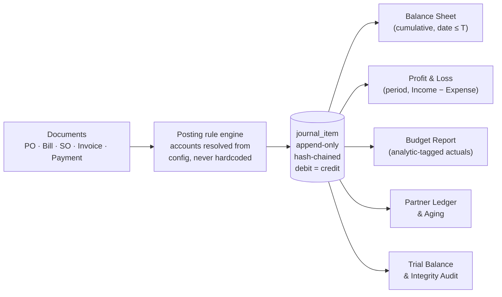

> "Documents go through one posting engine. It writes journal items. Every report — all of them — is an aggregation of that one table. That's why the books tie, that's why the date slider works, and that's why a manual entry shows up everywhere it should.
> Next up: GSTR-1 and 3B export, e-invoice IRN, multi-currency with revaluation, and automated year-end close.
> Thank you."

**Final frame on screen: Books Integrity, Trial Balance ₹0.00, hash chain VALID.**

---

#### Cuts if running long — in this exact order

Rehearse the cuts too. Deciding what to drop while presenting is how demos collapse.

1. Budget **Revise** flow (5s)
2. Budget pacing / projected-overrun commentary (10s)
3. The **lock date** demonstration (12s) — keep the reversal, cut the lock
4. Partial-billing remainder commentary on the PO (10s) — still bill 12, just don't explain it
5. The PDF print click (5s)
6. The **portal login** if it was ever in your run (30s)
7. The kanban/list view toggle (5s)

**Never cut, under any circumstances:**

- The cold-open integrity proof and the 422 from the terminal
- The manual journal entry moving the Balance Sheet
- The bank reconciliation
- The as-of date slider
- P&L Net Income = Balance Sheet Current-Year Earnings
- The reversal on cancel

---

### 10.4 The 60-second version — a judge walks up mid-build

They are standing, they have one minute, they will interrupt. Do not sit them down. Do not open a menu. Four beats, sixty seconds, one hand on the mouse.

**[0:00–0:15] Books Integrity, click Run Audit.**

> "Urban Furniture accounting. Every report in here is derived from one table of journal items — nothing is summed off invoices. That's 352 ledger lines, trial balance zero, assets equal liabilities plus capital to the paisa, computed right now."

**[0:15–0:30] Post the pre-saved manual entry, Dr Cash 50,000 / Cr Capital 50,000, with the Balance Sheet visible.**

> "Manual journal entry, straight into the ledger. Watch the balance sheet — cash up fifty thousand, capital up fifty thousand, both totals move. In an app whose reports read the invoice table, this changes nothing."

**[0:30–0:50] Drag the as-of date slider from September back to April.**

> "And because every report is just a filter on that ledger by date, I get this for free — that's the balance sheet re-deriving at any date in the past. Not cached, not snapshots."

**[0:50–1:00] Close.**

> "The whole build is the spec — purchase order to bill, sales order to invoice, payments, budgets, the three reports — sitting on a real double-entry ledger instead of next to one. Come back at the end and I'll show you the bank statement auto-reconciliation and the tamper detection."

*You just gave them a reason to return. That is the actual goal of the 60-second version.*

---

### 10.5 The 3-minute version

Use this when a judge has time but not a full slot, or when the schedule slips and you are told "you have three minutes".

| Time | Beat | What you cut versus the 5-minute run |
|---|---|---|
| 0:00–0:30 | Cold open: Books Integrity + terminal 422 + manual JE moves the Balance Sheet | Nothing — this is sacred |
| 0:30–1:00 | **Sale flow only**: SO → Create Invoice → Confirm → show the posted entry and the Explain panel | Drop the entire purchase flow, the PO budget warning and the partial payment |
| 1:00–1:45 | Bank statement import and Reconcile All | Nothing |
| 1:45–2:25 | Balance Sheet: 4-level drill-down, then the as-of slider, then P&L Net Income = Current-Year Earnings | Drop the budget report and PDF print |
| 2:25–2:50 | Control moment: no Edit button, Cancel → reversal, then the terminal tamper and broken hash chain | Drop the lock date |
| 2:50–3:00 | One-sentence close on the architecture diagram, final frame Trial Balance 0.00 | Drop the roadmap |

**The one-sentence close for the 3-minute version:**

> "One posting engine, one append-only ledger, every report an aggregation of it — which is why the books tie, why I can time-travel the balance sheet, and why the system catches me when I tamper with it."

---

### 10.6 Judge Q&A

The format below is: **the question as they will actually phrase it**, then **words you can say**. Say them in your own voice, but keep the structure — *lead with the direct answer, then one piece of evidence, then offer to show it.* Never start an answer with "so basically".

#### A. The trust questions (they will ask at least two of these)

**Q1. "Did you hardcode this?"**

> "No, and there's a panel that proves it. Every posted entry has an Explain button that prints the rule trace — which journal default, which product category account, which tax account produced each line. Nothing in the posting engine is an if-statement on document type. Want to change the Sales journal's default receivable account right now and post an invoice?"

**Q2. "What happens if I change a journal's default account?"**

> "The next document posted through that journal uses the new account. Let me do it." *(Chart of Accounts → create `Debtors – Retail A/c` (Asset) → Journals → Sales → Default Account = that → post a new invoice → the entry now credits... shows the new debit account. Then open Explain and point at the line that names the journal.)*
> "Documents already posted don't move, and that's deliberate — history doesn't change retroactively when configuration changes. That's how real accounting systems behave."

*Rehearse this one. It is the single most likely deep probe from an Odoo engineer, and it takes 25 seconds to demonstrate.*

**Q3. "Does your Balance Sheet actually balance? Add it up for me."**

> "It does, and it isn't luck. Total assets ₹10,81,792. Liabilities ₹1,96,192 plus capital ₹8,85,600 — same figure. The reason it ties is that the capital side includes Current-Year Earnings, ₹2,35,600, which is Income minus Expenses computed live from the same ledger. And here's the same number on the P&L. If I'd built the balance sheet by adding up invoices, those two would drift apart the first time anybody posted a manual entry."

**Q4. "What if I post a manual journal entry — say debit Cash five lakh, credit Capital five lakh?"**

> "Please do. Type it in yourself." *(Hand them the keyboard. This is the strongest move available to you.)*
> "It's already reflected — cash up five lakh, capital up five lakh, both totals moved. Manual entries are not a side channel in this system; they're the *only* channel. Invoices and bills are just convenient ways of writing journal entries."

**Q5. "Show me an unbalanced entry being rejected."**

> "Three layers. The UI disables Post while debit ≠ credit. The service layer rejects it. And there's a database check constraint — here's `curl` firing an unbalanced entry straight at the API, bypassing the UI entirely: 422, constraint name `journal_entry_must_balance`. There is no path into the ledger that skips it."

**Q6. "How do I know your seed data isn't just hand-crafted numbers that happen to tie?"**

> "Because the seed script doesn't insert journal items — it creates documents and calls the same posting engine you just watched. Nothing in the seed writes to `journal_item` directly. And the integrity audit recomputes the trial balance from scratch every time you click it; it isn't a stored total."

#### B. The accounting-correctness questions (an Odoo engineer's home turf)

**Q7. "Can you pay half an invoice?"**

> "Yes, and partial is the normal case in the design, not a special case. This bill is ₹16,992; I paid ₹10,000; the badge is Partial and the residual is ₹6,992. There is no boolean `paid` column in the schema — residual is total minus the sum of everything reconciled against it, so it's always right, including if I unreconcile. Want me to pay ₹3,000 more and watch it move to ₹3,992?"

**Q8. "Can I overpay, or pay one payment across three invoices?"**

> "Yes. Payment and invoice are linked through an allocation table, not a foreign key on the invoice — one payment can settle several invoices and one invoice can receive several payments. Overpaying leaves the excess as an unallocated credit on the customer, which the next invoice offers to use."

**Q9. "Can I edit a posted invoice?"**

> "No, and that's on purpose — there's no Edit button on a posted document. Cancel creates a reversing journal entry with mirrored debits and credits, so both the original and the reversal stay in the ledger and the reports self-correct. The instinct everyone has here is to build a Delete button, and a delete silently rewrites history — an auditor could never tell what the books said last week."

**Q10. "What happens if I delete a payment?"**

> "You can't delete a posted one. You can unreconcile it, which removes the allocation and pushes the invoice's residual back up, or you can cancel it, which posts the reversal. Both leave a trail. The invoice's Paid badge recomputes automatically because it was never a stored flag."

**Q11. "How do you handle taxes?"**

> "Tax is a master record, not a number in the code — rate, whether it applies to sales or purchases, inclusive or exclusive, and separate accounts for tax collected and tax paid. GST 18% on a sale posts Dr Debtors 47,200 / Cr Sales 40,000 / Cr Output GST 7,200. On a purchase it's the mirror — Input GST is an asset, because it's money we can claim back. Add a second tax rate and nothing in the posting engine changes."

**Q12. "Rounding — what happens when your line taxes don't add up to the document tax?"**

> "That's the classic off-by-one-paisa bug that breaks the balance constraint. We compute tax per line, round each to two decimals, then compare the sum against the document-level rounding; if they differ, the engine writes an explicit rounding-difference line to a designated account rather than fudging a line total. The Explain panel prints `rounding difference ₹0.00` on every entry so you can see the check ran."

**Q13. "Why store debit and credit as two columns instead of one signed amount?"**

> "Two reasons. The constraint I actually want to enforce is `sum(debit) = sum(credit)` per entry, which is trivial in two columns and awkward in one. And every report, ledger and printout in accounting is presented in debit/credit columns — storing it the way it's read means no sign gymnastics in report queries. Signed amounts are how you end up with a P&L where expenses are negative-negative."

**Q14. "Why is the P&L a period query but the Balance Sheet a cumulative one?"**

> "Because they answer different questions. The P&L asks 'how did we do between two dates', so it sums Income and Expense accounts inside a window. The Balance Sheet asks 'what do we own and owe *right now*', so it sums every journal item from the beginning of time up to that date, for Asset, Liability and Capital accounts. Same table, two different aggregation semantics. Teams that write `SELECT SUM(total) FROM invoices` can't express either of those correctly the moment there's an opening balance."

**Q15. "Where's Retained Earnings? You only have eight accounts."**

> "The eight accounts are the ones the mockup mandates as pre-configured seed. We're inside a single fiscal year, so this year's profit shows as Current-Year Earnings, which is a computed line, not an account. If we rolled into a second year, the report engine already separates it — everything dated before the fiscal-year start collapses into Retained Earnings and only the current year shows as Current-Year Earnings. It's one date comparison in the same query."

**Q16. "What's a lock date and do you have one?"**

> "It's a date before which no one may post, because that period has been filed. We have it — set it to 31 March and any back-dated post is refused with 'Books locked up to 31-Mar-2026 by Admin'. It's the cheapest real control in accounting and almost nobody builds it in a hackathon."

**Q17. "Prove your Debtors figure ties to the actual open invoices."**

> "Click it." *(Balance Sheet → Debtors → Partner Ledger.)* "That's ₹1,00,000 of Debtors broken into six customers, each with a running balance, and each drilling into the individual invoices and the payments against them. The report doesn't compute it from invoices — it's the sum of journal items on the Debtors account — and the fact that it agrees with the open invoice list is the check, not the method."

**Q18. "What if a document is still in draft — does it hit my reports?"**

> "No. Journal items exist only for posted documents. Draft is genuinely not in the books, which is why the dashboard counts Draft and Confirmed separately. It also means the invoice number is allocated at post time, not at draft time, so cancelled drafts don't leave gaps in the numbering."

**Q19. "How does the analytic tag get from the document line into the report?"**

> "It's carried onto the journal item, not read back off the document. The analytic column lives on `journal_item`, so the budget's achieved amount is a sum over tagged ledger lines. That matters for two reasons: a manual journal entry can also carry an analytic tag and it counts, and the tax line correctly doesn't — you'll notice the bill's actual was ₹14,400, the net, not ₹16,992 including GST. GST isn't a project cost; you claim it back."

**Q20. "What does 'Committed' mean on your budget report? That's ambiguous."**

> "Good catch, and we kept both meanings on purpose. The mockup's field labelled *Committed Amount* is the planned amount — what you approved. We kept that name because it's the organizers' word. Then we added a separate column called **Open PO** for the other, real meaning — money promised on confirmed purchase orders that haven't been billed yet. ₹9,600 here, the eight chairs still to come. Planned, encumbered, actual, remaining — that's the full picture a budget owner needs, and confusing the first two is a bug we deliberately avoided by never using one word for both."

**Q21. "Your budget warning let me exceed the budget. Isn't that a bug?"**

> "It's the spec, and it's also correct. The mockup states the warning is non-blocking, on both the purchase order and the bill. The business reason is real — a buyer may have authority to exceed, and hard-blocking a purchase order at 5pm on a Friday is how people start keeping spreadsheets outside the system. So it warns loudly, records the overrun, and turns the budget line red. The blocking validation is on the journal entry itself, where correctness is not negotiable."

#### C. The engineering questions

**Q22. "Why did you choose this stack?"**

> "Next.js and PostgreSQL. Three reasons, in order. First, the accounting rules live in the database, not the app — check constraints for debit-equals-credit, a unique index for the numbering sequence, transactions for atomic posting. Postgres enforces things my code can't accidentally skip. Second, this spec is around 35 screens with an identical list-and-form pattern, so one reusable scaffold generates most of them — that's a framework choice about volume, not taste. Third, it's the stack I'm fastest in, and with 24 hours the ability to debug something at 3am beats any theoretical advantage."

**Q23. "Why didn't you just build this as an Odoo module?"**

> "The brief is to build the system, not to configure Odoo — if I'd built it in Odoo, the ORM would have given me half the things you're checking me on for free, and you'd have no way to tell whether I understood them. Building the ledger from scratch is precisely what makes the posting engine, the balance constraint and the report derivation my work rather than the framework's."

**Q24. "What is the hardest part of what you built?"**

> "The posting engine, and specifically making it configuration-driven instead of a switch statement. The easy version is: if it's an invoice, debit Debtors and credit Sales. That works and it's dead. The real version resolves every account by lookup — journal default, product category, tax configuration, partner — so changing a setting changes the accounting. The second hardest was payment allocation, because the moment you allow partial and multi-invoice payments, every 'is this paid' answer has to become a derived number, and if you get that wrong at hour four you can't retrofit it at hour twenty."

**Q25. "What if two people post at the same time?"**

> "Posting runs in a single database transaction that takes a row lock on the sequence for that journal and year, allocates the next number, writes the entry and its items, and commits. Two simultaneous invoice posts serialize on that lock, so you get 0009 and 0010, never two 0009s and never a gap. A unique index on (journal, fiscal year, number) is the backstop — if the lock logic were ever wrong, the second insert fails loudly instead of quietly duplicating."

**Q26. "How do you know it's right? Did you test it?"**

> "There's a property test that matters more than unit tests here: after every posting operation, re-run the trial balance and assert it's zero. It runs over the whole seed data set, and it's the same code path as the Run Audit button you saw — so the audit isn't a demo prop, it's the test suite exposed in the UI. Beyond that, the three-layer balance check means a bug in the engine surfaces as a failed insert, not as wrong numbers."

**Q27. "Where does AI actually help? Or is it a gimmick?"**

> "There's one hard rule: **AI never touches a number.** It reads text and proposes; deterministic code decides and posts. Concretely, it does two jobs. One, it parses bank statement narrations — 'UPI CR 16992 AZURE FURN RTN' is not something a regex handles well across banks — and proposes a partner and a reference; the actual matching, amount comparison and posting are ordinary code with a confidence score you can see. Two, natural-language search over the ledger — 'show me everything on Project 1 in August' becomes a filter, and the query it built is displayed so you can check it. If you unplug the API key, the app still balances, still posts and still reports. That's the test of whether AI is a gimmick."

**Q28. "How is this different from the other teams doing this problem?"**

> "Most implementations of this brief have a journal entry table that gets written to and read by nothing — the reports are `SELECT SUM(total) FROM invoices`. It looks identical to mine in a scripted demo and it falls apart the second you post a manual entry or ask whether the balance sheet ties. My whole architecture is the opposite direction: documents write to the ledger, and every report, including the budget, is an aggregation of it. Everything else I showed you — the date slider, the drill-down, the tamper detection — is a consequence of that one decision, not a separate feature."

**Q29. "What would you build next?"**

> "In order: GSTR-1 and GSTR-3B export, because that's what actually makes this usable for an Indian business; e-invoice IRN generation; multi-currency with foreign-exchange revaluation at period end; and automated fiscal year close that rolls Current-Year Earnings into Retained Earnings and posts the closing entry. After that, bank feeds instead of CSV upload. None of those need a schema change, which is the point — they're all new readers and writers of the same ledger."

**Q30. "What's missing / what would you do differently?"**

*Answer honestly and specifically. Vagueness here reads as not knowing your own build.*

> "Three things. There's no multi-company or multi-currency — one company, rupees only, and the schema would need a currency and rate table to change that. Analytic distribution is 100% to one account per line rather than a percentage split across several. And the stock side is a movement ledger with moving-average cost, but I don't post a cost-of-goods-sold entry on a service product, which is correct but means the gross-margin report is only meaningful for goods. I'd rather tell you those than have you find them."

**Q31. "Can a portal customer see someone else's invoice?"**

> "No. Portal access is filtered at the query level by the contact linked to that login, not by hiding buttons in the UI. Changing the invoice id in the URL returns a 404, not someone else's invoice — I can show you that in five seconds."

**Q32. "Show me the schema."**

> "The centre of it is three tables. `journal_entry` — date, journal, reference, state. `journal_item` — entry, account, partner, analytic, debit, credit, and the hash. `payment_allocation` — payment, invoice, amount. Everything else is master data feeding those, and every report is a query over `journal_item` joined to `account` on account type. If you removed every document table tomorrow, the books would still be complete and every report would still work. That's the test I designed to."

---

### 10.7 Things to NEVER say

Each of these costs you real points. Some of them cost you the round.

| Never say | Say instead |
|---|---|
| "That part is hardcoded for the demo." | Nothing is. If something genuinely is, don't show it. |
| "We didn't have time for that." | "That's out of scope for this build — it's the next thing on the list, and it doesn't need a schema change." |
| "It should work…" | Either it works and you show it, or you move on. Never narrate uncertainty. |
| "Let me just create a contact first…" *(then typing a form on stage)* | Everything is pre-seeded. Never fill in a form live. Typing is dead air and dead air is where a judge starts reading their phone. |
| "This is basically Odoo but simpler." | "Odoo solves this with a posting engine and an immutable ledger; that's the architecture I built." Never invite a direct comparison you will lose. |
| "I'm not sure how that works, my teammate built it." | You are a team of one plus an AI. You built all of it. Know all of it. |
| "It's just a hackathon project." | Never diminish it. The judge is deciding how seriously to take you. |
| "Sorry, this is a bit slow / sorry about the UI." | Never apologise unprompted. Judges do not notice half of what you would apologise for until you point at it. |
| "The AI generates the accounting entries." | "AI never touches a number. It reads text and proposes; the ledger decides." |
| "Our balance sheet balances because we made the seed data balance." | "It balances because Current-Year Earnings is computed from the same ledger — here's the same figure on the P&L." |
| "Let me show you the contacts module." | Never open master data unless asked. If asked: show it in 10 seconds and get back to the ledger. |
| Reading numbers off the screen in a monotone | Say what the number *means*: not "47,200" but "forty-seven thousand owed to us by Nimesh". |

**Two behavioural rules for the same list:**

- **Never click something you haven't rehearsed.** If a judge asks for something you can't do in one click, say "I can show you that — give me twenty seconds" and do it deliberately, or say "that one I'd have to walk you through in the code."
- **When something breaks, do not debug on stage.** Say "let me come back to that" once, move to the next beat, and carry on. A single calm sentence costs you nothing; two minutes of frowning at a stack trace costs you the demo.

---

### 10.8 If something goes wrong

| What breaks | What you do | What you say |
|---|---|---|
| App won't load / server died | Switch to the recorded run, keep narrating live | "I've got the run recorded here too — let me walk you through it so we don't burn your time, and I'll get you into the live one after." |
| A number looks wrong on screen | Do NOT explain it. Go to Books Integrity and run the audit. | "Let me show you the check that matters — trial balance is zero, so the ledger is consistent; that display is a filter question, not a books question." |
| Bank CSV already imported (duplicate) | You kept a pristine copy — use `bank_statement_15sep_backup.csv` | Say nothing about it. |
| A judge takes over the keyboard and breaks something | Let them. This is a gift, not a problem. | "Please — try to break it. That's the point." |
| You run out of time mid-beat | Stop where you are and jump straight to the close | "I'll leave the tamper detection — but the important thing is this last frame: trial balance zero, chain valid, every report derived from that one table." |
| Judge asks a question you cannot answer | Say so in one sentence and offer the nearest thing you *do* know | "I don't know that one honestly. What I can tell you is how the closest case works —" *(never bluff an accounting rule at an Odoo engineer; they will know)* |

---

### 10.9 ONE-PAGE CHEAT SHEET

*Print this. Fold it. Hold it. Look at it right before you start.*

#### The one sentence

> **"Urban Furniture Accounting: every document posts into one append-only double-entry ledger, and every report — Balance Sheet, P&L, Budget — is derived from that ledger, never summed from invoices."**

#### The four demo moments (if you only get four things right)

1. **Cold open** — Trial Balance ₹0.00 across 352 items, `curl` gets a 422 from a database constraint, manual journal entry visibly moves the Balance Sheet. *(0:00–0:35)*
2. **Bank reconciliation** — 8 messy narrations, 6 auto-matched with visible confidence and signals, Reconcile All, Debtors drains. *(2:20–3:05 — the loudest 45 seconds; protect it)*
3. **Date slider + the equality** — drag September→April and the whole Balance Sheet re-derives; P&L Net Income ₹2,35,600 = Balance Sheet Current-Year Earnings ₹2,35,600. *(3:05–3:55)*
4. **Self-attack** — no Edit button, Cancel posts a reversal, `UPDATE journal_item` from the terminal, hash chain names the broken row. *(3:55–4:35)*

#### Numbers to memorize

| | ₹ |
|---|---:|
| Opening Total Assets = Liabilities + Capital | 9,92,000 |
| Closing Total Assets = Liabilities + Capital | 10,81,792 |
| Closing Liabilities | 1,96,192 |
| Closing Capital + Current-Year Earnings | 8,85,600 |
| Net Income (P&L) = Current-Year Earnings (BS) | 2,35,600 |
| Journal entries / journal items / trial balance | 41 / 352 / **0.00** |
| Vendor bill posted on stage (12 chairs) | 14,400 + 2,592 GST = **16,992** |
| Paid on that bill / residual | 10,000 / **6,992** |
| Customer invoice posted on stage | 40,000 + 7,200 GST = **47,200** |
| Bank statement reconciled | 2,05,200 (Debtors 3,05,200 → 1,00,000) |
| Budget Project 1: planned / achieved / % / open PO | 1,60,000 / 1,62,400 / **101.5%** / 9,600 |

#### Five sentences you can drop into any answer

1. "Every number comes from one table — `journal_item`."
2. "There's no `paid` boolean anywhere in the schema; residual is derived."
3. "Current-Year Earnings is why the balance sheet balances."
4. "You can't edit a posted entry — Cancel posts a reversal, and both stay in the ledger."
5. "AI never touches a number. It reads text and proposes; the ledger decides."

#### Final pre-flight

- [ ] Seed re-run, audit green, numbers above verified this morning
- [ ] 7 tabs open in order, second window parked on the right
- [ ] Terminal cleared, both commands in shell history
- [ ] CSV on desktop, backup copy in a folder
- [ ] Recording saved as insurance
- [ ] Zoom 110%+, notifications off
- [ ] Rehearsed to 4:30
- [ ] First words memorized: *"Before I show you anything, I want to show you that it's real, because in accounting that's the only question that matters."*

---
