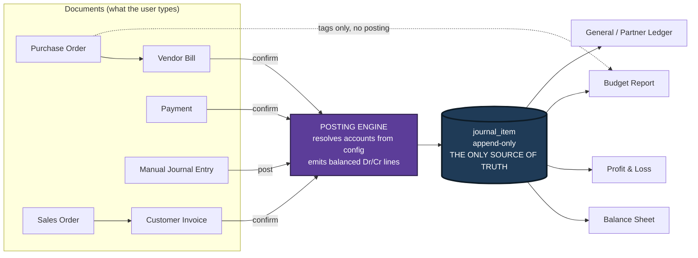

# The Decision and What We Are Building

> Read this section first. Everything else in this document assumes the decisions made here.
> Reading time: about 14 minutes. Nothing here needs any accounting knowledge — every term is
> glossed the moment it appears.

---

> ### 📖 YOUR FIRST HOUR — the reading path
>
> This document is ten sections and it is far more than an hour of reading if you read it all.
> Do not read it all. Read **this** path first, in this order, and open the rest as reference
> while you build:
>
> | Order | What to read | Minutes | Why |
> |---|---|---:|---|
> | 1 | **This section**, all of it | 14 | The architecture decision and the one sentence that wins the demo |
> | 2 | *Accounting Explained From Zero* — §§2.1 to 2.8 (skip the glossary for now) | 25 | The eight ideas that make the code write itself |
> | 3 | *The Core Engine* — §5.1, §5.3, §5.4, §5.13 | 15 | The one hard component, and its pseudocode |
> | 4 | *The Demo Script and Judge Q&A* — §10.9, the one-page cheat sheet | 5 | What you will actually say out loud |
>
> That is 59 minutes and you will be able to start building.
>
> **Open later, while building, never front-to-back:** *Complete Requirements* (§3) is a
> checklist you tick, not prose you read. *The Data Model* (§4) is the schema you copy at
> hour 2. *Tech Stack, Architecture and Optimizations* (§8) is the scaffold you copy at hour 3.
> *The 24-Hour Build Plan* (§9) is the clock — pin it to a second monitor. *What Makes Us Win*
> (§6) and *Where AI Genuinely Makes This Better* (§7) matter from hour 14 onwards.

---

## 1. What we are building, in one paragraph

We are building the **accounting brain of a furniture business**. Urban Furniture buys tables
and chairs from suppliers, sells them to customers, and pays and gets paid by cash or bank.
Our app lets one person record all of that — who the customers and vendors are, what the
products are, a purchase order, a supplier's bill, a sales order, a customer's invoice, and
every payment — and then, without anyone typing a single number into a spreadsheet, the app
produces the three documents an owner actually cares about: **how much money the business has
and owes** (the Balance Sheet), **whether it made a profit this year** (the Profit & Loss
report), and **whether it is staying inside its planned spending** (the Budget report). The
trick — and the entire reason this is a hard problem rather than a form-filling exercise — is
that those three reports are *not* allowed to be built by adding up invoices. They must be
built out of the **ledger**: a single, permanent, tamper-resistant list of two-sided money
movements that every document writes into. Get that one thing right and this app is a real
accounting system. Get it wrong and it is a very pretty invoice list.

### 1.1 The same idea, with real rupees

Forget accounting words for thirty seconds. Here is the whole concept.

Every time money or value moves, **two things change, by the same amount, in opposite
directions.**

You sell a table to Mr. Rahul for ₹6,000 on credit.

| What changed | Direction | Amount |
|---|---|---|
| "Money customers owe us" went **up** | Debit | ₹6,000 |
| "Sales income we earned" went **up** | Credit | ₹6,000 |

That pair of lines is called a **journal entry**. Each line is a **journal item**. "Debit" and
"credit" are just the names of the left and right side — think of them as the **left column**
and the **right column** of a two-column notebook. (They are *not* plus and minus, and they are
*not* good and bad. Section 2 explains why in one page.) The rule that both sides must total
the same is called **double-entry**, and it is 530 years old.

Now Rahul pays ₹6,000 into your bank account:

| What changed | Direction | Amount |
|---|---|---|
| "Bank" went **up** | Debit | ₹6,000 |
| "Money customers owe us" went **down** | Credit | ₹6,000 |

Two entries, four lines, and now the ledger already knows *everything*:

- Bank balance = add up every line touching Bank → ₹6,000.
- Customers owe us = ₹6,000 − ₹6,000 = ₹0.
- Income this year = ₹6,000.

Nobody read the invoice table to get those three numbers. **That is the whole architecture.**
The reports are just different ways of adding up the same four lines.

The buckets — "Bank", "Money customers owe us", "Sales income" — are called **accounts**, and
the master list of them is the **Chart of Accounts**. The organizers' mockup pins down exactly
**eight** of them that must ship pre-loaded:

> Bank A/c · Cash A/c · Debtors A/c (money customers owe us) · Creditors A/c (money we owe
> suppliers) · Sales Income A/c · Purchase Expense A/c · Other Expense A/c · Capital A/c (the
> owner's own money in the business).

We ship **twelve**: those eight, plus four of our own — **Input GST A/c** and **Output GST
A/c** (because the PDF's Sales Order row lists a `Tax` field, and tax money is not income),
and **Retained Earnings** and **Current Year Earnings** as non-postable label rows on the
Balance Sheet. Every one of the four extra accounts is tagged `[ADDITION]` in *Complete
Requirements* §3.9 with its justification. **Never present the extra four as if the organizers
asked for them** — present them as the four things the drawn Balance Sheet cannot tie without.

If any of the above was new to you, *Accounting Explained From Zero* walks through all five
transaction types line by line. You do not need more than the two tables above to understand
the rest of *this* section.

---

## 2. Why this problem statement, and not the other two

Three problem statements were on the table. We ran three rounds of analysis. This one won, and
it was not close. Here is the reasoning in plain terms, because you will be asked "why did you
pick accounting?" at least twice during the event.

| | **Urban Furniture Accounting** (chosen) | **DealFlow360** (Sales) | **PeoplePay360** (HR/Payroll) |
|---|---|---|---|
| Screens to build | **~30–38** (mostly simple list + form) | ~18 | ~33 |
| Genuinely hard **engines** (see below for what an engine is) | **1** — the posting engine, plus the reports derived off it | **~9** — e.g. "which warehouse ships these 8 chairs?", "does this discount need finance approval?", "how do we split a bill that is part subscription and part usage?" | **~14** — including a salary-rule interpreter, which is a small programming language with its own dependency graph |
| Second app to build | No | **Yes** — a separately-authenticated customer portal, mandated in writing | No |
| Est. minimum viable hours (prior analysis) | **22** | 55 | 34 |
| Est. hours to actually win | 33 | 80 | 55 |
| Completion risk (1–10, higher = worse) | **5** | 8 | 8 |
| How many teams pick it (1–10) | **4 — lowest** | 5 | 8 — highest |
| Is "correct" objectively checkable? | **Yes — the books balance or they don't** | No — subjective | Partly |

### 2.1 The screens-vs-engines argument, in simple words

A **screen** is a page: a list of contacts, a form to add a product, a table of journal
entries. Screens are *repetitive*. Once you have built one list-and-form pair properly, the
twentieth one is the same shape with different column names. The organizers' own mockup says
this out loud:

> "All Master will have list view as default and clicking on **New** button it will open blank
> form view to enter new record. Clicking on already saved record — it will open form view with
> saved details."

That single sentence is a gift. It is the organizers telling us: **build one reusable
list/form scaffold and stamp it out.** One good generic component plus a config object per
model, and Contact, Product, Analytic Account, Chart of Accounts, Journal and Journal Entry all
come out of the same machine. This is exactly the kind of work an AI pair programmer multiplies
almost perfectly — the shape is known, the risk per screen is near zero, and a mistake on
screen 14 does not corrupt screen 3.

An **engine** is a piece of logic that makes a *decision* rather than storing a value. Each
engine has its own edge cases, its own wrong answers, and — the killer — each one has to be
**integrated** with the others and then **debugged as a system**. Integration debugging is the
one activity where AI does not multiply a solo developer. You cannot parallelise "why is the
approval chain firing twice when the portal counter-offer re-enters the flow". You just sit
there and read logs. That is human wall-clock time, and we have 19 build hours of it.

So the comparison is really:

- **DealFlow360**: ~18 screens (cheap) + **9 engines** (expensive) + a whole second
  authenticated app (expensive). The screens don't save us; the engines sink us.
- **PeoplePay360**: 33 screens **and** a salary-rule interpreter that is effectively a small
  compiler with cycle detection, plus a leave-balance ledger, plus five-role row-level
  security. Highest saturation too — everyone understands salary, so everyone picks it.
- **Accounting**: ~30–38 screens (cheap, and the mockup mandates the scaffold that makes them
  cheaper) + **exactly one hard engine**.

> **Say this to a judge:** "We picked the statement with the most screens and the fewest engines
> on purpose. Screens are cheap for us — the mockup itself asks for a reusable list/form
> scaffold, so we built one component and stamped out twenty views. Engines are where a small
> team dies, and this statement has exactly one: the posting engine. So we spent our first hours
> getting that single thing genuinely right instead of half-building nine things."

### 2.2 The three secondary reasons

1. **Lowest saturation.** Fewest teams pick accounting, because double-entry sounds
   intimidating to anyone who hasn't done commerce. Fewer competitors in your track means your
   submission is compared against fewer strong ones.
2. **"Correct" is arithmetic here, not taste.** On a sales or HR statement, a judge decides
   subjectively whether your approval flow "feels" right. In accounting, either total debits
   equal total credits and Assets = Liabilities + Capital, or they don't. That is brutal for
   teams that fake it and *enormously* rewarding for a team that doesn't — because we can
   **guarantee** we clear a bar that is arithmetic.
3. **Five hundred years of features to steal from.** Accounting is a mature domain.
   Reconciliation (matching a payment to the invoice it settles), reversal entries, period lock
   dates, aging buckets, tamper-evident ledgers — every one of these is a real feature an Odoo
   engineer will instantly recognise, and no student team will think of them. Differentiation
   headroom is enormous. Those are covered in *What Makes Us Win*.

### 2.3 The one precondition we are accepting

This pick has a non-negotiable cost: **before writing a single form, we spend the first ~60
minutes deriving on paper the exact debit and credit lines for all five transaction types**
(invoice, bill, customer payment, vendor payment, manual entry) and locking the schema so that
`journal_item` is the only source of truth for reports. Teams that start with forms discover at
hour 20 that their reports cannot be built, and no amount of UI polish saves that. This is
planned time, not lost time. *The 24-Hour Build Plan* Phase 1 is exactly this hour.

---

## 3. The core insight that wins this hackathon

Stated bluntly, with no hedging:

> **70–80% of the teams that pick this statement will compute their reports directly from the
> invoice and bill tables. Their journal-entry table will exist, get written to, and be read by
> nothing. It will be decoration.**
> **We derive every single report from journal entries. Nothing else. Ever.**

### 3.1 What "the fake" actually looks like in code

The fake is not laziness — it is the *obvious* thing to do, which is why so many teams do it.
It looks like this:

```sql
-- THE FAKE. This is what 70-80% of submissions will contain.
-- Profit & Loss:
SELECT SUM(total) FROM customer_invoice WHERE state = 'CONFIRMED';  -- "income"
SELECT SUM(total) FROM vendor_bill      WHERE state = 'CONFIRMED';  -- "expense"
-- Balance Sheet:
SELECT SUM(amount) FROM payment WHERE method = 'BANK';              -- "bank balance"
```

It works. It demos fine. The numbers on screen look completely plausible. The `journal_entry`
table is populated on confirm, shown in a nice list view because the mockup demands one, and
then never queried again.

### 3.2 What we do instead

Two notes before you read the SQL, so nothing in it is a surprise:

- Money is stored as **integer paise** in `BIGINT` columns named `debit_paise` and
  `credit_paise` — ₹6,000.00 is stored as `600000`. Floating-point money drifts; integers do
  not. Full reasoning in *The Data Model* §4.4.
- The state column is called `state` and its values are UPPERCASE (`DRAFT`, `POSTED`). Table
  names are snake_case. These conventions are fixed once in *The Data Model* and used
  identically everywhere in this document.

```sql
-- OURS. Every report is an aggregation over one table.

-- Balance Sheet as of date T  (cumulative, from the beginning of time):
SELECT a.type, SUM(ji.debit_paise - ji.credit_paise) AS balance_paise
FROM   journal_item  ji
JOIN   account       a  ON a.id  = ji.account_id
JOIN   journal_entry je ON je.id = ji.entry_id
WHERE  je.state = 'POSTED' AND je.date <= :T
GROUP  BY a.type;

-- Profit & Loss for a period [start, end]  (same table, different window,
-- income/expense accounts only):
SELECT a.type, SUM(ji.credit_paise - ji.debit_paise) AS amount_paise
FROM   journal_item  ji
JOIN   account       a  ON a.id  = ji.account_id
JOIN   journal_entry je ON je.id = ji.entry_id
WHERE  je.state = 'POSTED'
  AND  je.date BETWEEN :start AND :end
  AND  a.type IN ('INCOME','EXPENSE','OTHER_EXPENSE')
GROUP  BY a.type;
```

Two different ways of adding up **the same table**. The Balance Sheet is a *cumulative* sum
with no start date (it is a photograph of the business right now). The P&L is a *window* sum
over one year (it is a video of what happened during that year). This distinction — one table,
two aggregation semantics — is the architecture. It is worth memorising, because saying it out
loud in one sentence is the single highest-value sentence in your demo.



Notice two things about the diagram.

1. There is **no arrow from `customer_invoice` or `vendor_bill` straight to a report.** There is
   no such arrow in our codebase either — see the enforcement note in §3.5.
2. Even the **Manual Journal Entry goes through the posting engine.** It does not sneak
   sideways into the ledger. That is what makes the database-level balance rule apply to it as
   well, and it is why a judge cannot slip an unbalanced entry past us from any direction.

### 3.3 The exact test a judge will run — and it takes 20 seconds

The judges are Odoo engineers. Odoo *is* an accounting system. They have shipped the `account`
module. They know exactly where the bodies are buried, and they will find them with these four
moves. Learn all four, because you should **run them yourself, unprompted, before they ask.**

| # | What the judge does | Fake system does | Our system does |
|---|---|---|---|
| **1** | **"Post a manual journal entry: Debit Cash ₹50,000, Credit Capital ₹50,000. Now show me the Balance Sheet."** | **Nothing changes.** The manual entry never touched the invoice table, and the report reads the invoice table. This is the kill shot and it takes ten seconds. | Cash jumps by ₹50,000, Capital jumps by ₹50,000, the sheet still balances — total assets go from ₹9,92,000 to ₹10,42,000, and so does the other side. |
| **2** | **"Add up your Balance Sheet in front of me. Do Assets equal Liabilities plus Capital?"** | Off by exactly the year's profit, because they never computed Current Year Earnings and pushed it into the equity side. ~90% of teams ship a sheet that doesn't tie. | Ties to the paisa, and we show the equation printed on screen with real figures. |
| **3** | **"Pay half of this ₹6,000 invoice."** | A `paid` boolean flips, or nothing happens. "Partial" is a status they can only set by hand. | Amount Due becomes ₹3,000, the status badge computes to **Partial**, Debtors on the Balance Sheet drops by exactly ₹3,000. |
| **4** | **"Change the Sales journal's default income account, then post a new invoice."** | Identical entry as before — proving the posting logic is a hardcoded `if/else`, not driven by the config table they built a screen for. | The new invoice credits the new account. The config screen is real. |

*(The ₹50,000 / ₹9,92,000 / ₹10,42,000 figures are the seeded demo state. They are fixed in
*The Demo Script and Judge Q&A* §10.1, which is the one place demo numbers are allowed to be
defined. If your seed script prints something different at T−2 hours, the demo section's
numbers change, not the seed.)*

**Why test 1 is the one that matters.** A manual journal entry is money movement that has no
invoice and no bill behind it — the owner putting money in, a bank charge, a rent payment, a
depreciation entry. Every real accounting system supports it, and the mockup explicitly
requires it (the "Journal Entry / Transaction Form" screen with the Post button and a blocking
warning when debits ≠ credits). If your reports read invoice tables, a manual entry is
invisible to them. **There is no way to patch around this at hour 22.** It is an architecture
decision made in hour 1 or never.

### 3.4 The four smaller fakes we also refuse

1. **`paid: boolean` on the invoice.** Instead, Amount Due is *derived*:
   `total − SUM(allocated payments)`, and the Paid / Partial / Not Paid badge is computed from
   it, exactly as the mockup's legend box specifies (`Paid` if due = 0, `Not Paid` if
   due = total, otherwise `Partial`).
2. **Seed data typed in by hand until the numbers happen to tie.** Our seed data is generated by
   *running the app's own posting engine* over ~40 documents. If the engine is wrong, the seed
   data is visibly wrong. We cannot lie to ourselves.
3. **"Cancel" = `DELETE FROM journal_entry`.** In accounting you never delete anything.
   Cancelling a posted document creates a **reversal entry** — a mirror image with the debits
   and credits swapped — and both stay in the ledger forever.
4. **Reports that ignore the account *type*.** The mockup is explicit: account type is the
   routing key ("Each account is assigned an Account Type, which would further be used for how
   the account to be treated and where it appears in reports"). Bank → Balance Sheet Assets.
   Income → P&L. Hardcoding account *names* into report code fails the moment a judge adds a
   ninth account.

### 3.5 How we make the rule impossible to break, even at 4 a.m.

An architectural rule that lives only in your head gets broken at hour 19 when you are tired.
So we enforce it mechanically. Three defences, none of which relies on you remembering
anything:

- **Directory boundary.** All report code lives in `lib/reports/`. A test (`npm test`) greps
  that directory for the strings `customer_invoice`, `vendor_bill`, `sales_order`,
  `purchase_order` and fails the build if any of them appears. If a report file mentions a
  document table, the check fails. *(Details in Tech Stack, Architecture and Optimizations
  §8.4.)*
- **Database-level balance rule.** A **deferred constraint trigger** — a database rule that
  Postgres checks at the *end* of a transaction rather than after each individual row, so a
  half-written entry is allowed mid-transaction but a lopsided one can never be committed —
  named `journal_entry_must_balance`, rejects any *posted* entry where
  `SUM(debit) != SUM(credit)`. Not an application check that a bug can route around: a database
  check that a `psql` session cannot route around either. **Draft entries are exempt** — you
  must be able to save a half-typed entry — and that is exactly what the mockup's "blocking
  warning" on the **Post** button means.
- **Append-only journal items.** No UPDATE, no DELETE on rows belonging to a posted entry, held
  by a trigger. Corrections happen through reversal entries.

The payoff: you can hand the laptop to a judge and let them try to break it. That is a very
different demo from one where you steer.

---

## 4. The one hard engine, named

Everything above rests on a single component. Name it out loud, and use its name consistently
in the code and in the demo:

**The posting engine.** One function, `postDocument()`, in one file,
`lib/services/posting.ts`. Input: any document (invoice, bill, payment, manual entry). Output:
a set of balanced journal items. It resolves *which* accounts to use by **reading configuration
rows** — the journal's default account, the account set on the document line, the contact's
receivable/payable account — never by an `if (documentType === 'invoice')` chain.

That is why test 4 in the table above passes: change the config row, the output changes. The
full design, the resolution order, the rounding strategy and the pseudocode live in *The Core
Engine*. Do not build anything else until that engine posts a correct invoice, a correct bill
and a correct payment.

Everything else in this build — all 30-plus screens, the sequences, the smart buttons, the
kanban views, the badges — is *plumbing around one correct engine.* That framing keeps the 19
hours honest.

---

## 5. What good looks like at hour 24

This is the acceptance checklist and the priority order. **Cut work from the bottom of the
list, never from the top.** The tier names below (T0 / T1 / T2 / T3) are used again as prefixes
on the flat checklist in *Complete Requirements* §3.14, so the two documents agree item by
item.

Three words appear below that you may not have met yet, glossed here rather than three sections
later:

- **equity** — the owner's side of the Balance Sheet: the money the owner put in (Capital) plus
  the profit the business has kept.
- **smart button** — a small button in a form's top-right corner that jumps to a related record
  (the `PO` button on a bill; the `Budget` button on an invoice).
- **kanban view** — the same records shown as cards instead of table rows. The mockup demands
  both a list and a kanban for Contact, Product, Analyticals and the Budget Report.

**Tier 0 — the spine. Without these there is no submission.**

- [ ] `journal_item` is the only table any report reads. Verified by the grep test in §3.5.
- [ ] Confirming a Vendor Bill auto-creates a balanced journal entry: Dr Purchase Expense /
      Cr Creditors, dated from the **bill's** date (not today), on the **Purchase** journal —
      all three exactly as the mockup annotates.
- [ ] Confirming a Customer Invoice auto-creates a balanced entry: Dr Debtors / Cr Sales
      Income, on the **Sales** journal.
- [ ] A manual journal entry can be posted, is **blocked** when debits ≠ credits, and
      immediately moves the Balance Sheet.
- [ ] Balance Sheet balances: Total Assets = Total Liabilities + Capital, including Current
      Year Earnings pushed into the equity side.
- [ ] P&L computes exactly per the mockup's formula box: Income from Sales = total of account
      type `INCOME`; Purchase Expense = total of type `EXPENSE`; Other Expense = total of type
      `OTHER_EXPENSE`; Net Income = Income − Expenses.
- [ ] Payments: partial payment works, Amount Due is derived, the Paid / Partial / Not Paid
      badge is computed and mutually exclusive.
- [ ] Chart of Accounts ships pre-seeded with the eight named accounts (plus our four
      `[ADDITION]` accounts); Journals pre-seeded with the four named journals (Sales,
      Purchase, Bank, Cash) each wired to its default account.

**Tier 1 — the spec surface a judge will tick off screen by screen.**

- [ ] Login / Sign Up / **Create User (admin)** with the exact credential rules from the mockup
      (login id unique, 6–12 chars; password > 8 chars with a lowercase, an uppercase and a
      special character) and the exact error string **"Invalid Login Id or Password"**.
- [ ] Master data: Contact, Product, Analytic Account each with **list view (default) + kanban
      view + form view** and a working two-way view switcher; image upload showing in both list
      and kanban.
- [ ] PO → Vendor Bill and SO → Customer Invoice conversions carrying vendor/customer, product,
      price and quantity forward.
- [ ] Auto sequences in the exact drawn formats: `PO0001` and `SO0001` with **no year
      segment**, `Bill/2026/0001` and `INV/2026/0001` **with** one — and each separate from the
      user-typed Reference field.
- [ ] Conditional smart buttons: the PO/SO button appears only when the document was created
      from a source order, hidden when created fresh.
- [ ] Budget: Draft → Confirm → Revised → Cancelled state machine; Revise **creates a new
      record**, moves the old one to Revised, links both ways, and appends the word " Revised"
      to the name; Achieved Amount / Achieved % / Amount To Achieve visible only when
      Confirmed.
- [ ] Budget Report in list **and** kanban views, with the per-row pie chart (Achieved vs
      Balance).
- [ ] Non-blocking over-budget warning on confirming a PO **and** on confirming a Bill — warn,
      then let the user proceed. Two hook points, same message, exact wording.
- [ ] PDF download on the P&L and Balance Sheet Print buttons.
- [ ] Dashboard with live state counters (Sales All / Confirmed / Draft, Purchase All /
      Confirmed / Draft, Budget Achieved / Budget / Committed).
- [ ] All 16 mega-menu destinations resolve, including the **Receipt** and **Payment** menu
      entries (one `payments` table, two filtered lists).

**Tier 2 — the differentiators that turn "complete" into "winner".** (Detailed in *What Makes
Us Win*; listed here so hour-24 expectations are honest.)

- [ ] A **Books Integrity** page: re-verifies every entry balances, prints Trial Balance 0.00,
      prints the accounting equation with live figures.
- [ ] **Bank statement CSV import with scored auto-reconciliation** — the loudest 45 seconds of
      the demo.
- [ ] **Drill-down with no dead ends:** Balance Sheet number → ledger → document → its journal
      entry → the payment.
- [ ] **As-of date slider** on the Balance Sheet that re-derives the whole report at any past
      date.

**Tier 3 — cut without guilt if the clock demands it.** Portal role for the Contact actor;
email send from the payment gear menu; Forgot Password page; reversal-on-cancel and the period
lock date (both are on the build plan's bench); stock/COGS reporting.

> **Non-negotiable process gate:** features freeze at **T+18 of 24 — that is T−6 hours** — see
> *The 24-Hour Build Plan*, GATE 3. The last six hours are hardening, seed data, deployment and
> **three timed rehearsals**. The demo is the scoring surface, not the repo. Two extra hours of
> features is the difference between one rehearsal and three, and the rehearsals are worth more.

---

## 6. The 60-second elevator pitch

Use these words when a judge walks up mid-event. Do not improvise the first two sentences —
they do all the work. Have the Books Integrity page and the Balance Sheet already open in two
tabs.

> "This is a double-entry accounting system for a furniture business — purchase orders, vendor
> bills, sales orders, customer invoices, payments, budgets, and the three reports: Balance
> Sheet, Profit & Loss, and Budget.
>
> Here's the part that matters. Most systems you'll see today compute their Profit & Loss by
> adding up the invoice table. Ours can't — it's architecturally incapable of it. Every document
> we confirm goes through one posting engine that writes balanced debit and credit lines into a
> single append-only table, `journal_item`. Every report is a pure aggregation over that one
> table. The Balance Sheet is a cumulative sum up to a date; the P&L is a window sum over a
> period. Same table, two semantics.
>
> Let me prove it rather than claim it. *(Post a manual journal entry: Dr Cash ₹50,000 /
> Cr Capital ₹50,000.)* No invoice, no bill — just a journal entry. *(Switch tab.)* Balance
> Sheet moved — assets went from nine lakh ninety-two thousand to ten lakh forty-two thousand —
> and it still balances: Assets equal Liabilities plus Capital, to the paisa. A system that sums
> invoices shows nothing there.
>
> And it's config-driven, not hardcoded — change the Sales journal's default account and the
> next invoice posts to the new one. Want to try and break it?"

**Timing:** roughly 55 seconds spoken at a calm pace. The pause while you post the manual entry
is the strongest three seconds you own — do not fill it with talking.

**Three follow-up questions you will get, and the one-line answers:**

| They ask | You say |
|---|---|
| "Does it handle partial payments?" | "Yes — Amount Due is derived from allocated payments, never a boolean. Pay half and the badge computes to Partial and Debtors drops by exactly that half." |
| "What happens if I cancel a posted invoice?" | "There's no Edit button on a posted document. Cancel generates a reversal entry — mirrored debits and credits — and both stay in the ledger. In accounting you never delete anything." |
| "Where does the Budget's Achieved amount come from?" | "Journal items tagged with that analytic account, filtered to the budget period and to profit-and-loss accounts. Income achievement from sales invoices, expense achievement from vendor bills — the direction the mockup specifies. Computing it from the ledger rather than from invoice totals also means GST is excluded automatically, which is the correct answer." |

The full five-minute script, the thirty-one anticipated questions and the one-page cheat sheet
are in *The Demo Script and Judge Q&A*.

---

## 7. What this section deliberately leaves to others

So you know where to look next, and so we do not repeat ourselves. These are the exact section
titles:

| Section | What it owns that this section does not |
|---|---|
| **Accounting Explained From Zero** | Debit/credit for all five transaction types worked in rupees, tax explained from zero, the accounting equation proof, the glossary. |
| **Complete Requirements — Everything We Must Build** | Every screen, every field, all 62 hidden requirements found in the drawing, the contradictions and our rulings, the flat checklist. |
| **The Data Model** | Every table, column and constraint — including `payment_allocation`, the join table that makes partial payments possible and that teams cannot retrofit later. It is the **owner of the naming and type conventions** used across this whole document. |
| **The Core Engine — Posting and Reports** | The config resolution order, pseudocode, rounding strategy, the report algorithms and the balance constraint. |
| **What Makes Us Win — Beyond the Spec** | The Books Integrity page, bank reconciliation, the as-of slider, drill-down, and what to build only if you are ahead. |
| **Where AI Genuinely Makes This Better** | The two AI features that earn their place, and the sentence to say when they are cut. |
| **Tech Stack, Architecture and Optimizations** | The stack choice, the folder layout, and the list/form scaffold that turns 30 screens into config files. |
| **The 24-Hour Build Plan** | The clock. Phases, gates, the seed-data plan, and the exact cut order when we fall behind. **It is authoritative on time — where any other section quotes hours, this one wins.** |
| **The Demo Script and Judge Q&A** | The five-minute script, the numbers you say out loud, and the answers. **It is authoritative on demo figures.** |
