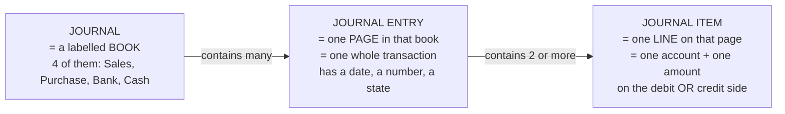
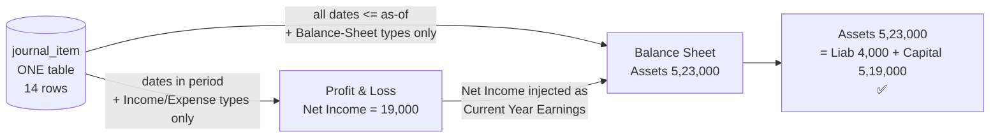
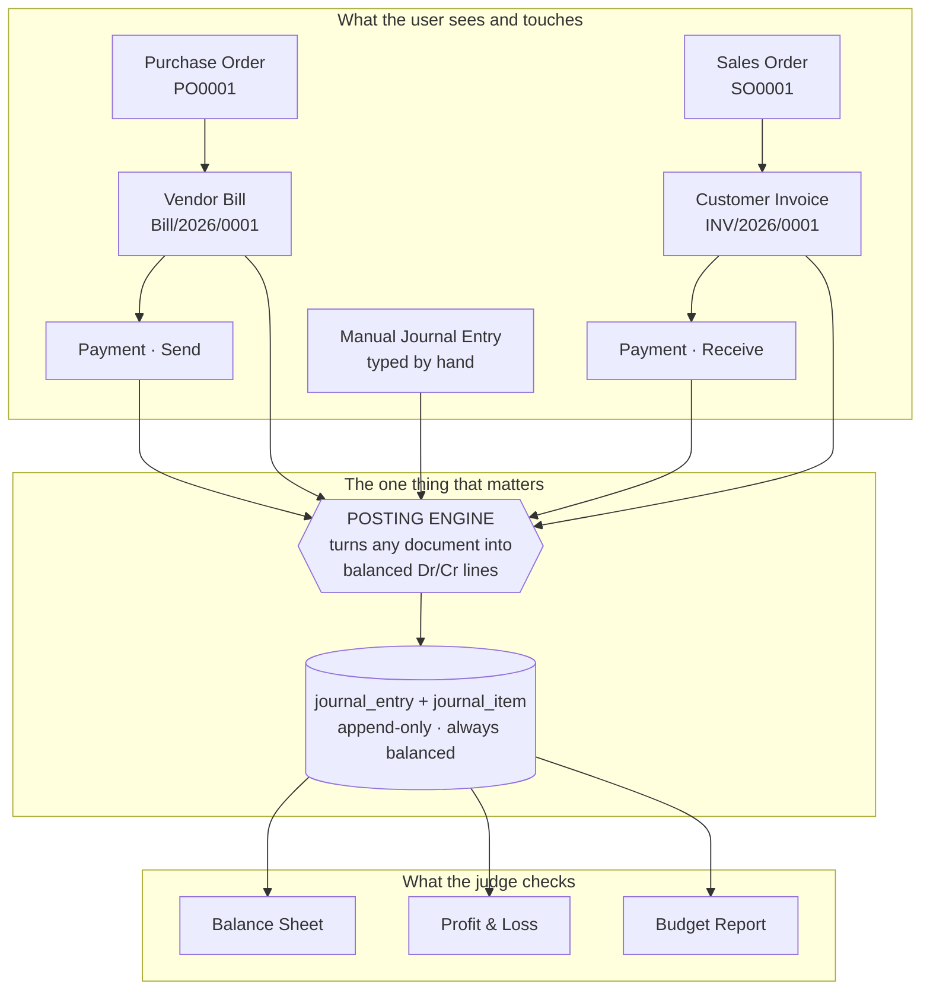

# Accounting Explained From Zero

> **Read this section once, slowly, before you write a single line of code.**
>
> You are about to build an accounting system. You do not need to become an accountant. But you
> *do* need to understand about eight ideas properly, because those eight ideas are the entire
> architecture. If you understand them, the code writes itself and the reports come out correct
> by construction. If you don't, you will end up writing `SELECT SUM(total) FROM invoices` —
> which is exactly the mistake that 70–80% of the other teams will make, and exactly the mistake
> an Odoo judge can spot in twenty seconds.
>
> Everything in this section is explained from zero. Every term is defined the first time it
> appears. Every number is a real rupee number you can check with a calculator.
>
> **If you only have 25 minutes:** read §2.1 → §2.8 and stop. §2.9 (analytics and budgets) can
> wait until you build the budget screens; §2.12 is a glossary to look things up in, not to
> read.
>
> **Where you see a box like this:**
>
> > 🎤 **SAY THIS TO A JUDGE** — a sentence or two you can say out loud, word for word, if a
> > judge walks up and asks a domain question. These are written to be said, not read.

---

## 2.1 What a business actually needs to track, and why

Meet the running example we use for the whole document.

**Urban Furniture** is a furniture shop. It buys tables, chairs and sofas from suppliers, and
sells them to customers. It has a bank account, a cash drawer at the counter, and one owner who
put money in to start the shop.

Here is a normal week at Urban Furniture:

| Day | What happened | Money moved? |
|---|---|---|
| Mon | Owner puts ₹5,00,000 of his own money into the shop's bank account | Yes, in |
| Tue | Orders 20 wooden chairs from Azure Furniture at ₹1,200 each | **No** — just a promise |
| Wed | Chairs arrive with a bill for ₹24,000, payable in 30 days | **No** — but the shop now *owes* ₹24,000 |
| Thu | Pays Azure ₹20,000 by bank transfer | Yes, out |
| Fri | Walk-in customer buys a dining table for ₹6,000, pays cash | Yes, in |
| Fri | Nimesh Pathak buys 5 office chairs for ₹40,000, will pay next month | **No** — but Nimesh now *owes* ₹40,000 |
| Sat | Pays shop rent ₹3,000 in cash | Yes, out |

Now ask the owner four questions:

1. **How much money do I have right now?** (Bank + cash drawer.)
2. **How much do people owe me?** (Nimesh owes ₹40,000.)
3. **How much do I owe other people?** (Azure is still owed ₹4,000.)
4. **Did I make money this month, or lose it?**

Notice something important. Question 4 is **not** "how much cash came in minus how much went
out". The shop sold ₹46,000 of furniture on Friday but only ₹6,000 of it arrived as cash. A
bank balance tells you nothing about whether the business is profitable.

That gap — between *cash moving* and *value being earned or owed* — is the entire reason
accounting exists. Accounting is a bookkeeping method that tracks **promises** and **money** in
the same system, so that all four questions have exact answers at any moment.

The method that does this is called **double-entry bookkeeping**. It was formalised in Venice
and written down by a monk named Luca Pacioli in 1494. It has not needed a major change in 530
years. That should tell you it is worth understanding rather than working around.

> 🎤 **SAY THIS TO A JUDGE**
> "The whole point of the system is that cash movement and value movement are different things.
> Nimesh took ₹40,000 of chairs on Friday and paid nothing. Our bank balance didn't move, but
> our Debtors went up ₹40,000 and our Sales Income went up ₹40,000 — and the books still
> balanced. That's why we post journal entries instead of just tracking payments."

---

## 2.2 Double-entry bookkeeping: why everything is written twice

### The core idea, in one sentence

**Every transaction is written down twice: once for where the value came FROM, and once for
where the value went TO.**

That's it. That is double entry. The rest is vocabulary.

Think of it like a physics law. Money and value don't appear from nowhere and don't vanish. If
₹6,000 shows up in the cash drawer, it came from *somewhere* — in this case, from selling a
table. So you record two facts, not one:

```
Cash drawer went UP by  ₹6,000     ← where it went TO
Sales earned went UP by ₹6,000     ← where it came FROM
```

Two numbers, always equal. Written on one record, side by side.

### What "debit" and "credit" ACTUALLY mean

Forget everything you half-remember from school. Here is the truth, which nobody tells you
plainly:

> **"Debit" means the LEFT column. "Credit" means the RIGHT column. That is all they mean.**

They are not "good" and "bad". They are not "plus" and "minus". They are not "money in" and
"money out". They are just the names of the two columns on the page, chosen in Italy in the
1400s. *Debit* comes from Latin *debere* ("he owes"); *credit* from *credere* ("he trusts").
Those original meanings are now irrelevant. They are column labels.

Every accounting record looks like this:

| Account | **Debit** (left) | **Credit** (right) |
|---|---:|---:|
| Cash A/c | 6,000 | |
| Sales Income A/c | | 6,000 |
| **Total** | **6,000** | **6,000** |

The two totals must match. Always. No exceptions, ever, in any correct accounting system on
earth.

### The practical rule that actually helps you

Here is the working rule you will use a hundred times while building this app:

> **CREDIT = where the value came FROM (the source).**
> **DEBIT = where the value went TO (the destination).**

Try it on the cash sale. The value *came from* making a sale, so `Sales Income` is credited.
The value *went to* the cash drawer, so `Cash` is debited. Correct.

Try it on paying the vendor ₹20,000. The value *came from* the bank, so `Bank` is credited. The
value *went to* wiping out part of what you owe Azure, so `Creditors` is debited. Correct.

This "from → to" rule gets you the right answer for every one of the transactions Urban
Furniture will ever record. Memorise it.

### The mechanical rule (the lookup table)

When you're coding, you want a table, not a metaphor. Here it is. Read it as "to make this kind
of account go **up**, put the amount in this column":

| Account family | To INCREASE it | To DECREASE it | Its normal side |
|---|---|---|---|
| **Asset** (Cash, Bank, Debtors) | Debit | Credit | Debit |
| **Expense** (Purchase Expense, Rent) | Debit | Credit | Debit |
| **Liability** (Creditors) | Credit | Debit | Credit |
| **Capital** (Owner's money) | Credit | Debit | Credit |
| **Income** (Sales Income) | Credit | Debit | Credit |

Two families increase on the **debit** side: **Assets and Expenses**. Three families increase
on the **credit** side: **Liabilities, Capital and Income**. That split is the single most
useful fact in this document, and it will reappear in §2.6 as the reason the Balance Sheet
balances.

A memory hook that works: **"A-E-D"** — **A**ssets and **E**xpenses are **D**ebit-natured.
Everything else is credit-natured.

### Why they MUST be equal

Because they describe the same event from two sides. If ₹6,000 of value went somewhere, ₹6,000
of value came from somewhere. Writing down a different number on each side would be like saying
a train left Mumbai with 200 passengers and arrived in Pune with 150 — you'd know instantly that
you'd lost track of something.

So the system enforces it as a hard law:

```
For every POSTED journal entry:   SUM(debit of all lines)  ==  SUM(credit of all lines)
```

The organizers' mockup states this in red ink, twice, in two different places:

- On the manual journal entry screen: *"Blocking warning if the debit and credit amount don't
  match"* — you literally cannot press Post.
- On the invoice and bill confirm notes: *"The Journal Entry should always be balanced / That is
  the debit and credit totals need to match"*.

This is not a suggestion. In our build it is a **database-level constraint**, not just a
JavaScript check. Note the word **POSTED** in the rule above: a **draft** entry — one you are
still typing — is allowed to be lopsided, because otherwise you could not save a half-finished
entry at all. The rule binds at the moment you press **Post**, which is exactly what the
mockup's "blocking warning on Post" means. (*The Core Engine* §5.2.3 and *The Data Model* §4.8
show the trigger; here you just need to know why it's non-negotiable.)

---

## 2.3 Four worked examples with real rupees

These four are the entire transaction vocabulary of Urban Furniture. Every screen in the app
produces one of these shapes. *(Tax is left out until §2.4.1, deliberately — the mockup's own
line grids have no tax column and its sample line is a clean `3 × 2000 = 6000`.)*

### Example 1 — Cash sale (₹6,000)

*A walk-in customer buys a dining table for ₹6,000 and pays cash on the spot.*

Where did the value come **from**? The shop earned it by selling. → `Sales Income A/c`, credit.
Where did it go **to**? The cash drawer. → `Cash A/c`, debit.

| Account | Partner | Debit | Credit |
|---|---|---:|---:|
| Cash A/c | — | 6,000 | |
| Sales Income A/c | — | | 6,000 |
| | | **6,000** | **6,000** |

Cash (asset) up ₹6,000. Income up ₹6,000. Balanced.

### Example 2 — Credit sale (₹40,000)

*Nimesh Pathak buys 5 office chairs at ₹8,000 each = ₹40,000. He'll pay next month. This is a
**Customer Invoice**.*

Value came **from** the sale. → `Sales Income A/c`, credit ₹40,000.
Value went **to**... where? Not cash — no cash moved. It went into a *promise*: Nimesh owes us
₹40,000. That promise is an **asset** of the shop. The account that holds "money customers owe
us" is called **Debtors** (also called *Accounts Receivable*). → `Debtors A/c`, debit ₹40,000.

| Account | Partner | Debit | Credit |
|---|---|---:|---:|
| Debtors A/c | Nimesh Pathak | 40,000 | |
| Sales Income A/c | — | | 40,000 |
| | | **40,000** | **40,000** |

**This is the transaction that proves your system is real.** A fake system that computes revenue
from cash received would show ₹0 income here. A real system shows ₹40,000 of income and ₹40,000
of debtors, and the bank balance untouched.

Note the `Partner` column. The debtors line carries the contact name; the income line doesn't
need one. The mockup's journal entry wireframe shows exactly this — a Partner column on the line
grid, filled on one line and blank on the other.

### Example 3 — Purchase on credit (₹24,000)

*20 wooden chairs arrive from Azure Furniture with a bill for ₹24,000, payable in 30 days. This
is a **Vendor Bill**.*

Value came **from** the vendor, who has effectively lent us the goods. We now owe them. "Money
we owe suppliers" is a **liability** account called **Creditors** (also called *Accounts
Payable*). → `Creditors A/c`, credit ₹24,000.
Value went **to** the cost of goods we bought. → `Purchase Expense A/c`, debit ₹24,000.

| Account | Partner | Debit | Credit |
|---|---|---:|---:|
| Purchase Expense A/c | Azure Furniture | 24,000 | |
| Creditors A/c | Azure Furniture | | 24,000 |
| | | **24,000** | **24,000** |

This is exactly the entry the mockup draws in its "Demo Journal Entry" panel: the account column
shows `Purchase A/c` on one row and `Creditor A/c` on the other, and the note says *"In case of
bill journal would always be Purchase"*.

### Example 4 — Payment received (₹25,000)

*Nimesh pays ₹25,000 of his ₹40,000 into our bank account. A **partial payment**.*

Careful here — this is where beginners go wrong. **This is NOT income.** The income was already
recorded on the day of the sale (Example 2). Recording it again would double-count our revenue.
What is happening is only that one asset is turning into another: a *promise* is turning into
*money*.

Value came **from** the promise. Nimesh owes us ₹25,000 less now. Debtors is an asset that must
go **down**, and assets go down on the credit side. → `Debtors A/c`, credit ₹25,000.
Value went **to** the bank. → `Bank A/c`, debit ₹25,000.

| Account | Partner | Debit | Credit |
|---|---|---:|---:|
| Bank A/c | Nimesh Pathak | 25,000 | |
| Debtors A/c | Nimesh Pathak | | 25,000 |
| | | **25,000** | **25,000** |

After this, Nimesh still owes ₹15,000. That leftover figure has a name: the **residual** (also
called *amount due* or *outstanding*). It is **never a stored number and never a boolean flag**
— it is computed every time as `invoice total − sum of payments allocated to that invoice`. The
mockup calls it `Amount Due` and gives the formula `Total - Amount Paid`, and uses it to drive
the three status badges:

| Badge | Condition (mockup, verbatim) |
|---|---|
| **Not Paid** | amount due = invoice total |
| **Partial** | amount due < invoice total (and above zero) |
| **Paid** | amount due = 0 |

> ⚠️ **Build note (an engineering point, not a spec point):** never store a `paid` boolean on
> the invoice. Compute the residual from the payments actually recorded. A boolean cannot
> represent Nimesh's ₹15,000, and "pay half of this invoice" is one of the specific probes a
> judge uses to find a fake.

### Two more you will need (they use the same machinery)

**Owner puts in capital ₹5,00,000.** Came from the owner → `Capital A/c` credit. Went to the
bank → `Bank A/c` debit.

**Paying the vendor ₹20,000 from the bank.** Came from the bank → `Bank A/c` credit. Went to
reducing what we owe → `Creditors A/c` debit.

---

## 2.4 The five account types (and the twelve accounts we actually ship)

An **account** is just a labelled bucket. Every rupee of every transaction has to land in some
bucket. The full list of buckets is the **Chart of Accounts** — literally "the list of
accounts", abbreviated **CoA**.

The PDF names five families. Here they are with the shop's real accounts:

| Family | Plain-English meaning | Urban Furniture's accounts | Increases on | Appears on |
|---|---|---|---|---|
| **Asset** | Things the shop **owns** or is **owed** | Bank A/c, Cash A/c, Debtors A/c | Debit | Balance Sheet |
| **Liability** | Things the shop **owes** to outsiders | Creditors A/c | Credit | Balance Sheet |
| **Capital** | What the **owner** has put in / is owed by the business | Capital A/c | Credit | Balance Sheet |
| **Income** | Value **earned** by trading | Sales Income A/c | Credit | Profit & Loss |
| **Expense** | Value **consumed** to trade | Purchase Expense A/c, Other Expense A/c | Debit | Profit & Loss |

Notice the last column. **The account's type decides which report it appears on.** This is the
routing rule of the whole reporting engine, and the mockup states it explicitly: *"Each account
is assigned an Account Type, which would further be used for how the account to be treated and
where it appears in reports."*

### The eight leaf types the mockup demands

The mockup's "New Account" form draws a **grouped dropdown** with non-selectable headings:

```
Balancesheet          ← heading only, NOT selectable
    Asset
    Liability
    Bank
    Capital
    Cash
Profit and Loss       ← heading only, NOT selectable
    Income
    Expenses
    Other Expenses
```

So `Bank` and `Cash` are their own types, sitting *inside* the Balance Sheet group. That is not
a contradiction of the five families — it's a refinement. Bank and Cash are both assets; they
get their own type so the Balance Sheet can print them as separate named rows, which is exactly
what the mockup's Balance Sheet does (`Bank`, `Cash`, `Debtors` as three distinct asset rows).

> **Two resolutions you need to make now, because the mockup is slightly inconsistent with
> itself.**
>
> **(a) Which type does each seeded account get?** The Chart of Accounts *list* screen shows
> `Bank A/c — Assets` and `Cash A/c — Assets`, but the Balance Sheet mapping note says
> `Bank - Account type Asset - Bank` and `Cash - Account type Asset - cash`. Read together, the
> intent is clear: **Bank A/c gets type `BANK`, Cash A/c gets type `CASH`, Debtors A/c gets type
> `ASSET`, and all three roll up into the Assets column.** Build it that way — it satisfies both
> annotations, and it means your Balance Sheet rows are driven by type rather than by matching
> account names as strings. *(Labelled clearly as an interpretation, not an invention: it is the
> only reading under which both mockup notes are simultaneously true.)*
>
> **(b) How does the code find "the receivable account"?** The type `ASSET` covers Debtors,
> Input GST and any future asset. When the posting engine needs *the* customer-receivable
> account, matching on the name `"Debtors A/c"` would be exactly the string-matching we forbid.
> So each account also carries a small **role tag**, `subtype`
> (`NONE | RECEIVABLE | PAYABLE | TAX_INPUT | TAX_COLLECTED | …`). `type` decides which report
> row the account lands in; `subtype` lets the engine ask for a role. Full definition in *The
> Data Model* §4.6; the posting engine's resolution order is in *The Core Engine* §5.3.

### The twelve seed accounts (must ship pre-configured)

The mockup carries an orange note next to the Chart of Accounts: *"All this accounts are to be
pre configured"*. These eight rows, in this order, are mandated seed data:

| # | Account Name | Type (mockup label) | Type we store | Subtype | Family | Report |
|---|---|---|---|---|---|---|
| 1 | Bank A/c | Assets | `BANK` | `NONE` | Asset | Balance Sheet |
| 2 | Purchase Expense A/c | Expense | `EXPENSE` | `NONE` | Expense | P&L |
| 3 | Debtors A/c | Assets | `ASSET` | `RECEIVABLE` | Asset | Balance Sheet |
| 4 | Creditors A/c | Liabilities | `LIABILITY` | `PAYABLE` | Liability | Balance Sheet |
| 5 | Sales Income A/c | Income | `INCOME` | `NONE` | Income | P&L |
| 6 | Cash A/c | Assets | `CASH` | `NONE` | Asset | Balance Sheet |
| 7 | Other Expense A/c | Expense | `OTHER_EXPENSE` | `NONE` | Expense | P&L |
| 8 | Capital A/c | Capital | `CAPITAL` | `NONE` | Capital | Balance Sheet |

Note the stored enum values are **singular** — `EXPENSE`, `OTHER_EXPENSE` — even though the
mockup's dropdown *displays* "Expenses" and "Other Expenses". The display label lives in a
lookup map; the enum value is what the code compares. Getting this wrong in one place makes the
P&L's "Other Expense" row silently print ₹0.00.

`Other Expense A/c` exists because the mockup's P&L prints `Purchase Expense` and `Other
Expense` as two separate lines. Rent, electricity and salaries go to Other Expense; the cost of
furniture bought for resale goes to Purchase Expense.

**Four more accounts we add, tagged `[ADDITION]`:**

| # | Account Name | Type | Subtype | Why it earns its place |
|---|---|---|---|---|
| 9 | Input GST A/c | `ASSET` | `TAX_INPUT` | Tax we paid on purchases and can reclaim. Without it, a taxed bill cannot balance. |
| 10 | Output GST A/c | `LIABILITY` | `TAX_COLLECTED` | Tax we collected on sales and owe the government. Without it, a taxed invoice cannot balance. |
| 11 | Retained Earnings | `CAPITAL` | `NONE` | A non-postable label row: profit from previous, closed years. |
| 12 | Current Year Earnings | `CAPITAL` | `NONE` | A non-postable label row: this year's profit, computed at report time. Without a row to print it on, the Balance Sheet cannot tie. |

Accounts 9 and 10 exist because the PDF's Transaction Flow table lists **Tax** on the Sales
Order line ("Select Customer, Product, Quantity, Unit Price, **Tax**"). Accounts 11 and 12 are
never posted to — they exist so the report has a labelled row. See §2.4.1 and §2.6.

> 🎤 **SAY THIS TO A JUDGE**
> "Nothing in our reports is hardcoded to an account name. Every account carries an account type,
> and the type is what routes it — Bank, Cash and Asset types roll into the Balance Sheet assets
> column; Income, Expense and Other Expense roll into the P&L. If you add a ninth account right
> now and post to it, it appears in the right report without us touching any code."

---

## 2.4.1 Tax, and why it is not income

The mockup's line grids have no tax column at all: its sample line is `3 × 2000 = 6000` and its
totals are pure `qty × price`. But the **PDF** lists a `Tax` field on the Sales Order. So we
build tax, defaulted to **0%**, which means the screen still reproduces the mockup exactly while
the PDF's requirement is real and demonstrable. *(The full ruling is in Complete Requirements
§12.5.)*

Once tax exists, you need one idea, and it is the idea most student teams get wrong.

> **GST you charge a customer is not your money. You are collecting it on the government's
> behalf and you will hand it over. So it is a LIABILITY, not INCOME.**

Here is the same ₹40,000 sale from Example 2, now with 18% GST — and these are the exact numbers
you will demo, because the customer-invoice beat in the demo script is this entry.

*Nimesh buys 5 office chairs at ₹8,000 each. Net ₹40,000. GST at 18% = ₹7,200. He is invoiced
₹47,200 in total.*

| Account | Type | Debit | Credit | Why |
|---|---|---:|---:|---|
| Debtors A/c | `ASSET` | 47,200 | | Nimesh owes us the **whole** ₹47,200, tax included |
| Sales Income A/c | `INCOME` | | 40,000 | What we actually earned |
| Output GST A/c | `LIABILITY` | | 7,200 | What we owe the government |
| | | **47,200** | **47,200** | Balanced |

Check the arithmetic yourself: 40,000 × 0.18 = 7,200. 40,000 + 7,200 = 47,200. And
40,000 + 7,200 = 47,200 on the credit side. ✅

**If you booked the whole ₹47,200 as Sales Income**, your Profit & Loss would overstate this
year's profit by ₹7,200 and your Balance Sheet would understate your liabilities by ₹7,200. It
would still *balance* — which is exactly why this is a dangerous mistake. Balancing is necessary
but not sufficient.

The purchase side is the mirror image. Tax you paid on a purchase is money the government owes
back to you, so it is an **asset**:

*20 chairs from Azure at ₹1,200 = ₹24,000 net, plus 18% GST ₹4,320, billed ₹28,320.*

| Account | Type | Debit | Credit |
|---|---|---:|---:|
| Purchase Expense A/c | `EXPENSE` | 24,000 | |
| Input GST A/c | `ASSET` | 4,320 | |
| Creditors A/c | `LIABILITY` | | 28,320 |
| | | **28,320** | **28,320** |

Check: 24,000 × 0.18 = 4,320. 24,000 + 4,320 = 28,320. ✅

**Three consequences you must carry forward:**

1. **The Balance Sheet grows two rows.** The mockup draws five rows (Bank, Cash, Debtors |
   Capital, Creditors). Ours prints Input GST under Assets and Output GST under Liabilities as
   well. That is a **deliberate, labelled deviation** — tax has to appear somewhere or the sheet
   cannot tie. Say so out loud rather than hoping the judge doesn't notice.
2. **The budget's "Achieved" figure must exclude tax.** If you compute achievement by summing
   invoice *totals*, the ₹47,200 invoice contributes ₹47,200 to the project. The right answer is
   ₹40,000 — what the project actually earned. We get this for free by computing achievement
   from **journal items on profit-and-loss accounts**, because the GST line sits on a balance
   sheet account and is simply not selected. See *Complete Requirements* §3.5 and *The Core
   Engine* §5.8.
3. **Round tax per line, never on the total.** Compute each line's tax, round each to the
   paisa, sum them — then derive the Debtors (or Creditors) line by *subtraction* so the entry
   cannot come out lopsided. Full rule in *The Core Engine* §5.4.5.

> 🎤 **SAY THIS TO A JUDGE**
> "GST collected isn't revenue — it's a liability. On a ₹47,200 invoice we credit Sales Income
> ₹40,000 and Output GST ₹7,200, and debit the customer for the full ₹47,200. That's also why
> our budget achievement figure is ₹40,000 and not ₹47,200: we compute achievement from journal
> items on profit-and-loss accounts, so the tax line is excluded automatically rather than by a
> special case."

---

## 2.5 Journal vs Journal Entry vs Journal Item — the three words everyone mixes up

These three words sound the same and mean completely different things. Get this straight once
and half of the confusion in the project disappears.

Use the **book / page / line** metaphor:



| Term | What it is | Real example | The DB table |
|---|---|---|---|
| **Journal** | A category of book you file transactions into. Master data. Only 4 exist, seeded once. | "Purchase" journal | `journal` — 4 rows, forever |
| **Journal Entry** | One complete transaction. The *header*. Has a date, a document number, a journal, a partner, a state (`DRAFT`/`POSTED`). | "Bill/2026/0001 dated 1-Sep, in the Purchase journal, ₹30,000, Posted" | `journal_entry` — one row per transaction |
| **Journal Item** | One line inside that entry. Has one account, one partner (optional), and an amount in *either* the debit column *or* the credit column. | "Purchase Expense A/c — debit ₹24,000" | `journal_item` — 2+ rows per entry |

The four seeded journals, straight from the mockup's Journals list:

| Journal Name | Type | Default Account |
|---|---|---|
| Sales | Sales | Sales Income A/c |
| Purchase | Purchase | Purchase Expense A/c |
| Bank | Bank | Bank A/c |
| Cash | Cash | Cash A/c |

**Why journals exist at all.** Two reasons. (1) Filing: when the owner wants to see "all my
purchases", he opens the Purchase journal instead of scrolling every transaction ever made.
(2) **Defaults**: the journal carries a default account, so the posting engine can ask the
journal "which account do you normally use?" instead of having the answer hardcoded in an `if`
statement. That second reason is the important one architecturally — it is exactly what makes
your posting engine configuration-driven rather than fake, and it is what makes judge test 4
(§1 §3.3) pass.

The mockup enforces which journal each document uses:
- Vendor Bill confirmed → entry goes in the **Purchase** journal (*"In case of bill journal
  would always be Purchase"*).
- Customer Invoice confirmed → entry goes in the **Sales** journal.
- Payments → **Bank** or **Cash** journal depending on `Payment Via`.

### The one trap in this vocabulary

> **"Sales Journal" ≠ "Sales Income Account".**
> The Sales *journal* is the book you file customer invoices in. The Sales Income *account* is
> the bucket that accumulates how much you've earned. They are two different tables. A single
> invoice is *filed in* the Sales journal and *credits* the Sales Income account. Say that
> sentence to yourself until it's obvious.

### Draft vs Posted

A journal entry has a state. The mockup's Journal Entries list shows a blue **Draft** badge and
a green **Posted** badge, and the form has `Post`, `Cancel` and `Reset to Draft` buttons.

- **Draft** — being written. Not real yet. Does not appear in any report. **May be
  unbalanced** — you have to be able to save a half-typed entry.
- **Posted** — committed to the books. Appears in every report. Must balance, enforced by the
  database. In real accounting, a posted entry is **immutable**: you never edit or delete it,
  you post a *reversal* (a mirror-image entry that cancels it out) so history stays intact.

**Only posted entries feed the reports.** Every report query in this app carries
`WHERE je.state = 'POSTED'`. Write that filter once in a shared helper so you can never forget
it.

`Reset to Draft` is a drawn button and therefore a MUST — but it is guarded, not free. It is
allowed only for an ADMIN, only when the entry is after any period lock date, and only when the
source document has no confirmed payments allocated against it; and the transition is written to
an audit log. The three guards are specified in *The Data Model* §4.3(c).

> 🎤 **SAY THIS TO A JUDGE**
> "Draft entries are invisible to the ledger. Only posted items are aggregated, and a posted
> entry can't be edited — cancelling a posted invoice generates a reversal entry, so both the
> original and the reversal stay in the books. In accounting you never delete anything."

---

## 2.6 The accounting equation — the single most important idea in this build

### The equation

```
ASSETS  =  LIABILITIES  +  CAPITAL
```

In English: **everything the business has, was funded either by someone outside (a liability) or
by the owner (capital).** There is no third source of money. A shop cannot own a ₹5,00,000 bank
balance that came from nowhere.

### Why it holds — the proof, which takes five lines

This is worth doing properly, because once you've seen it you will never again wonder why your
Balance Sheet must tie. **We run it twice: once with symbols, then immediately again with the
real numbers from §2.7, so you can check it with a calculator instead of trusting the algebra.**

**Step 1.** Every posted journal entry balances:

```
sum(debits in that entry) = sum(credits in that entry)
```

**Step 2.** Add up every entry ever posted. Sums of equal things are equal:

```
TOTAL of all debits in the whole ledger = TOTAL of all credits in the whole ledger
```

**Step 3.** Split those totals by account family (A = Assets, L = Liabilities, C = Capital,
I = Income, E = Expenses):

```
Dr_A + Dr_L + Dr_C + Dr_I + Dr_E  =  Cr_A + Cr_L + Cr_C + Cr_I + Cr_E
```

**Step 4.** Move the debit-natured families to the left and the credit-natured families to the
right:

```
(Dr_A − Cr_A) + (Dr_E − Cr_E)  =  (Cr_L − Dr_L) + (Cr_C − Dr_C) + (Cr_I − Dr_I)
```

Each bracket is exactly that family's **balance** as we defined it in §2.2:

```
ASSETS + EXPENSES  =  LIABILITIES + CAPITAL + INCOME
```

**Step 5.** Move Expenses across:

```
ASSETS  =  LIABILITIES  +  CAPITAL  +  (INCOME − EXPENSES)
                                        └──────┬──────┘
                                          this is PROFIT
```

### The same five steps, in rupees

Using the eight accounts of §2.7. Take out a calculator; every line below is checkable.

**Step 3** — every debit and every credit in the whole ledger, split by family:

| Family | Total debits (Dr) | Total credits (Cr) |
|---|---:|---:|
| **A**ssets (Bank, Cash, Debtors) | 5,25,000 + 6,000 + 40,000 = **5,71,000** | 20,000 + 3,000 + 25,000 = **48,000** |
| **L**iabilities (Creditors) | **20,000** | **24,000** |
| **C**apital | **0** | **5,00,000** |
| **I**ncome (Sales) | **0** | **46,000** |
| **E**xpenses (Purchase, Other) | 24,000 + 3,000 = **27,000** | **0** |
| **TOTAL** | **6,18,000** | **6,18,000** ✅ |

Step 2 holds: 6,18,000 = 6,18,000. Nothing was lost.

**Step 4** — move the debit-natured families left, the credit-natured right:

```
LEFT   (5,71,000 − 48,000) + (27,000 − 0)                       = 5,23,000 + 27,000 = 5,50,000
RIGHT  (24,000 − 20,000) + (5,00,000 − 0) + (46,000 − 0)        = 4,000 + 5,00,000 + 46,000
                                                                 = 5,50,000
```

**5,50,000 = 5,50,000.** ✅  (This is also the Trial Balance figure in §2.7 Step 2 — it is the
same number arrived at a different way, which is a useful sanity check on your own work.)

**Step 5** — move Expenses to the right:

```
ASSETS 5,23,000  =  LIABILITIES 4,000  +  CAPITAL 5,00,000  +  (INCOME 46,000 − EXPENSES 27,000)
                 =  4,000 + 5,00,000 + 19,000
                 =  5,23,000  ✅
```

So the real, complete equation is:

```
ASSETS  =  LIABILITIES  +  CAPITAL  +  PROFIT
```

**This is the most valuable line in this entire document.** Read it again. The Balance Sheet
only balances if you put **profit onto the equity side**. If you print Assets on the left and
only Creditors + Capital on the right, the two columns will differ by *exactly* the profit
figure — here ₹19,000 — every single time.

### Balance-sheet arithmetic per account type

Because assets/expenses are debit-natured and the rest are credit-natured, each account's
balance is computed with one of two formulas. This tiny table is the whole reporting engine's
sign logic:

| Account type | Balance formula |
|---|---|
| `ASSET`, `BANK`, `CASH` | `SUM(debit) − SUM(credit)` |
| `EXPENSE`, `OTHER_EXPENSE` | `SUM(debit) − SUM(credit)` |
| `LIABILITY`, `CAPITAL` | `SUM(credit) − SUM(debit)` |
| `INCOME` | `SUM(credit) − SUM(debit)` |

Store it as a per-type constant (`sign: +1` or `−1`), never as a chain of `if`s scattered
through the report code. *The Data Model* §4.6 calls this map `ACCOUNT_TYPE_META`.

### Current Year Earnings and Retained Earnings, explained simply

Here's the practical problem. Profit lives in the P&L accounts (Income and Expenses). But the
Balance Sheet only prints Assets, Liabilities and Capital. So where does profit *show up* on the
Balance Sheet?

Answer: you compute it and inject it as a line inside the equity (Capital) side. That line has a
standard name:

- **Current Year Earnings (CYE)** — the profit *so far this financial year*.
  `CYE = total Income − total Expenses, for dates inside the current financial year only`. It is
  not an account you can post to. It is **computed at report time, every time**, from the same
  journal items. It appears on the Balance Sheet under Capital.

- **Retained Earnings** — the profit from **all previous, finished years**, added together.
  Profit that the owner earned but left inside the business. Once a year is closed, its CYE
  stops being "current" and rolls into Retained Earnings.

In India the financial year runs **1 April to 31 March**, and that is what we build:
`fiscalYearStartMonth = 4`. The mockup's report screens have a year selector showing `2026`; in
our system that label means **FY 2026-27, i.e. 01-Apr-2026 → 31-Mar-2027**. The label on screen
stays "2026" — only the window behind it is April-to-March. Say that out loud if a judge asks;
it is the correct Indian answer and it costs nothing.

So on 15 September 2026:
- CYE covers 01-Apr-2026 → 15-Sep-2026.
- Retained Earnings covers everything from the shop's first day up to 31-Mar-2026.

For a hackathon build whose seed data starts on 01-Apr-2026, **Retained Earnings will be ₹0**
and CYE carries everything. Build both anyway — computing Retained Earnings is three extra lines
(same query, different date window) and mentioning the term out loud is a strong signal to a
judge.

```
CYE            = Income(FY start → as-of date)  −  Expenses(FY start → as-of date)
RETAINED EARN. = Income(inception → FY start−1) −  Expenses(inception → FY start−1)

Balance Sheet equity side = Capital A/c balance + Retained Earnings + CYE
```

> 🎤 **SAY THIS TO A JUDGE** *(this is the line that wins the domain question)*
> "Current Year Earnings isn't an account we post to — it's derived at report time as Income
> minus Expenses for the fiscal year, and injected into the equity side of the Balance Sheet.
> That's the only reason Assets equals Liabilities plus Capital. Prior years roll into Retained
> Earnings. Most implementations skip this and their Balance Sheet is off by exactly the profit
> figure."

---

## 2.7 A complete worked set of books for Urban Furniture

> ⚠️ **This is a teaching example, deliberately tiny — seven transactions, no tax, so you can
> check every number on a phone calculator.** The real seed data you will demo — 41 journal
> entries, 352 journal items, Assets ₹9,92,000 — is defined once, in *The Demo Script and Judge
> Q&A* §10.1, and generated by the script in *The 24-Hour Build Plan* §5. Do not memorise the
> numbers below for the demo; memorise the *method*.

Now let's do the whole week, end to end, and watch every report fall out of it. **Every number
below is checkable with a calculator. Do check them — that's the point.**

### The seven transactions

| # | Date | Transaction | Debit | Credit |
|---|---|---|---|---|
| JE1 | 01-Apr-26 | Owner invests ₹5,00,000 into the bank | Bank 5,00,000 | Capital 5,00,000 |
| JE2 | 05-Apr-26 | Vendor bill: 20 chairs @ ₹1,200 from Azure | Purchase Expense 24,000 | Creditors 24,000 |
| JE3 | 08-Apr-26 | Pay Azure ₹20,000 by bank | Creditors 20,000 | Bank 20,000 |
| JE4 | 10-Apr-26 | Cash sale, 1 dining table | Cash 6,000 | Sales Income 6,000 |
| JE5 | 12-Apr-26 | Credit invoice to Nimesh, 5 chairs @ ₹8,000 | Debtors 40,000 | Sales Income 40,000 |
| JE6 | 20-Apr-26 | Nimesh pays ₹25,000 into bank (partial) | Bank 25,000 | Debtors 25,000 |
| JE7 | 25-Apr-26 | Shop rent paid in cash | Other Expense 3,000 | Cash 3,000 |

That's 7 entries and 14 journal items. Every entry balances on its own.

### Step 1 — roll up each account (this is the **General Ledger**)

| Account | Type | Total Debit | Total Credit | Balance | Direction |
|---|---|---:|---:|---:|---|
| Bank A/c | `BANK` | 5,25,000 | 20,000 | **5,05,000** | Dr |
| Cash A/c | `CASH` | 6,000 | 3,000 | **3,000** | Dr |
| Debtors A/c | `ASSET` | 40,000 | 25,000 | **15,000** | Dr |
| Creditors A/c | `LIABILITY` | 20,000 | 24,000 | **4,000** | Cr |
| Capital A/c | `CAPITAL` | 0 | 5,00,000 | **5,00,000** | Cr |
| Sales Income A/c | `INCOME` | 0 | 46,000 | **46,000** | Cr |
| Purchase Expense A/c | `EXPENSE` | 24,000 | 0 | **24,000** | Dr |
| Other Expense A/c | `OTHER_EXPENSE` | 3,000 | 0 | **3,000** | Dr |

### Step 2 — the Trial Balance (the health check)

A **Trial Balance** is simply: add up all the debit balances, add up all the credit balances,
and confirm they're equal. It proves nothing got lost.

```
Debit  side: 5,05,000 + 3,000 + 15,000 + 24,000 + 3,000 = 5,50,000
Credit side: 4,000 + 5,00,000 + 46,000                   = 5,50,000
Difference: 0.00   ✅
```

> This "difference = 0.00" number is the single most persuasive thing you can put on screen. It
> is one query. Put it on a **Books Integrity** page and show it in the first 30 seconds of the
> demo — see *What Makes Us Win*, D1.

### Step 3 — the Profit & Loss (P&L)

Take **only** the Income and Expense accounts, **only** for dates inside the chosen period
(here: 01-Apr-2026 to 31-Mar-2027).

Laid out exactly the way the mockup draws it:

| Line | Computation (mockup, verbatim) | Amount |
|---|---|---:|
| **Income** | Total of Income | ₹46,000 |
| &nbsp;&nbsp;Income from Sales | Total of account type Income | ₹46,000 |
| **Expenses** | Total of All expenses | ₹27,000 |
| &nbsp;&nbsp;Purchase Expense | Total of account type Expense | ₹24,000 |
| &nbsp;&nbsp;Other Expense | Total of account type Other Expense | ₹3,000 |
| **Net Income** | Difference of Income − Expenses | **₹19,000** |

*(Sanity check against the organizers' own sample figures: their mock shows Income 10,000,
Purchase Expense 6,000, Other Expense 1,000, Expenses 7,000, Net Income 3,000. 10,000 − 7,000 =
3,000, and 6,000 + 1,000 = 7,000. Same arithmetic, different numbers. Our layout matches theirs
line for line.)*

### Step 4 — the Balance Sheet

Take **only** the Balance-Sheet-type accounts, cumulatively from the beginning of time up to the
as-of date. Then inject Current Year Earnings.

The mockup's layout has two columns, `Assets` on the left and `Liabilities` on the right, with
**Capital sitting in the right-hand column** (which is standard — the right column is really
"Liabilities + Equity").

| **Assets** | | **Liabilities** | |
|---|---:|---|---:|
| Bank | 5,05,000 | Capital | 5,00,000 |
| Cash | 3,000 | &nbsp;&nbsp;*Current Year Earnings* | *19,000* |
| Debtors | 15,000 | Creditors | 4,000 |
| **Total Asset** | **5,23,000** | **Total (Liabilities)** | **5,23,000** |

**It ties. 5,23,000 = 5,23,000.**

Now delete the Current Year Earnings row and look again: the right column becomes ₹5,04,000 and
the sheet is off by ₹19,000 — which is *exactly* the Net Income from the P&L. That is the
failure mode almost every other team will ship.



> 🎤 **SAY THIS TO A JUDGE** *(point at the screen while you say it)*
> "Net Income on the P&L is ₹19,000. Now look at the Balance Sheet — the same ₹19,000 appears
> inside Capital as Current Year Earnings. That's not two calculations that happen to agree;
> it's the same query over the same journal items with a different date window. That's why the
> sheet balances."

---

## 2.8 Balance Sheet vs Profit & Loss — a photo versus a video

This is the second-most-important idea after the equation, and it's the one that decides how you
write your queries.

| | **Balance Sheet** | **Profit & Loss** |
|---|---|---|
| **What it is** | A **photo** taken at one instant | A **video** covering a stretch of time |
| **Question it answers** | "What do I own and owe *right now*?" | "Did I make money *between these two dates*?" |
| **Time window** | From the business's first day → up to date **T**. No start date. | From date **A** → date **B**. Both ends matter. |
| **Accounts included** | Asset, Bank, Cash, Liability, Capital | Income, Expense, Other Expense |
| **Resets?** | Never. It accumulates forever. | Yes — starts from zero every financial year. |
| **SQL shape** | `WHERE date <= T` | `WHERE date BETWEEN A AND B` |

An analogy that sticks: **your bank balance is a Balance Sheet number** (it's whatever it is,
right now, as a result of everything that ever happened). **Your salary is a P&L number** (it's
meaningless without saying "per month").

### The two different aggregations — write this in your code

Money is stored as **integer paise** in `BIGINT` columns (`debit_paise`, `credit_paise`), so
₹6,000.00 is the integer `600000`. Divide by 100 only at the very edge, when you format the
string for the screen. Reasoning: *The Data Model* §4.4.

```sql
-- PROFIT & LOSS  (a video: bounded on both ends)
SELECT a.type, SUM(ji.credit_paise - ji.debit_paise) AS amount_paise
FROM   journal_item  ji
JOIN   journal_entry je ON je.id = ji.entry_id
JOIN   account       a  ON a.id  = ji.account_id
WHERE  je.state = 'POSTED'
  AND  je.date BETWEEN :period_start AND :period_end     -- ← BOTH ends
  AND  a.type IN ('INCOME','EXPENSE','OTHER_EXPENSE')
GROUP  BY a.type;

-- BALANCE SHEET  (a photo: open at the start, closed at T)
SELECT a.type, a.name, SUM(ji.debit_paise - ji.credit_paise) AS balance_paise
FROM   journal_item  ji
JOIN   journal_entry je ON je.id = ji.entry_id
JOIN   account       a  ON a.id  = ji.account_id
WHERE  je.state = 'POSTED'
  AND  je.date <= :as_of_date                            -- ← NO start date
  AND  a.type IN ('ASSET','BANK','CASH','LIABILITY','CAPITAL')
GROUP  BY a.type, a.name;
-- then append Current Year Earnings, computed with the P&L query
-- over (fiscal_year_start .. as_of_date), to the Capital side.
```

Two queries. One table. Different date semantics, different account filter, different sign
handling. That is the whole reporting engine, and it is why a system built this way gets a
hundred features for free — as-of-date time travel, comparative periods, drill-down — while a
system that sums invoice tables gets none of them.

> ⚠️ **The trap, stated plainly.** If you compute the P&L as `SELECT SUM(total) FROM invoices`
> and the Balance Sheet as `SUM(payments)`, everything looks fine in a rehearsed demo. Then a
> judge posts a manual journal entry — *Dr Cash ₹50,000 / Cr Capital ₹50,000*, perfectly
> balanced, no invoice behind it — and your Balance Sheet doesn't move, because a manual entry
> isn't an invoice. That is a 5-second, unrecoverable failure. Derive from `journal_item` or
> don't bother.

---

## 2.9 Analytic Accounts and Budgets, simply

### What an analytic account is

Your Chart of Accounts answers **"what kind of money is this?"** — sales, purchase, rent, bank.

An **analytic account** answers a completely different question: **"what is this money FOR?"** —
which project, which department, which showroom, which campaign. The mockup calls the field
**"Budget Analytics"** on document lines and the master **"Analyticals"**; they are the same
thing.

They are two independent ways of slicing the same rupee. Think of the account as the *category*
and the analytic account as a *coloured sticker* you also stick on the line.

Example. Urban Furniture spends ₹24,000 on chairs.
- **Account**: `Purchase Expense A/c` — tells you it's a cost.
- **Analytic account**: `Project 1` — tells you it was for the Project 1 office fit-out.

Later, the owner asks "how much did Project 1 cost me?" — a question the Chart of Accounts alone
can never answer, because Purchase Expense mixes every project together. The analytic tag
answers it instantly.

The mockup requires an analytic tag column (`Budget Analytics`) on **every** line of the
Purchase Order, Vendor Bill, Sales Order and Customer Invoice. Analytic accounts have exactly
two types: **Income** or **Expense**. And the mapping direction is fixed by the spec:

- Analytics on **Invoice** lines → type **Income**
- Analytics on **Purchase Order / Vendor Bill** lines → type **Expense**

An analytic account carries **one** type, not one per document. The mockup's example table draws
"Project 1 / Income / Sales Invoice" and "Project 1 / Expense / Vendor Bills" as two rows purely
to illustrate both directions; in our model each analytic account has a single type, so in our
seed data "Project 1" is an Expense analytic and a separate income analytic carries the sales
side. *(This is a modelling ruling, recorded in Complete Requirements §12 and The Data Model
§4.7.)*

Crucially, analytic accounts **do not affect the double entry at all**. They are metadata riding
along on the line. Debits and credits are untouched. That's why they're safe to add — and why
they must be plumbed all the way through to the journal item, not just left on the document
line. *(Carrying the analytic onto the journal item is an engineering choice beyond the literal
spec; it earns its place because it makes the budget report derive from the ledger like every
other report, instead of from the document tables — and it is what makes the tax exclusion in
§2.4.1 automatic.)*

### What a budget is

A **budget** is a plan: "between these two dates, I intend to spend (or earn) this much on this
analytic account."

The mockup's Budget form is a header plus a line grid:

| Field | Plain meaning |
|---|---|
| Budget Name | e.g. "January 2026" |
| Budget Period | Start Date → End Date |
| Responsible | which contact owns this budget |
| **Analytic** | which project this line plans for |
| **Type** | Income or Expense |
| **Committed Amount** | the amount you **planned** |
| **Achieved Amount** | the amount actually **spent/earned** so far |
| **Achieved %** | `(Achieved / Committed) × 100` |
| **Amount To Achieve** | `Committed − Achieved` |

With the mockup's own sample: Furniture / Expense / Committed 2,00,000 / Achieved 10,000 /
**5%** / **1,90,000**. Check it: 10,000 ÷ 2,00,000 × 100 = 5. 2,00,000 − 10,000 = 1,90,000.
Correct.

> ⚠️ **A vocabulary warning that will save you an embarrassing moment.**
> In the organizers' mockup, **"Committed Amount" means the planned/budgeted figure.** In
> standard accounting (and in Odoo), "committed" means something else entirely — money locked in
> by a confirmed Purchase Order that hasn't been billed yet. **Follow the mockup's meaning in
> your field labels** (the judge is checking conformance to their spec), but if you also build a
> true commitment column, label it something unambiguous like "PO Committed" and explain the
> distinction out loud. Using their word their way, and knowing the other meaning exists, is a
> strong signal.

The other budget rules from the mockup, in one list:

- **Achieved Amount / Achieved % / Amount To Achieve are only visible once the budget is
  Confirmed.** The phrase "Only Visible for Confirmed Budget" is written three separate times.
- The mockup describes Achieved as *searching* the analytic across **Sales Invoices** (for
  Income-type lines) and **Vendor Bills** (for Expense-type lines), restricted to the budget
  period. We compute the **same figure from posted journal items** tagged with that analytic —
  which gives the identical answer on untaxed documents, correctly excludes GST on taxed ones,
  and keeps the rule "every report reads the ledger" intact. Both the formula and the
  justification are in *Complete Requirements* §3.5.
- Clicking Achieved Amount drills down to the list of those invoices/bills.
- Budget state machine: **Draft → Confirm → Revised → Cancelled**. "Cancel" means **archive**,
  not delete.
- **Revise** creates a *new* budget record, moves the old one to `Revised`, and links them both
  ways. The new one is named the old name plus the word **" Revised"** (e.g. `Project A
  Revised`).
- Confirming a PO or a Bill that pushes an analytic over its budget shows a **non-blocking**
  warning: *"Exceeds Approved Budget — The entered amount is higher than the remaining budget
  amount for this budget line. Consider adjusting the value or revise the budget."* You warn,
  then you let them through. That's the spec.

> 🎤 **SAY THIS TO A JUDGE**
> "Analytic accounts are a second dimension over the same ledger. The Chart of Accounts tells you
> *what kind* of money it is; the analytic tells you *what it was for*. The tag rides all the way
> through to the journal item, so the budget's achieved figure is aggregated from posted journal
> items filtered by analytic and period — the same source as every other report, and it excludes
> GST for free."

---

## 2.10 How the app's screens map onto all of this

One diagram to connect the accounting theory above to the screens you're about to build.
Documents are the *user's* language; journal entries are the *system's* language; reports read
only the system's language.



Read the two things this diagram is claiming:

1. **A Purchase Order and a Sales Order post NOTHING.** They are promises, not transactions. No
   money or value has moved. Only the Bill, the Invoice and the Payment hit the ledger. This
   trips up beginners constantly — and getting it right is itself a signal of understanding.
2. **The Manual Journal Entry bypasses the documents entirely — but it still goes through the
   posting engine**, with the lines the user typed rather than lines derived from a document.
   That is what makes the balance rule apply to it too, and it means *nothing at all* in the
   codebase writes a ledger row except one file (`lib/services/posting.ts`; see *Tech Stack,
   Architecture and Optimizations* §8.4). The manual-entry path is the arrow that kills fake
   systems: if your reports read the ledger, a manual entry shows up in them; if your reports
   read the invoice tables, it doesn't.

What each document posts, in one table (untaxed, for clarity — add the GST line from §2.4.1 when
tax is non-zero):

| Document | Journal | Debit | Credit |
|---|---|---|---|
| Vendor Bill confirmed (₹24,000) | Purchase | Purchase Expense 24,000 | Creditors 24,000 |
| Customer Invoice confirmed (₹40,000) | Sales | Debtors 40,000 | Sales Income 40,000 |
| Payment · Receive, by bank (₹25,000) | Bank | Bank 25,000 | Debtors 25,000 |
| Payment · Send, by bank (₹20,000) | Bank | Creditors 20,000 | Bank 20,000 |
| Payment · Receive, by cash (₹6,000) | Cash | Cash 6,000 | Debtors 6,000 |
| Owner capital injection (₹5,00,000) | Bank | Bank 5,00,000 | Capital 5,00,000 |

Six shapes. That's the entire accounting surface of this application. Everything else is CRUD
screens.

---

## 2.11 The five domain questions a judge will ask, and the exact answers

Rehearse these. They take fifteen seconds each. *(The full thirty-one-question bank is in The
Demo Script and Judge Q&A §10.6.)*

| Judge asks | Say exactly this |
|---|---|
| **"Where do your reports get their numbers?"** | "From one table — `journal_item`. Nothing is summed off invoices or payments. The Balance Sheet is a cumulative aggregation with `date <= T`; the P&L is a bounded aggregation over the period. Same table, two date semantics." |
| **"Does your Balance Sheet actually balance?"** | "Yes, and it balances for a reason, not by luck. Every posted entry has a database constraint forcing debit = credit, so the trial balance is 0.00 by construction. Then we inject Current Year Earnings — Income minus Expenses for the fiscal year — into the equity side. Without that it would be off by exactly the profit." |
| **"What if I post a manual journal entry right now?"** | "Please do. Dr Cash 50,000 / Cr Capital 50,000. Watch the Balance Sheet in the other window." *(Then do it. Assets go 9,92,000 → 10,42,000.)* |
| **"Why is a Sales Order not a journal entry?"** | "Because nothing has moved yet. A Sales Order is a promise; no value has been earned and no cash has changed hands. The ledger only records the Invoice, the Bill and the Payment. Posting an order would overstate revenue." |
| **"Pay half of that invoice."** | "Sure — the residual is derived from the payments allocated to the invoice, not stored as a flag. Pay ₹25,000 of ₹40,000 and the badge flips to Partial with ₹15,000 due, and Debtors on the Balance Sheet drops by exactly ₹25,000." |

---

## 2.12 Glossary — every term used anywhere in this project

Accounting terms first, then the UI/framework vocabulary. One line each, plain English. Use this
as a lookup table; do not read it front to back.

### Accounting terms

| Term | Plain-English meaning |
|---|---|
| **Account** | A labelled bucket that transactions get sorted into (Cash, Bank, Sales Income…). |
| **Chart of Accounts (CoA)** | The master list of every account. We ship 12: the mockup's 8 plus Input GST, Output GST, Retained Earnings and Current Year Earnings. |
| **Account Type** | The label on an account that decides how it behaves and which report it lands on. Eight leaf values, stored uppercase and singular: `ASSET`, `LIABILITY`, `BANK`, `CAPITAL`, `CASH`, `INCOME`, `EXPENSE`, `OTHER_EXPENSE`. |
| **Account Subtype** | A secondary role tag (`RECEIVABLE`, `PAYABLE`, `TAX_INPUT`, `TAX_COLLECTED`, `NONE`) so the posting engine can ask for "the receivable account" instead of matching a name string. |
| **Asset** | Something the shop owns or is owed. Bank, Cash, Debtors, Input GST. Goes **up** on the debit side. |
| **Liability** | Something the shop owes to an outsider. Creditors, Output GST. Goes **up** on the credit side. |
| **Capital (Equity)** | The owner's stake — money he put in plus profit he left in. Goes **up** on the credit side. |
| **Income (Revenue)** | Value earned by selling. Goes **up** on the credit side. |
| **Expense** | Value consumed to run the business. Goes **up** on the debit side. |
| **Other Expense** | A separate expense type for non-purchase costs (rent, electricity) so the P&L can print them on their own line. |
| **Debit** | The left-hand amount column. Nothing more. Assets and Expenses increase here. |
| **Credit** | The right-hand amount column. Liabilities, Capital and Income increase here. |
| **Double-entry** | The rule that every transaction is recorded twice — source and destination — with equal amounts. |
| **Journal** | A book that groups similar transactions. Four exist: Sales, Purchase, Bank, Cash. |
| **Journal Entry** | One complete transaction — the header. Has a date, number, journal, and `DRAFT`/`POSTED` state. |
| **Journal Item (line)** | One line inside an entry: one account, an optional partner, and an amount in either the debit or credit column. |
| **Posting** | Committing a draft entry to the books. Only posted entries are visible to reports. |
| **Draft** | An entry that is written but not committed. Invisible to reports. May be unbalanced. |
| **Posted** | An entry committed to the books. Must balance. Never edited or deleted afterwards. |
| **Reset to Draft** | Pulling a posted entry back to Draft. A button the mockup requires; guarded by three rules (see The Data Model §4.3c). |
| **Reversal entry** | A mirror-image entry (debits and credits swapped) that cancels an earlier one without deleting it. |
| **Immutability** | The principle that posted records are never changed — you correct them with a new entry. |
| **General Ledger** | All journal items, grouped by account. The full history of every bucket. |
| **Partner Ledger** | The same thing sliced by contact instead of by account — "everything Nimesh ever did". |
| **Trial Balance** | Total of all debit balances vs total of all credit balances. Must be equal. Difference must be 0.00. |
| **Balance Sheet** | A photo at one moment: Assets on one side, Liabilities + Capital on the other. Must tie. |
| **Profit & Loss (P&L)** | A video over a period: Income minus Expenses. Also called the Income Statement. |
| **Net Income** | The bottom line of the P&L. Income − Expenses. Positive = profit, negative = loss. |
| **Current Year Earnings (CYE)** | Profit so far in the current financial year, computed at report time and shown inside Capital on the Balance Sheet. Not a postable account. |
| **Retained Earnings** | The accumulated profit of all previous, closed financial years, kept in the business. |
| **Fiscal / Financial Year** | The 12-month reporting cycle. In India, and in this build: 1 April → 31 March. The report screens' "2026" label means FY 2026-27. |
| **As-of date** | The single date a Balance Sheet is drawn at. Everything on or before it counts. |
| **Period** | The date range a P&L covers. Both ends matter. |
| **Opening balance** | A journal entry posted on day one to load balances the business already had before the system existed. |
| **Debtors (Accounts Receivable)** | The asset account holding money customers owe you. |
| **Creditors (Accounts Payable)** | The liability account holding money you owe vendors. |
| **Partner / Contact** | A person or company you trade with. Can be Customer, Vendor, or Both. |
| **Customer** | A partner who buys from you. |
| **Vendor / Supplier** | A partner you buy from. |
| **Sales Order (SO)** | A customer's confirmed intention to buy. Posts nothing to the ledger. |
| **Purchase Order (PO)** | Your confirmed intention to buy from a vendor. Posts nothing to the ledger. |
| **Customer Invoice** | The bill you send a customer. Posts Dr Debtors / Cr Sales Income (+ Cr Output GST if taxed). |
| **Vendor Bill** | The bill a vendor sends you. Posts Dr Purchase Expense (+ Dr Input GST if taxed) / Cr Creditors. |
| **Payment** | Money actually moving. Has a direction: Send (you pay) or Receive (you get paid). |
| **Register Payment** | The action of recording a payment against a specific invoice or bill. |
| **Payment Via** | Which channel the money moved through — Bank or Cash. Decides which journal is used. |
| **Amount Due / Residual** | How much of an invoice is still unpaid. `Total − Amount Paid`. Always derived, never stored as a flag. |
| **Partial payment** | Paying less than the full amount, leaving a residual. |
| **Paid / Partial / Not Paid** | The three computed status badges. Evaluate in order: due = 0 → Paid; due = total → Not Paid; otherwise Partial. |
| **Allocation** | The row that says how much of one payment goes against which invoice. Our `payment_allocation` table. |
| **Reconciliation** | Matching a payment (or a bank statement line) to the specific invoice(s) it settles. |
| **Aging** | Grouping unpaid invoices by how overdue they are (Current / 1–30 / 31–60 / 61–90 / 90+ days). |
| **Analytic Account** | A tag on a line saying *what the money was for* — a project, department or cost centre. Type is Income or Expense. Does not affect debits and credits. The mockup calls the field "Budget Analytics". |
| **Analytic distribution** | Carrying that tag from the document line through to the journal item. |
| **Budget** | A plan: how much you intend to spend or earn on an analytic account, between two dates. |
| **Committed Amount** | *In this mockup:* the planned/budgeted figure. *(In standard accounting the word means confirmed-but-unbilled POs — different meaning, don't mix them up.)* |
| **Achieved Amount** | How much has actually been spent or earned against that analytic in the period. |
| **Achieved %** | `(Achieved ÷ Committed) × 100`. Only shown once the budget is Confirmed. |
| **Amount To Achieve** | `Committed − Achieved`. Only shown once the budget is Confirmed. |
| **Budget Revision** | Pressing Revise creates a new budget record, moves the old one to `Revised`, and links them both ways. |
| **Sequence** | An auto-generated document number that counts up: `PO0001`, `SO0001` (no year), `Bill/2026/0001`, `INV/2026/0001` (with year). |
| **Invoice Reference** | A separate free-text field the user types (e.g. `ABC-26-001`). Not the sequence number. |
| **Due Date** | When an invoice or bill must be paid by. Separate from the invoice date. |
| **Lock date** | A cut-off date before which no new entries may be posted, so a closed period stays closed. *(Not in the spec — an addition on the build plan's bench; a real accounting control and a strong signal to an Odoo judge.)* |
| **COGS (Cost of Goods Sold)** | The purchase cost of the specific items you actually sold. Needed for true gross margin. *(Beyond the spec's minimum; benched.)* |
| **Stock ledger** | Quantity on hand derived from movements (+ on receipt, − on delivery) rather than stored as a mutable counter. *(Benched.)* |
| **GST / Tax** | Government tax added to a sale or purchase. The PDF mentions Tax on the Sales Order; the mockup shows none. We build it, defaulted to 0%. |
| **Input tax / Output tax** | Tax you paid on purchases (an asset — reclaimable) / tax you collected on sales (a liability — payable to the government). Tracked in separate accounts. |
| **Paise** | One hundredth of a rupee. All money in this system is stored as an integer number of paise, so ₹6,000.00 is the integer `600000`. |

### UI and framework vocabulary (used in the mockup, not accounting terms)

| Term | Plain-English meaning |
|---|---|
| **Master data** | Reference records you create once and reuse: Contacts, Products, Accounts, Journals, Analytics. |
| **Transaction data** | The documents that reference master data: orders, invoices, bills, payments. |
| **Many2one (m2o)** | A dropdown that points at one record in another table. A foreign key with a picker. |
| **Create on the fly** | Being able to type a new value into a dropdown and have it saved as a new record immediately (required for Product Category). |
| **List view** | The default table of records for a model. |
| **Kanban view** | The same records shown as cards instead of table rows. Required for Contact, Product, Analyticals and the Budget Report. |
| **Form view** | The single-record create/edit screen. New opens it blank; clicking a row opens it filled. |
| **View switcher** | The list/kanban toggle icons in the toolbar. Must work in **both** directions. |
| **Smart button** | A button in the form's top-right that jumps to related records (the `PO` button on a Bill, the `Budget` button). |
| **Conditional visibility** | A field or button that only appears in certain states (the PO smart button only when the bill came from a PO; Achieved fields only when the budget is Confirmed). |
| **Statusbar / State machine** | The stage ribbon at the top of a form. Budget: Draft → Confirm → Revised → Cancelled (4). Payment: Draft → Confirm → Cancelled (3). |
| **Archive** | Hiding a record without deleting it (`active = false`). The mockup's Budget "Cancel" and the Chart of Accounts "Archived" button both mean this. |
| **Blocking warning** | An error that stops the action. Required when debit ≠ credit on **Post**. |
| **Non-blocking warning** | A message that warns but lets the user continue. Required when a PO or Bill exceeds its budget — on **both** buttons. |
| **Portal user** | A limited login for a customer/vendor who can only see their own invoices and pay them. |
| **Deferred constraint** | A database rule checked at the **end** of the transaction rather than after each individual row — which is what lets a multi-line journal entry be written one line at a time and still be checked as a whole. |

---

## 2.13 The eight sentences that are the whole section

If you remember nothing else, remember these:

1. Accounting exists because **cash moving and value moving are different things**.
2. **Debit is the left column, credit is the right column.** Credit = where value came from;
   debit = where it went to.
3. **Assets and Expenses increase on the debit side; Liabilities, Capital and Income increase on
   the credit side.**
4. Every posted entry balances, therefore the whole ledger balances, therefore
   **Assets = Liabilities + Capital + Profit**.
5. **Profit must be injected into the equity side as Current Year Earnings**, or your Balance
   Sheet is off by exactly the profit.
6. A **Journal** is a book, a **Journal Entry** is a page, a **Journal Item** is a line.
7. The **Balance Sheet is a photo** (`date <= T`, no start). The **P&L is a video**
   (`date BETWEEN A AND B`). Same table, different date semantics.
8. **Every report reads `journal_item` and nothing else.** Orders post nothing; bills, invoices,
   payments and manual entries all post through the same engine. **GST collected is a liability,
   not income.**

---

*Where this section stops:* the exact database schema is in *The Data Model*; the
posting-engine implementation and the final report SQL are in *The Core Engine*; the complete
screen and field inventory is in *Complete Requirements*; the API routes and the list/form
scaffold are in *Tech Stack, Architecture and Optimizations*; the hour-by-hour build order is in
*The 24-Hour Build Plan*. This section only had one job — to make sure that when you read those
sections, every word in them means something to you.
