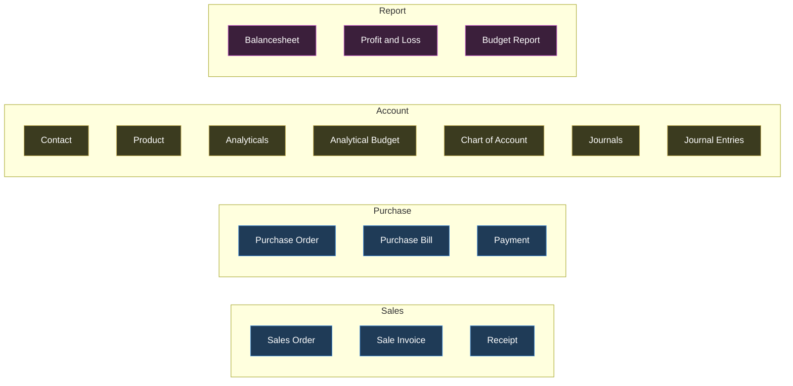
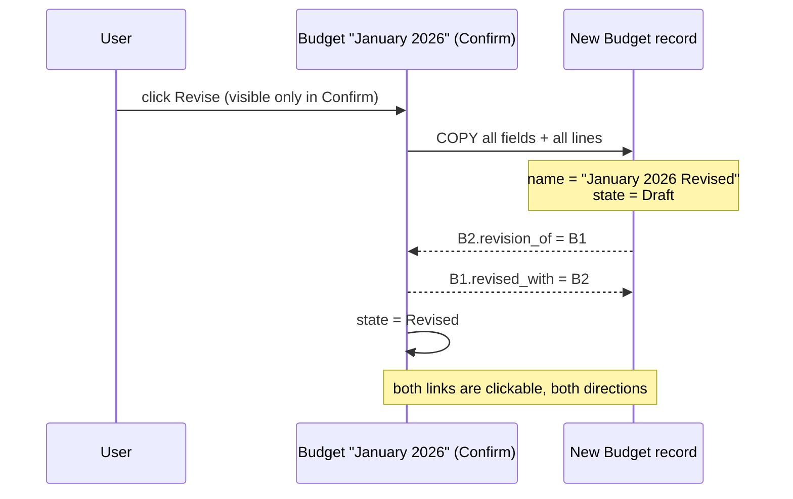
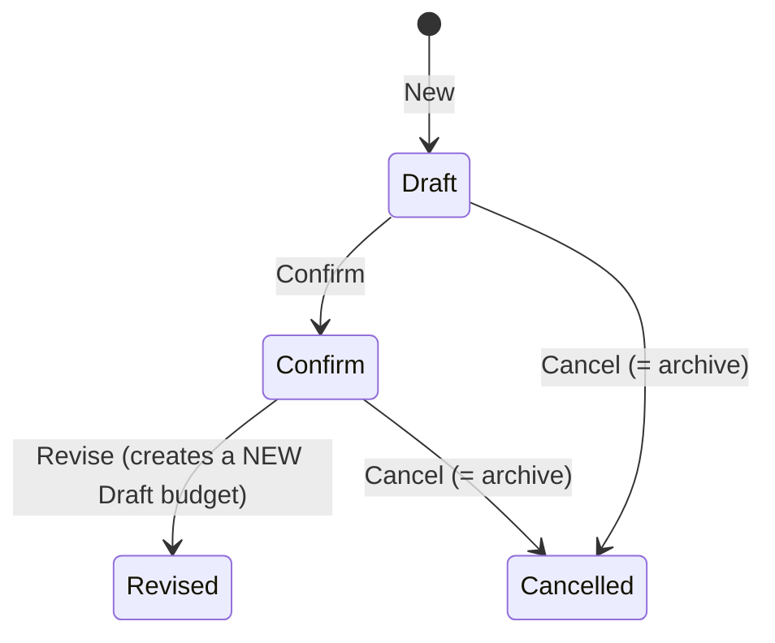
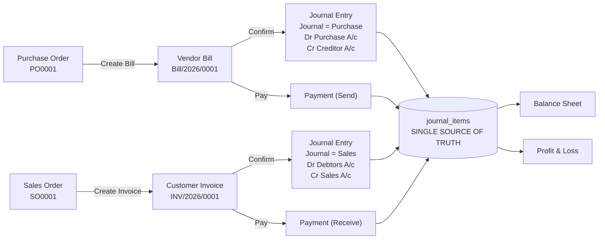

# Complete Requirements — Everything We Must Build

This section is the **build bible**. It merges two sources into one list:

1. The official **PDF problem statement** (`p3_accounting.txt`) — short, vague, 180 lines.
2. The organizers' **Excalidraw mockup** (`mock_acc.txt` + the 27 image tiles) — long, precise, and *far* more binding. The mockup pins down field data types, exact formulas, sequence formats, default values, conditional-visibility conditions and exact warning text.

Where the two disagree, **the mockup wins**, because the mockup is what a judge will hold next to your screen. Every place they disagree is called out explicitly in §12 with our ruling.

> **Rule for this whole section:** nothing here is invented. Every line traces back to the PDF or the drawing. The handful of things we add on top of the sources are tagged **`[ADDITION]`** with a one-line reason why they earn their place.

---

## 3.0 How to read this section

### 3.0.1 The priority marks

| Mark | Meaning |
|---|---|
| **MUST** | It is drawn in the mockup or stated in the PDF. If it is missing, a judge comparing screen-to-mockup sees a hole. Build it. |
| **SHOULD** | Stated in a source but *not drawn as a screen*, or drawn but cheap to approximate. Build it if the clock allows. |
| **NICE** | Implied, not stated. Pure upside. |
| **`[ADDITION]`** | Not in any source. We are adding it and saying why. |

### 3.0.2 The honest truth about priorities

**The mockup contains ZERO optional markers.** There is no "bonus", no "nice to have", no "phase 2", no hours, no priority column anywhere across all 27 tiles. Three independent passes over the board confirmed this. The organizers drew everything at production fidelity — field-level data types, exact arithmetic, exact button labels — which means:

> A judge treats **100% of the drawing as baseline scope**. Anything you skip reads as *incomplete*, not as *descoped*.

So almost everything below is MUST. The very short list of things that are genuinely safe to drop under time pressure is in **§13 — The Safe-Cut List**, and it is short on purpose.

### 3.0.3 Words you must understand before the checklist makes sense

You said you know nothing about accounting. Here is the minimum vocabulary. Every one of these words appears in the mockup, so you need them.

| Word | Plain English | Concrete example |
|---|---|---|
| **Ledger account** (a.k.a. "account", "A/c") | A labelled bucket that money is sorted into. | "Bank A/c", "Sales Income A/c", "Creditors A/c". |
| **Chart of Accounts (CoA)** | The master list of all those buckets. | The 8 accounts the mockup demands (§3.3.4). |
| **Account Type** | The category of a bucket. Decides which report it shows up in. | `Bank`, `Cash`, `Asset`, `Liability`, `Capital`, `Income`, `Expenses`, `Other Expenses`. |
| **Debit / Credit** | Two sides of every money movement. Debit is written left, credit right. Debit increases assets and expenses; credit increases income, liabilities and capital. Every movement is recorded on **both** sides, in equal amounts. | Customer pays ₹6,000 cash → Debit Cash ₹6,000, Credit Debtors ₹6,000. |
| **Double entry** | The rule that total debits must equal total credits, always. | ₹10,000 debit + ₹10,000 credit = balanced. ₹10,000 debit + ₹9,000 credit = illegal, must be rejected. |
| **Journal Entry** | One complete balanced record of a transaction — a header (date, journal) plus 2+ lines. | "Bill/2026/0001, 1 Sep, Purchase journal: Dr Purchase Expense 30,000 / Cr Creditors 30,000". |
| **Journal Item / Journal Line** | One line inside a journal entry: one account, one partner, one debit **or** one credit. | "Purchase A/c · Rahul · Debit ₹30,000". |
| **Journal** | A folder that groups journal entries by kind of activity. | Sales, Purchase, Bank, Cash — the four the mockup seeds. |
| **Post** | To make a journal entry final and real. Before posting it is a Draft and it does not affect reports. | The `Post` button on the Journal Entry form. |
| **Partner** | The other person in the transaction — a customer or vendor. Comes from the Contact master. | "Mr. Rahul". |
| **Debtors** | People who owe **us** money (our customers). An asset. | We invoiced Rahul ₹6,000 and he hasn't paid → Debtors ₹6,000. |
| **Creditors** | People **we** owe money to (our vendors). A liability. | Azure Furniture billed us ₹30,000 → Creditors ₹30,000. |
| **Capital** | The owner's own money put into the business. | Owner deposits ₹5,00,000 → Capital ₹5,00,000. |
| **Balance Sheet** | A snapshot: what we own (Assets) vs what we owe + owner's stake (Liabilities + Capital). The two sides must be equal. | Assets ₹8,42,310 = Liabilities ₹1,97,310 + Capital ₹6,45,000. |
| **Profit & Loss (P&L)** | Income earned minus expenses incurred, over a period. | Income ₹10,000 − Expenses ₹7,000 = Net Income ₹3,000. |
| **Analytic Account** | A **project tag** for money. It does not affect the books; it just lets you ask "how much did Project 1 cost?" | "Project 1", "Furniture". |
| **Budget** | A planned spend/earn amount for a period, attached to an analytic account. | "January 2026: Furniture, Expense, ₹2,00,000 committed". |
| **Committed Amount** | The number you planned. | ₹2,00,000. |
| **Achieved Amount** | The number actually reached so far. | ₹10,000 spent → 5% achieved, ₹1,90,000 left. |
| **Amount Due / Residual** | Bill total minus what has been paid. | ₹6,000 bill, ₹4,000 paid → due ₹2,000 → status **Partial**. |
| **Many-to-one (m2o)** | A dropdown that points at one record of another table. The mockup writes this on almost every field. | "Customer Name (From Contact Master - Many to one)". |
| **Smart button** | A small button on a form's top-right that jumps to a related record. | The `PO` and `Budget` buttons on a Vendor Bill. |
| **Archive** | Hide a record without deleting it (`active = false`). The mockup uses this for Budget "Cancel" and for Chart of Accounts. | A cancelled budget disappears from lists but still exists. |

**Say this to a judge if they ask what you built:**
> "It's a double-entry accounting system. Everything — every invoice, every bill, every payment — becomes balanced journal items in one table, and all three reports are pure aggregations over that one table. Nothing is summed off the invoice table."

---

## 3.1 The complete model inventory

The mockup's expanded navigation menu (tile `acc_r1c1`/`r1c2`) is the **authoritative model list**. It has four columns and 16 destinations. That menu is a contract: every one of those 16 items must open something real.



### 3.1.1 Database tables you will actually create

| # | Table | Source | Why it exists |
|---|---|---|---|
| 1 | `users` | Mockup Create User / Login / Sign Up | 3 roles, credential rules |
| 2 | `contacts` | PDF §3.1 + mockup Contact form | Customers and vendors, one shared table |
| 3 | `products` | PDF §3.2 + mockup Product form | Goods/Service/Combo |
| 4 | `product_categories` | Mockup: "Category Can be created and saved on the fly (Many2one Field)" | m2o with quick-create |
| 5 | `accounts` (Chart of Accounts) | PDF §3.3 + mockup CoA list/form | The connective spine |
| 6 | `journals` | PDF §3.4 + mockup Journals list/form | 4 seeded: Sales, Purchase, Bank, Cash |
| 7 | `journal_entries` | PDF §3.5 + mockup Journal Entry form | Header: date, journal, partner, state |
| 8 | `journal_items` | Mockup Journal Entry line grid | **The single source of truth for every report** |
| 9 | `analytic_accounts` ("Analyticals") | PDF §5 + mockup Analyticals form | Project tags, Income/Expense |
| 10 | `budgets` | PDF §5 + mockup Budget form | Name, period, responsible, state, revision links |
| 11 | `budget_lines` | Mockup Budget line table | Analytic, type, committed, achieved |
| 12 | `purchase_orders` + `purchase_order_lines` | Mockup PO screen | PO0001 sequence |
| 13 | `vendor_bills` + `vendor_bill_lines` | Mockup Vendor Bill screen | Bill/2026/0001 |
| 14 | `sales_orders` + `sales_order_lines` | Mockup Sales Order screen | SO0001 |
| 15 | `customer_invoices` + `customer_invoice_lines` | Mockup Customer Invoice screen | INV/2026/0001 |
| 16 | `payments` | Mockup Bill Payment / Invoice Payment | One table, Send/Receive direction |
| 17 | `payment_allocations` **`[ADDITION]`** | — | Needed for "Partial" status to survive one payment against a document. Without it "Partial" is a lie. ~20 lines of code, unlocks a MUST-level computed field. |
| 18 | `sequences` **`[ADDITION]`** | — | "auto generate ... +1 of Last" needs a counter row per prefix per year, otherwise two concurrent saves collide. |
| 19 | `taxes` | PDF §4 ("Sales Order: ... Unit Price, **Tax**") | Not drawn in the mockup. See §12.5. |

---

## 3.2 Global rules — apply to EVERY screen

These come from board-level notes and repeat on every card. Getting these right once, in a reusable component, is the single biggest time saver in the whole build.

| ID | Rule | Verbatim source | Priority |
|---|---|---|---|
| G-01 | **List view is the DEFAULT view for every master.** | "All Master will have list view as default" | MUST |
| G-02 | **`New` opens a BLANK form view.** | "clicking on New button it will open blank form view to enter new record" | MUST |
| G-03 | **Clicking a saved row opens the SAME form, populated.** | "Clicking on already saved record - it will open form view with saved details" | MUST |
| G-04 | **Standard master toolbar: `New` · `Confirm` · `Back`.** | Repeated on Contact form, Product form, Analyticals form | MUST |
| G-05 | **Every screen has an explicit `Back` button.** The organizers do not expect browser-back. | `Back` drawn on 15+ cards | MUST |
| G-06 | **List + Kanban view switcher, working in BOTH directions**, for Contact, Product, Analyticals. Two icons top-right. | "Allow user to shift to Kanban View" / "Allow User to shift to List View" / "Create Kanban and List View in the same manner for Product, Analyticals" | MUST |
| G-07 | **A search box in every list toolbar.** | Search input drawn on Contact, Product, Budget Report lists | MUST |
| G-08 | Money is displayed as **Rs.** with 2 decimals. | "Rs. 100.00", "Rs. 50.00", "Rs. 10,000" | MUST |
| G-09 | Indian digit grouping in samples (`2,00,000`, `1,00,000`). | Budget: 2,00,000 · Role note | SHOULD |
| G-10 | Select checkbox column on master list views. | Drawn on Contact list, Product list | SHOULD |
| G-11 | **The Chart of Accounts is the connective spine** — journal lines, bill lines and invoice lines all point at it. | "The Transaction would be connected through Chart of Accounts" | MUST |

> **Engineering call (and it is the reason this problem statement was chosen):** G-01 → G-07 mean you build **one** `<ListView>` component and **one** `<FormView>` component, driven by a per-model config object (columns, fields, types, m2o targets). Then all ~19 master/transaction screens are config, not code. Budget one hour for the scaffold; it pays back six.
>
> **Say this to a judge:** "The organizers wrote one note that governs every master — list is default, New opens a blank form, a row opens the same form filled in. So we built exactly one list component and one form component, and every model is a 30-line config. That note is in their drawing; we treated it as an architectural instruction."

---

## 3.3 Screen-by-screen inventory

### GROUP A — Authentication & Shell (6 screens)

---

#### A1. Create User (admin-side) — MUST
*Purpose:* an Admin creates a system user and assigns a role. Tile `acc_r0c1`.

| Field | Type | Rule |
|---|---|---|
| App Logo | image placeholder | Drawn at the top of the card |
| Name | text | — |
| Login id | text | **Unique**, **6–12 characters** |
| E-mail id | text | **Must not be a duplicate in the database** |
| Role | radio | Drawn: `User` / `Administrator`. Annotation defines a **third** role: `Accountant`. See §12.1 |
| Password | masked text | Must contain **a lowercase, an uppercase and a special character**, and be **more than 8 characters** |
| Re-Enter Password | masked text | Must match |

*Buttons:* `Create` · `Cancel`

*Rules:*
- R-A1-01 **MUST** — Login Id unique AND length between 6 and 12 inclusive.
- R-A1-02 **MUST** — Email uniqueness check against `users`.
- R-A1-03 **MUST** — Password regex: at least one `[a-z]`, one `[A-Z]`, one special character, `length > 8` (so 9+).
- R-A1-04 **MUST** — Re-enter password must match.
- R-A1-05 **MUST** — Role assignment. Three roles exist in the annotation (§3.3 A-roles table); render three radios. See §12.1.

**Role rights, verbatim from the annotation:**

| Role | Rights (verbatim) |
|---|---|
| Admin | "Have all access rights" |
| User (portal) | "can only see his invoices/bills in paid/unpaid status and can directly pay his dues from portal" |
| Accountant | "Create Master data, record Transactions and View reports. Can manage customers/vendors, access accounting dashboard, create journal entries. Can create and manage invoices, bills, and payments" |

---

#### A2. Login Page — MUST
*Purpose:* sign in.

| Field | Type |
|---|---|
| App Logo | image |
| Login Id | text |
| Password | masked |

*Buttons / links:* `SIGN IN` · `Forgot Password` · `Sign Up` (footer rendered as one line: `Forgot Password | Sign Up`)

*Rules:*
- R-A2-01 **MUST** — On mismatch show the **exact string**: `Invalid Login Id or Password`. Not "Wrong credentials". Not "Login failed". That exact string is in the annotation and a judge can diff it.
- R-A2-02 **MUST** — `Sign Up` link lands on the Sign Up page.
- R-A2-03 **SHOULD** — `Forgot Password` link lands on a Forgot Password page (see A4).

---

#### A3. Sign Up Page — MUST
*Purpose:* self-service registration. **Creates a portal/"invoicing" user only — never an admin or accountant.**

| Field | Type | Rule |
|---|---|---|
| App Logo | image | — |
| Enter Login Id | text | Unique, 6–12 chars |
| Enter Email Id | text | Not a duplicate |
| Enter Password | masked | lowercase + uppercase + special char, length > 8 |
| Re-Enter Password | masked | Must match |

*Buttons:* The primary button is literally drawn as **`SIGN OUT`** — that is the organizers' typo. Label it `SIGN UP`. Footer: `Forgot Password | Sign Up`.

*Rules:*
- R-A3-01 **MUST** — "Create a 'user' database into the system on signup" — i.e. the created record's role is hard-coded to portal user. **A signup can never mint an admin.** This is a security requirement hidden in a drawing note.
- R-A3-02 **MUST** — Same three credential rules as A1, enforced on this path too (the annotation restates all three, which is the organizers telling you they check both paths).

---

#### A4. Forgot Password Page — SHOULD
*Purpose:* referenced from both Login and Sign Up footers — **but never drawn anywhere on the board.**

*Justification for SHOULD:* it is the only screen in the entire spec with no wireframe, so a judge has nothing to compare against. A single "enter email → reset link/temporary password" page satisfies it. It is on the safe-cut list (§13) — but the *link* must exist and must not 404.

---

#### A5. App Dashboard — MUST
*Purpose:* landing page after login. Tile `acc_r1c1`. **This is not decorative — every number on it is a live computed count.**

*Top menu bar:* `Sales` | `Purchase` | `Account` | `Report` — clicking opens the expanded mega-menu (annotation: "Open on click").

| Card | Counter tiles | Primary button |
|---|---|---|
| **Sales** | `All 12` · `Confirmed 10` · `Draft 2` | `New` (blue) |
| **Purchase** | `All 12` · `Confirmed 10` · `Draft 2` | `New` (blue) |
| **Budget Reports** | `Achieved 3` · `Budget 2` · `Committed 4` | `Report` (blue) |

*Rules:*
- R-A5-01 **MUST** — Sales counters = counts of Sales Orders grouped by state (All / Confirmed / Draft).
- R-A5-02 **MUST** — Purchase counters = counts of Purchase Orders grouped by state.
- R-A5-03 **MUST** — Budget card aggregates analytic budgets: Achieved / Budget / Committed.
- R-A5-04 **MUST** — `New` on Sales card → blank Sales Order form. `New` on Purchase card → blank Purchase Order form. `Report` → Budget Report.
- R-A5-05 **SHOULD** — Counters should be clickable filters into the corresponding list. *(Not stated; obvious and free.)* **`[ADDITION]`**

---

#### A6. Main Navigation Mega-Menu — MUST
*Purpose:* the full app menu, opened from the dashboard menu bar.

Four columns, 16 items — exactly as listed in §3.1. Every item navigates to that model's **default list view** (G-01).

*Rule:*
- R-A6-01 **MUST** — All 16 destinations resolve. A dead menu item is the cheapest possible way to lose a point.
- R-A6-02 **MUST** — `Receipt` (under Sales) and `Payment` (under Purchase) both exist. Implementation note: **one `payments` table, two filtered menu entries** (`direction = 'receive'` → Receipt, `direction = 'send'` → Payment). The mockup itself draws one payment form with a Send/Receive radio, so this is what they intend, not a shortcut.

---

### GROUP B — Master Data (13 screens)

Board section banner: **"Master Data"** (olive band, `acc_r1c1`).

---

#### B1. Contact List View — MUST
*Purpose:* default list of customers/vendors.

| Column | Notes |
|---|---|
| Select | checkbox |
| Image | **real avatar thumbnail**, not a placeholder |
| Name | e.g. "Open Wood" |
| Email | e.g. "Openwood21@example.com" |
| Phone | e.g. "+91 9090090909" |

*Buttons:* `New` · Search · `Back` · list/kanban view-switcher icons.

- R-B1-01 **MUST** — the uploaded image renders **in the list**, not only on the form.

---

#### B2. Contact Kanban View — MUST
Card shows: thumbnail image, Name, Email, Phone. Same toolbar. Switcher must return to list.

---

#### B3. Contact Form View — MUST
*Purpose:* create/edit a contact.

| Field | Type | Rule |
|---|---|---|
| Contact Name | wide text | — |
| Email | text | Placeholder literally reads **"Unique Email"** → uniqueness constraint |
| Phone | text | — |
| Street | text | Address block |
| Street 2 | text | second street line |
| City | text | (PDF also names City) |
| State | text | (PDF also names State) |
| Country | text | mockup only |
| Pincode | text | (PDF also names Pincode) |
| Upload Image | image box, right side | Profile Image (PDF §3.1) |
| Type | **PDF only:** Customer / Vendor / Both | Not drawn on the form. See §12.4 — build it, it is needed to filter the Vendor m2o on a PO and the Customer m2o on an SO. |

*Buttons:* `New` · `Confirm` · `Back`

---

#### B4. Product List View — MUST

| Column | Sample |
|---|---|
| Select | checkbox |
| Product | Air Conditioner |
| Category | Electronics |
| Type | Goods |
| Sales Price | 25,000 |
| Cost | 15,000 |

*Buttons:* `New` · Search · `Back` · view switcher.

---

#### B5. Product Kanban View — MUST
Card shows: image box, Product name, `Sales Price 25000`, `Cost 15000`.

---

#### B6. Product Form View — MUST

| Field | Type | Rule |
|---|---|---|
| Product Name | text | — |
| Product Type | dropdown | **Exactly three values: Goods / Service / Combo** |
| Category | m2o | **"Category Can be created and saved on the fly (Many2one Field)"** — the dropdown must let you type a new category name and create it inline |
| Sales Price | monetary | Sample `Rs. 100.00` |
| Cost | monetary | Sample `Rs. 50.00` (PDF calls it "Cost (Purchase Price)") |
| Upload Image | image box | — |

*Buttons:* `New` · `Confirm` · `Back`

- R-B6-01 **MUST** — the three-value Type dropdown exists.
- R-B6-02 **MUST** — Category quick-create from the dropdown (this is a distinctly *Odoo* widget behaviour; a judge from Odoo will try it).
- R-B6-03 **NICE** — actual "Combo" bundle semantics (a product made of other products). The source names the value but never defines the behaviour. Ship the selection value; skip the bundle logic.

---

#### B7. Chart of Accounts — List View — MUST
*Purpose:* the pre-seeded ledger account master.

| Account Name | Type |
|---|---|
| Bank A/c | Assets |
| Purchase Expense A/c | Expense |
| Debtors A/c | Assets |
| Creditors A/c | Liabilities |
| Sales Income A/c | Income |
| Cash A/c | Assets |
| Other Expense A/c | Expense |
| Capital A/c | Capital |

*Buttons (this screen has an EXTRA toolbar):* `New` · `Confirm` · **`Archived`** · **`Home`** · `Back`

*Rules:*
- R-B7-01 **MUST** — All 8 accounts ship **pre-configured as seed data**: "All this accounts are to be pre configured".
- R-B7-02 **MUST** — `Archived` button = archive/unarchive filter. Archiving of accounts appears **only here** in the whole board.
- R-B7-03 **MUST** — `Home` button (back to dashboard) appears **only here**.

---

#### B8. Chart of Accounts — New Account Form — MUST
Reached via `New` ("When clicking on new").

| Field | Type |
|---|---|
| Account Name | text |
| Type | **grouped dropdown** |

**The grouped dropdown, exactly as drawn:**

```
Balancesheet          ← heading, NOT selectable
    Asset
    Liability
    Bank
    Capital
    Cash
Profit and Loss       ← heading, NOT selectable
    Income
    Expenses
    Other Expenses
```

*Rules:*
- R-B8-01 **MUST** — headings are display-only. "Just for heading selection can be done from the orange part only."
- R-B8-02 **MUST** — 8 selectable leaf types.
- R-B8-03 **MUST** — **Account Type is the routing key for all reporting.** Verbatim: "Each account is assigned an Account Type, which would further be used for how the account to be treated and where it appears in reports." Reports must be driven off `account.type`, **never** off hard-coded account names.

> **Say this to a judge:** "Account type drives the reports. If you create a brand new account called 'Petty Cash' and set its type to Cash, it appears on the Balance Sheet under Cash immediately — we never hard-coded a single account name."

---

#### B9. Journals — List View — MUST

| Journal Name | Type | Default Account |
|---|---|---|
| Sales | Sales | Sales Income A/c |
| Purchase | Purchase | Purchase Expense A/c |
| Bank | Bank | Bank A/c |
| Cash | Cash | Cash A/c |

*Buttons:* `New` (pink primary) · `Back`

- R-B9-01 **MUST** — these 4 journals ship as seed data.

---

#### B10. Journal — New Form — MUST

| Field | Type | Rule |
|---|---|---|
| Journal Name | text, placeholder "Name" | — |
| Journal Type | selection, placeholder "Selection" | Fixed 4 values: **Sales, Purchase, Bank, Cash** |
| Default Account | m2o, placeholder "Selection" | **"From Chart of Accounts Many to one"** |

> PDF says "Default **Accounts**" (plural); the mockup draws one. Ship one field. See §12.6.

---

#### B11. Analyticals — Form View — MUST
*Purpose:* the project-tag master, plus a reverse list of every budget that uses it.

| Field | Type | Rule |
|---|---|---|
| Analytic Account | text | The name used everywhere else (e.g. "Project 1", "Furniture") |
| Type | dropdown | **Exactly two values: Income / Expense** |

**Embedded reverse-lookup table** — annotation: *"All the Budget List where the Analytic Account is used"*

| Budget | Start Date | End Date | Comitted *(sic)* | Achieved |
|---|---|---|---|---|
| January 2026 | 01/01/2026 | 31/01/2026 | 200000 | 10000 |

*Buttons:* `New` · `Confirm` · `Back`

- R-B11-01 **MUST** — the embedded table is a **reverse relation** — query `budget_lines WHERE analytic_id = this`, and roll up committed/achieved. Most teams will forget the analytic form has a table on it at all.

---

#### B12 / B13. Analyticals List View + Kanban View — MUST
Required by the red callout: *"Create Kanban and List View in the same manner for Product, Analyticals."* Columns follow the master pattern: Name, Type. (Kanban is the cheapest item on the safe-cut list — see §13.)

---

### GROUP C — Budget (5 screens + 1 spec table)

---

#### C1. Budget — Form View (Original) — MUST
*Purpose:* the main budget record. Tiles `acc_r4c0` + `acc_r4c1`.

| Field | Type | Rule |
|---|---|---|
| Budget Name | Alpha Numeric | Sample: "January 2026". **Revision naming rule below.** |
| Budget Period | Start Date **To** End Date | Two date fields |
| **Revised With** | link, placeholder "Revised Budget" | Points at the revision that superseded this budget. Only meaningful once revised. |
| Responsible | m2o | "Select from Contacts Created (open list of contacts created on click)" |

**Line table:**

| Analytic | Type | Committed Amount | Achieved Amount | Achieved % | Amount To Achieve |
|---|---|---|---|---|---|
| Furniture | Expense | 200000 | 10000 | 5% | 190000 |

| Column | Rule |
|---|---|
| Analytic | "The Analytic Account name set in the Analytical account" — m2o to Analyticals |
| Type | Income / Expenses |
| Committed Amount | Monetary, user-entered |
| Achieved Amount | **Computed. Only visible for a Confirmed budget.** Also a **clickable drill-down button.** |
| Achieved % | **Computed. Only visible for a Confirmed budget.** `(Achieved / Committed) × 100` |
| Amount To Achieve | **Computed. Only visible for a Confirmed budget.** `Committed − Achieved` |

*Buttons:* `New` · `Confirm` (primary) · `Revise` · `Cancel`
*Statusbar:* `Draft > Confirm > Revised > Cancelled` (4 stages; Confirm shown active)

*Rules:*
- R-C1-01 **MUST** — Achieved Amount / Achieved % / Amount To Achieve are **hidden** unless `state = 'Confirm'`. Three separate conditional-visibility rules, stated three times in the drawing.
- R-C1-02 **MUST** — `Achieved %` = `(Achieved Amount / Committed Amount) * 100`. Guard divide-by-zero.
- R-C1-03 **MUST** — `Amount To Achieve` = `Committed Amount − Achieved Amount`.
- R-C1-04 **MUST** — **Achieved Amount computation, verbatim from the drawing:**
  - Type **Income** → "Search Analytical in **Sales Invoice** with name Project 1, consider budget period and compute total and set in achieved amount"
  - Type **Expense** → "Search Analytical in **Vendor Bills** with name Project 1, consider budget period and compute total and set in achieved amount"
  - i.e. income achievement comes **only** from Customer Invoices; expense achievement **only** from Vendor Bills. Directional and fixed.
- R-C1-05 **MUST** — clicking Achieved Amount opens "list view of all Invoices/Bills having same analytical for the budget period".
- R-C1-06 **MUST** — `Revise` button is **only visible at the Confirmed stage**.
- R-C1-07 **MUST** — `Cancel` **archives** the record ("Here User can archive the existing budget"). It is not a delete.

---

#### C2. Budget — Form View (Revised) — MUST
Same component as C1, with one field swapped:

| Field | Rule |
|---|---|
| **Revision Of** | placeholder "Original Budget", annotated **"(Original Budget Clickable link)"** — must be a working hyperlink to the original |

**The revision workflow, verbatim:**
> "On Clicking Revise - New Budget will appear and Old one will move to Revised state. Link will be visible on Main Budget and on click it will lead to new revised Budget and the revised will have link to original."



*Rules:*
- R-C2-01 **MUST** — `Revise` **creates a new record** (a copy). It is not an in-place edit.
- R-C2-02 **MUST** — the original moves to state `Revised`.
- R-C2-03 **MUST** — **two-way link**: original.`Revised With` → revision; revision.`Revision Of` → original.
- R-C2-04 **MUST** — the `Revision Of` link is a **clickable hyperlink** that navigates.
- R-C2-05 **MUST** — **naming rule, mandated verbatim**: *"In case of Revision Keep the original Budget name as it is and add the word "Revised" in last (For e.g. Project A Revised)"*. So `"January 2026"` → `"January 2026 Revised"`. Note the space, note the capital R, note it is appended at the **end**.
- R-C2-06 **MUST** — the new budget starts in `Draft` (per the Menu & Stage Mapping: New → Draft), and can itself be Confirmed and Revised again.

> **Worked example to show a judge:** "Budget *January 2026*, Furniture, Expense, committed ₹2,00,000. We spent ₹10,000, so Achieved 5%, ₹1,90,000 to go. Now the owner raises the ceiling to ₹3,50,000 — that's the exact example in their drawing. We press Revise: a **new** record *January 2026 Revised* appears in Draft with the same lines, the old one flips to Revised, and both carry clickable links to each other. We never overwrote the original — the audit trail of what was originally approved survives."

---

#### C3. Menu & Stage Mapping — the authoritative Budget state machine — MUST

This is a spec table drawn on the board, not a screen. It is the definitive statement of what each button does.

| Menu | Stage | Output (verbatim) |
|---|---|---|
| New | Draft | "Here user can create a new fresh Budget" |
| Confirm | Confirm | "User confirm the newly created Budget" |
| Revise | Revised | "Only Visible at confirmed Stage" + "Here User can revise the new confirmed budget e.g. Budgeted Expense was 2,00,000 now you need to change the limit to 3,50,000" |
| Cancelled | Cancelled | "Here User can archive the existing budget" |



---

#### C4. Budget Report — List View — MUST
*Purpose:* list of budgets with an **inline pie chart per row**.

| Column | Sample |
|---|---|
| Budget | January 2026 |
| Start Date | 01/01/2026 |
| End Date | 31/01/2026 |
| Status | Confirm |
| **Pie Chart** | a pie thumbnail **inside the table cell** |

*Buttons:* `New` · Search · `Back` · list/kanban view-switcher icons.
*Row click:* "Open Form View on Click".

*Rules:*
- R-C4-01 **MUST** — the pie chart renders **inside a list column, per row**. Two segments, labelled in the drawing: **`Achieved`** (cyan) and **`Balance`** (red/pink). This is a graphical widget embedded in a table — unusual, explicitly required, and the single most visually distinctive thing in the whole mockup. Do not substitute a progress bar.
- R-C4-02 **MUST** — Status column shows the workflow stage.

---

#### C5. Budget Report — Kanban View — MUST
Card content: Budget Name, `Start Date  01/01/2026`, `End Date  31/01/2026`. Same toolbar and switcher. Card click → "Open Form View on Click".

- R-C5-01 **MUST** — **Budget Report ships in THREE views** with a working switcher: **List, Kanban, and Form**. Both list rows and kanban cards open the form.

---

#### C6. Achieved-Amount Drill-down List — MUST
Opened by clicking the Achieved Amount button on a budget line. Shows "all Invoices/Bills having same analytical for the budget period". Reuse the generic list component with a filter — near-zero cost, but it is an explicitly drawn behaviour.

---

### GROUP D — Transactions (14 screens)

Board section banner: **"Data Input Forms"** (brown band, `acc_r5c1`/`r5c2`).



---

#### D1. Purchase Order — Form — MUST
*Purpose:* vendor purchase order with per-line project tagging.

| Field | Type | Rule |
|---|---|---|
| PO No. | text, read-only | Sample `PO0001`. **"(Create Sequence auto generate PO number +1 of Last order)"** |
| Vendor Name | m2o | "(From Contact Master - Many to one)". Sample "Mr Rahul" |
| PO Date | date | — |

**Line grid:**

| Sr. No. | Product | Budget Analytics | Qty | Unit Price | Total |
|---|---|---|---|---|---|
| *(type row)* | From Product Master - Many to one | From Analytics Master - Many to One | Numeric | Monetary | Monetary |
| 2. | Table | Project 1 | 3 | 2000 | **6000** `(3Qty * 2000)` |
| | **Total** | | | | **6000** |

*Buttons:* `New` · `Confirm` (primary) · `Create Bill` · `Cancel` · `Back`

*Rules:*
- R-D1-01 **MUST** — `Total = Unit Price × Quantity` per line. Annotated twice on the board: "Unit Price * Quantity" and "(3Qty * 2000)".
- R-D1-02 **MUST** — footer Total row = sum of line totals.
- R-D1-03 **MUST** — **Budget Analytics m2o on every line.** This is what feeds the Expense side of budget achievement.
- R-D1-04 **MUST** — **Non-blocking budget warning on Confirm.** Exact text:
  > ⚠ **Exceeds Approved Budget**
  > "The entered amount is higher than the remaining budget amount for this budget line. Consider adjusting the value or revise the budget."

  It is a **warning, not a block** — the user must still be able to proceed. Header on the note: "Non Blocking Warning on Confirmation of PO".
- R-D1-05 **MUST** — `Create Bill` produces a Vendor Bill carrying forward **Vendor name, Product, Price, Quantity** ("Bill Created from PO fetch Vendor name, Product, Price, Quantity").
- R-D1-06 — **Note:** the PO line grid has **no Chart of Accounts column**. Only the Bill and the Invoice do. Do not add one. (Verified on tile `acc_r5c0`/`acc_r6c0`.)

---

#### D2. Purchase Order — List — MUST (derived from A6 menu)
Columns: PO No., Vendor, PO Date, Total, Status. Not drawn, but the menu item `Purchase Order` must land on a list (G-01).

---

#### D3. Vendor Bill — Form — MUST
*Purpose:* the supplier bill. **This is the most rule-dense screen on the board.**

| Field | Type | Rule |
|---|---|---|
| Vendor Bill No. | read-only | Sample `Bill/2026/0001`. "(auto generate Bill Number +1 of Last Bill)" |
| Vendor Name | m2o | "(From Contact master - Many to one)" |
| **Status** | **computed badge** | `Paid` / `Partial` / `Not Paid` — "only one at a time, computation given below" |
| Bill Reference | text | Sample `ABC-26-001`, "Alpha numeric (Text)" — **user-typed, distinct from the auto number** |
| Bill Date | date | — |
| Due Date | date | — |

**Line grid:**

| Sr. No. | Product | **Chart of Account** | Budget Analytics | Qty | Unit Price | Total |
|---|---|---|---|---|---|---|
| *(type row)* | Product Master - m2o | **Purchase** | Analytics master - m2o | Numeric | Monetary | Monetary |
| 2. | Table | *(defaulted)* | Project 1 | 3 | 2000 | 6000 |
| | **Total** | | | | | **6000** |

**Payment summary block (bottom-right):**

| Label | Value | Rule |
|---|---|---|
| Paid Via Cash | 6000 | sum of cash payments allocated |
| Paid Via Bank | *(blank in sample)* | sum of bank payments allocated |
| **Amount Due** | **0** | **`(Total - Amount Paid)`** |

*Buttons:* `New` · `Confirm` (primary) · `Pay` (primary) · **`PO`** (smart button) · **`Budget`** (smart button) · `Cancel` · `Back`

*Rules:*
- R-D3-01 **MUST** — **"Purchase account to be set by default"** on the Chart of Accounts column. Green arrow points straight at that column.
- R-D3-02 **MUST** — **Status badge computation** (mockup legend box, verbatim):

  | Badge | Condition |
  |---|---|
  | `Paid` (green outline) | **If amount due = 0** |
  | `Partial` (orange outline) | **If amount due < Bill Total** |
  | `Not Paid` (pink/red outline) | **If amount due = Bill Total** |

  Read the middle rule carefully: as written, `Partial` is `due < total`, which also covers `due = 0`. The badges are declared mutually exclusive ("only one at a time"), so evaluate **in order**: `due = 0 → Paid`, else `due = total → Not Paid`, else `Partial`. Never a manual field.
- R-D3-03 **MUST** — `Amount Due = Total − (Paid Via Cash + Paid Via Bank)`.
- R-D3-04 **MUST** — **On Confirm, auto-create a Journal Entry**, verbatim:
  > "As soon as the vendor bill is confirmed a journal entry would be created that would become visible in the Journal Entries section / For Vendor bill always purchase chart of account would be set by default / **The Journal Entry should always be balanced** / That is the debit and credit totals need to match"

  Lines drawn: **Purchase A/c** and **Creditor A/c**. So: `Dr Purchase Expense A/c 6,000 / Cr Creditors A/c 6,000`.
- R-D3-05 **MUST** — the generated entry's **Journal is forced to `Purchase`**: "In case of bill journal would always be Purchase".
- R-D3-06 **MUST** — the generated entry's **Accounting Date is fetched from the bill's date**, not today: "(Bill date fetch from bill)".
- R-D3-07 **MUST** — **`PO` smart button conditional visibility**, verbatim: *"On click open the PO from which Bill Created (**Only show this if bill created from PO hide if Bill Created Fresh without PO**)"*.
- R-D3-08 **MUST** — **`Budget` smart button**: *"On Click Open the Budget Analytic Report that is used the Bill"* — navigate to the Budget Analytic Report filtered to the analytic account(s) used on this bill.
- R-D3-09 **MUST** — **Non-blocking budget warning on Confirm of Bill**, same exact text as the PO warning. **Two separate hook points** — the drawing shows the identical note twice, once under the PO and once under the Bill. Wire both.
- R-D3-10 **MUST** — `Pay` opens the Payment form (D5).

---

#### D4. Vendor Bill — List — MUST (derived)
Columns: Bill No., Vendor, Bill Date, Due Date, Total, Amount Due, Status badge.

---

#### D5. Bill Payment / Invoice Payment — Form — MUST
*Purpose:* register a payment. **One model serves both directions.** Reached via the `Pay` button on a Bill or an Invoice.

| Field | Type | Rule |
|---|---|---|
| Payment Type | **radio: Send / Receive** | `Send` selected on the Bill Payment; `Receive` selected on the Invoice Payment |
| Partner | m2o | **"Autofill Partner Name from Invoice/Bill"** |
| Amount | monetary | **"Autofill Amount Due from Invoice/Bill"** — sample 6000 |
| Date | date | **"(Default Today's Date)"** |
| Payment Via | selection | **"Default set to Bank can be selected to Cash"** |
| Note | text | "Alpha Numeric (Text)" |

*Buttons:* `Confirm` (primary) · `Cancel` · **gear/settings icon ⚙**
*Statusbar:* `Draft > Confirm > Cancelled` (**three** stages — note this differs from Budget's four)

*Rules:*
- R-D5-01 **MUST** — all four autofills/defaults above.
- R-D5-02 **MUST** — the gear icon opens an action menu: *"Provide option 1. **Print** 2. **Send** (Allow user to send from Mail)"*.
- R-D5-03 **MUST** — on Confirm, the source document's `Paid Via Cash` / `Paid Via Bank` and `Amount Due` update, and the Status badge recomputes.
- R-D5-04 **SHOULD** — Print produces a PDF receipt/voucher. (Print is drawn; the PDF requirement is only *explicit* on the two reports, so the payment print is a smaller obligation.)
- R-D5-05 **NICE** — actual outgoing email. Mark as SHOULD only if an SMTP key is at hand; otherwise a "Send" dialog that composes and shows the message satisfies the drawing at 5% of the cost.
- R-D5-06 **MUST** **`[ADDITION]`** — the payment must itself post a journal entry (`Dr Bank/Cash / Cr Debtors` for a receipt; `Dr Creditors / Cr Bank/Cash` for a payment). *Reason:* the mockup only draws entries for Bill and Invoice confirmation, but without a payment entry the Balance Sheet's Bank and Cash rows are permanently zero and Debtors never clears — the Balance Sheet the organizers drew cannot be produced. This is not an optional flourish; it is required for the drawn report to work.

---

#### D6. Payment / Receipt — Lists — MUST (derived from A6)
Two menu entries, one table, filtered by direction.

---

#### D7. Sales Order — Form — MUST

| Field | Type | Rule |
|---|---|---|
| SO No. | read-only | Sample `SO0001` (sequence) |
| Customer Name | m2o | "(From Contact Master - Many to one)" — sample "Mr. Rahul" |
| SO Date | date | — |

**Line grid:** `Sr. No. | Product | Budget Analytics | Qty | Unit Price | Total` — same types and same `Unit Price × Qty` rule; footer Total = 6000.

*Buttons:* `New` · `Confirm` (primary) · `Create Invoice` · `Cancel` · `Back`

*Rules:*
- R-D7-01 **MUST** — `Create Invoice` copies **Customer Name, Product, Price, Quantity** onto the new Customer Invoice ("Invoice Created from SO fetch Customer Name, Product, Price, Quantity").
- R-D7-02 — **Note:** the transcription lists Chart of Accounts on the SO grid in parentheses, but the drawn PO grid (its structural twin) has no such column, and only posting documents need an account. **Ruling: no CoA column on the Sales Order.** See §12.7.
- R-D7-03 — **Note:** the drawing shows **no budget warning on SO confirmation** — only on PO and Bill. Do not add one; matching the spec exactly is worth more than symmetry.

---

#### D8. Sales Order — List — MUST (derived)

---

#### D9. Customer Invoice — Form — MUST
The mirror of the Vendor Bill, with Sales instead of Purchase.

| Field | Type | Rule |
|---|---|---|
| Customer Invoice No. | read-only | Sample `INV/2026/0001`, "(auto generate Invoice Number +1 of Last Bill)" |
| Invoice Reference | text | Sample `ABC-26-001`, "Alpha numeric (Text)" — user-typed |
| Customer Name | m2o | "(from Contact master - Many to one)" |
| Invoice Date | date | — |
| Due Date | date | **separate from Invoice Date** |
| Status | computed badge | `Paid` / `Partial` / `Not Paid`, "only one at a time, computation given below" |

**Line grid:** `Sr. No. | Product | Chart of Accounts | Budget Analytics | Qty | Unit Price | Total` with type row `Product Master - m2o | Sales | Analytics master - m2o | Numeric | Monetary | Monetary`.

**Payment summary:** `Paid Via Cash 6000` · `Paid Via Bank` · `Amount Due 0 (Total - Amount Paid)`.

*Buttons:* `New` · `Confirm` (primary) · `Pay` (primary/pink) · **`SO`** (smart button) · **`Budget`** (smart button) · `Cancel` · `Back`

*Rules:*
- R-D9-01 **MUST** — **"Sales account to be set by default"** on the Chart of Accounts column.
- R-D9-02 **MUST** — On Confirm, auto-create a balanced journal entry, verbatim:
  > "As soon as the Customer Invoice is confirmed a journal entry would be created that would become visible in the Journal Entries section / For Customer Invoice always Sales chart of account would be set by default / The Journal Entry should always be balanced / That is the debit and credit totals need to match"

  → `Dr Debtors A/c 6,000 / Cr Sales Income A/c 6,000`.
- R-D9-03 **MUST** — the entry's Journal is forced to **`Sales`** (by symmetry with the explicit Purchase rule).
- R-D9-04 **MUST** — `SO` smart button follows the same conditional-visibility rule as the Bill's `PO` button: shown only when the invoice was created from a Sales Order.
- R-D9-05 **MUST** — `Budget` smart button → Budget Analytic Report for the analytic used.
- R-D9-06 **MUST** — Status badge and Amount Due follow the identical formulas as D3.

---

#### D10. Customer Invoice — List — MUST (derived)

---

#### D11. Journal Entries — List View — MUST
*Purpose:* the ledger of all entries, whether auto-generated or manual.

| Column | Sample row 1 | Sample row 2 |
|---|---|---|
| Date | Sep 1 | Sep 2 |
| Number | Bill/2026/0001 | Inv/2026/001 |
| Partner | Mr. Rahul | Mr Raj |
| Journal | Purchases | Sales |
| Total | Rs. 30,000 | Rs. 10,500 |
| Status | **Posted** (green) | **Draft** (blue) |

*Buttons:* `New` (pink primary) · `Back`

*Rules:*
- R-D11-01 **MUST** — colour-coded status badges: Posted = green, Draft = blue.
- R-D11-02 **MUST** — auto-generated entries from Bills and Invoices appear here. "would become visible in the Journal Entries section" is stated twice.
- R-D11-03 — Note the organizers' own sample numbering is inconsistent (`Bill/2026/0001` 4-digit vs `Inv/2026/001` 3-digit). **Pick 4-digit everywhere and be consistent** — internal consistency beats copying their typo.

---

#### D12. Journal Entry — Form View — MUST
*Purpose:* the core general-ledger posting screen. Reached by `New` on D11 ("When Clicking on new"), or by opening an auto-generated entry.

| Field | Type | Rule |
|---|---|---|
| Accounting Date | date | On generated entries: **fetched from the source document's date** |
| Journal | m2o | "Selection (From journals Many to one)". Forced to Purchase for bills, Sales for invoices |

**Line grid:**

| Account | Partner | Debit | Credit |
|---|---|---|---|
| Asset A/c | Rahul | Rs. 10,000 | |
| Bank A/c | | | Rs. 10,000 |

*Field Explanation callout, verbatim:*
- "Account - Selection From Chart of Accounts (Many to one)"
- "Partner - Selection from contact master"
- "The Transaction would be connected through Chart of Accounts"

*Buttons:* `Post` (primary) · `Cancel` · `Back` — and on a generated/posted entry: **`Reset to Draft`** · `Back`.

*Rules:*
- R-D12-01 **MUST** — **BLOCKING validation**, in red on the board: *"Blocking warning if the debit and credit amount don't match."* You **cannot post** an unbalanced entry. This is the hardest rule in the spec and the one a judge will test first.
- R-D12-02 **MUST** — `Reset to Draft` action exists on entries.
- R-D12-03 **MUST** **`[ADDITION]`** — enforce the balance rule at the **database** level too (a CHECK constraint or a transaction-level assertion named e.g. `journal_entry_must_balance`), not only in the UI. *Reason:* the drawing says the entry "should **always** be balanced". "Always" means it must hold even when the entry is created by the posting engine, by seed data or by an API call — a UI-only check does not satisfy "always", and being able to show the constraint name is 10 seconds of unbeatable credibility.

> **Say this to a judge:** "The organizers wrote 'blocking warning if debit and credit don't match'. We took 'blocking' literally — this is a database constraint, not a form validation. Watch." *(Then post an unbalanced entry from a terminal and show the rejection.)*

---

### GROUP E — Reports (3 screens)

---

#### E1. Profit and Loss Report — MUST
*Purpose:* Income minus Expenses for a chosen year.

| Control | Value |
|---|---|
| Year selector | `2026` |

**Rows, with the sample figures drawn on the board:**

| Row | Balance | Computation (verbatim from the "Field Computation" callout) |
|---|---|---|
| **Income** *(section)* | Rs. 10000 | "Income - Total of Income" |
| Income from Sales | Rs. 10000 | "Income from Sales - Total of account type **Income**" |
| **Expenses** *(section)* | Rs. 7000 | "Expenses - Total of All expenses" |
| Purchase Expense | Rs. 6000 | "Purchase Expense - Total of Account type **Expense**" |
| Other Expense | Rs. 1000 | "Other Expense - Total of account type **Other Expense**" |
| **Net Income** *(highlighted)* | Rs. 3000 | "Net Income - **Difference of Income - Expenses**" |

*Buttons:* `Print` (primary) — **"Pdf download on click"** · `Back`

*Rules:*
- R-E1-01 **MUST** — the year filter restricts journal items to that year.
- R-E1-02 **MUST** — `Print` **downloads a PDF**. Explicitly annotated. PDF generation is a required deliverable, not optional.
- R-E1-03 **MUST** — every figure derives from `journal_items` joined to `accounts` **by account type**, not from invoice/bill tables. Arithmetic check on the sample: `10000 − 7000 = 3000` ✅ and `6000 + 1000 = 7000` ✅.
- R-E1-04 — **Ambiguity:** "Income" and "Income from Sales" are both "total of account type Income" and both show 10000. Ruling: `Income` is the **section header total** and `Income from Sales` is the one account-type row inside it. That reproduces the drawn numbers exactly. Same shape on the expense side: `Expenses` = section total = `Purchase Expense` + `Other Expense`.
- R-E1-05 — **Account-type taxonomy implication:** the P&L needs three distinct P&L types — `Income`, `Expenses`, `Other Expenses` — which is exactly what the grouped CoA dropdown (B8) provides. The two lists are consistent; build them as one enum.

---

#### E2. Balance Sheet — MUST
*Purpose:* Assets vs Liabilities snapshot for a chosen year.

| Control | Value |
|---|---|
| Year selector | `2026` |

**Two-column layout, exactly as drawn:**

| Assets | Liabilities |
|---|---|
| Bank | Capital |
| Cash | Creditors |
| Debtors | |
| **Total Asset** | **Total (Liabilities)** |

**Account-type mapping, verbatim from the arrow note:**

| Row | Fed by |
|---|---|
| Bank | "Account type **Asset - Bank**" |
| Cash | "Account type **Asset - cash**" |
| Debtors | "Account type **Asset - Debtors**" |
| Creditors | "Account type **Liability - creditor**" |
| Capital | "Account Type **Capital**" |

*Buttons:* `Print` (primary) · `Back`

*Rules:*
- R-E2-01 **MUST** — the five rows come from account **type**, per the mapping above.
- R-E2-02 **MUST** — footer rows `Total Asset` and `Total (Liabilities)` (confirmed on tile `acc_r8c1`).
- R-E2-03 **MUST** — `Print` → PDF, same as the P&L.
- R-E2-04 **MUST** **`[ADDITION]`** — **fold the current-period Net Income into the Liabilities/Capital side** (a "Current Year Earnings" row). *Reason:* the mockup demands `Total Asset` and `Total (Liabilities)` side by side. Without this row those two totals **will not be equal**, because every rupee of profit sits in Assets but has no matching entry on the other side. This is the single check an accounting judge performs in five seconds. Label the row plainly and be ready to explain it.

> **Say this to a judge:** "The organizers asked for Total Asset and Total Liabilities. For those to actually match you have to push the period's net income onto the equity side — that's Current Year Earnings. Our P&L says Net Income ₹3,000, and that same ₹3,000 shows up here inside Capital. That's why the two totals tie."

---

#### E3. Budget Report — MUST
Already fully specified as **C4 (list, with per-row pie chart)**, **C5 (kanban)** and **C1 (form)**. It appears under the `Report` menu column as well as the Budget area — one model, two entry points.

---

### GROUP F — Portal (Contact role) — SHOULD

Not drawn as a screen anywhere. Defined only in the PDF's Primary Actors list and the mockup's Role annotation.

| ID | Requirement | Source | Priority |
|---|---|---|---|
| F-01 | A portal user sees **only their own** invoices/bills | "can only see his invoices/bills in paid/unpaid status" | SHOULD |
| F-02 | Invoices/bills shown with paid/unpaid status | same | SHOULD |
| F-03 | Portal user can **pay their dues directly from the portal** | "can directly pay his dues from portal" | SHOULD |
| F-04 | "Contact users can be created when creating Contact Master data" | PDF §2 | SHOULD |

*Justification for SHOULD:* it is the only functional area with **no wireframe at all**, so there is nothing for a judge to diff against, and it is a second UI surface with its own auth path. It is the correct thing to cut last (see §13). Two read-only pages satisfy F-01/F-02 in under an hour.

---

## 3.4 HIDDEN REQUIREMENTS — only in the drawing, NOT in the PDF

**This is the most important subsection in this document.** The PDF is 180 lines and mentions none of the following. Every one of these is drawn or annotated on the Excalidraw board, and every one of them is a place where a team who only read the PDF loses a point. There are 52 of them.

### Category 1 — Auth & roles (7)

| # | Hidden requirement | Where |
|---|---|---|
| H-01 | **Three roles, not two**: Admin, User (portal), **Accountant** — with distinct written permission sets. The Create User form only draws two radios; the Accountant role exists only in the annotation text. | Role note, `acc_r0c1` |
| H-02 | Self-signup **may only create a portal user**. A signup can never mint an admin or accountant. | "only invoicing user will be create" |
| H-03 | Login Id must be **unique AND 6–12 characters**. | Credential note, stated twice |
| H-04 | Email must not be a **duplicate in database**. | same |
| H-05 | Password must contain **a lowercase, an uppercase and a special character**, and be **more than 8 characters**. | same |
| H-06 | The failed-login error string is fixed: **`Invalid Login Id or Password`**. | Login note |
| H-07 | A **Forgot Password page** is required — referenced from both footers, drawn nowhere. | Login + Sign Up notes |

### Category 2 — The universal view scaffold (7)

| # | Hidden requirement | Where |
|---|---|---|
| H-08 | **List view is the default for every master.** | Master Data banner note |
| H-09 | **`New` opens a blank form; clicking a saved row opens the same form populated.** One contract, every model. | same |
| H-10 | Every master needs **list + kanban with a two-way switcher** — explicitly for Contact, Product **and Analyticals**. | "Create Kanban and List View in the same manner for Product, Analyticals" |
| H-11 | **Every screen has a `Back` button** — the organizers expect navigation chrome, not browser-back. | 15+ cards |
| H-12 | Standard master toolbar is exactly **`New` · `Confirm` · `Back`**. | Contact/Product/Analytic forms |
| H-13 | Chart of Accounts alone gets **two extra toolbar buttons**: `Archived` and `Home`. | `acc_r2c0` |
| H-14 | Uploaded images must render in **both the list (thumbnail column) and the kanban card**, not just on the form. | Contact list + kanban |

### Category 3 — Master data behaviour (8)

| # | Hidden requirement | Where |
|---|---|---|
| H-15 | Contact **email must be unique** — the placeholder literally reads "Unique Email". | Contact form |
| H-16 | Product Type is a fixed 3-value selection: **Goods / Service / Combo**. | Blue note |
| H-17 | Product **Category is a many2one with create-on-the-fly** ("Category Can be created and saved on the fly (Many2one Field)") — an Odoo-style quick-create widget, not a text box. | Orange note |
| H-18 | Chart of Accounts ships **pre-configured with exactly 8 seed accounts**. | "All this accounts are to be pre configured" |
| H-19 | Account Type is a **grouped dropdown with non-selectable headings**: Balancesheet {Asset, Liability, Bank, Capital, Cash} and Profit and Loss {Income, Expenses, Other Expenses}. | `acc_r3c0` |
| H-20 | **Account Type is the report routing key** — "used for how the account to be treated and where it appears in reports". Reports must key off type, never off account name. | same |
| H-21 | Journals ship **seeded with 4 records** (Sales, Purchase, Bank, Cash), each with a fixed-selection Type and a Default Account m2o to the CoA. | Journals list |
| H-22 | The Analytic Account form carries an **embedded reverse-lookup table of every Budget using it**, with Committed and Achieved rolled up. | `acc_r4c0` |

### Category 4 — The Budget revision workflow (9) — *the richest hidden area on the board*

| # | Hidden requirement | Where |
|---|---|---|
| H-23 | **Revise is a record-COPY workflow, not an edit.** Pressing Revise creates a **new Budget record** and moves the old one to state `Revised`. | Menu & Stage Mapping |
| H-24 | **Two-way linking**: the original gets `Revised With` → the revision; the revision gets `Revision Of` → the original. | Both budget cards |
| H-25 | The `Revision Of` link must be a **clickable hyperlink** that navigates: "(Original Budget Clickable link)". | `acc_r4c1` |
| H-26 | **Mandated naming rule**: keep the original name verbatim and **append the word "Revised" at the end** — "Project A Revised". A text-only reader would never infer this. | Field Explaination box |
| H-27 | The `Revise` button is **conditionally visible — Confirmed stage only**. | "Only Visible at confirmed Stage" |
| H-28 | Budget `Cancel` means **ARCHIVE**, not delete. | "Here User can archive the existing budget" |
| H-29 | **Achieved Amount, Achieved % and Amount To Achieve are hidden unless the budget is Confirmed** — the phrase "Only Visible for Confirmed Budget" is written three separate times. | Field Explaination box |
| H-30 | Exact formulas: `Achieved % = (Achieved Amount / Committed Amount) * 100` and `Amount To Achieve = Committed Amount − Achieved Amount`. | same |
| H-31 | Budget has a **4-stage** state machine `Draft > Confirm > Revised > Cancelled`, unlike Payment's 3-stage one. | Statusbar ribbon |

### Category 5 — Budget achievement & analytics (6)

| # | Hidden requirement | Where |
|---|---|---|
| H-32 | Achieved Amount is computed by **searching the analytic account by name** across Sales Invoices / Vendor Bills, **filtered to the budget period**, summing totals. | Field Explaination |
| H-33 | **Directional type mapping, fixed**: "Analyticals on All Invoice lines to be mapped with type = **Income**"; "Analyticals on All Purchase Order/Vendor Bill Lines to be mapped with Type = **Expenses**". Income achievement comes only from invoices, expense achievement only from bills. | same |
| H-34 | Achieved Amount is a **clickable drill-down** opening "list view of all Invoices/Bills having same analytical for the budget period". | same |
| H-35 | Analytic `Type` is a **two-value** selection: Income / Expense only. | Analyticals form |
| H-36 | The Budget Report list must render a **PIE CHART inside a table column, per row**, with two labelled segments `Achieved` and `Balance`. A graphical widget embedded in a list. | `acc_r4c2` |
| H-37 | The Budget Report must ship in **three views** — List, Kanban and Form — with a working switcher, and **both** the list row and the kanban card open the form. | `acc_r4c2`/`r4c3` |

### Category 6 — Documents, sequences and conversion (7)

| # | Hidden requirement | Where |
|---|---|---|
| H-38 | **Auto-sequences with exact formats**: `PO0001` (no year), `Bill/2026/0001`, `INV/2026/0001`, `SO0001` — each "auto generate ... +1 of Last". | PO / Bill / Invoice / SO headers |
| H-39 | The auto number is **distinct from a user-typed free-text reference** (`Bill Reference` / `Invoice Reference`, e.g. `ABC-26-001`, "Alpha numeric (Text)"). Two separate fields. | Bill + Invoice |
| H-40 | **`Create Bill` from a PO carries forward Vendor Name, Product, Price, Quantity.** | Dashed arrow label |
| H-41 | **`Create Invoice` from an SO carries forward Customer Name, Product, Price, Quantity.** | Dashed arrow label |
| H-42 | Invoice/Bill have **both an Invoice/Bill Date and a separate Due Date**. | Both forms |
| H-43 | `Total = Unit Price × Quantity` is an annotated computed field — written twice ("Unit Price * Quantity", "(3Qty * 2000)"). | PO + Invoice grids |
| H-44 | **Chart of Accounts defaults per document type**: "Purchase account to be set by default" on Vendor Bill lines; "Sales account to be set by default" on Customer Invoice lines. | Two green arrows |

### Category 7 — Posting, payment and conditional UI (10)

| # | Hidden requirement | Where |
|---|---|---|
| H-45 | Confirming a Bill or an Invoice **auto-creates a Journal Entry visible in the Journal Entries section**, and it must **always balance**. Stated in two identical red-boxed notes. | `acc_r6c1`, `acc_r7c1` |
| H-46 | The generated entry's **Journal is forced by document type**: "In case of bill journal would always be Purchase" (and Sales for invoices). | Journal Entry note |
| H-47 | The generated entry's **Accounting Date is fetched from the source document**, not today: "(Bill date fetch from bill)". | Journal Entry field |
| H-48 | Journal entries support a **`Reset to Draft`** action. | Demo Journal Entry buttons |
| H-49 | **BLOCKING** validation on Post when debit ≠ credit — in red, and distinct from the non-blocking budget warnings. | `acc_r3c2` |
| H-50 | **Non-blocking** over-budget warning on **BOTH** PO confirm and Bill confirm, with identical exact wording. Two hook points, one message. | `acc_r6c0`, `acc_r6c1` |
| H-51 | Payment status is a **computed, mutually-exclusive badge** — Paid / Partial / Not Paid — derived from amount due, **never** set by hand. | Legend box |
| H-52 | Payment is **split across two channels** on the document footer: `Paid Via Cash` and `Paid Via Bank`, with `Amount Due = Total − Amount Paid`. | Bill + Invoice footers |
| H-53 | **Conditional smart buttons**: the `PO`/`SO` button is **hidden** when the document was created fresh and **shown** when created from a source order. An explicit visibility rule, spelled out in a sentence. | Bill + Invoice |
| H-54 | A `Budget` smart button on the Bill/Invoice **opens the Budget Analytic Report** for the analytic used on that document — cross-navigation from transaction back to budget. | Two arrow notes |

### Category 8 — Payments and reports (6)

| # | Hidden requirement | Where |
|---|---|---|
| H-55 | Payment is **directional**: a Send / Receive radio, so one model serves both vendor payments and customer receipts. | Payment form |
| H-56 | Payment **autofills Partner and Amount Due from the source document**, defaults Date to today, and defaults **Payment Via to Bank** (switchable to Cash). Four separate defaults. | Payment annotations |
| H-57 | Payment has its own **3-stage** state machine `Draft > Confirm > Cancelled`. | Payment statusbar |
| H-58 | A **gear menu on the payment offering Print and Send**, including sending by email from the app. | "Provide option 1. Print 2. Send (Allow user to send from Mail)" |
| H-59 | Both reports need a **year filter** and a **`Print` button that downloads a PDF** — "Pdf download on click". PDF generation is required, not optional. | Both reports |
| H-60 | The Balance Sheet must show **`Total Asset` and `Total (Liabilities)`** footer rows — i.e. it has to actually add up. | `acc_r8c1` |

### Category 9 — Dashboard (2)

| # | Hidden requirement | Where |
|---|---|---|
| H-61 | The dashboard is **not decorative**: live state-based counters (Sales All/Confirmed/Draft, Purchase All/Confirmed/Draft) plus budget aggregation (Achieved / Budget / Committed). | `acc_r1c1` |
| H-62 | The mega-menu defines **16 navigable destinations** — a complete model surface that must all resolve. | `acc_r1c1`/`r1c2` |

> **Say this to a judge who walks up mid-event:**
> "The PDF is one page. The mockup has about fifty requirements the PDF never mentions — the budget revision copy workflow with the two-way link and the mandated 'Revised' suffix, the smart button that hides itself when a bill wasn't made from a PO, the pie chart inside a list row, the non-blocking budget warning on two different buttons with identical wording, the blocking one on Post. We built from the drawing, not from the PDF."

---

## 3.5 Cross-cutting computed fields — every formula in one place

| Field | Formula | Source (verbatim) |
|---|---|---|
| Line Total | `unit_price × quantity` | "Unit Price * Quantity" / "(3Qty * 2000)" |
| Document Total | `Σ line totals` | Footer "Total 6000" |
| Amount Paid | `Paid Via Cash + Paid Via Bank` | Footer block |
| Amount Due | `Total − Amount Paid` | "(Total - Amount Paid)" |
| Status badge | `due = 0` → **Paid**; else `due = total` → **Not Paid**; else **Partial** | Legend box |
| Achieved Amount (Income line) | `Σ` invoice line totals where `analytic = line.analytic` AND `date` within budget period | Field Explaination |
| Achieved Amount (Expense line) | `Σ` bill line totals where `analytic = line.analytic` AND `date` within budget period | Field Explaination |
| Achieved % | `(achieved / committed) × 100` | Field Explaination |
| Amount To Achieve | `committed − achieved` | Field Explaination |
| Over-budget test | `document_total > (committed − achieved)` for the tagged budget line → show warning, allow proceed | Warning note |
| Journal Entry total | `Σ debit` (= `Σ credit`) | Journal Entries list "Total" column |
| P&L: Income | `Σ` credits − debits on accounts of type `Income`, within year | Field Computation |
| P&L: Purchase Expense | `Σ` debits − credits on accounts of type `Expenses`, within year | Field Computation |
| P&L: Other Expense | `Σ` debits − credits on accounts of type `Other Expenses`, within year | Field Computation |
| P&L: Expenses | `Purchase Expense + Other Expense` | "Total of All expenses" |
| P&L: Net Income | `Income − Expenses` | "Difference of Income - Expenses" |
| BS: Bank | `Σ` debits − credits on accounts of type `Bank` | Mapping note |
| BS: Cash | `Σ` debits − credits on accounts of type `Cash` | Mapping note |
| BS: Debtors | `Σ` debits − credits on accounts of type `Asset` | Mapping note |
| BS: Creditors | `Σ` credits − debits on accounts of type `Liability` | Mapping note |
| BS: Capital | `Σ` credits − debits on accounts of type `Capital` | Mapping note |
| BS: Current Year Earnings **`[ADDITION]`** | `= P&L Net Income` | Needed for the drawn totals to tie |

---

## 3.6 Sequences and numbering

| Document | Format | Source | Notes |
|---|---|---|---|
| Purchase Order | `PO0001` | "(Create Sequence auto generate PO number +1 of Last order)" | **No year segment** — do not add one |
| Sales Order | `SO0001` | Drawn as `SO0001` | No year segment |
| Vendor Bill | `Bill/2026/0001` | "(auto generate Bill Number +1 of Last Bill)" | Year segment, 4-digit counter |
| Customer Invoice | `INV/2026/0001` | "(auto generate Invoice Number +1 of Last Bill)" | Year segment, 4-digit counter. Note the organizers' own typo "of Last Bill" |
| Journal Entry (generated) | inherits the source document number | List shows `Bill/2026/0001`, `Inv/2026/001` | Reuse the document number as the entry number |
| Payment | *not specified* | — | **`[ADDITION]`** `PAY/2026/0001` for consistency |

**Implementation rule (MUST):** "+1 of Last" implies a counter, not a database auto-increment ID. Keep a `sequences` table keyed by `(prefix, year)` and increment it inside the same transaction that inserts the document, so two simultaneous saves cannot produce the same number. Reset the counter when the year changes.

---

## 3.7 State machines — three different ones, do not merge them

| Model | Stages | Source |
|---|---|---|
| **Budget** | `Draft` → `Confirm` → `Revised` → `Cancelled` (4) | Statusbar ribbon + Menu & Stage Mapping |
| **Payment** | `Draft` → `Confirm` → `Cancelled` (3) | Payment statusbar |
| **Journal Entry** | `Draft` ⇄ `Posted` (via `Post` / `Reset to Draft`), plus `Cancel` | Journal Entry buttons + list badges |
| **PO / SO** | `Draft` → `Confirmed` → `Cancelled` | Dashboard counters name All / Confirmed / Draft; forms have `Confirm` and `Cancel` |
| **Bill / Invoice** | `Draft` → `Confirmed`, with a **separate** computed payment status badge | Forms have `Confirm`; badges are computed, not states |

> **The trap:** the payment status badge (Paid/Partial/Not Paid) is **not** a workflow state. It is a computed field sitting alongside the workflow state. Teams that model it as a state cannot represent "Confirmed and Partial" and end up with a manual dropdown — which the drawing forbids ("computation given below").

---

## 3.8 Conditional-visibility matrix

Every conditional-visibility rule on the board, in one place. These are cheap to implement and expensive to miss, because a judge tests them by simply *creating a record the other way*.

| Element | Shown when | Hidden when | Source |
|---|---|---|---|
| `Revise` button (Budget) | `state = Confirm` | any other state | "Only Visible at confirmed Stage" |
| `Achieved Amount` column | budget is Confirmed | Draft / Revised / Cancelled | "Only Visible for Confirmed Budget" |
| `Achieved %` column | budget is Confirmed | otherwise | same, stated separately |
| `Amount To Achieve` column | budget is Confirmed | otherwise | same, stated separately |
| `PO` smart button (Vendor Bill) | bill was created from a PO | bill created fresh | "Only show this if bill created from PO hide if Bill Created Fresh without PO" |
| `SO` smart button (Customer Invoice) | invoice was created from an SO | invoice created fresh | Same rule, mirrored |
| `Revised With` field (Budget) | a revision exists | before any revision | Implied by the field's purpose |
| `Revision Of` field (Budget) | this record is a revision | on an original | Drawn only on the "Budget (Revised)" card |
| Status badge (Bill/Invoice) | exactly **one** of three | the other two always hidden | "only one at a time" |

---

## 3.9 Seed data required before the demo

| Data | Count | Source |
|---|---|---|
| Chart of Accounts | **8 accounts, exactly as listed in B7** | "All this accounts are to be pre configured" |
| Journals | **4** (Sales, Purchase, Bank, Cash) with their default accounts | Journals list |
| Contacts | at least a vendor and a customer | PDF examples: "Azure Furniture", "Nimesh Pathak", "Rahul Sharma", mockup: "Open Wood", "Joey Wills", "Mr. Rahul" |
| Products | Office Chair, Wooden Table, Sofa, Dining Table (PDF) / Air Conditioner, Refrigerator (mockup) | Both |
| Product Categories | e.g. Electronics, Furniture | Product list sample |
| Analytic accounts | "Project 1", "Furniture" | Budget + line samples |
| Budgets | "January 2026", 01/01/2026 – 31/01/2026, Furniture/Expense/2,00,000 | Budget form sample |
| Users | one Admin, one Accountant, one portal user | Role note |
| Opening capital entry **`[ADDITION]`** | `Dr Bank / Cr Capital` | Without it the Balance Sheet has an empty Capital row and cannot balance — the drawn Balance Sheet has a Capital row, so something must populate it |

---

## 3.10 What the PDF demands that the mockup never draws

Do not lose these just because they are not in a wireframe. A judge reading the PDF will look for them.

| # | Requirement | PDF location | Priority | Note |
|---|---|---|---|---|
| P-01 | Contact **Type: Customer / Vendor / Both** | §3.1 Contact Master | MUST | Needed anyway to filter the Vendor m2o on a PO |
| P-02 | Contact **Profile Image** | §3.1 | MUST | Matches the mockup's Upload Image |
| P-03 | Product **Category** | §3.2 | MUST | Mockup adds quick-create on top |
| P-04 | **Tax** on Sales Order | §4 Transaction Flow table: "Select Customer, Product, Quantity, Unit Price, **Tax**" | SHOULD | Not drawn anywhere in the mockup; the drawn line grid has no tax column and its totals are pure `qty × price`. See §12.5 |
| P-05 | **Stock reports** | §1 Overview: "financial **and stock** reports" | SHOULD | One sentence in the overview, never elaborated, never drawn. See §12.8 |
| P-06 | **Archive** master data (Admin "Creates/ Modify/ Archived Master Data") | §2 Primary Actors | SHOULD | The mockup only draws `Archived` on the Chart of Accounts |
| P-07 | "System validates data, **computes taxes**, updates ledgers" | §2 | SHOULD | Ties to P-04 |
| P-08 | Journal "Default **Accounts**" (plural) | §3.4 | SHOULD | The mockup draws one. Ship one |
| P-09 | Budget "**Responsible Person**" | §5 | MUST | Drawn as `Responsible` on the Budget form |
| P-10 | Payment "Register against **bill/invoice** — select bank or cash" | §4 | MUST | Matches the drawn Payment Via |

---

## 3.11 Priority summary — how much is genuinely MUST

| Priority | Count (approx.) | Comment |
|---|---|---|
| MUST | ~92% of everything above | Because the mockup has zero optional markers |
| SHOULD | Forgot Password page, portal (4 items), Tax, stock reports, email-send, payment print, master archiving beyond CoA, Analyticals kanban | 12 items |
| NICE | Combo bundle semantics, clickable dashboard counters | 2 items |
| `[ADDITION]` | payment_allocations, sequences table, payment journal entries, DB-level balance constraint, Current Year Earnings row, opening capital seed, payment sequence, clickable counters | 8 items, each justified in place |

---

## 3.12 Contradictions and ambiguities — and our ruling on each

The sources genuinely disagree in eight places. Decide these now, once, in writing — do not discover them at hour 18.

| # | The conflict | Our ruling | Why |
|---|---|---|---|
| **12.1** | Role note defines **three** roles (Admin, User, Accountant); the Create User form draws **two** radios (User / Administrator). | Store three roles; render **three** radios. | The annotation is more specific than the wireframe, and it gives Accountant a full written rights list. A judge who reads the note and finds no Accountant sees a gap; a judge who reads only the radios sees a bonus. Asymmetric risk. |
| **12.2** | CoA seed list types are `Assets / Expense / Liabilities / Income / Capital`; the CoA type dropdown offers `Asset, Liability, Bank, Capital, Cash, Income, Expenses, Other Expenses`; the Balance Sheet mapping says `Asset - Bank`, `Asset - cash`, `Asset - Debtors`. | Use the **8 leaf types** as the enum. Seed: Bank A/c → `Bank`; Cash A/c → `Cash`; Debtors A/c → `Asset`; Creditors A/c → `Liability`; Sales Income A/c → `Income`; Purchase Expense A/c → `Expenses`; Other Expense A/c → `Other Expenses`; Capital A/c → `Capital`. | This is the only assignment under which the drawn Balance Sheet rows and the drawn P&L rows both produce distinct, non-overlapping figures. The seed list's "Assets" is a loose human label for the balance-sheet group. |
| **12.3** | `Partial` is defined as "amount due < Bill Total", which literally also covers `due = 0`. | Evaluate **in the order** Paid → Not Paid → Partial. | The badges are declared mutually exclusive ("only one at a time"). Ordered evaluation is the only reading that satisfies both statements. |
| **12.4** | PDF gives Contact a `Type` field; the mockup's Contact form does not draw it. | **Build it.** | It costs one dropdown and it is required to filter Vendor vs Customer dropdowns sensibly. Both sources are satisfied. |
| **12.5** | PDF lists `Tax` on the Sales Order; the mockup's grids and totals have no tax anywhere. | Build a minimal Tax master (name, %, type sales/purchase) and an **optional per-line tax % that defaults to 0**, with `Total = qty × price` when tax is 0. | With tax at 0 the screen reproduces the mockup pixel-for-pixel (`3 × 2000 = 6000`), and the PDF's requirement still exists and is demonstrable. Neither source is violated. |
| **12.6** | PDF says Journal has "Default **Accounts**" (plural); mockup draws one field. | One `default_account_id`. | The mockup wins, and the seed table shows exactly one account per journal. |
| **12.7** | The mockup transcription lists a Chart of Accounts column on the Sales Order grid in parentheses; the drawn PO grid (its structural twin) has none, and the tile image of the SO area shows Product / Analytics / Qty / Price / Total. | **No CoA column on PO or SO.** CoA appears only on Vendor Bill and Customer Invoice. | Orders do not post to the ledger; only bills and invoices do. This also matches where the "account to be set by default" arrows point. |
| **12.8** | PDF Overview says "financial **and stock** reports"; nothing else in either source mentions stock. | Treat as **SHOULD**, decided in the differentiators section, not here. | It is one clause in an overview paragraph with no fields, no screen and no formula. It is real, but it is not scoped. |
| **12.9** | Sign Up page's primary button is drawn as **`SIGN OUT`**. | Label it `SIGN UP`. | Obvious organizer typo; shipping "SIGN OUT" on a registration page looks like a bug, not fidelity. |
| **12.10** | "Password must be **unique**" (i.e. no two users share a password). | Implement the **strength** rules; do **not** implement cross-user password uniqueness. | Checking whether a password is already used by another user requires comparing plaintext or hashes across accounts — it leaks information and is a security anti-pattern. If a judge asks, say exactly that. This is the one place we deliberately do not follow the spec, and we can defend it in one sentence. |

> **Say this to a judge about 12.10:** "Their note says the password must be unique across users. We didn't build that, deliberately — verifying it means being able to compare one user's password against another's, which means either storing them reversibly or leaking whether a password is in use. We implemented every other credential rule exactly: unique login id, 6 to 12 characters, no duplicate email, and lowercase plus uppercase plus special character with length over eight."

---

## 3.13 The Safe-Cut List — what to drop, in this order, if the clock beats you

Everything else is MUST. If you fall behind, drop these **in this order** and no others. Each line says what a judge loses.

| Order | Cut | What a judge notices | Time saved |
|---|---|---|---|
| 1 | Email "Send" from the payment gear menu (keep `Print`) | Nothing — no wireframe shows an email screen | ~45 min |
| 2 | Forgot Password **page** (keep the link, land on a stub) | Nothing — the page is drawn nowhere | ~30 min |
| 3 | Analyticals **kanban** view (keep list + form) | One callout mentions it; the Analytic kanban card content is never drawn | ~25 min |
| 4 | Combo product **bundle behaviour** (keep the dropdown value) | Nothing — behaviour is never defined | ~1 h |
| 5 | Tax (keep the field at 0 / hide the column) | The PDF names it once; the mockup shows no tax anywhere | ~1 h |
| 6 | Stock reports | The PDF names it once in the overview | ~2 h |
| 7 | **Portal payment** (keep read-only "my invoices/bills") | Half of one annotation line; no wireframe | ~1.5 h |
| 8 | Portal entirely | One annotation line; no wireframe | ~1 h more |

**NEVER cut, no matter what:**
- The blocking debit≠credit rule on Post
- Journal entries auto-generated on Bill/Invoice confirm, with the forced Journal and the source date
- The computed Paid/Partial/Not Paid badge
- The two non-blocking budget warnings, with the exact wording
- The budget Revise copy workflow with two-way links and the " Revised" name suffix
- The three "Only Visible for Confirmed Budget" fields
- The two conditional smart buttons
- The pie chart inside the Budget Report list row
- Three Budget Report views with a working switcher
- P&L and Balance Sheet computed from journal items, by account type, with working PDF Print
- The 8 seeded accounts and 4 seeded journals

These are the items a judge can verify in under 30 seconds each, and they are the ones that separate a real accounting system from invoice CRUD.

---

## 3.14 THE FLAT CHECKLIST

Tick these off as you build. Grouped, but flat — no nesting, no interpretation needed.

### Auth & shell
- [ ] Login page with App Logo, Login Id, Password, `SIGN IN`
- [ ] Footer links `Forgot Password | Sign Up` on Login and Sign Up
- [ ] Exact error string `Invalid Login Id or Password`
- [ ] Sign Up page: Login Id, Email, Password, Re-Enter Password
- [ ] Sign Up creates a **portal user only**
- [ ] Create User (admin): Name, Login id, E-mail id, Role radios, Password, Re-Enter Password
- [ ] Three roles stored: Admin, Accountant, User(portal)
- [ ] Login Id unique AND 6–12 characters (both paths)
- [ ] Email not duplicate (both paths)
- [ ] Password: lowercase + uppercase + special char + length > 8 (both paths)
- [ ] Re-enter password match check
- [ ] Forgot Password page or stub reachable from both footers
- [ ] Dashboard: Sales card with All / Confirmed / Draft live counts + `New`
- [ ] Dashboard: Purchase card with All / Confirmed / Draft live counts + `New`
- [ ] Dashboard: Budget Reports card with Achieved / Budget / Committed + `Report`
- [ ] Dashboard top bar: Sales | Purchase | Account | Report
- [ ] Mega-menu opens on click with all 16 destinations
- [ ] All 16 menu destinations resolve to a real screen

### Global scaffold
- [ ] Reusable list component (columns from config)
- [ ] Reusable form component (fields from config)
- [ ] List is the default view for every master
- [ ] `New` opens a blank form
- [ ] Clicking a row opens the same form, populated
- [ ] `New` · `Confirm` · `Back` toolbar on master forms
- [ ] `Back` button on every screen
- [ ] Search box on every list
- [ ] List/Kanban switcher works **both** directions
- [ ] Money formatted `Rs. 0.00`

### Master data
- [ ] Contact list: Select, Image thumbnail, Name, Email, Phone
- [ ] Contact kanban: image, Name, Email, Phone
- [ ] Contact form: Name, Email (unique), Phone, Street, Street 2, City, State, Country, Pincode, Upload Image
- [ ] Contact Type: Customer / Vendor / Both
- [ ] Contact image renders in list AND kanban
- [ ] Product list: Select, Product, Category, Type, Sales Price, Cost
- [ ] Product kanban: image, name, Sales Price, Cost
- [ ] Product form: Name, Type (Goods/Service/Combo), Category, Sales Price, Cost, Upload Image
- [ ] Product Category m2o with **create-on-the-fly**
- [ ] Chart of Accounts list with `New` · `Confirm` · `Archived` · `Home` · `Back`
- [ ] 8 seed accounts loaded exactly as specified
- [ ] CoA new-account form: Account Name + grouped Type dropdown
- [ ] Grouped dropdown headings `Balancesheet` / `Profit and Loss` are non-selectable
- [ ] 8 selectable leaf account types
- [ ] Journals list with 4 seeded rows and default accounts
- [ ] Journal form: Name, Type (Sales/Purchase/Bank/Cash), Default Account m2o
- [ ] Analyticals form: Analytic Account, Type (Income/Expense)
- [ ] Analyticals form embedded table: Budget | Start | End | Committed | Achieved
- [ ] Analyticals list view
- [ ] Analyticals kanban view

### Budget
- [ ] Budget form: Name, Period start+end, Revised With, Responsible (m2o Contacts)
- [ ] Budget line table: Analytic | Type | Committed | Achieved | Achieved % | Amount To Achieve
- [ ] Statusbar `Draft > Confirm > Revised > Cancelled`
- [ ] `Revise` button visible **only** at Confirm
- [ ] Revise creates a NEW budget record (copy of lines)
- [ ] Original moves to `Revised`
- [ ] `Revised With` link on original → revision
- [ ] `Revision Of` link on revision → original, **clickable**
- [ ] Revision name = original name + `" Revised"`
- [ ] `Cancel` archives (does not delete)
- [ ] Achieved Amount hidden unless Confirmed
- [ ] Achieved % hidden unless Confirmed
- [ ] Amount To Achieve hidden unless Confirmed
- [ ] Achieved % = (Achieved / Committed) × 100
- [ ] Amount To Achieve = Committed − Achieved
- [ ] Achieved (Income) computed from Customer Invoices, matching analytic, within period
- [ ] Achieved (Expense) computed from Vendor Bills, matching analytic, within period
- [ ] Achieved Amount is clickable → drill-down list of matching invoices/bills in period
- [ ] Budget Report list: Budget | Start | End | Status | **Pie chart per row**
- [ ] Pie chart has two segments labelled `Achieved` and `Balance`
- [ ] Budget Report kanban: name, start date, end date
- [ ] Row click and card click both open the form
- [ ] View switcher across List / Kanban / Form

### Purchase side
- [ ] PO form: PO No. (`PO0001` auto), Vendor m2o, PO Date
- [ ] PO line grid: Sr.No | Product | Budget Analytics | Qty | Unit Price | Total
- [ ] PO line Total = Unit Price × Qty
- [ ] PO footer Total = sum of lines
- [ ] PO buttons: `New` `Confirm` `Create Bill` `Cancel` `Back`
- [ ] **Non-blocking** over-budget warning on PO Confirm, exact wording, user can proceed
- [ ] `Create Bill` carries Vendor, Product, Price, Quantity to the bill
- [ ] PO list view
- [ ] Vendor Bill form: Bill No. (`Bill/2026/0001` auto), Vendor m2o, Status badge, Bill Reference (free text), Bill Date, Due Date
- [ ] Bill line grid includes **Chart of Account** column
- [ ] Purchase account set by default on bill lines
- [ ] Bill footer: Paid Via Cash, Paid Via Bank, Amount Due = Total − Amount Paid
- [ ] Bill Status badge computed: Paid / Partial / Not Paid, one at a time
- [ ] Bill buttons: `New` `Confirm` `Pay` `PO` `Budget` `Cancel` `Back`
- [ ] `PO` smart button **hidden** when the bill was created fresh
- [ ] `Budget` smart button opens the Budget Analytic Report for the bill's analytic
- [ ] **Non-blocking** over-budget warning on Bill Confirm, same exact wording
- [ ] Bill Confirm auto-creates a balanced journal entry (Dr Purchase A/c, Cr Creditor A/c)
- [ ] Generated entry's Journal forced to `Purchase`
- [ ] Generated entry's Accounting Date = bill date
- [ ] Vendor Bill list view

### Sales side
- [ ] SO form: SO No. (`SO0001` auto), Customer m2o, SO Date
- [ ] SO line grid: Sr.No | Product | Budget Analytics | Qty | Unit Price | Total
- [ ] SO buttons: `New` `Confirm` `Create Invoice` `Cancel` `Back`
- [ ] `Create Invoice` carries Customer, Product, Price, Quantity
- [ ] SO list view
- [ ] Invoice form: Invoice No. (`INV/2026/0001` auto), Invoice Reference (free text), Customer m2o, Invoice Date, Due Date, Status badge
- [ ] Invoice line grid includes **Chart of Accounts** column
- [ ] Sales account set by default on invoice lines
- [ ] Invoice footer: Paid Via Cash, Paid Via Bank, Amount Due
- [ ] Invoice buttons: `New` `Confirm` `Pay` `SO` `Budget` `Cancel` `Back`
- [ ] `SO` smart button hidden when the invoice was created fresh
- [ ] Invoice Confirm auto-creates a balanced entry (Dr Debtors, Cr Sales Income)
- [ ] Generated entry's Journal forced to `Sales`
- [ ] Invoice list view

### Payments
- [ ] Payment form: Payment Type radio Send / Receive
- [ ] Partner autofilled from source document
- [ ] Amount autofilled = Amount Due of source document
- [ ] Date defaults to today
- [ ] Payment Via defaults to **Bank**, switchable to Cash
- [ ] Note field (free text)
- [ ] Statusbar `Draft > Confirm > Cancelled`
- [ ] `Confirm` · `Cancel` · gear icon
- [ ] Gear menu offers `Print` and `Send`
- [ ] Confirming a payment updates the source document's Paid Via / Amount Due / Status badge
- [ ] Payment posts its own journal entry (Bank/Cash ⇄ Debtors/Creditors) `[ADDITION]`
- [ ] Payment list and Receipt list (one table, two filters)

### Journal entries
- [ ] Journal Entries list: Date | Number | Partner | Journal | Total | Status
- [ ] Status badges colour-coded: Posted green, Draft blue
- [ ] Journal Entry form: Accounting Date, Journal m2o
- [ ] Line grid: Account (m2o CoA) | Partner (m2o Contact) | Debit | Credit
- [ ] `Post` · `Cancel` · `Back` buttons
- [ ] `Reset to Draft` on posted/generated entries
- [ ] **BLOCKING** rejection when total debit ≠ total credit
- [ ] Database-level balance constraint `[ADDITION]`
- [ ] Auto-generated entries appear in this list

### Reports
- [ ] P&L: year selector (2026)
- [ ] P&L rows: Income → Income from Sales; Expenses → Purchase Expense, Other Expense; Net Income
- [ ] P&L Net Income = Income − Expenses
- [ ] P&L figures derived from journal items by account type
- [ ] P&L `Print` downloads a PDF
- [ ] P&L `Back`
- [ ] Balance Sheet: year selector (2026)
- [ ] Balance Sheet Assets column: Bank, Cash, Debtors
- [ ] Balance Sheet Liabilities column: Capital, Creditors
- [ ] Balance Sheet footer: `Total Asset` and `Total (Liabilities)`
- [ ] Balance Sheet rows mapped by account **type**, not by name
- [ ] Current Year Earnings folded into the equity side so the two totals tie `[ADDITION]`
- [ ] Balance Sheet `Print` downloads a PDF
- [ ] Balance Sheet `Back`

### Seed data
- [ ] 8 Chart of Accounts records
- [ ] 4 Journals with default accounts
- [ ] Contacts (vendors + customers)
- [ ] Products + categories
- [ ] Analytic accounts (Project 1, Furniture)
- [ ] Budget "January 2026" with a Furniture/Expense line at 2,00,000
- [ ] Users: admin, accountant, portal
- [ ] Opening capital journal entry `[ADDITION]`

### Portal (SHOULD)
- [ ] Portal user sees only their own invoices/bills
- [ ] Paid/unpaid status shown on the portal
- [ ] Portal user can pay dues from the portal
- [ ] Portal user creatable from the Contact master

---

*Related sections: the architecture and the posting engine are covered in the Architecture section; the demo script and differentiators are covered in the Demo and Differentiators sections; the hour-by-hour build order is in the Build Plan section. This section is the "what", not the "how" or the "when".*
