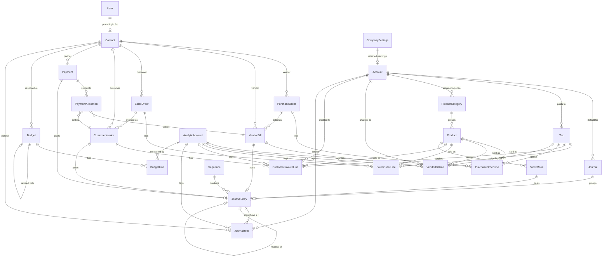
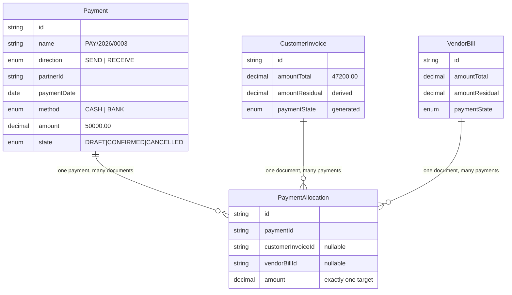

# The Data Model

This section is the blueprint of the database. Everything else in the app — every screen, every report, every button — is a thin layer over these tables. If the schema is right, the rest of the build is typing. If the schema is wrong, no amount of front-end polish saves the project, and a judge will find the crack in about twenty seconds.

Read this section slowly. It is the one part of the document where being 30 minutes slower at hour 2 saves you 6 hours at hour 16.

**File this lives in:** `prisma/schema.prisma`
**Database:** PostgreSQL 15+ (Neon, Supabase, or Railway — anything that gives you a `DATABASE_URL`)
**ORM:** Prisma
**Migrations:** `prisma/migrations/` — and three of them will be hand-written SQL, which is exactly the point.

---

## 4.1 Fifteen words you must know before the tables make sense

You said you know nothing about accounting. Fine. Here is the entire vocabulary you need to read this section. Nothing else in this section uses a term that is not defined here or defined the moment it first appears.

| Word | What it actually means | Concrete example |
|---|---|---|
| **Account** | A labelled bucket that money is counted into. Nothing more. | "Bank A/c" is the bucket for money in the bank. "Sales Income A/c" is the bucket for money earned by selling. |
| **Chart of Accounts (CoA)** | The full list of every bucket the business has. | Our app ships with 8 mandated buckets pre-created. |
| **Debit** | A number written in the **left** column. | Money arriving into an asset bucket is a debit. |
| **Credit** | A number written in the **right** column. | Money earned as income is a credit. |
| **Double entry** | The 500-year-old rule: every event is written **twice** — once as a debit, once as a credit — and the two must be equal. | Customer pays ₹20,000 in cash: Bank goes up ₹20,000 (debit), the customer owes you ₹20,000 less (credit). |
| **Journal Entry** | One complete event in the books. Has a date, a reference, and 2 or more lines. | "INV/2026/0001 posted on 02-Sep-2026." |
| **Journal Item** | One single line inside a journal entry: one account, one debit amount, one credit amount. | "Debtors A/c — Debit ₹47,200." |
| **Journal** | A folder that groups similar entries. The spec mandates 4: Sales, Purchase, Bank, Cash. | Every customer invoice's entry goes in the Sales journal. |
| **Debtors / Receivable** | The bucket holding "money customers owe us but have not paid yet". | You invoiced Nimesh ₹47,200 and he has not paid → Debtors = ₹47,200. |
| **Creditors / Payable** | The bucket holding "money we owe suppliers but have not paid yet". | Azure Furniture billed you ₹28,320 → Creditors = ₹28,320. |
| **Capital / Equity** | The owner's own money in the business, plus every rupee of profit the business has ever kept. | Owner put in ₹6,45,000 to start. |
| **Balance Sheet** | A photograph of what the business owns and owes **on one date**. Assets must equal Liabilities + Capital. | "As of 05-Sep-2026: Assets ₹8,42,310 = Liabilities ₹1,97,310 + Capital ₹6,45,000." |
| **Profit & Loss (P&L)** | A video of income minus expenses **between two dates**. | "01-Apr-2026 to 05-Sep-2026: Income ₹10,000 − Expenses ₹7,000 = Net ₹3,000." |
| **Residual** | How much of an invoice is still unpaid, right now. | Invoice ₹47,200, paid ₹20,000 → residual ₹27,200. |
| **Reversal** | Cancelling a posted entry by writing a **mirror-image** entry (debits and credits swapped), leaving both in the books forever. | You never erase a line in accounting. You write the opposite line. |

Two more that will make you sound like you have done this for ten years, and which a judge will notice instantly:

- **Analytic account** — a project or department tag stapled onto a transaction line, so you can ask "how much did Project 1 cost?" without disturbing the real accounts. The mockup calls this column **"Budget Analytics"**.
- **Trial balance** — add up every debit in the whole database, add up every credit. If double entry is honoured, the two numbers are identical and their difference is exactly `0.00`. This is the single number that proves your books are real.

---

## 4.2 The shape of the whole thing, in one picture

Read this diagram in three bands.

- **Top band — masters.** Things you configure once and reuse forever: contacts, products, accounts, journals, taxes, analytic accounts.
- **Middle band — documents.** The paperwork of the business: purchase orders, bills, sales orders, invoices, payments.
- **Bottom band — the ledger.** `JournalEntry` and `JournalItem`. Every document flows down into here. **Every report is read only from here.** Nothing ever reads back up.



Notice the direction of every arrow at the bottom. `VendorBill → JournalEntry`. `CustomerInvoice → JournalEntry`. `Payment → JournalEntry`. `StockMove → JournalEntry`. **Four different document types, one destination.** There is no arrow going the other way from a report into a document. That single property is what makes this a real accounting system, and it is the subject of decision (b) below.

**Say this to a judge who is looking at the diagram:**
> "Documents are inputs. The ledger is the output. Reports only ever read the ledger. There is no code path anywhere in this app that computes a financial figure by summing invoice rows."

---

## 4.3 The three decisions that decide whether this project works

Everything else in this section is craft. These three are load-bearing. Two of them cannot be retrofitted after hour 12 — if you get them wrong, the fix is a rewrite of the payment module and the entire reporting layer.

### (a) `PaymentAllocation` must be its own table. A `paid` boolean is a trap you cannot escape.

**The naive design that 70% of teams will ship:**

```prisma
model CustomerInvoice {
  amountTotal Decimal
  paid        Boolean  @default(false)   // ← the trap
}
```

Here is why it fails, in a scenario that takes a judge eight seconds to create.

Nimesh Pathak owes you ₹47,200 on `INV/2026/0001`. On 10-Sep he sends ₹20,000 by UPI. On 18-Sep he sends another ₹15,000. On 25-Sep he sends ₹12,200.

With `paid: Boolean`, what value do you write after the first ₹20,000? `true` is a lie — he owes ₹27,200. `false` is also a lie — ₹20,000 arrived and is sitting in your bank. There is no third value. The mockup's own status legend has three states, not two:

> **Paid** — if amount due = 0 · **Partial** — if amount due < Bill Total · **Not Paid** — if amount due = Bill Total

A boolean cannot produce three states. The organizers put "Partial" on the mockup deliberately.

It gets worse. Real payments are **many-to-many**. One ₹50,000 NEFT from a customer often settles three invoices at once (₹18,000 + ₹22,000 + ₹10,000). And one invoice often gets settled by four small payments. A boolean on the invoice, or even an `invoiceId` column on the payment, cannot represent either shape.

**The correct design — one row per (payment, document, amount) triple:**

```prisma
model PaymentAllocation {
  paymentId         String
  customerInvoiceId String?
  vendorBillId      String?
  amount            Decimal @db.Decimal(14, 2)
}
```

Now `residual` is not a stored fact, it is arithmetic:

```
residual(invoice) = invoice.amountTotal − SUM(allocation.amount WHERE allocation.customerInvoiceId = invoice.id
                                              AND allocation.payment.state = 'CONFIRMED')
```

And the three badges fall out of that one number with no extra state:

| residual | badge |
|---|---|
| `= 0` | **Paid** |
| `> 0 AND < amountTotal` | **Partial** |
| `= amountTotal` | **Not Paid** |

The mockup's footer fields also become free. "Paid Via Cash" and "Paid Via Bank" are the same sum, grouped by `payment.method`:

```sql
SELECT p.method, SUM(a.amount)
FROM payment_allocation a JOIN payment p ON p.id = a.payment_id
WHERE a.customer_invoice_id = $1 AND p.state = 'CONFIRMED'
GROUP BY p.method;
```

**Why you cannot retrofit this at hour 14.** By then you have: a payment form that writes `invoice.paid = true`, a status badge component reading that boolean, a receivables report filtering `WHERE paid = false`, a dashboard counter, seed data with the boolean baked in, and a journal-posting routine that clears the whole invoice. Introducing allocations means rewriting all seven of those *plus* re-deriving every existing row *plus* re-posting your seed ledger. That is a 4-hour surgery in a 19-hour build, done tired, on the thing most likely to break the demo. Build the join table in the first hour. It costs you twenty extra minutes now.

**Bonus you get for free:** overpayment. If a customer sends ₹50,000 against a ₹47,200 invoice, `SUM(allocations) = 47,200` and `payment.amount − allocated = 2,800` sits as an unallocated credit you can offer on the next invoice. In the boolean design this money simply vanishes.

**Say this to a judge:**
> "Payment and invoice are many-to-many, so the link carries its own amount. Residual is always derived from allocations — there is no `paid` column anywhere in the schema. That is also why partial payments and overpayment credits work without special-casing."

---

### (b) `JournalItem` is the single source of truth. Reports never touch a document table.

This is the fake that the strategic analysis says 70–80% of accounting submissions will ship, and it is invisible in a scripted demo:

```sql
-- THE FAKE. Never write this query.
SELECT SUM(amount_total) FROM customer_invoice WHERE ...  -- "Income"
SELECT SUM(amount_total) FROM vendor_bill      WHERE ...  -- "Expense"
```

In that design the `journal_entry` table exists, gets written to, and is **read by nothing**. It is a decorative log. The system looks perfect until the judge does one of these:

1. **Posts a manual journal entry.** `Dr Cash ₹5,00,000 / Cr Capital ₹5,00,000` — the owner putting money in. This is not an invoice, so the fake Balance Sheet does not move by one rupee. The mockup *explicitly* includes a manual Journal Entry form with a **Post** button, which means the organizers expect this to work.
2. **Adds up the Balance Sheet.** Assets vs Liabilities + Capital. A document-summed balance sheet almost never ties.
3. **Pays half an invoice** and checks whether Debtors dropped by exactly half.

**The correct design.** Exactly one table is allowed to be the source of a financial number:

```
journal_item (state='POSTED')
```

Everything else is an aggregation over it, distinguished only by the `WHERE` clause and the account types included:

| Report | Aggregation semantics |
|---|---|
| **Balance Sheet** as of date T | `SUM(debit − credit)` over **all time up to T** (`date <= T`), for account types `ASSET, BANK, CASH, LIABILITY, CAPITAL` |
| **P&L** for period [A, B] | `SUM(credit − debit)` **between two dates**, for account types `INCOME, EXPENSE, OTHER_EXPENSE` |
| **Trial Balance** | `SUM(debit)`, `SUM(credit)` over everything — difference must be `0.00` |
| **General / Partner Ledger** | Same table, filtered by `account_id` or `partner_id`, ordered by date, with a running balance |
| **Budget actuals** | Same table, filtered by `analytic_account_id` and the budget period |
| **Stock valuation** | Same table, `account.subtype = 'INVENTORY'` |

Six reports, one table. That is why the schema puts so much care into `JournalItem`: it is doing all the work.

**The consequence you must design for.** Because reports never join back to documents, `JournalItem` has to carry, on the row itself, every column a report ever filters by. That means deliberately copying four values from the parent entry onto every item:

```prisma
model JournalItem {
  date              DateTime        // copied from JournalEntry.date
  state             EntryState      // copied from JournalEntry.state
  journalId         String          // copied from JournalEntry.journalId
  partnerId         String?         // copied from JournalEntry.partnerId, overridable per line
}
```

This is deliberate denormalization, and here is the trade in plain numbers. Copying costs you **one extra `UPDATE` statement at posting time** (`UPDATE journal_item SET state='POSTED' WHERE entry_id = $1`), which happens maybe 50 times during your demo. It saves you **a join on every single report read**, which happens every time anyone drags the as-of-date slider — hundreds of times per minute. Optimise the read.

It also makes the killer index possible (see §4.9): a covering index on `(state, date, account_id) INCLUDE (debit, credit)` lets Postgres answer the entire Balance Sheet from the index alone without touching the table heap.

**The freebie this unlocks — the as-of-date slider.** Because the Balance Sheet is literally `f(T) = aggregate(journal_item WHERE date <= T)`, changing `T` re-derives the whole report. Drag a slider from September back to April and Debtors climbs, Bank drops, Capital holds steady. This is the most visually striking thing this problem statement offers, and it is *impossible* to build on document-summed reports — because there is nowhere for opening balances or manual entries to live. You get it almost for free, but only because the schema is right.

**Say this to a judge:**
> "Every rupee in every report comes out of one table — `journal_item` — filtered by `state = 'POSTED'`. The Balance Sheet is a cumulative sum with `date <= T`; the P&L is a windowed sum between two dates. Same table, two aggregation semantics. Post a manual journal entry right now and watch the Balance Sheet move."

---

### (c) Posted entries are append-only. Cancelling writes a reversal, never a `DELETE`.

Every developer's instinct is a Delete button. In accounting, a delete button is a fraud tool. Once an entry is posted it is part of the audit trail; erasing it silently rewrites history, and the P&L you printed last week no longer reproduces.

The rule, enforced at the database level, not just in application code:

- A `JournalEntry` in state `POSTED` cannot have its items updated or deleted. A `BEFORE UPDATE OR DELETE` trigger named `journal_item_is_append_only` raises an exception (SQL below in §4.8).
- To cancel a posted invoice, the system inserts a **new** entry whose debits and credits are swapped, linked back via `reversalOfId`. Both rows stay in the ledger forever. The net effect on every report is zero, and the audit trail shows what happened and when.

Original entry for `INV/2026/0001`:

| Account | Debit | Credit |
|---|---:|---:|
| Debtors A/c | 47,200.00 | |
| Sales Income A/c | | 40,000.00 |
| Output GST A/c | | 7,200.00 |

Reversal entry, `name = "RINV/2026/0001"`, `reversalOfId = <original>`:

| Account | Debit | Credit |
|---|---:|---:|
| Debtors A/c | | 47,200.00 |
| Sales Income A/c | 40,000.00 | |
| Output GST A/c | 7,200.00 | |

Sum of both entries across every account: zero. Reports self-correct. Nothing was erased.

**The one place the mockup pushes back — and how to honour it honestly.** The mockup's Journal Entry screen has a **"Reset to Draft"** button. That is a real requirement and you must build it. It is not a contradiction of immutability; it is the same thing Odoo ships. Implement it as an explicit, guarded, logged state transition rather than a silent edit:

`resetToDraft(entryId)` is refused if **any** of these hold:
1. The entry's date is on or before `CompanySettings.lockDate` — "Period locked by Admin on 31-Mar-2026."
2. The source document has any `PaymentAllocation` rows — you cannot un-post an invoice someone has already paid against.
3. The caller is not `ADMIN`.

If it passes, the service writes an `AuditLog` row and flips `state` to `DRAFT`, which is what un-freezes the trigger. So the DB trigger blocks *silent* mutation absolutely; the only way to change a posted entry is a recorded, permission-gated, lock-date-checked transition. That is the honest answer and it is stronger than pretending the button does not exist.

**Ordering detail that will bite you if you miss it.** Because the trigger reads the *parent entry's* state, the posting service must update children before the parent:

```ts
await tx.journalItem.updateMany({ where: { entryId }, data: { state: 'POSTED' } });  // entry still DRAFT — allowed
await tx.journalEntry.update({ where: { id: entryId }, data: { state: 'POSTED', postedAt: new Date() } });
```

Reverse that order and your own trigger locks you out of your own posting routine. Write it down now.

**Say this to a judge:**
> "There is no Edit button on a posted entry and no Delete anywhere in the ledger. Cancelling generates a reversal — mirrored debits and credits — so both rows stay in the books. The database enforces it with a trigger, not just the API. Try `UPDATE journal_item SET debit = 99999` in psql and it will refuse."

---

## 4.4 Money, dates, and IDs — the three type decisions

Before any table, settle these three or you will fix them 40 times.

**Money is `Decimal(14,2)`. Never `Float`.**
`Float` is binary floating point. `0.1 + 0.2` is `0.30000000000000004`. In an accounting system that means a journal entry whose debits are `47200.00` and credits are `47199.999999999996`, which violates your own balance constraint at 3 a.m. for no visible reason. PostgreSQL `NUMERIC(14,2)` is exact decimal arithmetic. `14,2` gives you up to ₹9,99,99,99,99,999.99 — more than enough for a furniture business, and it fits comfortably in Postgres's numeric representation.

```prisma
amountTotal Decimal @db.Decimal(14, 2)
```

Prisma returns these as `Decimal.js` objects. Rule for the whole codebase: **do arithmetic in `Decimal`, call `.toNumber()` only at the last moment before rendering.** Quantities are `Decimal(12,3)` — three decimal places so 0.5 kg or 2.25 hours works. Tax rates are `Decimal(5,2)` — `18.00`.

**Dates are `DateTime` but semantically date-only.**
An accounting date has no time zone. `2026-09-02` in Mumbai and `2026-09-02` in the database must be the same day, or your P&L for September silently includes an invoice from 31-Aug. Store every accounting date at UTC midnight (`new Date('2026-09-02T00:00:00.000Z')`) and never use `new Date()` directly for a `date` field. Use `createdAt`/`postedAt` (true timestamps) for audit, and `date` (UTC-midnight) for accounting. These are different fields with different meanings and you will need both.

**IDs are `cuid()` strings.**
Not auto-increment integers. Two reasons that matter here. First, an auto-increment invoice ID leaks how many invoices exist and tempts you into using it as the document number — which is the mistake the analysis calls out ("teams use auto-increment IDs and lose the point"). The **document number** is a separate, human-meaningful, gapless, per-year sequence (`INV/2026/0001`) allocated from the `Sequence` table at post time. Second, cuids can be generated client-side, which makes optimistic UI and seed scripts simpler.

---

## 4.5 The masters

### Why these tables exist

Master data is the stuff you type in once and then pick from a dropdown forever. The whole point of a master is that the *transaction* stores a foreign key, not a copy of the text. If you store the customer's name as a string on the invoice and the customer later corrects the spelling, you now have two spellings in your reports. Six masters, six dropdowns, zero duplication.

### User, Contact, Product, ProductCategory

```prisma
// ─────────────────────────────────────────────────────────────
//  prisma/schema.prisma  —  block 1 of 6 : identity & partners
// ─────────────────────────────────────────────────────────────
datasource db {
  provider = "postgresql"
  url      = env("DATABASE_URL")
}

generator client {
  provider = "prisma-client-js"
}

/// Three roles. The mockup draws two radio buttons (User / Administrator)
/// but its own role annotation describes THREE: Admin, Accountant, User(portal).
/// We ship all three; the Create-User form gets a third radio.
enum UserRole {
  ADMIN        // everything
  ACCOUNTANT   // masters, transactions, reports — no user management, no lock date
  PORTAL       // sees ONLY its own invoices/bills, and can pay them
}

model User {
  id           String    @id @default(cuid())
  name         String
  /// Mockup rule, stated twice (Create User + Sign Up):
  /// unique AND between 6 and 12 characters. Enforced by CHECK in §4.8.
  loginId      String    @unique @db.VarChar(12)
  email        String    @unique
  /// bcrypt, cost 10. Password policy (>8 chars, 1 lower, 1 upper, 1 special)
  /// is validated in zod before hashing — see the Auth section.
  passwordHash String
  role         UserRole  @default(PORTAL)

  /// THE row-level-security link. A PORTAL user is tied to exactly one Contact,
  /// and every portal query is scoped `WHERE customerId = user.contactId`.
  /// Self-signup always creates role=PORTAL — a signup can never mint an admin.
  contactId    String?
  contact      Contact?  @relation(fields: [contactId], references: [id], onDelete: SetNull)

  active       Boolean   @default(true)
  lastLoginAt  DateTime?
  createdAt    DateTime  @default(now())
  updatedAt    DateTime  @updatedAt

  postedEntries JournalEntry[]     @relation("PostedBy")
  allocations   PaymentAllocation[]

  @@index([role, active])
  @@map("user")
}

enum ContactType {
  CUSTOMER
  VENDOR
  BOTH
}

model Contact {
  id       String      @id @default(cuid())
  name     String
  type     ContactType @default(CUSTOMER)
  /// Mockup placeholder literally reads "Unique Email".
  email    String?     @unique
  mobile   String?     @db.VarChar(15)

  street1  String?
  street2  String?
  city     String?
  state    String?
  country  String?     @default("India")
  pincode  String?     @db.VarChar(6)

  /// Uploaded to Vercel Blob / UploadThing; we store the URL, never the bytes.
  /// Must render in the list thumbnail column AND the kanban card (mockup).
  imageUrl String?

  /// ── ADDITION (beyond the spec, and it earns its place) ──
  /// Per-partner override of the receivable/payable account. The posting engine
  /// resolves: contact override → journal default → company default.
  /// This is what makes the engine CONFIG-DRIVEN rather than hardcoded, which is
  /// the exact thing an Odoo judge probes for. Costs 2 columns, buys the demo.
  receivableAccountId String?
  receivableAccount   Account? @relation("ContactReceivable", fields: [receivableAccountId], references: [id])
  payableAccountId    String?
  payableAccount      Account? @relation("ContactPayable",    fields: [payableAccountId],    references: [id])

  /// "Cancel" on a master means ARCHIVE, not DELETE (mockup, Budget stage table).
  /// Every master carries this flag and every list view filters `active = true`
  /// unless the Archived toggle is on.
  active    Boolean  @default(true)
  createdAt DateTime @default(now())
  updatedAt DateTime @updatedAt

  users            User[]
  purchaseOrders   PurchaseOrder[]
  vendorBills      VendorBill[]
  salesOrders      SalesOrder[]
  customerInvoices CustomerInvoice[]
  payments         Payment[]
  journalItems     JournalItem[]
  journalEntries   JournalEntry[]
  budgets          Budget[]         @relation("BudgetResponsible")

  @@index([type, active])
  @@index([name])
  @@map("contact")
}

enum ProductType {
  GOODS
  SERVICE
  COMBO
}

model ProductCategory {
  id   String @id @default(cuid())
  name String @unique

  /// ── ADDITION ── Category-level account mapping.
  /// The posting engine asks the product's category which Income account to
  /// credit and which Expense account to debit. Change "Furniture" category's
  /// income account and the NEXT invoice posts differently — live, on stage.
  incomeAccountId  String?
  incomeAccount    Account? @relation("CategoryIncome",  fields: [incomeAccountId],  references: [id])
  expenseAccountId String?
  expenseAccount   Account? @relation("CategoryExpense", fields: [expenseAccountId], references: [id])

  active   Boolean   @default(true)
  products Product[]

  @@map("product_category")
}

model Product {
  id         String      @id @default(cuid())
  name       String
  type       ProductType @default(GOODS)
  /// Mockup: "Rs. 100.00" / "Rs. 50.00" — two decimals, rupees.
  salesPrice Decimal     @default(0) @db.Decimal(14, 2)
  cost       Decimal     @default(0) @db.Decimal(14, 2)

  /// Mockup: "Category Can be created and saved on the fly (Many2one Field)".
  /// The combobox must support quick-create — see the UI Scaffold section.
  categoryId String?
  category   ProductCategory? @relation(fields: [categoryId], references: [id])

  imageUrl   String?

  /// ── ADDITION ── per-product account + default tax override.
  /// Same three-step resolution chain as Contact. Optional in the UI.
  incomeAccountId  String?
  incomeAccount    Account? @relation("ProductIncome",  fields: [incomeAccountId],  references: [id])
  expenseAccountId String?
  expenseAccount   Account? @relation("ProductExpense", fields: [expenseAccountId], references: [id])
  salesTaxId       String?
  salesTax         Tax?     @relation("ProductSalesTax",    fields: [salesTaxId],    references: [id])
  purchaseTaxId    String?
  purchaseTax      Tax?     @relation("ProductPurchaseTax", fields: [purchaseTaxId], references: [id])

  /// ── ADDITION (covers the PDF Overview's "and STOCK reports" clause) ──
  /// Only GOODS are tracked. Quantity on hand is NEVER stored here; it is
  /// SUM(stock_move.signed_qty). See §4.7.
  trackInventory Boolean @default(true)
  /// Moving-average cost, recomputed on each receipt. This one IS a cache and
  /// it is honest about it — the movement ledger remains the source of truth.
  avgCost        Decimal @default(0) @db.Decimal(14, 4)

  active    Boolean  @default(true)
  createdAt DateTime @default(now())
  updatedAt DateTime @updatedAt

  purchaseOrderLines   PurchaseOrderLine[]
  vendorBillLines      VendorBillLine[]
  salesOrderLines      SalesOrderLine[]
  customerInvoiceLines CustomerInvoiceLine[]
  stockMoves           StockMove[]
  journalItems         JournalItem[]

  @@index([categoryId, active])
  @@index([name])
  @@map("product")
}
```

**A note on why `Product` has no `quantityOnHand` column.** Because a mutable counter is a lie waiting to happen. If two orders ship at the same moment, or a cancellation forgets to decrement, the counter drifts and there is no way to find out when. `SUM(stock_move)` cannot drift — it is the same append-only discipline as the ledger, applied to units instead of rupees. Same argument as decision (c), same reason.

---

## 4.6 The ledger spine — Account, Journal, JournalEntry, JournalItem, Tax, Sequence

This is the heart. Read this subsection twice.

### The account type taxonomy, and why both reports depend on it

The mockup's Chart of Accounts "New Account" form specifies a **grouped dropdown** with non-selectable headings:

```
Balancesheet          (heading — not selectable)
    Asset
    Liability
    Bank
    Capital
    Cash
Profit and Loss       (heading — not selectable)
    Income
    Expenses
    Other Expenses
```

And the mockup's blue annotation next to it says exactly why this field exists:

> "Each account is assigned an Account Type, which would further be used for **how the account is to be treated and where it appears in reports**."

That sentence is the whole design. The account type is a **routing key**. Reports are generated by grouping on `account.type` — never by matching account *names*. If a judge renames "Sales Income A/c" to "Revenue A/c", the P&L must not care.

Now cross-reference the two report annotations from the mockup.

**Balance Sheet mapping (verbatim from the drawing):**
> Bank → Account type **Asset - Bank** · Cash → Account type **Asset - cash** · Debtors → Account type **Asset - Debtors** · Creditors → Account type **Liability - creditor** · Capital → **Account Type Capital**

**P&L mapping (verbatim):**
> Income from Sales → total of account type **Income** · Purchase Expense → total of account type **Expense** · Other Expense → total of account type **Other Expense** · Net Income → Income − Expenses

Compare the two lists. The Balance Sheet note asks for `Asset-Debtors` and `Liability-Creditor` — but "Debtors" and "Creditor" are **not** in the dropdown. This is the one genuine ambiguity in the mockup, and here is the clean resolution:

**Two fields: `type` (the eight leaf values from the dropdown, verbatim) plus `subtype` (a role tag that pins the special accounts).**

```
type     = ASSET | LIABILITY | BANK | CAPITAL | CASH | INCOME | EXPENSE | OTHER_EXPENSE
subtype  = NONE | RECEIVABLE | PAYABLE | TAX_COLLECTED | TAX_PAID
           | INVENTORY | COGS | RETAINED_EARNINGS | CURRENT_YEAR_EARNINGS | ROUNDING
```

Every report row in the mockup now maps to a precise, machine-checkable filter:

| Report row (from the mockup) | Filter |
|---|---|
| Balance Sheet → **Bank** | `type = 'BANK'` |
| Balance Sheet → **Cash** | `type = 'CASH'` |
| Balance Sheet → **Debtors** | `type = 'ASSET' AND subtype = 'RECEIVABLE'` |
| Balance Sheet → **Creditors** | `type = 'LIABILITY' AND subtype = 'PAYABLE'` |
| Balance Sheet → **Capital** | `type = 'CAPITAL'` |
| P&L → **Income from Sales** | `type = 'INCOME'` |
| P&L → **Purchase Expense** | `type = 'EXPENSE'` |
| P&L → **Other Expense** | `type = 'OTHER_EXPENSE'` |

Two more properties are *derived* from `type` and belong in one shared TypeScript table, not scattered through the code:

```ts
// lib/accounting/account-type.ts — the single place this knowledge lives
export const ACCOUNT_TYPE_META = {
  ASSET:         { section: 'BALANCE_SHEET', side: 'ASSET',     normal: 'DEBIT'  },
  BANK:          { section: 'BALANCE_SHEET', side: 'ASSET',     normal: 'DEBIT'  },
  CASH:          { section: 'BALANCE_SHEET', side: 'ASSET',     normal: 'DEBIT'  },
  LIABILITY:     { section: 'BALANCE_SHEET', side: 'LIABILITY', normal: 'CREDIT' },
  CAPITAL:       { section: 'BALANCE_SHEET', side: 'LIABILITY', normal: 'CREDIT' },
  INCOME:        { section: 'PROFIT_LOSS',   side: 'INCOME',    normal: 'CREDIT' },
  EXPENSE:       { section: 'PROFIT_LOSS',   side: 'EXPENSE',   normal: 'DEBIT'  },
  OTHER_EXPENSE: { section: 'PROFIT_LOSS',   side: 'EXPENSE',   normal: 'DEBIT'  },
} as const;
```

**What "normal balance" means, in one sentence:** some buckets grow when you debit them (Bank, Cash, Debtors, Expenses) and some grow when you credit them (Creditors, Capital, Income). `normal` tells the report which direction to display as a positive number, so a ₹40,000 sale shows as **+₹40,000 income**, not −₹40,000.

**Why both reports depend on this one field.** `section` splits the eight types into two disjoint groups. Balance Sheet takes the five `BALANCE_SHEET` types cumulatively from the beginning of time to date T. P&L takes the three `PROFIT_LOSS` types between two dates. There is no third rule and no account can appear in both reports. That is the entire report engine's routing logic, and it is nine lines of data.

**And the one thing that makes the Balance Sheet actually balance.** Assets = Liabilities + Capital only holds if this year's profit is added to the Capital side. That figure is called **Current Year Earnings**: `SUM(credit − debit)` over all `PROFIT_LOSS` accounts for the current fiscal year. It is a *virtual* row — it exists in `CompanySettings.currentYearEarningsAccountId` as a placeholder account so the report can label it, but no journal item is ever posted to it during the year. The detailed derivation belongs to the **Reporting Engine** section; the schema's only job is to make sure the account type taxonomy can express it, which it does.

### The mandated seed data, with one correction

The mockup says in orange next to the Chart of Accounts list: **"All this accounts are to be pre configured."** Here is the seed, with the 8 mandated rows plus 7 additions that the posting engine needs.

| Code | Account Name | type | subtype | Source |
|---|---|---|---|---|
| 1100 | Bank A/c | `BANK` | `NONE` | mandated |
| 1200 | Cash A/c | `CASH` | `NONE` | mandated |
| 1300 | Debtors A/c | `ASSET` | `RECEIVABLE` | mandated |
| 1400 | Input GST A/c | `ASSET` | `TAX_PAID` | ADDITION — tax must land somewhere |
| 1500 | Inventory A/c | `ASSET` | `INVENTORY` | ADDITION — stock reports |
| 2100 | Creditors A/c | `LIABILITY` | `PAYABLE` | mandated |
| 2200 | Output GST A/c | `LIABILITY` | `TAX_COLLECTED` | ADDITION — tax must land somewhere |
| 3100 | Capital A/c | `CAPITAL` | `NONE` | mandated |
| 3200 | Retained Earnings A/c | `CAPITAL` | `RETAINED_EARNINGS` | ADDITION — prior-year profit |
| 3300 | Current Year Earnings | `CAPITAL` | `CURRENT_YEAR_EARNINGS` | ADDITION — virtual, makes BS tie |
| 4100 | Sales Income A/c | `INCOME` | `NONE` | mandated |
| 5100 | Purchase Expense A/c | `EXPENSE` | `NONE` | mandated |
| 5200 | Cost of Goods Sold A/c | `EXPENSE` | `COGS` | ADDITION — stock reports |
| 6100 | Other Expense A/c | `OTHER_EXPENSE` | `NONE` | mandated (**see note**) |
| 6900 | Rounding Difference A/c | `OTHER_EXPENSE` | `ROUNDING` | ADDITION — tax rounding |

> **The one-word correction, and say it out loud to a judge.** The mockup's Chart of Accounts *list* shows "Other Expense A/c — Expense". But the mockup's own P&L computation note says "Other Expense — Total of **account type Other Expense**", and the account-type dropdown has a distinct "Other Expenses" leaf. Typing that account as `EXPENSE` would make the P&L's "Other Expense" row permanently ₹0.00 and double-count it into Purchase Expense. We seed it as `OTHER_EXPENSE`. This is not us deviating from the spec — it is us resolving a contradiction *inside* the spec in the only direction that makes the specified P&L formula produce correct numbers.
>
> **Say this:** "The list view and the report formula disagree on one account's type. We followed the report formula, because the P&L explicitly names 'account type Other Expense' as a separate line. If we'd followed the list view, that row would always print zero."

The four mandated journals, likewise pre-seeded (mockup, Journals list view):

| Journal Name | type | Default Account | Prefix |
|---|---|---|---|
| Sales | `SALES` | Sales Income A/c (4100) | `INV` |
| Purchase | `PURCHASE` | Purchase Expense A/c (5100) | `BILL` |
| Bank | `BANK` | Bank A/c (1100) | `BNK` |
| Cash | `CASH` | Cash A/c (1200) | `CSH` |

### The ledger schema

```prisma
// ─────────────────────────────────────────────────────────────
//  block 2 of 6 : the ledger spine — this is the whole project
// ─────────────────────────────────────────────────────────────

/// Eight values, verbatim from the mockup's grouped dropdown.
/// The two headings (Balancesheet / Profit and Loss) are display-only in the
/// combobox and are derived here from ACCOUNT_TYPE_META.section.
enum AccountType {
  ASSET
  LIABILITY
  BANK
  CAPITAL
  CASH
  INCOME
  EXPENSE
  OTHER_EXPENSE
}

/// Role tag. Lets the posting engine ask for "the receivable account"
/// instead of searching for an account literally named "Debtors A/c".
enum AccountSubtype {
  NONE
  RECEIVABLE
  PAYABLE
  TAX_COLLECTED
  TAX_PAID
  INVENTORY
  COGS
  RETAINED_EARNINGS
  CURRENT_YEAR_EARNINGS
  ROUNDING
}

model Account {
  id      String         @id @default(cuid())
  /// Numeric code, e.g. "1300". Sorting the CoA by code produces the
  /// conventional Asset → Liability → Capital → Income → Expense order for free.
  code    String         @unique @db.VarChar(10)
  name    String
  type    AccountType
  subtype AccountSubtype @default(NONE)

  /// Only reconcilable accounts (Debtors, Creditors) can carry an open balance
  /// that a payment settles. Bank/Cash/Income are not reconcilable.
  reconcilable Boolean @default(false)

  /// Mockup: the Chart of Accounts list has an extra "Archived" button.
  active    Boolean  @default(true)
  createdAt DateTime @default(now())
  updatedAt DateTime @updatedAt

  journalItems           JournalItem[]
  journalsDefault        Journal[]         @relation("JournalDefault")
  journalsDebit          Journal[]         @relation("JournalDebit")
  journalsCredit         Journal[]         @relation("JournalCredit")
  taxesCollected         Tax[]             @relation("TaxCollected")
  taxesPaid              Tax[]             @relation("TaxPaid")
  contactsReceivable     Contact[]         @relation("ContactReceivable")
  contactsPayable        Contact[]         @relation("ContactPayable")
  categoriesIncome       ProductCategory[] @relation("CategoryIncome")
  categoriesExpense      ProductCategory[] @relation("CategoryExpense")
  productsIncome         Product[]         @relation("ProductIncome")
  productsExpense        Product[]         @relation("ProductExpense")
  vendorBillLines        VendorBillLine[]
  customerInvoiceLines   CustomerInvoiceLine[]

  /// Unique subtype where it must be unique: exactly one CURRENT_YEAR_EARNINGS,
  /// one RETAINED_EARNINGS, one ROUNDING. Enforced by a partial unique index (§4.8).
  @@index([type, active])
  @@index([subtype])
  @@map("account")
}

enum JournalType {
  SALES
  PURCHASE
  BANK
  CASH
}

model Journal {
  id   String      @id @default(cuid())
  code String      @unique @db.VarChar(8)   // "SAL", "PUR", "BNK", "CSH"
  name String
  type JournalType

  /// Mockup's single "Default Account" column.
  defaultAccountId String?
  defaultAccount   Account? @relation("JournalDefault", fields: [defaultAccountId], references: [id])

  /// ── ADDITION, and it is the difference between a real engine and if/else ──
  /// The counterpart accounts the posting engine reaches for.
  /// Sales journal: defaultDebit = Debtors (what the customer owes us).
  /// Purchase journal: defaultCredit = Creditors (what we owe the vendor).
  /// A judge who edits the Sales journal's default debit account and posts a new
  /// invoice will see the entry change. That is the proof of a table-driven engine.
  defaultDebitAccountId  String?
  defaultDebitAccount    Account? @relation("JournalDebit",  fields: [defaultDebitAccountId],  references: [id])
  defaultCreditAccountId String?
  defaultCreditAccount   Account? @relation("JournalCredit", fields: [defaultCreditAccountId], references: [id])

  /// Sequence prefix for entries in this journal: "INV", "BILL", "PAY".
  sequencePrefix String   @db.VarChar(8)
  active         Boolean  @default(true)

  entries      JournalEntry[]
  journalItems JournalItem[]
  payments     Payment[]

  @@map("journal")
}

enum EntryState {
  DRAFT
  POSTED
  CANCELLED
}

/// What kind of paperwork produced this entry. Kept as a plain enum + id rather
/// than four nullable FKs because the entry NEVER needs to join back — this pair
/// exists only for the "open source document" navigation link in the UI.
enum EntrySource {
  MANUAL
  VENDOR_BILL
  CUSTOMER_INVOICE
  PAYMENT
  STOCK_MOVE
  REVERSAL
  OPENING_BALANCE
}

model JournalEntry {
  id        String @id @default(cuid())
  /// "INV/2026/0001". Allocated from the Sequence table at POST time, not at
  /// draft creation — that is what makes the numbering gapless.
  name      String
  journalId String
  journal   Journal @relation(fields: [journalId], references: [id])

  /// The ACCOUNTING date. Mockup: "(Bill date fetch from bill)" — it is copied
  /// from the source document, never `new Date()`. Stored at UTC midnight.
  date      DateTime  @db.Date
  /// Free text, e.g. the bill reference "ABC-26-001".
  ref       String?
  partnerId String?
  partner   Contact?  @relation(fields: [partnerId], references: [id])

  state       EntryState  @default(DRAFT)
  sourceType  EntrySource @default(MANUAL)
  /// The id of the VendorBill / CustomerInvoice / Payment / StockMove row.
  sourceId    String?

  /// Reversal linkage. Self-relation: a cancelling entry points at what it undid.
  reversalOfId String?       @unique
  reversalOf   JournalEntry? @relation("Reversal", fields: [reversalOfId], references: [id])
  reversedBy   JournalEntry? @relation("Reversal")

  /// Denormalised totals, kept in sync by the deferred trigger in §4.8.
  /// They exist so the Journal Entries LIST view can show a Total column without
  /// aggregating children per row (the mockup's list has a Total column).
  totalDebit  Decimal @default(0) @db.Decimal(14, 2)
  totalCredit Decimal @default(0) @db.Decimal(14, 2)

  /// ── ADDITION: tamper-evident hash chain ──
  /// hash = sha256(prevHash || canonicalJson(header + all items)).
  /// Set once at POST time, never again. A "Verify Ledger" page walks the chain.
  /// ~90 minutes of work; it is the single strongest trust signal in the demo.
  chainIndex Int?     @unique
  prevHash   String?  @db.VarChar(64)
  hash       String?  @db.VarChar(64)

  postedAt   DateTime?
  postedById String?
  postedBy   User?     @relation("PostedBy", fields: [postedById], references: [id])
  createdAt  DateTime  @default(now())

  items JournalItem[]

  /// Document numbers are unique WITHIN a journal — INV/2026/0001 in Sales and
  /// BILL/2026/0001 in Purchase can coexist, but never two of the same.
  @@unique([journalId, name])
  @@index([state, date])
  @@index([sourceType, sourceId])
  @@map("journal_entry")
}

model JournalItem {
  id      String @id @default(cuid())
  entryId String
  entry   JournalEntry @relation(fields: [entryId], references: [id], onDelete: Cascade)
  lineNo  Int

  accountId String
  account   Account @relation(fields: [accountId], references: [id])

  label String?

  /// EXACTLY ONE of these is non-zero. Enforced by CHECK in §4.8.
  /// Never negative. A "negative debit" is a credit and must be written as one.
  debit  Decimal @default(0) @db.Decimal(14, 2)
  credit Decimal @default(0) @db.Decimal(14, 2)

  /// ── The four denormalised columns that make this table self-sufficient ──
  /// Copied from the parent entry at insert/post time. Reports NEVER join.
  date      DateTime   @db.Date
  state     EntryState @default(DRAFT)
  journalId String
  journal   Journal    @relation(fields: [journalId], references: [id])

  partnerId String?
  partner   Contact? @relation(fields: [partnerId], references: [id])

  /// The "Budget Analytics" column from every document line, carried all the way
  /// down into the ledger. THIS is the join most teams forget to plumb, and
  /// without it budget actuals have to be faked off invoice tables.
  analyticAccountId String?
  analyticAccount   AnalyticAccount? @relation(fields: [analyticAccountId], references: [id])

  productId String?
  product   Product? @relation(fields: [productId], references: [id])
  taxId     String?
  tax       Tax?     @relation(fields: [taxId], references: [id])

  createdAt DateTime @default(now())

  /// See §4.9 for why each of these exists and which report uses it.
  @@index([state, date, accountId])
  @@index([accountId, date])
  @@index([partnerId, date])
  @@index([analyticAccountId, date])
  @@index([entryId, lineNo])
  @@map("journal_item")
}

enum TaxScope {
  SALE
  PURCHASE
  BOTH
}

enum TaxComputation {
  EXCLUSIVE   // ₹40,000 + 18% = ₹47,200 charged
  INCLUSIVE   // ₹47,200 charged, of which ₹7,200 is tax
}

/// The PDF's Sales Order row explicitly lists "Tax" as a field. A hardcoded 18%
/// in the total calculation is one of the five named fakes. This is 5 columns.
model Tax {
  id          String         @id @default(cuid())
  name        String         @unique      // "GST 18%"
  rate        Decimal        @db.Decimal(5, 2)   // 18.00
  scope       TaxScope       @default(BOTH)
  computation TaxComputation @default(EXCLUSIVE)

  /// Output tax on a sale → a LIABILITY (you collected it for the government).
  collectedAccountId String?
  collectedAccount   Account? @relation("TaxCollected", fields: [collectedAccountId], references: [id])
  /// Input tax on a purchase → an ASSET (the government owes it back to you).
  paidAccountId      String?
  paidAccount        Account? @relation("TaxPaid",      fields: [paidAccountId],      references: [id])

  active Boolean @default(true)

  purchaseOrderLines   PurchaseOrderLine[]
  vendorBillLines      VendorBillLine[]
  salesOrderLines      SalesOrderLine[]
  customerInvoiceLines CustomerInvoiceLine[]
  journalItems         JournalItem[]
  productsSales        Product[] @relation("ProductSalesTax")
  productsPurchase     Product[] @relation("ProductPurchaseTax")

  @@map("tax")
}

/// Gapless, per-year, concurrency-safe document numbering.
/// The mockup demands "(auto generate Invoice Number +1 of Last Bill)" and shows
/// INV/2026/0001, Bill/2026/0001, PO0001. Auto-increment IDs do not satisfy this:
/// they are global, they leak, and they gap on every rolled-back transaction.
model Sequence {
  id         String @id @default(cuid())
  code       String @db.VarChar(32)   // "customer_invoice", "vendor_bill", "purchase_order", "sales_order", "payment"
  prefix     String @db.VarChar(16)   // "INV/", "BILL/", "PO", "SO", "PAY/"
  fiscalYear Int                      // 2026
  padding    Int    @default(4)       // 0001
  nextNumber Int    @default(1)

  @@unique([code, fiscalYear])
  @@map("sequence")
}
```

### The worked example, so the abstraction becomes concrete

Nimesh Pathak buys 5 Office Chairs at ₹8,000 each with GST 18%.

- Line subtotal: `5 × 8,000 = ₹40,000`
- Tax: `40,000 × 18% = ₹7,200`
- Invoice total: **₹47,200**

Posting the invoice writes **one** `JournalEntry` and **three** `JournalItem` rows:

| lineNo | account | subtype | debit | credit | date | partner | analytic |
|---|---|---|---:|---:|---|---|---|
| 1 | 1300 Debtors A/c | RECEIVABLE | 47,200.00 | 0.00 | 2026-09-02 | Nimesh | — |
| 2 | 4100 Sales Income A/c | NONE | 0.00 | 40,000.00 | 2026-09-02 | Nimesh | Project 1 |
| 3 | 2200 Output GST A/c | TAX_COLLECTED | 0.00 | 7,200.00 | 2026-09-02 | Nimesh | — |

`totalDebit = 47,200.00`, `totalCredit = 47,200.00`. Balanced. The deferred trigger lets it commit.

Nimesh pays ₹20,000 by bank on 10-Sep. Posting the payment writes a second entry:

| lineNo | account | debit | credit |
|---|---|---:|---:|
| 1 | 1100 Bank A/c | 20,000.00 | 0.00 |
| 2 | 1300 Debtors A/c | 0.00 | 20,000.00 |

Plus one `PaymentAllocation` row: `(payment → INV/2026/0001, ₹20,000.00)`.

Now run the reports off `journal_item` alone:

- **Balance Sheet, Debtors** = `47,200 − 20,000 = ₹27,200` ✓ (matches the invoice residual, but derived independently — that agreement is itself a proof)
- **Balance Sheet, Bank** = `+₹20,000`
- **P&L, Income from Sales** = `₹40,000` (the tax is not income; it never touches an `INCOME` account)
- **Invoice badge** = residual ₹27,200, which is `> 0` and `< 47,200` → **Partial**
- **Budget actual for Project 1** = `₹40,000` on the Income side

Every one of those five numbers came out of the same table with a different `WHERE` clause. That is the whole architecture.

---

## 4.7 The documents

### Why four document pairs and not one clever generic table

The obvious refactor is a single `Document` table with a `docType` enum and a single `DocumentLine`. Halve the tables, halve the code. **Reject it, for three specific reasons:**

1. **The fields genuinely differ.** A Purchase Order has no due date and no payment status. A Customer Invoice has `invoiceReference`, `dueDate`, `amountResidual`, and a link to its Sales Order. A unified table becomes 30 columns of which 12 are always null for any given row, and every query grows a `docType` filter you will forget exactly once, on the report that matters.
2. **Prisma cannot narrow a discriminated union.** `document.dueDate` would be `Date | null` everywhere, so every invoice screen gets a non-null assertion. You lose the main thing TypeScript is doing for you at hour 15 when you are tired.
3. **`PaymentAllocation` gets cleaner, not messier.** Two nullable FKs with a CHECK that exactly one is set is unambiguous and index-friendly. A polymorphic `(docType, docId)` pair cannot have a foreign key at all — you throw away referential integrity, which is precisely the thing you are trying to prove to the judge.

**The sharing happens in code, not in the schema.** All four documents implement the same TypeScript interface and go through the same three services:

```ts
// lib/documents/contract.ts
interface PostableDocument {
  id: string; name: string; date: Date;
  partnerId: string;
  lines: { accountId: string; analyticAccountId?: string;
           quantity: Decimal; unitPrice: Decimal; taxId?: string }[];
}
// One posting engine, one line-grid React component, one PDF renderer,
// one list/form scaffold — four tables. Share behaviour, not storage.
```

That is the right axis to deduplicate on, and it is worth saying to a judge if they ask why the schema is not "DRY".

### Purchase Order → Vendor Bill

```prisma
// ─────────────────────────────────────────────────────────────
//  block 3 of 6 : purchase side
// ─────────────────────────────────────────────────────────────

enum OrderState {
  DRAFT
  CONFIRMED
  PARTIALLY_BILLED   // some quantity converted, PO stays open
  BILLED
  CANCELLED
}

model PurchaseOrder {
  id       String @id @default(cuid())
  /// "PO0001" — mockup: "(Create Sequence auto generate PO number +1 of Last order)"
  name     String @unique
  vendorId String
  vendor   Contact @relation(fields: [vendorId], references: [id])

  orderDate DateTime   @db.Date
  state     OrderState @default(DRAFT)

  /// Caches, recomputed from lines inside the same transaction that edits them.
  /// Present so the LIST view does not aggregate children on every row.
  untaxedAmount Decimal @default(0) @db.Decimal(14, 2)
  taxAmount     Decimal @default(0) @db.Decimal(14, 2)
  amountTotal   Decimal @default(0) @db.Decimal(14, 2)

  notes     String?
  createdAt DateTime @default(now())
  updatedAt DateTime @updatedAt

  lines PurchaseOrderLine[]
  bills VendorBill[]

  @@index([state, orderDate])
  @@index([vendorId])
  @@map("purchase_order")
}

model PurchaseOrderLine {
  id      String @id @default(cuid())
  orderId String
  order   PurchaseOrder @relation(fields: [orderId], references: [id], onDelete: Cascade)
  /// The mockup's "Sr. No." column.
  lineNo  Int

  productId String
  product   Product @relation(fields: [productId], references: [id])
  description String?

  /// The mockup's "Budget Analytics" column. Feeds the EXPENSE side of budgets.
  analyticAccountId String?
  analyticAccount   AnalyticAccount? @relation(fields: [analyticAccountId], references: [id])

  quantity  Decimal @db.Decimal(12, 3)
  unitPrice Decimal @db.Decimal(14, 2)
  taxId     String?
  tax       Tax?    @relation(fields: [taxId], references: [id])

  /// Mockup annotation: "Unit Price * Quantity" and "(3Qty * 2000)".
  /// This is a POSTGRES GENERATED COLUMN — the app physically cannot write a
  /// wrong total. Added by a hand-edited migration; see §4.8.
  lineSubtotal Decimal @default(0) @db.Decimal(14, 2)

  /// Enables PARTIAL PO→Bill conversion: bill 12 of 20 units, PO stays open
  /// showing 8 still billable. CHECK (qty_billed <= quantity) in §4.8.
  qtyBilled Decimal @default(0) @db.Decimal(12, 3)

  billLines VendorBillLine[]

  @@unique([orderId, lineNo])
  @@index([analyticAccountId])
  @@map("purchase_order_line")
}

enum DocState {
  DRAFT
  POSTED
  CANCELLED
}

/// Computed badge — NEVER written by hand. Derived from amountResidual.
enum PaymentState {
  NOT_PAID
  PARTIAL
  PAID
}

model VendorBill {
  id   String @id @default(cuid())
  /// "BILL/2026/0001" — mockup: "(auto generate Bill Number +1 of Last Bill)"
  name String @unique

  /// NULL when the bill was created fresh. This one nullable FK is what drives
  /// the mockup's conditional smart button: "Only show this if bill created
  /// from PO, hide if Bill Created Fresh without PO."
  purchaseOrderId String?
  purchaseOrder   PurchaseOrder? @relation(fields: [purchaseOrderId], references: [id])

  vendorId String
  vendor   Contact @relation(fields: [vendorId], references: [id])

  /// The vendor's own reference, typed by the user. Mockup: "ABC-26-001",
  /// "Alpha numeric (Text)". Distinct from `name`, which we generate.
  billReference String?
  billDate      DateTime @db.Date
  dueDate       DateTime @db.Date

  state DocState @default(DRAFT)

  untaxedAmount Decimal @default(0) @db.Decimal(14, 2)
  taxAmount     Decimal @default(0) @db.Decimal(14, 2)
  amountTotal   Decimal @default(0) @db.Decimal(14, 2)

  /// THE derived number. Recomputed inside every transaction that touches an
  /// allocation: amountTotal − SUM(confirmed allocations).
  /// CHECK (0 <= amountResidual <= amountTotal) in §4.8.
  amountResidual Decimal @default(0) @db.Decimal(14, 2)

  /// A POSTGRES GENERATED COLUMN derived from the two above. It is physically
  /// impossible to set it wrong, which is a nice thing to show a judge.
  /// Prisma does not manage generated columns, so it is added by hand-edited SQL
  /// and read through a raw query / Prisma view; the UI also computes the same
  /// three-way badge in TS from amountResidual for zero-latency rendering.
  paymentState PaymentState @default(NOT_PAID)

  journalEntryId String? @unique

  createdAt DateTime @default(now())
  updatedAt DateTime @updatedAt

  lines       VendorBillLine[]
  allocations PaymentAllocation[]

  @@index([state, billDate])
  @@index([vendorId, dueDate])
  @@map("vendor_bill")
}

model VendorBillLine {
  id     String @id @default(cuid())
  billId String
  bill   VendorBill @relation(fields: [billId], references: [id], onDelete: Cascade)
  lineNo Int

  productId String
  product   Product @relation(fields: [productId], references: [id])
  description String?

  /// Mockup: "Purchase account to be set by default". NOT NULL — resolved at
  /// line creation by: product.expenseAccount → category.expenseAccount →
  /// journal.defaultAccount. The user can override it in the grid.
  accountId String
  account   Account @relation(fields: [accountId], references: [id])

  analyticAccountId String?
  analyticAccount   AnalyticAccount? @relation(fields: [analyticAccountId], references: [id])

  quantity     Decimal @db.Decimal(12, 3)
  unitPrice    Decimal @db.Decimal(14, 2)
  taxId        String?
  tax          Tax?    @relation(fields: [taxId], references: [id])
  lineSubtotal Decimal @default(0) @db.Decimal(14, 2)   // GENERATED

  /// Traceability for partial billing.
  purchaseOrderLineId String?
  purchaseOrderLine   PurchaseOrderLine? @relation(fields: [purchaseOrderLineId], references: [id])

  @@unique([billId, lineNo])
  @@index([analyticAccountId])
  @@map("vendor_bill_line")
}
```

The **Sales Order / Customer Invoice** pair is the exact mirror image. Only the differences are shown:

```prisma
// ─────────────────────────────────────────────────────────────
//  block 4 of 6 : sales side (mirror of block 3)
// ─────────────────────────────────────────────────────────────

model SalesOrder {
  id          String     @id @default(cuid())
  name        String     @unique          // "SO0001"
  customerId  String
  customer    Contact    @relation(fields: [customerId], references: [id])
  orderDate   DateTime   @db.Date
  state       OrderState @default(DRAFT)
  untaxedAmount Decimal  @default(0) @db.Decimal(14, 2)
  taxAmount     Decimal  @default(0) @db.Decimal(14, 2)
  amountTotal   Decimal  @default(0) @db.Decimal(14, 2)
  createdAt   DateTime   @default(now())
  updatedAt   DateTime   @updatedAt
  lines       SalesOrderLine[]
  invoices    CustomerInvoice[]

  @@index([state, orderDate])
  @@map("sales_order")
}

model SalesOrderLine {
  id                String @id @default(cuid())
  orderId           String
  order             SalesOrder @relation(fields: [orderId], references: [id], onDelete: Cascade)
  lineNo            Int
  productId         String
  product           Product @relation(fields: [productId], references: [id])
  description       String?
  analyticAccountId String?
  analyticAccount   AnalyticAccount? @relation(fields: [analyticAccountId], references: [id])
  quantity          Decimal @db.Decimal(12, 3)
  unitPrice         Decimal @db.Decimal(14, 2)
  taxId             String?
  tax               Tax?    @relation(fields: [taxId], references: [id])
  lineSubtotal      Decimal @default(0) @db.Decimal(14, 2)   // GENERATED
  qtyInvoiced       Decimal @default(0) @db.Decimal(12, 3)
  invoiceLines      CustomerInvoiceLine[]

  @@unique([orderId, lineNo])
  @@index([analyticAccountId])
  @@map("sales_order_line")
}

model CustomerInvoice {
  id   String @id @default(cuid())
  /// "INV/2026/0001" — mockup: "(auto generate Invoice Number +1 of Last Bill)"
  name String @unique

  /// NULL when created fresh → hides the "SO" smart button (mockup rule).
  salesOrderId String?
  salesOrder   SalesOrder? @relation(fields: [salesOrderId], references: [id])

  customerId String
  customer   Contact @relation(fields: [customerId], references: [id])

  /// Mockup: "ABC-26-001", "Alpha numeric (Text)". User-typed, not generated.
  invoiceReference String?
  invoiceDate      DateTime @db.Date
  /// Mockup shows Invoice Date AND Due Date as separate fields.
  /// Due date drives the receivables aging report.
  dueDate          DateTime @db.Date

  state DocState @default(DRAFT)

  untaxedAmount  Decimal @default(0) @db.Decimal(14, 2)
  taxAmount      Decimal @default(0) @db.Decimal(14, 2)
  amountTotal    Decimal @default(0) @db.Decimal(14, 2)
  amountResidual Decimal @default(0) @db.Decimal(14, 2)
  paymentState   PaymentState @default(NOT_PAID)   // GENERATED column

  journalEntryId String? @unique

  createdAt DateTime @default(now())
  updatedAt DateTime @updatedAt

  lines       CustomerInvoiceLine[]
  allocations PaymentAllocation[]

  @@index([state, invoiceDate])
  /// The aging report: unpaid invoices bucketed by how overdue they are.
  @@index([customerId, dueDate])
  @@map("customer_invoice")
}

model CustomerInvoiceLine {
  id                String @id @default(cuid())
  invoiceId         String
  invoice           CustomerInvoice @relation(fields: [invoiceId], references: [id], onDelete: Cascade)
  lineNo            Int
  productId         String
  product           Product @relation(fields: [productId], references: [id])
  description       String?
  /// Mockup: "Sales account to be set by default".
  accountId         String
  account           Account @relation(fields: [accountId], references: [id])
  analyticAccountId String?
  analyticAccount   AnalyticAccount? @relation(fields: [analyticAccountId], references: [id])
  quantity          Decimal @db.Decimal(12, 3)
  unitPrice         Decimal @db.Decimal(14, 2)
  taxId             String?
  tax               Tax?    @relation(fields: [taxId], references: [id])
  lineSubtotal      Decimal @default(0) @db.Decimal(14, 2)   // GENERATED
  salesOrderLineId  String?
  salesOrderLine    SalesOrderLine? @relation(fields: [salesOrderLineId], references: [id])

  @@unique([invoiceId, lineNo])
  @@index([analyticAccountId])
  @@map("customer_invoice_line")
}
```

### Payment and PaymentAllocation — the money-to-paperwork bridge



```prisma
// ─────────────────────────────────────────────────────────────
//  block 5 of 6 : payments — the table that makes partials possible
// ─────────────────────────────────────────────────────────────

/// Mockup: Payment Type radio "Send / Receive". One model serves both
/// customer receipts and vendor payments.
enum PaymentDirection {
  SEND      // we pay a vendor
  RECEIVE   // a customer pays us
}

/// Mockup: "Default set to Bank can be selected to Cash".
enum PaymentMethod {
  BANK
  CASH
}

/// Mockup statusbar has exactly three stages: Draft > Confirm > Cancelled.
/// (Note the Budget has FOUR. Different state machines, built separately.)
enum PaymentStatus {
  DRAFT
  CONFIRMED
  CANCELLED
}

model Payment {
  id        String           @id @default(cuid())
  name      String           @unique      // "PAY/2026/0003"
  direction PaymentDirection
  partnerId String
  partner   Contact          @relation(fields: [partnerId], references: [id])

  /// Mockup: "(Default Today's Date)"
  paymentDate DateTime      @db.Date
  method      PaymentMethod @default(BANK)
  /// Resolved from method: BANK → Bank journal, CASH → Cash journal.
  journalId   String
  journal     Journal       @relation(fields: [journalId], references: [id])

  /// Mockup: "Autofill Amount Due from Invoice/Bill" — a DEFAULT, not a lock.
  /// The user can pay less (partial) or more (overpayment → unallocated credit).
  amount Decimal @db.Decimal(14, 2)

  /// Cache of SUM(allocations.amount). `amount − allocatedAmount` is the
  /// customer's unused credit, offerable against the next invoice.
  /// CHECK (allocatedAmount <= amount) in §4.8 — you cannot over-allocate.
  allocatedAmount Decimal @default(0) @db.Decimal(14, 2)

  note  String?
  state PaymentStatus @default(DRAFT)

  journalEntryId String?  @unique
  createdAt      DateTime @default(now())
  updatedAt      DateTime @updatedAt

  allocations PaymentAllocation[]

  @@index([state, paymentDate])
  @@index([partnerId, state])
  @@map("payment")
}

/// ONE ROW = "this much of that payment settled that document".
/// This is the table decision (a) is about. It is 6 columns and it is the
/// difference between an accounting system and an invoice CRUD app.
model PaymentAllocation {
  id        String  @id @default(cuid())
  paymentId String
  payment   Payment @relation(fields: [paymentId], references: [id], onDelete: Cascade)

  /// Exactly ONE of these two is non-null. CHECK in §4.8.
  customerInvoiceId String?
  customerInvoice   CustomerInvoice? @relation(fields: [customerInvoiceId], references: [id], onDelete: Cascade)
  vendorBillId      String?
  vendorBill        VendorBill?      @relation(fields: [vendorBillId],      references: [id], onDelete: Cascade)

  /// Always > 0. Never larger than the document's residual at allocation time.
  amount Decimal @db.Decimal(14, 2)

  allocatedAt DateTime @default(now())
  createdById String?
  createdBy   User?    @relation(fields: [createdById], references: [id])

  /// A payment can settle a given document at most once — top up by editing
  /// the amount, not by inserting a second row. Keeps the arithmetic obvious.
  @@unique([paymentId, customerInvoiceId])
  @@unique([paymentId, vendorBillId])
  @@index([customerInvoiceId])
  @@index([vendorBillId])
  @@map("payment_allocation")
}
```

### Analytic accounts, Budget, StockMove, CompanySettings

```prisma
// ─────────────────────────────────────────────────────────────
//  block 6 of 6 : analytics, budgets, stock, company
// ─────────────────────────────────────────────────────────────

/// Mockup: "Drop down selection / Income / Expense" — exactly two values.
enum AnalyticType {
  INCOME
  EXPENSE
}

model AnalyticAccount {
  id   String       @id @default(cuid())
  name String       @unique          // "Project 1", "Furniture"
  code String?      @db.VarChar(16)
  type AnalyticType

  active    Boolean  @default(true)
  createdAt DateTime @default(now())

  budgetLines          BudgetLine[]
  journalItems         JournalItem[]
  purchaseOrderLines   PurchaseOrderLine[]
  vendorBillLines      VendorBillLine[]
  salesOrderLines      SalesOrderLine[]
  customerInvoiceLines CustomerInvoiceLine[]

  @@index([type, active])
  @@map("analytic_account")
}

/// Mockup's Menu & Stage Mapping table: FOUR stages, not three.
enum BudgetState {
  DRAFT
  CONFIRMED
  REVISED
  CANCELLED
}

model Budget {
  id   String @id @default(cuid())
  /// Mockup rule: on revision, keep the original name and append " Revised"
  /// (e.g. "Project A Revised"). A string rule you would never infer from text.
  name String

  startDate DateTime @db.Date
  endDate   DateTime @db.Date

  /// Mockup: "Select from Contacts Created (open list of contacts on click)".
  responsibleId String?
  responsible   Contact? @relation("BudgetResponsible", fields: [responsibleId], references: [id])

  state BudgetState @default(DRAFT)

  /// Bi-directional revision link, both required by the mockup.
  /// Original shows "Revised With"; the revision shows "Revision Of" as a
  /// clickable hyperlink back to the original.
  revisionOfId String? @unique
  revisionOf   Budget? @relation("BudgetRevision", fields: [revisionOfId], references: [id])
  revisedBy    Budget? @relation("BudgetRevision")

  /// Mockup: "Cancelled — Here User can ARCHIVE the existing budget".
  /// Cancel means active=false, never DELETE.
  active    Boolean  @default(true)
  createdAt DateTime @default(now())
  updatedAt DateTime @updatedAt

  lines BudgetLine[]

  @@index([state, startDate, endDate])
  @@map("budget")
}

model BudgetLine {
  id       String @id @default(cuid())
  budgetId String
  budget   Budget @relation(fields: [budgetId], references: [id], onDelete: Cascade)

  analyticAccountId String
  analyticAccount   AnalyticAccount @relation(fields: [analyticAccountId], references: [id])
  /// Mirrors analyticAccount.type. Mockup mapping is directional and fixed:
  /// analytics on Invoice lines → INCOME; on PO / Bill lines → EXPENSE.
  type AnalyticType

  /// The only stored money on this table. Mockup sample: 200000.
  committedAmount Decimal @db.Decimal(14, 2)

  /// achievedAmount / achievedPercent / amountToAchieve are NOT COLUMNS.
  /// They are computed from journal_item at read time. See the note below.
  @@unique([budgetId, analyticAccountId])
  @@index([analyticAccountId])
  @@map("budget_line")
}

/// ── ADDITION: covers the PDF Overview's "financial AND STOCK reports" clause ──
/// A movement ledger, not a mutable counter. Same discipline as journal_item.
/// Quantity on hand = SUM(direction=IN ? +qty : −qty).
enum StockDirection {
  IN    // PO receipt
  OUT   // SO delivery
}

model StockMove {
  id        String @id @default(cuid())
  productId String
  product   Product @relation(fields: [productId], references: [id])

  date      DateTime       @db.Date
  direction StockDirection
  quantity  Decimal        @db.Decimal(12, 3)   // always positive; sign comes from direction
  /// Moving-average unit cost at the moment of the move. Lets the OUT move post
  /// Dr COGS / Cr Inventory so the P&L shows a real gross margin instead of
  /// naive sales-minus-purchases.
  unitCost  Decimal        @db.Decimal(14, 4)

  sourceType EntrySource
  sourceId   String?
  journalEntryId String? @unique

  createdAt DateTime @default(now())

  @@index([productId, date])
  @@index([date])
  @@map("stock_move")
}

/// Singleton row, id = 1. Holds fiscal configuration the reports need.
model CompanySettings {
  id       Int    @id @default(1)
  name     String @default("Urban Furniture")
  currency String @default("INR") @db.VarChar(3)
  /// India's fiscal year runs April → March.
  fiscalYearStartMonth Int @default(4)

  /// ── ADDITION: period lock ──
  /// No entry may be posted with date <= lockDate. Attempting it returns
  /// "Period locked by Admin on 31-Mar-2026." A genuine accounting control that
  /// an Odoo judge will recognise instantly and no student team will build.
  lockDate DateTime? @db.Date

  /// Pointers used by the Balance Sheet's equity section.
  retainedEarningsAccountId    String?
  currentYearEarningsAccountId String?
  roundingAccountId            String?

  updatedAt DateTime @updatedAt

  @@map("company_settings")
}

/// ── ADDITION: powers the bank-statement auto-reconciliation differentiator ──
/// Paste or upload a CSV of bank lines; a scoring matcher ranks open invoices
/// against each line. Not in the spec; it is the strongest demo beat available.
model BankStatementLine {
  id          String   @id @default(cuid())
  statementId String?
  date        DateTime @db.Date
  narration   String                        // "NEFT/N PATHAK/INV-2026-0007"
  amount      Decimal  @db.Decimal(14, 2)   // + = credit into our bank
  matchedPaymentId String?
  confidence  Decimal? @db.Decimal(5, 2)    // 0–100, from the match scorer
  state       String   @default("UNMATCHED")
  createdAt   DateTime @default(now())

  @@index([state, date])
  @@map("bank_statement_line")
}
```

### The budget line's three missing columns are the point

The mockup's Budget form shows six columns: **Analytic | Type | Committed Amount | Achieved Amount | Achieved % | Amount To Achieve**. Only the first three are columns in our schema. The other three are computed at read time:

```
achievedAmount  = SUM over journal_item WHERE analytic_account_id = line.analyticAccountId
                    AND state = 'POSTED'
                    AND date BETWEEN budget.startDate AND budget.endDate
                    AND account.type IN (line.type = 'INCOME' ? ('INCOME')
                                                              : ('EXPENSE','OTHER_EXPENSE'))
                  ... taking (credit − debit) for INCOME, (debit − credit) for EXPENSE

achievedPercent = (achievedAmount / committedAmount) * 100      -- mockup formula, verbatim
amountToAchieve = committedAmount − achievedAmount              -- mockup formula, verbatim
```

**Note carefully what we did NOT do.** The mockup's own field-explanation box describes the calculation as: *"Search Analytical in Sales Invoice with name Project 1, consider budget period and compute total."* That is a description of **the fake** — summing the invoice table. We compute the identical number from `journal_item` instead. Same answer for invoice-driven spend; but ours also catches a manual journal entry tagged to Project 1, and it stays correct after a reversal. This is a place where following the spec literally would have made the feature wrong, and where following its *intent* makes it right.

**Say this to a judge:**
> "Budget actuals come from journal items tagged with the analytic account, not from invoice rows. The mockup describes searching invoices — we compute the same figure from the ledger, so a manual entry or a reversal is reflected too."

Also note: `committedAmount` is the mockup's word for the *planned* budget. If you build the commitment-accounting differentiator (confirmed POs not yet billed), keep the mockup's label on the planned column and add a separate derived "Committed (PO)" column — do not rename the spec's field.

---

## 4.8 The constraints that prove correctness to a judge

Application code can be argued with. A database constraint cannot. This is the subsection that converts "trust me" into "watch this."

Prisma's schema language cannot express CHECK constraints, triggers, or generated columns. Generate an empty migration and write the SQL by hand:

```bash
npx prisma migrate dev --create-only --name ledger_integrity
# then edit prisma/migrations/<ts>_ledger_integrity/migration.sql
npx prisma migrate dev
```

### 1. A journal item is one-sided, non-negative, and non-empty

```sql
ALTER TABLE journal_item
  ADD CONSTRAINT journal_item_one_sided CHECK (
        debit  >= 0
    AND credit >= 0
    AND (debit = 0 OR credit = 0)      -- never both sides on one line
    AND (debit + credit) > 0           -- never a zero line
  );
```

Why it matters: without it, a lazy developer "fixes" an unbalanced entry by writing a negative debit. A negative debit is a credit wearing a disguise, and it makes every report's sign handling wrong in a way that is almost impossible to find. This constraint makes the shortcut impossible.

### 2. The header totals must be equal — and must equal the sum of the items

Two layers, because they catch different mistakes.

```sql
-- Layer A: a plain row-level CHECK on the header. Cheap, always on.
ALTER TABLE journal_entry
  ADD CONSTRAINT journal_entry_must_balance CHECK (total_debit = total_credit);
```

```sql
-- Layer B: a DEFERRED constraint trigger. Fires at COMMIT, so you can insert
-- line 1 (debit) and line 2 (credit) as separate statements inside one
-- transaction without the intermediate state tripping it.
CREATE OR REPLACE FUNCTION assert_entry_balanced() RETURNS trigger AS $$
DECLARE
  v_entry  TEXT := COALESCE(NEW.entry_id, OLD.entry_id);
  v_debit  NUMERIC(14,2);
  v_credit NUMERIC(14,2);
  v_hd     NUMERIC(14,2);
  v_hc     NUMERIC(14,2);
BEGIN
  SELECT total_debit, total_credit INTO v_hd, v_hc
    FROM journal_entry WHERE id = v_entry;
  IF NOT FOUND THEN RETURN NULL; END IF;   -- entry cascade-deleted; nothing to check

  SELECT COALESCE(SUM(debit), 0), COALESCE(SUM(credit), 0)
    INTO v_debit, v_credit
    FROM journal_item WHERE entry_id = v_entry;

  IF v_debit <> v_credit THEN
    RAISE EXCEPTION
      'journal_entry_must_balance: entry % is unbalanced — debit %, credit %, difference %',
      v_entry, v_debit, v_credit, (v_debit - v_credit)
      USING ERRCODE = '23514';
  END IF;

  IF v_debit <> v_hd OR v_credit <> v_hc THEN
    RAISE EXCEPTION
      'journal_entry_totals_mismatch: header %/% does not match items %/%',
      v_hd, v_hc, v_debit, v_credit
      USING ERRCODE = '23514';
  END IF;

  RETURN NULL;
END;
$$ LANGUAGE plpgsql;

CREATE CONSTRAINT TRIGGER journal_entry_must_balance
  AFTER INSERT OR UPDATE OR DELETE ON journal_item
  DEFERRABLE INITIALLY DEFERRED
  FOR EACH ROW EXECUTE FUNCTION assert_entry_balanced();
```

**Why `DEFERRABLE INITIALLY DEFERRED` and not a plain trigger.** A journal entry is built line by line. After inserting only the debit line the entry is temporarily unbalanced — that is normal and correct. A non-deferred trigger would reject your own posting routine on its first statement. Deferring to `COMMIT` means the *transaction* must balance, which is exactly the accounting rule. Getting this right is a small thing that separates people who have used Postgres from people who have read about it.

**The demo moment this buys you.** From a terminal, POST an unbalanced entry at your own REST API:

```bash
curl -X POST http://localhost:3000/api/journal-entries \
  -H 'content-type: application/json' \
  -d '{"journalId":"...","date":"2026-09-02",
       "items":[{"accountId":"1100","debit":5000},
                {"accountId":"3100","credit":4000}]}'
# → 422 {"error":"journal_entry_must_balance: entry ... is unbalanced —
#          debit 5000.00, credit 4000.00, difference 1000.00"}
```

Naming the constraint in the error message is what makes it land. The judge sees a Postgres constraint name, not a JavaScript `if`.

### 3. Posted entries are append-only

```sql
CREATE OR REPLACE FUNCTION forbid_posted_mutation() RETURNS trigger AS $$
DECLARE v_state TEXT;
BEGIN
  SELECT state INTO v_state FROM journal_entry WHERE id = OLD.entry_id;
  IF v_state = 'POSTED' THEN
    RAISE EXCEPTION
      'journal_item_is_append_only: item % belongs to POSTED entry % — cancel with a reversal entry instead',
      OLD.id, OLD.entry_id
      USING ERRCODE = '23514';
  END IF;
  RETURN CASE TG_OP WHEN 'DELETE' THEN OLD ELSE NEW END;
END;
$$ LANGUAGE plpgsql;

CREATE TRIGGER journal_item_is_append_only
  BEFORE UPDATE OR DELETE ON journal_item
  FOR EACH ROW EXECUTE FUNCTION forbid_posted_mutation();
```

> **Reminder from §4.3(c):** the posting service must set `journal_item.state = 'POSTED'` **before** `journal_entry.state = 'POSTED'`, or this trigger locks you out of your own code. Same rule for reset-to-draft, in reverse: flip the entry to `DRAFT` first, then the items.

**The demo moment:** open psql on stage and run `UPDATE journal_item SET debit = 99999 WHERE id = '<posted item>';`. It refuses, by name. Then re-run Verify Ledger to show the hash chain is still green.

### 4. Payment allocations are well-formed and cannot exceed either side

```sql
-- Exactly one target document, never zero and never both.
ALTER TABLE payment_allocation
  ADD CONSTRAINT allocation_exactly_one_target CHECK (
    (customer_invoice_id IS NOT NULL)::int + (vendor_bill_id IS NOT NULL)::int = 1
  );

ALTER TABLE payment_allocation
  ADD CONSTRAINT allocation_amount_positive CHECK (amount > 0);

-- You cannot allocate more of a payment than the payment is worth.
ALTER TABLE payment
  ADD CONSTRAINT payment_not_over_allocated CHECK (
    allocated_amount >= 0 AND allocated_amount <= amount
  );

-- Residual can never go negative (over-payment of a document) or exceed the total.
ALTER TABLE customer_invoice
  ADD CONSTRAINT invoice_residual_in_range CHECK (
    amount_residual >= 0 AND amount_residual <= amount_total
  );
ALTER TABLE vendor_bill
  ADD CONSTRAINT bill_residual_in_range CHECK (
    amount_residual >= 0 AND amount_residual <= amount_total
  );
```

These four CHECKs mean a bug in the allocation service becomes a loud 500 in development rather than a quietly wrong Debtors figure in the demo.

### 5. The payment badge is a generated column — literally unsettable by hand

```sql
ALTER TABLE customer_invoice DROP COLUMN payment_state;
ALTER TABLE customer_invoice
  ADD COLUMN payment_state TEXT
  GENERATED ALWAYS AS (
    CASE
      WHEN amount_residual = 0            THEN 'PAID'
      WHEN amount_residual = amount_total THEN 'NOT_PAID'
      ELSE                                     'PARTIAL'
    END
  ) STORED;

-- identical statement for vendor_bill
```

This is the mockup's status legend, word for word, compiled into the database. Prisma does not manage generated columns, so the app reads it through `prisma.$queryRaw` (or a Prisma view, if you enable the `views` preview feature) and *also* computes the same three-way branch in TypeScript for instant UI rendering. Keeping both is not duplication — the DB column is the proof, the TS function is the render path, and a test asserts they agree.

**Say this to a judge:**
> "There is no way to write a wrong payment status. It is a generated column over the residual, and the residual is a sum over the allocation table."

### 6. Line totals are generated too

```sql
ALTER TABLE customer_invoice_line DROP COLUMN line_subtotal;
ALTER TABLE customer_invoice_line
  ADD COLUMN line_subtotal NUMERIC(14,2)
  GENERATED ALWAYS AS (ROUND(quantity * unit_price, 2)) STORED;
-- repeat for sales_order_line, purchase_order_line, vendor_bill_line
```

The mockup annotates this twice — "Unit Price * Quantity" and "(3Qty * 2000)". Now it is arithmetically impossible for the grid to display a total the database disagrees with.

### 7. Partial conversion cannot over-bill

```sql
ALTER TABLE purchase_order_line
  ADD CONSTRAINT po_line_not_over_billed CHECK (qty_billed >= 0 AND qty_billed <= quantity);
ALTER TABLE sales_order_line
  ADD CONSTRAINT so_line_not_over_invoiced CHECK (qty_invoiced >= 0 AND qty_invoiced <= quantity);
```

Bill 12 of 20 chairs, come back and bill 8 more — the constraint stops you at 20. A team with a one-shot "Convert" button cannot do this at all.

### 8. Uniqueness and singleton roles

```sql
-- Document numbers are unique within a journal.
ALTER TABLE journal_entry ADD CONSTRAINT journal_entry_name_unique UNIQUE (journal_id, name);

-- One sequence counter per (document kind, fiscal year).
ALTER TABLE sequence ADD CONSTRAINT sequence_code_year_unique UNIQUE (code, fiscal_year);

-- Exactly one account may hold each singleton role. Partial unique indexes.
CREATE UNIQUE INDEX account_one_current_year_earnings
  ON account (subtype) WHERE subtype = 'CURRENT_YEAR_EARNINGS';
CREATE UNIQUE INDEX account_one_retained_earnings
  ON account (subtype) WHERE subtype = 'RETAINED_EARNINGS';
CREATE UNIQUE INDEX account_one_rounding
  ON account (subtype) WHERE subtype = 'ROUNDING';

-- The mockup's login rule: unique AND 6–12 characters.
ALTER TABLE "user"
  ADD CONSTRAINT user_login_length CHECK (char_length(login_id) BETWEEN 6 AND 12);

-- A budget cannot revise itself, and cannot end before it starts.
ALTER TABLE budget ADD CONSTRAINT budget_not_self_revision CHECK (revision_of_id IS DISTINCT FROM id);
ALTER TABLE budget ADD CONSTRAINT budget_period_ordered   CHECK (end_date >= start_date);

-- Due date is never before the invoice date.
ALTER TABLE customer_invoice ADD CONSTRAINT invoice_due_after_date CHECK (due_date >= invoice_date);
ALTER TABLE vendor_bill      ADD CONSTRAINT bill_due_after_date    CHECK (due_date >= bill_date);
```

### 9. Gapless, concurrency-safe sequence allocation

Not a constraint — a query. It matters just as much.

```sql
-- Inside the SAME transaction that posts the document.
-- The UPDATE takes a row lock, so two simultaneous posts serialise here and
-- can never receive the same number. RETURNING gives you the value atomically.
UPDATE sequence
   SET next_number = next_number + 1
 WHERE code = 'customer_invoice' AND fiscal_year = 2026
RETURNING prefix, next_number - 1 AS allocated, padding;
```

```ts
// lib/accounting/sequence.ts
export async function nextDocumentNumber(
  tx: Prisma.TransactionClient, code: string, fiscalYear: number,
): Promise<string> {
  const [row] = await tx.$queryRaw<{prefix: string; allocated: number; padding: number}[]>`
    UPDATE sequence SET next_number = next_number + 1
     WHERE code = ${code} AND fiscal_year = ${fiscalYear}
    RETURNING prefix, next_number - 1 AS allocated, padding`;
  if (!row) throw new Error(`No sequence configured for ${code}/${fiscalYear}`);
  return `${row.prefix}${fiscalYear}/${String(row.allocated).padStart(row.padding, '0')}`;
  // → "INV/2026/0001"
}
```

**Why allocate at POST time, not at draft creation.** If you number a draft and the user abandons it, you have a permanent hole: INV/2026/0001, 0003, 0004. Auditors call that a gap and it is the first thing they ask about. Numbering at post means every allocated number is on a real, posted document.

### 10. Foreign keys are on, everywhere, deliberately

Prisma creates FKs for every relation. Do not turn them off. Specific `onDelete` policy per relation type:

| Relation | Policy | Reason |
|---|---|---|
| `JournalItem → JournalEntry` | `Cascade` | Deleting a *draft* entry removes its lines. Posted entries cannot be deleted at all (trigger #3). |
| `JournalItem → Account` | `Restrict` (Prisma default) | You may never delete an account that has ledger history. Archive it (`active = false`) instead. |
| `PaymentAllocation → Payment` | `Cascade` | Cancelling a draft payment removes its allocations, and the service recomputes every affected residual in the same transaction. |
| `*Line → parent document` | `Cascade` | Lines have no life of their own. |
| `User → Contact` | `SetNull` | Deleting a contact must not delete the person's login. |

**Say this to a judge:**
> "Referential integrity is on for every relation, and accounts are archived rather than deleted — there is no `onDelete: Cascade` anywhere that could silently remove ledger history."

---

## 4.9 Indexes — which report each one serves

Indexes are not decoration here. `journal_item` is the only table any report reads, so every report is a differently-shaped scan of the same table. Five indexes cover all of them.

```sql
-- ① BALANCE SHEET and P&L. The most-run query in the app.
--    "state, then date, then account" matches the filter order exactly, and the
--    INCLUDE makes it a COVERING index: Postgres answers the whole aggregation
--    from the index without ever reading the table heap.
CREATE INDEX ji_report_idx
  ON journal_item (state, date, account_id)
  INCLUDE (debit, credit)
  WHERE state = 'POSTED';

-- ② GENERAL LEDGER drill-down: click "Debtors ₹4,72,500" → every line in that
--    account, in date order, with a running balance.
CREATE INDEX ji_account_ledger_idx
  ON journal_item (account_id, date)
  INCLUDE (debit, credit, partner_id, entry_id);

-- ③ PARTNER LEDGER: "show me everything for Nimesh Pathak".
--    Partial index — most journal items (income, tax, bank) have no partner,
--    so indexing only the non-null rows keeps it ~40% smaller.
CREATE INDEX ji_partner_idx
  ON journal_item (partner_id, date)
  INCLUDE (debit, credit, account_id)
  WHERE partner_id IS NOT NULL;

-- ④ BUDGET ACTUALS: sum everything tagged "Project 1" between two dates.
--    Also partial — analytic tags are sparse.
CREATE INDEX ji_analytic_idx
  ON journal_item (analytic_account_id, date)
  INCLUDE (debit, credit, account_id)
  WHERE analytic_account_id IS NOT NULL;

-- ⑤ ENTRY DETAIL: opening one journal entry's line grid, in Sr. No. order.
CREATE INDEX ji_entry_idx ON journal_item (entry_id, line_no);
```

**Why those three columns specifically — `date`, `account_id`, `partner_id`.**

- **`date`** is in every single financial query, because both reports are date-scoped. The Balance Sheet's `date <= T` is a *range* scan, so `date` must sit where a range can be used — immediately after the equality-filtered `state`. Put `account_id` before `date` and the range scan degrades into reading the whole index.
- **`account_id`** is the grouping key for every report. Both aggregation semantics end in `GROUP BY account_id` (or `GROUP BY account.type` after a small join to the ~15-row `account` table, which Postgres hashes in memory).
- **`partner_id`** exists for the Partner Ledger and the receivables aging report — "who owes us what, and for how long" — which is the drill-down path from the Balance Sheet's Debtors line and the highest-ROI navigation in the app.

**Are these worth it at demo scale?** Honestly: with 350 seeded journal items, Postgres would sequential-scan in under a millisecond and you would never notice. Build them anyway, for two reasons. First, seed generously — 2 fiscal quarters, ~40 documents, ~350 items — and then let a judge hammer the as-of-date slider; index-only scans keep that interaction feeling instant instead of merely fast, and the slider is your best visual beat. Second, `EXPLAIN ANALYZE` output is itself a demo artifact:

```sql
EXPLAIN (ANALYZE, BUFFERS)
SELECT a.type, SUM(ji.debit - ji.credit)
FROM journal_item ji JOIN account a ON a.id = ji.account_id
WHERE ji.state = 'POSTED' AND ji.date <= DATE '2026-09-05'
GROUP BY a.type;
-- →  Index Only Scan using ji_report_idx  (heap fetches: 0)
```

`heap fetches: 0` on a stage screen is a small, precise flex that costs you one line of SQL.

Two more indexes outside `journal_item`, both for list screens the mockup demands:

```sql
-- The receivables aging report: unpaid invoices bucketed by days overdue.
CREATE INDEX invoice_open_idx ON customer_invoice (due_date)
  WHERE state = 'POSTED' AND amount_residual > 0;

-- The dashboard's live state counters (Sales All/Confirmed/Draft).
CREATE INDEX so_state_idx ON sales_order (state);
CREATE INDEX po_state_idx ON purchase_order (state);
```

---

## 4.10 What a judge will ask about the schema, and exactly what to say

Rehearse these. Each answer is short on purpose — say it, then show it.

**Q: "Where do your reports get their numbers from?"**
> "One table: `journal_item`, filtered to `state = 'POSTED'`. The Balance Sheet is a cumulative sum with `date <= T`. The P&L is a windowed sum between two dates. Different `WHERE` clauses, same table. Nothing anywhere sums an invoice."
Then post a manual journal entry — `Dr Cash ₹50,000 / Cr Capital ₹50,000` — and let the Balance Sheet move in the second window. That single action is worth more than ten minutes of explanation.

**Q: "Show me a partial payment."**
> "Payments and documents are many-to-many through `payment_allocation`, which carries the amount. Residual is `total minus the sum of confirmed allocations`. There is no `paid` boolean in the schema."
Pay ₹20,000 against the ₹47,200 invoice. Badge flips to **Partial**, residual reads ₹27,200, and Debtors on the Balance Sheet drops by exactly ₹20,000 — because the payment posted its own journal entry, not because anything was recalculated.

**Q: "How do I delete a wrong invoice?"**
> "You don't. There is no Edit button on a posted document and no Delete in the ledger. Cancel generates a reversal entry — mirrored debits and credits — and both rows stay in the books. The database blocks the alternative: a `BEFORE UPDATE` trigger called `journal_item_is_append_only` on posted rows."
Then run the `UPDATE` in psql on stage and let it refuse.

**Q: "Is the posting hardcoded?"**
> "No — accounts are resolved from configuration, in a fixed order: the product's account, then its category's, then the journal's default. Change the Sales journal's default receivable account right now and post a new invoice."
Then do it. Change `Journal(SALES).defaultDebitAccountId` from Debtors to another asset account, post an invoice, and open the Explain panel showing the new rule trace.

**Q: "Why is Debtors a subtype and not a type? Your dropdown doesn't have it."**
> "Because the mockup's dropdown lists eight leaf types, and its Balance Sheet mapping asks for 'Asset – Debtors' and 'Liability – Creditor', which aren't in that list. We kept the eight types exactly as specified and added a `subtype` role tag so the report can pin Debtors and Creditors precisely. That also lets the posting engine ask for 'the receivable account' instead of matching on a name — so renaming an account never breaks a report."

**Q: "Why four document tables instead of one generic one?"**
> "Because the fields genuinely differ — a PO has no due date or payment status — and because a polymorphic document table can't have a foreign key from `payment_allocation`, which is exactly the integrity we're trying to prove. We share behaviour instead of storage: one posting engine, one line-grid component, one list/form scaffold, four tables."

**Q: "Does your Balance Sheet actually balance?"**
> "Yes, and it balances for the right reason. Assets equal Liabilities plus Capital only once this year's profit is injected into the equity side as Current Year Earnings — the same figure the P&L prints as Net Income. Watch: this number here, and this number here, are the same number."
Point at both. This is the five-second check the analysis says ~90% of submissions fail.

**Q: "What's stopping an unbalanced entry?"**
> "A deferred constraint trigger named `journal_entry_must_balance`, plus a row-level CHECK that a line can't have both a debit and a credit, plus a CHECK that the header totals are equal. It's deferred so we can insert lines one at a time inside a transaction — the transaction has to balance, which is the actual accounting rule."
Then curl the unbalanced entry and show the 422 with the constraint name in it.

**Q: "How are your document numbers generated?"**
> "A `sequence` table keyed by document kind and fiscal year, allocated with a single `UPDATE ... RETURNING` inside the posting transaction — so it takes a row lock and two concurrent posts can never collide. And we allocate at post time, not draft time, so there are no gaps from abandoned drafts."

---

## 4.11 Build order — what to create in which hour

The schema is not built all at once. This is the order that keeps you unblocked, and it is the order the migrations should land in.

- [ ] **Hour 0:15 — `schema.prisma` blocks 1, 2 and 6.** Masters, ledger spine, analytics. `prisma migrate dev`. Nothing else can be built until `Account`, `Journal`, `JournalEntry`, `JournalItem` exist.
- [ ] **Hour 0:45 — the `ledger_integrity` migration.** Constraints 1, 2 and 3 from §4.8 (one-sided items, deferred balance trigger, append-only trigger). Write these *before* the posting engine, so the engine is developed against a database that refuses to accept a mistake. This is the highest-leverage 30 minutes in the entire build.
- [ ] **Hour 1:00 — `prisma/seed.ts`.** The 15 accounts, 4 journals, 1 tax (GST 18%), `CompanySettings`, sequences for FY2026. Verify with a raw trial-balance query returning `0.00`.
- [ ] **Hour 1:30 — blocks 3, 4, 5.** Documents and payments. `PaymentAllocation` goes in **now**, in the same migration as the documents — never later.
- [ ] **Hour 2:00 — the `generated_columns` migration.** Line subtotals and payment-state columns (§4.8 items 5 and 6). Cheap, and they remove a whole class of "the grid says 6,000 but the total says 5,900" bugs.
- [ ] **Hour 2:15 — the `report_indexes` migration.** All five `journal_item` indexes plus the two list indexes.
- [ ] **Hour 10 — `chainIndex` / `prevHash` / `hash` backfill** if you are building the tamper-evident ledger. It is additive and can safely be deferred.
- [ ] **Hour 14 — `BankStatementLine` and `StockMove`** if the differentiators are on track. Both are additive tables with no changes to anything above them, which is precisely why they were designed to sit at the end.

**The rule that makes this ordering safe:** every table added after hour 2 is *additive*. Nothing in the later list requires altering `journal_item`, `payment_allocation`, or any document table. That is not luck — it is the reason the denormalised columns and the allocation table were specified in the first hour instead of discovered in the fourteenth.

---

## 4.12 Cross-references

- The **posting rules** — which account gets debited for which document type, and how the resolution chain (product → category → journal → company) actually executes — belong to *The Posting Engine* section. This section only guarantees that the schema can express any of them.
- The **exact report SQL**, current-year-earnings derivation, sign handling per account type, and the as-of-date semantics belong to *The Reporting Engine* section. This section only guarantees that `journal_item` carries every column those queries need without a join.
- The **list/form scaffold**, kanban toggles, smart-button visibility rules and the inline debit/credit grid belong to *The UI Scaffold* section. Note only that the conditional smart buttons ("show the PO button only if the bill came from a PO") are driven purely by `purchaseOrderId IS NULL` / `salesOrderId IS NULL` — the schema already encodes that rule; the UI just reads it.
- The **seed data volume and shape** (2 fiscal quarters, ~40 documents, ~350 journal items, opening balances posted) belongs to *Seed Data & Demo Prep*. The schema note that matters there: seed by calling the real posting engine, never by inserting journal items directly. Hand-inserted items that happen to tie are the fourth named fake, and a judge who posts one manual entry will expose it.
