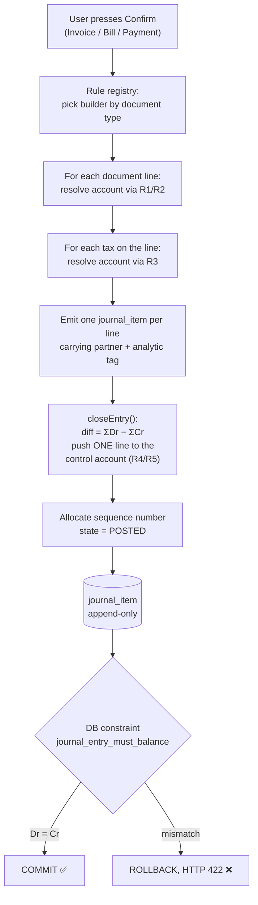
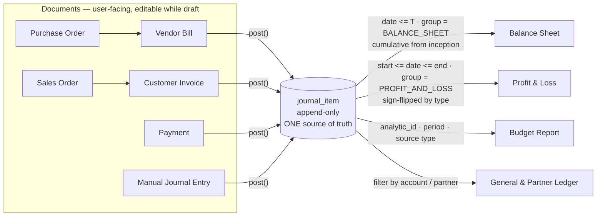

# The Core Engine — Posting and Reports

> **Read this section twice.** Everything else in this project is screens. This is the machine. If this part is right, thirty-eight CRUD screens become a product. If this part is wrong, thirty-eight beautiful screens are a school project, and an Odoo judge will know inside twenty seconds.
>
> There is exactly **one** hard engine in this whole problem statement, and it is described here. Budget your time accordingly: build this first, build it on paper before you build it in code, and do not start a single form until the four worked examples in §5.4 tie out to the paisa.

---

## 5.1 Zero-knowledge primer — every accounting word you need, defined once

You do not need an accounting degree. You need six words. Read this once, slowly. Every later part of this section reuses these exact words.

### 5.1.1 Account

An **account** is a labelled bucket that money is tracked in. "Bank A/c" is a bucket. "Sales Income A/c" is a bucket. "Creditors A/c" is a bucket (money we owe suppliers). The full list of buckets is the **Chart of Accounts** — the mockup mandates exactly eight of them, pre-configured as seed data:

| Account Name | Type (mockup's word) |
|---|---|
| Bank A/c | Assets |
| Cash A/c | Assets |
| Debtors A/c | Assets |
| Creditors A/c | Liabilities |
| Sales Income A/c | Income |
| Purchase Expense A/c | Expense |
| Other Expense A/c | Expense |
| Capital A/c | Capital |

Two of those names are jargon:

- **Debtors** = customers who owe *us* money. If you invoice Nimesh Rs 14,200 and he hasn't paid, Rs 14,200 sits in Debtors. It is an *asset* — a promise of future cash. (Odoo calls this "Accounts Receivable". Use either word; say "receivable" in front of a judge.)
- **Creditors** = suppliers *we* owe money to. If Azure Furniture bills us Rs 16,992 and we haven't paid, Rs 16,992 sits in Creditors. It is a *liability* — a future outflow. (Odoo: "Accounts Payable".)

### 5.1.2 Account type — the single most important field in the app

Every account carries a **type**, and the type decides two things: which report the account appears on, and which direction is "positive" for it. The mockup pins the exact list, as a *grouped* dropdown where the headings are not selectable:

```
Balancesheet          <- heading, not selectable
    Asset
    Liability
    Bank
    Capital
    Cash
Profit and Loss       <- heading, not selectable
    Income
    Expenses
    Other Expenses
```

The mockup's own annotation says it out loud: *"Each account is assigned an Account Type, which would further be used for how the account to be treated and where it appears in reports."* That sentence is the whole architecture. **Reports are driven by account type, never by account name.** If you ever write `if (account.name === 'Sales Income A/c')`, you have failed.

So store the group too:

| account_type | group | "Normal" side | Sign used for display | Report |
|---|---|---|---|---|
| `ASSET` | `BALANCE_SHEET` | Debit | debit − credit | Balance Sheet, Assets column |
| `BANK` | `BALANCE_SHEET` | Debit | debit − credit | Balance Sheet, Assets column |
| `CASH` | `BALANCE_SHEET` | Debit | debit − credit | Balance Sheet, Assets column |
| `LIABILITY` | `BALANCE_SHEET` | Credit | credit − debit | Balance Sheet, Liabilities column |
| `CAPITAL` | `BALANCE_SHEET` | Credit | credit − debit | Balance Sheet, Liabilities column |
| `INCOME` | `PROFIT_AND_LOSS` | Credit | credit − debit | P&L, Income section |
| `EXPENSES` | `PROFIT_AND_LOSS` | Debit | debit − credit | P&L, Expenses section |
| `OTHER_EXPENSES` | `PROFIT_AND_LOSS` | Debit | debit − credit | P&L, Expenses section |

The `group` column is *derivable* from the type, so you can store it as a constant map in code instead of a DB column. Storing it is one extra column and makes every report query a one-line `WHERE`. Store it.

The mockup's Balance Sheet annotation confirms the mapping row-for-row: *"Bank - Account type Asset - Bank / Cash - Account type Asset - cash / Debtors - Account type Asset - Debtors / Creditors - Account type Liability - creditor / Capital - Account Type Capital."*

### 5.1.3 Debit and credit — forget everything you have heard

Debit and credit are **not** "in" and "out". They are just the **left column** and the **right column** of a two-column ledger. That is genuinely all they are.

The one rule that matters: **for every transaction, the left column total must equal the right column total.** That is "double entry". The mockup states this as a hard requirement three separate times, and once in red as a *blocking* validation: *"Blocking warning if the debit and credit amount don't match."*

Whether debit means "increase" or "decrease" depends on the account type:

| | Debit does | Credit does |
|---|---|---|
| Asset / Bank / Cash / Expense accounts | **increases** it | decreases it |
| Liability / Capital / Income accounts | decreases it | **increases** it |

Sanity check with something physical. Customer pays us Rs 10,000 into the bank:
- Bank (asset) goes **up** by 10,000 → **Debit Bank 10,000**
- Debtors (asset — they owe us less now) goes **down** by 10,000 → **Credit Debtors 10,000**
- Left 10,000 = Right 10,000. ✅

That is the entire mechanic. Everything in §5.4 is that, repeated.

### 5.1.4 Journal, Journal Entry, Journal Item

- A **Journal** is a folder that groups similar transactions. The mockup mandates exactly four, seeded, each wired to a **Default Account**:

  | Journal Name | Type | Default Account |
  |---|---|---|
  | Sales | Sales | Sales Income A/c |
  | Purchase | Purchase | Purchase Expense A/c |
  | Bank | Bank | Bank A/c |
  | Cash | Cash | Cash A/c |

  That "Default Account" column looks like a throwaway. **It is the pivot of the entire posting engine.** Hold that thought until §5.3.

- A **Journal Entry** is one transaction: a date, a journal, a reference, and a set of lines. It is the *header*.
- A **Journal Item** is one line inside an entry: an account, an optional partner, a debit amount and a credit amount. Exactly one of debit/credit is non-zero.

An entry for our invoice looks like:

| Account | Partner | Debit | Credit |
|---|---|---:|---:|
| Debtors A/c | Nimesh Pathak | 14,200.00 | |
| Sales Income A/c | | | 12,400.00 |
| Output GST Payable A/c | | | 1,800.00 |
| **Total** | | **14,200.00** | **14,200.00** |

### 5.1.5 The accounting equation

> **Assets = Liabilities + Capital + Profit**

In English: everything the business owns (Assets) was paid for either by money it borrowed/owes (Liabilities), money the owner put in (Capital), or money the business earned (Profit). There is no fourth source.

An Odoo judge will add up your Balance Sheet columns. If the two sides do not match to the paisa, you are done. §5.5 proves mathematically why our design cannot fail this check.

### 5.1.6 The one sentence to memorise

> **`journal_item` is the only source of truth. Every report is an aggregation over `journal_item`. No report ever reads the `invoice`, `bill` or `payment` tables.**

Say that sentence to a judge in the first fifteen seconds. It is the difference between the top three and the middle of the pack.

---

## 5.2 The tables the engine stands on

Assumed stack: **PostgreSQL + Prisma + Next.js API routes**. (Rationale lives in the Architecture section; the only thing that matters here is Postgres, because we need real database constraints — see §5.2.3.)

### 5.2.1 Money is stored as integer paise. Not floats. Not decimals-in-JS.

```sql
debit_paise  BIGINT NOT NULL DEFAULT 0,
credit_paise BIGINT NOT NULL DEFAULT 0,
```

Why this matters more than it looks:

- `0.1 + 0.2 !== 0.3` in JavaScript. If your journal lines are floats, your "balanced" check will randomly fail by Rs 0.0000000004 and you will lose forty minutes at 3 a.m. hunting it.
- With integers, `SUM(debit_paise) = SUM(credit_paise)` is **exact**. The balance check becomes provable, not hopeful.
- Rs 14,200.00 is stored as `1420000`. Display is `paise / 100` formatted with `Intl.NumberFormat('en-IN', {style:'currency', currency:'INR'})`, which gives you Indian lakh grouping (`₹14,200.00`, `₹5,00,000.00`) for free.

**Prisma gotcha, write this down:** Prisma maps `BigInt` to JavaScript `BigInt`, and `JSON.stringify` throws on `BigInt`. Add one line to your app bootstrap:

```ts
// src/lib/bigint-json.ts  — import this once in app entry
(BigInt.prototype as any).toJSON = function () { return this.toString(); };
```

Then convert to display numbers at the API boundary only. Rs 90 lakh crore fits inside a JS `Number` as paise, so you may also just use `Int8`→`number` via a raw query; pick one convention in hour one and never mix.

### 5.2.2 Core DDL

```sql
-- ---------- configuration (the stuff a judge is allowed to change) ----------
CREATE TYPE account_type AS ENUM
  ('ASSET','LIABILITY','BANK','CAPITAL','CASH','INCOME','EXPENSES','OTHER_EXPENSES');
CREATE TYPE account_group AS ENUM ('BALANCE_SHEET','PROFIT_AND_LOSS');

CREATE TABLE account (
  id            SERIAL PRIMARY KEY,
  code          TEXT UNIQUE,                 -- optional, nice for search
  name          TEXT NOT NULL,               -- 'Sales Income A/c'
  type          account_type NOT NULL,
  "group"       account_group NOT NULL,
  active        BOOLEAN NOT NULL DEFAULT true -- mockup's 'Archived' button
);

CREATE TYPE journal_type AS ENUM ('SALES','PURCHASE','BANK','CASH');

CREATE TABLE journal (
  id                 SERIAL PRIMARY KEY,
  name               TEXT NOT NULL,
  type               journal_type NOT NULL,
  default_account_id INT NOT NULL REFERENCES account(id)   -- THE PIVOT (§5.3)
);

CREATE TABLE tax (
  id                    SERIAL PRIMARY KEY,
  name                  TEXT NOT NULL,          -- 'GST 18%'
  rate_bp               INT NOT NULL,           -- basis points: 1800 = 18.00%
  scope                 TEXT NOT NULL,          -- 'SALE' | 'PURCHASE' | 'BOTH'
  price_included        BOOLEAN NOT NULL DEFAULT false,
  collected_account_id  INT REFERENCES account(id), -- sales  -> Output GST Payable
  paid_account_id       INT REFERENCES account(id)  -- purchase -> Input GST Receivable
);

-- ---------- the ledger (append-only, the only source of truth) ----------
CREATE TYPE entry_state AS ENUM ('DRAFT','POSTED','CANCELLED');

CREATE TABLE journal_entry (
  id            SERIAL PRIMARY KEY,
  number        TEXT UNIQUE,                  -- allocated at POST time, not draft
  date          DATE NOT NULL,                -- ACCOUNTING date, from the document
  journal_id    INT NOT NULL REFERENCES journal(id),
  reference     TEXT,
  state         entry_state NOT NULL DEFAULT 'DRAFT',
  source_type   TEXT,        -- 'CUSTOMER_INVOICE'|'VENDOR_BILL'|'PAYMENT'|'MANUAL'
  source_id     INT,         -- id in that table -> powers drill-down + back-links
  reversal_of   INT REFERENCES journal_entry(id),
  posted_at     TIMESTAMPTZ,
  created_by    INT REFERENCES app_user(id)
);

CREATE TABLE journal_item (
  id            BIGSERIAL PRIMARY KEY,
  entry_id      INT NOT NULL REFERENCES journal_entry(id) ON DELETE RESTRICT,
  account_id    INT NOT NULL REFERENCES account(id),
  partner_id    INT REFERENCES contact(id),
  analytic_id   INT REFERENCES analytic_account(id),   -- budget tag, §5.7
  label         TEXT,
  debit_paise   BIGINT NOT NULL DEFAULT 0,
  credit_paise  BIGINT NOT NULL DEFAULT 0,
  CONSTRAINT ji_non_negative CHECK (debit_paise >= 0 AND credit_paise >= 0),
  CONSTRAINT ji_one_side_only CHECK (NOT (debit_paise > 0 AND credit_paise > 0))
);

CREATE INDEX ji_entry     ON journal_item(entry_id);
CREATE INDEX ji_account   ON journal_item(account_id);
CREATE INDEX ji_analytic  ON journal_item(analytic_id);
CREATE INDEX je_date_st   ON journal_entry(date, state);   -- every report leans on this

-- ---------- payments ----------
CREATE TABLE payment (
  id          SERIAL PRIMARY KEY,
  number      TEXT UNIQUE,
  direction   TEXT NOT NULL,      -- 'RECEIVE' (from customer) | 'SEND' (to vendor)
  partner_id  INT NOT NULL REFERENCES contact(id),
  journal_id  INT NOT NULL REFERENCES journal(id),  -- the Bank or Cash journal
  date        DATE NOT NULL,
  amount_paise BIGINT NOT NULL CHECK (amount_paise > 0),
  note        TEXT,
  state       TEXT NOT NULL DEFAULT 'DRAFT',        -- Draft > Confirm > Cancelled
  entry_id    INT REFERENCES journal_entry(id)
);

-- the table most teams forget, and then cannot retrofit
CREATE TABLE payment_allocation (
  id            SERIAL PRIMARY KEY,
  payment_id    INT NOT NULL REFERENCES payment(id) ON DELETE CASCADE,
  document_type TEXT NOT NULL,    -- 'CUSTOMER_INVOICE' | 'VENDOR_BILL'
  document_id   INT NOT NULL,
  amount_paise  BIGINT NOT NULL CHECK (amount_paise > 0),
  UNIQUE (payment_id, document_type, document_id)
);
```

**`payment_allocation` is the single most important schema decision in the app after `journal_item`.** Without it, "Partial" is impossible and a `paid BOOLEAN` column is the only thing you can build — which is fake #2 on the judge's checklist. With it, partial payments, multi-invoice payments and residuals all fall out for free (§5.8).

### 5.2.3 Two database constraints that do your arguing for you

**(a) An entry must balance.** Enforced by the database, not by application code, so that even a raw `INSERT` from a psql shell cannot create an unbalanced entry.

```sql
CREATE OR REPLACE FUNCTION assert_entry_balanced() RETURNS trigger AS $$
DECLARE d BIGINT; c BIGINT; st entry_state;
BEGIN
  SELECT state INTO st FROM journal_entry WHERE id = NEW.entry_id;
  IF st <> 'POSTED' THEN RETURN NEW; END IF;      -- drafts may be lopsided
  SELECT COALESCE(SUM(debit_paise),0), COALESCE(SUM(credit_paise),0)
    INTO d, c FROM journal_item WHERE entry_id = NEW.entry_id;
  IF d <> c THEN
    RAISE EXCEPTION 'journal_entry_must_balance: entry % debit=% credit=%',
      NEW.entry_id, d, c;
  END IF;
  RETURN NEW;
END $$ LANGUAGE plpgsql;

CREATE CONSTRAINT TRIGGER ji_balance_guard
  AFTER INSERT OR UPDATE OR DELETE ON journal_item
  DEFERRABLE INITIALLY DEFERRED          -- checked at COMMIT, so multi-line inserts work
  FOR EACH ROW EXECUTE FUNCTION assert_entry_balanced();
```

`DEFERRABLE INITIALLY DEFERRED` is the trick: the check runs once at `COMMIT`, after all four lines of the invoice are inserted, not after the first one. Without it you cannot insert a multi-line entry at all.

**(b) A posted entry is immutable.**

```sql
CREATE OR REPLACE FUNCTION block_posted_mutation() RETURNS trigger AS $$
BEGIN
  IF (TG_OP = 'DELETE') THEN
    IF (SELECT state FROM journal_entry WHERE id = OLD.entry_id) = 'POSTED' THEN
      RAISE EXCEPTION 'posted_ledger_is_immutable: cannot delete item %', OLD.id;
    END IF;
    RETURN OLD;
  END IF;
  IF (SELECT state FROM journal_entry WHERE id = OLD.entry_id) = 'POSTED' THEN
    RAISE EXCEPTION 'posted_ledger_is_immutable: cannot modify item %', OLD.id;
  END IF;
  RETURN NEW;
END $$ LANGUAGE plpgsql;

CREATE TRIGGER ji_immutable BEFORE UPDATE OR DELETE ON journal_item
  FOR EACH ROW EXECUTE FUNCTION block_posted_mutation();
```

> **What to say if a judge asks:** *"The balance rule is a deferred database constraint named `journal_entry_must_balance`. I can't write an unbalanced entry even from psql — want me to try?"* Then actually try it in a terminal. That thirty seconds buys you trust for the rest of the demo.

---

## 5.3 The Posting Engine — one service, zero if-else about accounts

### 5.3.1 What it is, in plain English

A user fills in a Vendor Bill: three tables at Rs 2,000 each. They press **Confirm**. Something has to turn that human document into ledger lines: *which* account gets debited, *which* gets credited, for how much.

The lazy way — the way most teams will do it — is a function full of branches:

```ts
// ❌ THE FAKE. Do not write this.
if (doc.type === 'bill') {
  lines.push({ account: 'Purchase Expense A/c', debit: doc.total });
  lines.push({ account: 'Creditors A/c',        credit: doc.total });
}
```

That produces a correct-looking journal entry. It is still fake, and here is the exact reason: **the account names are in the code.** Change the configuration and nothing changes. The Chart of Accounts and the Journals screen become decorations.

The real way: **the posting engine never knows any account name. It asks the configuration.** The engine's whole job is:

1. Ask configuration which account each amount belongs to (a lookup chain, §5.3.2).
2. Emit one journal item per document line.
3. Derive the final balancing line by *subtraction*, never by an independent calculation.
4. Hand the result to the database, whose constraint verifies it balances.

Step 3 is the quiet genius. More on it in §5.3.4.

### 5.3.2 The resolution chain — the table to pin above your monitor

Every amount that needs an account goes through one of these four chains. First non-null wins.

| # | Amount being posted | 1st: look here | 2nd | 3rd | 4th (final fallback) | Error if all null |
|---|---|---|---|---|---|---|
| **R1** | Sales line net amount | `invoice_line.account_id` (user override on the mockup's "Chart of Accounts" column) | `product.income_account_id` | `product_category.income_account_id` | **`journal.default_account_id`** of the Sales journal | `NO_REVENUE_ACCOUNT` |
| **R2** | Purchase line net amount | `bill_line.account_id` | `product.expense_account_id` | `product_category.expense_account_id` | **`journal.default_account_id`** of the Purchase journal | `NO_EXPENSE_ACCOUNT` |
| **R3** | Tax amount | `tax.collected_account_id` (sale) / `tax.paid_account_id` (purchase) | — | — | company setting `default_tax_account_id` | `NO_TAX_ACCOUNT` |
| **R4** | Counterparty (the "who owes whom" line) | `contact.receivable_account_id` (customer) / `contact.payable_account_id` (vendor) | — | — | company setting `default_receivable_account_id` = Debtors A/c / `default_payable_account_id` = Creditors A/c | `NO_CONTROL_ACCOUNT` |
| **R5** | Money moved by a payment | `journal.default_account_id` of the Bank or Cash journal picked in "Payment Via" | — | — | — | `NO_MONEY_ACCOUNT` |

**Where each of these comes from in the mockup, so you can defend every row:**

- R1/R2 rung 4 is *literally the mockup*. The Journals list ships `Sales → Sales Income A/c` and `Purchase → Purchase Expense A/c`, and two separate annotations say *"Sales account to be set by default"* and *"Purchase account to be set by default"* pointing at the Chart of Accounts column of the line grid. We are not inventing a mechanism — we are implementing the one they drew, and then reading it *from the row* instead of from a string literal.
- R1/R2 rung 1 is the mockup too: both the Vendor Bill and Customer Invoice line grids have a **Chart of Accounts** column, which means the user may override per line.
- R3 comes from the PDF: the Sales Order row of the Transaction Flow table lists **Tax** as a field.
- R4 rungs 1 and 2 are **additions** (see §5.3.6) — the mockup's Contact master has no account fields. They cost one nullable column each and they are what makes the chain provably a chain rather than a constant.

**Two accounts you must add to the seed Chart of Accounts** (labelled as an addition, and unavoidable): the PDF names Tax on the Sales Order but the eight seeded accounts contain no tax bucket. Add:

| Account | Type | Why |
|---|---|---|
| Output GST Payable A/c | `LIABILITY` | GST collected from a customer is money you are holding *for the government*. It is a debt until you file. |
| Input GST Receivable A/c | `ASSET` | GST paid to a supplier is money the government owes you back. It is an asset. |

Keep the eight mandated accounts **exactly as named** and add these two below them. When a judge asks why there are ten instead of eight, you say the sentence in §5.3.6.

### 5.3.3 The flow, as a picture



### 5.3.4 The pseudocode

```ts
// ============================================================
// src/server/accounting/posting-engine.ts
// The ONLY place in the codebase that writes to journal_item.
// ============================================================

type Line = {
  accountId: number;
  partnerId?: number;
  analyticId?: number;
  label: string;
  debit: bigint;   // paise
  credit: bigint;  // paise
};

type Trace = { rung: string; source: string; accountId: number; amount: bigint }[];

// ---- the rule registry: document type -> builder. No switch statements deeper. ----
const BUILDERS = {
  CUSTOMER_INVOICE: buildInvoiceLines,
  VENDOR_BILL:      buildBillLines,
  PAYMENT:          buildPaymentLines,
  MANUAL:           (doc) => ({ lines: doc.lines, control: null, trace: [] }),
} as const;

export async function post(tx, docType: keyof typeof BUILDERS, doc) {
  const journal = await resolveJournal(tx, docType, doc);   // §5.3.5
  const { lines, control, trace } = await BUILDERS[docType](tx, doc, journal);

  closeEntry(lines, control);                 // <- the balancing line, derived
  assertBalanced(lines);                      // belt; the DB trigger is braces

  const number = await allocateSequence(tx, journal, doc.date);  // at POST time
  const entry  = await tx.journalEntry.create({ data: {
      number, date: doc.date,                 // ACCOUNTING date from the document
      journalId: journal.id, reference: doc.reference,
      state: 'POSTED', posted_at: new Date(),
      sourceType: docType, sourceId: doc.id,
  }});
  await tx.journalItem.createMany({ data: lines.map(l => ({ ...l, entryId: entry.id })) });
  await tx.postingTrace.create({ data: { entryId: entry.id, json: trace } }); // §5.3.7
  return entry;
}

// ---- THE BALANCING LINE IS DERIVED, NEVER COMPUTED INDEPENDENTLY -------------
function closeEntry(lines: Line[], control: { accountId: number; partnerId?: number } | null) {
  const dr = lines.reduce((s, l) => s + l.debit,  0n);
  const cr = lines.reduce((s, l) => s + l.credit, 0n);
  const diff = dr - cr;
  if (diff === 0n) return;                        // manual entries arrive balanced
  if (!control) throw new PostingError('NO_CONTROL_ACCOUNT');
  lines.push(diff > 0n
    ? { ...control, label: 'Payable',    debit: 0n,     credit: diff, }
    : { ...control, label: 'Receivable', debit: -diff,  credit: 0n,  });
}

// ---- resolution chain R1 -----------------------------------------------------
async function resolveRevenueAccount(tx, line, journal, trace): Promise<number> {
  const hit = (rung: string, source: string, id: number | null | undefined) => {
    if (!id) return null;
    trace.push({ rung, source, accountId: id, amount: line.subtotal });
    return id;
  };
  const product = line.productId ? await tx.product.findUnique({
      where: { id: line.productId }, include: { category: true } }) : null;

  return hit('R1.1', 'invoice_line.account_id',            line.accountId)
      ?? hit('R1.2', 'product.income_account_id',          product?.incomeAccountId)
      ?? hit('R1.3', 'product_category.income_account_id', product?.category?.incomeAccountId)
      ?? hit('R1.4', 'journal.default_account_id',         journal.defaultAccountId)
      ?? (() => { throw new PostingError('NO_REVENUE_ACCOUNT', { line: line.id }); })();
}

// ---- builder: Customer Invoice ----------------------------------------------
async function buildInvoiceLines(tx, inv, journal) {
  const lines: Line[] = [];
  const trace: Trace  = [];
  const taxBuckets = new Map<number, bigint>();     // taxAccountId -> paise

  for (const l of inv.lines) {
    const subtotal = BigInt(l.qty) * BigInt(l.unitPricePaise);   // mockup: Unit Price * Qty
    const acct = await resolveRevenueAccount(tx, { ...l, subtotal }, journal, trace);

    lines.push({ accountId: acct, analyticId: l.analyticId,      // <- budget tag, §5.7
                 label: l.productName, debit: 0n, credit: subtotal });

    for (const t of l.taxes) {
      const amount = roundPaise(subtotal * BigInt(t.rateBp) / 10000n);   // per line, then round
      const ta = await resolveTaxAccount(tx, t, 'SALE', trace);
      taxBuckets.set(ta, (taxBuckets.get(ta) ?? 0n) + amount);
    }
  }
  for (const [accountId, amount] of taxBuckets)
    lines.push({ accountId, label: 'Output tax', debit: 0n, credit: amount });

  const control = { accountId: await resolveReceivable(tx, inv.partnerId, trace),
                    partnerId: inv.partnerId };
  return { lines, control, trace };
}
```

`buildBillLines` is the same function with `credit`/`debit` swapped, `resolveExpenseAccount` (R2), `paid_account_id` (R3) and `resolvePayable` (R4). `buildPaymentLines` emits one money line (R5) and lets `closeEntry` derive the control line. **Three builders, roughly 120 lines of code total, and not one account name among them.**

### 5.3.5 Which journal, and which date

Two rules straight off the mockup, both easy to get wrong:

- **Journal is forced by document type**, not chosen by the user: *"In case of bill journal would always be Purchase"*, and by symmetry Sales for a customer invoice. For a payment, the journal is the Bank or Cash journal selected in the **Payment Via** field (which the mockup says defaults to Bank).
- **The accounting date comes from the document, not from `new Date()`**: *"(Bill date fetch from bill)"*. Post a bill dated 5-Jan on 20-Jan and the ledger says 5-Jan. This is the difference between a Balance Sheet that is right and one that is subtly, silently wrong.

```ts
function resolveJournal(tx, docType, doc) {
  switch (docType) {
    case 'CUSTOMER_INVOICE': return tx.journal.findFirst({ where: { type: 'SALES' } });
    case 'VENDOR_BILL':      return tx.journal.findFirst({ where: { type: 'PURCHASE' } });
    case 'PAYMENT':          return tx.journal.findUnique({ where: { id: doc.journalId } });
    case 'MANUAL':           return tx.journal.findUnique({ where: { id: doc.journalId } });
  }
}
```

### 5.3.6 Why config-driven matters, and the exact demo moment

Here is the thing to understand: **a hardcoded posting engine and a config-driven one produce identical output on the happy path.** A demo video cannot tell them apart. A judge can — with one edit.

An Odoo engineer's test is always some version of: *"change a setting and post again."* If the second document posts differently, your engine reads configuration. If it posts identically, your engine is a `switch` statement and every other claim you make is now suspect.

Build for that thirty seconds. Rehearse the following, word for word. It uses **only fields the mockup already mandates** — no invented screens, no admin panel:

> **THE DEMO MOMENT — "Change the rule, don't change the code"**
>
> 1. *"Here's a vendor bill I just posted — Rs 14,400 of tables. Its journal entry debits **Purchase Expense A/c**."* (Point at the entry.)
> 2. *"Here's the P&L. Purchase Expense: Rs 14,400. Other Expense: Rs 3,000. Net Income Rs 35,000."*
> 3. *"Now — Account → Journals → Purchase. This is the mockup's own Default Account field."* Change it from `Purchase Expense A/c` to `Other Expense A/c`. Save.
> 4. *"New bill, same vendor, same table, same Rs 14,400. Confirm."*
> 5. Open the new journal entry. **The debit is now on Other Expense A/c.**
> 6. Open the P&L. **Purchase Expense unchanged at 14,400, Other Expense jumped from 3,000 to 17,400, and Net Income moved by exactly the new bill — because the Expenses subtotal is a sum over account types, not a hardcoded row.**
> 7. The line to say: *"I didn't touch any code. The posting engine has no account names in it — it walks a resolution chain: line override, then product, then product category, then the journal's default. You just edited rung four."*
>
> Then set it back. Total elapsed: 40 seconds.

A second, stronger variant if you have time — set `product_category('Furniture').expense_account_id` and post a table and a sofa on the same bill: they land on **different** accounts from **one** document. That proves rung 3 exists, which no team fakes.

> **What to say if a judge asks about the posting engine:** *"One service, three builders, zero account names in code. Every account is resolved from a four-rung config chain and the trace is stored on the entry — I can show you which rung fired for every line."*

### 5.3.7 "Explain this entry" — the panel that ends the argument

Store the `trace` array produced by the resolvers and render it beside every auto-generated journal entry:

```
Rule  sales_invoice_post   Journal SALES (forced by document type)
R1.4  journal.default_account_id  -> Sales Income A/c   Cr  10,000.00   [Wooden Table x2]
R1.4  journal.default_account_id  -> Sales Income A/c   Cr   2,400.00   [Delivery Charge]
R3.1  tax GST18.collected_account -> Output GST Payable Cr   1,800.00
R4.2  company.default_receivable  -> Debtors A/c        Dr  14,200.00   [derived = ΣCr]
      analytic distribution: Showroom-West on both revenue lines
      rounding difference: 0.00
```

This is roughly forty minutes of work (you already have the array; you just have to render it). It pre-emptively answers the only question a judge actually has about your posting engine, and no other team will have built it.

**Labelled additions in this sub-section, and why they earn their place:**

| Addition | Why it is justified |
|---|---|
| `Output GST Payable A/c`, `Input GST Receivable A/c` | The PDF lists **Tax** on the Sales Order. Tax has to land somewhere, and putting it in Sales Income would overstate revenue and break the Balance Sheet. Two rows of seed data. |
| `product.income_account_id`, `product_category.expense_account_id` etc. | Turns the resolution chain from two rungs into four, which is what makes "config-driven" *demonstrable*. Four nullable columns, zero required UI (leave them blank and rung 4 handles everything). |
| `contact.receivable_account_id` / `payable_account_id` | Same reason for R4. Nullable, falls back to Debtors/Creditors. |
| `posting_trace` table + Explain panel | Pure instrumentation of logic you already wrote. It is the cheapest credibility in the build. |

---

## 5.4 The four worked postings, to the paisa

These are the four you must be able to draw on a whiteboard from memory. Every number below ties out and is reused in §5.5, §5.6 and §5.7, so you can run one continuous demo.

### 5.4.1 Customer Invoice with GST

**INV/2026/0009** — 10-Jan-2026, customer **Nimesh Pathak**, journal **Sales**.

| Sr | Product | Chart of Accounts | Budget Analytics | Qty | Unit Price | Total |
|---|---|---|---|---:|---:|---:|
| 1 | Wooden Table | *(blank → resolves)* | Showroom-West | 2 | 5,000.00 | 10,000.00 |
| 2 | Delivery Charge (service) | *(blank → resolves)* | Showroom-West | 1 | 2,400.00 | 2,400.00 |

Taxes: line 1 carries **GST 18%** → Rs 1,800.00. Line 2 is a service line carrying **GST 0% (exempt)** → Rs 0.00.
Subtotal **12,400.00** · Tax **1,800.00** · **Invoice total 14,200.00**

Journal entry produced — **one item per document line, never grouped**, so drill-down and budget tagging survive:

| Account | Type | Partner | Analytic | Debit | Credit | Rung |
|---|---|---|---|---:|---:|---|
| Debtors A/c | ASSET | Nimesh Pathak | | **14,200.00** | | R4 *(derived)* |
| Sales Income A/c | INCOME | | Showroom-West | | 10,000.00 | R1.4 |
| Sales Income A/c | INCOME | | Showroom-West | | 2,400.00 | R1.4 |
| Output GST Payable A/c | LIABILITY | | | | 1,800.00 | R3 |
| **Totals** | | | | **14,200.00** | **14,200.00** | ✅ |

Read it in English: *"The customer now owes us Rs 14,200 (asset up). We earned Rs 12,400 (income up). We are holding Rs 1,800 for the government (liability up)."*

**Do not put the tax in Sales Income.** If you do, your P&L overstates income by 1,800, your Balance Sheet is missing a liability of 1,800, and it still balances — which is the worst kind of bug, because it looks fine.

### 5.4.2 Vendor Bill with GST

**BILL/2026/0001** — 05-Jan-2026, vendor **Azure Furniture**, journal **Purchase**.

12 Wooden Chairs @ Rs 1,200 = **14,400.00**, GST 18% = **2,592.00**, **bill total 16,992.00**. Line tagged analytic **Furniture-Procurement**.

| Account | Type | Partner | Analytic | Debit | Credit | Rung |
|---|---|---|---|---:|---:|---|
| Purchase Expense A/c | EXPENSES | | Furniture-Procurement | 14,400.00 | | R2.4 |
| Input GST Receivable A/c | ASSET | | | 2,592.00 | | R3 |
| Creditors A/c | LIABILITY | Azure Furniture | | | **16,992.00** | R4 *(derived)* |
| **Totals** | | | | **16,992.00** | **16,992.00** | ✅ |

English: *"We incurred Rs 14,400 of cost. The government owes us back Rs 2,592 of input tax. We owe Azure Rs 16,992."*

This is exactly the mockup's *"Purchase A/c ... Creditor A/c"* journal entry, with the tax line the PDF implies added in the middle. Same shape, richer.

### 5.4.3 Customer Payment (Receive)

**RCPT/2026/0001** — 12-Jan-2026, Payment Type **Receive**, Partner **Nimesh Pathak**, Payment Via **Bank**, Amount **10,000.00** against INV/2026/0009.

| Account | Type | Partner | Debit | Credit | Rung |
|---|---|---|---:|---:|---|
| Bank A/c | BANK | | 10,000.00 | | R5 — `journal('Bank').default_account_id` |
| Debtors A/c | ASSET | Nimesh Pathak | | 10,000.00 | R4 *(derived)* |
| **Totals** | | | **10,000.00** | **10,000.00** | ✅ |

English: *"Cash in the bank went up 10,000. What the customer still owes went down 10,000."* Nothing touched Income — **the sale was earned when the invoice was posted, not when the money arrived.** That sentence is worth saying out loud to a judge; it is the accrual principle and it is exactly what fake systems get wrong when they treat payments as revenue.

Then `payment_allocation` gets one row: `(payment=RCPT/2026/0001, doc=INV/2026/0009, amount=10,000.00)`. Residual becomes 4,200.00, badge flips to **Partial**. See §5.8.

### 5.4.4 Vendor Payment (Send)

**PAY/2026/0001** — 08-Jan-2026, Payment Type **Send**, Partner **Azure Furniture**, Payment Via **Bank**, Amount **10,000.00** against BILL/2026/0001.

| Account | Type | Partner | Debit | Credit | Rung |
|---|---|---|---:|---:|---|
| Creditors A/c | LIABILITY | Azure Furniture | 10,000.00 | | R4 *(derived)* |
| Bank A/c | BANK | | | 10,000.00 | R5 |
| **Totals** | | | **10,000.00** | **10,000.00** | ✅ |

English: *"We owe Azure 10,000 less. Our bank has 10,000 less."*

Notice all four entries came out of the **same three builders and the same `closeEntry()`**. The only thing that varied was which rung of which chain fired.

### 5.4.5 Rounding — the bug that will cost you an hour if you don't pre-empt it

The classic failure: you compute tax on the whole document (`round(12400 × 18%)`) but display tax per line (`round(10000×18%) + round(2400×18%)`). Those two can differ by a paisa, and your entry is off by Rs 0.01 and refuses to post.

Three rules that make it impossible:

1. **Compute tax per line, round each line to whole paise, then sum.** Never round the total.
2. **Store integer paise.** No float ever enters the arithmetic.
3. **Derive the control line by subtraction** (`closeEntry`). Even if every other line has a rounding quirk, the receivable/payable line is defined as *whatever makes the entry balance*, so the entry cannot be lopsided. This single design decision removes the entire class of bug.

If you later add price-inclusive taxes (`tax.price_included = true`, where Rs 5,900 already contains 18%), the back-computation `net = round(gross × 10000 / (10000 + rate_bp))` can leave a 1-paise residue across many lines. Post it to a `Rounding Difference A/c` (`OTHER_EXPENSES`) as an explicit line. Do **not** silently absorb it.

> **What to say if a judge asks about rounding:** *"Money is BIGINT paise, tax is rounded per line, and the control line is derived as the difference — so a rounding error can't unbalance an entry, it can only shift a paisa onto the receivable, which is the accounting-correct place for it."*

---

## 5.5 The Balance Sheet algorithm

### 5.5.1 What a Balance Sheet actually is

A **snapshot of the business at one instant**. Not a period. Not "January". A moment in time, usually the last day of a year.

Left column: everything we own (**Assets**). Right column: who has a claim on it — outsiders (**Liabilities**) and the owner (**Capital**). The two columns must be equal, because every rupee of stuff came from somewhere.

The mockup's version has a **Year selector (2026)**, three Asset rows (Bank, Cash, Debtors), two Liability rows (Capital, Creditors), a **Total Asset** footer and a **Total (Liabilities)** footer, and a **Print → PDF** button.

### 5.5.2 The algorithm, in English

> Take every journal item that belongs to a **posted** entry whose **date is on or before T**, from the beginning of the company's existence. Group them by account. For each account, balance = Σdebit − Σcredit. Show debit-normal types in the Assets column and credit-normal types in the Liabilities column, sign-flipped so they read positive.

Three details carry all the weight:

1. **`date <= T` only. There is no start date.** A Balance Sheet is cumulative from inception. If you write `BETWEEN '2026-01-01' AND '2026-12-31'` on a Balance Sheet, you have built the wrong report — you have thrown away every prior year's bank balance. The Year selector means **T = 31-Dec-2026**, nothing more.
2. **Only posted entries.** Drafts are invisible to reports.
3. Every number you show is a `GROUP BY` over `journal_item`. Nothing reads `invoice`.

### 5.5.3 The queries

```sql
-- (1) Every balance-sheet account, cumulative to T.
SELECT a.id, a.name, a.type,
       COALESCE(SUM(ji.debit_paise - ji.credit_paise), 0) AS signed_paise
FROM journal_item  ji
JOIN journal_entry je ON je.id = ji.entry_id
JOIN account       a  ON a.id  = ji.account_id
WHERE je.state = 'POSTED'
  AND je.date <= $1              -- T. NO lower bound. This is the whole point.
  AND a."group" = 'BALANCE_SHEET'
GROUP BY a.id, a.name, a.type
HAVING COALESCE(SUM(ji.debit_paise - ji.credit_paise), 0) <> 0;

-- (2) Current Year Earnings: this fiscal year's profit, up to T.
SELECT COALESCE(SUM(ji.credit_paise - ji.debit_paise), 0) AS cye_paise
FROM journal_item ji
JOIN journal_entry je ON je.id = ji.entry_id
JOIN account a ON a.id = ji.account_id
WHERE je.state='POSTED' AND a."group"='PROFIT_AND_LOSS'
  AND je.date >= $fy_start AND je.date <= $1;

-- (3) Retained Earnings: every prior year's profit, rolled into one number.
SELECT COALESCE(SUM(ji.credit_paise - ji.debit_paise), 0) AS retained_paise
FROM journal_item ji
JOIN journal_entry je ON je.id = ji.entry_id
JOIN account a ON a.id = ji.account_id
WHERE je.state='POSTED' AND a."group"='PROFIT_AND_LOSS'
  AND je.date < $fy_start;
```

`fy_start` comes from a company setting (`fiscal_year_start_month`, default 4 for the Indian April–March year; set it to 1 to match the mockup's calendar-year "2026" selector). Do not hardcode it.

### 5.5.4 Current Year Earnings and Retained Earnings — what they are and why they must exist

Here is the thing that trips up 90% of teams.

Profit is not an account you post to. Nobody ever writes "Dr Profit". Profit is a **derived number**: Income minus Expenses. But profit belongs to the owner, so it must appear on the Capital side of the Balance Sheet — otherwise the two columns will not tie.

So the Balance Sheet **injects two synthetic rows** into the equity block:

- **Current Year Earnings (CYE)** = profit earned between the start of the current fiscal year and T. This is *exactly the same number* your P&L reports as Net Income for that period.
- **Retained Earnings** = the sum of every fiscal year's profit *before* the current one, collapsed into one figure. This is the "rollover".

They are not stored anywhere. They are computed at render time by queries (2) and (3) above. That is why there is no year-end "closing" process to build — a genuine time saver, and the correct design.

```ts
function buildBalanceSheet(T: Date) {
  const rows      = queryBalanceSheetAccounts(T);
  const cye       = queryCurrentYearEarnings(fyStart(T), T);
  const retained  = queryRetainedEarnings(fyStart(T));

  const assets = rows.filter(r => ['ASSET','BANK','CASH'].includes(r.type))
                     .map(r => ({ ...r, amount: r.signed }));          // Dr − Cr
  const liabs  = rows.filter(r => ['LIABILITY','CAPITAL'].includes(r.type))
                     .map(r => ({ ...r, amount: -r.signed }));         // Cr − Dr

  if (retained !== 0n) liabs.push({ name: 'Retained Earnings',      amount: retained, synthetic: true });
  if (cye      !== 0n) liabs.push({ name: 'Current Year Earnings',  amount: cye,      synthetic: true });

  return { assets, liabs,
           totalAssets: sum(assets), totalLiabs: sum(liabs),
           balanced: sum(assets) === sum(liabs) };   // must be true. always.
}
```

### 5.5.5 Why it balances — the proof (learn this, it is a 20-second answer)

Every posted entry satisfies Σdebit = Σcredit, enforced by the database. Sum that over **all** entries up to T:

```
Σ_all_items (debit − credit) = 0
```

Split the accounts into their two groups:

```
Σ_BalanceSheet (debit − credit) + Σ_ProfitAndLoss (debit − credit) = 0
```

Now name the pieces. On the balance-sheet side, debit-normal accounts are Assets and credit-normal ones are Liabilities + Capital, so `Σ_BS(debit − credit) = Assets − (Liabilities + Capital)`. On the P&L side, `Σ_PL(debit − credit) = Expenses − Income = −NetIncome`. Substitute:

```
Assets − (Liabilities + Capital) − NetIncome = 0
Assets = Liabilities + Capital + NetIncome
```

And `NetIncome` from inception to T is precisely `RetainedEarnings + CurrentYearEarnings`. Therefore:

```
Total Assets = Liabilities + Capital + Retained Earnings + Current Year Earnings
```

> **What to say if a judge asks why your Balance Sheet balances:** *"It isn't checked, it's implied. Debit equals credit is a database constraint on every entry, so the sum over all entries is zero. Split that sum by account group and you get Assets = Liabilities + Capital + Net Income. Current Year Earnings is that Net Income injected into equity — which is the same number my P&L shows. It balances for the same reason 3 − 3 = 0."*

### 5.5.6 Worked numbers you can seed and demo

Nine posted entries, one small company, calendar year 2026:

| # | Date | Description | Debit | Credit |
|---|---|---|---|---|
| E1 | 01-Jan-26 | Owner puts in capital | Bank 5,00,000 | Capital 5,00,000 |
| E2 | 02-Jan-26 | Cash withdrawn from bank | Cash 50,000 | Bank 50,000 |
| E3 | 05-Jan-26 | BILL/2026/0001 (§5.4.2) | Purchase Expense 14,400 · Input GST 2,592 | Creditors 16,992 |
| E4 | 08-Jan-26 | PAY/2026/0001 (§5.4.4) | Creditors 10,000 | Bank 10,000 |
| E5 | 10-Jan-26 | INV/2026/0009 (§5.4.1) | Debtors 14,200 | Sales Income 12,400 · Output GST 1,800 |
| E6 | 12-Jan-26 | RCPT/2026/0001 (§5.4.3) | Bank 10,000 | Debtors 10,000 |
| E7 | 15-Jan-26 | Showroom rent, paid cash | Other Expense 3,000 | Cash 3,000 |
| E8 | 20-Jan-26 | INV/2026/0010, 5 chairs @ 8,000 + 18% | Debtors 47,200 | Sales Income 40,000 · Output GST 7,200 |

**Balance Sheet as of 31-Dec-2026:**

| Assets | Amount (Rs) | | Liabilities & Capital | Amount (Rs) |
|---|---:|---|---|---:|
| Bank A/c | 4,50,000.00 | | Creditors A/c | 6,992.00 |
| Cash A/c | 47,000.00 | | Output GST Payable A/c | 9,000.00 |
| Debtors A/c | 51,400.00 | | Capital A/c | 5,00,000.00 |
| Input GST Receivable A/c | 2,592.00 | | *Current Year Earnings* | 35,000.00 |
| **Total Asset** | **5,50,992.00** | | **Total (Liabilities)** | **5,50,992.00** |

Check each one by hand once, on paper, before you trust the code:
- Bank: +5,00,000 − 50,000 − 10,000 + 10,000 = **4,50,000**
- Cash: +50,000 − 3,000 = **47,000**
- Debtors: +14,200 − 10,000 + 47,200 = **51,400**
- Creditors: 16,992 − 10,000 = **6,992**
- Output GST: 1,800 + 7,200 = **9,000**
- CYE: Income 52,400 − Expenses (14,400 + 3,000) = **35,000**

### 5.5.7 The rollover, demonstrated

Add two 2027 entries: E9 (10-Feb-27) invoice Rs 20,000 + GST 3,600 = 23,600, and E10 (12-Feb-27) rent Rs 5,000 cash.

**Balance Sheet as of 15-Feb-2027** — note what happened to the 35,000:

| Assets | Rs | | Liabilities & Capital | Rs |
|---|---:|---|---|---:|
| Bank | 4,50,000.00 | | Creditors | 6,992.00 |
| Cash | 42,000.00 | | Output GST Payable | 12,600.00 |
| Debtors | 75,000.00 | | Capital | 5,00,000.00 |
| Input GST Receivable | 2,592.00 | | **Retained Earnings** | **35,000.00** |
| | | | *Current Year Earnings* | 15,000.00 |
| **Total Asset** | **5,69,592.00** | | **Total (Liabilities)** | **5,69,592.00** |

The 2026 profit of 35,000 rolled from Current Year Earnings into Retained Earnings **automatically**, purely because `fy_start` moved. No closing entry, no batch job, no button. That is the payoff of computing equity instead of storing it.

### 5.5.8 A free consequence worth knowing about

**The as-of slider costs almost nothing.** Because the query is a pure function of `T`, replacing the mockup's Year dropdown with a date slider costs about twenty lines. Dragging it re-derives the whole statement live. It is the only cinematic thing this domain offers and it is *impossible* to fake with document-summed reports. (Covered as a differentiator elsewhere in this document; noted here so you know the engine already supports it.)

---

## 5.6 The Profit & Loss algorithm

### 5.6.1 What it is

Where the Balance Sheet is a photograph at an instant, the **P&L is a video of a period**. "How much did we earn and spend between 1-Jan and 31-Dec?" It has a start date *and* an end date, and it only ever looks at accounts in the `PROFIT_AND_LOSS` group.

### 5.6.2 The mockup's six lines, exactly

The mockup's **Field Computation** callout is prescriptive and must be matched line for line:

| Row | Mockup's stated computation | What it actually means | Our 2026 numbers |
|---|---|---|---:|
| **Income** | "Total of Income" | Section subtotal = sum of its child rows | 52,400.00 |
| **Income from Sales** | "Total of account type Income" | `SUM(credit − debit)` where `type = INCOME` | 52,400.00 |
| **Expenses** | "Total of All expenses" | Section subtotal = Purchase Expense + Other Expense | 17,400.00 |
| **Purchase Expense** | "Total of Account type Expense" | `SUM(debit − credit)` where `type = EXPENSES` | 14,400.00 |
| **Other Expense** | "Total of account type Other Expense" | `SUM(debit − credit)` where `type = OTHER_EXPENSES` | 3,000.00 |
| **Net Income** | "Difference of Income - Expenses" | Income − Expenses | **35,000.00** |

Two things worth noticing, because they tell you how to build it:

- **Two of the six rows are section subtotals, four are type sums.** So do not write six queries. Write **one** query grouped by `account.type`, then assemble a small section tree in code. The mockup's own sample proves the structure: 10,000 / 10,000 / 7,000 / 6,000 / 1,000 / 3,000 — Income equals its single child, and 6,000 + 1,000 = 7,000, and 10,000 − 7,000 = 3,000.
- **`Income` equals `Income from Sales` today only because there is exactly one income type.** Keep them as separate rows anyway. The moment you add a second income-type account, the parent row starts differing from the child, and your report just handles it. That is what "generic" buys you.

### 5.6.3 The query and the assembly

```sql
SELECT a.type,
       COALESCE(SUM(ji.credit_paise - ji.debit_paise), 0) AS credit_minus_debit
FROM journal_item ji
JOIN journal_entry je ON je.id = ji.entry_id
JOIN account       a  ON a.id  = ji.account_id
WHERE je.state = 'POSTED'
  AND a."group" = 'PROFIT_AND_LOSS'
  AND je.date >= $start AND je.date <= $end     -- BOTH bounds. Unlike the Balance Sheet.
GROUP BY a.type;
```

```ts
const SECTIONS = {
  income:   ['INCOME'],
  expenses: ['EXPENSES', 'OTHER_EXPENSES'],
};

function buildPnl(start: Date, end: Date) {
  const byType = new Map(rows.map(r => [r.type, r.credit_minus_debit]));
  const g = (t) => byType.get(t) ?? 0n;

  const incomeFromSales = g('INCOME');                 // credit − debit  -> positive
  const purchaseExpense = -g('EXPENSES');              // flip: debit-normal -> positive
  const otherExpense    = -g('OTHER_EXPENSES');

  const income   = incomeFromSales;                    // section subtotal
  const expenses = purchaseExpense + otherExpense;     // section subtotal

  return {
    rows: [
      { label: 'Income',            amount: income,          section: true  },
      { label: 'Income from Sales', amount: incomeFromSales, section: false },
      { label: 'Expenses',          amount: expenses,        section: true  },
      { label: 'Purchase Expense',  amount: purchaseExpense, section: false },
      { label: 'Other Expense',     amount: otherExpense,    section: false },
      { label: 'Net Income',        amount: income - expenses, highlight: true },
    ],
  };
}
```

**The sign flip is the only subtle part.** Expense accounts are debit-normal, so `credit − debit` comes out negative (−14,400). Negate it once, at the section boundary, and every downstream number is positive and reads naturally. Do the flip in **one** place — a `SIGN: Record<account_type, 1|-1>` constant map — not scattered through the code.

### 5.6.4 The tie-out that wins the moment

`Net Income` for `[fy_start, T]` is, by construction, **the identical query** to Current Year Earnings in §5.5.3(2). Same rows, same filter, same arithmetic.

> **The demo line, said while pointing at two windows:** *"P&L says Net Income Rs 35,000 for 2026. Balance Sheet says Current Year Earnings Rs 35,000. That is not two calculations that happen to agree — it is literally the same SQL. That is why the Balance Sheet balances."*

Judges remember this. It takes eight seconds.

> **What to say if a judge asks about the P&L:** *"One `GROUP BY account.type` over posted journal items inside the period, sign-flipped once by type, then assembled into the mockup's six rows — two of which are section subtotals. If you add a new expense account tomorrow it appears in the right section with no code change."*

---

## 5.7 Two aggregations, one table — the whole architectural point

This is the sentence to open your demo with, and the idea a judge is actually grading.



Look at what changes between the Balance Sheet and the P&L:

| | Balance Sheet | Profit & Loss |
|---|---|---|
| Table read | `journal_item` | `journal_item` |
| Date filter | `date <= T` — **no start** | `start <= date <= end` — **both** |
| Account filter | `group = BALANCE_SHEET` | `group = PROFIT_AND_LOSS` |
| Sign | Assets `Dr−Cr`, Liab/Capital `Cr−Dr` | Income `Cr−Dr`, Expenses `Dr−Cr` |
| Extra | injects CYE + Retained Earnings | none |

**Nothing else.** Same table, same join, four differences in the `WHERE` and the sign map. That is what "derived reports" means, and it is why the correct architecture is *less* code than the fake one — the fake needs one bespoke query per report per source table.

### Why the fake breaks, in one demo

The 70–80% of teams who compute `SELECT SUM(total) FROM invoices` for Income look identical to you on the happy path. Here is what breaks them, and it is what a judge will do:

| Judge's action | Correct system | Document-summed system |
|---|---|---|
| Post a manual JE: Dr Cash 50,000 / Cr Capital 50,000 | Balance Sheet moves: Cash +50,000, Capital +50,000 | **Nothing happens.** There is no invoice row. |
| Post an opening balance | Appears | Invisible |
| Pay half an invoice | Debtors falls by half, Bank rises | Usually all-or-nothing |
| Cancel a posted invoice | Reversal entry appears, both visible | Row deleted, history rewritten |
| Change Sales journal default account | Next invoice posts elsewhere | Identical output |

The manual journal entry is the killer, and the mockup *mandates* the manual Journal Entry screen with its own **Post** button and a blocking balance check. The organisers built the trap into the spec. A team that writes report queries against `invoices` has a fully-drawn screen in their app that does nothing to their reports.

> **What to say, unprompted, in the first fifteen seconds:** *"Every number in this app comes from one table — `journal_item`. Nothing is summed from invoices. Post a manual entry yourself and watch the Balance Sheet move."* Then hand them the keyboard.

---

## 5.8 The Budget engine

### 5.8.1 What an analytic account is, in plain English

The Chart of Accounts answers *"what kind of money was this?"* (income, rent, purchase). An **Analytic Account** answers a completely different question: *"which project or department was this for?"*

They are two independent tags on the same rupee. Rs 14,400 spent on chairs is `Purchase Expense` (what) **and** `Furniture-Procurement` (which project). The mockup calls the tag **Budget Analytics** and puts it as a many2one column on every PO, Bill, SO and Invoice line, sourced from an Analytics Master where `Type` is a two-value selection: **Income** or **Expense**.

A **Budget** is then: a name, a period (start–end), a responsible person, and a set of lines — one per analytic account — each with a **Committed Amount** (the plan) and three computed columns.

⚠️ **Vocabulary warning that will save you an argument.** The mockup uses "**Committed Amount**" to mean *the planned/budgeted figure*. In standard accounting, "committed" means something else entirely (money locked in by confirmed-but-unbilled purchase orders). **Use the mockup's meaning everywhere in the UI.** If you add the accounting concept as an extra (§5.8.6), call that column **"Encumbered (open POs)"** — never "Committed". Colliding with the organisers' own vocabulary is a self-inflicted wound.

### 5.8.2 The three mandated formulas

Straight from the mockup's Field Explanation box, non-negotiable:

```
Achieved %       = (Achieved Amount / Committed Amount) * 100
Amount To Achieve =  Committed Amount - Achieved Amount
```

And all three of `Achieved Amount`, `Achieved %`, `Amount To Achieve` are **only visible when the budget is in the Confirmed stage** — the mockup says "Only Visible for Confirmed Budget" three separate times.

Guard the division: `Committed = 0` ⇒ show `—`, not `NaN%` or `Infinity`. That is the kind of thing a judge stumbles into by accident.

Worked, using our ledger:

| Analytic | Type | Committed | Achieved | Achieved % | Amount To Achieve |
|---|---|---:|---:|---:|---:|
| Furniture-Procurement | Expense | 2,00,000.00 | 14,400.00 | 7.20% | 1,85,600.00 |
| Showroom-West | Income | 1,00,000.00 | 52,400.00 | 52.40% | 47,600.00 |

(`14,400 / 2,00,000 × 100 = 7.2`; `2,00,000 − 14,400 = 1,85,600`. `52,400 / 1,00,000 × 100 = 52.4`; `1,00,000 − 52,400 = 47,600`.)

### 5.8.3 The matching rule — directional, and the mockup is explicit

This is the part teams get wrong. The rule is **directional**:

> *"Analyticals on All Invoice lines to be mapped with type = Income"*
> *"Analyticals on All Purchase Order/Vendor Bill Lines to be mapped with Type = Expenses"*

And the lookup table the mockup draws:

| Analytic Name | Type | Lookup | Achieved Amount |
|---|---|---|---|
| Project 1 | Income | **Sales Invoice** | 21,000 |
| Project 1 | Expense | **Vendor Bills** | 21,000 |

So: **an Income-type budget line's achievement comes from Sales Invoices only. An Expense-type budget line's achievement comes from Vendor Bills only.** Never mixed. If someone tags an analytic of type Income onto a vendor bill line, it contributes nothing — that is correct behaviour, not a bug.

### 5.8.4 How to compute Achieved — and why you should read `journal_item`, not the document lines

The mockup phrases the computation as a document search: *"Search Analytical in Sales Invoice with name Project 1, consider budget period and compute total and set in achieved amount."*

You can implement that literally. **Do not.** Read `journal_item` instead, filtered to the same documents. Here is why it is both spec-compliant and better:

1. Every other report in the app reads `journal_item`. One aggregation source, one mental model, one set of indexes.
2. **Tax is excluded automatically.** The posting engine puts the analytic tag only on the revenue/expense line, never on the tax line. So Achieved on INV/2026/0009 comes out as 10,000 + 2,400 = 12,400, *not* 14,200. That is the accounting-correct answer — a budget tracks net spend; GST is a pass-through to the government, not consumption of your budget. If you sum document lines, you must remember to exclude tax by hand. If you sum journal items, it is impossible to get wrong.
3. Draft documents are excluded for free, because drafts have no journal items.
4. Cancelled documents self-correct for free, because their reversal entry (§5.9) carries the same analytic tag with the opposite sign.

Point 4 alone is worth the decision. A document-line sum keeps counting a cancelled invoice unless you remember an extra `state != 'CANCELLED'` filter in every query.

```sql
-- Achieved for ONE budget line.
-- $analytic, $start, $end, and $sources come from the budget line's Type.
SELECT COALESCE(SUM(
         CASE WHEN a.type = 'INCOME' THEN ji.credit_paise - ji.debit_paise
                                     ELSE ji.debit_paise  - ji.credit_paise END
       ), 0) AS achieved_paise
FROM journal_item  ji
JOIN journal_entry je ON je.id = ji.entry_id
JOIN account       a  ON a.id  = ji.account_id
WHERE je.state = 'POSTED'
  AND ji.analytic_id = $analytic
  AND je.date BETWEEN $start AND $end
  AND je.source_type = ANY($sources)     -- Income -> {CUSTOMER_INVOICE}
                                         -- Expense -> {VENDOR_BILL}
  AND a."group" = 'PROFIT_AND_LOSS';
```

```ts
const SOURCES = {
  INCOME:  ['CUSTOMER_INVOICE'],   // mockup: "Lookup: Sales Invoice"
  EXPENSE: ['VENDOR_BILL'],        // mockup: "Lookup: Vendor Bills"
};
```

The `source_type` filter is what keeps you literally compliant with the mockup's rule while still reading the ledger. Offer an "include manual entries" checkbox as a clearly-labelled extra if you want; leave it **off** by default so the number matches the spec exactly.

### 5.8.5 The drill-down

The mockup makes Achieved Amount a **button**: *"Clicking on the Achieved Amount Button open list view of all Invoices/Bills having same analytical for the budget period."*

Because `journal_entry` carries `source_type` + `source_id`, the drill-down is the same query with the aggregate removed:

```sql
SELECT DISTINCT je.source_type, je.source_id, je.date, je.number,
       SUM(ABS(ji.debit_paise - ji.credit_paise)) AS contribution_paise
FROM journal_item ji JOIN journal_entry je ON je.id = ji.entry_id
WHERE je.state='POSTED' AND ji.analytic_id = $analytic
  AND je.date BETWEEN $start AND $end
  AND je.source_type = ANY($sources)
GROUP BY je.source_type, je.source_id, je.date, je.number
ORDER BY je.date;
```

Then resolve `source_id` to the invoice/bill row for the list view, and every row is clickable through to the document → its journal entry → the payments against it. **No dead ends.** The mockup also demands a **Budget smart button** on the Bill/Invoice pointing the other way — *"On Click Open the Budget Analytic Report that is used the Bill"* — which is the same relationship traversed in reverse. Build one join, get both directions.

### 5.8.6 The non-blocking over-budget warning

The mockup requires this on **two** hook points — confirming a **PO** and confirming a **Bill** — with identical wording, and it is explicitly **non-blocking**:

> ⚠ **Exceeds Approved Budget** — *"The entered amount is higher than the remaining budget amount for this budget line. Consider adjusting the value or revise the budget."*

```ts
async function checkBudget(doc): Promise<Warning[]> {
  const warnings = [];
  for (const [analyticId, lineTotal] of groupLinesByAnalytic(doc)) {
    const bl = await findConfirmedBudgetLine(analyticId, doc.date);   // period contains doc.date
    if (!bl) continue;                                   // untagged or unbudgeted -> silent
    const remaining = bl.committed - bl.achieved - bl.encumbered;     // encumbered = extra
    if (lineTotal > remaining) {
      warnings.push({
        code: 'BUDGET_EXCEEDED',
        title: 'Exceeds Approved Budget',
        body : 'The entered amount is higher than the remaining budget amount for '
             + 'this budget line. Consider adjusting the value or revise the budget.',
        detail: { budget: bl.budgetName, analytic: bl.analyticName,
                  remaining, attempting: lineTotal },
      });
    }
  }
  return warnings;                 // returned, DISPLAYED, and then the user proceeds
}
```

The API must return `200` with a `warnings[]` array and still complete the confirm. Returning `422` here is a spec violation — the mockup says non-blocking in writing, twice. Contrast with the manual Journal Entry balance check, which the mockup marks in red as **blocking**. Two warnings, two different behaviours; getting both right is a small detail a careful judge will specifically probe.

*(`encumbered` — the value of confirmed POs not yet converted to bills — is a labelled **addition**. It costs one extra query, it is the real accounting concept the word "commitment" refers to, and it makes the warning fire at the right time: when you *order*, not when you're finally *billed*. Name the column "Encumbered (open POs)" per §5.8.1.)*

> **What to say if a judge asks about the budget:** *"Achievement is derived from analytic-tagged journal items, filtered to the budget period and to the source document type — Sales Invoices for Income lines, Vendor Bills for Expense lines, exactly as the mockup specifies. Because the tag sits on the revenue line and not the tax line, GST is excluded automatically. And the achieved figure is clickable straight through to the documents behind it."*

---

## 5.9 Partial payments and residual

### 5.9.1 The rule the mockup mandates

The status badge is **computed, never stored**:

| Badge | Mockup's condition | Implement as |
|---|---|---|
| **Paid** (green) | "If amount due = 0" | `due === 0` |
| **Partial** (orange) | "If amount due < Bill Total" | `0 < due && due < total` |
| **Not Paid** (red) | "If amount due = Bill Total" | `due === total` |

Read the mockup's literal wording carefully: "Partial — if amount due < Bill Total" is *also* true when due is 0. But the mockup annotates the badges "**only one at a time**". So evaluate as an ordered ladder (`Paid` → `Not Paid` → `Partial`) or use the exclusive middle condition above. This is a two-minute detail that a judge who reads carefully will notice you noticed.

And: **Amount Due = Total − Amount Paid**, with the footer split into **Paid Via Cash** and **Paid Via Bank**.

### 5.9.2 Residual is derived, never stored

```sql
-- one query, works for invoices and bills, drives the badge AND the footer split
SELECT
  d.total_paise,
  COALESCE(SUM(pa.amount_paise), 0)                                    AS paid_paise,
  COALESCE(SUM(pa.amount_paise) FILTER (WHERE j.type='CASH'), 0)       AS paid_cash_paise,
  COALESCE(SUM(pa.amount_paise) FILTER (WHERE j.type='BANK'), 0)       AS paid_bank_paise,
  d.total_paise - COALESCE(SUM(pa.amount_paise), 0)                    AS residual_paise
FROM customer_invoice d
LEFT JOIN payment_allocation pa
       ON pa.document_type = 'CUSTOMER_INVOICE' AND pa.document_id = d.id
LEFT JOIN payment p ON p.id = pa.payment_id AND p.state = 'CONFIRMED'
LEFT JOIN journal j ON j.id = p.journal_id
WHERE d.id = $1
GROUP BY d.id, d.total_paise;
```

Note `p.state = 'CONFIRMED'`. A payment in **Draft** contributes nothing (matching the mockup's `Draft > Confirm > Cancelled` statusbar), and cancelling a payment removes its contribution automatically — no field to remember to update.

**Never add a `paid BOOLEAN` or a `paid_amount` column to the invoice.** The moment you do, you have two sources of truth and they will diverge within an hour of demo prep. Postgres will do this join in under a millisecond on hackathon data volumes. If you genuinely need it faster later, make it a `VIEW` or a `GENERATED` column — but do not make it a field people can write to.

### 5.9.3 Worked example — Rs 10,000 against a Rs 14,200 invoice

**State 0.** INV/2026/0009 posted, total Rs 14,200.00.

```
allocations: (none)
paid = 0.00 · due = 14,200.00 · due === total  ->  badge: NOT PAID
Paid Via Cash 0.00 | Paid Via Bank 0.00 | Amount Due 14,200.00
Balance Sheet: Debtors 14,200.00
```

**State 1.** Customer pays Rs 10,000 by **bank** on 12-Jan. Payment wizard opens with Partner autofilled (*"Autofill Partner Name from Invoice/Bill"*) and Amount autofilled to the due of 14,200 (*"Autofill Amount Due"*) — **the user edits it down to 10,000**. That edit is the whole feature; make sure the field is editable.

Two things happen, atomically, in one transaction:

```
(a) journal entry RCPT/2026/0001 posted:
        Dr Bank A/c    10,000.00
        Cr Debtors A/c 10,000.00   (partner: Nimesh Pathak)

(b) payment_allocation row:
        payment=RCPT/2026/0001, doc=INV/2026/0009, amount=10,000.00
```

Recompute:

```
paid = 10,000.00 · due = 14,200.00 − 10,000.00 = 4,200.00
0 < 4,200 < 14,200                       ->  badge: PARTIAL
Paid Via Cash 0.00 | Paid Via Bank 10,000.00 | Amount Due 4,200.00
Balance Sheet: Debtors 51,400 → 41,400 · Bank 4,40,000 → 4,50,000  (Total Assets unchanged)
P&L: unchanged. Nothing was earned; money merely moved.
```

That last line is the sophisticated observation. **Total Assets do not move on a payment** — one asset (Debtors) converts into another asset (Bank). Say it while pointing at the unchanged Total Asset footer and you have just demonstrated you understand accrual accounting.

**State 2.** Customer pays the remaining Rs 4,200 in **cash** on 20-Jan.

```
allocations: 10,000.00 (bank) + 4,200.00 (cash) = 14,200.00
due = 0.00                               ->  badge: PAID
Paid Via Cash 4,200.00 | Paid Via Bank 10,000.00 | Amount Due 0.00
Balance Sheet: Debtors 41,400 → 37,200 · Cash +4,200
```

The **Paid Via Cash / Paid Via Bank** split the mockup demands is now just `GROUP BY journal.type` over the allocations. It was free because we stored the payment's journal instead of a string.

### 5.9.4 Guard rails

```ts
async function allocate(tx, paymentId, docType, docId, amountPaise) {
  const residual = await residualOf(tx, docType, docId);
  if (amountPaise <= 0n)        throw new AppError('ALLOCATION_MUST_BE_POSITIVE');
  if (amountPaise > residual)   throw new AppError('ALLOCATION_EXCEEDS_RESIDUAL',
                                  { residual, attempted: amountPaise });
  const unallocated = await unallocatedOf(tx, paymentId);
  if (amountPaise > unallocated) throw new AppError('PAYMENT_OVERSPENT');
  return tx.paymentAllocation.create({ data: { paymentId, documentType: docType,
                                               documentId: docId, amountPaise } });
}
```

**One payment can settle several documents.** Because `payment_allocation` is a many-to-many join, a single Rs 25,000 receipt can clear a Rs 14,200 invoice and Rs 10,800 of another. The journal entry is still just two lines (Dr Bank 25,000 / Cr Debtors 25,000); only the allocation rows differ. This falls out of the schema for free — it is not extra work, it is the *absence* of a wrong schema.

**Overpayment** (paying more than every open document): the leftover stays as an unallocated balance on the payment and shows as a customer credit available on the next invoice. Labelled **addition**; it is the most common real-world case and roughly forty minutes on top of the allocation table you already have.

> **What to say if a judge asks about partial payments:** *"There is no `paid` flag anywhere. Residual is `total − sum of confirmed allocations`, computed on read, and the badge is derived from it. Unconfirm the payment and the invoice goes back to Not Paid on its own."*

---

## 5.10 Reversal instead of edit

### 5.10.1 The rule

**A posted journal entry can never be edited or deleted.** Not by the UI, not by the API, not by a psql shell (§5.2.3(b) blocks it at the database).

This is not a stylistic preference. Accounting ledgers are legal records; you correct a mistake by writing a *new, opposite* entry, so that both the error and the correction remain visible forever. Odoo enforces exactly this, and an Odoo engineer will look for a delete button specifically to see whether you have one.

Every team's instinct is `DELETE FROM journal_entry WHERE id = ?`. Yours must be:

| User action | What happens |
|---|---|
| Press **Reset to Draft** on a *draft* entry | Allowed. Drafts are free. (The mockup draws this button.) |
| Press **Reset to Draft** on a *posted* entry with no payments | Allowed **only** if you also delete its items — safer default: forbid it and offer Cancel. |
| Press **Cancel** on a posted invoice/bill | **A reversal entry is created.** Original stays. |
| Press **Cancel** on a posted document that has confirmed payments | **Blocked.** Un-allocate/cancel the payments first. |
| Try to `UPDATE journal_item` directly | Database exception `posted_ledger_is_immutable`. |

### 5.10.2 What a reversal looks like

Cancel **INV/2026/0010** (5 chairs, Rs 47,200). The system posts a new entry that is the exact mirror:

**Original — INV/2026/0010, dated 20-Jan-2026**

| Account | Debit | Credit |
|---|---:|---:|
| Debtors A/c | 47,200.00 | |
| Sales Income A/c | | 40,000.00 |
| Output GST Payable A/c | | 7,200.00 |

**Reversal — REV/INV/2026/0010, dated 20-Jan-2026, `reversal_of = <original id>`**

| Account | Debit | Credit | Analytic |
|---|---:|---:|---|
| Sales Income A/c | 40,000.00 | | Showroom-West *(copied)* |
| Output GST Payable A/c | 7,200.00 | | |
| Debtors A/c | | 47,200.00 | |

```ts
async function reverse(tx, entryId, reversalDate?: Date) {
  const orig = await tx.journalEntry.findUnique({
      where: { id: entryId }, include: { items: true } });

  if (orig.state !== 'POSTED')  throw new AppError('ONLY_POSTED_CAN_BE_REVERSED');
  if (orig.reversalOf)          throw new AppError('CANNOT_REVERSE_A_REVERSAL');
  if (await hasReversal(tx, entryId)) throw new AppError('ALREADY_REVERSED');
  if (await hasConfirmedPayments(tx, orig)) throw new AppError('UNALLOCATE_PAYMENTS_FIRST');

  const rev = await tx.journalEntry.create({ data: {
      number    : await allocateSequence(tx, orig.journal, orig.date),
      date      : reversalDate ?? orig.date,      // see the note below
      journalId : orig.journalId,
      reference : `Reversal of ${orig.number}`,
      state     : 'POSTED',
      sourceType: orig.sourceType, sourceId: orig.sourceId,
      reversalOf: orig.id,
  }});

  await tx.journalItem.createMany({ data: orig.items.map(i => ({
      entryId   : rev.id,
      accountId : i.accountId,
      partnerId : i.partnerId,
      analyticId: i.analyticId,            // <- copy it, or the budget won't self-correct
      label     : `Reversal: ${i.label}`,
      debitPaise : i.creditPaise,          // <- the mirror. two swapped fields.
      creditPaise: i.debitPaise,
  }))});

  await tx[tableFor(orig.sourceType)].update({
      where: { id: orig.sourceId }, data: { state: 'CANCELLED' } });
  return rev;
}
```

**Two lines in there matter more than the rest:**

- `analyticId: i.analyticId` — copy the budget tag onto the reversal, or your Budget Report keeps counting cancelled documents forever. This is a two-word bug that is invisible until a judge cancels something and checks the budget.
- `date: reversalDate ?? orig.date` — default to the **original date** so the reports for that period become correct *as if the mistake never happened*. Offer today's date as an option; real systems need it when the earlier period is already closed. Say the words "lock date" while explaining this and watch an Odoo engineer's face change.

### 5.10.3 Why the reports self-correct with zero extra code

Because every report is a `SUM` over `journal_item`, adding a mirrored entry makes the two cancel out arithmetically:

| Report line | Before cancel | After cancel | Why |
|---|---:|---:|---|
| P&L → Income from Sales | 52,400.00 | 12,400.00 | −40,000 from the reversal |
| P&L → Net Income | 35,000.00 | −5,000.00 | income fell, expenses unchanged |
| BS → Debtors | 51,400.00 | 4,200.00 | −47,200 |
| BS → Output GST Payable | 9,000.00 | 1,800.00 | −7,200 |
| BS → Current Year Earnings | 35,000.00 | −5,000.00 | equals Net Income, always |
| BS → **Total Asset** | 5,50,992.00 | 5,03,792.00 | |
| BS → **Total (Liabilities)** | 5,50,992.00 | 5,03,792.00 | **still ties** ✅ |

You wrote **no** report code to make that happen. That is the return on the architecture, and it is worth showing on screen side by side.

> **What to say if a judge asks why there is no Edit button:** *"In accounting you never delete anything and you shouldn't be able to change it either. Posted entries are immutable — there's a database trigger called `posted_ledger_is_immutable`. Cancelling posts a reversal, so the mistake and the correction both stay in the ledger and the reports self-correct because they're sums over the same table. Want to try updating a posted row from psql?"*

---

## 5.11 Invariants — the test list that guarantees you pass the arithmetic

Accounting is the rare hackathon domain where correctness is **objectively checkable**. Turn that into a weapon: write these as real tests (Vitest + a seeded test DB), run them in a terminal tab in front of a judge, and build the "Books Integrity" page that runs them live.

| # | Invariant | How to check |
|---|---|---|
| I1 | Every posted entry balances | `SELECT entry_id FROM journal_item ji JOIN journal_entry je ... WHERE je.state='POSTED' GROUP BY entry_id HAVING SUM(debit)<>SUM(credit)` → **0 rows** |
| I2 | Trial Balance is zero | `SUM(debit_paise) − SUM(credit_paise)` over all posted items → **0** |
| I3 | Accounting equation holds at any T | `TotalAssets(T) − TotalLiab(T) − Capital(T) − Retained(T) − CYE(T)` → **0**, tested at 10 random dates |
| I4 | P&L Net Income == BS Current Year Earnings | same period → identical paise |
| I5 | No posted item can be mutated | attempt `UPDATE` → expect exception `posted_ledger_is_immutable` |
| I6 | Unbalanced entry is rejected | `POST /api/journal-entries` with Dr 100 / Cr 90 → **422**, constraint `journal_entry_must_balance` |
| I7 | Residual never negative | `total_paise − SUM(allocations) >= 0` for every document |
| I8 | Allocation never exceeds payment | `SUM(allocations per payment) <= payment.amount_paise` |
| I9 | Reversal is an exact mirror | for every `reversal_of`, `Σdebit(rev) == Σcredit(orig)` and per-account amounts negate |
| I10 | Budget achieved == sum of tagged doc lines net of tax | cross-check the journal-item query against a document-line query |
| I11 | Sequence has no gaps per journal per year | `max(seq) == count(*)` per `(journal, year)` |
| I12 | Every posted document has exactly one entry | `source_type/source_id` unique among non-reversal posted entries |

I3 and I4 are the two a judge would run if they could. Run them yourself, on screen, before they ask.

> **The Books Integrity page** — one screen, roughly 90 minutes, and it is the single highest-leverage non-mandated thing in this section: a button that runs I1–I12 and prints `352 journal items · 41 entries · Trial Balance 0.00 · Assets 5,50,992.00 = Liabilities 15,992.00 + Capital 5,00,000.00 + CYE 35,000.00 · ALL CHECKS PASS`. Open your demo on it. Every number you show afterwards is trusted.

---

## 5.12 Build order for the engine, and the hour budget

If you build this in the wrong order you will discover at hour 18 that your reports cannot be written. Do it in this order, and do **not** start any form until step 4 passes.

| Step | What | Est. | Done when |
|---|---|---|---|
| 1 | Whiteboard the four entries in §5.4 by hand, on paper | 0:45 | You can draw all four from memory |
| 2 | Schema + the two DB triggers (§5.2) | 1:00 | Migration runs; an unbalanced insert throws |
| 3 | Seed: 10 accounts, 4 journals, 2 taxes, company defaults | 0:30 | `SELECT * FROM journal` matches the mockup exactly |
| 4 | Posting engine: 3 builders + `closeEntry` + resolution chain (§5.3) | 2:30 | Unit tests post all four §5.4 entries to the paisa |
| 5 | Balance Sheet + P&L queries (§5.5, §5.6) | 1:15 | I3 and I4 pass on seeded data |
| 6 | Payment + allocation + residual + badges (§5.9) | 1:15 | The Rs 10,000 / Rs 14,200 walkthrough works end to end |
| 7 | Budget achieved + drill-down + non-blocking warning (§5.8) | 1:15 | Numbers match §5.8.2 |
| 8 | Reversal + immutability (§5.10) | 0:45 | Cancel INV/2026/0010, both statements still tie |
| 9 | Explain-this-entry panel + Books Integrity page (§5.3.7, §5.11) | 1:15 | Judge-ready |
| | **Engine total** | **≈ 10:30** | Leaving ~8.5 h of the 19 for screens, seed data, polish and rehearsal |

Steps 1–5 are the irreducible spine — about 6 hours. If everything goes wrong, that 6 hours plus a handful of forms is still a submission whose books tie, which is more than most of the room will have.

---

## 5.13 The thirty-second version, for when a judge walks up mid-build

Memorise this. It is one breath, and it covers the entire section.

> *"There's one table — `journal_item`. Every document, when you confirm it, goes through a single posting service that resolves its accounts from configuration: the line override, then the product, then the product category, then the journal's default account. No account name appears anywhere in my code — change the Purchase journal's default account and the next bill posts somewhere else, I'll show you in thirty seconds.*
>
> *The balancing line is derived by subtraction, so an entry can't come out lopsided, and the balance rule is a deferred Postgres constraint, so I can't write a bad entry even from psql.*
>
> *Then the Balance Sheet and the P&L are two different aggregations over that same table — Balance Sheet is cumulative with `date <= T` and no start date, P&L is a period sum over the Profit-and-Loss account types, sign-flipped. Current Year Earnings on the Balance Sheet is the exact same query as Net Income on the P&L, which is why the two columns tie to the paisa.*
>
> *Nothing is ever edited or deleted — cancelling posts a mirrored reversal, and the reports self-correct because they're sums.*
>
> *Want to post a manual journal entry yourself and watch the Balance Sheet move?"*

Then hand over the keyboard.

---

*Cross-references: the Chart of Accounts / Journals / Contacts / Products masters and their list-form scaffold are covered in the Master Data section; the document state machines, smart buttons, sequences and the PO→Bill / SO→Invoice conversions in the Transaction Flow section; the PDF export, pie-chart budget views, kanban toggles and the dashboard counters in the UI section; the as-of slider, bank reconciliation, drill-down and hash-chained ledger in the Differentiators section; and the AI features in the AI section. This section deliberately owns only the ledger, the posting service, the three report derivations, payment allocation and reversal.*
