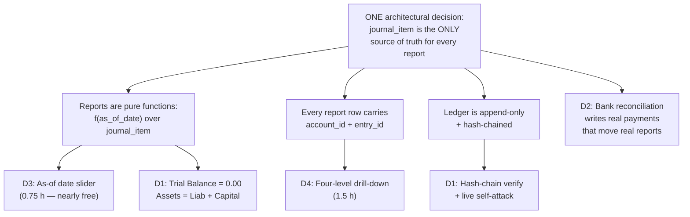
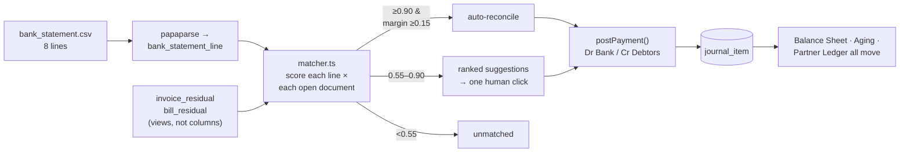
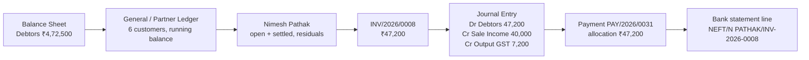

# What Makes Us Win — Beyond the Spec

Everything in the mockup is the **floor**. Every serious team in the room builds Contacts, Products, Chart of Accounts, Journals, Purchase Orders, Vendor Bills, Sales Orders, Invoices, Payments, Budgets, a Balance Sheet and a P&L. Thirty-plus screens. If you build all of them perfectly, you are tied with ten other teams and the judge is bored.

This section is where the gap opens.

---

## 1. The Strategic Principle: Build Proof, Not Features

There are two completely different kinds of "extra thing you could add," and they score nothing alike.

**Kind A — the bolt-on.** A dark mode toggle. A chatbot in the corner. A pie chart that nobody asked for. An email notification. These are *unrelated to the hard part of the problem*. They are cheap to add, everyone thinks of them, and — this is the important bit — **they prove nothing about whether your accounting is real**. A team whose Balance Sheet is a lie can add a dark mode in eight minutes.

**Kind B — the proof.** A feature that *cannot exist unless the underlying architecture is correct*. It is not a claim about your build. It is a demonstration. If it runs on stage and produces the right number, the architecture behind it is proven, and there is nothing left to argue about.

> **The rule we apply to every idea in this section:**
> *"If a team with a fake backend tried to build this feature, would they fail?"*
> If the answer is no — if a faker could ship it too — it is a bolt-on. Cut it.

### Why an Odoo judge rewards proof far more than features

Understand who is judging. An Odoo engineer has spent years looking at accounting software. They have seen ten thousand invoice forms. They are not going to be impressed by an invoice form. What they are doing, in the first sixty seconds, is answering one private question:

> *"Is this a real double-entry ledger, or is it invoice CRUD with a decorative journal table?"*

Here is the thing that makes this problem statement special. In sales or HR, "correct" is a matter of taste — is this the right approvals flow? is this the right leave policy? Judges argue. In **accounting, correctness is arithmetic**. Either your Trial Balance is 0.00 or it is not. Either Assets equal Liabilities plus Capital to the paisa, or they do not. There is no opinion in it.

That converts the judging from taste into a pass/fail test — which is *brutal* for the 70–80% of accounting teams who will fake it, and *enormously* rewarding for us. Our entire differentiator strategy is therefore:

1. **Make the arithmetic visible and self-auditing**, so the judge does not have to take our word for anything.
2. **Then spend every remaining hour on features that are only possible because the arithmetic is real.**

Every differentiator below is Kind B. Not one of them is a decoration.

### A tiny glossary, so nothing below is jargon

Every one of these words appears in the section. Each is defined once, here, in plain English. Saying them *correctly* to a judge is itself worth points — see §9.

| Word | Plain English meaning |
|---|---|
| **Debit / Credit** | The two sides of every accounting record. Every transaction is written twice: some amount is debited to one account, the same amount is credited to another. Money never appears from nowhere. |
| **Journal item** | One single line of one side. "Debit Debtors ₹47,200" is one journal item. This is the atomic unit of accounting. |
| **Journal entry** | A group of journal items that belong together and must add up: total debits = total credits. |
| **Trial Balance** | Add up every debit in the whole system, add up every credit, subtract. If the answer is not exactly 0.00, your books are broken. |
| **Residual** | How much of an invoice is still unpaid. ₹10,000 invoice, ₹4,000 received → residual ₹6,000. Must be *calculated*, never stored in a column. |
| **Reconciliation** | Linking money that actually arrived in the bank to the invoice it was paying. |
| **Reversal entry** | The only legal way to "undo" a posted entry: write a new, opposite entry. The original stays in the books forever. |
| **Lock date** | A cut-off date. Nothing can be posted before it. Used after a period is closed and reported to the tax authority. |
| **Aging** | Grouping unpaid invoices by how overdue they are (Current / 1–30 days / 31–60 / 61–90 / 90+). |
| **Analytic account** | A project or cost-centre tag on a line, so you can ask "how much did Project 1 spend?" The mockup calls it **Budget Analytics**. |
| **Retained earnings / Current-year earnings** | Profit that has not been paid out. This is the number that makes the Balance Sheet actually balance. Most teams have never heard of it. |

---

## 2. The Ranked List

Hours are honest. They assume the posting engine, the `journal_item` table, and the report queries already exist — because those are **required scope, not differentiators** (see the architecture and hour-plan sections). Each number below is the *marginal* cost on top of the floor.

| # | Differentiator | Marginal hours | Judge impact | Faker could build it? | Verdict |
|---|---|---|---|---|---|
| **D1** | **Books Integrity page** — Trial Balance 0.00, live accounting equation, hash-chain verify, live self-attack | **2.5 h** | 10/10 | **No** | **TOP 3 — build** |
| **D2** | **Bank statement CSV import + fuzzy auto-reconciliation with confidence scores** | **3.0 h** | 10/10 | **No** | **TOP 3 — build** |
| **D3** | **As-of date slider on the Balance Sheet** (time machine) | **0.75 h** | 9/10 | **No** | **TOP 3 — build** |
| **D4** | **Four-level drill-down — every number clickable** | **1.5 h** (≈60% already required by the mockup) | 9/10 | Partly | **Not optional — see §5** |
| D5 | "Explain this entry" rule-trace panel | 1.0 h *(0.25 h if designed in from hour 1)* | 8/10 | No | Tier 2 — first to build |
| D6 | Period lock date + true reversal (no Delete, no Edit) | 1.25 h | 8/10 | No | Tier 2 |
| D7 | Overpayment → customer credit, + receivables aging buckets | 1.5 h | 7/10 | No | Tier 2 |
| D8 | Budget pacing: elapsed % vs consumed %, RAG light, projection | 1.0 h | 6/10 | Yes-ish | Tier 3 |
| D9 | Derived stock ledger + moving-average COGS (buried in the PDF Overview) | 2.5 h | 7/10 | No | Bench |
| D10 | Accountant keyboard mode (`=` auto-balances the last line) | 2.0 h | 6/10 | Yes | Bench |

**The envelope: 6.25 hours for the TOP 3, plus 1.5 hours for D4 = ~7.75 hours of the ~19.** That leaves ~11 hours for the required screens and flows, which is only achievable because the mockup itself mandates a reusable list/form scaffold (see the scope section). If the floor slips, cut from the bottom of this table upward — **never** from the top.

### The dependency picture

Notice that D1, D3 and D4 are all downstream of exactly one decision. They are not four projects; they are four visible consequences of getting one thing right.



**Say this to a judge who asks how you built so much:** *"We didn't build four features. We made one decision — reports read only from journal items, never from invoices — and these came out of it. That's why a team that fakes the reports can't retrofit any of them."*

---

## 3. TOP 3 — We Build These, No Negotiation

### D1 — The Books Integrity Page

> **Status: addition (beyond spec).** The mockup does not ask for this page. It earns its place because it is the single fastest way to prove every other number in the demo, and because the mockup *does* mandate "The Journal Entry should always be balanced" — this page is that requirement, made continuously verifiable.

#### What it is

One page, at `/integrity`, with a big **Run Full Audit** button. Pressing it runs four checks live against the database and prints the results with real numbers:

```
LEDGER AUDIT — run at 14:22:07, 2026-09-05

  1. ENTRY BALANCE          41 entries · 352 journal items
                            every entry: Σ debit = Σ credit        ✅ PASS
  2. TRIAL BALANCE          Σ all debits   ₹ 18,42,310.00
                            Σ all credits  ₹ 18,42,310.00
                            difference     ₹        0.00           ✅ PASS
  3. ACCOUNTING EQUATION    Assets              ₹ 8,42,310.00
                            Liabilities         ₹ 1,97,310.00
                            Capital             ₹ 4,26,600.00
                            + Current-Year Earnings ₹ 2,18,400.00
                            Liab + Capital      ₹ 8,42,310.00
                            difference          ₹        0.00      ✅ PASS
  4. HASH CHAIN             41 of 41 entries verified, genesis → #41
                            head 9f3c1a…7b02                       ✅ VALID
```

Three parts, all of which are real computation, none of which is a stored value:

1. **Per-entry balance check** — walk every posted journal entry, sum debits, sum credits, assert equal.
2. **Trial Balance and the accounting equation** — the whole-system totals, and the equation `Assets = Liabilities + Capital + (Income − Expenses)`.
3. **Hash-chain verification** — walk the append-only ledger and re-compute every hash.

#### Why an Odoo judge notices

Three reasons, in ascending order of force.

- **Line 3 is the pass/fail gate of this entire problem statement.** The mockup's Balance Sheet has a `Total Asset` and a `Total (Liabilities)` footer row. Roughly 90% of teams will ship a Balance Sheet where those two footers are different numbers, and will hope nobody adds it up. The judge *will* add it up. We add it up for them, on screen, before they ask.
- **Current-Year Earnings.** This is the give-away. The mockup's Balance Sheet draws only Bank, Cash, Debtors on the asset side and Capital, Creditors on the liability side. With just those rows, **it cannot balance** — because the profit you made this year is sitting in the Income and Expense accounts, which are on neither side. The only way to make the footers tie is to compute `Income − Expenses` for the fiscal year and inject it into the Capital side. A team that has never encountered this does not know why their sheet is off by exactly their profit. *(Addition, and a necessary one: the mockup's own "Total Asset = Total (Liabilities)" footer is unachievable without it.)*
- **The hash chain is elite-tier signalling.** Odoo ships exactly this — an inalterable, hash-chained ledger for fiscal compliance in France, Germany and elsewhere. A student team demonstrating that they know the concept exists tells an Odoo engineer, in five seconds, that we read past the surface of the problem.

#### How it is built — concretely

**Money is stored as integer paise (`BIGINT`), never as a float or a JS `number` doing decimal maths.** ₹47,200.00 is stored as `4720000`. This is non-negotiable and it is the reason the difference prints as exactly `0.00` and not `0.0000000001`. Floats will break the equality check and there is no recovering from it at hour 20.

Three checks, three SQL queries:

```sql
-- CHECK 1: every posted entry balances (should return zero rows)
SELECT je.id, je.number,
       SUM(ji.debit_paise)  AS dr,
       SUM(ji.credit_paise) AS cr
FROM journal_entry je
JOIN journal_item ji ON ji.entry_id = je.id
WHERE je.state = 'posted'
GROUP BY je.id, je.number
HAVING SUM(ji.debit_paise) <> SUM(ji.credit_paise);

-- CHECK 2 + 3: trial balance and the equation, in one pass
SELECT a.type,
       SUM(ji.debit_paise - ji.credit_paise) AS net_paise,
       SUM(ji.debit_paise)  AS dr_paise,
       SUM(ji.credit_paise) AS cr_paise
FROM journal_item ji
JOIN journal_entry je ON je.id  = ji.entry_id
JOIN account       a  ON a.id   = ji.account_id
WHERE je.state = 'posted'
GROUP BY a.type;
```

The equation is then assembled in `src/lib/integrity/audit.ts` from those account-type buckets. The mockup gives us the exact type taxonomy to bucket by — grouped dropdown `Balancesheet {Asset, Liability, Bank, Capital, Cash}` and `Profit and Loss {Income, Expenses, Other Expenses}`:

```ts
const assets      = net(['Asset', 'Bank', 'Cash']);              // debit-positive
const liabilities = -net(['Liability']);                          // credit-positive → flip
const capital     = -net(['Capital']);
const cye         = -net(['Income', 'Expenses', 'Other Expenses']); // current-year earnings
assert(assets === liabilities + capital + cye);   // exact integer equality, in paise
```

**The hash chain** — `src/lib/integrity/hash.ts`, about 40 lines:

```ts
export function entryHash(prevHash: string, e: PostedEntry): string {
  const canonical = JSON.stringify({
    seq:     e.chain_seq,
    number:  e.number,              // INV/2026/0008
    date:    e.date,                // '2026-09-02'
    journal: e.journal_code,        // 'SALES'
    lines: e.lines
      .map(l => [l.account_code, l.partner_id ?? null, l.debit_paise, l.credit_paise])
      .sort()                        // order-independent: sorting makes the hash stable
  });
  return sha256(prevHash + canonical);   // node:crypto, hex
}
```

`journal_entry` gains three columns: `chain_seq BIGINT` (gapless, allocated at POST time inside the same transaction), `prev_hash CHAR(64)`, `hash CHAR(64)`. Genesis entry uses `prev_hash = '0'.repeat(64)`.

**The database enforces the rules the app claims** — this is what makes the demo unfakeable. Two objects in the migration:

```sql
-- 1. An entry can never be committed unbalanced. DEFERRED so multi-line inserts work.
CREATE CONSTRAINT TRIGGER journal_entry_must_balance
  AFTER INSERT OR UPDATE ON journal_item
  DEFERRABLE INITIALLY DEFERRED
  FOR EACH ROW EXECUTE FUNCTION assert_entry_balances();

-- 2. A posted journal item is append-only. No UPDATE. No DELETE. Ever.
CREATE OR REPLACE FUNCTION forbid_posted_mutation() RETURNS trigger AS $$
BEGIN
  RAISE EXCEPTION 'journal_item_is_append_only: posted rows cannot be updated or deleted';
END $$ LANGUAGE plpgsql;

CREATE TRIGGER journal_item_append_only
  BEFORE UPDATE OR DELETE ON journal_item
  FOR EACH ROW WHEN (OLD.posted) EXECUTE FUNCTION forbid_posted_mutation();
```

**Files:** `src/lib/integrity/audit.ts`, `src/lib/integrity/hash.ts`, `src/app/integrity/page.tsx`, `src/app/api/integrity/audit/route.ts`, `src/app/api/integrity/verify-chain/route.ts`, `prisma/migrations/…_ledger_guards.sql`.

**A gotcha you must handle before the demo, or the self-attack fails on stage:** the `journal_item_append_only` trigger will block *your own* tampering command too. That is the correct behaviour, but it makes the demo look like a permissions error rather than a detection. The fix is to tamper as the database owner with triggers suppressed — and this actually makes the demo *stronger*, because you narrate it:

```sql
-- run in psql as the owner role, NOT as the app role
SET session_replication_role = replica;   -- suppress triggers
UPDATE journal_item SET debit_paise = 9999900 WHERE id = 217;
SET session_replication_role = origin;
```

#### Hours

| Task | Hours |
|---|---|
| Audit queries + equation assembly + `/api/integrity/audit` | 0.75 |
| Integrity page UI (mono font, PASS/FAIL chips, the printed numbers) | 0.5 |
| Hash chain: columns, compute-on-post, verify endpoint, break-report UI | 1.0 |
| DB triggers + rehearsing the self-attack and the restore | 0.25 |
| **Total** | **2.5** |

#### The 30-second demo moment

This is the **cold open**. Not the dashboard. Not a form. (Cross-reference the demo-script section for full ordering.)

> *"Before I show you anything, I want to show you that nothing here is fake."*
> **Click Run Full Audit.**
> *"352 journal items across 41 entries. Every entry balances. Trial Balance is zero point zero zero. Assets 8,42,310 equals Liabilities 1,97,310 plus Capital 4,26,600 plus current-year earnings 2,18,400. Every number in this demo comes out of one table — journal items. Nothing is summed off invoices."*
> **Switch to terminal, curl an unbalanced entry at the API.**
> ```
> $ curl -XPOST localhost:3000/api/journal-entries -d '{"lines":[
>     {"account":"1100","debit":500000},{"account":"3000","credit":400000}]}'
> 422 {"error":"journal_entry_must_balance","dr":500000,"cr":400000,"diff":100000}
> ```
> *"That rejection is a database constraint, not an if-statement in my API. The app literally cannot write an unbalanced entry."*
> **Then, at the end of the demo, the self-attack.** In psql, suppress triggers, corrupt row 217, re-run Verify Ledger:
> ```
> HASH CHAIN  ❌ BROKEN at chain_seq #217  (INV/2026/0006, 2026-08-14)
>             expected  9f3c1a4e…7b02
>             found     c81d0055…19af
>             41 entries checked, first divergence at #217, 24 entries after it invalidated
> ```
> *"In accounting you never delete anything — and you shouldn't be able to change it either. That's my own database, my own superuser, triggers switched off, and the books still caught me."*
> **Restore, re-verify, green.**

---

### D2 — Bank Statement Import + Fuzzy Auto-Reconciliation

> **Status: addition (beyond spec).** The mockup gives us a manual Payment wizard with autofilled partner and amount, and computed Paid / Partial / Not Paid badges. This feature does not replace that wizard — it feeds it. It is the highest-value addition on the list.

#### What it is

Real businesses do not receive payments one at a time with a human clicking "Pay" on each invoice. They get a bank statement at the end of the day with 40 lines of cryptic narration, and someone has to work out which line paid which invoice. **That job is called reconciliation, and it is Odoo's flagship accounting feature.**

We upload a CSV that looks exactly like a real Indian bank export:

```csv
date,narration,ref,debit,credit
2026-09-02,"NEFT/N PATHAK/INV-2026-0008/HDFC0000123",N0245113,,47200.00
2026-09-02,"UPI CR 169927834 AZURE FURN",UPI169927,,12500.00
2026-09-03,"RTGS DR SHARMA TIMBER SUPPLY",R8890231,16992.00,
2026-09-03,"IMPS/P2A/NIMESH P/PART PAYMENT",I5510023,,10000.00
2026-09-04,"CHQ 445120 CLG",CTS445120,,8500.00
```

A scoring engine ranks every open invoice and bill against every statement line and emits a **confidence percentage with the reasons shown**:

| Statement line | Best match | Confidence | Why |
|---|---|---|---|
| NEFT/N PATHAK/INV-2026-0008 | INV/2026/0008 · ₹47,200 | **99%** | ref token exact · amount exact · partner 0.82 |
| UPI CR 169927834 AZURE FURN | INV/2026/0011 · ₹12,500 | **93%** | amount exact · partner "AZURE FURN"→"Azure Furniture" 0.71 |
| RTGS DR SHARMA TIMBER SUPPLY | BILL/2026/0004 · ₹16,992 | **91%** | amount exact · partner 0.68 · date −1d |
| IMPS/P2A/NIMESH P/PART PAYMENT | INV/2026/0009 · residual ₹6,992 | **61%** | partner 0.74 · amount partial · **needs review** |
| CHQ 445120 CLG | *(2 candidates)* | **44%** | amount only · **needs review** |

Auto-clears the high-confidence ones. Leaves the ambiguous ones with a ranked dropdown for one human click. Then **Reconcile All** posts real payments through the same posting engine the manual wizard uses — `Dr Bank / Cr Debtors` — invoice residuals drop, the Paid/Partial badges flip, Debtors on the Balance Sheet falls, and the aging report drains.

#### Why an Odoo judge notices

- It is the feature they work on. Reconciliation *is* the accounting module, from an Odoo engineer's point of view.
- It is a genuine ranking algorithm with a scoring function you can pull up the source for. It is not a CRUD screen.
- **Approximately zero hackathon teams will attempt it.** Most will not know the word.
- Critically: it cannot be faked. A fake system with a `paid: boolean` column cannot express "₹10,000 arrived against a ₹16,992 invoice, residual now ₹6,992." Partial reconciliation requires a proper `payment_allocation` join table — which the mockup's own Partial badge already demands, and which most teams will discover they need at hour 20 when it is too late to retrofit.

#### How it is built — concretely

**Schema** — one new table, one new join table:

```sql
CREATE TABLE bank_statement_line (
  id            SERIAL PRIMARY KEY,
  statement_id  INT NOT NULL REFERENCES bank_statement(id),
  txn_date      DATE NOT NULL,
  narration     TEXT NOT NULL,
  bank_ref      TEXT,
  amount_paise  BIGINT NOT NULL,          -- signed: + = money in, − = money out
  state         TEXT NOT NULL DEFAULT 'unmatched',  -- unmatched|suggested|reconciled
  payment_id    INT REFERENCES payment(id)
);

-- this table already exists as required scope; reconciliation writes into it
CREATE TABLE payment_allocation (
  payment_id    INT NOT NULL REFERENCES payment(id),
  document_id   INT NOT NULL,             -- invoice or bill
  document_type TEXT NOT NULL,
  amount_paise  BIGINT NOT NULL
);
```

**Residual is never stored.** It is derived:

```sql
CREATE VIEW invoice_residual AS
SELECT i.id,
       i.total_paise - COALESCE(SUM(pa.amount_paise), 0) AS residual_paise
FROM invoice i
LEFT JOIN payment_allocation pa
       ON pa.document_id = i.id AND pa.document_type = 'invoice'
GROUP BY i.id;
```

**The matcher** — `src/lib/reconcile/matcher.ts`. Four signals, weighted. This is the file you show the judge.

```ts
const W = { amount: 0.40, reference: 0.30, partner: 0.20, date: 0.10 };

function scoreAmount(line: bigint, residual: bigint): number {
  if (line === residual)                      return 1.00;   // exact to the paisa
  if (abs(line - residual) <= 100n)           return 0.90;   // within ₹1 (bank charges)
  if (abs(line - residual) <= residual / 100n) return 0.60;  // within 1%
  if (line < residual && line > 0n)           return 0.45;   // plausible part payment
  return 0;
}

// pull INV/2026/0008, INV-2026-0008, inv20260008 out of any narration
const DOC_RE = /\b(INV|BILL|PO|SO)[\/\-_ ]?(20\d{2})[\/\-_ ]?(\d{3,5})\b/i;
function scoreReference(narration: string, docNumber: string): number {
  const m = DOC_RE.exec(narration);
  if (!m) return 0;
  const norm = (s: string) => s.replace(/[^A-Z0-9]/gi, '').toUpperCase();
  if (norm(m[0]) === norm(docNumber))                 return 1.00;
  if (norm(docNumber).endsWith(m[3].padStart(4,'0'))) return 0.70;  // digits only
  return 0;
}

// Dice coefficient over character trigrams — ~25 lines, no dependency.
// "AZURE FURN" vs "Azure Furniture" → 0.71
function scorePartner(narration: string, partnerName: string): number {
  return diceTrigram(normalize(narration), normalize(partnerName));
}

function scoreDate(txnDate: Date, docDate: Date): number {
  const d = Math.abs(daysBetween(txnDate, docDate));
  return Math.max(0, 1 - Math.min(d, 30) / 30);
}
```

**The decision thresholds** — the part that makes it defensible rather than a toy:

```ts
const AUTO_THRESHOLD   = 0.90;   // auto-reconcile at or above this
const MARGIN_REQUIRED  = 0.15;   // ...only if the winner beats #2 by this much
const SUGGEST_FLOOR    = 0.55;   // below this, show as unmatched

if (top.score >= AUTO_THRESHOLD && (top.score - second.score) >= MARGIN_REQUIRED)
  → auto-reconcile
else if (top.score >= SUGGEST_FLOOR)
  → suggest, ranked, human picks
else
  → unmatched, offer "create as unallocated payment"
```

The `MARGIN_REQUIRED` rule matters. If two invoices are both ₹12,500 from the same customer, the score is high for both and the correct behaviour is **to refuse to guess**. Say that sentence out loud to a judge — it is the difference between a scoring function and a demo trick.

**Libraries:** `papaparse` for the CSV (handles quoted narrations containing commas). Trigram similarity hand-rolled — 25 lines, no dependency, and you can show it.

**Endpoints:** `POST /api/bank/import` (CSV → statement lines), `POST /api/bank/match` (returns ranked candidates + score breakdown, writes nothing), `POST /api/bank/reconcile` (creates `payment` rows through the *same* `postDocument()` service the manual wizard uses — one posting engine, no second code path).



#### Hours

| Task | Hours |
|---|---|
| Schema + residual views + CSV parse + import screen | 0.75 |
| `matcher.ts` — four signals, trigram, thresholds | 1.0 |
| Reconciliation UI: rows, confidence bars, "why" chips, ranked dropdown | 0.75 |
| Reconcile All → posts through existing payment service; state transitions | 0.5 |
| **Total** | **3.0** |

#### The 45-second demo moment

Protect this. It is the loudest beat in the demo.

> *"Customers don't pay one invoice at a time. Here's this morning's bank statement."*
> **Drag in `bank_statement.csv`. The scoring runs on screen, row by row.**
> *"Six of eight matched automatically, between 91 and 99 percent confidence. Look at the reasons — this one matched on the reference token pulled out of the NEFT narration. This one had no reference at all, so it matched on exact amount plus a fuzzy name match: the bank wrote 'AZURE FURN', our customer is 'Azure Furniture', trigram similarity 0.71."*
> *"These two it refused to auto-clear. This one is a ten-thousand rupee IMPS against a sixteen-thousand rupee invoice — that's a partial payment, and I want a human to confirm it. And this cheque matches two different invoices for the same amount, so the top score doesn't beat the runner-up by enough. The system declines to guess. That threshold is in the code."*
> **Pick one manually. Hit Reconcile All.**
> *"Payments posted, invoices flipped to Paid and Partial, Debtors on the Balance Sheet just dropped by four lakh, and the 0–30 day aging bucket drained. Nothing was updated by hand — those are new journal items."*

---

### D3 — The As-Of Date Slider on the Balance Sheet

> **Status: extension of spec.** The mockup requires a **Year selector (2026)** on both the Balance Sheet and the P&L. We keep that selector exactly as drawn, and add a date slider next to it. It is the same query with a finer-grained parameter.

#### What it is

A slider under the Balance Sheet running from the start of the fiscal year to today. Drag it backwards and **the entire Balance Sheet re-derives at that date and animates**: Debtors climbs as you go back before the payments landed, Bank falls, Capital holds flat, and the Total Asset / Total Liabilities footers stay tied to each other at every single position.

#### Why an Odoo judge notices

Because it is **structurally impossible** for a faked system.

A Balance Sheet is defined as: *the cumulative sum of every journal item from the beginning of time up to date T*. Not "this year's" — from inception. If your report is `SELECT SUM(total) FROM invoices WHERE year = 2026`, you have no way to answer "what did the books look like on 14 June?" — because a document's total is a single number with no time structure, an invoice half-paid in July still shows its full total in June, and a manual journal entry does not appear in the invoice table at all.

If your report is `SUM(debit − credit) FROM journal_item WHERE date <= T`, then **T is already a parameter and you get the time machine for free**. Which is exactly the point: this feature costs 45 minutes *if the architecture is right* and is unbuildable if it is not.

It is also the only genuinely cinematic thing this domain offers. Accounting has no kanban board, no map, no calendar. This is our one piece of motion, and it says something true.

#### How it is built — concretely

The report endpoint already takes the date. There is no separate "slider API".

```sql
-- GET /api/reports/balance-sheet?as_of=2026-06-14
SELECT a.id, a.name, a.type,
       SUM(ji.debit_paise - ji.credit_paise) AS balance_paise
FROM journal_item ji
JOIN journal_entry je ON je.id = ji.entry_id
JOIN account       a  ON a.id  = ji.account_id
WHERE je.state = 'posted'
  AND je.date <= $1::date          -- ← the whole feature
GROUP BY a.id, a.name, a.type;
```

Note there is **no start date**. A Balance Sheet is cumulative from inception. The P&L is the opposite — it takes a range and only Income/Expense-type accounts:

```sql
-- GET /api/reports/pnl?from=2026-04-01&to=2026-06-14
WHERE je.state = 'posted' AND je.date BETWEEN $1 AND $2
  AND a.type IN ('Income','Expenses','Other Expenses')
```

Two different aggregation semantics over the same table. Being able to *say that sentence* is worth as much as the feature.

**Making the drag smooth without lying about it.** Firing a query on every pixel of drag is 200 requests. The honest optimisation:

1. On page load, one query returns the **month-end grid** — the per-account running balance at each month end, using a window function:

```sql
SELECT account_id, month_end,
       SUM(delta) OVER (PARTITION BY account_id ORDER BY month_end) AS balance_paise
FROM (SELECT ji.account_id,
             (date_trunc('month', je.date) + INTERVAL '1 month - 1 day')::date AS month_end,
             SUM(ji.debit_paise - ji.credit_paise) AS delta
      FROM journal_item ji JOIN journal_entry je ON je.id = ji.entry_id
      WHERE je.state = 'posted' GROUP BY 1, 2) m;
```

2. While the user *drags*, the UI reads that grid — instant, 60fps, and still a genuine aggregation of journal items, just pre-computed for 12 dates.
3. When the user *releases*, we fire the real `?as_of=` query for the exact date and swap in the result.

Both paths produce the same number, and you should tell the judge exactly that — it is a better answer than pretending every frame is a round-trip.

**UI:** `<input type="range">` bound to a day index; numbers animated with a `requestAnimationFrame` count-up (roll digits from old value to new over ~250ms). No animation library needed. Reuse the same component on the P&L, where the slider moves the range end.

**Files:** `src/app/api/reports/balance-sheet/route.ts` (add `as_of` param), `src/app/api/reports/balance-sheet/grid/route.ts`, `src/components/AsOfSlider.tsx`, `src/components/RollingAmount.tsx`.

#### Hours

| Task | Hours |
|---|---|
| `as_of` param on the existing BS query (mostly already there) | 0.1 |
| Month-grid window query + endpoint | 0.25 |
| Slider component + rolling-number animation | 0.4 |
| **Total** | **0.75** |

#### The 20-second demo moment

Say almost nothing. Let it move.

> **Grab the slider. Drag from September back to April, slowly.**
> *"That's the same Balance Sheet at every date in the fiscal year. Debtors climbing as I go back before the payments landed. Bank dropping. Capital flat."*
> **Stop somewhere in June.**
> *"Nothing is cached and nothing is stored per-period. It's one aggregation over journal items where date is less than or equal to the fourteenth of June. And the footers still tie — assets still equal liabilities plus capital, at every position on that slider."*

---

## 4. Not Optional: D4 — Four-Level Drill-Down

I have separated this from the TOP 3 because it is not really a differentiator you *add*. It is a discipline you *apply while building the required reports*, and about 60% of it is mandated by the mockup already.

**What the mockup already requires:**
- Budget's **Achieved Amount** is a drill-down button: *"Clicking on the Achieved Amount Button open list view of all Invoices/Bills having same analytical for the budget period."*
- The **PO smart button** on a Vendor Bill, conditionally visible.
- The **Budget smart button** on a Bill/Invoice, opening the budget analytic report for that document's analytic.
- *"Open Form View on Click"* on both the Budget list and kanban.
- *"clicking on already saved record — it will open form view with saved details"* as a universal contract.

So the organisers have already told us: **cross-navigation is baseline**. We extend it to every number in the reports.

**The chain we build:**



**Why it is cheap:** because the reports already query `journal_item`, every report row *already has* an `account_id` in hand. Making the row a link is `<Link href={'/ledger?account=' + id + '&as_of=' + asOf}>`. The Partner Ledger is one more grouped query over the same table. The marginal cost over the required scope is about 1.5 hours, and most of that is the running-balance column.

**Why a judge notices:** this is what accountants actually do all day — see a number they do not believe and click into it until they find the document. A judge who can chase a number down to the bank line and back stops evaluating a project and starts using a product. It also quietly answers "did you make these numbers up?" without you having to say a word: they made them up themselves, by following the trail.

**The 20-second demo moment:** *say nothing at all.* Click Debtors → ledger → partner → invoice → journal entry → payment → bank line, one click per second, then walk back up. Then: *"No dead ends anywhere. Every number in this application is a link to the journal items that produced it."*

**Hours: 1.5.**

---

## 5. Tier 2 — In Strict Priority Order If Hours Remain

### D5 — "Explain This Entry" Rule-Trace Panel · 1.0 h (0.25 h if designed in early)

> **Status: addition.** Directly answers the mockup's own requirement that Purchase/Sales accounts be *"set by default"* — this panel shows *which* default, resolved from *which* configuration row.

**What it is.** A collapsible panel next to every auto-generated journal entry that explains, in plain English, why each line exists:

```
HOW THIS ENTRY WAS DERIVED — INV/2026/0008, posted 02-Sep-2026

  rule  sales_invoice_post
  ├─ Journal SALES → default_receivable = "Debtors A/c" (Asset)
  │     ⇒ Dr  Debtors A/c                             ₹ 47,200.00
  ├─ Line 1 · Office Chair × 5 @ ₹8,000
  │     Product → Category "Furniture" → income_account = "Sales Income A/c"
  │     ⇒ Cr  Sales Income A/c                        ₹ 40,000.00
  │     analytic: Project 1 (100%)
  ├─ Tax GST 18% (exclusive) → tax.collected_account = "Output GST A/c"
  │     ⇒ Cr  Output GST A/c                          ₹  7,200.00
  └─ rounding difference                              ₹      0.00
      Σ Dr 47,200.00   Σ Cr 47,200.00   balanced ✅
```

**Why a judge notices.** It pre-emptively kills the only real question they have left: *"did you hardcode this?"* You cannot produce this trace from an if-statement. Producing it proves the posting engine reads its accounts from configuration tables — which is exactly what makes changing the Sales Journal's default account work (§8, test 4). Nobody builds explainability into accounting.

**How it is built.** This is nearly free **if you design it in at hour one**. The posting engine is already resolving accounts; make it push a breadcrumb as it goes:

```ts
// src/lib/posting/engine.ts
trace.push({ step: 'journal_default', source: `Journal:${journal.code}.default_receivable`,
             resolved: account.name, side: 'debit', amount_paise: total });
```
Store as `journal_entry.posting_trace JSONB`. The panel is a renderer over that array. **Add the `trace.push` calls when you write the engine.** Bolting it on later means re-reading and re-instrumenting the engine — that is the difference between 15 minutes and an hour.

**Demo moment (20s):** *"Every posted entry carries the derivation that produced it. This account wasn't hardcoded — it was resolved from the Sales Journal's default receivable. This one came from the product's category. This one from the tax record. If you change any of those three configuration rows, the next invoice posts differently, and this trace will say so."*

---

### D6 — Period Lock Date + True Reversal · 1.25 h

> **Status: addition, but it corrects a spec ambiguity.** The mockup gives Journal Entries a **"Reset to Draft"** button and Budgets a Cancel that *archives* rather than deletes — the organisers already lean toward non-destructive. We take it to the correct accounting behaviour.

**What it is.** Two genuine accounting controls:
1. **Lock date.** A company setting: `lock_date = 2026-03-31`. Any attempt to post an entry dated on or before it is blocked: *"Period locked on 31-Mar-2026 by Admin. Post to a later date or ask an administrator to move the lock."*
2. **True reversal.** A posted invoice has **no Edit button** — it does not exist in the DOM, and the API rejects the mutation regardless. Cancelling generates a **reversal entry**: same date-or-today, same accounts, debits and credits swapped, numbered `REV/INV/2026/0008`, linked both ways. Both entries stay in the ledger forever, and the reports self-correct because they sum both.

**Why a judge notices.** Every team's instinct is a Delete button. Deleting a posted entry silently rewrites financial history, which is the thing accounting exists to prevent. And "lock date" is one of those phrases — an Odoo engineer's ears physically prick up when a student team uses it correctly, because it means you read past the surface.

**How it is built.**
```ts
// src/lib/posting/guards.ts
if (entry.date <= company.lock_date && !user.canOverrideLock)
  throw new PostingError('period_locked',
    `Period locked on ${fmt(company.lock_date)} by ${company.lock_set_by}`);
```
Reversal is ~30 lines: read the source entry's items, emit a new entry with `debit_paise` and `credit_paise` swapped, set `reversal_of_id` / `reversed_by_id`, post it through the same engine so the hash chain extends normally.

**Demo moment (35s):** *"Try to edit this posted invoice — there's no Edit button, and the API refuses too. To undo it, I cancel it, and the system writes a reversal: same accounts, debits and credits mirrored. Both entries are in the ledger. The Balance Sheet corrected itself and nothing was erased. Now watch this — lock date, thirty-first of March. Post something dated the twentieth of March."* **Blocked.** *"In accounting, you never delete anything."*

---

### D7 — Overpayment Credits + Receivables Aging · 1.5 h

> **Status: partial spec, partial addition.** The mockup *requires* the Partial badge and `Amount Due = Total − Amount Paid`. Overpayment credits and the aging report are additions.

**What it is.** Three things a naive schema cannot express:
1. **One payment across many invoices.** ₹10,000 received, allocated by hand across three invoices totalling ₹14,200 in an allocation grid. All three go to **Partial** with live residuals.
2. **Overpayment becomes a credit.** Customer sends ₹5,000 more than they owed → the excess posts to an **unallocated customer credit** (`Cr Debtors` with no allocation) and is offered as a payment source on their next invoice.
3. **Aging buckets.** Current / 1–30 / 31–60 / 61–90 / 90+, computed off `due_date` — a field the mockup explicitly requires on both Invoice and Bill and that most teams will add and never use.

```sql
SELECT p.name,
  SUM(CASE WHEN due_date >= CURRENT_DATE THEN residual_paise ELSE 0 END) AS current_,
  SUM(CASE WHEN CURRENT_DATE - due_date BETWEEN 1  AND 30 THEN residual_paise ELSE 0 END) AS d1_30,
  SUM(CASE WHEN CURRENT_DATE - due_date BETWEEN 31 AND 60 THEN residual_paise ELSE 0 END) AS d31_60,
  SUM(CASE WHEN CURRENT_DATE - due_date BETWEEN 61 AND 90 THEN residual_paise ELSE 0 END) AS d61_90,
  SUM(CASE WHEN CURRENT_DATE - due_date > 90 THEN residual_paise ELSE 0 END) AS d90p
FROM invoice_residual r JOIN invoice i ON i.id = r.id JOIN contact p ON p.id = i.partner_id
WHERE r.residual_paise > 0 GROUP BY p.name;
```

**Why a judge notices.** Every team ships pay-in-full-only. Partial payment is the single most common real-world case, and it is *invisible* in a naive schema — you cannot retrofit it onto a `paid: boolean`. The aging report also visibly reacts to D2's reconciliation, which chains the two beats together.

**Demo moment (25s):** *"₹10,000 has come in against three invoices worth ₹14,200. I allocate it across them — all three go Partial, with real residuals. Now the customer overpays by ₹5,000: the system doesn't just swallow it, it creates an unallocated credit against Nimesh Pathak and offers it on his next invoice. And here's the aging: everything over 90 days in red, and it just moved a bucket because we reconciled."*

---

### D8 — Budget Pacing + a Real Commitment Column · 1.0 h

> **⚠️ Careful — naming collision with the spec.** The mockup uses **"Committed Amount"** to mean *the planned/budgeted amount* (₹200,000), and **"Achieved Amount"** for actuals. That is not the standard accounting meaning of "committed", but **it is the organisers' meaning, and we do not rename their column.** We keep `Analytic | Type | Committed Amount | Achieved Amount | Achieved % | Amount To Achieve` exactly as drawn, with their exact formulas — `Achieved % = (Achieved / Committed) × 100`, `Amount To Achieve = Committed − Achieved`. Everything below is an *additional* column and an *additional* panel.

**What we add:**
- A **Pipeline** column: the value of confirmed Purchase Orders on that analytic account that have *not yet been billed*. This is money you have promised to spend but has not hit the books. Reuses PO data we already have.
- **Pacing:** "68% of the period elapsed vs 81% of budget consumed" with a red/amber/green light and a straight-line year-end projection at the current burn rate.
- The mockup's **non-blocking** over-budget warning stays exactly non-blocking — *"Consider adjusting the value or revise the budget"* — because the organisers were explicit about that, twice (on PO confirm and on Bill confirm).

**Also, one honest architectural note worth saying out loud.** The mockup specifies Achieved Amount as *"Search Analytical in Sales Invoice / Vendor Bills … compute total."* We compute it from **journal items tagged with the analytic account**, which produces the same number for the specified cases but also correctly picks up manual journal entries tagged to that project. Tell the judge: *"the spec says search the invoices; we sum the journal items instead, so a manual adjustment to a project also shows up. Same number on your test case, more correct in general."* That is a "we understood you and went one better," not a deviation.

**Demo moment (20s):** *"Planned ₹2,00,000. Achieved ₹1,62,000 — that's posted journal items, not invoice headers. ₹24,000 more is in the pipeline as a confirmed PO we haven't been billed for yet. 68% of the period has elapsed and we've consumed 81%, so it's amber, and at this burn rate we finish ₹38,000 over. And confirming an over-budget PO warns but doesn't block — that's what the spec asked for."*

---

### D9 / D10 — The Bench

**Derived stock ledger + moving-average COGS (2.5 h).** The PDF Overview says *"financial **and stock** reports"* — one clause nearly every team will skip entirely. Qty-on-hand as a movement ledger (PO receipt +20, delivery −5, never a mutable counter), moving-average cost, auto `Dr COGS / Cr Inventory` on delivery so gross margin is real. **Genuinely valuable, genuinely 2.5 hours.** Build only if you are ahead of schedule at T-8. If you skip it, still say the sentence: *"the overview mentions stock reports; we scoped that as the next thing on the roadmap and here's the movement-ledger design"* — knowing you skipped it deliberately beats not having read it.

**Accountant keyboard mode (2.0 h).** Tab through the debit/credit grid; `=` auto-fills the last line to make the entry balance; Ctrl+Enter posts; `/` jumps to fuzzy account search. Post a four-line manual entry in 12 seconds without touching the mouse. Reads as "this team watched a real accountant work." It is the one UX differentiator a judge *feels* rather than observes — but it is two hours and it is the only Kind-A-adjacent item on the list. **Bench it.** *(If you build any of it, build only the `=` key — that alone is 20 minutes and it is the impressive half.)*

---

## 6. Where AI Actually Earns Its Place

You have API keys and you want AI to make the product better, not to be a gimmick. Accounting gives you an unusually clean rule for this:

> **No number in this system is ever produced by a language model. AI is allowed to *rank*, to *extract*, and to *explain*. It is never allowed to *calculate*.**

That sentence is itself a differentiator — say it to the judge. Every other team's "AI feature" is a chatbot that hallucinates revenue figures. Ours is architecturally forbidden from doing that.

Three placements that pass the rule:

| Use | Where | Why it is safe | Hours |
|---|---|---|---|
| **Narration parsing fallback** in D2 | `matcher.ts`, only when regex + trigram both score < 0.55 | The model returns a *candidate partner ID and a suggested doc number* which then goes through the **same deterministic scorer**. The score, and therefore the decision, is still arithmetic. | 0.5 |
| **Plain-English trace prose** in D5 | Renders the `posting_trace` JSON into a sentence | The JSON is generated by the engine. The model only rewords it. If the API is down, the raw trace still renders. | 0.25 |
| **Seed-data generation** (offline, before the event) | A Python script that invents 40 realistic Indian furniture transactions and realistic bank narrations | Runs before the clock. Output is fed through the real API, so the model's output is validated by the balance constraint. | 0.5, pre-event |

**Explicitly rejected:** a chatbot answering "what was my revenue last quarter". It is the obvious idea, several teams will build it, and it is the exact thing an accounting judge distrusts. If you want the capability, build it as **natural language → a filter on the existing report query**, so the model chooses `from` and `to` and the database computes the number. Only if you are ahead at T-6.

---

## 7. How the Judge Will Try to Catch Us Faking — and What We Show Instead

Assume the judge is an Odoo engineer who has already seen four fake submissions today and has a routine. Here is the routine, and our answer to each item. **Rehearse all ten. Each should take under 20 seconds to answer.**

### Test 1 — "Post a manual journal entry: Dr Cash ₹5,00,000 / Cr Capital ₹5,00,000. Now show me the Balance Sheet."

**Why they ask:** this is the killer. A faked system computes Cash from the payments table and Capital from nothing at all. A manual journal entry touches neither table, so **the Balance Sheet does not move**. Twenty seconds, verdict delivered.

**Our answer:** hand them the keyboard. The mockup already requires this exact screen — Accounting Date, Journal, and a grid of Account | Partner | Debit | Credit with a **blocking** warning if they do not match. Post it. Switch to the Balance Sheet: Cash +5,00,000, Capital +5,00,000, footers still tied. *"Every report reads journal items. It doesn't matter whether the entry came from an invoice, a bill, a payment or from you typing it in — it's the same table."*

### Test 2 — "Add up your Balance Sheet. Do assets equal liabilities plus capital?"

**Why they ask:** ~90% of submissions fail this, usually off by exactly the year's profit.

**Our answer:** the Integrity page prints the sum for them, to the paisa, including the **Current-Year Earnings** line. Then the extra move that wins the point: *"And here's why it ties — this ₹2,18,400 is the Net Income at the bottom of the P&L, and the same figure appears inside Capital on the Balance Sheet. Income and expense accounts don't sit on either side of the sheet, so if you don't roll the year's profit into equity, you're out by exactly your profit. That's the number most teams are missing."*

### Test 3 — "Pay half of this invoice."

**Why they ask:** it exposes a `paid: boolean` column instantly. A faked system either has no partial state, or has a text field someone types "Partial" into.

**Our answer:** register ₹20,000 against a ₹47,200 invoice. Badge flips to **Partial** (the mockup's own computed rule: *Partial — if amount due < total*). Residual shows ₹27,200 — and it is a **view**, not a column:
> *"Residual isn't stored anywhere. It's the invoice total minus the sum of its payment allocations, computed on read. That's why it can never drift out of sync, and it's why one payment can cover three invoices."*
Then the follow-up they will not expect: Debtors on the Balance Sheet dropped by exactly ₹20,000, and the aging bucket moved.

### Test 4 — "Change the Sales Journal's default income account, then post a new invoice."

**Why they ask:** it separates a config-driven posting engine from a wall of if-statements. This is the deepest test on the list.

**Our answer:** open Journals (the mockup's own master, seeded with Sales / Purchase / Bank / Cash each with a Default Account), change Sales from `Sales Income A/c` to a new `Export Sales A/c`. Post a fresh invoice. It credits Export Sales. Open the **Explain panel** (D5): the trace literally names `Journal:SALES.default_income → Export Sales A/c`.

**Then the move that separates us from everyone:** open an *old* invoice.
> *"Notice the old invoice still credits Sales Income. Changing configuration doesn't rewrite history — journal items store the account that was resolved at the moment of posting, not a live lookup. If it did rewrite history, last quarter's P&L would change every time somebody edits a dropdown."*

That paragraph is worth more than any screen in the app.

### Test 5 — "Delete this posted journal entry."

**Our answer:** there is no Delete button and no Edit button on a posted document. The API returns `403 posted_entries_are_immutable`. And the database returns `journal_item_is_append_only` even to the app's own role. Offer the reversal instead (D6).

### Test 6 — "Send an unbalanced entry straight to the API and skip your UI validation."

**Our answer:** the curl from the D1 cold open. `422`, and the error names the **database constraint** `journal_entry_must_balance`, not a JavaScript check. *"The validation isn't in my form, and it isn't in my API. It's in the schema."*

### Test 7 — "Where exactly does this ₹7,200 of tax come from?"

**Our answer:** the Explain panel (D5). Tax master → rate 18%, exclusive, `collected_account = Output GST A/c` → `Cr 7,200`. Then: *"and if I change that tax to inclusive, the same ₹47,200 invoice posts ₹40,000 / ₹7,200 differently — ₹7,200 becomes the tax inside the ₹47,200, so income drops to ₹40,000 minus the difference. The engine reads the flag."*

### Test 8 — "Show me the Balance Sheet as of 30 June."

**Our answer:** the slider (D3). Then the honest technical footnote about the month-grid vs the exact re-query, because volunteering the implementation detail is what a senior engineer does and judges notice it.

### Test 9 — "Your tax has a rounding problem. Three lines at ₹333.33 of tax each."

**Why they ask:** because `sum(round(line_tax)) ≠ round(sum(line_tax))` is real, it puts your journal entry off by ₹0.01, and ₹0.01 violates the balance constraint — which means a naive system either crashes or silently drops the constraint.

**Our answer:** integer paise everywhere, plus an explicit largest-remainder allocation so the line taxes always sum to the document tax. If a residual paisa still exists, the engine emits a **Rounding Difference** line to a dedicated account and the Explain panel shows it as `rounding difference ₹0.01`. *"We'd rather have a visible one-paisa line than an invisible imbalance."*

### Test 10 — "Is your seed data hand-crafted so it happens to balance?"

**Why they ask:** the fourth-most-common fake is a SQL dump with totals that tie by luck.

**Our answer — and this is worth building for on purpose:**
> *"Our seed script doesn't insert a single row of accounting data. It calls the same REST endpoints you would — POST /api/purchase-orders, POST /api/vendor-bills, POST /api/payments — 40 documents in sequence. Every journal item in this database was produced by the posting engine and passed the balance constraint on the way in. If the engine were wrong, seeding would have crashed."*

Make this true. `scripts/seed.ts` drives the public API over HTTP. It costs nothing extra — you have to create the data somehow — and it converts your seed data from a liability into a proof.

### The one-line summary to have ready

If a judge asks the open question *"why should I believe your numbers?"*, this is the answer:

> *"Because I never store one. Every figure in this application is an aggregation over a single append-only table of journal items, computed at the moment you look at it. There's no cached balance, no `paid` flag, no `total_revenue` column. If you can break the arithmetic, the Integrity page will tell you before I do."*

---

## 8. What We Deliberately Do Not Build

Saying "we chose not to" is stronger than not having thought about it. Have a reason ready for each.

| Not building | Why |
|---|---|
| Chatbot / AI assistant | Every team has one. It produces numbers no auditor can trace. Directly contradicts our central claim. |
| Dark mode, theme switcher, animated landing page | Kind A. Zero evidential value. A faker ships them too. |
| Extra charts beyond the mockup's required per-row pie | The mockup asks for one pie chart in the Budget list. A dashboard of bar charts is decoration and eats reconciliation hours. |
| Multi-currency + FX revaluation | Genuinely hard, genuinely correct, and a guaranteed rabbit hole. Name it as roadmap: *"multi-currency with FX revaluation at period end is next."* |
| GSTR-1 / GSTR-3B export, e-invoice IRN | Same. Name it as roadmap — naming it proves we know the Indian compliance landscape without spending an hour on it. |
| Fiscal-year close wizard | Roadmap. One sentence in the closing slide. |
| Full portal payment gateway | The mockup requires a portal user who *"can directly pay his dues from portal"* — we build the portal view and a payment that posts internally. No Razorpay integration. Cut without guilt if hours run short; it is the last thing standing between us and a broken demo. |

**Say the roadmap out loud in the closing ten seconds.** *"Next: GSTR-1 and 3B export, e-invoice IRN generation, multi-currency with year-end FX revaluation, and an automated fiscal close."* Four phrases, ten seconds, and it tells an Odoo engineer we know what the next six months of this product look like.

---

## 9. The Vocabulary Checklist

Fatigue is the real enemy — an Odoo judge has looked at debit/credit grids professionally for years. Three things break through, in order: **vocabulary**, **motion**, **subversion**. Motion is D3. Subversion is D1's self-attack. Vocabulary is free and you must not waste it.

Use each of these words at least once, correctly, during the demo. Tick them off in rehearsal:

- [ ] **residual** (not "amount pending")
- [ ] **reconciliation** / **unreconcile**
- [ ] **reversal entry** (not "cancel" or "delete")
- [ ] **lock date**
- [ ] **analytic distribution** (when pointing at the mockup's Budget Analytics column)
- [ ] **current-year earnings** and **retained earnings**
- [ ] **trial balance**
- [ ] **append-only** / **inalterable ledger**
- [ ] **exclusive vs inclusive tax**
- [ ] **aging bucket**
- [ ] **posting engine** (not "the thing that makes journal entries")

And one anti-checklist item: **do not open the demo with a tour of master data screens.** Contacts and Products forms are the four most boring minutes available at this hackathon, and every other team will spend them.

---

## 10. Cut Rules and the Freeze

The failure mode to fear is *not* running out of time on features. It is rabbit-holing on ledger edge cases while the demo goes unrehearsed. The demo is the scoring surface.

**Hard rules:**

1. **Freeze all features at T−6 hours.** No exceptions, no "it's only twenty minutes." Spend the last 3 hours rehearsing the 5 minutes.
2. **Build order within this section:** D5's `trace.push` calls go in *while writing the posting engine* (hour 3–5, not later) → D1 → D4 → D2 → D3 → D6 → D7 → D8.
3. **Cut order if you are behind**, strictly bottom-up: D10 → D9 → D8 → D7 → D6 → D5. 
4. **Never cut**, under any circumstance: **the Integrity cold open (D1), the bank reconciliation (D2), the as-of slider (D3), and the reversal (D6's second half).** If you are so far behind that these are threatened, cut *required screens* instead — the portal, the kanban views, the PDF print — because a judge forgives a missing kanban view and does not forgive a Balance Sheet that does not balance.
5. **The 15-minute rule during the build.** If any single differentiator has consumed 150% of its estimate above, stop and ship what works. D2 degrades gracefully: exact-amount + reference matching alone is still 80% of the impact and it is the first hour of the three.

**The scoring expectation, honestly stated:** complete-to-spec alone is roughly top 15%. Complete, plus the Integrity cold open, plus drill-down, plus bank reconciliation, plus the date slider, is top 3 of this track. And the tamper-detection self-attack is the thing one judge repeats to another judge afterwards — which is the only form of scoring you cannot earn by building faster.
