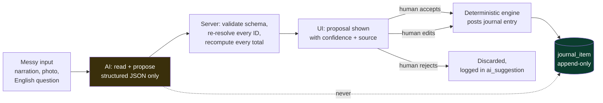

# Where AI Genuinely Makes This Better

> **Read this first.** Nothing in this section is in the problem statement PDF or the organizers' mockup. Every feature here is an **addition**. That is exactly why it has to be defended harder than anything else in the build. An AI feature that does not earn its place does not sit at zero — it sits at *negative*, because it eats hours you needed for the ledger and it tells an Odoo judge you did not know what the hard part was.

Before anything else, four accounting words you will need in this section, in plain English:

| Word | What it means here |
| --- | --- |
| **Ledger** | The one table where all money movement lives: `journal_item`. Every report in the app is a sum over this table. |
| **Journal entry** | One balanced record made of two or more ledger lines. Money always comes *from* somewhere and goes *to* somewhere, so the two sides must be equal. |
| **Debit / Credit** | The two sides of a journal entry. Total debits must equal total credits, to the paisa, or the entry is invalid. |
| **Draft vs Posted** | A **draft** document is a piece of paper — it touches nothing. A **posted** document has hit the ledger and can never be edited or deleted, only reversed. |
| **Reconciliation** | Matching a payment that arrived in your bank account to the invoice it was paying. |
| **Analytic account** | The mockup calls this "Budget Analytics". It is a project tag — "Project 1", "Showroom-West" — that you stick on a line so you can later ask "how much did Project 1 cost me?" |

---

## 1. The filter: three tests, and one rule that overrides all of them

An AI feature earns a place in this build **only if it passes all three tests**:

1. **The hard-without-AI test.** The problem must be genuinely hard to solve with ordinary code. Fuzzy human-written text, a photo of a piece of paper, an English sentence. If a `switch` statement or a `GROUP BY` solves it, a `switch` statement should solve it — it is faster, free, and correct every time.
2. **The verifiable-result test.** The user must be able to check the answer in a few seconds against something the system already knows for certain. "Is this the right invoice?" — checkable. "Is my business healthy?" — not checkable, therefore not shippable.
3. **The safe-degradation test.** When the model is wrong, slow, rate-limited, or the conference wifi dies at 2 p.m. on demo day, the app must still work. Losing the AI must cost the user *typing*, never *function*.

And one rule that sits above all three and is non-negotiable in this problem:

> ### **AI never writes to the ledger.**
> AI produces a **proposal**. A human **accepts** it. The deterministic posting engine — the same one that handles a hand-typed invoice — does the **posting**. There is no code path in which a model's output becomes a debit or a credit without a human keystroke in between.

This is not caution for its own sake. It is *correct accounting* — in a real book of accounts every entry must be attributable to a person who authorised it, which is why "posted by" is a field and "posted by GPT" is not a thing an auditor accepts. And it is also the single most useful sentence you can say to a judge, because it is the opposite of what they will have heard nine times already that day.



### 1.1 Ideas that fail the filter — reject these out loud

Naming what you refused is a differentiator. Most teams cannot tell you why they *didn't* build something.

| Rejected idea | Which test it fails | Why it is actually dangerous here |
| --- | --- | --- |
| **A floating "Ask our accounting assistant" chat bubble** | 2 and 3 | Unverifiable free text over financial data. A judge who has already seen five of these will assume the rest of your app is equally superficial. It converts your strongest asset — a real double-entry engine — into "another team that bolted a chatbot on". |
| **Letting the model pick the debit and credit accounts for a journal entry** | 1, 2, and the overriding rule | This is the most tempting bad idea in this entire problem statement, and it is fatal. Choosing accounts is a *deterministic function of configuration* — Journal default account, product category, contact type. It is literally the one hard engine the whole submission is judged on. Hand it to a model and (a) you have deleted your own centrepiece, (b) the same invoice can post two different ways on two different days, and (c) the moment a judge sees a model choosing debits, **every number in your app becomes untrusted**. Nothing you show afterwards recovers. |
| **"Generate a summary of my financial performance"** with the model reading the raw tables | 2 | The model will invent a rupee figure. One invented figure on a Balance Sheet is a total loss of credibility. (The *safe* version of this idea is feature **AI-4** below, where the numbers are computed first and the model is only allowed to write the sentence around them.) |
| **Text-to-SQL over the ledger** | 2 and 3 | Two separate failures. First, injection and destructive statements. Second and worse: a model asked for "total income" will very plausibly write `SELECT SUM(total) FROM customer_invoice` — which is *precisely the fake* that 70–80% of teams will ship and that the judge is hunting for. You would have automated your own failure mode. The safe version is **AI-2** below. |
| **"AI fraud detection"** over the seed data | 1 and 2 | You will have roughly 40 documents. A z-score over n=8 is not statistics, it is decoration. Any judge who asks "what's the sample size?" ends the conversation. |
| **Cash-flow forecasting** | 2 | Two quarters of seed data, no ground truth, and no way to check the prediction inside a five-minute demo. |
| **Voice input for invoices** | 1 and 3 | A hackathon hall is loud, the mic permission dialog will fire on the projector, and nothing about it is an accounting problem. Pure gimmick. |
| **AI-written product descriptions / auto-categorising products** | 1 | Real, but not an *accounting* problem. Costs you an hour and earns nothing on this rubric. |

**What to say when a judge asks "why didn't you add a chatbot?"**

> "We had a rule: AI only where the input is genuinely messy and the output is checkable in two seconds. A chatbot over accounting data fails the second half — you can't verify a paragraph. So we used the model in four places where it reads something messy and *proposes* something a human can confirm with one click, and nowhere else. In particular the model never picks a debit or a credit. That's a table-driven rule engine, and it has to be, or the books aren't reproducible."

---

## 2. The five features that pass

Read them in priority order. **Section 2.6 gives the build order and the hard gate** — do not start any of these until the ledger spine is green.

---

### AI-1 — Bank narration understanding (a *fallback ranker* inside the reconciliation engine)

**Build cost: ~70 minutes, on top of the deterministic matcher you are building anyway.**

#### The real problem

Urban Furniture's bank sends a statement. The customer paid, but the bank line does not say "INV/2026/0007 from Nimesh Pathak". It says things like this — these are the shapes real Indian bank narrations actually take:

```
NEFT/N PATHAK/INV-2026-0007
UPI/CR/16992/AZURE FURN/PAYMENT
IMPS-P2A-509212874-RAHUL SHARMA-BILL PAYMENT
NEFT CR-HDFC0000123-URBAN FURNITURE PVT LTD-NPATHAK-ABC 26 001
CHQ 004512 CLG
BY CASH DEP CDM 4471
RTGS UTIB0000456 AZUREFURNITUREPVTL 6000
```

Line 1 is easy — the reference is right there. Line 4 mangles the free-text `invoice_reference` (`ABC-26-001`, which the mockup mandates as a separate field from the auto-generated invoice number) into `ABC 26 001`. Line 3 hides the partner in the middle of an IMPS envelope. Line 5 and 6 have no partner and no reference at all — only an amount and a date. Regex handles the first; nothing but reading handles the fourth.

#### Deterministic first — and this ordering *is* the feature

The matcher is a scoring function over open (unpaid) invoices and bills. **Four of its five signals are pure functions with no model involved:**

| Stage | Signal | How | Weight |
| --- | --- | --- | --- |
| A | `ref_exact` | Regex for `INV/\d{4}/\d{4}`, `BILL/\d{4}/\d{4}`, `PO\d{4}`, plus a normalised match against `invoice_reference` (strip everything non-alphanumeric, uppercase, compare) | 50 |
| B | `amount_exact` | Narration amount == invoice **residual** (amount still unpaid) to the paisa | 30 |
| C | `amount_tolerance` | Within ±₹1 (bank rounding) or ±2% | 12 |
| D | `partner_similarity` | Trigram / Jaro-Winkler over narration tokens vs every contact name, plus a squashed-name pass (`AZUREFURNITUREPVTL` vs `Azure Furniture`) | 0–20 |
| E | `date_proximity` | `max(0, 10 - days_between(statement_date, invoice_date)/3)` | 0–10 |

Rows scoring ≥ 85 auto-clear. Rows scoring 45–85 are shown with ranked suggestions. Below 45 → unmatched.

**AI is stage F, and it only runs on the leftovers.** For rows that came out of A–E below the auto-clear threshold, one batched call reads the narrations and returns a *reading* — not a match:

```ts
// lib/ai/narration.ts
const NarrationReading = z.object({
  line_index: z.number(),
  partner_guess: z.string().nullable(),      // a NAME string, never an id
  reference_guess: z.string().nullable(),
  direction: z.enum(["credit", "debit", "unknown"]),
  instrument: z.enum(["NEFT", "RTGS", "IMPS", "UPI", "CHEQUE", "CASH", "OTHER"]),
  confidence: z.number().min(0).max(1),
});

const res = await client.messages.parse({
  model: "claude-opus-5",
  max_tokens: 2000,
  output_config: {
    effort: "low",                                    // extraction, not reasoning
    format: zodOutputFormat(z.object({ readings: z.array(NarrationReading) })),
  },
  system:
    "You read Indian bank statement narrations. You extract who the counterparty is " +
    "and any document reference. You NEVER decide which invoice a payment belongs to. " +
    "If a field is not present in the text, return null. Do not guess a partner that " +
    "is not in the supplied list.",
  messages: [{ role: "user", content: JSON.stringify({
      narrations: unmatched.map((r, i) => ({ line_index: i, text: r.narration })),
      known_partners: contacts.map(c => c.name),        // ~12 names
      reference_formats: ["INV/2026/0001", "BILL/2026/0001", "ABC-26-001"],
  })}],
});
```

Then — and this is the part to point at — **the reading is fed back into the same deterministic scorer as extra tokens.** `partner_guess` re-runs stage D. `reference_guess` re-runs stage A at a reduced weight (35 instead of 50, because it is inferred rather than literal). The model's output is *normalised into the existing algorithm*. It cannot bypass it, and it cannot override a match the deterministic stages were already certain about.

#### Why deterministic-first is the right design (say this to a judge)

- **Most rows never touch the model.** On a realistic 10-line statement, 6–7 clear on stages A–E alone: zero latency, zero cost, zero variance.
- **The model can never overturn certainty.** A row with an exact reference and an exact amount is already at 80 before stage F runs. Nothing the model says moves it.
- **Reproducibility.** Accounting demands that the same statement produce the same result twice. The deterministic core guarantees that for the majority of rows; the AI-assisted tail is logged with its input hash so you can always show what it saw.
- **It fails to a smaller feature, not a broken one.** Turn AI off and you lose the tail of hard rows. You do not lose reconciliation.

#### How the user verifies and corrects

Every statement row shows a **chip row** of the signals that produced its score — this is the whole UI trick:

```
₹47,200  NEFT/N PATHAK/INV-2026-0007      [ref exact] [amt ±0] [name 0.91]           → INV/2026/0007  99%  ✓auto
₹16,992  RTGS UTIB0000456 AZUREFURNIT...  [amt ±0] [name 0.74] [AI: Azure Furniture] → BILL/2026/0003 78%  [Accept] [Pick another]
₹ 6,000  CHQ 004512 CLG                   [amt ±0] [date 8d]                          → 3 candidates      41%  [Choose…]
```

The AI chip is rendered in a **different colour from the deterministic chips**, and there is a legend. One sentence to the judge, while pointing:

> "The blue chips are computed — regex, exact amount, string similarity. The grey chip is the only thing the model touched, and all it did was read a name out of the narration. It then went back through the same scorer as every other signal. Watch —" *(toggle AI off)* — "the six blue rows are identical. We lose two of the hard ones."

#### Offline fallback

`AI_MODE=off` → stage F is skipped entirely, thresholds unchanged, chip row shows deterministic signals only. `AI_MODE=replay` → served from the fixture cache (section 3.2). Both are one env var.

#### Cost and latency

| | |
| --- | --- |
| Tokens per 10-line statement | ~1,200 in / ~600 out (one batched call, not ten) |
| Cost | 1,200 × $5/1M + 600 × $25/1M = **$0.021 ≈ ₹1.85** |
| Latency, live | 3–6 s — run inside the existing "Analyze statement" spinner, and only over the unmatched rows so the auto-matched ones paint immediately |
| Latency, replay | < 100 ms |

---

### AI-2 — Natural-language query over the ledger, via a whitelisted query builder

**Build cost: ~75 minutes.**

#### The real problem

An accountant's actual questions do not map onto the menu. "How much does Nimesh owe me right now?" requires opening Partner Ledger, filtering to one contact, and reading a running balance. "Show me expenses above ₹50,000 last quarter" requires a filtered journal-item search that the mockup does not draw a screen for. And a judge *will* walk up and type something into a search box to see what happens.

#### How it works — the whitelisted-query-builder pattern

**The model does not write SQL. The model does not see SQL. The model fills in one of seven typed forms.**

You define the seven report intents your app already knows how to render. The model's only job is to choose one and fill its parameters, using a strict tool schema:

```ts
// lib/ai/queryIntent.ts — the model's ENTIRE output surface
const Intent = z.discriminatedUnion("intent", [
  z.object({ intent: z.literal("partner_balance"),
             partner_name: z.string(), as_of: z.string().nullable() }),
  z.object({ intent: z.literal("account_ledger"),
             account_type: z.enum(["asset","liability","bank","capital","cash",
                                   "income","expense","other_expense"]),
             date_from: z.string().nullable(), date_to: z.string().nullable() }),
  z.object({ intent: z.literal("pnl_period"),
             date_from: z.string(), date_to: z.string() }),
  z.object({ intent: z.literal("balance_sheet_asof"),
             as_of: z.string() }),
  z.object({ intent: z.literal("budget_variance"),
             analytic_name: z.string().nullable(), budget_name: z.string().nullable() }),
  z.object({ intent: z.literal("document_search"),
             doc_type: z.enum(["invoice","bill","payment","journal_entry","po","so"]),
             partner_name: z.string().nullable(),
             min_amount: z.number().nullable(), max_amount: z.number().nullable(),
             date_from: z.string().nullable(), date_to: z.string().nullable(),
             state: z.enum(["draft","posted","paid","partial","not_paid"]).nullable() }),
  z.object({ intent: z.literal("aging"), side: z.enum(["receivable","payable"]) }),
]);
```

Server side, each intent maps to **one pre-written parameterized query that you wrote and tested**. `partner_name` never becomes an id inside the model — the server resolves it against the `contact` table with a fuzzy match; if two contacts match, the UI asks the user to pick rather than guessing. `limit` is not a model parameter at all; it is hardcoded to 200 server-side.

#### Why this pattern is the right one — and why it wins points

Three reasons, and all three are worth saying out loud:

1. **There is no injection surface, structurally.** Not "we sanitise the SQL" — there is no SQL to sanitise. The model's output can only ever be one of seven JSON shapes with typed, enumerated, range-checked fields. The worst a malicious prompt can do is choose the wrong report.
2. **The aggregation semantics stay correct.** This is the subtle one, and it is the reason a judge should care. A Balance Sheet is a *cumulative* sum from the beginning of time up to a date; a P&L is a sum *between* two dates over income and expense accounts only. Two completely different aggregations over the same table. A model writing SQL would very reasonably reach for `SELECT SUM(total) FROM customer_invoice` — reproducing the exact fake this whole submission is designed to avoid. With intents, `balance_sheet_asof` runs *your* cumulative query and `pnl_period` runs *your* between-dates query. The model cannot get the accounting wrong because the model does not do the accounting.
3. **The intents are read-only by construction.** There is no `create_*`, no `post_*`, no `delete_*` in the union. Not disabled — *absent*. There is no string a user can type that becomes a write.

#### How the user verifies and corrects

The answer is **not text**. The answer is the same report component the menu already opens — fully clickable, fully drill-downable. Above it, the resolved intent is printed as an editable chip row:

```
"how much does nimesh owe me"
  → intent: partner_balance · partner: Nimesh Pathak · as_of: 05-Sep-2026     [Open as report]
```

If the model resolved something wrong, the user sees exactly *what* was wrong and fixes the chip rather than rephrasing the sentence into a void.

#### Offline fallback — a three-tier ladder

1. **Model** (live or replay).
2. **Keyword router**, pure code, ~40 lines: the string contains `owe|balance|due` plus a token that fuzzy-matches a contact name → `partner_balance`. Contains `profit|p&l|income` → `pnl_period` over the current fiscal year. Contains `balance sheet` → `balance_sheet_asof` today. Contains `budget` → `budget_variance`.
3. **Plain full-text search** over document numbers, references and partner names.

The search box never returns "sorry, AI unavailable". It returns something useful at every tier.

#### Demo moment

Hand the laptop to the judge. Ask them to type a question. Then, whatever they type, point at the intent chip:

> "That's everything the model produced — one intent name and three typed parameters. It never saw the database and it never wrote a query. There is no write intent in the schema, so there's no sentence you can type that changes a rupee."

Then type `delete all journal entries` yourself and let it come back with *"I can only look things up — try asking for a balance, a report or a document."*

#### Cost and latency

~900 in / ~150 out at `effort: "low"` → `$0.008 ≈ ₹0.72` per question, 2–4 s live, < 100 ms replayed.

---

### AI-3 — Vendor bill from a photo or PDF, into a **draft** bill

**Build cost: ~90 minutes. Requires the Vendor Bill form to be finished first.**

#### The real problem

This is the most genuinely useful feature in the list, and the easiest for a non-technical person in the room to understand. Azure Furniture emails a PDF bill, or the delivery person hands over paper. Somebody has to type the vendor, the bill reference `ABC-26-001`, the bill date, the due date, and six line items with quantities and unit prices. That is the actual daily cost of running a small furniture business, and it is roughly four minutes per bill.

#### How it works

Upload → the file goes in as a `document` (PDF) or `image` (photo) content block → `messages.parse` against a Zod schema shaped **exactly like your `vendor_bill` + `bill_line` tables**:

```ts
const ExtractedBill = z.object({
  vendor_name:     z.string().nullable(),
  bill_reference:  z.string().nullable(),   // the free-text ref, e.g. "ABC-26-001"
  bill_date:       z.string().nullable(),   // ISO
  due_date:        z.string().nullable(),
  currency:        z.string().nullable(),
  lines: z.array(z.object({
    description: z.string(),
    qty:         z.number().nullable(),
    unit_price:  z.number().nullable(),
    source_text: z.string(),                // the raw text it read this line from
  })),
  unreadable_fields: z.array(z.string()),   // names of fields it could not read
});
```

Three rules baked into the system prompt and enforced in code:

- **Return `null`, never a guess.** A bill photographed at an angle with a crease through the date must come back with `bill_date: null` and `"bill_date"` in `unreadable_fields`.
- **`source_text` on every line.** So the UI can show, on hover, the literal characters the model read that line from. This is what makes verification take two seconds instead of two minutes.
- **The model is never asked for a total.** Not `line_total`, not `bill_total`, not tax. See below.

#### Everything downstream of the model is deterministic

| Step | Who does it |
| --- | --- |
| Vendor name → `contact_id` | **Code.** Fuzzy match against `contact`. No match → the field renders as *"Create contact 'Azure Furniture'?"* with a button. The model never creates master data. |
| Line description → `product_id` | **Code.** Fuzzy match against `product`. No match → product left blank, line flagged amber. |
| Chart of Accounts on each line | **Code, from the mockup's own rule** — *"Purchase account to be set by default"*. The model has no say. |
| Budget Analytics tag | **Code** (history lookup, see AI-5), or blank. |
| `line_total` | **Code.** `qty × unit_price`, recomputed server-side. |
| Bill total, amount due, status badge | **Code.** Sum of lines; `Amount Due = Total − Amount Paid`; badge from the mockup's stated rule. |

> **The arithmetic policy, in one line: discard every number the model computed and keep only the numbers it *read*.** Quantity and unit price come from the document; every product, sum and total is recomputed by your code. That single policy eliminates the entire class of "the AI got the maths wrong", and it is a very good sentence to say to a judge.

#### DRAFT. Always. Without exception.

The extracted bill lands in `state = 'draft'` with a banner:

> ⚠ **Imported from `azure_bill_sep.pdf` by AI — 2 fields could not be read. Review every line before confirming.**

`Confirm` is the only path that creates a journal entry, and `Confirm` runs the **identical** server-side validation as a hand-typed bill: totals recomputed, journal entry assembled by the posting engine from configuration, and the entry rejected at the database constraint if debits ≠ credits. There is no "AI import" code path into `journal_item`. There is one posting path, and it does not know or care where the draft came from.

#### How the user verifies

Split screen. Uploaded document on the left with the page rendered; the draft bill form on the right. Each extracted field carries a small confidence dot and shows its `source_text` on hover. Fields the model returned as `null` are highlighted amber, and the cursor auto-focuses the first one. Accepting is not a button — it is simply confirming the bill, the same as any other bill.

#### Offline fallback

The upload button still works with `AI_MODE=off`: it creates a blank draft bill with the file attached to it, and you type. Same screen, same flow, more keystrokes. For the demo, one extraction is pre-cached as a fixture (section 3.2), so a dead wifi produces a byte-identical result in under 100 ms.

#### Demo moment

This is the crowd-pleaser, but keep it to 25 seconds and *do not* let it displace the reconciliation beat. Drop the PDF, watch the form fill, hover one line to reveal the source text, fix the one amber date field, hit Confirm, and open the resulting journal entry:

> "The model read a piece of paper. It didn't calculate anything and it didn't post anything. That journal entry was built by the same rule engine as every other bill in the system."

#### Cost and latency

A one-page PDF bill ≈ 1,600 in / ~700 out → `$0.026 ≈ ₹2.30`. Latency 5–9 s live (show a progress state over the form skeleton), < 100 ms replayed. A phone photo runs larger — budget ~2,500 input tokens for a full-resolution image, so **downscale to ~1,200px on the longest edge before upload**; it costs less, runs faster, and does not measurably hurt extraction of printed text.

---

### AI-4 — Anomaly *explanation* over deterministically computed statistics

**Build cost: ~50 minutes. The cheapest wow in this section.**

#### The real problem

Your Budget Report already computes, per the mockup's own verbatim formulas, `Achieved Amount`, `Achieved % = (Achieved / Committed) × 100`, and `Amount To Achieve = Committed − Achieved`. Your dashboard already shows Achieved / Budget / Committed counters. All correct, all useless to a business owner who wants to know *what to do about it*. A number is not an insight.

#### The split — and it is the whole design

**A pure function computes the statistics. The model writes the sentence. That is all it does.**

```ts
// lib/insights/computeSignals.ts — NO AI ANYWHERE IN THIS FILE
type Signal =
  | { kind: "budget_pace"; analytic: string; pct_elapsed: number; pct_consumed: number;
      committed: number; achieved: number; projected_year_end: number; overrun: number }
  | { kind: "receivables_concentration"; total_debtors: number; top_partner: string;
      top_amount: number; share_pct: number }
  | { kind: "aging_shift"; bucket: "1-30"|"31-60"|"61-90"|"90+"; amount: number; delta_vs_prior: number }
  | { kind: "margin_move"; income: number; expense: number; margin_pct: number; prior_margin_pct: number }
  | { kind: "outlier_line"; product: string; unit_price: number; median_unit_price: number;
      multiple: number; sample_size: number; document: string }
  | { kind: "cash_cover"; liquid: number; payables_due_30d: number; cover_ratio: number };
```

Real examples the function will emit from realistic seed data:

- `budget_pace`: *Project 1 (Expense)* — 68% of the period elapsed, 81% of ₹2,00,000 consumed, straight-line projection ₹2,38,000, overrun ₹38,000.
- `receivables_concentration`: 61% of the ₹4,72,500 Debtors balance sits with one contact, Nimesh Pathak.
- `outlier_line`: Wooden Table billed at ₹6,800/unit against a trailing median of ₹2,000 — 3.4×, on BILL/2026/0009.
- `cash_cover`: Bank + Cash = ₹1,20,000 against ₹2,10,000 of payables due within 30 days — 0.57× cover.

**Honesty guard, and it matters:** `outlier_line` and `margin_move` are **not emitted when the sample is smaller than 5 prior lines / one prior quarter.** No statistic on n=3. If a judge asks about sample size, the correct answer is "we suppress it below five", not a shrug.

#### What the model does, and the guard that makes it safe

One small call: the `Signal[]` JSON goes in, 2–3 short sentences come out, each with a suggested action. The system prompt says: *use only numbers present in the input; do not compute anything; do not add context you were not given.*

Then — and this is the part that makes the feature *structurally* safe rather than merely well-prompted — a **12-line post-generation guard**:

```ts
// Every number the model wrote must already exist in the facts we handed it.
const allowed = new Set(collectNumbers(signals).map(fmt));   // "200000", "2,00,000", "81", "68", "38000", …
const sentences = text.split(/(?<=[.!?])\s+/);
const safe = sentences.filter(s =>
  [...s.matchAll(/[\d,]+(?:\.\d+)?/g)].every(m => allowed.has(normalise(m[0])))
);
// A sentence containing an invented figure is dropped and the raw fact is rendered instead.
```

A hallucinated rupee figure cannot reach the screen. Not "is unlikely to" — cannot. Say that to a judge and then show them the twelve lines.

#### How the user verifies and corrects

Each insight sentence is a **link into the report that produced it**. "Project 1 is pacing 13 points ahead of schedule" → clicks straight through to that budget line's Achieved Amount drill-down (which the mockup already requires: *"Clicking on the Achieved Amount Button open list view of all Invoices/Bills having same analytical for the budget period"*). The insight is never a dead end; it is a shortcut into a number you can add up yourself.

#### Offline fallback

With AI off, the same `Signal[]` renders through a template string:

```
{analytic} is {pct_consumed}% consumed with {pct_elapsed}% of the period elapsed
(₹{achieved} of ₹{committed}). At this rate you will finish at ₹{projected_year_end}.
```

Stiffer English. Identical information. **This feature never disappears** — which makes it the safest thing to put on the dashboard, the screen most likely to be on-projector when someone walks up.

#### Cost and latency

~700 in / ~250 out → `$0.010 ≈ ₹0.87` per refresh. Cache the generated text against a hash of the signal payload; regenerate only when a new document posts. In a five-minute demo it fires twice.

---

### AI-5 — Suggesting the ledger account and analytic tag from history

**Build cost: ~45 minutes. Build only if you are ahead of schedule.**

#### The real problem

The mockup requires a **Chart of Accounts** and a **Budget Analytics** tag on *every* line of a PO, Bill, SO and Invoice. The account has a default rule ("Purchase account by default", "Sales account by default"), so it is handled. The **analytic tag has no default**, and it is the field that decides whether the Budget Report is right or garbage. Across 40 documents, this is where a real operator makes mistakes and where the whole budget feature quietly dies.

#### Deterministic first, again

Most of this needs no model at all — it needs a `GROUP BY`:

```sql
SELECT analytic_id, COUNT(*) AS n
FROM   bill_line
WHERE  product_id = $1 AND analytic_id IS NOT NULL
GROUP  BY analytic_id
ORDER  BY n DESC;
```

If the product has ≥ 3 prior lines and the top analytic holds ≥ 70% share → suggest it, with the share as the confidence, badge it `history 8/9`. Free, instant, reproducible, and it covers the large majority of lines once you have seeded two quarters of history.

#### AI only for cold start

A product with no history, or a free-text description line. Then one tiny call with a **strict tool schema whose `enum` values are pulled from the database at call time**:

```ts
tools: [{
  name: "suggest_line_coding",
  strict: true,
  input_schema: {
    type: "object",
    properties: {
      analytic_name: { type: "string", enum: analyticNames },  // ["Project 1", "Showroom-West", …]
      account_name:  { type: "string", enum: accountNames },   // the 8 seeded CoA accounts
      confidence:    { type: "number" },
      reason:        { type: "string" },
    },
    required: ["analytic_name","account_name","confidence","reason"],
    additionalProperties: false,
  },
}]
```

Because the enums are generated from live rows, **the model cannot return a name that does not exist**. There is no resolution step that can fail and no "unknown account" branch to write.

#### How the user verifies and corrects

A ghost value in the cell, greyed out, with a source badge and a hint:

```
Budget Analytics:  Project 1 ⌁  [history 8/9]   Tab to accept
Budget Analytics:  Showroom-West ⌁  [AI 0.72]   Tab to accept
```

Tab accepts. Typing overrides. Clicking away discards. **Nothing is ever written to a line without a keystroke.** This pairs directly with the keyboard-first line grid (see the UX section) — the whole point is that accepting a suggestion is cheaper than typing but not cheaper than *thinking*.

#### Offline fallback

History-only. Which is already the majority path — so with AI off, nothing visible breaks. This is the feature that degrades most gracefully of the five, and that is precisely why it is last in priority: it also *impresses* the least.

#### Cost and latency

~500 in / ~80 out → `$0.0045 ≈ ₹0.40`, and it only fires on cold-start lines — perhaps 3 times in an entire demo.

---

### 2.6 Build order, time budget, and the hard gate

> ### 🚧 The gate
> **Do not write one line of AI code until all of the following are green:** the posting engine posts balanced entries from configuration; the Balance Sheet actually balances; the P&L and Budget Report derive from `journal_item`; partial payments compute residuals correctly. If those are not done by **T−8 hours, ship zero AI features.** A submission with a correct ledger and no AI beats a submission with a chatbot and a Balance Sheet that doesn't tie, by a distance that is not close.

| Order | Feature | Time | Why here |
| --- | --- | --- | --- |
| 1 | **AI-1** narration reading | 70 min | Rides on the reconciliation engine you are building anyway; marginal cost is small and it strengthens the single strongest differentiator in the build. |
| 2 | **AI-4** insight sentences | 50 min | Cheapest. Always-on. Degrades to templates, so it can sit on the dashboard permanently with zero demo risk. |
| 3 | **AI-2** natural-language query | 75 min | The one a judge will personally touch, and the one with the best "safe engineering" story. |
| 4 | **AI-3** bill extraction | 90 min | Highest real product value and the biggest reaction, but it is the most build time and it depends on a finished Vendor Bill form. |
| 5 | **AI-5** coding suggestions | 45 min | Quiet quality. Skip without guilt. |

**Total if you build all five: 5 h 30 m.** That is too much of a 19-hour budget. Realistic plan: **build 1 and 2 (2 hours)**. Add 3 if you are ahead at T−8. Treat 4 and 5 as stretch.

---

## 3. Cross-cutting engineering

### 3.1 One door in and out

Every model call goes through `lib/ai/client.ts`. No React component, no route handler, no service imports `@anthropic-ai/sdk` directly. Five exported functions, and every one returns the same discriminated result:

```ts
type AiResult<T> = { ok: true; data: T; cached: boolean; ms: number }
                 | { ok: false; reason: "off" | "timeout" | "rate_limit" | "invalid" | "error" };
```

Every call carries:
- a **12-second `AbortController` timeout** (an AI feature that hangs is worse than one that is absent),
- **one retry** on 429 / 5xx, then give up,
- a hard `ok: false` → the caller takes its fallback path. There is no `throw` that reaches a user.

`AI_MODE` is an env var with three values: `live`, `replay`, `off`.

### 3.2 The replay cache — your demo insurance

Every call hashes its input payload (`sha256` of the canonical JSON) and writes the response to `fixtures/ai/<hash>.json`.

- `AI_MODE=live` — call the API, write the fixture.
- `AI_MODE=replay` — a hit returns instantly; **a miss returns `ok:false`** and the deterministic fallback takes over.
- `AI_MODE=off` — never call, always fall back.

Rehearse the demo once on `live`. Commit the fixtures. **Demo on `replay`.** Result: zero network calls on stage, sub-100 ms responses, and byte-identical output every rehearsal and on the day.

And say it out loud when you demo — do not hide it, because hidden it looks like cheating and stated it looks like engineering maturity:

> "We're running the AI in replay mode — every one of these responses was generated live during rehearsal, hashed by input, and cached. Conference wifi is not something we're willing to bet a demo on. Here's live mode —" *(flip the toggle, run one statement line)* — "same result, four seconds slower."

### 3.3 The `ai_suggestion` table — the audit trail *and* the proof

```sql
CREATE TABLE ai_suggestion (
  id           uuid PRIMARY KEY,
  kind         text NOT NULL,        -- 'narration' | 'query_intent' | 'bill_extract'
                                     -- | 'insight' | 'line_coding'
  input_hash   text NOT NULL,
  model        text NOT NULL,        -- 'claude-opus-5'
  output_json  jsonb NOT NULL,
  confidence   numeric,
  status       text NOT NULL,        -- 'proposed' | 'accepted' | 'edited' | 'rejected'
  target_table text,                 -- 'vendor_bill' | 'bill_line' | 'payment' | NULL
  target_id    uuid,
  accepted_by  uuid REFERENCES app_user(id),
  accepted_at  timestamptz,
  created_at   timestamptz NOT NULL DEFAULT now()
);
```

Two payoffs, both worth real points:

1. A judge can ask *"show me what the AI actually suggested versus what got posted"* — and you have the row, including `status='edited'` and a diff when a human changed something. Nobody else in the room will be able to answer that question.
2. It is the literal, structural proof of the overriding rule. **AI output and ledger writes are different objects in different tables.** `journal_item` has no column an AI path writes. Point at both schemas side by side.

### 3.4 Make the separation physical, not just a convention

If you are on Postgres, this is a five-minute change with an unanswerable demo payoff. Create a second database role:

```sql
CREATE ROLE app_ai LOGIN PASSWORD '…';
GRANT SELECT ON ALL TABLES IN SCHEMA public TO app_ai;
GRANT INSERT ON ai_suggestion TO app_ai;
-- and nothing else, ever
```

`lib/ai/*` connects as `app_ai`. Route handlers that create draft bills or post journal entries connect as the normal application role, *after* schema validation and arithmetic recomputation. Then, on stage, open a terminal and try to insert a `journal_item` as `app_ai`:

```
ERROR:  permission denied for table journal_item
```

> "That's not a policy in our code review. The AI code path connects as a database role that has no write permission on the ledger. It physically cannot post an entry."

Fifteen seconds. It is the AI equivalent of the tamper-detection self-attack, and it lands for exactly the same reason: you attacked your own build and your own build won.

### 3.5 Send the minimum

Do not put the ledger in a prompt. Ever.

| Feature | What actually goes in the prompt |
| --- | --- |
| AI-1 | The unmatched narration strings + the ~12 contact names + the reference format examples. Not the invoices. |
| AI-2 | The question + the list of intent names + the contact and analytic name lists. Not any data. |
| AI-3 | One document/image + the field schema. Not the vendor list (resolution is server-side). |
| AI-4 | The computed `Signal[]` JSON. Not the journal items behind it. |
| AI-5 | One line description + two name lists. |

Every prompt in this build is under ~2,000 tokens. **This means prompt caching will not help you** — the minimum cacheable prefix is several hundred to a few thousand tokens depending on model, and you are below it. Do not build a caching layer; it is a false optimization at this scale and an hour you do not have. The replay cache (3.2) is the caching that matters here.

### 3.6 Cost, in real money

All figures at Claude Opus 5 pricing: **$5 per million input tokens, $25 per million output tokens.** Rupee figures at ≈ ₹88/$.

| Feature | Tokens in / out | $ per call | ₹ per call | Calls in one 5-min demo | Live latency |
| --- | --- | --- | --- | --- | --- |
| AI-1 narration (10-line statement, batched) | 1,200 / 600 | $0.021 | ₹1.85 | 1 | 3–6 s |
| AI-2 NL query | 900 / 150 | $0.008 | ₹0.72 | 3 | 2–4 s |
| AI-3 bill extraction (1-page PDF) | 1,600 / 700 | $0.026 | ₹2.30 | 1 | 5–9 s |
| AI-4 insights | 700 / 250 | $0.010 | ₹0.87 | 2 | 2–4 s |
| AI-5 line coding | 500 / 80 | $0.0045 | ₹0.40 | 3 | 1–2 s |
| **One full demo run** | — | **≈ $0.11** | **≈ ₹9.60** | 10 | — |

- **40 rehearsal runs: ≈ $4.40 (₹390).**
- **~300 development calls while building and debugging: ≈ $5.**
- **Total AI spend for the entire hackathon: under $12 / ~₹1,000.** Cost is not a constraint here; latency and reliability are, and the replay cache solves both.

### 3.7 Which features are safe when the wifi dies

| Feature | `AI_MODE=replay` (fixtures committed) | `AI_MODE=off` (no fixtures) |
| --- | --- | --- |
| AI-1 narration | ✅ Identical output, < 100 ms | ⚠️ 6 of 8 rows still auto-match; the 2 hard ones need a manual pick |
| AI-2 NL query | ✅ Identical for rehearsed questions; a novel question falls to the keyword router | ⚠️ Keyword router + full-text search, still answers most demo questions |
| AI-3 bill extraction | ✅ The rehearsed PDF is identical | ❌ Blank draft with the file attached — do not demo this path |
| AI-4 insights | ✅ Identical | ✅ Templated sentences, same numbers, same links |
| AI-5 line coding | ✅ Identical | ✅ History suggestions still fire (the majority path) |

**Demo rule: run on `replay`, always.** The only feature you should not attempt with a completely cold cache is AI-3.

---

## 4. What a judge will try, and what happens

Assume an Odoo engineer will spend sixty seconds specifically trying to break the AI. Have these answers ready — and better, have them *demonstrable*.

| What the judge does | What actually happens | The one-line answer |
| --- | --- | --- |
| Types *"delete all journal entries"* into the search box | Intent router has no write intent; returns "I can only look things up." | "There's no write intent in the schema. Not disabled — absent." |
| Asks *"can the AI post an entry?"* | You open a terminal and get `permission denied for table journal_item` | "Different database role. It can't." |
| Uploads a blurry or crumpled bill | Half the fields come back `null`, highlighted amber, cursor on the first one; the bill sits in draft | "It returns null instead of guessing. Confirm is the only thing that posts, and Confirm re-runs every validation." |
| Changes an extracted number and then posts | Posted values are the human's; `ai_suggestion.status = 'edited'` with the diff stored | "Here's what it suggested, here's what got posted, here's who changed it." |
| Asks *"is the AI computing your Balance Sheet?"* | Toggle `AI_MODE=off` on stage; every report is unchanged | "Nothing on any report has ever been through a model." |
| Pulls the wifi / your hotspot dies | Replay mode; nothing on stage changes | "We rehearsed offline on purpose." |
| Asks *"what's the sample size on that outlier?"* | The insight only fires at n ≥ 5, and the fact JSON carries `sample_size` | "Five prior lines minimum. Below that we suppress it." |

---

## 5. The words to say — a 40-second AI segment

Do not give AI its own chapter in the demo. Fold it into the reconciliation beat and the dashboard, and spend under a minute on it total. If a judge asks directly, this is the script:

> "We used AI in four places, and we had one rule: it never writes a debit or a credit.
>
> Here — this bank statement." *(Analyze runs.)* "Six of these matched with no model involved at all: exact reference, exact amount, name similarity, date proximity. Pure functions. These two didn't." *(Points.)* "So the model read the narration and told us it thinks this one says Azure Furniture. That guess went back into the *same* scorer as every other signal, at a lower weight because it's inferred. It can't override a match we were already sure about, and it can't clear anything by itself.
>
> Watch." *(Flips `AI_MODE=off`.)* "Six rows identical. We lose the two hard ones and they go to manual. That's the whole downside.
>
> And the posting engine has never seen a model output. Nothing on the Balance Sheet, the P&L or the Budget Report has ever been through an LLM. Every proposal is logged in an `ai_suggestion` table with what a human accepted or changed — and the AI code path connects to Postgres as a role that has no write permission on `journal_item` at all. It's not a convention. It's a grant."

Then stop talking about AI and go back to the ledger. The AI is a supporting act. The reason you win this problem statement is that your books tie.

---

## 6. Summary card

| | AI-1 Narration | AI-2 NL query | AI-3 Bill extract | AI-4 Insights | AI-5 Line coding |
| --- | --- | --- | --- | --- | --- |
| **Build time** | 70 min | 75 min | 90 min | 50 min | 45 min |
| **Priority** | 1 | 3 | 4 | 2 | 5 |
| **Model** | `claude-opus-5` | `claude-opus-5` | `claude-opus-5` | `claude-opus-5` | `claude-opus-5` |
| **Output shape** | Zod structured output | Strict discriminated intent union | Zod structured output | Free text + number guard | Strict tool, DB-derived enums |
| **Deterministic layer under it** | 5-signal scorer | 7 pre-written parameterized queries | Fuzzy resolve + recomputed arithmetic | `computeSignals()` | `GROUP BY` history lookup |
| **Fallback** | Deterministic stages only | Keyword router → full-text | Blank draft + attachment | Templated sentences | History only |
| **Writes to ledger?** | Never | Never (read-only intents) | Never (draft only) | Never (read-only) | Never (keystroke required) |
| **₹ per call** | 1.85 | 0.72 | 2.30 | 0.87 | 0.40 |
| **Safe on `replay`?** | ✅ | ✅ | ✅ | ✅ | ✅ |
| **Safe fully offline?** | ⚠️ partial | ⚠️ partial | ❌ | ✅ | ✅ |
