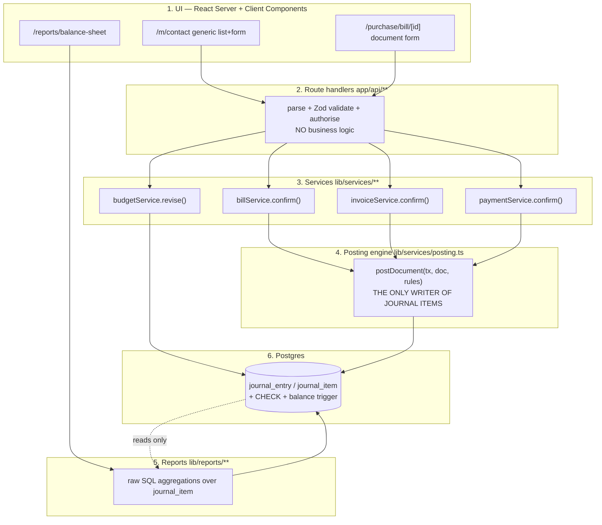

# Tech Stack, Architecture and Optimizations

> **How to read this section.** It answers five questions in order: *what do we build it with*, *how are the files and layers arranged*, *what is the one trick that makes ~38 screens fit into 19 hours*, *how do we make it fast and correct*, and *how do we make sure it is alive in front of the judge*. Every recommendation here is defended, not asserted. Where a judge might challenge a choice, the exact words to answer them are written out.
>
> Cross-references: the **Data Model** section owns the table definitions in detail; the **Posting Engine** section owns the debit/credit rules per document type; the **Demo Script** section owns the five-minute run of show. This section owns the plumbing all three sit on.

---

## 8.1 One-minute vocabulary, so nothing below is a mystery

Four words are used constantly from here on. Learn them once and the rest reads easily.

| Word | What it actually means | Rupee example |
|---|---|---|
| **Debit / Credit** | The two sides of every accounting record. They are not "plus and minus". They are two columns, and for any single transaction the two columns must add up to the same number. | Customer buys a table for ₹6,000 on credit. **Debit** Debtors ₹6,000 (they owe us), **Credit** Sales Income ₹6,000 (we earned it). Total debit 6,000 = total credit 6,000. |
| **Journal Entry** | One transaction. A header: date, journal, reference number. | "INV/2026/0001, posted 05-Sep-2026, Sales journal." |
| **Journal Item** | One *line* inside a journal entry. Exactly one account, and an amount in either the debit column or the credit column. | Line 1: account = Debtors A/c, debit = 6000.00, credit = 0.00. |
| **Ledger** | The full list of every journal item ever written. In our system that is literally one database table, `journal_item`. | 352 rows after seeding. |

**The single architectural sentence of this whole project:**

> Every rupee shown in the Balance Sheet, the Profit & Loss report and the Budget Report is a `SUM()` over rows of the `journal_item` table. Nothing is ever summed from the invoice, bill or payment tables.

That sentence is why most competing teams will lose this problem statement. They will write `SELECT SUM(total) FROM invoice` to build their P&L, and their `journal_entry` table will be a decorative log that nothing reads. An Odoo judge detects that in twenty seconds: they post a manual journal entry (Dr Cash 50,000 / Cr Capital 50,000) and watch the Balance Sheet not move. Our architecture makes that failure structurally impossible. That is what everything below is engineering toward.

---

## 8.2 The recommended stack

| Layer | Choice | Package / version | Why this one |
|---|---|---|---|
| Language | **TypeScript** everywhere | `typescript@5` | One language for UI, API, engine, tests and seed. No context switching at hour 17 when you are tired. |
| Framework | **Next.js, App Router** | `next@15` | You already know it. Server Components let a list page query Postgres directly with zero client fetch code. API routes and UI ship as one deployable. |
| UI | **React + Tailwind CSS + shadcn/ui** | `tailwindcss@3`, shadcn CLI | shadcn gives you Table, Dialog, Select, Badge, Tabs, Toast as source files you own and can restyle. ~15 minutes of setup buys every component the mockup needs: the Paid/Partial/Not Paid badges, the grouped Account Type dropdown, the payment wizard dialog. |
| Database | **PostgreSQL 16** | Neon (cloud) + local Postgres | Non-negotiable. Full defence in §8.3. |
| ORM | **Prisma** | `prisma@5`, `@prisma/client` | Typed models generated from one schema file, so your editor autocompletes every field. `prisma migrate dev` writes real SQL migration files you can hand-edit, which we need because our balance rule is raw SQL. |
| Reports | **Raw SQL via `prisma.$queryRaw`** | built in | Reports are aggregations. Write them as SQL. Do not fight the ORM for the three queries that win the event. |
| Money | **`Decimal(14,2)`** in Postgres, `Prisma.Decimal` in TS | `decimal.js`, ships with Prisma | Never `Float`, never a plain JS `number` for money. §8.3 explains the ₹0.01 disaster. |
| Validation | **Zod** | `zod@3` | One schema per model, reused by the API route *and* the generic form. Free 422 responses with field-level errors. |
| Auth | **Cookie session + `bcryptjs`** | `bcryptjs`, `jose` | The mockup demands three roles (Admin / Accountant / portal User), a unique 6-12 character login id, and a password rule. Hand-rolled cookie sessions are ~60 lines fully under your control. NextAuth Credentials provider is an equally fine choice. Pick one in hour 1 and never revisit. |
| Charts | **Recharts** | `recharts@2` | The Budget Report list view mandates a pie chart *inside a table row* (Achieved vs Balance). A 40×40 `<PieChart>` drops straight into a `<td>`. |
| PDF | **`@react-pdf/renderer`** | `@react-pdf/renderer@3` | "Print → Pdf download on click" is a hard requirement on both P&L and Balance Sheet. This renders React components to a PDF buffer inside a Node route: no headless Chrome, no 300 MB Puppeteer download at hour 14. Fallback if it misbehaves: a `@media print` stylesheet plus `window.print()`, which produces a real PDF through the browser's own dialog. |
| Tests | **Vitest** | `vitest@2` | Starts in under a second. We need a suite that runs in ~12 seconds live on stage (§8.8). |
| AI | **Anthropic SDK, server-side only** | `@anthropic-ai/sdk` | Bank-narration parsing and the plain-English "Explain this entry" text. Key stays in env, never in the browser. Owned by the AI section. |
| Deploy | **Vercel + Neon**, with a complete local mirror | — | §8.9. |

### What we deliberately are NOT using

| Rejected | Why it would cost us the hackathon |
|---|---|
| MongoDB / Mongoose | §8.3. The single most expensive wrong turn available on this problem statement. |
| A separate Express backend | Two deploys, CORS debugging, duplicated types. Next.js route handlers are the same thing without the tax. |
| GraphQL / tRPC | Genuinely nice; worth zero judge points here. Plain route handlers plus Server Components. |
| Redis | Our cache is a `Map` in Node memory with explicit invalidation (§8.7). One less service to fail at 3 a.m. |
| Redux / Zustand | Server Components fetch, Server Actions mutate, `router.refresh()` re-renders. The only real client state in this app is "which dialog is open" and "where is the date slider". |
| Docker Compose with four services | Ninety minutes gone, and you will demo from a laptop anyway. One local Postgres, one `next start`. |
| A microservice for the posting engine | It is one TypeScript file. Putting HTTP in front of it only adds ways for it to fail. |

---

## 8.3 Why Postgres is non-negotiable, and exactly what breaks in MongoDB

**First, the fair part.** Your MERN comfort is preserved. Next.js *is* the R and the N of MERN. With Prisma you write:

```ts
const contacts = await prisma.contact.findMany({ where: { type: 'CUSTOMER' } });
```

That is the same shape as `Contact.find({ type: 'CUSTOMER' })` in Mongoose. You do not learn a new language, you do not hand-write SQL for CRUD, and your editor autocompletes every field name because Prisma generates types from your schema. Real learning cost: about 30 minutes. The only place you write actual SQL is the three report queries — roughly 80 lines total, and those are exactly the lines that win the event.

Now the hard part. Double-entry accounting has four requirements a document database does not serve, and each maps to a moment where you would visibly fail in front of a judge.

### Requirement 1 — All-or-nothing writes across several tables

When a Vendor Bill is confirmed, five things must happen: the bill's status becomes `posted`; the sequence number `BILL/2026/0007` is allocated; a `journal_entry` row is created; two or more `journal_item` rows are created; the sequence counter is incremented. **Either all five happen or none do.** If the process dies after the entry header but before the items, you now own a ledger containing a half-written transaction, and every report is wrong forever — silently.

Postgres:

```ts
await prisma.$transaction(async (tx) => {
  const number = await allocateSequence(tx, 'BILL', 2026);      // SELECT ... FOR UPDATE
  const entry  = await tx.journalEntry.create({ data: { ... } });
  await tx.journalItem.createMany({ data: lines });
  await tx.vendorBill.update({
    where: { id },
    data:  { status: 'POSTED', number, entryId: entry.id },
  });
});
```

One `BEGIN`, one `COMMIT`. If anything throws, Postgres rolls the whole thing back and the database looks exactly as it did a millisecond earlier.

MongoDB *does* have multi-document transactions — but only on a replica set or Atlas, they are slower, and every single call inside them must be passed the `session` object. Forget the `session` on one call and that write silently happens **outside** the transaction. That is the worst kind of bug, because everything looks fine. The failure mode is not "impossible", it is "you get it subtly wrong under time pressure and never find out".

### Requirement 2 — The database itself must refuse an unbalanced entry

The mockup's own words: *"Blocking warning if the debit and credit amount don't match"* and *"The Journal Entry should always be balanced. That is the debit and credit totals need to match."*

In Postgres that is not application code you can forget to call. It is a rule living inside the database:

```sql
-- Row-level sanity: no negatives, and a line is either a debit or a credit, never both.
ALTER TABLE journal_item
  ADD CONSTRAINT journal_item_sign_check
  CHECK (debit >= 0 AND credit >= 0 AND NOT (debit > 0 AND credit > 0));
```

MongoDB has JSON Schema validation, which can check the shape of *one* document. It **cannot** express "the sum of `debit` across all sibling line documents must equal the sum of `credit`". So in Mongo that rule lives only in your JavaScript, meaning the only thing protecting the books is that you remembered to call the checker. A judge who POSTs an unbalanced entry straight at your API endpoint — and they will, it is the fastest possible test — gets back `201 Created`.

> **Say this to a judge, verbatim:** "The balance rule isn't in our application code, it's in the database. Even if our API had a bug, Postgres rejects the write. Here's the constraint name coming back in the error: `journal_entry_must_balance`."

### Requirement 3 — Exact rupees, not floating point

Postgres `NUMERIC(14,2)` stores ₹6,342.55 as exactly ₹6,342.55. JavaScript numbers and MongoDB's default `Double` store it as a binary fraction. Try this in any JS console:

```js
0.1 + 0.2      // 0.30000000000000004
1180.30 * 3    // 3540.8999999999996
```

Now picture an invoice with three lines of ₹1,180.30. Your debit total is `3540.8999999999996`, your credit total is `3540.90`, `debit === credit` is **false**, and your own balance check rejects a perfectly valid invoice on stage while you have no idea why. With `NUMERIC(14,2)` in Postgres and `Prisma.Decimal` in TypeScript this entire class of bug cannot occur. Mongo's `Decimal128` exists as a fix, but you must remember it on every money field, and the Mongoose ergonomics around it are poor.

**Build rule:** money is `Decimal` in `schema.prisma`, `Prisma.Decimal` in TypeScript, and you use `.add()`, `.sub()`, `.mul()`, `.equals()` — never `+`, `*`, `===`. Convert to a display string only at the last moment, in the UI.

### Requirement 4 — Ledger queries are joins and group-bys, the exact thing SQL was invented for

The Balance Sheet is one query. Read it slowly, it is the heart of the app:

```sql
SELECT a.id, a.name, a.type,
       SUM(ji.debit) - SUM(ji.credit) AS balance
FROM   journal_item  ji
JOIN   journal_entry je ON je.id = ji.entry_id
JOIN   account       a  ON a.id  = ji.account_id
WHERE  je.status = 'POSTED'
  AND  je.date  <= $1              -- the "as of" date
GROUP BY a.id, a.name, a.type
ORDER BY a.code;
```

Nine lines, and that is *the entire Balance Sheet*, from the beginning of time up to any date you pass in. Postgres answers it against 350 rows in under 2 ms and against 500,000 rows in under 40 ms with the indexes from §8.7.

In MongoDB the equivalent is a `$lookup` + `$match` + `$group` + `$project` pipeline of roughly 45 lines of nested JSON that you cannot easily read, cannot easily debug, and cannot paste into a console to sanity-check while a judge watches. And the moment you need the Partner Ledger with a **running balance** — `SUM(...) OVER (ORDER BY date)`, one line of SQL — Mongo has no clean answer at all.

### The summary table

| What accounting needs | Postgres | MongoDB |
|---|---|---|
| Document + journal entry commit together or not at all | `prisma.$transaction`, the default path | Replica set + manual session threading; silently degrades if forgotten |
| Database refuses an unbalanced entry | `CHECK` + deferred constraint trigger | Not expressible; lives only in app code |
| Exact rupees and paise | `NUMERIC(14,2)` | `Double` by default → ₹0.01 balance failures |
| "Balance of every account as of 31-Jul-2026" | 9-line `GROUP BY` | ~45-line aggregation pipeline |
| Running balance on a partner ledger | Window function, 1 line | No clean equivalent |
| Journal item cannot point at a deleted account | Foreign key, enforced | Application hope |
| Judge asks "is this real relational accounting?" | Show the schema | Awkward silence |

**Verdict:** Postgres + Prisma. You stay in TypeScript from the button click to the database row.

---

## 8.4 The layered architecture and the one rule that protects everything

### The picture



### What lives in each layer

| Layer | Path | Responsibility | Explicitly forbidden |
|---|---|---|---|
| 1. UI | `app/**` | Render, collect input, call a Server Action or `fetch`. | Any arithmetic on money. Any decision about which account to use. |
| 2. Route handlers | `app/api/**/route.ts` | Read the session, check the role, `zod.parse()` the body, call one service, map errors to HTTP codes. Target length: under 25 lines. | Business rules. If a route handler contains an `if` about accounting, it is in the wrong layer. |
| 3. Services | `lib/services/*.ts` | Document workflows: state transitions, sequence allocation, copying a PO into a Bill, computing amount due, budget warnings. Owns `prisma.$transaction`. | Writing `journal_item` rows directly. |
| 4. Posting engine | `lib/services/posting.ts` | Turn any document into balanced journal lines by *looking up* accounts from configuration, then writing the entry. | Knowing anything about HTTP, React or a specific screen. |
| 5. Reports | `lib/reports/*.ts` | Raw SQL aggregations over `journal_item`. Pure read. | Touching `invoice`, `bill`, `payment` or `sales_order` tables. Ever. |
| 6. Database | `prisma/schema.prisma` + `prisma/migrations/**` | Storage plus the constraints that make bad data impossible. | — |

### THE RULE

> **Nothing in this codebase writes a `journal_entry` or `journal_item` row except `lib/services/posting.ts`.**

One file. One function. Every document type funnels through it.

**Why one rule protects the entire system.** Correctness in accounting is a set of invariants — statements that must be true of the data at all times:

1. Every entry balances: total debit = total credit.
2. Every line carries a valid account, and its account type is what routes it into the Balance Sheet or the P&L.
3. Posted entries are never edited or deleted; a cancellation creates a *reversal* entry instead.
4. Every line inherits the analytic (project) tag from the document line it came from, so the Budget Report can find it.
5. Every line's date comes from the source document's date, not from `new Date()` — the mockup states this explicitly: *"(Bill date fetch from bill)"*.

If eight different files can insert journal items, you must get all five invariants right in eight places, and at hour 16 you will not. If exactly one function inserts them, you get them right once, you unit-test that one function, and every future document type inherits the correctness for free. When you add the Receipt screen at hour 15, it is 20 lines calling `postDocument()` — and it is automatically balanced, automatically dated correctly, automatically analytic-tagged.

There is a second, bigger payoff. Because the posting engine is the only writer, the ledger is a **closed system**, which means reports can be *pure functions* of it. That is what makes the as-of date slider work: `balanceSheet(asOf)` is just the query above with a different `$1`. Teams without this rule cannot build the slider at all, because their "balance sheet" is stitched together from four different tables with four different date semantics.

### How to enforce the rule mechanically (a small addition beyond the spec, worth 10 minutes)

Human discipline fails at 4 a.m. Add one test that greps the codebase:

```ts
// tests/architecture.test.ts
import { globSync } from 'glob';
import { readFileSync } from 'fs';

test('only posting.ts writes journal items', () => {
  const offenders = globSync('{app,lib}/**/*.ts?(x)')
    .filter(f => !f.endsWith('lib/services/posting.ts'))
    .filter(f => /journalItem\.(create|createMany|update|delete)|journalEntry\.(create|update|delete)/
                   .test(readFileSync(f, 'utf8')));
  expect(offenders).toEqual([]);
});
```

If anyone (including you, tired) writes a journal item somewhere else, `npm test` goes red with the filename. It costs ten minutes and it makes the guarantee real rather than aspirational. It is also a genuinely good thing to show a judge who asks "how do you *know* nothing else writes to the ledger?" — you run the test.

---

## 8.5 Folder structure

```
urban-books/
├─ prisma/
│  ├─ schema.prisma                  # all ~22 models, one file
│  ├─ migrations/
│  │  ├─ 20260905_init/migration.sql
│  │  └─ 20260905_ledger_guards/migration.sql   # hand-written: CHECK + balance trigger
│  └─ seed.ts                        # 8 accounts, 4 journals, contacts, products,
│                                    # 2 quarters of documents, opening balances
├─ app/
│  ├─ (auth)/
│  │  ├─ login/page.tsx              # exact error string: "Invalid Login Id or Password"
│  │  ├─ signup/page.tsx             # creates PORTAL role only — never admin
│  │  └─ forgot-password/page.tsx    # required by the mockup, never drawn in it
│  ├─ (app)/
│  │  ├─ layout.tsx                  # top menu: Sales | Purchase | Account | Report
│  │  ├─ dashboard/page.tsx          # live counters: All/Confirmed/Draft, budget KPIs
│  │  ├─ m/[model]/                  # ★ THE SCAFFOLD — all 7 masters live here
│  │  │  ├─ page.tsx                 # list view (default) + kanban toggle
│  │  │  ├─ new/page.tsx             # blank form view
│  │  │  └─ [id]/page.tsx            # form view with saved details
│  │  ├─ purchase/
│  │  │  ├─ order/[id]/page.tsx      # PO form: line grid, Confirm, Create Bill
│  │  │  └─ bill/[id]/page.tsx       # Vendor Bill: smart buttons, Pay, status badge
│  │  ├─ sales/
│  │  │  ├─ order/[id]/page.tsx      # SO form: Confirm, Create Invoice
│  │  │  └─ invoice/[id]/page.tsx    # Customer Invoice
│  │  ├─ accounting/
│  │  │  ├─ journal-entry/[id]/page.tsx   # manual Dr/Cr grid, Post, Reset to Draft
│  │  │  └─ payment/[id]/page.tsx         # Send/Receive wizard, Draft>Confirm>Cancelled
│  │  ├─ reports/
│  │  │  ├─ balance-sheet/page.tsx   # year filter + as-of slider + Print
│  │  │  ├─ profit-loss/page.tsx     # year filter + Print
│  │  │  └─ budget/page.tsx          # list w/ per-row pie + kanban + form
│  │  └─ integrity/page.tsx          # ★ the cold-open page: trial balance, equation
│  ├─ portal/                        # contact role: only their own invoices, pay
│  └─ api/
│     ├─ m/[model]/route.ts          # ★ ONE generic CRUD endpoint for all masters
│     ├─ m/[model]/[id]/route.ts
│     ├─ documents/[type]/[id]/confirm/route.ts
│     ├─ payments/route.ts
│     ├─ reports/balance-sheet/route.ts       # ?asOf=2026-07-31
│     ├─ reports/profit-loss/route.ts         # ?from=&to=
│     ├─ reports/[name]/pdf/route.ts          # @react-pdf/renderer
│     └─ integrity/route.ts
├─ lib/
│  ├─ db.ts                          # PrismaClient singleton (hot-reload safe)
│  ├─ auth.ts                        # session cookie, requireRole('ADMIN'|'ACCOUNTANT')
│  ├─ money.ts                       # Decimal helpers: sum(), fmtINR(), isZero()
│  ├─ models/                        # ★ THE CONFIG OBJECTS — one file per master
│  │  ├─ index.ts                    # registry: { contact, product, account, ... }
│  │  ├─ contact.ts
│  │  ├─ product.ts
│  │  ├─ account.ts
│  │  ├─ journal.ts
│  │  ├─ analytic.ts
│  │  ├─ budget.ts
│  │  └─ productCategory.ts
│  ├─ services/
│  │  ├─ posting.ts                  # ★ THE ONLY WRITER OF JOURNAL ITEMS
│  │  ├─ sequence.ts                 # PO0001, BILL/2026/0001, INV/2026/0001
│  │  ├─ billService.ts
│  │  ├─ invoiceService.ts
│  │  ├─ paymentService.ts
│  │  ├─ budgetService.ts            # confirm / revise / achieved-amount rollup
│  │  └─ integrityService.ts
│  ├─ reports/
│  │  ├─ balanceSheet.ts
│  │  ├─ profitLoss.ts
│  │  ├─ budgetReport.ts
│  │  ├─ partnerLedger.ts
│  │  └─ cache.ts                    # ledgerVersion-keyed memo (§8.7)
│  └─ ai/                            # bank-narration parse, explain-entry prose
├─ components/
│  ├─ scaffold/
│  │  ├─ GenericList.tsx             # ★ list view for every master
│  │  ├─ GenericKanban.tsx           # ★ kanban view for every master
│  │  ├─ GenericForm.tsx             # ★ form view for every master
│  │  ├─ FieldRenderer.tsx           # text | money | select | many2one | image | date
│  │  ├─ Many2One.tsx                # searchable dropdown + create-on-the-fly
│  │  └─ Toolbar.tsx                 # New / Confirm / Back / Archived / view switcher
│  ├─ LineGrid.tsx                   # shared by PO, Bill, SO, Invoice, Journal Entry
│  ├─ StatusBadge.tsx                # Paid / Partial / Not Paid, Draft / Posted
│  └─ StatusBar.tsx                  # Draft > Confirm > Revised > Cancelled
├─ tests/
│  ├─ posting.test.ts
│  ├─ reports.test.ts
│  ├─ payments.test.ts
│  └─ architecture.test.ts
└─ scripts/
   ├─ reset-demo.sh                  # drop, migrate, seed — under 20 seconds
   └─ verify.ts                      # the 12-second on-stage proof (§8.8)
```

---

## 8.6 THE SCAFFOLD — the single biggest time saver in this build

### The mandate, in the organizers' own words

Two annotations on the mockup, quoted exactly:

> *"All Master will have list view as default and clicking on **New** button it will open blank form view to enter new record, Clicking on already saved record — it will open form view with saved details."*

> *"Create Kanban and List View in the same manner for Product, Analyticals."*

Read that as an engineer and it is not a UI request. It is the organizers *telling you the app is uniform*. They have specified, in writing, that every master behaves identically. That is an invitation to build the behaviour once.

### The arithmetic that makes this decision for you

There are 7 master models: **Contact, Product, Product Category, Chart of Accounts, Journal, Analytic Account, Budget.** Each needs a list view, a kanban view and a form view, plus create, read, update and archive.

| Approach | Work per model | 7 models | Bug surface |
|---|---|---|---|
| Hand-build each screen | ~2.5 h (3 views + API + validation + wiring) | **~17.5 hours** | 21 screens that can each drift and break independently |
| One scaffold + 7 config objects | 2.5-3 h scaffold once, then **~20 min per model** | **~5 hours** | 3 components. Fix a bug once, all 21 views are fixed |

**That is roughly 12 hours saved out of a 19-hour build.** There is no other single decision in this project with that payoff. The scaffold is why the accounting problem statement was the right pick: its cost is screen-heavy, and screen-heavy cost collapses when the screens are uniform.

Equally important: it buys *consistency*, which reads as polish. Every master gets the same toolbar, the same search box, the same view switcher, the same empty state, the same toast on save, the same keyboard focus behaviour. A judge clicking around cannot find a rough edge, because there is only one edge and you sanded it.

### The shape of a model config

This is the heart of it. One object describes a model completely enough to render all three views and drive the API.

```ts
// lib/models/types.ts
import type { ZodSchema } from 'zod';
import type { ReactNode } from 'react';

export type FieldKind =
  | 'text' | 'textarea' | 'email' | 'phone'
  | 'money' | 'number' | 'percent'
  | 'date' | 'boolean'
  | 'select'        // fixed choices, optionally grouped (Account Type needs groups)
  | 'many2one'      // relation to another model, searchable dropdown
  | 'image';        // upload; must render in list thumbnail AND kanban card

export interface FieldConfig {
  name: string;                 // maps 1:1 to the Prisma field
  label: string;                // "Sales Price"
  kind: FieldKind;
  required?: boolean;
  placeholder?: string;         // mockup literally says "Unique Email"
  // select
  options?: { value: string; label: string }[];
  optionGroups?: {              // Account Type: headings are NOT selectable
    group: string;              // "Balancesheet" / "Profit and Loss"
    options: { value: string; label: string }[];
  }[];
  // many2one
  relatedModel?: string;        // 'productCategory'
  quickCreate?: boolean;        // "Category Can be created and saved on the fly"
  // layout
  colSpan?: 1 | 2;
  section?: string;             // "Address" groups Street/City/State/Pincode
  hiddenWhen?: (record: any) => boolean;   // "Only Visible for Confirmed Budget"
  readOnlyWhen?: (record: any) => boolean;
}

export interface ColumnConfig {
  field: string;
  label: string;
  align?: 'left' | 'right';
  width?: string;
  render?: (record: any) => ReactNode;   // escape hatch: badges, pie charts
}

export interface ModelConfig {
  key: string;                  // URL segment: /m/contact
  prismaModel: string;          // delegate name on prisma client
  labelSingular: string;        // "Contact"
  labelPlural: string;          // "Contacts"
  displayField: string;         // what a many2one shows: 'name'
  searchFields: string[];       // columns the search box hits
  defaultOrderBy: Record<string, 'asc' | 'desc'>;

  columns: ColumnConfig[];      // LIST VIEW
  kanban?: {                    // KANBAN VIEW (omit → no kanban, no switcher)
    imageField?: string;
    titleField: string;
    lines: { field: string; prefix?: string }[];
  };
  fields: FieldConfig[];        // FORM VIEW

  schema: ZodSchema;            // validation, shared by API + form
  archivable?: boolean;         // Chart of Accounts needs the "Archived" filter
  roles?: ('ADMIN' | 'ACCOUNTANT')[];   // who may write

  // escape hatches — used by at most two models each
  customActions?: {
    label: string;
    variant?: 'primary' | 'default';
    visibleWhen?: (r: any) => boolean;   // "Revise: only visible at Confirmed stage"
    endpoint: string;
  }[];
  statusBar?: { field: string; stages: string[] };  // Draft > Confirm > Revised > Cancelled
  relatedTable?: {              // Analytic form shows "All the Budget List where used"
    title: string;
    endpoint: string;
    columns: ColumnConfig[];
  };
}
```

### A real config, end to end

```ts
// lib/models/product.ts
import { z } from 'zod';
import type { ModelConfig } from './types';

export const productConfig: ModelConfig = {
  key: 'product',
  prismaModel: 'product',
  labelSingular: 'Product',
  labelPlural: 'Products',
  displayField: 'name',
  searchFields: ['name', 'category.name'],
  defaultOrderBy: { name: 'asc' },

  columns: [
    { field: 'image',         label: '',            width: '48px' },
    { field: 'name',          label: 'Product' },
    { field: 'category.name', label: 'Category' },
    { field: 'type',          label: 'Type' },
    { field: 'salesPrice',    label: 'Sales Price', align: 'right' },
    { field: 'cost',          label: 'Cost',        align: 'right' },
  ],

  kanban: {
    imageField: 'image',
    titleField: 'name',
    lines: [
      { field: 'salesPrice', prefix: 'Sales Price' },
      { field: 'cost',       prefix: 'Cost' },
    ],
  },

  fields: [
    { name: 'name',       label: 'Product Name', kind: 'text', required: true, colSpan: 2 },
    { name: 'type',       label: 'Product Type', kind: 'select', required: true,
      options: [
        { value: 'GOODS',   label: 'Goods'   },
        { value: 'SERVICE', label: 'Service' },
        { value: 'COMBO',   label: 'Combo'   },
      ] },
    { name: 'categoryId', label: 'Category', kind: 'many2one',
      relatedModel: 'productCategory', quickCreate: true },   // create on the fly
    { name: 'salesPrice', label: 'Sales Price', kind: 'money', required: true },
    { name: 'cost',       label: 'Cost',        kind: 'money', required: true },
    { name: 'image',      label: 'Upload Image', kind: 'image' },
  ],

  schema: z.object({
    name:       z.string().min(1),
    type:       z.enum(['GOODS', 'SERVICE', 'COMBO']),
    categoryId: z.string().uuid().nullable().optional(),
    salesPrice: z.coerce.number().nonnegative(),
    cost:       z.coerce.number().nonnegative(),
    image:      z.string().nullable().optional(),
  }),

  roles: ['ADMIN', 'ACCOUNTANT'],
};
```

Writing that took about 15 minutes and it produced **three fully working screens plus a REST API**.

### The three generic components

```tsx
// app/(app)/m/[model]/page.tsx  — the list view, a Server Component
import { notFound } from 'next/navigation';
import { registry } from '@/lib/models';
import { GenericList } from '@/components/scaffold/GenericList';
import { prisma } from '@/lib/db';

export default async function ModelListPage(
  { params, searchParams }: { params: { model: string }, searchParams: any }
) {
  const cfg = registry[params.model];
  if (!cfg) notFound();

  const where = buildSearchWhere(cfg, searchParams.q, searchParams.archived === '1');
  const rows  = await (prisma as any)[cfg.prismaModel].findMany({
    where,
    orderBy: cfg.defaultOrderBy,
    take: 50,
    skip: Number(searchParams.page ?? 0) * 50,
    include: buildIncludes(cfg),        // resolves 'category.name' style columns
  });

  return <GenericList config={cfg} rows={rows} view={searchParams.view ?? 'list'} />;
}
```

`GenericList` renders the toolbar (New / Search / Back / Archived / list-kanban switcher), then either a table using `cfg.columns` or cards using `cfg.kanban`. Clicking a row pushes `/m/{model}/{id}`. That is the mockup's contract satisfied literally: list is default, New opens a blank form, a saved row opens the same form populated.

```ts
// app/api/m/[model]/route.ts — ONE endpoint serving every master
import { NextResponse } from 'next/server';
import { registry } from '@/lib/models';
import { prisma } from '@/lib/db';
import { requireRole } from '@/lib/auth';

export async function POST(req: Request, { params }: { params: { model: string } }) {
  const cfg = registry[params.model];
  if (!cfg) return NextResponse.json({ error: 'Unknown model' }, { status: 404 });

  await requireRole(cfg.roles ?? ['ADMIN']);

  const parsed = cfg.schema.safeParse(await req.json());
  if (!parsed.success) {
    return NextResponse.json({ errors: parsed.error.flatten().fieldErrors }, { status: 422 });
  }

  const created = await (prisma as any)[cfg.prismaModel].create({ data: parsed.data });
  return NextResponse.json(created, { status: 201 });
}
```

Roughly 20 lines that handle create for **all seven masters**, with role checks and field-level validation errors that `GenericForm` renders under the right inputs automatically.

### The escape hatches — how to stay generic without lying

A scaffold fails when it tries to do 100% of the job and you end up bending five models to fit it. Ours covers about 85% and has three named exits:

| Special requirement from the mockup | How the scaffold handles it |
|---|---|
| Budget Report list has a **pie chart in every row** | `ColumnConfig.render` returns a 40×40 Recharts `<PieChart>`. Twelve lines in `budget.ts`, zero changes to `GenericList`. |
| Budget has **Draft > Confirm > Revised > Cancelled** | `statusBar` in the config; `GenericForm` renders the ribbon when present. |
| **Revise** button visible only at Confirmed stage | `customActions[].visibleWhen: r => r.status === 'CONFIRM'`. |
| Achieved Amount / Achieved % / Amount To Achieve **hidden unless Confirmed** | `FieldConfig.hiddenWhen: r => r.status !== 'CONFIRM'`. |
| Chart of Accounts needs an **Archived** button and a grouped Type dropdown | `archivable: true` plus `optionGroups` with non-selectable headings. |
| Analytic form shows **"All the Budget List where the Analytic Account is used"** | `relatedTable` renders a read-only table from an endpoint. |
| **PO / Bill / SO / Invoice / Journal Entry** | These are **not** scaffold models. They have line grids, smart buttons and posting side-effects. They get their own pages — but they reuse `FieldRenderer`, `Many2One`, `StatusBadge`, `StatusBar` and the shared `LineGrid`, so they are still fast to build. |

**Draw that line early and do not cross it.** The scaffold is for masters. Documents are hand-built on shared parts. Trying to express "Confirm this bill, post a journal entry, warn about the budget, then show a smart button to the source PO" inside a config object is how a scaffold turns into a framework and eats your night.

### Build order for the scaffold (fits in one 3-hour block)

- [ ] `FieldRenderer.tsx` — text, money, date, select, boolean (40 min)
- [ ] `Many2One.tsx` — searchable dropdown, `quickCreate` (35 min)
- [ ] `GenericForm.tsx` — sections, Zod errors, Save/Confirm/Back (35 min)
- [ ] `GenericList.tsx` — toolbar, table, search, pagination, row click (35 min)
- [ ] `GenericKanban.tsx` — cards + switcher (15 min; it reuses the same data)
- [ ] `app/api/m/[model]/**` — GET list, GET one, POST, PATCH, archive (25 min)
- [ ] `contact.ts` config as the pilot — prove all three views (20 min)
- [ ] Then `product`, `productCategory`, `account`, `journal`, `analytic`, `budget` — 15-20 min each

> **Say this to a judge:** "Seven master models, twenty-one views, one scaffold. Each model is a config object — here's Product, fifteen lines describe the list columns, the kanban card and the form. Adding an eighth master is twenty minutes, and it automatically inherits validation, role checks, search, archiving and the view switcher."

---

## 8.7 Optimizations that actually matter here

Do not optimise generically. Optimise the four things this specific app does thousands of times.

### 1. Indexes for ledger queries

Every report scans `journal_item` filtered by date and grouped by account. Without indexes Postgres reads the whole table each time. Put these in a migration on day one — they cost seconds to add and they are the difference between a slider that glides and a slider that stutters.

```sql
-- The workhorse: report aggregation by account within a date range.
CREATE INDEX idx_ji_account_entry   ON journal_item (account_id, entry_id);
CREATE INDEX idx_je_status_date     ON journal_entry (status, date);

-- Partner Ledger drill-down ("show me everything for Nimesh Pathak").
CREATE INDEX idx_ji_partner         ON journal_item (partner_id);

-- Budget Report: actuals per analytic account inside the budget period.
CREATE INDEX idx_ji_analytic        ON journal_item (analytic_id) WHERE analytic_id IS NOT NULL;

-- Drill-down from a report line to the entry, and the entry form's own line fetch.
CREATE INDEX idx_ji_entry           ON journal_item (entry_id);

-- Only posted entries ever reach a report — a partial index keeps it small and hot.
CREATE INDEX idx_je_posted_date     ON journal_entry (date) WHERE status = 'POSTED';

-- Document lists sorted newest-first, which is every list view.
CREATE INDEX idx_bill_status_date   ON vendor_bill (status, bill_date DESC);
CREATE INDEX idx_inv_status_date    ON customer_invoice (status, invoice_date DESC);
```

**Numbers to expect.** With 500,000 journal items, the Balance Sheet query drops from roughly 900 ms (sequential scan) to under 40 ms. At demo scale (~350 rows) both are instant — but seed a stress table before the demo and *say* the number, because "our reports are indexed and hold at half a million ledger lines" is a sentence very few teams can say.

### 2. Aggregate in SQL, never in JavaScript

The tempting shortcut:

```ts
// ✗ WRONG — and wrong in two ways
const items = await prisma.journalItem.findMany();          // pulls every row into Node
const assets = items.filter(i => i.account.type === 'ASSET')
                    .reduce((s, i) => s + Number(i.debit) - Number(i.credit), 0);
```

Two failures. First, memory and time: you drag the whole ledger over the wire to add numbers Postgres could have added in place. Second, and much worse, `Number(i.debit)` throws away the exact decimal and re-introduces floating point — so your Balance Sheet is off by paise and your equation does not tie, on stage, with a judge adding it up.

```ts
// ✓ RIGHT — Postgres does the arithmetic in NUMERIC, exactly
const rows = await prisma.$queryRaw<AccountBalance[]>`
  SELECT a.type,
         SUM(ji.debit)  AS debit,
         SUM(ji.credit) AS credit,
         SUM(ji.debit) - SUM(ji.credit) AS balance
  FROM   journal_item  ji
  JOIN   journal_entry je ON je.id = ji.entry_id
  JOIN   account       a  ON a.id  = ji.account_id
  WHERE  je.status = 'POSTED' AND je.date <= ${asOf}::date
  GROUP BY a.type`;
```

**The general rule:** if the answer is a number, compute it in SQL. If the answer is a screen, compute it in React. Nothing in between.

### 3. Cache the as-of report results, keyed on a ledger version

The as-of date slider is the most cinematic thing in this domain: drag from September back to April and the whole Balance Sheet re-derives. But dragging fires 20-40 requests per second. Two fixes, both small:

**(a) Debounce in the UI** — 120 ms. The slider updates its label instantly (that is local state), and only requests data when the user pauses. Feels live, sends ~8 requests instead of ~200.

**(b) Cache on the server, invalidated by writes, not by time.**

```ts
// lib/reports/cache.ts
let ledgerVersion = 0;                       // bumped by the posting engine
export const bumpLedger = () => { ledgerVersion++; cache.clear(); };

const cache = new Map<string, unknown>();

export async function memoReport<T>(name: string, key: string, fn: () => Promise<T>) {
  const k = `${name}|${key}|v${ledgerVersion}`;
  if (cache.has(k)) return cache.get(k) as T;
  const value = await fn();
  cache.set(k, value);
  if (cache.size > 300) cache.delete(cache.keys().next().value);   // simple bound
  return value;
}
```

`lib/services/posting.ts` calls `bumpLedger()` after every successful commit. That is the whole invalidation strategy, and it is *correct by construction*: the cache can never serve a stale number, because any write to the ledger changes the key.

> **This matters for honesty, not just speed.** A time-based cache (`revalidate: 60`) would let you post a journal entry on stage and have the Balance Sheet *not* move for a minute — which looks exactly like the fake you are trying to distinguish yourself from. Version-keyed caching gives you instant slider response **and** instant reaction to a new entry.
>
> **Say this to a judge:** "Reports are cached per as-of date, but the cache key includes a ledger version that increments on every post. So the slider is instant, and a new journal entry invalidates everything immediately. It's never stale — watch." Then post an entry and drag the slider.

### 4. Pagination on ledger views

The General Ledger and Journal Entries list can grow to thousands of rows. `LIMIT 50 OFFSET 4000` makes Postgres walk and discard 4,000 rows. Use **keyset pagination** — remember the last row you showed and ask for what comes after it:

```sql
SELECT je.date, je.number, ji.debit, ji.credit
FROM journal_item ji JOIN journal_entry je ON je.id = ji.entry_id
WHERE je.status = 'POSTED'
  AND (je.date, ji.id) < ($lastDate, $lastId)     -- tuple comparison, uses the index
ORDER BY je.date DESC, ji.id DESC
LIMIT 50;
```

Constant time regardless of depth. For the master list views 50-per-page with plain offset is completely fine — they will never hold thousands of rows. Spend the keyset effort only on `journal_item`.

### 5. One transaction per document confirmation

Already shown in §8.3, but the rule deserves stating on its own: **every `confirm` service method opens exactly one `prisma.$transaction` and does all of its work inside it.** Sequence allocation, status change, journal entry, journal items, budget-consumption recompute. Never two transactions, never a write after the transaction closes.

The failure story this prevents: bill is marked `POSTED`, then the journal insert fails on a constraint. You now have a posted bill with no ledger effect. Your Balance Sheet is short by ₹16,992 and nothing in the UI tells you. That bug is invisible until a judge adds up the columns.

### 6. Avoid the N+1 query in every list

`GenericList` resolves columns like `category.name`, which naively means one query for products plus one query per row for the category. `buildIncludes(cfg)` turns dotted column paths into a Prisma `include` object so it stays two queries total. Twenty lines of helper, applied automatically to all seven masters — another compounding win from the scaffold.

### 7. Next.js specifics worth knowing

| Do | Why |
|---|---|
| List and form pages as **Server Components** that call Prisma directly | No `/api` round-trip, no loading spinner, no client fetch code to write |
| `export const dynamic = 'force-dynamic'` on report pages | Stops Next from statically caching a Balance Sheet at build time — a subtle way to demo stale numbers |
| A single `PrismaClient` in `lib/db.ts` guarded by `globalThis` | Dev hot-reload otherwise opens a new pool every save until Postgres refuses connections at hour 12 |
| **Demo from `next build && next start`, never `next dev`** | Dev mode recompiles on navigation; a 3-second stall mid-demo reads as "slow app" |
| Server Actions for form submits, then `router.refresh()` | Mutation and re-render in one round trip, no client state library |

---

## 8.8 Correctness safeguards

Speed is nice. **Provable correctness is the win condition on this problem statement**, because it is objectively checkable in ten seconds and most submissions will fail it.

### Safeguard 1 — The constraint that lives in the database

A row-level `CHECK` cannot see sibling rows, so entry-level balance needs a **deferred constraint trigger**: it runs at `COMMIT`, after all the lines of an entry are in place. Write this by hand into a migration (`npx prisma migrate dev --create-only --name ledger_guards`, then edit the generated `.sql`):

```sql
-- prisma/migrations/20260905_ledger_guards/migration.sql

ALTER TABLE journal_item
  ADD CONSTRAINT journal_item_sign_check
  CHECK (debit >= 0 AND credit >= 0 AND NOT (debit > 0 AND credit > 0));

CREATE OR REPLACE FUNCTION assert_entry_balanced() RETURNS trigger AS $$
DECLARE
  v_entry uuid := COALESCE(NEW.entry_id, OLD.entry_id);
  v_diff  numeric(14,2);
  v_state text;
BEGIN
  SELECT status INTO v_state FROM journal_entry WHERE id = v_entry;
  IF v_state IS DISTINCT FROM 'POSTED' THEN
    RETURN NULL;                      -- drafts are allowed to be unbalanced while editing
  END IF;

  SELECT COALESCE(SUM(debit), 0) - COALESCE(SUM(credit), 0)
    INTO v_diff
    FROM journal_item WHERE entry_id = v_entry;

  IF v_diff <> 0 THEN
    RAISE EXCEPTION
      'journal_entry_must_balance: entry % is out by %', v_entry, v_diff
      USING ERRCODE = '23514';        -- check_violation
  END IF;
  RETURN NULL;
END;
$$ LANGUAGE plpgsql;

CREATE CONSTRAINT TRIGGER journal_entry_must_balance
  AFTER INSERT OR UPDATE OR DELETE ON journal_item
  DEFERRABLE INITIALLY DEFERRED
  FOR EACH ROW EXECUTE FUNCTION assert_entry_balanced();
```

Three things to notice, because each is a judge-facing detail:

1. **The constraint is named in plain English.** `journal_entry_must_balance` appears in the error message, in the API's 422 body, and on screen. That name is a demo asset.
2. **It is `DEFERRABLE INITIALLY DEFERRED`**, so it fires at `COMMIT`. Without that you could never insert the first line of a two-line entry — the entry would be momentarily unbalanced and rejected.
3. **Drafts are exempt.** The mockup's manual Journal Entry screen lets a user type lines before pressing Post. Balance is enforced at the moment of posting, which is exactly right and matches the annotation *"Blocking warning if the debit and credit amount don't match"*.

Also enforce, in `schema.prisma`:

```prisma
model JournalItem {
  id        String   @id @default(uuid())
  entryId   String
  entry     JournalEntry @relation(fields: [entryId], references: [id], onDelete: Restrict)
  accountId String
  account   Account  @relation(fields: [accountId], references: [id], onDelete: Restrict)
  partnerId String?
  analyticId String?
  debit     Decimal  @db.Decimal(14, 2) @default(0)
  credit    Decimal  @db.Decimal(14, 2) @default(0)

  @@index([accountId, entryId])
  @@index([entryId])
}
```

`onDelete: Restrict` means Postgres refuses to delete an account that has ledger history. That is not pedantry — it is the accounting principle that history is never rewritten, expressed as a foreign key.

### Safeguard 2 — A test suite that runs in ~12 seconds on stage

Not a token test file. A focused suite over the two things that can silently be wrong: the posting engine and the reports. Run it against a scratch database (`DATABASE_URL_TEST`), seeded fresh per run.

```
scripts/verify.ts  →  npm run verify
```

The tests, concretely:

| # | Test | Why it exists |
|---|---|---|
| 1 | Confirming an invoice of ₹6,000 posts exactly 2 lines: Dr Debtors 6000, Cr Sales Income 6000 | The core happy path |
| 2 | Confirming a bill posts Dr Purchase Expense / Cr Creditors, dated **from the bill date, not today** | The mockup says *"(Bill date fetch from bill)"* |
| 3 | Every posted entry in the database has `SUM(debit) = SUM(credit)` | The global invariant |
| 4 | Inserting an unbalanced posted entry **throws**, and the error contains `journal_entry_must_balance` | Proves the DB, not the code, is the guard |
| 5 | Balance Sheet: `Total Assets = Total Liabilities + Capital + Current Year Earnings` | The pass/fail gate a judge checks by adding up columns |
| 6 | P&L: `Net Income = Income − Expenses`, and that number appears inside Capital on the Balance Sheet | The reason the sheet balances at all |
| 7 | A **manual** journal entry (Dr Cash 50,000 / Cr Capital 50,000) changes both reports | Proves reports read the ledger, not the invoice tables — the anti-fake test |
| 8 | Partial payment of ₹4,000 on a ₹6,000 invoice → status `Partial`, amount due ₹2,000 | The mockup's badge rule: *Partial if amount due < Bill Total* |
| 9 | Full payment → status `Paid`, amount due 0 | *Paid if amount due = 0* |
| 10 | Money is exact: three lines of ₹1,180.30 sum to exactly ₹3,540.90 and the entry balances | Kills the float bug before it kills the demo |
| 11 | Budget achieved amount = sum of tagged document lines within the period; `Achieved % = (Achieved / Committed) × 100` | The mockup's stated formulas, verbatim |
| 12 | Architecture test: nothing outside `posting.ts` writes journal items | Makes THE RULE mechanical (§8.4) |

Target output, which you run live during the demo:

```
$ npm run verify

 ✓ posting.test.ts    (7 tests)  1.9s
 ✓ reports.test.ts    (3 tests)  2.4s
 ✓ payments.test.ts   (2 tests)  1.1s
 ✓ architecture.test.ts (1 test) 0.2s

  LEDGER INTEGRITY
  ────────────────────────────────────────────────
  Journal entries ............... 41
  Journal items ................. 352
  Trial balance (Dr − Cr) ....... 0.00
  Assets ........................ ₹ 8,42,310.00
  Liabilities ................... ₹ 1,97,310.00
  Capital + Current Year Earnings ₹ 6,45,000.00
  Equation .......................  BALANCED ✓

 Test Files  4 passed (4)
      Tests  13 passed (13)
   Duration  11.7s
```

> **Say this to a judge:** "Can I show you something? This runs our posting engine and our reports against a fresh database in twelve seconds. Thirteen tests. The last block is the accounting equation computed live from the ledger — assets equal liabilities plus capital, to the paisa. If any of that were hardcoded, this would go red."

That is a fifteen-second speech that makes every number you show afterwards trusted. It also gives you a recovery move if the UI hiccups: you always have a green terminal.

### Safeguard 3 — Seeded edge cases

The seed script is not decoration. Seed the awkward cases so they are visible without you having to create them under pressure:

- [ ] **Opening balances** posted as a manual entry (Dr Cash + Bank, Cr Capital ₹6,45,000) — so the Balance Sheet has a Capital line that did not come from any invoice. This alone breaks the naive fake.
- [ ] **A partially paid bill**: ₹16,992 total, ₹10,000 paid, residual ₹6,992, badge `Partial`.
- [ ] **A paid-in-full invoice** and an **unpaid** one, so all three badges appear in one list.
- [ ] **An invoice paid across two payments** (₹3,000 + ₹3,000) so partial accumulation is real, not a boolean.
- [ ] **A manual journal entry** unrelated to any document, so the ledger visibly has content invoices could not explain.
- [ ] **A confirmed budget with an over-consumed line** so the non-blocking *"⚠ Exceeds Approved Budget"* warning fires on demand.
- [ ] **A budget that has been revised**, so the `Revised With` / `Revision Of` two-way link is clickable in both directions and the original sits in state `Revised`.
- [ ] **A bill created fresh, with no PO**, sitting next to one created from a PO — this is the pair that proves the conditional smart button (*"Only show this if bill created from PO, hide if Bill Created Fresh"*).
- [ ] **Two fiscal quarters of dated history** so the as-of slider actually has somewhere to travel.
- [ ] **The exact 8 seed accounts and 4 seed journals** the mockup lists, with those exact names — *"All this accounts are to be pre configured"*.

Seeding is deterministic: same data every run, so your demo is identical every rehearsal.

---

## 8.9 Deployment, and the plan for when the wifi dies

### Primary: Vercel + Neon

| Step | Command / action | Time |
|---|---|---|
| 1 | Create a Neon project, copy the pooled connection string | 3 min |
| 2 | `.env`: `DATABASE_URL` (pooled, for the app), `DIRECT_URL` (unpooled, for migrations) | 2 min |
| 3 | `npx prisma migrate deploy` against Neon | 1 min |
| 4 | `npx prisma db seed` | 1 min |
| 5 | Push to GitHub, import into Vercel, paste env vars, deploy | 6 min |
| 6 | Set `ANTHROPIC_API_KEY` and `SESSION_SECRET` in Vercel env | 2 min |

**Do this at hour 3, not hour 22.** A deploy that has been green since hour 3 and redeployed forty times is boring. A first deploy at hour 22 discovers that Prisma needs `binaryTargets`, that your seed script imports a dev-only package, and that Neon's pooled connection does not accept `prisma migrate`. Deploy early, keep deploying.

Two Prisma details that bite specifically on Vercel:

```prisma
datasource db {
  provider  = "postgresql"
  url       = env("DATABASE_URL")     // pooled  — runtime
  directUrl = env("DIRECT_URL")       // direct  — migrations
}
```

and a `postinstall` script running `prisma generate`, because Vercel caches `node_modules` and will otherwise ship a stale client.

### The local fallback — assume the conference wifi fails

Conference wifi at an Indian hackathon venue with several hundred laptops is a coin flip. Build the fallback deliberately and rehearse it once.

| Piece | Setup |
|---|---|
| Database | Local Postgres 16 (Postgres.app, the Windows installer, or `docker run -p 5432:5432 postgres:16`). Same migrations, same seed. |
| App | `npm run build` **before you need it**, then `npm start` on `localhost:3000`. Never `next dev` for a demo. |
| Env | `.env.local.demo` with `DATABASE_URL=postgresql://localhost:5432/urbanbooks` |
| AI features | The Anthropic API needs the internet. Have a **phone hotspot** ready, and make every AI feature degrade gracefully: if the call fails, show the deterministic rule-based result with a small "AI assist unavailable" note. Never let an AI timeout block a core flow. |
| Reset | `scripts/reset-demo.sh`: `dropdb && createdb && prisma migrate deploy && prisma db seed` — under 20 seconds, so a botched rehearsal costs nothing. |
| Snapshot | `pg_dump -Fc urbanbooks > demo.dump` after seeding. `pg_restore -c -d urbanbooks demo.dump` restores in ~4 seconds — faster than re-seeding when you are mid-demo and just tampered with the ledger on purpose. |

**Pre-demo checklist (run at T-30 minutes):**

- [ ] `npm run build` succeeds with zero TypeScript errors
- [ ] `npm run verify` is green in ~12 seconds
- [ ] Local Postgres running, `demo.dump` restored, data verified on the dashboard
- [ ] `npm start` serving on `localhost:3000`, home page loads in under a second
- [ ] Vercel URL loads too — you show whichever one is healthy
- [ ] Browser zoom at 110-125% so a judge standing behind you can read it
- [ ] Two windows pre-opened (Balance Sheet in one, the working screen in the other), one terminal pre-opened at the project root
- [ ] Laptop plugged in, sleep disabled, notifications off, other tabs closed

> **If wifi dies mid-pitch, say this:** "We're running locally against Postgres on this machine — same code, same migrations, same seed as the deployed build. Here's the live URL for later." Then keep going. Never debug a network in front of a judge.

---

## 8.10 If a judge asks about our architecture

**The 45-second answer. Learn it word for word.**

> "There's one table that matters: `journal_item`. Every document in the app — purchase order to bill, sales order to invoice, and every payment — goes through a single posting service, and that service is the only code in the repository allowed to write journal lines. We have a test that fails the build if anything else tries.
>
> Every report is then a pure aggregation over that one table. The Balance Sheet is a `SUM(debit) - SUM(credit)` grouped by account type, filtered to `date <= T`. The P&L is the same table over a date range, income and expense accounts only. Nothing is ever summed from the invoice table.
>
> That's why this works" — *drag the as-of slider* — "the whole Balance Sheet re-derives at any historical date, because it's a function of the ledger, not a stored total. And the balance rule isn't in our JavaScript, it's a deferred constraint trigger in Postgres called `journal_entry_must_balance`. Even a bug in our API can't put a broken entry in the books. Want me to try?"

**Likely follow-ups and the answers:**

| Judge asks | Answer |
|---|---|
| "Why not MongoDB, you're a MERN developer?" | "We needed three things Mongo can't give us: one transaction spanning the document and its journal lines, a database-level constraint that debit equals credit across sibling rows, and exact `NUMERIC(14,2)` money. Floating point would put our entries out by a paisa. And ledger reporting is joins and group-bys — it's the query SQL was designed for. Prisma keeps us in TypeScript end to end, so we kept the comfort and lost none of the guarantees." |
| "Did you hardcode the journal lines per document type?" | "No. The posting engine resolves accounts from configuration — the journal's default account, the product's category, the contact. Change the Sales journal's default income account in the UI and the next invoice posts to the new account. I can do that right now." |
| "How would you add a Credit Note?" | "A new document type, a new rule in the posting engine's rule table, and roughly forty lines. The reports don't change at all, because they only read the ledger. That's the whole point of the layering." |
| "How do you know your books are actually right?" | "`npm run verify` — thirteen tests in twelve seconds, ending with the accounting equation computed live. And the Integrity page in the app does the same check on the real database on demand." |
| "What happens under real volume?" | "Reports are indexed on `(account_id, entry_id)` and a partial index on posted entries. At half a million journal items the Balance Sheet query stays under 40 milliseconds, and it's cached per as-of date with a ledger version in the cache key, so it's instant but never stale." |
| "How much of this UI did you actually write?" | "Seven master models share one scaffold — a config object per model drives the list, kanban and form views plus the API. It's why we had time to build the posting engine properly instead of hand-writing twenty-one CRUD screens." |

---

## 8.11 Additions beyond the spec, labelled honestly

The problem statement and mockup do **not** ask for these. Each is listed with why it earns its place. Everything else in this section is either required by the sources or is plumbing needed to deliver what they require.

| Addition | Cost | Why it earns its place |
|---|---|---|
| **Architecture test** (`tests/architecture.test.ts`) | 10 min | Turns "only the posting engine writes journal items" from a promise into an enforced fact. Directly answers a judge's sharpest question. |
| **Ledger-version report cache** | 25 min | Makes the as-of slider smooth without ever showing a stale number. A time-based cache would have made us *look* fake. |
| **`npm run verify` integrity summary** | 30 min on top of the tests you need anyway | A twelve-second, on-stage, terminal proof that the books tie. It is the cold open of the demo. |
| **Keyset pagination on ledger views** | 20 min | Only place in the app where row counts can genuinely grow. Also a good sentence to say out loud. |
| **`pg_dump` demo snapshot + reset script** | 15 min | Makes rehearsal free and makes the deliberate on-stage tamper demo safely reversible. |

Everything above fits inside one hour of the 19, and each item buys either a demo moment or an insurance policy. Nothing here is decoration.
