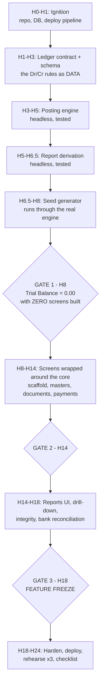

# The 24-Hour Build Plan

This section is the clock. It tells you what to build, in what order, in which hour, and
exactly what must be working before you are allowed to move on.

Read it once now, before you write any code. Then keep it open on a second screen and work
down it. Every block has three things:

- **Hours** — the window, measured in elapsed time from the start of the hackathon (T+0).
- **Deliverable** — the exact files and behaviour that exist at the end of the block.
- **CHECKPOINT** — one specific, *demonstrable* thing. If it does not work, you do not move
  on. You either fix it or you take a cut (see [Cut Lines](#cut-lines-what-to-drop-and-when)).

A word on vocabulary before we start. This plan uses a handful of accounting words. Each one
is defined the first time it appears, in one line, so you can follow the plan without any
accounting background. The deeper explanations live in the accounting-primer and
architecture sections of this document — this section deliberately does not repeat them.

---

## 1. The One Decision That Decides Everything: Build Order

### The way almost every team will do it (and lose)

The natural instinct is: *"Let me get something on screen. I'll build the Contact form, then
the Product form, then the invoice screen, and I'll do reports at the end."*

That instinct is correct for most hackathon projects. For this one it is fatal. Here is
exactly how it kills you, step by step:

1. **Hour 2.** You build the Customer Invoice form. To make it work you add columns that the
   form needs: `invoice.total`, `invoice.paid` (a true/false flag), `invoice.status` (a text
   field you set by hand).
2. **Hour 9.** Everything looks great. You have Contacts, Products, Invoices, Bills. You
   demo it to yourself and it feels done.
3. **Hour 16.** You start the Balance Sheet. A **Balance Sheet** is a report that lists what
   the business owns (Assets) against what it owes plus what the owner put in (Liabilities +
   Capital), and the two sides must be equal to the rupee. You now need a number for "Bank".
   There is no table that knows the bank balance. So you write
   `SELECT SUM(amount) FROM payment WHERE method='bank'`.
4. **Hour 17.** You need "Debtors" — money customers still owe you. You write
   `SELECT SUM(total) FROM invoice WHERE paid = false`. Partial payments break this
   instantly, because `paid` is a boolean and reality is a number.
5. **Hour 19.** The two sides of your Balance Sheet do not match. They are off by ₹47,300 and
   you have no idea why, because there is no single table where the truth lives. You start
   adding fudge factors.
6. **Hour 23.** A judge who builds accounting software for a living walks up, adds your three
   Asset numbers, adds your two Liability numbers, and they are different. Conversation over.
   Every other number you show for the next four minutes is now assumed to be wrong too.

The trap is not laziness. The trap is that **the schema you get from designing screens first
physically cannot produce the reports.** By the time you find out, retrofitting means
rewriting posting for six document types *and* regenerating all your data — six hours you do
not have at hour 17.

### The way you will do it

You will build the **headless core first**. "Headless" means no screens at all: pure
TypeScript functions plus a database, driven by automated tests and a command line.

Specifically, in the first 8 hours you build:

- **The posting engine.** One function that takes any business document (a bill, an invoice,
  a payment) and writes a **journal entry** — the formal accounting record of that
  transaction. A journal entry contains two or more **journal items** (individual lines),
  each with an account, a **debit** amount and a **credit** amount. The iron rule of
  double-entry bookkeeping: within one entry, total debits must equal total credits, always.
- **The report derivation.** Four functions that read *only* the `journal_item` table and
  produce the Trial Balance, the Balance Sheet, the Profit & Loss, and the Budget actuals.
  ("Derivation" just means: computed from the ledger, not stored anywhere.)
- **Seed data**, generated by running fake documents *through the real posting engine*.

Only after those pass tests do you build a single screen. Screens then become a thin skin:
a React page calls `postDocument()` or `getBalanceSheet(asOf)` and renders the result. No
page ever writes its own SQL.

### Four reasons this ordering wins

| # | Reason | Why it matters here |
|---|---|---|
| 1 | **The hard work happens when you are freshest** | The posting engine is the only genuinely hard thing in this problem statement. Do it at hour 3, not hour 17. |
| 2 | **The compressible work goes last** | An AI pair programmer generates a list + form screen in ~4 minutes. Screens are the only work you can cut or speed up on demand. So they must sit at the *end* of the plan, where cutting is possible. Engines cannot be cut — a half-built engine produces wrong numbers, which is worse than no numbers. |
| 3 | **A headless core is testable in seconds** | You cannot verify a screen quickly. You can run 40 assertions against a function in 3 seconds. Every hour spent before hour 8 buys certainty that lasts the whole day. |
| 4 | **Your seed data becomes a 400-case test** | Because the seed generator posts through the real engine, if the trial balance is zero after seeding, the engine is right across 400 real cases. Teams that hand-write their seed rows have books that balance *by luck*, and it shows the moment a judge posts one new transaction. |



**Say this to a judge who asks about your architecture (20 seconds):**

> "We built this inverted. For the first eight hours there was no user interface at all —
> just the posting engine and the report functions, driven by tests. The screens came after,
> and they only call those functions. That's why every number on every screen comes out of
> one table, `journal_item`, and nothing is summed off the invoice table."

---

## 2. Assumptions This Plan Makes

So the hour numbers mean something, the plan assumes the following. The architecture section
argues these choices properly; here they are just stated so the schedule is concrete.

| Thing | Choice | Why in one line |
|---|---|---|
| Framework | **Next.js 15 (App Router) + TypeScript** | The developer's strongest stack; one codebase serves UI and API, so there is no second server to deploy at 3 AM. |
| Database | **PostgreSQL on Neon** (managed, free tier) | Managed means no "my local Postgres died" at hour 22. Postgres gives real `CHECK` constraints and window functions for running balances. |
| ORM | **Prisma** | Migration files in git, so schema changes are revertable. |
| UI | **Tailwind + shadcn/ui** | The mockup demands the *same* list/form layout on ~10 masters. A component library makes the scaffold cheap. |
| Tests | **Vitest** | Fast, zero config with TypeScript. Only the core is tested — never the UI. |
| Deploy | **Vercel** (`vercel --prod`) | Git push to deploy. Set this up at hour 1, not hour 23. |
| Money | **Integers in paise, `BIGINT`** | ₹16,992.00 is stored as `1699200`. Never use floats for money: floats will make your debits and credits differ by ₹0.01 and break the one constraint you cannot afford to break. |
| Demo date | **`DEMO_TODAY=2026-09-05`** | The organizers' own mockup shows journal entries dated "Sep 1" and "Sep 2" of 2026, and invoice numbers `INV/2026/0001`. Pinning "today" makes seed data and rehearsals reproducible. |

Repository layout referenced throughout this section:

```
urban-books/
├─ prisma/
│  ├─ schema.prisma
│  └─ migrations/
├─ src/
│  ├─ core/                          ← the headless core. NO React in here, ever.
│  │  ├─ ledger/postDocument.ts      ← the posting engine
│  │  ├─ ledger/rules.ts             ← posting rules as DATA, not if/else
│  │  ├─ ledger/sequence.ts          ← INV/2026/0001 allocation
│  │  ├─ reports/trialBalance.ts
│  │  ├─ reports/balanceSheet.ts
│  │  ├─ reports/profitAndLoss.ts
│  │  ├─ reports/budgetActuals.ts
│  │  ├─ reports/aging.ts
│  │  ├─ recon/matcher.ts            ← bank statement fuzzy matcher
│  │  ├─ integrity/hashChain.ts
│  │  └─ __tests__/*.test.ts
│  ├─ app/(app)/…                    ← screens
│  ├─ app/api/…                      ← endpoints
│  ├─ lib/scaffold/                  ← the reusable list/form/kanban engine
│  └─ config/
│     ├─ resources/*.ts              ← one file per master (contact.ts, product.ts…)
│     └─ nav.ts                      ← THE menu. Cutting a feature = deleting one line here.
├─ scripts/seed.ts
├─ scripts/audit.ts
└─ demo/bank_statement_05sep2026.csv
```

npm scripts you will type all day:

```bash
npm test              # vitest run — the core test suite
npm run typecheck     # tsc --noEmit
npm run seed          # wipe + regenerate all demo data (must finish in < 20s)
npm run audit         # prints Trial Balance, the accounting equation, hash-chain status
npm run verify        # audit + test + typecheck, in that order. The "am I green?" command.
```

---

## 3. The Master Timeline

Times are **elapsed hours from T+0**, not clock times. If the hackathon starts at 10:00 AM
Saturday, T+8 is 6:00 PM Saturday and T+18 is 4:00 AM Sunday.

```mermaid
gantt
    title 24-Hour Build — elapsed time from T+0
    dateFormat HH:mm
    axisFormat %H
    section Headless core
    Ignition + deploy pipeline      :a1, 00:00, 60m
    Ledger contract (rules as data) :a2, 01:00, 45m
    Schema + constraints            :a3, 01:45, 75m
    Posting engine + tests          :a4, 03:00, 120m
    Report derivation + tests       :a5, 05:00, 90m
    Seed generator                  :a6, 06:30, 90m
    section Screens
    Shell + auth + dashboard + scaffold :b1, 08:00, 90m
    Seven master screens            :b2, 09:30, 90m
    PO to Bill, SO to Invoice       :b3, 11:00, 120m
    Payments + residual + badges    :b4, 13:00, 60m
    section Payoff
    Report screens + PDF + drilldown :c1, 14:00, 75m
    Budget workflow + pie + kanban  :c2, 15:15, 60m
    As-of slider + Books Integrity  :c3, 16:15, 45m
    Bank import + reconciliation    :c4, 17:00, 60m
    section Endgame
    Hardening sweep                 :d1, 18:00, 75m
    Final deploy + prod smoke       :d2, 19:15, 30m
    Food + 20 min horizontal        :d3, 19:45, 20m
    Rehearsal 1 (timed)             :d4, 20:05, 45m
    Demo-path bug fixes only        :d5, 20:50, 60m
    Rehearsal 2 + record backup     :d6, 21:50, 30m
    Rehearsal 3 + Q&A drill         :d7, 22:20, 40m
    Pre-demo checklist              :d8, 23:00, 30m
    Reserve - do nothing            :d9, 23:30, 30m
```



Note the shape: **6 hours of the 24 are spent after the last feature is written.** That feels
extravagant when you are behind. It is the single highest-return decision in the plan.
The demo is the scoring surface. A great product demoed badly scores below a good product
demoed perfectly, every single time.

---

## 4. Phase-by-Phase

### Phase 0 — Ignition (T+0:00 → T+1:00, 1.0h)

You will want to skip parts of this. Do not. This hour exists so that "deployment" is never
a word you say after hour 20.

**Deliverable**

- GitHub repo `urban-books`, `main` branch, first commit.
- `npx create-next-app@latest` with TypeScript + Tailwind + App Router.
- Neon Postgres project created, `DATABASE_URL` in `.env.local` **and** in Vercel's
  environment variables (do both now — forgetting the second one is the classic hour-22 death).
- Prisma installed, `prisma/schema.prisma` with one throwaway model, one migration run.
- A single page at `/` that renders the text `Urban Books — build 0` and, below it, the live
  result of a database query (e.g. `SELECT now()`), proving the app can reach the DB.
- **Deployed to Vercel.** A public HTTPS URL that shows that page and that timestamp.
- `npm run verify` exists (it does almost nothing yet, but the command exists).
- A file `docs/NOT-BUILDING.md` with your out-of-scope list (see Risk 4).

**CHECKPOINT** — Open the public Vercel URL **on your phone, on mobile data, not the venue
Wi-Fi**, and see the current timestamp from Neon. If that works, deployment is solved
forever and every later `git push` is a deploy.

**Why the phone test:** venue Wi-Fi at Indian hackathons is frequently behind a captive
portal or a proxy. Finding that out now costs 30 seconds; finding out at hour 23 costs the
competition.

---

### Phase 1 — The Ledger Contract (T+1:00 → T+1:45, 0.75h)

This is a *thinking* block. You will write almost no code. The prior strategic analysis calls
this out as the one non-negotiable precondition: you must know the exact debit and credit
lines for every transaction type before you touch the schema.

**Deliverable**

`docs/ledger-contract.md` containing, for each of the six posting events, the exact lines
with real rupee numbers. Here is the content, ready to use:

> **Debit and credit in one line each, so you never have to look it up again:**
> A **debit** increases Assets and Expenses, and decreases Liabilities, Capital and Income.
> A **credit** does the opposite. That is the whole rule. Every entry must have equal totals
> on both sides.

| # | Event | Debit (Dr) | Credit (Cr) | Example ₹ |
|---|---|---|---|---|
| 1 | **Opening balance** posted 01-Jan-2026 | Cash A/c 1,50,000<br/>Bank A/c 8,50,000 | Capital A/c 10,00,000 | Owner puts ₹10 lakh into the business |
| 2 | **Vendor Bill confirmed** (you owe a supplier) | Purchase Expense A/c 14,400<br/>Input GST A/c 2,592 | Creditors A/c 16,992 | 12 chairs @ ₹1,200 + 18% tax |
| 3 | **Customer Invoice confirmed** (a customer owes you) | Debtors A/c 47,200 | Sales Income A/c 40,000<br/>Output GST A/c 7,200 | 5 chairs @ ₹8,000 + 18% tax |
| 4 | **Payment sent** (you pay a supplier by bank) | Creditors A/c 10,000 | Bank A/c 10,000 | Part-payment of the ₹16,992 bill |
| 5 | **Payment received** (customer pays you, cash) | Cash A/c 47,200 | Debtors A/c 47,200 | Invoice settled in full |
| 6 | **Manual journal entry** (typed by the accountant) | any account | any account | Dr Other Expense 25,000 / Cr Bank 25,000 for rent |

**Creditors** = money you owe suppliers (a Liability). **Debtors** = money customers owe you
(an Asset). Both are in the organizers' own seed Chart of Accounts, so this is their
vocabulary, not an invention.

The critical design decision made in this block: **these rules live in a data file, not in
`if` statements.** Create `src/core/ledger/rules.ts` exporting a plain array:

```ts
// Posting rules as DATA. A judge can change a row and the next posting changes.
export const POSTING_RULES = [
  { event: 'BILL_CONFIRM',    role: 'expense',   source: 'product.category.expenseAccount', side: 'debit'  },
  { event: 'BILL_CONFIRM',    role: 'input_tax', source: 'tax.paidAccount',                 side: 'debit'  },
  { event: 'BILL_CONFIRM',    role: 'payable',   source: 'journal.defaultPayableAccount',   side: 'credit' },
  { event: 'INVOICE_CONFIRM', role: 'income',    source: 'product.category.incomeAccount',  side: 'credit' },
  { event: 'INVOICE_CONFIRM', role: 'output_tax',source: 'tax.collectedAccount',            side: 'credit' },
  { event: 'INVOICE_CONFIRM', role: 'receivable',source: 'journal.defaultReceivableAccount',side: 'debit'  },
  { event: 'PAYMENT_POST',    role: 'bank_cash', source: 'payment.methodAccount',           side: 'dynamic'},
  { event: 'PAYMENT_POST',    role: 'counterpart',source:'partner.controlAccount',          side: 'dynamic'},
] as const;
```

Why this matters more than it looks: an Odoo judge's favourite five-second test is *"change
the Sales Journal's default account and post a new invoice."* If your accounts are resolved
from configuration rows, the new entry uses the new account and you have proven the engine is
real. If they are hardcoded, nothing changes and you are exposed.

**Also in this block:** write the "NOT BUILDING" list into `docs/NOT-BUILDING.md`. Suggested
contents: multi-currency, foreign-exchange revaluation, fiscal year close, GSTR-1/3B filing
formats, e-invoice IRN, depreciation, cost centres beyond the analytic accounts, email
sending via a real SMTP provider, and any kind of chart library beyond one hand-written SVG.
Pin it where you can see it. When you feel the pull toward any of these at 3 AM, you have
already decided.

**CHECKPOINT** — Ask your AI pair programmer, in a fresh message: *"Given this contract file,
write out the journal lines for a ₹16,992 vendor bill part-paid ₹10,000 by bank."* If it
produces four lines across two entries that both balance, your contract is unambiguous. If it
asks a clarifying question, your contract has a hole — fix the hole now, not at hour 12.

---

### Phase 2 — Schema and Constraints (T+1:45 → T+3:00, 1.25h)

**Deliverable** — `prisma/schema.prisma` with the full model set and one migration applied to
Neon. Roughly 22 models. The ones that matter most:

```prisma
model JournalEntry {
  id           String   @id @default(cuid())
  number       String   @unique          // INV/2026/0001, allocated at POST time
  date         DateTime                  // accounting date — FETCHED FROM THE SOURCE DOC
  journalId    String
  state        EntryState @default(DRAFT) // DRAFT | POSTED | CANCELLED
  sourceType   String?                   // 'BILL' | 'INVOICE' | 'PAYMENT' | 'MANUAL'
  sourceId     String?
  trace        Json?                     // the "why" of this entry — see Phase 3
  items        JournalItem[]
}

model JournalItem {
  id            String   @id @default(cuid())
  entryId       String
  accountId     String                    // → ChartOfAccount
  partnerId     String?                   // → Contact
  analyticId    String?                   // → AnalyticAccount. The join most teams forget.
  debitPaise    BigInt   @default(0)
  creditPaise   BigInt   @default(0)
  date          DateTime                  // denormalised from the entry — makes every
                                          // report a single-table scan. Worth it.
  prevHash      String?                   // tamper-evident chain (ADDITION, see Phase 12)
  hash          String?
}
```

Three constraints you add **by hand** in the migration SQL, because they are your safety net
for the next 21 hours:

```sql
-- 1. A journal item can never be both a debit and a credit, and never negative.
ALTER TABLE "JournalItem" ADD CONSTRAINT journal_item_one_sided
  CHECK ("debitPaise" >= 0 AND "creditPaise" >= 0
         AND ("debitPaise" = 0 OR "creditPaise" = 0));

-- 2. A POSTED entry must balance. Enforced by a deferred trigger so multi-row
--    inserts inside one transaction are checked at COMMIT, not per row.
CREATE CONSTRAINT TRIGGER journal_entry_must_balance
  AFTER INSERT OR UPDATE ON "JournalItem"
  DEFERRABLE INITIALLY DEFERRED
  FOR EACH ROW EXECUTE FUNCTION check_entry_balanced();

-- 3. A POSTED entry's items can never be updated or deleted. In accounting you
--    never erase history; you post a reversing entry instead.
CREATE TRIGGER journal_item_immutable
  BEFORE UPDATE OR DELETE ON "JournalItem"
  FOR EACH ROW EXECUTE FUNCTION reject_if_posted();
```

**Why put this in the database and not in application code?** Because a judge can bypass your
application. They cannot bypass the database. Naming the constraint
`journal_entry_must_balance` is deliberate: when you fire an unbalanced entry at your API
during the demo and the error message contains that exact string, the judge sees that the
guarantee lives at the lowest level of the stack.

**CHECKPOINT** — In a terminal, connect with `psql` and try to insert an unbalanced entry by
hand (Dr 5000, Cr 3000). It must fail with `journal_entry_must_balance`. Screenshot it — you
will show this exact terminal during the demo.

**Freeze rule:** after this block, the schema is frozen for *changes*. From here on you may
only **add** columns and tables. You may never rename or drop one. A rename at hour 15 breaks
the engine, the seed, and the tests simultaneously, and you will lose an hour to a cascade of
red squiggles.

---

### Phase 3 — The Posting Engine (T+3:00 → T+5:00, 2.0h)

The most important two hours of the day. No screens. No CSS. One function and its tests.

**Deliverable** — `src/core/ledger/postDocument.ts`, exporting:

```ts
type PostResult = { entry: JournalEntry; items: JournalItem[]; trace: TraceStep[] };

export async function postDocument(
  tx: PrismaTx,
  input: { type: 'BILL'|'INVOICE'|'PAYMENT'|'MANUAL', id: string, date: Date }
): Promise<PostResult>
```

Behaviour required:

1. Resolves every account through `POSTING_RULES` and the config tables. **Zero hardcoded
   account names in this file.** If the string `'Debtors'` appears anywhere in
   `postDocument.ts`, you have failed the block.
2. Allocates the document number at post time, not at draft time, via
   `src/core/ledger/sequence.ts` using a row-locked counter
   (`SELECT … FOR UPDATE`) per journal per year. The mockup demands `Bill/2026/0001` and
   `INV/2026/0001` formats; there must be no gaps in the sequence.
3. Copies the **analytic account** from each document line onto the journal item. An
   *analytic account* is a project or department tag — the mockup calls the column "Budget
   Analytics". This is the join that makes the Budget Report real, and it is the single most
   commonly skipped plumbing step.
4. Sets the entry date from the **source document's date**, exactly as the mockup annotation
   says ("Bill date fetch from bill") — not today's date.
5. Returns a `trace` array: a plain-English list of *why* each line got the account it got.
   Store it in `JournalEntry.trace`. **Building the trace here costs you ten minutes; it buys
   you the entire "Explain this entry" panel later for twenty minutes of UI work.** Do not
   defer it.
6. Rounds once, at the line level, in paise, using one shared `roundPaise()` helper. Any
   rounding difference is pushed onto the largest line so the entry still balances exactly.

**Tests** in `src/core/__tests__/posting.test.ts` — write at least these 14:

| # | Test | Expect |
|---|---|---|
| 1 | Bill with one line, no tax | 2 items, balanced |
| 2 | Bill with tax | 3 items, balanced |
| 3 | Invoice with tax | 3 items, Debtors debited |
| 4 | Invoice with 3 lines, 2 different products, 2 categories | income split across 2 accounts |
| 5 | Payment received, bank | Dr Bank / Cr Debtors |
| 6 | Payment sent, cash | Dr Creditors / Cr Cash |
| 7 | Partial payment | residual = total − paid, exactly |
| 8 | Overpayment | credit balance appears on partner, entry still balances |
| 9 | Manual entry, unbalanced | rejected, error name `journal_entry_must_balance` |
| 10 | Change `journal.defaultReceivableAccount`, post again | new account used |
| 11 | Analytic tag on line | appears on the journal item |
| 12 | Sequence: post 3 invoices | `0001, 0002, 0003`, no gaps |
| 13 | Rounding: 3 lines of ₹333.33 + 18% tax | debits = credits to the paise |
| 14 | Property test: 500 random documents | every entry balances |

Test 14 is the one that lets you sleep. Generate random quantities, prices, tax rates and
line counts; assert `sum(debit) === sum(credit)` on all 500.

**CHECKPOINT** — `npm test` is green, 14+ tests pass, and **there is still not a single screen
in the application.** Commit and tag: `git tag h05-engine-green`.

**How to use the AI here:** give it the contract file and the schema, then ask for *one
function at a time*, each with its tests, and run `npm run typecheck` after every generation.
Do not ask for "the posting module". Ask for `resolveAccount()`, then `buildBillLines()`,
then `postDocument()`. Long generations drift; short ones do not.

---

### Phase 4 — Report Derivation (T+5:00 → T+6:30, 1.5h)

Still headless. Four pure functions that read only `journal_item`.

**Deliverable**

| File | Function | Rule |
|---|---|---|
| `reports/trialBalance.ts` | `getTrialBalance(asOf)` | Sum debits and credits per account for all items with `date <= asOf`. The grand totals must differ by exactly 0. |
| `reports/balanceSheet.ts` | `getBalanceSheet(asOf)` | **Cumulative from the beginning of time** up to `asOf`. No start date. Groups by account type: Assets (Bank, Cash, Debtors), Liabilities (Creditors), Capital. |
| `reports/profitAndLoss.ts` | `getProfitAndLoss(from, to)` | Sum over a **date range**, Income and Expense account types only, sign-flipped so income shows positive. |
| `reports/budgetActuals.ts` | `getBudgetActuals(budgetId)` | For each budget line: sum journal items carrying that analytic account, within the budget period. Income-type analytics draw from invoices; Expense-type from bills — exactly as the mockup's field-explanation box specifies. |

Two things that make the Balance Sheet actually balance, and that ~90% of teams miss:

1. **Current Year Earnings.** Profit is not stored anywhere. If you list Assets, Liabilities
   and Capital straight off the ledger, the two sides differ by exactly this year's profit.
   So the Balance Sheet must compute `Income − Expenses` for the current year and show it as
   a line inside the Capital section. *(This is an addition beyond the mockup's five Balance
   Sheet rows. It earns its place because without it the report does not balance, and the
   mockup explicitly demands a "Total Asset" and "Total (Liabilities)" footer — a footer that
   only makes sense if the totals tie.)*
2. **Two aggregation semantics over one table.** The Balance Sheet is a *snapshot* (`<= T`);
   the P&L is a *slice* (`between A and B`). Writing them as two clearly different functions
   over the same table is the whole architectural point. Say that sentence to a judge.

Also build now, because it is 15 minutes and it powers a demo beat later:

- `reports/aging.ts` — `getAging(asOf)`, bucketing unpaid customer invoices into
  Current / 1–30 / 31–60 / 61–90 / 90+ days past their due date. *(Addition: the mockup does
  not draw an aging report. It earns its place because it is the visual that reacts when bank
  reconciliation runs, and it costs one query.)*

And `scripts/audit.ts` → `npm run audit`, which prints:

```
Urban Books — Ledger Audit @ 2026-09-05
  Journal entries .............. 96
  Journal items ................ 412
  Trial balance ................ Dr 41,86,300.00  Cr 41,86,300.00  DIFF 0.00   ✔
  Accounting equation .......... Assets 18,42,310.00 = Liabilities 1,97,310.00 + Capital 16,45,000.00   ✔
  Hash chain ................... VALID (412/412)
```

**CHECKPOINT** — With hand-made test data (three entries), `getBalanceSheet('2026-09-05')`
returns two sides that are equal, and `getProfitAndLoss` net income appears inside the
Balance Sheet's Capital section. Test asserts equality automatically:
`expect(bs.totalAssets).toBe(bs.totalLiabilities + bs.totalCapital)`.

---

### Phase 5 — Seed Data (T+6:30 → T+8:00, 1.5h)

Full details are in [Section 5 of this plan](#5-seed-data-strategy) below — it is important
enough to get its own treatment. The block itself produces `scripts/seed.ts` and
`demo/bank_statement_05sep2026.csv`.

**CHECKPOINT** — `npm run seed && npm run audit` finishes in under 20 seconds and prints
`DIFF 0.00`. Commit and tag `git tag h08-core-green`.

---

## GATE 1 — T+8:00

Stop. Stand up. Eat something for 20 minutes. Then answer honestly:

- [ ] `npm test` green?
- [ ] `npm run audit` prints `DIFF 0.00` and a balanced equation?
- [ ] Unbalanced entry rejected at the database level?
- [ ] ~400 journal items exist, generated through the engine?
- [ ] Zero screens built?

**All five ticked → you are winning.** Proceed to Phase 6.
**Any unticked → take Cut Line 1 now.** Do not "just push a bit further". See below.

---

### Phase 6 — Shell, Auth, Dashboard, Scaffold (T+8:00 → T+9:30, 1.5h)

Now, and only now, pixels.

**Deliverable**

1. **Auth** (30 min). NextAuth credentials provider, three roles as the mockup annotation
   specifies: `ADMIN`, `ACCOUNTANT`, `PORTAL_USER`. Login page with the exact error string the
   mockup demands: `Invalid Login Id or Password`. Sign-up page that can create *only* a
   portal user. Credential rules straight off the mockup: login id unique and 6–12
   characters; email not duplicated; password longer than 8 characters containing a lowercase,
   an uppercase and a special character. Seed three users so you never type a signup during a
   demo.
2. **App shell** (20 min). The top menu bar the mockup draws — `Sales | Purchase | Account |
   Report` — opening the full mega-menu with all 16 destinations. Every route reads its entry
   from `src/config/nav.ts`.
3. **Dashboard** (20 min). The three cards the mockup shows, with live counts:
   Sales (All / Confirmed / Draft), Purchase (All / Confirmed / Draft),
   Budget Reports (Achieved / Budget / Committed). These are `COUNT(*)` queries. Cheap, and
   it is the first screen a judge sees.
4. **The scaffold** (20 min). `src/lib/scaffold/` — one component set that renders a list
   view, a kanban view and a form view from a config object. This is not a nice-to-have: the
   mockup's own note says *"All Master will have list view as default… Create Kanban and List
   View in the same manner for Product, Analyticals"*. The organizers have effectively
   mandated a reusable scaffold. Building it here turns seven master screens into seven
   config files.

```ts
// src/config/resources/contact.ts — an entire master module, 30 lines.
export const contactResource: Resource = {
  key: 'contact',
  label: 'Contacts',
  model: 'Contact',
  defaultView: 'list',
  views: ['list', 'kanban', 'form'],
  listColumns: ['image', 'name', 'email', 'phone'],
  kanbanCard: { image: 'image', title: 'name', lines: ['email', 'phone'] },
  formFields: [
    { name: 'name',  type: 'text', required: true, span: 2 },
    { name: 'email', type: 'email', unique: true, placeholder: 'Unique Email' },
    { name: 'phone', type: 'text' },
    { name: 'type',  type: 'select', options: ['Customer','Vendor','Both'] },
    { group: 'Address', fields: ['street','street2','city','state','country','pincode'] },
    { name: 'image', type: 'image' },
  ],
  toolbar: ['New', 'Confirm', 'Back'],
};
```

**CHECKPOINT** — Log in as the accountant user, land on a dashboard showing real counts from
seed data, open the mega-menu, and click through to a Contact list that shows twelve seeded
contacts with avatars, switch to kanban, click a row, see the populated form. One resource
file did all of that.

---

### Phase 7 — The Seven Masters (T+9:30 → T+11:00, 1.5h)

**Deliverable** — config files and any special-case handling for:

| Master | Special requirement from the mockup | Minutes |
|---|---|---|
| Contact | list + kanban + form, image upload shown in both, unique email | done in Phase 6 |
| Product | list + kanban + form, type = Goods/Service/Combo, **Category creatable on the fly** from the dropdown | 20 |
| Chart of Accounts | **grouped dropdown** for Type: headings `Balancesheet` {Asset, Liability, Bank, Capital, Cash} and `Profit and Loss` {Income, Expenses, Other Expenses}, headings not selectable; extra toolbar buttons `Archived` and `Home` | 20 |
| Journals | 4 seeded rows, Type from a fixed 4-value list, Default Account many-to-one | 10 |
| Journal Entries | list with Date / Number / Partner / Journal / Total / Status, green `Posted` and blue `Draft` badges | 15 |
| Analytic Accounts | list + kanban + form, Type = Income/Expense only, plus the reverse table "all budgets where this analytic is used" | 15 |
| Analytic Budget | deferred to Phase 11 (it has a state machine, so it is not a plain master) | — |

**CHECKPOINT** — Every one of the seven master menu entries opens without a 404 or a console
error, creates a record, edits it, and archives it. Click all seven in 60 seconds. Any dead
link gets removed from `nav.ts` immediately rather than left broken.

---

### Phase 8 — Documents: PO → Bill and SO → Invoice (T+11:00 → T+13:00, 2.0h)

The spine of the app. Four screens, two conversions, one shared line grid.

**Deliverable**

1. **One shared line-grid component** used by all four documents. Columns:
   `Sr. No. | Product | Chart of Account | Budget Analytics | Qty | Unit Price | Total`,
   with `Total = Qty × Unit Price` computed live and a footer total. Build it once. The
   mockup draws the identical grid on all four screens — that is a gift, take it.
2. **Purchase Order** — auto sequence `PO0001`, vendor many-to-one, `Confirm` and
   `Create Bill` buttons. On Confirm, run the budget check and show the **non-blocking**
   warning the mockup specifies verbatim: *"The entered amount is higher than the remaining
   budget amount for this budget line. Consider adjusting the value or revise the budget."*
   Non-blocking means the user clicks past it and the PO still confirms. Getting this wrong in
   either direction (blocking it, or omitting it) is a visible spec miss.
3. **Vendor Bill** — sequence `Bill/2026/0001`, Chart of Account column **defaults to the
   Purchase account**, `PO` smart button visible only when the bill came from a PO,
   `Budget` smart button opening the budget report for the analytics used. On Confirm, call
   `postDocument()` and the journal entry appears in the Journal Entries list.
4. **Sales Order** → **Customer Invoice**, mirror image: sequence `INV/2026/0001`,
   Sales account defaulted, separate free-text `Invoice Reference` field, Invoice Date and Due
   Date, `SO` smart button with the same conditional visibility.
5. **Manual Journal Entry form** — the editable debit/credit grid with a running total and a
   **blocking** error if the two sides differ. Note the deliberate asymmetry the organizers
   built into their own spec: the budget warning is non-blocking, the balance check is
   blocking. Point that out to a judge; it shows you read the annotations.

**CHECKPOINT** — Do this by hand, on screen, in 90 seconds: create PO → Confirm (warning
appears, you dismiss it, PO confirms) → Create Bill → Confirm → open Journal Entries → the new
entry is there, `Posted`, balanced → run `npm run audit` → still `DIFF 0.00`.

---

### Phase 9 — Payments, Residual and Status Badges (T+13:00 → T+14:00, 1.0h)

**Deliverable** — the Payment wizard exactly as the mockup draws it:
Payment Type radio (Send / Receive), Date defaulting to today, Partner autofilled from the
document, Payment Via defaulting to Bank and switchable to Cash, Amount autofilled with the
amount due, a free-text Note, and the three-stage status bar Draft → Confirm → Cancelled.

The part that separates you from the field: **residual is derived, never stored.**

```ts
// The number that tells the truth. There is no `invoice.paid` boolean anywhere.
residualPaise = totalPaise - sum(allocation.amountPaise where allocation.invoiceId = this.id)

status = residual === 0        ? 'Paid'
       : residual < totalPaise ? 'Partial'
       :                         'Not Paid'
```

That mapping is copied straight from the mockup's own badge legend
(*Paid — if amount due = 0; Partial — if amount due < Bill Total; Not Paid — if amount due =
Bill Total*). A `PaymentAllocation` join table is what makes partial payment, multi-invoice
payment and overpayment all possible with one model. Teams that skip this table cannot
retrofit it later.

**CHECKPOINT** — On the seeded ₹16,992 bill, register a ₹10,000 bank payment. The badge flips
to `Partial`, Amount Due shows `₹6,992`, a new balanced journal entry appears
(Dr Creditors 10,000 / Cr Bank 10,000), and on the Balance Sheet the Bank figure drops by
exactly ₹10,000 while Creditors drops by exactly ₹10,000. Both sides still tie.

---

## GATE 2 — T+14:00

Eat. Twenty minutes lying flat if you can — this is usually the middle of the night, and the
next four hours are the ones that win or lose the trophy.

- [ ] PO → Bill → post → payment → residual all work end to end in the browser?
- [ ] Journal Entries list shows real entries with `Posted` badges?
- [ ] `npm run audit` still `DIFF 0.00` after all your manual clicking?
- [ ] All seven masters reachable and functional?

**All four ticked → proceed.** **Any unticked → Cut Line 2.**

---

### Phase 10 — Report Screens, PDF, and Drill-Down (T+14:00 → T+15:15, 1.25h)

The functions already exist and are tested. This is presentation only, which is why it is
fast.

**Deliverable**

- **Balance Sheet** page: two-column Assets / Liabilities layout with the exact rows the
  mockup names (Bank, Cash, Debtors | Capital, Creditors), a year selector, `Total Asset` and
  `Total (Liabilities)` footers, and a `Print` button.
- **Profit & Loss** page: Income → Income from Sales; Expenses → Purchase Expense, Other
  Expense; Net Income highlighted. Year selector and `Print`.
- **Print → PDF.** Do *not* install a PDF library. Use `window.print()` with a
  `@media print` stylesheet that hides the nav and prints a clean statement with a header.
  Browsers save that as PDF natively. This is 15 minutes instead of 60, and the output looks
  better than anything you would generate in the time you have.
- **Drill-down — every number is a link.** This is the highest-value hour of UI in the whole
  build. Balance Sheet `Debtors ₹4,72,500` → Partner Ledger (list of customers with balances)
  → one customer's ledger (their invoices and payments with a running balance) →
  `INV/2026/0021` → its journal entry (the Dr/Cr lines) → the payment that settled it. Five
  levels, no dead ends. It is cheap because every level is one more query against
  `journal_item`, and it is the thing that makes a judge feel they are using a product rather
  than looking at a project.

**CHECKPOINT** — The Balance Sheet's two footer totals are equal, and you can click from a
Balance Sheet number down five levels and back without hitting a dead end or a 404.

---

### Phase 11 — Budget Workflow and Budget Report (T+15:15 → T+16:15, 1.0h)

The mockup spends an enormous amount of space on budgets, which means judges will look here.

**Deliverable**

- **Budget form** with the four-stage status bar `Draft > Confirm > Revised > Cancelled` and
  the line grid: `Analytic | Type | Committed Amount | Achieved Amount | Achieved % | Amount
  To Achieve`. *Committed* here means the planned amount (the organizers use the word this
  way); *Achieved* is the actual spend or income computed from the ledger.
- The three computed columns are **hidden unless the budget is Confirmed** — the mockup says
  "Only Visible for Confirmed Budget" three separate times.
- Formulas exactly as specified: `Achieved % = (Achieved / Committed) × 100` and
  `Amount To Achieve = Committed − Achieved`.
- **Revise** button, visible only in the Confirmed stage. Pressing it creates a *new* budget
  record named `<original name> Revised`, moves the original to state `Revised`, and links
  them both ways: original gets `Revised With`, the copy gets a clickable `Revision Of` link.
- **Cancel = archive**, never delete.
- **Achieved Amount is a drill-down button** opening the list of invoices/bills carrying that
  analytic in the budget period.
- **Budget Report** in three views with a working switcher: list (with the per-row pie chart),
  kanban cards, and form.

The pie chart: do not install a chart library. A 30-line inline SVG with two arcs
(`Achieved` in cyan, `Balance` in pink) is enough, matches the mockup's own drawing, and
loads instantly in a list of twenty rows.

*Addition worth 15 seconds of demo:* alongside Committed and Achieved, show
`% of period elapsed` next to `% of budget consumed`, with a green/amber/red dot. If 68% of
August has passed but 81% of the budget is spent, that is amber. It reuses data you already
have and it is the language real budget-holders speak.

**CHECKPOINT** — Press Revise on the seeded confirmed budget. Two records exist, linked in
both directions, the original reads `Revised`, and the new one is named exactly
`August 2026 Revised`.

---

### Phase 12 — As-Of Slider and Books Integrity (T+16:15 → T+17:00, 0.75h)

Two features, forty-five minutes, and together they are the reason a judge remembers you.

**1. The as-of date slider** (15 min). Put a date slider on the Balance Sheet. Dragging it
calls `getBalanceSheet(newDate)` and the whole report re-derives. Drag from 5 September back
to 30 April and watch Debtors climb, Bank drop, Capital hold steady. This costs fifteen
minutes *only because the reports are pure functions of date* — which is precisely the point.
It is impossible to fake with document-summed reports.

> **Say this while dragging:** "Nothing here is cached. Every position on this slider is a
> fresh re-aggregation of the journal items dated on or before that day."

**2. The Books Integrity page** (30 min) at `/integrity`. One button, `Run Audit`, that
prints:

```
412 journal items · 96 entries · Trial Balance 0.00
Assets 18,42,310.00 = Liabilities 1,97,310.00 + Capital 16,45,000.00
Hash chain VALID (412/412)
```

*Addition, clearly labelled:* the **hash chain**. Each posted journal item stores
`sha256(prevHash + canonicalJson(row))`. `Verify Ledger` walks the chain. This is not in the
problem statement; it earns its place because Odoo ships exactly this feature for fiscal
compliance ("inalterable ledger"), because it takes 30 minutes on top of a schema you already
have, and because it enables the single most memorable demo beat available in this domain:
you open `psql` on stage, run
`UPDATE "JournalItem" SET "debitPaise" = 9999900 WHERE id = '…'` on a posted row, re-run
verification, and your own system names the tampered entry and prints expected-vs-found
hashes.

Also on this page: an `Explain` panel that renders `JournalEntry.trace` for any entry, in
plain English — *"Rule INVOICE_CONFIRM → Journal SALES.defaultReceivableAccount = Debtors
(Asset) ⇒ Dr 47,200 | Product Office Chair → Category Furniture.incomeAccount = Sales Income
⇒ Cr 40,000 | Tax GST18 (exclusive) → tax.collectedAccount = Output GST ⇒ Cr 7,200 |
analytic: Showroom-West"*. You already built the trace in Phase 3; this is just rendering it.

**CHECKPOINT** — `Run Audit` prints all three green lines against real seeded data, and the
slider visibly changes the Balance Sheet.

---

### Phase 13 — Bank Statement Import and Reconciliation (T+17:00 → T+18:00, 1.0h)

The best differentiator in this problem statement, and roughly zero teams will attempt it.

**Reconciliation**, in plain English: your bank sends you a list of money in and money out.
Your books have a list of invoices and bills. Reconciliation is matching the two lists so you
know which invoice each deposit paid.

**Deliverable** — `src/core/recon/matcher.ts`, a pure scoring function (so it is testable,
so you can show the code), plus an upload screen.

```ts
score(line: BankLine, candidate: OpenDocument): number
  // + 45  exact amount match (to the paise)
  // + 25  amount within 1% or ₹100, whichever is smaller  (bank charges, rounding)
  // + 35  a document number token extracted from the narration by regex
  //       /\b(INV|BILL)[\/-]?\d{4}[\/-]?\d{3,5}\b/i
  // + 20  partner name trigram similarity > 0.6 against the narration
  // + 10  statement date within 5 days of the document date
  // −  30 wrong direction (credit line against a vendor bill)
```

Rank candidates per line, auto-clear anything scoring above 80 with a single best match, and
show the rest as ranked suggestions with the *reasons* visible per row
(`amount exact · ref INV/2026/0021 · partner 0.82`). A `Reconcile All` button posts the
payments through the same `postDocument()` engine, residuals update, badges flip, and the
aging report drains its 0–30 bucket in front of the judge.

**CHECKPOINT** — Upload `demo/bank_statement_05sep2026.csv`. Seven of the ten lines auto-match
with visible reasons, two show ranked suggestions, and one (the rent payment) correctly
matches nothing. Click Reconcile All; `npm run audit` still prints `DIFF 0.00`.

> **Say this:** "A matcher that matches everything hasn't matched anything. Line 9 is a rent
> payment — there is no invoice for it, and the system correctly refuses to guess."

---

## GATE 3 — T+18:00 — FEATURE FREEZE

**No new features after this line. None. Not one.**

This is where hackathons are actually lost. At hour 18 you will feel fast and confident, and
you will think "the portal is only forty minutes". It is never forty minutes, and the cost of
being wrong is an unrehearsed demo.

The one permitted exception: if every checkpoint up to Phase 13 is green *and* you are ahead
of the clock, you may take **exactly one** item off the bench (below) and give it **exactly
60 minutes**, pushing the endgame to start at T+19:00. When the 60 minutes are up, whatever
state it is in, you `git checkout` back to the last green tag if it is not finished.

**The bench, in the order you would pick from it:**

1. Reversal on cancel — cancelling a posted invoice writes a mirrored reversing entry instead
   of deleting anything (~40 min, and it is a wonderful demo beat).
2. Period lock date — Admin sets `31-Mar-2026`; back-dated posting is blocked (~25 min).
3. The Contact portal — a customer logs in, sees only their own invoices, pays one (~60 min).
4. Stock ledger + moving-average cost (~90 min — too big; only if you are two hours ahead).

---

### Phase 14 — Hardening Sweep (T+18:00 → T+19:15, 1.25h)

Not new code. Removal and repair.

- [ ] **Kill every dead link and dead button.** Walk `src/config/nav.ts` top to bottom and
      delete any entry that 404s or errors. *A missing menu item costs you almost nothing. A
      menu item that throws a stack trace in front of a judge costs you the round.*
- [ ] Remove every `console.log`, every `TODO`, every placeholder like "Lorem ipsum".
- [ ] Empty states: every list gets a sensible message when it has no rows.
- [ ] Error boundary on every route group so a crash shows a calm message, not the Next.js
      red overlay.
- [ ] `npm run typecheck` clean. `npm test` green.
- [ ] Currency formatting consistent everywhere: Indian grouping, `₹4,72,500.00` not
      `₹472,500.00`. Use one `formatINR()` helper. An Indian judge notices the grouping.
- [ ] Dates consistent: `05-Sep-2026` everywhere, never `2026-09-05` in the UI.
- [ ] `npm run seed` works from a completely empty database.
- [ ] Add `POST /api/dev/reset` (guarded by `ALLOW_DEV_RESET=true`) that wipes and reseeds in
      one call, and wire it to a small reset button visible only to the admin user.
      *Addition, and one of the highest-value 10 minutes in the plan:* after a judge has
      clicked around and mangled your data, you are clean again in 15 seconds instead of
      demoing a broken state to the next judge.

**CHECKPOINT** — Click every single item in the mega-menu, in order. Zero errors. Then run
`npm run verify` — all green. Tag `git tag h19-frozen`.

---

### Phase 15 — Final Deploy and Production Smoke Test (T+19:15 → T+19:45, 0.5h)

- `git push` → Vercel builds → confirm the deployment is live.
- Run the **entire demo path on the production URL**, not localhost. Things that only break in
  production: missing environment variables, `BigInt` serialisation in JSON responses, time
  zone drift (set `TZ=Asia/Kolkata` in Vercel), image uploads, and cold-start latency on the
  first request.
- Hit the production URL from your phone on mobile data.
- **Decide now which one you demo from** — production URL or `npm run start` on localhost —
  and rehearse only that one. Have the other as the fallback. Localhost is faster and immune
  to venue Wi-Fi; production proves it is really deployed. The usual right answer: demo from
  localhost with the production URL open in a background tab to show it is deployed.

**CHECKPOINT** — Production URL loads, dashboard shows seeded numbers, Books Integrity prints
`DIFF 0.00`, on mobile data.

---

### Phase 16 — Food and Twenty Minutes Horizontal (T+19:45 → T+20:05, 0.33h)

This is in the plan on purpose. You are about to do the most important 45 minutes of the day
and you have been awake for twenty hours. Eat something that is not only sugar. Lie down, eyes
closed, twenty minutes. Set an alarm.

---

### Phase 17 — Rehearsal 1 (T+20:05 → T+20:50, 0.75h)

**Rehearsal is not optional and it is not a review. It is a full, out-loud, timed run.**

- Speak every word out loud, at demo volume, standing up. Talking through a demo in your head
  takes 3 minutes; doing it out loud takes 6. You will only discover that by doing it.
- Screen-record it (OBS, or Windows `Win+Alt+R`). You will watch it back.
- Time it. Target 4:30 for a 5:00 slot. Overrun eats your ending, and your ending is where
  the close and the forward-looking line live.
- **Write down every bug you hit, but fix nothing yet.** Stopping to fix mid-rehearsal means
  you never learn how long the whole thing takes.

Run the flow from the demo section of this document. Its skeleton:
cold-open on Books Integrity → live unbalanced-entry rejection at the API → purchase flow with
the budget warning and a partial payment → sales flow → bank reconciliation → reports with
drill-down and the as-of slider → the tamper self-attack → close.

**CHECKPOINT** — One complete uninterrupted run, timed, recorded, with a written bug list.

---

### Phase 18 — Demo-Path Bug Fixes Only (T+20:50 → T+21:50, 1.0h)

Take the bug list from Rehearsal 1 and sort it into three piles:

| Pile | Rule |
|---|---|
| **On the demo path** | Fix. This is the only pile you are allowed to touch. |
| **Off the demo path, ugly** | Hide it — delete the nav entry, or move the screen behind a route a judge will not click. |
| **Off the demo path, invisible** | Ignore completely. Write it in `docs/KNOWN.md` and forget it. |

The failure mode to avoid: you find a genuinely interesting bug in a screen nobody will open,
and it eats the hour you needed for Rehearsal 2. Set a 20-minute timer per bug. If it is not
fixed when the timer goes, revert to green and hide the feature.

**CHECKPOINT** — Every bug on the demo path is fixed, `npm run verify` green, redeployed.

---

### Phase 19 — Rehearsal 2 + Record the Backup Video (T+21:50 → T+22:20, 0.5h)

Run it again. It should be visibly smoother and about 30 seconds shorter.

**Then record a clean 3-minute screen capture of the full flow and put the file on your
Desktop.** *(Addition. It earns its place because it is insurance against the three things
that actually go wrong on stage: the venue projector refusing your resolution, the Wi-Fi
dying, and a laptop that decides to install updates. If any of those happen, you play the
video and narrate over it — which is a bad outcome, but it is not a zero.)*

**CHECKPOINT** — Run under 4:45. Video file exists and plays.

---

### Phase 20 — Rehearsal 3 + Hostile Q&A Drill (T+22:20 → T+23:00, 0.67h)

Final full run, then 20 minutes drilling the questions an Odoo engineer will actually ask.
Have your answer to each one rehearsed to under 20 seconds, and where possible, **answer with
a click rather than a sentence.**

| Question you will be asked | Your answer |
|---|---|
| "Post a manual entry: Dr Cash 5,00,000 / Cr Capital 5,00,000. Now show me the Balance Sheet." | Do it. Cash and Capital both rise by ₹5,00,000. This is *the* test that catches fake systems, because a fake reports off invoice tables and does not move. |
| "Do your assets equal liabilities plus capital?" | Books Integrity page, one click. It prints the equation with real figures. |
| "Where does Net Income on the P&L show up on the Balance Sheet?" | Point at Current Year Earnings inside Capital. Same number. "That's why it balances." |
| "Change the Sales Journal's default income account and post a new invoice." | Hand them the keyboard. The new entry uses the new account. |
| "Can I edit a posted entry?" | There is no Edit button. Show the immutability trigger in `psql` if they push. |
| "Pay half this invoice." | Pay ₹6,000 of ₹47,200. Badge → Partial, residual ₹41,200, Debtors on the BS drops by exactly ₹6,000. |
| "Is your budget report reading journal items or invoice totals?" | Show the `analyticId` column on `journal_item` and the query in `budgetActuals.ts`. |
| "What did you not build?" | Read from `docs/NOT-BUILDING.md`. Naming your own boundaries confidently reads as engineering maturity, not weakness. |
| "How long did the posting engine take?" | "Two hours, at hour three. We built the entire ledger headless before we wrote a single screen." |
| "What would you do next?" | GSTR-1/3B export, e-invoice IRN, multi-currency with FX revaluation, automated fiscal-year close. Three sentences, then stop. |

**CHECKPOINT** — You can answer all ten without hesitating, and six of them by clicking.

---

### Phase 21 — Pre-Demo Checklist (T+23:00 → T+23:30) — see [Section 8](#8-the-hour-23-pre-demo-checklist)

### Phase 22 — Reserve (T+23:30 → T+24:00, 0.5h)

Do nothing. Do not open the editor. This half hour exists to absorb the thing you did not
plan for, and if nothing goes wrong, it exists so you walk to the judging table calm rather
than mid-`git stash`.

---

## 5. Seed Data Strategy

Seed data is not filler. **The seed data *is* the demo.** Every beat in your five minutes
depends on a specific pre-built situation existing in the database. Build it deliberately.

### The two rules

1. **Never hand-write journal items.** Generate documents (POs, bills, SOs, invoices,
   payments), then post every one of them through the real `postDocument()` engine inside a
   single transaction. Two payoffs: your books tie *by construction* rather than by luck, and
   seeding becomes a 400-case integration test of the engine. Teams that hand-insert ledger
   rows have books that balance because they typed matching numbers — and it collapses the
   moment a judge posts one transaction.
2. **Deterministic.** A fixed random seed and all dates computed relative to
   `DEMO_TODAY=2026-09-05`. `npm run seed` must produce byte-identical data every time, and
   finish in under 20 seconds so you can reset between rehearsals and between judges.

> **Say this to a judge, unprompted, in the first minute:** "None of this data was inserted by
> hand. Every one of these 412 journal items was posted through the same engine you're about
> to watch. That's why the trial balance is zero — it's not a coincidence, it's a
> consequence."

### The volume

| Entity | Count | Notes |
|---|---|---|
| Company | 1 | Urban Furniture, INR, FY starting 01-Jan-2026 to match the mockup's `2026` year selector |
| Chart of Accounts | 8 + 4 | The eight the mockup mandates verbatim (Bank, Purchase Expense, Debtors, Creditors, Sales Income, Cash, Other Expense, Capital) **plus four additions**: Input GST, Output GST (justified — the PDF's Sales Order row explicitly lists a Tax field), Retained Earnings and Current Year Earnings (justified — without them the Balance Sheet cannot balance) |
| Journals | 4 | Sales, Purchase, Bank, Cash — each wired to its default account, exactly as the mockup's table |
| Users | 3 | `admin`, `accountant`, `nimesh` (portal). Passwords that satisfy the mockup's own rules. |
| Contacts | 12 | 6 customers, 4 vendors, 2 both. Real Indian names and cities: Nimesh Pathak (Ahmedabad), Azure Furniture (Surat), Openwood Traders (Pune)… with avatar images so the list and kanban views are not grey boxes. |
| Products | 18 | Across 4 categories (Seating, Tables, Storage, Services). Office Chair ₹8,000 / cost ₹4,800; Wooden Table ₹12,000 / cost ₹7,200; and so on. |
| Analytic accounts | 6 | "Showroom-West Fitout", "Bulk Contract – Infosys", "Retail Walk-in", "Marketing", "Warehouse Ops", "Service Desk" |
| Budgets | 4 | See edge cases below |
| Documents | ~90 | 22 POs, 19 bills, 26 SOs, 24 invoices |
| Payments | 31 | Including the deliberate edge cases below |
| **Journal entries** | **~96** | |
| **Journal items** | **~412** | |

### Two periods of history, because the slider needs something to show

Spread the documents across two clearly different stretches:

- **01-Jan-2026 → 30-Jun-2026** — the "settled" half. Mostly paid, quiet, lower volume. Bank
  around ₹6.2 lakh, Debtors low.
- **01-Jul-2026 → 05-Sep-2026** — the "live" half. Higher volume, several unpaid invoices,
  Debtors climbing to ₹4.72 lakh, the over-budget project.

This is what makes the as-of slider cinematic. Dragging from September to April must visibly
change every number — Debtors falls, Bank rises, Capital holds flat. If both halves look the
same, the slider is a shrug.

Everything starts from an **opening balance entry** dated 01-Jan-2026:
`Dr Cash 1,50,000 + Dr Bank 8,50,000 / Cr Capital 10,00,000`. This is what a real accountant
does on day one of a new set of books, and it is another thing a document-summed fake system
cannot represent.

### The ten deliberate edge cases (each one is a demo beat)

| # | Seeded situation | Concrete data | Which demo beat it powers |
|---|---|---|---|
| 1 | **Partially paid bill** | `Bill/2026/0014`, Azure Furniture, total ₹16,992, paid ₹10,000 by bank on 22-Aug, residual ₹6,992, badge `Partial` | Proves residual is derived, not a boolean. Judge test: "pay half this invoice." |
| 2 | **Over-budget purchase** | Analytic "Showroom-West Fitout": committed ₹2,00,000 for August, achieved ₹2,18,400 → 109.2%, red | Confirming one more PO on it fires the non-blocking warning **live**, with the mockup's exact wording |
| 3 | **Overpayment sitting as a credit** | Nimesh Pathak paid ₹50,000 against `INV/2026/0021` of ₹47,200 → ₹2,800 unallocated credit on his ledger | The case every other team's schema cannot represent. Offer the credit on his next invoice. |
| 4 | **A revised budget pair** | `August 2026` in state `Revised` (committed ₹2,00,000) linked to `August 2026 Revised` in state `Confirm` (committed ₹3,50,000) | The mockup's own example uses exactly these numbers. Both links are clickable in both directions, ready to show without doing it live. |
| 5 | **A budget in every state** | One `Draft`, two `Confirm`, one `Revised`, one archived (`Cancelled`) | The four-stage status bar is visibly real, not a picture |
| 6 | **Messy bank statement CSV** | `demo/bank_statement_05sep2026.csv`, 10 rows — see below | The reconciliation beat |
| 7 | **A manual journal entry nothing produced** | Dr Other Expense 25,000 / Cr Bank 25,000, dated 01-Aug, narration "Showroom rent August" | Kills the "reports are summed off invoices" suspicion in one click, because no invoice or bill exists for this ₹25,000 yet it appears on the P&L |
| 8 | **A cancelled invoice with its reversal** | `INV/2026/0009` posted then reversed; both entries visible in the Journal Entries list | Shows that Cancel does not mean DELETE (only if the reversal bench item was built; otherwise omit) |
| 9 | **A spread of overdue invoices** | Due dates seeded so the aging buckets read Current ₹1,84,000 / 1-30 ₹1,42,500 / 31-60 ₹88,000 / 61-90 ₹34,000 / 90+ ₹24,000 | The aging report drains visibly when you reconcile |
| 10 | **All three badges on one screen** | On the Vendor Bill list: at least one `Paid`, one `Partial`, one `Not Paid` visible without scrolling | The mockup's badge legend is demonstrably implemented, at a glance |

### The bank statement CSV — designed, not random

`demo/bank_statement_05sep2026.csv`, ten rows, with narrations that look like real Indian bank
statements:

| # | Narration | Amount | What it tests |
|---|---|---|---|
| 1 | `NEFT/N PATHAK/INV-2026-0021` | +47,200 | Reference token extracted by regex → 99% confidence |
| 2 | `UPI/CR/16992/AZUREFURN` | −6,992 | Amount + partner fuzzy match on a vendor payment |
| 3 | `IMPS INWARD 908812 OPENWOOD` | +88,000 | Partner name only, no reference — fuzzy match, 78% |
| 4 | `RTGS CR SHARMA R` | +34,000 | Ambiguous partner (two contacts named Sharma) → ranked suggestions, human picks |
| 5 | `NEFT/N PATHAK/INV20260022` | +23,600 | Same reference format, no separators — tests the regex is tolerant |
| 6 | `CHQ 445120 CLG` | +1,42,500 | Amount-exact match only, no partner and no reference |
| 7 | `UPI CR 55211 INFOSYS BULK` | +2,00,000 | Combined payment covering **two** invoices → tests multi-allocation |
| 8 | `NEFT DR OPENWOOD TRADERS` | −54,000 | A vendor payment, correct direction handling |
| 9 | `ACH DR SHOWROOM RENT SEP` | −25,000 | **Matches nothing.** Must stay unmatched. |
| 10 | `NEFT/N PATHAK/INV-2026-0018` | +11,798 | Off by ₹2 from the invoice (bank charge) → tolerance band, 92% not 99% |

Row 9 is the most important row in the file. A matcher that clears all ten looks impressive
for one second and then a judge asks what happens with a payment that has no invoice. Row 10
is the second most important: real bank charges create small differences, and handling them
with a tolerance band rather than an exact-equality check is what a working accountant
notices.

---

## 6. Cut Lines: What To Drop, and When

Three moments where you make a decision instead of hoping. The rule at every gate is the same:
**cut a whole feature cleanly rather than shipping every feature half-built.** A judge
forgives a missing screen. A judge does not forgive a screen that throws an error.

The mechanism makes this cheap: every feature is one line in `src/config/nav.ts`. Cutting is
deleting that line and committing. The code can stay in the repo, unreachable.

### The bench, ranked by cheapest to drop

| Order | Feature | Time it frees | Why dropping it costs the least |
|---|---|---|---|
| 1 | **Contact / portal login** (a customer logging in to see and pay their own invoices) | 60 min | It appears in the mockup only as one annotation. Nobody demos it. No judge asks for it. If asked, say: "row-level portal access is scaffolded but we prioritised ledger correctness — here's the role model." |
| 2 | **Stock ledger + moving-average COGS** | 90 min | It comes from a single phrase in the PDF overview ("financial and stock reports"). It is entirely outside the mockup. Dropping it costs you one sentence of demo. |
| 3 | **Forgot Password page** | 20 min | Referenced by the login footer but never drawn in the mockup. Make the link show a toast: "Contact your administrator." |
| 4 | **Print / Send gear menu on Payment** | 25 min | Delete the gear icon entirely. Never leave a button that does nothing — a dead button is worse than an absent one. |
| 5 | **Kanban views for Product and Analytics** (keep Contact's) | 30 min | Only if you skipped the scaffold; with the scaffold these are ten minutes each and you should not cut them. |
| 6 | **PDF via a library** → `window.print()` + print stylesheet | 45 min | This is a substitution, not a cut. The output is arguably better. Take this one *always*, even if you are ahead. |
| 7 | **Hash chain + tamper demo** | 30 min | Painful — it is a memorable beat — but the Books Integrity page still works without it, printing the trial balance and the equation. |
| 8 | **Dashboard counter cards** | 20 min | Replace with a simple welcome page. Cheap to lose because you will spend zero demo seconds on it. |
| 9 | **As-of date slider** | 15 min | Nearly free once reports are pure functions. If you have to cut this, you have deeper problems. |
| 10 | **Bank statement reconciliation** | 60 min | **The last thing you cut.** It is your loudest 45 seconds. |

**Never cut, under any circumstance:** double-entry posting; the trial balance being zero; a
Balance Sheet whose two sides tie; partial payments with a derived residual; the three
required reports; the Books Integrity page; and the three rehearsals.

---

### CUT LINE 1 — at T+8:00

**Trigger:** `npm run audit` does not print `DIFF 0.00`, or `npm test` is red, or the seed
generator does not run.

**Do not proceed to screens.** A broken engine with pretty screens is exactly the submission
you are trying to beat. Instead:

1. Cut bench items **1, 2 and 3** immediately and out loud. Write it in `NOT-BUILDING.md`.
   You have just bought back 170 minutes.
2. Reduce the seed to a single period (drop the January–June half) and 40 documents. You lose
   slider drama; you keep correct books. **20 minutes back.**
3. If the engine is still not green by T+9:00, take the amputation: **drop Purchase Orders and
   Sales Orders entirely.** Go bill-direct and invoice-direct. The `PO → Bill` and
   `SO → Invoice` conversions are ~80 minutes of the plan and the ledger does not care about
   them. You lose two screens and the "Create Bill from PO" annotation; you keep the entire
   accounting spine. The strategic analysis specifically identifies this as the shape of a
   winning 8-hour build.
4. Push every gate 1 hour later. **Do not push the T+18:00 freeze.** Compress Phases 10–13
   instead.

---

### CUT LINE 2 — at T+14:00

**Trigger:** documents and payments do not work end to end in the browser.

You have 4 hours to feature freeze. Ruthlessness now buys a rehearsed demo later.

1. Cut bench items **1 through 5**. **165 minutes back.**
2. **Cut Phase 11's budget revision workflow** but keep the budget *report*. Seed the revised
   pair (edge case 4) so both records and both links exist in the data — a judge clicking
   between the original and the revision cannot tell whether the Revise button created them or
   the seed did. You keep the visible requirement and lose only the live button.
   **35 minutes back.**
3. **Cut the drill-down to two levels** instead of five: Balance Sheet → Partner Ledger, stop.
   That is still more than any other team will have. **25 minutes back.**
4. **Protect, in this order:** the report screens (Phase 10), the Books Integrity page (Phase
   12), the as-of slider (Phase 12). These three are ~70 minutes total and they carry the
   entire architectural argument.
5. If you must choose between finishing bank reconciliation and finishing the report screens
   — **finish the report screens.** Reports are baseline spec; reconciliation is a bonus. A
   spectacular bonus attached to a missing requirement scores worse than a complete build.

---

### CUT LINE 3 — at T+18:00

**Trigger:** the clock. This one is unconditional.

1. **Everything half-built gets reverted.** `git checkout <last green tag> -- <paths>`, delete
   its line from `nav.ts`, commit. If a feature is not working at 18:00, it does not exist at
   19:00 either — you will be tired and it will take three times your estimate.
2. **No new features. No refactors. No "quick" renames.** Every line of code you write from
   here has to survive to hour 24 with no time to test it.
3. The only permitted work is on the list in Phase 14: dead links, error boundaries, empty
   states, formatting, and the seed reset.
4. If you are behind at 18:00 and the demo path is still broken, cut features until the demo
   path is clean, even if that means demoing four screens instead of thirty. **A five-minute
   demo touches maybe twelve screens.** The other eighteen exist to survive a click, not to be
   presented.

---

## 7. Risk Table

The five things that actually kill teams in these 24 hours, and the specific guard against
each. Note that every guard is an *action taken early*, not a resolution to be careful.

| # | Risk | How it shows up | Probability | The guard (do this, at this hour) |
|---|---|---|---|---|
| 1 | **Deployment fails late** | At T+22 the Vercel build fails on a Prisma binary, or `DATABASE_URL` was never set in Vercel's dashboard, or the venue Wi-Fi is behind a captive portal | High | **Deploy at T+1**, before any real code exists, and again at every gate. Managed Postgres (Neon), not local. Test the public URL from your phone on mobile data at T+1. Keep `npm run start` on localhost as the rehearsed fallback and decide at T+19:15 which one you demo from. |
| 2 | **A schema change at hour 15 breaks everything** | You rename `amount` to `amountPaise` at T+15 to "clean it up"; the engine, the tests, the seed and six screens all go red at once | High | **Schema frozen at T+3.** After that, additive changes only — new columns and new tables, never renames or drops. Always `prisma migrate dev`, never `prisma db push`, so every change is a revertable file in git. Tag a green commit at every gate (`h05-engine-green`, `h08-core-green`, `h19-frozen`). |
| 3 | **The trial balance drifts by paise** | A ₹0.01 difference appears after you add tax; the balance constraint starts rejecting valid postings and you cannot see why | Medium-High | **Money is `BIGINT` paise, never a float or a `Decimal` you forget to round.** One `roundPaise()` helper, used everywhere. Rounding differences pushed onto the largest line so the entry still ties exactly. The 500-document property test (Phase 3, test 14) catches this class of bug at T+5 instead of T+20. |
| 4 | **Rabbit hole** | At T+16 you are three hours into implementing GST input-credit set-off rules that nobody asked for, because it was "almost working" | High | `docs/NOT-BUILDING.md` written at T+1:45 and physically visible. **The 25-minute rule:** if one bug is not fixed in 25 minutes, revert to green and stub the feature. Tell your AI pair programmer explicitly, in the prompt: *"Do not refactor. Do not add abstractions. Do not add features I did not ask for. Change only the file I named."* Left unsaid, an AI will helpfully generalise your code at hour 16 and break the engine. |
| 5 | **Unrehearsed demo** | You built everything and you present it badly: you fumble a login, you narrate a form being filled, you run out of time before the reconciliation beat | Very High | **Feature freeze at T+18 is unconditional.** Three full timed rehearsals out loud. A `POST /api/dev/reset` endpoint so a mangled database is a 15-second fix. A recorded backup video on the Desktop. Target 4:30 in a 5:00 slot. |

Three more worth a line each:

| Risk | Guard |
|---|---|
| **AI generates 900 lines that do not compile**, and you spend 40 minutes reading them | Ask for one function at a time, each with its tests. Run `npm run typecheck` after every generation. Commit after every green. Never accept a generation you have not read. |
| **You fall asleep at T+17 and lose three hours** | Twenty minutes horizontal at the T+14 gate and again at T+19:45, both with alarms. Schedule the *mechanical* work (screens, config files, polish) into your slump hours and the *thinking* work (engine, reconciliation scoring) into your alert hours. If the slump hits during Phase 13, swap it with Phase 14 — hardening survives a tired brain; a scoring algorithm does not. |
| **A judge mangles your data mid-event**, then a second judge arrives | The reset endpoint, plus `npm run seed` finishing in under 20 seconds. Reset between every judge visit, out of habit. |

---

## 8. The Hour-23 Pre-Demo Checklist

Run this at T+23:00. Print it, or keep it on your phone. Tick every box. It takes 25 minutes
and it is the difference between a demo that lands and a demo that limps.

### Data and application

- [ ] `npm run seed` executed fresh. Data is in its known-good state.
- [ ] `npm run audit` prints `Trial Balance DIFF 0.00`, a balanced accounting equation, and
      `Hash chain VALID`. **Screenshot it** — this is your proof if anything goes wrong later.
- [ ] `DEMO_TODAY=2026-09-05` set in the environment you are demoing from. Confirm the
      dashboard shows September dates, not today's real date.
- [ ] The ten seeded edge cases are all verified present: partial bill `Bill/2026/0014` reads
      `Partial ₹6,992`; the over-budget analytic reads `109.2%` in red; Nimesh Pathak's ledger
      shows the ₹2,800 credit; both budget revision records exist and link both ways; all
      three badges visible on the bill list without scrolling.
- [ ] `demo/bank_statement_05sep2026.csv` is on the **Desktop**, not buried in the repo. You
      will be uploading it under pressure.
- [ ] Every item in the mega-menu clicked once, in order. Zero errors, zero 404s.

### Machine

- [ ] Laptop plugged in **and** charged above 80%. Charger physically at the demo table.
- [ ] Screen resolution set to 1920×1080 or 1440×900 — whatever the projector accepted during
      the venue check. Do not discover this on stage.
- [ ] Browser zoom at 110–125%. Judges stand two metres away and your line grid is small.
- [ ] **Light theme.** Projectors destroy dark themes.
- [ ] Do Not Disturb on. Slack, WhatsApp Desktop, Discord, Mail — all quit, not minimised.
- [ ] Auto-updates and sleep/screensaver disabled. Set display sleep to Never.
- [ ] Second monitor / external display arrangement tested with the actual cable.
- [ ] Phone hotspot on and the laptop already knows the password.

### Browser and terminal state

- [ ] Exactly five tabs open, left to right in demo order:
      1. `/integrity` (Books Integrity — this is your cold open)
      2. `/reports/balance-sheet` (second window, so the judge sees it move)
      3. `/purchase/orders`
      4. `/sales/invoices`
      5. `/bank/import`
- [ ] Logged in as `accountant` in the main window and `admin` in the second. No login screen
      appears during the demo.
- [ ] Terminal open, already in the project directory, with the two commands you will run
      sitting in shell history — press ↑ once for each:
      - the `curl` that fires an unbalanced entry at `POST /api/journal-entries` and returns
        `422 journal_entry_must_balance`
      - the `psql` tamper command (`UPDATE "JournalItem" SET "debitPaise" = 9999900 WHERE id = '…'`)
        **and the restore command right after it**
- [ ] Terminal font size increased to at least 18pt. Nobody can read your 12pt monospace from
      two metres.
- [ ] The tamper **undo** rehearsed. Never leave your ledger broken because you forgot how to
      put it back.

### Presentation

- [ ] The backup video is on the Desktop and plays.
- [ ] One printed A4 page: the architecture diagram (documents → posting engine → immutable
      journal items → five reports) and the ten Q&A answers. Paper does not crash.
- [ ] Your opening sentence rehearsed word for word. It is:
      *"Every number in this demo comes from one table — `journal_item`. Nothing is summed off
      the invoice table, and I'll prove that before I show you a single form."*
- [ ] Your closing sentence rehearsed. Do not end on a form; end on the Books Integrity page
      with `Trial Balance 0.00` on screen.
- [ ] Timer confirmed: last full run under 4:45.
- [ ] Water bottle. You have been talking for four hours and your voice will go.

### The final three ticks

- [ ] `git status` clean, everything committed, tagged `demo-final`.
- [ ] The last deploy succeeded and the production URL loads.
- [ ] **You have stopped coding.** Close the editor. Walk around the room once.

---

## 9. What To Say If a Judge Walks Up Mid-Build

Judges roam. At any hour someone may ask *"what are you building?"* and you get 40 seconds.
Have the answer ready for whatever hour it is — and notice that in the early hours you have no
screens to show, which is a strength if you frame it correctly.

| If they arrive at… | Say this |
|---|---|
| **T+2 (no screens yet)** | "Accounting system for Urban Furniture. Right now there's nothing on screen on purpose — we're building the posting engine first. Every report in this app has to be derived from journal entries, not summed off invoice tables, so the ledger has to be correct before the UI exists. Come back in six hours and I'll show you a trial balance of exactly zero." |
| **T+6 (headless core)** | "Still no UI. This is the report layer — Balance Sheet, P&L and budget actuals, all as pure functions over one table. Here's the test suite: 500 randomly generated documents, every single journal entry balances." *(Run `npm test` in front of them. Twelve seconds, and it is more convincing than any screen.)* |
| **T+9 (masters going in)** | "The ledger's done and tested — the trial balance is zero across 412 items. Now we're wrapping screens around it. This master module is one 30-line config file; the scaffold generates the list, kanban and form views, because the organizers' mockup mandates all three on every master." |
| **T+13 (documents working)** | "Purchase order to vendor bill to payment, end to end. Watch — I'll part-pay this ₹16,992 bill by ₹10,000. Status goes to Partial, the residual is ₹6,992, and Creditors on the Balance Sheet drops by exactly ten thousand. The residual is computed from payment allocations; there's no `paid` boolean in our schema." |
| **T+17 (differentiators)** | "Two things you'll want to see. This slider re-derives the entire Balance Sheet at any historical date — it's a re-aggregation, not a cache. And this page verifies the ledger's hash chain; in a minute I'm going to tamper with a posted row from `psql` and let our own system catch me." |
| **T+20 (frozen, rehearsing)** | "Features froze two hours ago. We're rehearsing. Would you like the full five minutes now?" *(Then give it. A judge who sees the polished run mid-event remembers you at scoring time.)* |

---

## 10. One-Page Summary To Keep Open

| Elapsed | Block | Checkpoint |
|---|---|---|
| 0:00 | Ignition, deploy pipeline | Public URL loads a live DB timestamp **on your phone** |
| 1:00 | Ledger contract, rules as data | AI restates the Dr/Cr lines correctly from the contract alone |
| 1:45 | Schema + DB constraints | `psql` rejects an unbalanced entry by constraint name |
| 3:00 | **Posting engine** | `npm test` green, 14 tests, **zero screens** |
| 5:00 | **Report derivation** | Balance Sheet's two sides tie, asserted in a test |
| 6:30 | Seed generator | `npm run seed && npm run audit` → `DIFF 0.00` in < 20 s |
| **8:00** | **GATE 1 · Cut Line 1** | All five boxes ticked, or cut bench items 1–3 |
| 8:00 | Shell, auth, dashboard, scaffold | Log in → dashboard counts → contact list/kanban/form from one config |
| 9:30 | Seven masters | All seven menu items create, edit, archive; no dead links |
| 11:00 | PO → Bill, SO → Invoice | PO → Confirm (warning) → Bill → post → entry appears → audit still 0.00 |
| 13:00 | Payments and residual | ₹10,000 on ₹16,992 → `Partial`, ₹6,992, both BS sides still tie |
| **14:00** | **GATE 2 · Cut Line 2** | Four boxes ticked, or cut bench items 1–5 |
| 14:00 | Report screens, PDF, drill-down | BS footers equal; five levels of drill-down, no dead ends |
| 15:15 | Budget workflow, pie, kanban | Revise creates `August 2026 Revised`, linked both ways |
| 16:15 | As-of slider, Books Integrity | Audit prints three green lines; slider changes the report |
| 17:00 | Bank import + reconciliation | 7 auto-matched, 2 suggested, 1 correctly unmatched, audit still 0.00 |
| **18:00** | **GATE 3 · FEATURE FREEZE** | Half-built work reverted and removed from `nav.ts` |
| 18:00 | Hardening sweep | Every menu item clicked, zero errors, `npm run verify` green |
| 19:15 | Final deploy, prod smoke | Full demo path run on the production URL, from mobile data |
| 19:45 | Food, 20 minutes horizontal | Alarm set |
| 20:05 | **Rehearsal 1** | One complete timed run, recorded, bug list written |
| 20:50 | Demo-path fixes only | Demo path clean, redeployed |
| 21:50 | **Rehearsal 2** + backup video | Under 4:45; video on the Desktop |
| 22:20 | **Rehearsal 3** + Q&A drill | Ten hostile questions answered, six of them by clicking |
| 23:00 | Pre-demo checklist | Every box ticked |
| 23:30 | Reserve — do nothing | Editor closed |
