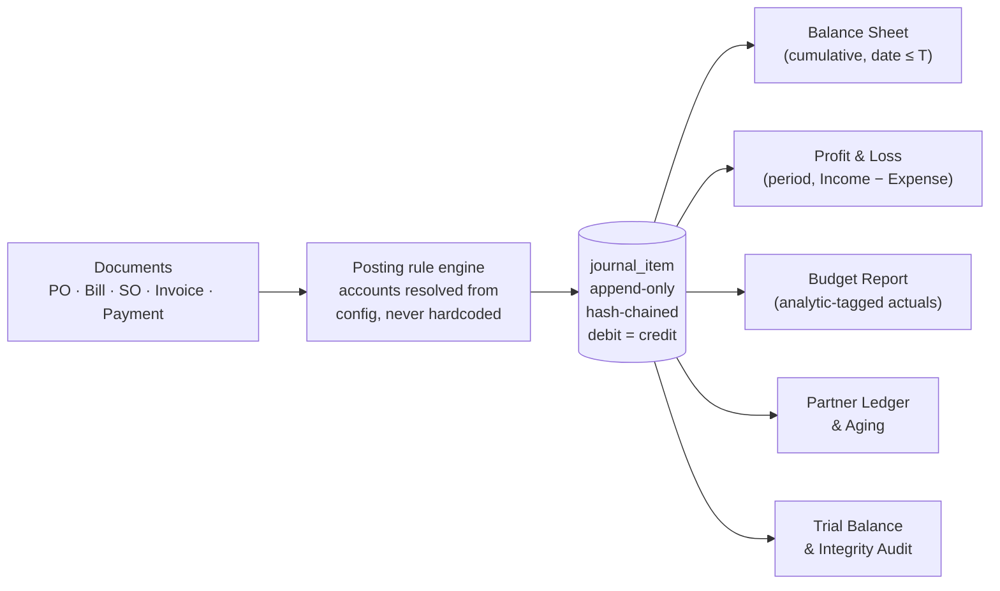

# The Demo Script and Judge Q&A

This section is a **performance script**, not an explanation. Read it once slowly the night before, then read only the boxed lines and the cheat sheet on the last page before you present.

Two things you must accept before reading further:

1. **The demo is the scoring surface.** A judge will spend five minutes with you and maybe sixty seconds looking at your code. Whatever you fail to show did not get built, as far as the score is concerned.
2. **Your competition is not other people's features. It is the judge's boredom.** An Odoo judge has looked at debit/credit tables professionally for years. Roughly 70–80% of the accounting submissions in the room will be an invoice CRUD app with a pretty table, and the judge will have seen four of them before reaching you. Your job in the first 30 seconds is to make them sit up, and the only way to do that is to prove your architecture is real before you show a single form.

---

## 10.0 Vocabulary you must be able to say without hesitating

You cannot present this project confidently if any of these words make you pause. Each one takes ten seconds to learn and each one is worth points, because an Odoo engineer's ears physically prick up when a student team uses them correctly.

| Word | What it means, in one plain sentence | When you say it in the demo |
|---|---|---|
| **Journal item** (a.k.a. ledger line) | One row saying "account X was debited ₹N" or "account X was credited ₹N". The single smallest fact in the whole system. | Cold open: "every number comes from one table — `journal_item`." |
| **Journal entry** | A group of journal items that belong to one event. Its debits must equal its credits. | Every time you post something. |
| **Debit / Credit** | Two columns. For an asset or an expense, a debit makes it bigger. For income, a liability, or capital, a credit makes it bigger. That is the whole rule. | When reading out a posted entry. |
| **Posting** | Turning a document (an invoice, a bill, a payment) into journal items. Before posting, a document is just a piece of paper. After posting, it is in the books. | "Confirm posts it." |
| **Derived** | The report is *calculated on the fly* by adding up journal items. Nothing is stored as a total anywhere. | The single most important word in your demo. |
| **Residual** | How much of an invoice is still unpaid, calculated as total minus everything reconciled against it. Never a stored `paid = true` flag. | Partial payment beat. |
| **Reconciliation** | Linking a payment to the specific invoice(s) it settles. | Bank statement beat. |
| **Reversal entry** | You cannot delete a posted entry, so you post a mirror-image entry that cancels it. Both stay in the books forever. | Control moment. |
| **Lock date** | A date before which nobody may post anything, because that period is closed and filed. | Control moment. |
| **Analytic account** | A tag (project / department) put on a line so you can measure a budget without touching the real accounts. The mockup calls this "Budget Analytics". | Budget beat. |
| **Current-year earnings** | This year's profit, shown on the Balance Sheet inside the capital side. This is the number that makes a Balance Sheet balance. | Reports beat — the "that's why it balances" line. |
| **Trial balance** | Add up every debit in the system, add up every credit. The difference must be exactly zero. | Cold open. |

> **If you remember one sentence from this whole section, remember this one, and say it out loud in the first fifteen seconds:**
> **"Every number you are about to see is derived from one append-only table of journal items. Nothing in this app adds up invoices to produce a report."**

---

## 10.1 The numbers you are demoing with

Your seed script (see the seed-data section) loads roughly five and a half months of trading history for Urban Furniture — 1 April 2026 to 15 September 2026 — so that every report has depth from the first second. **Do not demo on an empty database.** A Balance Sheet with three rows and two zeros is the fastest way to lose a judge.

Here is the exact state your seed should produce, and it ties to the paisa. Verify it once, then memorize it.

### Opening state (before you touch anything on stage)

| Assets | ₹ | Liabilities & Capital | ₹ |
|---|---:|---|---:|
| Bank A/c | 6,15,000 | Creditors A/c | 74,000 |
| Cash A/c | 65,000 | Output GST A/c | 1,08,000 |
| Debtors A/c | 2,58,000 | **Total Liabilities** | **1,82,000** |
| Input GST A/c | 54,000 | Capital A/c | 6,00,000 |
| | | Current-Year Earnings | 2,10,000 |
| **Total Assets** | **9,92,000** | **Total Liabilities + Capital** | **9,92,000** |

Current-Year Earnings of ₹2,10,000 is not typed in anywhere. It is Income ₹6,00,000 minus Purchase Expense ₹3,00,000 minus Other Expense ₹90,000, computed live from the same journal items. That is the sentence that wins the "does it really balance" question.

Also live at the start:

- **41 journal entries, 352 journal items, Trial Balance ₹0.00.**
- Budget **"Q2 Furniture Procurement"**, period 01-Jul-2026 to 30-Sep-2026, analytic account **Project 1**, planned (the mockup calls this field *Committed Amount*) **₹1,60,000**, achieved so far **₹1,48,000**, remaining **₹12,000**.
- Three open customer invoices in the 0–30 day age bucket.

### What each beat of the demo changes

Track these; a judge who is paying attention will do the arithmetic with you, and being able to predict the next number out loud is enormously convincing.

| Beat | Entry posted | Assets after | Liab + Capital after |
|---|---|---:|---:|
| Start | — | 9,92,000 | 9,92,000 |
| Cold open manual JE | Dr Cash 50,000 / Cr Capital 50,000 | 10,42,000 | 10,42,000 |
| Vendor bill (12 of 20 chairs) | Dr Purchase Exp 14,400 / Dr Input GST 2,592 / Cr Creditors 16,992 | 10,44,592 | 10,44,592 |
| Vendor payment ₹10,000 by bank | Dr Creditors 10,000 / Cr Bank 10,000 | 10,34,592 | 10,34,592 |
| Customer invoice (5 chairs) | Dr Debtors 47,200 / Cr Sales 40,000 / Cr Output GST 7,200 | 10,81,792 | 10,81,792 |
| Bank statement reconciled (₹2,05,200 received) | Dr Bank 2,05,200 / Cr Debtors 2,05,200 | **10,81,792** | **10,81,792** |

> **Say this on the last row — it is a free point and almost nobody thinks of it:**
> "Notice total assets did not change when the money came in. A customer receipt just moves value from Debtors to Bank. Only the shape of the balance sheet changed, not its size."

Final P&L for the year to 15-Sep-2026, after the demo transactions:

| P&L line | ₹ |
|---|---:|
| Income from Sales | 6,40,000 |
| Purchase Expense | 3,14,400 |
| Other Expense | 90,000 |
| **Net Income** | **2,35,600** |

And ₹2,35,600 is exactly the Current-Year Earnings figure sitting inside the capital column of the Balance Sheet at the end of the demo. **That single equality is your strongest 8-second proof.**

> ⚠️ **Housekeeping:** these are target figures. Run your final seed script at T-2 hours, open the Books Integrity page, and if any number differs, rewrite it in the cheat sheet at the end of this section by hand. Never quote a number on stage that you have not personally seen on the screen that morning.

---

## 10.2 Pre-demo setup — do this at T-15 minutes, every single time

A demo dies in the first ten seconds because a tab was on the wrong page. Set the stage physically.

**Browser window A (main, the one being projected)**

1. Tab 1 — **Books Integrity** page, already logged in as Admin, audit *not yet run*.
2. Tab 2 — **Purchase Order** list, filtered to Draft.
3. Tab 3 — **Sales Order** list.
4. Tab 4 — **Bank Statement Import** page, file picker ready, `bank_statement_15sep.csv` on the desktop, visible, named exactly that.
5. Tab 5 — **Balance Sheet**, year 2026, already rendered.
6. Tab 6 — **Budget Report**, list view showing the pie chart column.

**Browser window B (a second window, small, parked on the right of the screen)**

7. **Balance Sheet** on a live-refresh view. This is the window that visibly moves when you post the manual entry in the cold open. Split-screen the two windows for the first 35 seconds.

**Terminal**

8. One terminal, large font (18pt minimum), cleared, with two commands already typed into shell history so you only press ↑:
   - the `curl` that posts a deliberately unbalanced journal entry to your API,
   - the `UPDATE journal_item SET debit = 99999 WHERE id = ...` tamper command for the finale.

**Checklist**

- [ ] Seed script re-run, Books Integrity shows Trial Balance 0.00.
- [ ] Zoom level 110–125%. Judges stand two metres away.
- [ ] Notifications off, phone silent, Wi-Fi confirmed or app running on localhost.
- [ ] `bank_statement_15sep.csv` on the desktop and **not yet imported** (importing twice is the classic disaster — keep a pristine copy in a backup folder).
- [ ] Screen recording of the full 5-minute run saved locally as insurance. If live fails, you play the recording and narrate over it without apologising. Say: "I have it running here as well — let me talk you through it live from the recording so we don't lose your time."
- [ ] Rehearsed to **4:30**, not 5:00. Every demo runs long under adrenaline.

---

## 10.3 The 5-minute demo script

**Rules being honoured here, and why:**

| Rule | Why |
|---|---|
| Never open with master-data CRUD | Contacts and Products forms are the four most boring minutes at the hackathon and every other team will spend them. |
| Open by proving the architecture is real | It inverts the burden of proof. After 30 seconds, every number you show is trusted, and every other team in the room now has to prove theirs. |
| Protect the loudest 45 seconds | That is the bank reconciliation, 2:20–3:05. Nothing may be allowed to eat into it. |
| End on proof, not on a form | Last image on screen = Trial Balance ₹0.00, not a half-filled input box. |
| Never fill in a form on stage | Typing is dead air. Use seeded records and pre-filled drafts, and click Confirm. |

---

### [0:00 – 0:35] COLD OPEN — establish trust, not features

**On screen:** split view. Left = Books Integrity page. Right = small Balance Sheet window.

> "Urban Furniture Accounting. Before I show you anything, I want to show you that it's real, because in accounting that's the only question that matters.
> Every number in this app comes from one table — `journal_item`. Nothing is summed from invoices."

**Click: `Run Audit`.**

The page prints, in about a second:

```
352 journal items across 41 entries
Every entry re-verified: debits = credits          ✔
TRIAL BALANCE                                 ₹ 0.00
Assets 9,92,000  =  Liabilities 1,82,000  +  Capital 8,10,000   ✔
Hash chain over posted items                    VALID
```

> "Trial balance is zero across 352 lines. Assets equal liabilities plus capital, to the paisa. That's recomputed right now, not stored."

**Switch to terminal. Press ↑, Enter.** A `curl` fires an unbalanced entry (debit 5,000, credit 4,000) at your REST API.

```
HTTP/1.1 422 Unprocessable Entity
{"error":"journal_entry_must_balance","debit":5000.00,"credit":4000.00,"difference":1000.00}
```

> "That's not a UI check. That's a database constraint called `journal_entry_must_balance`. You cannot get an unbalanced entry into this system through any door."

**Back to the browser. Open the pre-saved draft manual journal entry** (Dr Cash ₹50,000 / Cr Capital ₹50,000) **and click Post.** Point at the right-hand window.

> "Manual journal entry — the owner puts fifty thousand of his own cash in. Watch the Balance Sheet on the right."

Cash 65,000 → **1,15,000**. Capital 6,00,000 → **6,50,000**. Total 9,92,000 → **10,42,000**, both sides.

> "It moved, because the report is a query over the ledger. In most systems built this weekend, a manual entry will change nothing, because their reports read the invoice table."

*That last sentence is the most valuable eleven words in the demo. Say it lightly, not smugly.*

---

### [0:35 – 1:35] FLOW 1 — Purchase, end to end, including the awkward bits

**On screen:** Purchase Order `PO0007`, pre-filled, vendor **Azure Furniture**, 20 Wooden Chairs @ ₹1,200, Budget Analytics = **Project 1**.

**Click Confirm.** A warning dialog appears:

```
⚠ Exceeds Approved Budget
The entered amount is higher than the remaining budget amount for this
budget line. Consider adjusting the value or revise the budget.
                                        [ Cancel ]   [ Confirm Anyway ]
```

> "The mockup asks for a non-blocking budget warning. Remaining budget on Project 1 is ₹12,000; this order is ₹24,000. It warns, and it still lets me through — because a purchase manager can have a reason. Blocking here would be wrong."

**Click Confirm Anyway.**

**Click `Create Bill`.** The bill opens pre-filled from the PO — vendor, product, price, quantity carried forward. **Change quantity from 20 to 12.**

> "We received twelve of the twenty. So we bill twelve. The purchase order stays open with eight still billable — it isn't a one-shot clone."

**Click Confirm on the bill.** Then **click the `Explain` panel** next to the generated journal entry.

```
Rule: vendor_bill_post
  Journal          → Purchase (forced by document type)
  Accounting date  → 15-Sep-2026 (taken from the bill, not from today)
  Line 1 account   → Product "Wooden Chair" → Category "Furniture"
                     → expense_account = Purchase Expense A/c   Dr 14,400
  Tax GST18 (exclusive) → tax.paid_account = Input GST A/c       Dr  2,592
  Counterpart      → Journal PURCHASE.default_credit_account
                     = Creditors A/c                             Cr 16,992
  Analytic         → Project 1, 100%, on the expense line only
  Rounding difference                                            ₹0.00
```

> "That panel is the answer to the question you were about to ask me. Nothing here is an `if` statement. Every account was looked up from configuration — journal defaults, product category, tax setup. If you change any of those, the next bill posts differently."

**Click Pay. The payment wizard opens with Partner and Amount pre-filled (₹16,992). Change amount to ₹10,000, Payment Via = Bank, Confirm.**

The bill badge flips from **Not Paid** to **Partial**, Amount Due shows **₹6,992**.

> "Partial payment. That badge is computed from what's actually reconciled against this bill — there is no `paid` checkbox anywhere in the schema. And the Creditors line on the Balance Sheet just dropped by ten thousand."

*Point at the **PO smart button** at the top-right for one second.*

> "That button only exists because this bill came from a purchase order. On a bill typed in fresh, it's hidden."

---

### [1:35 – 2:20] FLOW 2 — Sale

**On screen:** Sales Order `SO0006`, customer **Nimesh Pathak**, 5 Office Chairs @ ₹8,000, GST 18%.

**Click `Create Invoice`.** The invoice opens with customer, product, price and quantity carried across, number **INV/2026/0009**, Chart of Accounts column already defaulted to **Sales Income A/c**.

> "Invoice number is a real per-year sequence, allocated when the document is posted — not a database auto-increment, because audit rules don't allow gaps in a numbered book."

**Click Confirm.** Journal entry appears in the Journal Entries list, status **Posted**:

| Account | Partner | Debit | Credit |
|---|---|---:|---:|
| Debtors A/c | Nimesh Pathak | 47,200 | |
| Sales Income A/c | | | 40,000 |
| Output GST A/c | | | 7,200 |

> "Forty-seven thousand two hundred owed to us, forty thousand of income, seven thousand two hundred of GST we're holding for the government. Balanced. And the journal is forced to Sales — a customer invoice can't be posted into a purchase journal even by mistake."

---

### [2:20 – 3:05] THE LOUD 45 SECONDS — bank statement import and auto-reconciliation

> 🏷️ **This is an addition beyond the spec.** The PDF and mockup only require "Register payment against bill/invoice". Bank import earns its place because it is the flagship feature of real accounting software, it is a genuine ranking algorithm you can show code for, roughly zero other teams will attempt it, and it is the only visually exciting 45 seconds this domain offers. Say the word "addition" if asked — do not pretend it was required.

**On screen:** Bank Statement Import.

> "Customers don't pay one invoice at a time and they don't tell you which invoice they're paying. This is this morning's bank statement."

**Drop in `bank_statement_15sep.csv`.** Eight lines of genuinely messy Indian bank narration:

```
15/09/2026, 47200.00, CR, NEFT/N PATHAK/INV-2026-0009
15/09/2026, 62000.00, CR, UPI CR 16992 AZURE FURN RTN
14/09/2026, 35000.00, CR, IMPS/JOEY WILLS/PART PMT
14/09/2026, 28500.00, CR, RTGS OPEN WOOD ENTERPRISE
...
```

The matcher runs on screen. Each row shows the **candidate invoice, a confidence percentage, and the signals that produced it**:

| Statement line | Matched to | Confidence | Why |
|---|---|---:|---|
| NEFT/N PATHAK/INV-2026-0009 | INV/2026/0009 | 99% | reference token exact + amount exact + partner match |
| UPI CR 16992 AZURE FURN RTN | INV/2026/0004 | 94% | amount exact + partner trigram 0.86 |
| IMPS/JOEY WILLS/PART PMT | INV/2026/0006 | 78% | partner match, amount is partial — 2 candidates |

> "Six of eight matched automatically above ninety-two percent. Two are ambiguous, so it refuses to guess and gives me ranked options."

**Pick the correct one on the ambiguous row. Click `Reconcile All`.**

Payments post. Invoice badges flip to Paid and Partial. **Debtors falls from ₹3,05,200 to ₹1,00,000. Bank rises by ₹2,05,200.** The receivables aging report drains its 0–30 bucket.

> "Every one of those is a real posted payment — debit Bank, credit Debtors — and every invoice's residual just recomputed. Total assets are unchanged, because a receipt only moves money between two asset accounts."

*If asked about AI here, one line only, and then move on:*

> "The narration parsing uses an LLM for the messy ones — it reads text and proposes a match. It never touches a number. The amounts, the accounts and the posting are all deterministic code."

---

### [3:05 – 3:55] REPORTS — drill down, then time travel

**Open the Balance Sheet.**

**Drill-down, done in silence, roughly 15 seconds, four clicks:**

`Debtors ₹1,00,000` → Partner Ledger (6 customers) → `Nimesh Pathak` running balance → `INV/2026/0009` → its journal entry → the payment that cleared it → the bank statement line it came from.

> "Every number in every report is clickable, all the way down to the bank line it came from. There are no dead ends, because there's nothing at the bottom except journal items."

**Now grab the as-of date slider and drag it from 15 September back to 30 April.**

> 🏷️ **Addition.** Not in the spec (the spec asks only for a year filter). It costs almost nothing once your reports are pure functions of `date <= T`, and it is the only cinematic moment in accounting.

The whole Balance Sheet re-derives and animates: Debtors climbs, Bank drops, Capital holds flat at 6,00,000.

> "This isn't cached and it isn't four saved snapshots. Dragging that changes one WHERE clause — journal items dated on or before that day — and the entire statement re-aggregates. You can only do that if the ledger is the source of truth."

**Open the P&L, year 2026.**

| | ₹ |
|---|---:|
| Income from Sales | 6,40,000 |
| Purchase Expense | 3,14,400 |
| Other Expense | 90,000 |
| **Net Income** | **2,35,600** |

**Point at 2,35,600. Switch to the Balance Sheet. Point at Current-Year Earnings: 2,35,600.**

> "Same number, computed independently by two different queries. That is *why* the balance sheet balances — profit belongs to the owner, so it sits on the capital side. A system that doesn't compute this can never make assets equal liabilities plus capital."

**Click Print → the PDF downloads.** One second, no commentary needed beyond:

> "Both statements print, as specified."

**Open the Budget Report.** List view with the per-row pie chart; toggle to kanban and back in one second.

| Analytic | Type | Committed (planned) | Achieved | Achieved % | To Achieve | Open PO |
|---|---|---:|---:|---:|---:|---:|
| Project 1 | Expense | 1,60,000 | 1,62,400 | 101.5% | −2,400 | 9,600 |

> "The bill we posted a minute ago pushed this budget over. Achieved is computed from journal items tagged with this analytic account inside the budget period — and clicking the achieved amount opens every bill that made it up. The last column is ours: eight chairs still on an open purchase order, ₹9,600 already promised but not yet billed. 84% of the quarter has elapsed and 101.5% of the budget is spent."

*Optional 5 seconds if you are ahead of time: click Revise, show the new budget record created with "Q2 Furniture Procurement Revised", the old one moved to Revised state, and the two-way link.*

---

### [3:55 – 4:35] THE CONTROL MOMENT — do what they expect you to be unable to do

**Open the posted invoice INV/2026/0009.**

> "This invoice is posted. Look for the Edit button."

*Pause for one beat. There isn't one.*

> "In accounting you never change history. So what does cancel do?"

**Click Cancel.** The system generates a new journal entry titled **REVERSAL of INV/2026/0009**, with debits and credits mirrored, dated today. Both entries stay in the Journal Entries list.

> "It posts the opposite entry. The original stays in the ledger forever, the reversal sits next to it, and the reports self-correct — Debtors just fell by 47,200 without anybody deleting a row."

**Open Settings → Lock Date. Set 31-Mar-2026. Try to post a journal entry dated 15-Mar-2026.**

```
✖ Cannot post: period locked. Books locked up to 31-Mar-2026 by Admin.
```

> "Once a period is filed you close it. Nothing can be posted behind that date."

**Now the self-attack. Switch to the terminal, press ↑, Enter:**

```sql
UPDATE journal_item SET debit = 99999 WHERE id = 217;
```

> "That's me, going around my own application, straight into the database, changing a posted amount."

**Back to Books Integrity. Click Run Audit.**

```
✖ HASH CHAIN BROKEN at journal_item #217
   expected sha256 3f9a…c21e
   found    sha256 be07…44d9
   first tampered position: entry JE/2026/0038, line 2
```

> "Every posted line stores a hash of itself plus the hash of the line before it. Change one paisa anywhere in the history and the chain breaks and names the exact row. Odoo ships this for fiscal compliance in France and Germany, and this is the same idea."

**Restore the row. Re-run. Green.**

---

### [4:35 – 5:00] CLOSE — end on proof

**One slide, ten seconds, then back to Books Integrity.**



> "Documents go through one posting engine. It writes journal items. Every report — all of them — is an aggregation of that one table. That's why the books tie, that's why the date slider works, and that's why a manual entry shows up everywhere it should.
> Next up: GSTR-1 and 3B export, e-invoice IRN, multi-currency with revaluation, and automated year-end close.
> Thank you."

**Final frame on screen: Books Integrity, Trial Balance ₹0.00, hash chain VALID.**

---

### Cuts if running long — in this exact order

Rehearse the cuts too. Deciding what to drop while presenting is how demos collapse.

1. Budget **Revise** flow (5s)
2. Budget pacing / projected-overrun commentary (10s)
3. The **lock date** demonstration (12s) — keep the reversal, cut the lock
4. Partial-billing remainder commentary on the PO (10s) — still bill 12, just don't explain it
5. The PDF print click (5s)
6. The **portal login** if it was ever in your run (30s)
7. The kanban/list view toggle (5s)

**Never cut, under any circumstances:**

- The cold-open integrity proof and the 422 from the terminal
- The manual journal entry moving the Balance Sheet
- The bank reconciliation
- The as-of date slider
- P&L Net Income = Balance Sheet Current-Year Earnings
- The reversal on cancel

---

## 10.4 The 60-second version — a judge walks up mid-build

They are standing, they have one minute, they will interrupt. Do not sit them down. Do not open a menu. Four beats, sixty seconds, one hand on the mouse.

**[0:00–0:15] Books Integrity, click Run Audit.**

> "Urban Furniture accounting. Every report in here is derived from one table of journal items — nothing is summed off invoices. That's 352 ledger lines, trial balance zero, assets equal liabilities plus capital to the paisa, computed right now."

**[0:15–0:30] Post the pre-saved manual entry, Dr Cash 50,000 / Cr Capital 50,000, with the Balance Sheet visible.**

> "Manual journal entry, straight into the ledger. Watch the balance sheet — cash up fifty thousand, capital up fifty thousand, both totals move. In an app whose reports read the invoice table, this changes nothing."

**[0:30–0:50] Drag the as-of date slider from September back to April.**

> "And because every report is just a filter on that ledger by date, I get this for free — that's the balance sheet re-deriving at any date in the past. Not cached, not snapshots."

**[0:50–1:00] Close.**

> "The whole build is the spec — purchase order to bill, sales order to invoice, payments, budgets, the three reports — sitting on a real double-entry ledger instead of next to one. Come back at the end and I'll show you the bank statement auto-reconciliation and the tamper detection."

*You just gave them a reason to return. That is the actual goal of the 60-second version.*

---

## 10.5 The 3-minute version

Use this when a judge has time but not a full slot, or when the schedule slips and you are told "you have three minutes".

| Time | Beat | What you cut versus the 5-minute run |
|---|---|---|
| 0:00–0:30 | Cold open: Books Integrity + terminal 422 + manual JE moves the Balance Sheet | Nothing — this is sacred |
| 0:30–1:00 | **Sale flow only**: SO → Create Invoice → Confirm → show the posted entry and the Explain panel | Drop the entire purchase flow, the PO budget warning and the partial payment |
| 1:00–1:45 | Bank statement import and Reconcile All | Nothing |
| 1:45–2:25 | Balance Sheet: 4-level drill-down, then the as-of slider, then P&L Net Income = Current-Year Earnings | Drop the budget report and PDF print |
| 2:25–2:50 | Control moment: no Edit button, Cancel → reversal, then the terminal tamper and broken hash chain | Drop the lock date |
| 2:50–3:00 | One-sentence close on the architecture diagram, final frame Trial Balance 0.00 | Drop the roadmap |

**The one-sentence close for the 3-minute version:**

> "One posting engine, one append-only ledger, every report an aggregation of it — which is why the books tie, why I can time-travel the balance sheet, and why the system catches me when I tamper with it."

---

## 10.6 Judge Q&A

The format below is: **the question as they will actually phrase it**, then **words you can say**. Say them in your own voice, but keep the structure — *lead with the direct answer, then one piece of evidence, then offer to show it.* Never start an answer with "so basically".

### A. The trust questions (they will ask at least two of these)

**Q1. "Did you hardcode this?"**

> "No, and there's a panel that proves it. Every posted entry has an Explain button that prints the rule trace — which journal default, which product category account, which tax account produced each line. Nothing in the posting engine is an if-statement on document type. Want to change the Sales journal's default receivable account right now and post an invoice?"

**Q2. "What happens if I change a journal's default account?"**

> "The next document posted through that journal uses the new account. Let me do it." *(Chart of Accounts → create `Debtors – Retail A/c` (Asset) → Journals → Sales → Default Account = that → post a new invoice → the entry now credits... shows the new debit account. Then open Explain and point at the line that names the journal.)*
> "Documents already posted don't move, and that's deliberate — history doesn't change retroactively when configuration changes. That's how real accounting systems behave."

*Rehearse this one. It is the single most likely deep probe from an Odoo engineer, and it takes 25 seconds to demonstrate.*

**Q3. "Does your Balance Sheet actually balance? Add it up for me."**

> "It does, and it isn't luck. Total assets ₹10,81,792. Liabilities ₹1,96,192 plus capital ₹8,85,600 — same figure. The reason it ties is that the capital side includes Current-Year Earnings, ₹2,35,600, which is Income minus Expenses computed live from the same ledger. And here's the same number on the P&L. If I'd built the balance sheet by adding up invoices, those two would drift apart the first time anybody posted a manual entry."

**Q4. "What if I post a manual journal entry — say debit Cash five lakh, credit Capital five lakh?"**

> "Please do. Type it in yourself." *(Hand them the keyboard. This is the strongest move available to you.)*
> "It's already reflected — cash up five lakh, capital up five lakh, both totals moved. Manual entries are not a side channel in this system; they're the *only* channel. Invoices and bills are just convenient ways of writing journal entries."

**Q5. "Show me an unbalanced entry being rejected."**

> "Three layers. The UI disables Post while debit ≠ credit. The service layer rejects it. And there's a database check constraint — here's `curl` firing an unbalanced entry straight at the API, bypassing the UI entirely: 422, constraint name `journal_entry_must_balance`. There is no path into the ledger that skips it."

**Q6. "How do I know your seed data isn't just hand-crafted numbers that happen to tie?"**

> "Because the seed script doesn't insert journal items — it creates documents and calls the same posting engine you just watched. Nothing in the seed writes to `journal_item` directly. And the integrity audit recomputes the trial balance from scratch every time you click it; it isn't a stored total."

### B. The accounting-correctness questions (an Odoo engineer's home turf)

**Q7. "Can you pay half an invoice?"**

> "Yes, and partial is the normal case in the design, not a special case. This bill is ₹16,992; I paid ₹10,000; the badge is Partial and the residual is ₹6,992. There is no boolean `paid` column in the schema — residual is total minus the sum of everything reconciled against it, so it's always right, including if I unreconcile. Want me to pay ₹3,000 more and watch it move to ₹3,992?"

**Q8. "Can I overpay, or pay one payment across three invoices?"**

> "Yes. Payment and invoice are linked through an allocation table, not a foreign key on the invoice — one payment can settle several invoices and one invoice can receive several payments. Overpaying leaves the excess as an unallocated credit on the customer, which the next invoice offers to use."

**Q9. "Can I edit a posted invoice?"**

> "No, and that's on purpose — there's no Edit button on a posted document. Cancel creates a reversing journal entry with mirrored debits and credits, so both the original and the reversal stay in the ledger and the reports self-correct. The instinct everyone has here is to build a Delete button, and a delete silently rewrites history — an auditor could never tell what the books said last week."

**Q10. "What happens if I delete a payment?"**

> "You can't delete a posted one. You can unreconcile it, which removes the allocation and pushes the invoice's residual back up, or you can cancel it, which posts the reversal. Both leave a trail. The invoice's Paid badge recomputes automatically because it was never a stored flag."

**Q11. "How do you handle taxes?"**

> "Tax is a master record, not a number in the code — rate, whether it applies to sales or purchases, inclusive or exclusive, and separate accounts for tax collected and tax paid. GST 18% on a sale posts Dr Debtors 47,200 / Cr Sales 40,000 / Cr Output GST 7,200. On a purchase it's the mirror — Input GST is an asset, because it's money we can claim back. Add a second tax rate and nothing in the posting engine changes."

**Q12. "Rounding — what happens when your line taxes don't add up to the document tax?"**

> "That's the classic off-by-one-paisa bug that breaks the balance constraint. We compute tax per line, round each to two decimals, then compare the sum against the document-level rounding; if they differ, the engine writes an explicit rounding-difference line to a designated account rather than fudging a line total. The Explain panel prints `rounding difference ₹0.00` on every entry so you can see the check ran."

**Q13. "Why store debit and credit as two columns instead of one signed amount?"**

> "Two reasons. The constraint I actually want to enforce is `sum(debit) = sum(credit)` per entry, which is trivial in two columns and awkward in one. And every report, ledger and printout in accounting is presented in debit/credit columns — storing it the way it's read means no sign gymnastics in report queries. Signed amounts are how you end up with a P&L where expenses are negative-negative."

**Q14. "Why is the P&L a period query but the Balance Sheet a cumulative one?"**

> "Because they answer different questions. The P&L asks 'how did we do between two dates', so it sums Income and Expense accounts inside a window. The Balance Sheet asks 'what do we own and owe *right now*', so it sums every journal item from the beginning of time up to that date, for Asset, Liability and Capital accounts. Same table, two different aggregation semantics. Teams that write `SELECT SUM(total) FROM invoices` can't express either of those correctly the moment there's an opening balance."

**Q15. "Where's Retained Earnings? You only have eight accounts."**

> "The eight accounts are the ones the mockup mandates as pre-configured seed. We're inside a single fiscal year, so this year's profit shows as Current-Year Earnings, which is a computed line, not an account. If we rolled into a second year, the report engine already separates it — everything dated before the fiscal-year start collapses into Retained Earnings and only the current year shows as Current-Year Earnings. It's one date comparison in the same query."

**Q16. "What's a lock date and do you have one?"**

> "It's a date before which no one may post, because that period has been filed. We have it — set it to 31 March and any back-dated post is refused with 'Books locked up to 31-Mar-2026 by Admin'. It's the cheapest real control in accounting and almost nobody builds it in a hackathon."

**Q17. "Prove your Debtors figure ties to the actual open invoices."**

> "Click it." *(Balance Sheet → Debtors → Partner Ledger.)* "That's ₹1,00,000 of Debtors broken into six customers, each with a running balance, and each drilling into the individual invoices and the payments against them. The report doesn't compute it from invoices — it's the sum of journal items on the Debtors account — and the fact that it agrees with the open invoice list is the check, not the method."

**Q18. "What if a document is still in draft — does it hit my reports?"**

> "No. Journal items exist only for posted documents. Draft is genuinely not in the books, which is why the dashboard counts Draft and Confirmed separately. It also means the invoice number is allocated at post time, not at draft time, so cancelled drafts don't leave gaps in the numbering."

**Q19. "How does the analytic tag get from the document line into the report?"**

> "It's carried onto the journal item, not read back off the document. The analytic column lives on `journal_item`, so the budget's achieved amount is a sum over tagged ledger lines. That matters for two reasons: a manual journal entry can also carry an analytic tag and it counts, and the tax line correctly doesn't — you'll notice the bill's actual was ₹14,400, the net, not ₹16,992 including GST. GST isn't a project cost; you claim it back."

**Q20. "What does 'Committed' mean on your budget report? That's ambiguous."**

> "Good catch, and we kept both meanings on purpose. The mockup's field labelled *Committed Amount* is the planned amount — what you approved. We kept that name because it's the organizers' word. Then we added a separate column called **Open PO** for the other, real meaning — money promised on confirmed purchase orders that haven't been billed yet. ₹9,600 here, the eight chairs still to come. Planned, encumbered, actual, remaining — that's the full picture a budget owner needs, and confusing the first two is a bug we deliberately avoided by never using one word for both."

**Q21. "Your budget warning let me exceed the budget. Isn't that a bug?"**

> "It's the spec, and it's also correct. The mockup states the warning is non-blocking, on both the purchase order and the bill. The business reason is real — a buyer may have authority to exceed, and hard-blocking a purchase order at 5pm on a Friday is how people start keeping spreadsheets outside the system. So it warns loudly, records the overrun, and turns the budget line red. The blocking validation is on the journal entry itself, where correctness is not negotiable."

### C. The engineering questions

**Q22. "Why did you choose this stack?"**

> "Next.js and PostgreSQL. Three reasons, in order. First, the accounting rules live in the database, not the app — check constraints for debit-equals-credit, a unique index for the numbering sequence, transactions for atomic posting. Postgres enforces things my code can't accidentally skip. Second, this spec is around 35 screens with an identical list-and-form pattern, so one reusable scaffold generates most of them — that's a framework choice about volume, not taste. Third, it's the stack I'm fastest in, and with 24 hours the ability to debug something at 3am beats any theoretical advantage."

**Q23. "Why didn't you just build this as an Odoo module?"**

> "The brief is to build the system, not to configure Odoo — if I'd built it in Odoo, the ORM would have given me half the things you're checking me on for free, and you'd have no way to tell whether I understood them. Building the ledger from scratch is precisely what makes the posting engine, the balance constraint and the report derivation my work rather than the framework's."

**Q24. "What is the hardest part of what you built?"**

> "The posting engine, and specifically making it configuration-driven instead of a switch statement. The easy version is: if it's an invoice, debit Debtors and credit Sales. That works and it's dead. The real version resolves every account by lookup — journal default, product category, tax configuration, partner — so changing a setting changes the accounting. The second hardest was payment allocation, because the moment you allow partial and multi-invoice payments, every 'is this paid' answer has to become a derived number, and if you get that wrong at hour four you can't retrofit it at hour twenty."

**Q25. "What if two people post at the same time?"**

> "Posting runs in a single database transaction that takes a row lock on the sequence for that journal and year, allocates the next number, writes the entry and its items, and commits. Two simultaneous invoice posts serialize on that lock, so you get 0009 and 0010, never two 0009s and never a gap. A unique index on (journal, fiscal year, number) is the backstop — if the lock logic were ever wrong, the second insert fails loudly instead of quietly duplicating."

**Q26. "How do you know it's right? Did you test it?"**

> "There's a property test that matters more than unit tests here: after every posting operation, re-run the trial balance and assert it's zero. It runs over the whole seed data set, and it's the same code path as the Run Audit button you saw — so the audit isn't a demo prop, it's the test suite exposed in the UI. Beyond that, the three-layer balance check means a bug in the engine surfaces as a failed insert, not as wrong numbers."

**Q27. "Where does AI actually help? Or is it a gimmick?"**

> "There's one hard rule: **AI never touches a number.** It reads text and proposes; deterministic code decides and posts. Concretely, it does two jobs. One, it parses bank statement narrations — 'UPI CR 16992 AZURE FURN RTN' is not something a regex handles well across banks — and proposes a partner and a reference; the actual matching, amount comparison and posting are ordinary code with a confidence score you can see. Two, natural-language search over the ledger — 'show me everything on Project 1 in August' becomes a filter, and the query it built is displayed so you can check it. If you unplug the API key, the app still balances, still posts and still reports. That's the test of whether AI is a gimmick."

**Q28. "How is this different from the other teams doing this problem?"**

> "Most implementations of this brief have a journal entry table that gets written to and read by nothing — the reports are `SELECT SUM(total) FROM invoices`. It looks identical to mine in a scripted demo and it falls apart the second you post a manual entry or ask whether the balance sheet ties. My whole architecture is the opposite direction: documents write to the ledger, and every report, including the budget, is an aggregation of it. Everything else I showed you — the date slider, the drill-down, the tamper detection — is a consequence of that one decision, not a separate feature."

**Q29. "What would you build next?"**

> "In order: GSTR-1 and GSTR-3B export, because that's what actually makes this usable for an Indian business; e-invoice IRN generation; multi-currency with foreign-exchange revaluation at period end; and automated fiscal year close that rolls Current-Year Earnings into Retained Earnings and posts the closing entry. After that, bank feeds instead of CSV upload. None of those need a schema change, which is the point — they're all new readers and writers of the same ledger."

**Q30. "What's missing / what would you do differently?"**

*Answer honestly and specifically. Vagueness here reads as not knowing your own build.*

> "Three things. There's no multi-company or multi-currency — one company, rupees only, and the schema would need a currency and rate table to change that. Analytic distribution is 100% to one account per line rather than a percentage split across several. And the stock side is a movement ledger with moving-average cost, but I don't post a cost-of-goods-sold entry on a service product, which is correct but means the gross-margin report is only meaningful for goods. I'd rather tell you those than have you find them."

**Q31. "Can a portal customer see someone else's invoice?"**

> "No. Portal access is filtered at the query level by the contact linked to that login, not by hiding buttons in the UI. Changing the invoice id in the URL returns a 404, not someone else's invoice — I can show you that in five seconds."

**Q32. "Show me the schema."**

> "The centre of it is three tables. `journal_entry` — date, journal, reference, state. `journal_item` — entry, account, partner, analytic, debit, credit, and the hash. `payment_allocation` — payment, invoice, amount. Everything else is master data feeding those, and every report is a query over `journal_item` joined to `account` on account type. If you removed every document table tomorrow, the books would still be complete and every report would still work. That's the test I designed to."

---

## 10.7 Things to NEVER say

Each of these costs you real points. Some of them cost you the round.

| Never say | Say instead |
|---|---|
| "That part is hardcoded for the demo." | Nothing is. If something genuinely is, don't show it. |
| "We didn't have time for that." | "That's out of scope for this build — it's the next thing on the list, and it doesn't need a schema change." |
| "It should work…" | Either it works and you show it, or you move on. Never narrate uncertainty. |
| "Let me just create a contact first…" *(then typing a form on stage)* | Everything is pre-seeded. Never fill in a form live. Typing is dead air and dead air is where a judge starts reading their phone. |
| "This is basically Odoo but simpler." | "Odoo solves this with a posting engine and an immutable ledger; that's the architecture I built." Never invite a direct comparison you will lose. |
| "I'm not sure how that works, my teammate built it." | You are a team of one plus an AI. You built all of it. Know all of it. |
| "It's just a hackathon project." | Never diminish it. The judge is deciding how seriously to take you. |
| "Sorry, this is a bit slow / sorry about the UI." | Never apologise unprompted. Judges do not notice half of what you would apologise for until you point at it. |
| "The AI generates the accounting entries." | "AI never touches a number. It reads text and proposes; the ledger decides." |
| "Our balance sheet balances because we made the seed data balance." | "It balances because Current-Year Earnings is computed from the same ledger — here's the same figure on the P&L." |
| "Let me show you the contacts module." | Never open master data unless asked. If asked: show it in 10 seconds and get back to the ledger. |
| Reading numbers off the screen in a monotone | Say what the number *means*: not "47,200" but "forty-seven thousand owed to us by Nimesh". |

**Two behavioural rules for the same list:**

- **Never click something you haven't rehearsed.** If a judge asks for something you can't do in one click, say "I can show you that — give me twenty seconds" and do it deliberately, or say "that one I'd have to walk you through in the code."
- **When something breaks, do not debug on stage.** Say "let me come back to that" once, move to the next beat, and carry on. A single calm sentence costs you nothing; two minutes of frowning at a stack trace costs you the demo.

---

## 10.8 If something goes wrong

| What breaks | What you do | What you say |
|---|---|---|
| App won't load / server died | Switch to the recorded run, keep narrating live | "I've got the run recorded here too — let me walk you through it so we don't burn your time, and I'll get you into the live one after." |
| A number looks wrong on screen | Do NOT explain it. Go to Books Integrity and run the audit. | "Let me show you the check that matters — trial balance is zero, so the ledger is consistent; that display is a filter question, not a books question." |
| Bank CSV already imported (duplicate) | You kept a pristine copy — use `bank_statement_15sep_backup.csv` | Say nothing about it. |
| A judge takes over the keyboard and breaks something | Let them. This is a gift, not a problem. | "Please — try to break it. That's the point." |
| You run out of time mid-beat | Stop where you are and jump straight to the close | "I'll leave the tamper detection — but the important thing is this last frame: trial balance zero, chain valid, every report derived from that one table." |
| Judge asks a question you cannot answer | Say so in one sentence and offer the nearest thing you *do* know | "I don't know that one honestly. What I can tell you is how the closest case works —" *(never bluff an accounting rule at an Odoo engineer; they will know)* |

---

## 10.9 ONE-PAGE CHEAT SHEET

*Print this. Fold it. Hold it. Look at it right before you start.*

### The one sentence

> **"Urban Furniture Accounting: every document posts into one append-only double-entry ledger, and every report — Balance Sheet, P&L, Budget — is derived from that ledger, never summed from invoices."**

### The four demo moments (if you only get four things right)

1. **Cold open** — Trial Balance ₹0.00 across 352 items, `curl` gets a 422 from a database constraint, manual journal entry visibly moves the Balance Sheet. *(0:00–0:35)*
2. **Bank reconciliation** — 8 messy narrations, 6 auto-matched with visible confidence and signals, Reconcile All, Debtors drains. *(2:20–3:05 — the loudest 45 seconds; protect it)*
3. **Date slider + the equality** — drag September→April and the whole Balance Sheet re-derives; P&L Net Income ₹2,35,600 = Balance Sheet Current-Year Earnings ₹2,35,600. *(3:05–3:55)*
4. **Self-attack** — no Edit button, Cancel posts a reversal, `UPDATE journal_item` from the terminal, hash chain names the broken row. *(3:55–4:35)*

### Numbers to memorize

| | ₹ |
|---|---:|
| Opening Total Assets = Liabilities + Capital | 9,92,000 |
| Closing Total Assets = Liabilities + Capital | 10,81,792 |
| Closing Liabilities | 1,96,192 |
| Closing Capital + Current-Year Earnings | 8,85,600 |
| Net Income (P&L) = Current-Year Earnings (BS) | 2,35,600 |
| Journal entries / journal items / trial balance | 41 / 352 / **0.00** |
| Vendor bill posted on stage (12 chairs) | 14,400 + 2,592 GST = **16,992** |
| Paid on that bill / residual | 10,000 / **6,992** |
| Customer invoice posted on stage | 40,000 + 7,200 GST = **47,200** |
| Bank statement reconciled | 2,05,200 (Debtors 3,05,200 → 1,00,000) |
| Budget Project 1: planned / achieved / % / open PO | 1,60,000 / 1,62,400 / **101.5%** / 9,600 |

### Five sentences you can drop into any answer

1. "Every number comes from one table — `journal_item`."
2. "There's no `paid` boolean anywhere in the schema; residual is derived."
3. "Current-Year Earnings is why the balance sheet balances."
4. "You can't edit a posted entry — Cancel posts a reversal, and both stay in the ledger."
5. "AI never touches a number. It reads text and proposes; the ledger decides."

### Final pre-flight

- [ ] Seed re-run, audit green, numbers above verified this morning
- [ ] 7 tabs open in order, second window parked on the right
- [ ] Terminal cleared, both commands in shell history
- [ ] CSV on desktop, backup copy in a folder
- [ ] Recording saved as insurance
- [ ] Zoom 110%+, notifications off
- [ ] Rehearsed to 4:30
- [ ] First words memorized: *"Before I show you anything, I want to show you that it's real, because in accounting that's the only question that matters."*
